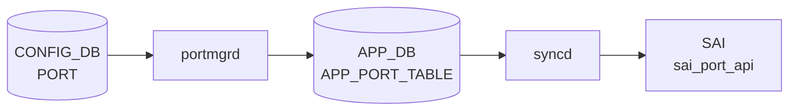

# PORT_TABLE ステータスフィールド（STATE_DB）

## 概要

`STATE_DB` の `PORT_TABLE|<port>` に書き込まれる動作状態フィールド群。**設定フィールドではなく読み取り専用の oper 状態値**であり、2 つのプロセスが書き込みを担う。

| 書き込み主体 | トリガー | 書き込みフィールド |
|------------|---------|-----------------|
| `portsyncd/linksync` | カーネル netlink RTM_NEWLINK | `state`, `netdev_oper_status`, `admin_status`, `mtu` |
| `orchagent` PortsOrch | SAI oper-status 通知 / 初期化 | `speed`, `fec`, `supported_speeds`, `supported_fecs`, `host_tx_ready`, `link_training_status`, `rmt_adv_speeds`, `phy_ctrl_unreliable_los` |

!!! note "CONFIG_DB との関係"
    ポートの **設定** は `CONFIG_DB` の `PORT` テーブルで行う。このページのフィールドは設定が ASIC / カーネルに適用された結果として STATE_DB に書き戻された **oper 状態値**。直接編集しても portsyncd / PortsOrch が上書きする。

!!! note "`oper_status` はここではない"
    ポートの SAI oper-status (`up`/`down`) は `PortsOrch::updateDbPortOperStatus()` が **APP_DB** `PORT_TABLE` に書く（STATE_DB ではない）。`sonic-swss/orchagent/portsorch.cpp:3930` 参照。

<!-- cdb-mermaid -->
### データフロー (自動生成)



!!! note "凡例"
    CONFIG_DB から SAI までの典型経路を `docs/reference/config-db-orch-map.md` から機械生成したミニ図。詳細・例外は本ページ本文と対応表を参照。
<!-- /cdb-mermaid -->

## key 構造

```text
PORT_TABLE|<name>
```

`<name>` は `Ethernet<N>` 形式の物理ポート名。`RTM_DELLINK` を受信するとエントリ全体が削除される。

## フィールド一覧

| フィールド | 型 | 書込み主体 | コード由来デフォルト | 説明 |
|-----------|----|-----------|-------------------|------|
| `state` | `"ok"` (定数) | `portsyncd/linksync` | `"ok"` | カーネルが netdev を認識済みであることを示す。エントリが存在する = `"ok"` |
| `netdev_oper_status` | `"up"` / `"down"` | `portsyncd/linksync` | カーネル `IFF_RUNNING` フラグ値 | Linux netdev の oper 状態（`IFF_RUNNING`） |
| `admin_status` | `"up"` / `"down"` | `portsyncd/linksync` | カーネル `IFF_UP` フラグ値 | Linux netdev の admin 状態（`IFF_UP`） |
| `mtu` | uint (文字列) | `portsyncd/linksync` | カーネル netdev mtu | `rtnl_link_get_mtu()` で取得したカーネル MTU 値 |
| `host_tx_ready` | `"true"` / `"false"` | `PortsOrch` | `"false"` | ホスト側 TX が ready かどうか。ポート作成時に既存値がなければ `"false"` で初期化 |
| `speed` | uint / `"N/A"` (文字列) | `PortsOrch` | `"N/A"` | oper 動作速度 [Mbps]。DOWN 時や SAI 取得失敗時は `"N/A"` |
| `fec` | string / `"N/A"` | `PortsOrch` | `"N/A"` | oper FEC モード。詳細は [fec-state.md](fec-state.md) を参照 |
| `supported_speeds` | string (CSV) | `PortsOrch` | SAI 取得値（空なら空文字） | プラットフォームがサポートする速度のカンマ区切りリスト（例: `"10000,25000,100000"`） |
| `supported_fecs` | string (CSV) / 不在 | `PortsOrch` | `"N/A"` (空集合) / フィールド不在 | サポート FEC モード。詳細は [fec-state.md](fec-state.md) を参照 |
| `link_training_status` | string | `PortsOrch` | `"off"` | リンクトレーニング状態。LT 無効 / admin DOWN / 非サポートの場合 `"off"` |
| `rmt_adv_speeds` | string / `"N/A"` | `PortsOrch` | `"N/A"` | リモート (対向) が広告する速度 (auto-neg 時のみ有効)。admin DOWN / 取得失敗で `"N/A"` |
| `phy_ctrl_unreliable_los` | `"true"` / `"false"` | `PortsOrch` | `"false"` | PHY の LOS (Loss of Signal) が unreliable かどうか。serdes 設定変更時に更新 |

## フィールド別詳細

### `state`

`portsyncd/linksync.cpp:196` で定数 `"ok"` を書き込む。エントリの存在そのものが「ポートが kernel に認識済み」を意味する。`RTM_DELLINK` でエントリが削除されるため、存在しない = ポート未認識。

### `netdev_oper_status` / `admin_status`

いずれも linksync が RTM_NEWLINK メッセージの flags から取得:

```cpp
bool admin = flags & IFF_UP;
bool oper  = flags & IFF_RUNNING;
```

- `admin_status` は CONFIG_DB `PORT.admin_status` を portmgrd が netdev に反映した結果と一致する（書込み主体は linksync であり portmgrd ではない）
- `netdev_oper_status` は物理リンクの up/down を含む Linux の oper status

### `mtu`

カーネル netdev の MTU を文字列化して書き込む。portmgrd がデフォルト `9100` を APP_DB に書き（`portmgr.h:15`、`portmgr.cpp:176`）、orchagent 経由で SAI に反映した後、SAI が kernel netdev を更新し、linksync が STATE_DB に書く。**SAI に渡す実際の値は `mtu + 22 bytes`（Ethernet ヘッダ 14 + FCS 4 + VLAN tag 4）**（MACsec ポートはさらに加算）。STATE_DB の `mtu` 値は SAI 適用後の **kernel 側の値**であり、SAI に渡した値（+22 の加算後）とは異なる点に注意。

### `host_tx_ready`

`PortsOrch::initHostTxReadyState()` がポート作成時に STATE_DB を確認し、`host_tx_ready` が空なら `"false"` を書き込む (`portsorch.cpp:2202`)。

その後の更新タイミング:

| 条件 | 書き込み値 |
|------|-----------|
| admin_status を UP に変更 かつ Gearbox status=true かつ SAI 成功 かつ CMIS async 非対応 | `"true"` |
| admin_status を DOWN に変更 (CMIS async 非対応) | `"false"` |
| SAI `set_port_attribute` 失敗 (CMIS async 非対応) | `"false"` |
| CMIS モジュール非同期対応 (`m_cmisModuleAsicSyncSupported=true`) | **更新しない** (CMIS 側で制御) |

### `speed`

`PortsOrch::updateDbPortOperSpeed()` (`portsorch.cpp:9851`) がポート oper-status UP 通知時 / `refreshPortStatus()` 時に書き込む。

```cpp
string speedStr = speed != 0 ? to_string(speed) : "N/A";
m_portStateTable.set(port.m_alias, {{"speed", speedStr}});
```

DOWN 時はフィールドが更新されない（stale 値が残留する）。

### `link_training_status`

`PortsOrch::refreshPortStateLinkTraining()` (`portsorch.cpp:11343`) が書き込む。

| 条件 | 値 |
|------|---|
| `port.m_admin_state_up=false` | `"off"` |
| `port.m_link_training == 0` | `"off"` |
| `port.m_cap_lt == 0` | `"off"` |
| LT 有効 かつ SAI RX status 取得失敗 | `"on"` |
| `SAI_PORT_LINK_TRAINING_RX_STATUS_TRAINED` | `"trained"` |
| failure status が `NO_ERROR` 以外 | failure map の文字列 |

### `rmt_adv_speeds`

`PortsOrch::updatePortStateAutoNeg()` (`portsorch.cpp:11315`) が書き込む。port type が PHY 以外は即 return。

| 条件 | 値 |
|------|---|
| `port.m_admin_state_up=false` | `"N/A"` |
| `getPortAdvSpeeds()` 失敗 | `"N/A"` |
| 成功 | SAI から取得した速度リスト（カンマ区切り） |

<!-- value-behavior -->
## 値依存挙動マトリクス

### `state` の使われ方

`portmgrd` が `isPortStateOk()` (`portmgr.cpp:86`) で `state == "ok"` を確認してから netdev 操作を実行する。STATE_DB エントリが存在しない / `state` がない場合は待機継続。

### DOWN 時の stale 値問題

| フィールド | DOWN 時挙動 |
|-----------|-----------|
| `state` / `admin_status` / `netdev_oper_status` / `mtu` | linksync が RTM_NEWLINK を受信するたびに上書き |
| `speed` | DOWN 時は更新されない。最後に UP だった時の値が残留 |
| `fec` | DOWN 時は更新されない。stale 値残留 |
| `host_tx_ready` | admin DOWN 時は `"false"` に更新 |
| `supported_speeds` | orchagent 再起動まで更新されない (lazy init) |

<!-- /value-behavior -->

<!-- defaults -->
## コード由来の暗黙デフォルト (Phase A)

> **注記**: このページのフィールドは CONFIG_DB ではなく STATE_DB に存在し、YANG スキーマで定義されていない。以下はコード精読から導出した暗黙デフォルト。

<!-- evidence: meta/_intermediate/cdb-flow/ports-status-defaults.md -->

| フィールド | コード由来デフォルト | fallback 源 |
|-----------|-------------------|------------|
| `state` | `"ok"` (定数) | `portsyncd/linksync.cpp:196` — RTM_NEWLINK 受信時に定数を書き込む |
| `netdev_oper_status` | `"up"` or `"down"` | `linksync.cpp:201` — `flags & IFF_RUNNING` の結果 |
| `admin_status` | `"up"` or `"down"` | `linksync.cpp:197` — `flags & IFF_UP` の結果 |
| `mtu` | カーネル netdev mtu (文字列) | `linksync.cpp:198` — `rtnl_link_get_mtu()` |
| `host_tx_ready` | `"false"` | `portsorch.cpp:2202` — `initHostTxReadyState()` が既存値なしの場合に強制 `"false"` を書く |
| `speed` | `"N/A"` | `portsorch.cpp:9855` — `speed == 0` の場合のフォールバック |
| `link_training_status` | `"off"` | `portsorch.cpp:11351` — LT 無効 / admin DOWN / `m_cap_lt==0` 時 |
| `rmt_adv_speeds` | `"N/A"` | `portsorch.cpp:11327` — admin DOWN または `getPortAdvSpeeds()` 失敗時 |
| `supported_speeds` | SAI 取得値 (comma-separated) | `portsorch.cpp:3170` — 空の場合は空文字列 |
| `supported_fecs` | `"N/A"` (空集合) / フィールド不在 | `portsorch.cpp:3292` / `3279-3284` |
| `phy_ctrl_unreliable_los` | `"false"` | `portsorch.cpp:5191` — `m_unreliable_los` 初期値 false |

### 検出した挙動乖離・注意点

1. **`admin_status` の二重書き込み**: CONFIG_DB `PORT.admin_status` → portmgrd → APP_DB → orchagent → SAI → kernel netdev → linksync → STATE_DB `PORT_TABLE.admin_status` という経路。STATE_DB 値は最終的なカーネル状態を反映し、CONFIG_DB 値とは非同期に更新される。

2. **`oper_status` は STATE_DB にない**: SAI oper-status (`up`/`down`) は `PortsOrch::updateDbPortOperStatus()` が APP_DB `PORT_TABLE` に書く (`portsorch.cpp:3930`)。STATE_DB ではないため `sonic-db-cli STATE_DB hget 'PORT_TABLE|Ethernet0' oper_status` では取得できない。

3. **RTM_DELLINK = 全フィールド消去**: ポートがカーネルから削除されると STATE_DB エントリ全体が `del()` される。PortsOrch が書いた `speed` / `supported_speeds` / `host_tx_ready` なども消える。

4. **`host_tx_ready` と CMIS**: `m_cmisModuleAsicSyncSupported=true` の環境（CMIS モジュール非同期対応プラットフォーム）では admin_status 変更時に `host_tx_ready` を更新しない。CMIS 側のシーケンスが完了してから別途書き込まれる。

5. **`supported_speeds` の lazy init**: `m_portSupportedSpeeds` にキャッシュされると orchagent 再起動まで SAI を再クエリしない。トランシーバ換装後も STATE_DB 値が更新されない。

<!-- /defaults -->

<!-- ordering -->
## 書込み順依存 (Phase B — コード由来)

`portsyncd/linksync` と `PortsOrch` が STATE_DB `PORT_TABLE` に書き込む際の順序依存・タイミング依存をコード精読で検出した。詳細スキャンノート: [`meta/_intermediate/cdb-flow/ports-status-ordering.md`](https://github.com/aoki-taquan/sonic-unofficial-docs/blob/main/meta/_intermediate/cdb-flow/ports-status-ordering.md)。

| # | 依存関係 | 方向 | 緩和策 / 備考 |
|---|----------|------|--------------|
| 1 | `portsyncd` PortInitDone publish → `PortsOrch` 書込み開始 | **強制先行** | `PortsOrch::doPortTask()` は `m_initDone=false` の間すべての設定処理をスキップ。`portsorch.cpp:4613-4622` |
| 2 | `linksync` RTM_NEWLINK → `state="ok"` 書込み → portmgrd / teammgrd / intfmgrd アンロック | **強制先行** | 各デーモンの `isPortStateOk()` が `state` フィールドの存在を確認してから netdev 操作・IP 設定・LAG メンバー追加を実行。`portmgr.cpp:86-100`, `teammgr.cpp:67-80`, `intfmgr.cpp:686-695` |
| 3 | SAI `create_port` 成功 → `supported_speeds` / `host_tx_ready` 書込み | **強制先行** | `initPortSupportedSpeeds()` と `initHostTxReadyState()` はポート作成直後に 1 回だけ呼ばれる。SAI 失敗時は書込み自体が発生しない。`portsorch.cpp:3090`, `portsorch.cpp:2181-2207` |
| 4 | `gBufferOrch::isPortReady()` が true → `allPortsReady()` = true | **強制先行** | バッファプロファイル未適用ポートは `m_pendingPortSet` に留まり `allPortsReady()` が false を返し続けるため、VLAN / LAG タスクも待機する。`portsorch.cpp:4779-4788` |
| 5 | warm start: PortConfigDone **かつ** PortInitDone 双方存在 → 既存データ再読込 | 原子条件 | 一方でも欠けると `cleanPortTable()` で APP_DB を全削除して cold start にフォールバックする。`portsorch.cpp:4357` |

### 主要な制約詳細

**`state="ok"` が書かれるまでの中間状態 (依存 #2)**: `portsyncd` が `PortInitDone` を publish しても、linksync の RTM_NEWLINK 受信と `state="ok"` の書込みは非同期で進む。PortsOrch が `PortInitDone` を受信して処理を開始した時点では、個別ポートの STATE_DB エントリがまだ存在しない場合がある。portmgrd は `isPortStateOk()` が false の間イベントをスキップし次周回で自動再試行するため、この中間状態はユーザーが意識する必要はないが、ログに `Port Ethernet0 is not ready` が一時的に現れることがある。

**`supported_speeds` の 1 回限り書込み (依存 #3)**: `initPortSupportedSpeeds()` はキャッシュマップ `m_portSupportedSpeeds` を確認し、エントリが存在する場合は SAI を再クエリせず早期 return する（`portsorch.cpp:3161-3163`）。トランシーバ換装後も orchagent 再起動まで STATE_DB の `supported_speeds` が更新されない理由がここにある。

<!-- /ordering -->

<!-- cross-refs -->
## 暗黙参照テーブル (Phase C)

STATE_DB `PORT_TABLE` は `portsyncd/linksync` と `PortsOrch` が**書き手**として書き込む。本セクションではこれらの書込み処理が依存する入力テーブル・読み取り先テーブルを列挙する。

| 依存方向 | 参照元 / 参照元フィールド | 参照先テーブル | 参照先キー形式 | 依存内容 | 証跡 |
|---------|------------------------|--------------|--------------|---------|------|
| 書込みトリガ（linksync） | `portsyncd/linksync` RTM_NEWLINK イベント | Linux Kernel netdev (`m_ifindexOidMap`) | `Ethernet<N>` | `m_ifindexOidMap` でポート名を解決してから `m_statePortTable.set()` を呼ぶ。マップに存在しないインタフェースは無視される | `linksync.cpp:147-160, 193-208` |
| 書込みトリガ（PortsOrch） | `PortsOrch` SAI oper-status 通知 / init | `APPL_DB PORT_TABLE` (PortConfigDone / PortInitDone フラグ) | `PORT_TABLE:PortConfigDone`, `PORT_TABLE:PortInitDone` | warm start 判定のため `m_portTable->hget("PortConfigDone", "count")` と `m_portTable->get("PortInitDone")` を確認。両フラグが揃わないと既存データ再読込を行い、欠落時は `cleanPortTable()` で cold start へフォールバック | `portsorch.cpp:4345-4386` |
| 読み出し（portmgrd） | `PortMgr::isPortStateOk()` | STATE_DB `PORT_TABLE` （本テーブル） | `PORT_TABLE\|<alias>` | `m_statePortTable.get(alias, temp)` で `state` フィールドの存在を確認。`state` がなければ netdev 設定操作（admin_status / mtu 設定）を次周回に延期する | `portmgr.cpp:86-100` |
| 読み出し（teammgrd） | `TeamMgr::isPortStateOk()` | STATE_DB `PORT_TABLE` （本テーブル） | `PORT_TABLE\|<alias>` | LAG メンバー追加前に各メンバーポートの `state` フィールドを確認。`"ok"` でなければ `doPortChannelMemberTask()` の SET 処理を中断する | `teammgr.cpp:67-80, 357` |
| 読み出し（intfmgrd） | `IntfMgr::isPortStateOk()` (STATE_PORT_TABLE_NAME 購読) | STATE_DB `PORT_TABLE` （本テーブル） | `PORT_TABLE\|<alias>` | L3 インタフェース設定（IP アドレス付与 / VRF 割当）前に `state` フィールドを確認。intfmgrd は STATE_PORT_TABLE_NAME も subscribe し、`state="ok"` 通知を受信してから設定を適用する | `intfmgr.cpp:37,46-47,686-695` |
| 逆参照（PortsOrch → APP_DB） | `PortsOrch::updateDbPortOperStatus()` | `APPL_DB PORT_TABLE` | `PORT_TABLE:<alias>` | SAI oper-status 変化時に `oper_status` フィールドを **APPL_DB** に書き込む（STATE_DB ではない）。STATE_DB `PORT_TABLE` の `netdev_oper_status` とは独立した別フィールド | `portsorch.cpp:3916-3930` |

### 読み出し側の依存まとめ

STATE_DB `PORT_TABLE` は以下の 3 つのデーモンが `state` フィールドを **読んでから**自身の設定を適用する「起動同期シグナル」として機能する:

```text
portsyncd  →  RTM_NEWLINK 受信  →  STATE_DB PORT_TABLE.state = "ok"
                                             ↓
                    portmgrd  ──  isPortStateOk() == true  → admin_status / mtu 設定適用
                    teammgrd  ──  isPortStateOk() == true  → LAG メンバー追加
                    intfmgrd  ──  STATE_PORT_TABLE_NAME 購読 → IP / VRF 設定適用
```

`RTM_DELLINK` 受信時は `m_statePortTable.del(key)` でエントリ全体を削除するため、各デーモンの `isPortStateOk()` が false を返して設定適用が自動的にブロックされる。

<!-- /cross-refs -->

<!-- failure -->
## 失敗挙動 (Phase D)

STATE_DB `PORT_TABLE` への書込みは `portsyncd/linksync` と `PortsOrch` の 2 経路に分かれる。各経路の失敗パスをコード精読で列挙する。

### 失敗パス一覧

| # | 書込み主体 | トリガー / 失敗条件 | 結果 | retry |
|---|-----------|-------------------|------|-------|
| 1 | `portsyncd/linksync` | APP_DB `PORT_TABLE` に `<name>` が存在しない（非フロントパネル IF: eth0 / lo 等） | `m_statePortTable.set()` 呼び出しなし。WARN ログのみ (`Cannot find <name> in port table`) | — |
| 2 | `portsyncd/linksync` | `m_ifindexOldNameMap` に ifindex が存在する（swss restart 直後の古い netlink メッセージ） | RTM_NEWLINK を無視。STATE_DB は更新されない。INFO ログ出力 | — |
| 3 | `portsyncd/linksync` | RTM_DELLINK かつポートに bridge/LAG master あり | DEL 処理をスキップ。エントリは削除されない | — |
| 4 | `PortsOrch` `initPortSupportedSpeeds()` | SAI `get_port_attribute(SAI_PORT_ATTR_PORT_POOL_LIST)` で `BUFFER_OVERFLOW` | エラーログ。`supported_speeds` に空文字列を書く（STATE_DB には空値が残る） | — |
| 5 | `PortsOrch` `initPortSupportedSpeeds()` | SAI 属性非サポート (`SAI_STATUS_IS_ATTR_NOT_SUPPORTED`) | WARN ログのみ。`supported_speeds` に空文字列を書く | — |
| 6 | `PortsOrch` `updateDbPortOperSpeed()` | `getPortOperSpeed()` が失敗（SAI エラー / speed=0） | `speed` フィールドに `"N/A"` を書く（エラー時は書込みなし → stale 値残留）。`speed=0` 時は WARN ログ | — |
| 7 | `PortsOrch` oper-status 通知 | `getPortOperFec()` が失敗（SAI NOTICE レベル） | `fec` フィールドに `"N/A"` を書く。NOTICE ログ | — |
| 8 | `PortsOrch` host_tx_ready SAI クエリ | `sai_port_api->get_port_attribute(SAI_PORT_ATTR_HOST_TX_READY_STATUS)` 失敗 | ERROR ログ。`hostTxReady = false` のまま `"false"` を書く | — |
| 9 | `PortsOrch` `initHostTxReadyState()` | SAI `get_port_attribute` が失敗（行 `6716-6718`） | `host_tx_ready = "false"` を書き込む（失敗デフォルト） | — |

### 失敗後のエントリ状態

`portsyncd/linksync` と `PortsOrch` のいずれも `task_failed` / `task_need_retry` を返す仕組みを持たない。書込みは **best-effort** であり、失敗時はデフォルト値（`"N/A"`, `"false"`, 空文字列）を書き込むか、書込みそのものをスキップする。**orchagent のクラッシュや Consumer 停止は発生しない**。

```bash
# STATE_DB の現在値確認（失敗フィールドは "N/A" / "" / "false" で残留する）
sonic-db-cli STATE_DB hgetall 'PORT_TABLE|Ethernet0'

# PortsOrch エラーログ確認
sudo grep -iE "host_tx_ready|supported_speed|oper speed|oper fec" /var/log/swss/orchagent.log | tail -20
```

> 中間調査ファイル: `meta/_intermediate/cdb-flow/ports-status-failure.md`
<!-- /failure -->

<!-- constants -->
## ハードコード定数 (Phase E)

`portsyncd/linksync` と `PortsOrch` が STATE_DB `PORT_TABLE` に書き込む際に使用する、コード上で固定された文字列定数・列挙値マッピングを列挙する。これらは YANG スキーマや CONFIG_DB 設定では変更できない。

> 中間調査ファイル: `meta/_intermediate/cdb-flow/ports-status-constants.md`

### linksync 由来の定数

| フィールド | 定数値 | 行番号 | 説明 |
|-----------|--------|--------|------|
| `state` | `"ok"` | `linksync.cpp:196` | RTM_NEWLINK 受信時に無条件で書き込む唯一の値。エントリの存在 = `"ok"` が設計上の不変条件 |
| `admin_status` | `"up"` / `"down"` | `linksync.cpp:197` | `flags & IFF_UP` の bool を二値文字列化した定数 |
| `netdev_oper_status` | `"up"` / `"down"` | `linksync.cpp:201` | `flags & IFF_RUNNING` の bool を二値文字列化した定数 |

### PortsOrch 由来の定数

| フィールド | 定数値 | 行番号 | 説明 |
|-----------|--------|--------|------|
| `speed` | `"N/A"` | `portsorch.cpp:9855` | `speed == 0` または SAI 取得失敗時のフォールバックリテラル |
| `fec` | `"N/A"` | `updateDbPortOperFec()` | FEC モード取得失敗時のフォールバックリテラル |
| `supported_fecs` | `"N/A"` | `portsorch.cpp:3292` | サポート FEC モードセットが空集合の場合にリストへ push するシングルエントリ文字列 |
| `host_tx_ready` | `"false"` | `portsorch.cpp:2202, 2236, 2248` | initHostTxReadyState() 初期値・SAI 失敗時・admin DOWN 時のフォールバック値 |
| `host_tx_ready` | `"true"` | `portsorch.cpp:2256` | admin UP + SAI 成功 + CMIS 非同期非対応時の書込み値 |
| `rmt_adv_speeds` | `"N/A"` | `portsorch.cpp:11327` | admin DOWN または `getPortAdvSpeeds()` 失敗時のフォールバック |
| `phy_ctrl_unreliable_los` | `"true"` / `"false"` | `portsorch.cpp:5200` | `p.m_unreliable_los` を `"true"/"false"` で `hset` する二値定数 |
| `link_training_status` | `"off"` | `portsorch.cpp:11351` | LT 無効 / admin DOWN / `m_cap_lt==0` 時の初期デフォルト |
| `link_training_status` | `"on"` | `portsorch.cpp:11362` | LT 有効だが SAI RX status 取得失敗時の中間状態値 |

### `link_training_status` SAI 列挙型マッピング定数

`portsorch.cpp` ファイルスコープの `static map` として定義されたハードコード定数。YANG / CONFIG_DB での変更不可。

```cpp
// portsorch.cpp:180-192
static map<sai_port_link_training_failure_status_t, string> link_training_failure_map =
{
    { SAI_PORT_LINK_TRAINING_FAILURE_STATUS_NO_ERROR,           "none"       },
    { SAI_PORT_LINK_TRAINING_FAILURE_STATUS_FRAME_LOCK_ERROR,   "frame_lock" },
    { SAI_PORT_LINK_TRAINING_FAILURE_STATUS_SNR_LOWER_THRESHOLD,"snr_low"    },
    { SAI_PORT_LINK_TRAINING_FAILURE_STATUS_TIME_OUT,           "timeout"    }
};

static map<sai_port_link_training_rx_status_t, string> link_training_rx_status_map =
{
    { SAI_PORT_LINK_TRAINING_RX_STATUS_NOT_TRAINED, "not_trained" },
    { SAI_PORT_LINK_TRAINING_RX_STATUS_TRAINED,     "trained"     }
};
```

`refreshPortStateLinkTraining()` (`portsorch.cpp:11343`) がこれらのマップを参照して `link_training_status` の文字列値を決定する。`"none"` は `NO_ERROR` 状態（フェイルマップの初期エントリだが `link_training_status` には書かれず、`"off"` または `"trained"` が代わりに書かれる）。

<!-- /constants -->

<!-- side-effects -->
## SET/DEL 副次 DB 書込み (Phase F)

`STATE_DB PORT_TABLE` エントリの SET / DEL が引き起こす他 DB・他テーブル・他デーモンへの副次動作一覧。このテーブルは **書き込まれる側**（linksync / PortsOrch が書き手）であるため、副次効果は「他デーモンがこのテーブルの変化を読み取って自身の処理を進める」という形で現れる。

### portmgrd のアンロック（STATE_DB → portmgrd → カーネル操作）

| トリガーフィールド | 受信デーモン | 動作 | 出力先 |
|-----------------|------------|------|--------|
| `state = "ok"` (SET) | `portmgrd` | `isPortStateOk()` が true を返し、CONFIG_DB `PORT.admin_status` / `mtu` の適用を開始する。`ip link set dev <port> up/down` / `ip link set dev <port> mtu <val>` をカーネルに発行する | カーネル netdev（DB 書込みなし）[^f1] |
| `state` フィールド消滅 (RTM_DELLINK → DEL) | `portmgrd` | `isPortStateOk()` が false を返し、以降の netdev 設定操作をスキップ・延期する | なし |

`portmgr.cpp:40-54, 73-82, 163` で確認。portmgrd はイベントループで CONFIG_DB `PORT` の変更と STATE_DB `PORT_TABLE` 購読を同時に待ち受け、`state = "ok"` が確認できた時点でのみ netdev コマンドを発行する。

### teammgrd のアンロック（STATE_DB → teammgrd → teamd プロセス）

| トリガーフィールド | 受信デーモン | 動作 | 出力先 |
|-----------------|------------|------|--------|
| `state = "ok"` (SET) | `teammgrd` | `isPortStateOk(member)` が true を返し、保留中の `PORTCHANNEL_MEMBER` SET に対して `addLagMember()` を実行（teamd プロセスにポートを追加する `teamdctl` 呼び出し）する | teamd プロセス（カーネル LAG メンバー追加）[^f2] |
| `state` フィールド消滅 (DEL) | `teammgrd` | `isPortStateOk()` が false を返し、LAG メンバー追加を次周回まで延期する | なし |

`teammgr.cpp:67-80, 357` で確認。STATE_DB `PORT_TABLE_NAME` は `teammgrd` の起動時に `TableConnector` 経由で `SubscriberStateTable` として購読登録されている（`teammgrd.cpp:57-63`）。

### intfmgrd のアンロック（STATE_DB → intfmgrd → APPL_DB / カーネル）

| トリガーフィールド | 受信デーモン | 動作 | 出力先 |
|-----------------|------------|------|--------|
| `state = "ok"` (SET) | `intfmgrd` | `doPortTableTask()` が保留中の `INTF_TABLE` SET (IP アドレス / VRF 設定) を適用し、`ip addr add` 等を実行する。また `APPL_DB INTF_TABLE` に設定を書き込む | `APPL_DB INTF_TABLE` (ProducerStateTable)、カーネル netdev[^f3] |
| `state = "ok"` (SET) でかつ LAG | `intfmgrd` | `STATE_LAG_TABLE_NAME` の同様のチェックも行われ、LAG インタフェース設定を適用する | 同上 |

`intfmgr.cpp:1183, 686-695` で確認。intfmgrd は `STATE_PORT_TABLE_NAME` と `STATE_LAG_TABLE_NAME` の両方を `Consumer` として購読しており（`intfmgr.cpp:46-47`）、どちらの `state = "ok"` 受信でも対応する設定を適用する。

### sflowmgr の速度追従（STATE_DB → sflowmgr → APPL_DB）

| トリガーフィールド | 受信デーモン | 動作 | 出力先 |
|-----------------|------------|------|--------|
| `speed` (SET) | `sflowmgrd` / `SflowMgr` | `sflowProcessOperSpeed()` が oper speed を読み取り、sFlow サンプリングレートを再計算する。rate が変化した場合は `m_appSflowSessionTable.set(alias, fvs)` で APPL_DB を更新する | `APPL_DB SFLOW_SESSION_TABLE`[^f4] |

`sflowmgr.cpp:167-211, 414-418` で確認。`sflowmgrd` は `STATE_PORT_TABLE_NAME` を `TableConnector` で購読しており（`sflowmgrd.cpp:32-38`）、`speed` フィールドの変化を受けてサンプリングレートを oper speed ベースで更新する。

### buffermgrdyn の PG ヘッドルーム再計算（STATE_DB → buffermgrdyn → APPL_DB）

| トリガーフィールド | 受信デーモン | 動作 | 出力先 |
|-----------------|------------|------|--------|
| `supported_speeds` (SET) | `buffermgrdyn` | `handlePortStateTable()` が `supported_speeds` の変化を検出し、auto-neg 有効かつ実効速度変化あり・ケーブル長設定済みの場合は `refreshPgsForPort()` を呼んで PG ヘッドルームを再計算する | `APPL_DB BUFFER_PG_TABLE` (headroom 更新)[^f5] |

`buffermgrdyn.cpp:2224-2255` で確認。`m_bufferTableHandlerMap` に `STATE_PORT_TABLE_NAME → handlePortStateTable` が登録されており（`buffermgrdyn.cpp:451`）、`supported_speeds` 変化時のみ headroom 更新をトリガーする。

### 副次効果なし（読み取り専用利用デーモン）

以下のデーモンは STATE_DB `PORT_TABLE` を**読み取り専用**で参照するが、このテーブルへの書き込みをトリガーとした出力（DB への書込み等）を持たない:

| デーモン | 用途 |
|----------|------|
| `natmgr` | NAT 設定適用前のポート状態確認（`m_statePortTable.get()`） |
| `macsecmgr` | MACsec 設定前のポート状態確認（`m_statePortTable.get()`） |
| `nbrmgr` | 近隣テーブル設定前のポート状態確認 |
| `vlanmgr` | VLAN メンバー追加前のポート状態確認（`m_statePortTable.get()`） |

[^f1]: `sonic-swss/cfgmgr/portmgr.cpp` — `isPortStateOk()`, `setPortAdminStatus()`, `setPortMtu()`: <https://github.com/sonic-net/sonic-swss/blob/4305596156d70e9797e8a881b3d19b46de0bce0d/cfgmgr/portmgr.cpp>
[^f2]: `sonic-swss/cfgmgr/teammgr.cpp` — `isPortStateOk()`, `doLagMemberTask()`: <https://github.com/sonic-net/sonic-swss/blob/4305596156d70e9797e8a881b3d19b46de0bce0d/cfgmgr/teammgr.cpp>
[^f3]: `sonic-swss/cfgmgr/intfmgr.cpp` — `doPortTableTask()`, STATE_PORT_TABLE_NAME 購読: <https://github.com/sonic-net/sonic-swss/blob/4305596156d70e9797e8a881b3d19b46de0bce0d/cfgmgr/intfmgr.cpp>
[^f4]: `sonic-swss/cfgmgr/sflowmgr.cpp` — `sflowProcessOperSpeed()`, STATE_PORT_TABLE_NAME ハンドラ: <https://github.com/sonic-net/sonic-swss/blob/4305596156d70e9797e8a881b3d19b46de0bce0d/cfgmgr/sflowmgr.cpp>
[^f5]: `sonic-swss/cfgmgr/buffermgrdyn.cpp` — `handlePortStateTable()`, `refreshPgsForPort()`: <https://github.com/sonic-net/sonic-swss/blob/4305596156d70e9797e8a881b3d19b46de0bce0d/cfgmgr/buffermgrdyn.cpp>
<!-- /side-effects -->

<!-- pubsub -->
## Redis 通知メカニズム (Phase G)

STATE_DB `PORT_TABLE` は `portsyncd/linksync` と `PortsOrch` が `Table` 型（直接 HSET / DEL）で書き込む。書き込みごとに Redis keyspace notification が発行され、購読側デーモンのイベントループに到達する。

> 中間調査詳細: `meta/_intermediate/cdb-flow/ports-status-pubsub.md`

### 書き込み側の通信方式

| 書き込み主体 | DB クラス | 書き込み方式 |
|------------|---------|------------|
| `portsyncd/linksync` | `Table m_statePortTable` | Redis HSET / DEL を直接呼ぶ。ProducerStateTable ではない |
| `PortsOrch` | `Table m_portStateTable` | 同上 |

`Table` 型の書き込みは `__keyspace@6__:PORT_TABLE|<name>` チャネルへの Redis keyspace notification を生成する。`SubscriberStateTable` を使う購読側はこの通知を PSUBSCRIBE で受信する。

### 購読デーモンと SELECT_TIMEOUT

| 購読デーモン | 購読方式 | 購読登録箇所 | SELECT_TIMEOUT |
|------------|---------|------------|---------------|
| `portmgrd` | `Table`（ポーリング） | `portmgr.cpp:19` — `m_statePortTable(stateDb, STATE_PORT_TABLE_NAME)`。`isPortStateOk()` がイベント処理時にポーリング取得 | 1000 ms (`portmgrd.cpp:16`) |
| `teammgrd` | `TableConnector` | `teammgrd.cpp:57` — `TableConnector state_port_table(&state_db, STATE_PORT_TABLE_NAME)` → `Orch` に `addSelectables()` | 1000 ms (`teammgrd.cpp:13`) |
| `intfmgrd` | `SubscriberStateTable` | `intfmgr.cpp:45-48` — `SubscriberStateTable(stateDb, STATE_PORT_TABLE_NAME, DEFAULT_POP_BATCH_SIZE, 100)` → `Consumer` → `Orch::addExecutor()` | 1000 ms (`intfmgrd.cpp:17`) |
| `sflowmgrd` | `TableConnector` | `sflowmgrd.cpp:32` — `TableConnector state_port_table(&stateDb, STATE_PORT_TABLE_NAME)` | 1000 ms (`sflowmgrd.cpp:16`) |
| `buffermgrd` | `TableConnector` | `buffermgrd.cpp:185` — `TableConnector(&stateDb, STATE_PORT_TABLE_NAME)` + `buffermgrdyn.cpp:451` ハンドラ登録 | 1000 ms (`buffermgrd.cpp:22`) |

全購読デーモンで `SELECT_TIMEOUT = 1000` ms が一致する（コードで `#define SELECT_TIMEOUT 1000` として定義）。タイムアウト時はそれぞれ `doTask()` を呼んで積残しタスクを処理する。

### intfmgrd の特殊な購読方式

`intfmgrd` のみ `SubscriberStateTable` を使い Redis keyspace notification を直接受信する（`intfmgr.cpp:45-48`）。他の 4 デーモンは `TableConnector` 経由で Consumer として登録するが、内部的には同様の keyspace notification を利用する。

```cpp
// intfmgr.cpp:45-48
auto subscriberStateTable = new swss::SubscriberStateTable(stateDb,
        STATE_PORT_TABLE_NAME, TableConsumable::DEFAULT_POP_BATCH_SIZE, 100);
auto stateConsumer = new Consumer(subscriberStateTable, this, STATE_PORT_TABLE_NAME);
Orch::addExecutor(stateConsumer);
```

priority = 100 を指定しているため、他の Consumer (priority = 0) より**後に処理**される（優先度低 = 番号大）。

### sflowmgrd 起動時の特殊処理

`sflowmgrd` は起動時に `readPortConfig()` を**手動で呼び出す** (`sflowmgrd.cpp:46`)。CONFIG_DB と STATE_DB の通知順序が保証されないため、起動直後の state_port_table 通知を取りこぼした場合でも初期設定が適用されるように設計されている。

<!-- /pubsub -->

<!-- platform -->
## プラットフォーム差 (Phase H)

`STATE_DB PORT_TABLE` への書き込みは `portsyncd/linksync` と `PortsOrch` の 2 経路に分かれており、プラットフォーム差の大部分は PortsOrch 側の SAI capability クエリ結果と `gMySwitchType` 分岐に起因する。

> 中間調査詳細: `meta/_intermediate/cdb-flow/ports-status-platform.md`

### switch_type == "dpu" の影響

| 影響箇所 | 差異内容 | 証跡 |
|---------|---------|------|
| `linksync` 起動時の旧インタフェース比較ロジック | DPU では `g_switchType == "dpu"` のとき `m_ifindexOldNameMap` 構築ループを skip して即 `return`。RTM_NEWLINK/DELLINK 自体は正常に処理されるため `state` / `admin_status` / `mtu` 書き込みに変化なし | `linksync.cpp:74-78` |
| `initializePortBufferMaximumParameters()` | DPU ではスキップ (`gMySwitchType != "dpu"` ガード)。バッファ最大値の STATE_DB 書き込みは発生しない | `portsorch.cpp:6449` |
| PG / queue / scheduler 一括初期化 | DPU ではスキップ。`m_queue_ids` が初期化されないため `host_tx_queue` 関連 flex counter 設定も抑制される | `portsorch.cpp:6589` |
| `fec_override_sup` / `oper_fec_sup` クエリ | `gMySwitchType != "dpu"` ガード内で実行されるため、DPU では両フラグが `false` のまま。`fec` フィールドは常に `"N/A"`、`supported_fecs` に `"auto"` が含まれない | `portsorch.cpp:987-1010` |

### fec / supported_fecs の SAI capability 依存

`fec_override_sup` と `oper_fec_sup` はプラットフォームの SAI 実装によって決まる:

| SAI capability | フラグ | STATE_DB への影響 |
|---------------|--------|-----------------|
| `SAI_PORT_ATTR_AUTO_NEG_FEC_MODE_OVERRIDE` set/create 実装あり | `fec_override_sup = true` | `supported_fecs` に `"auto"` エントリが追加される (`portsorch.cpp:3310`) |
| `SAI_PORT_ATTR_OPER_PORT_FEC_MODE` get 実装あり | `oper_fec_sup = true` | oper-status UP 時に実際の FEC モード文字列が `fec` フィールドに書き込まれる。非対応時は常に `"N/A"` (`portsorch.cpp:9682-9693`) |

### CMIS モジュール非同期対応プラットフォームの host_tx_ready

SAI が `SAI_PORT_ATTR_HOST_TX_SIGNAL_ENABLE`（create サポート）と `SAI_SWITCH_ATTR_PORT_HOST_TX_READY_NOTIFY`（create サポート）の両方を実装する場合、`m_cmisModuleAsicSyncSupported = true` となる (`portsorch.cpp:968-972`)。

| プラットフォーム種別 | host_tx_ready 更新方式 |
|-----------------|----------------------|
| CMIS 非同期対応（`m_cmisModuleAsicSyncSupported = true`） | admin_status 変更時の明示書き込みをすべてスキップ。`on_port_host_tx_ready` SAI コールバックが CMIS シーケンス完了後に更新 |
| CMIS 非対応（`m_cmisModuleAsicSyncSupported = false`） | `initHostTxReadyState()` で `"false"` 初期化 + admin_status 変更のたびに `setHostTxReady()` を呼んで都度更新 |

### Gearbox（External PHY）対応プラットフォームの host_tx_ready

Gearbox 非対応プラットフォームでは `setGearboxPortsAttr()` が常に `false` を返すため、admin UP 設定時に `gbstatus == false` → `host_tx_ready = "false"` が書き込まれる。ただし `m_cmisModuleAsicSyncSupported = true` の環境では Gearbox 分岐が完全にスキップされるため影響なし (`portsorch.cpp:2245-2256`)。

```
admin UP 設定時の host_tx_ready 確定ロジック:
  SAI set_port_attribute 失敗           → "false"  (非 CMIS プラットフォームのみ)
  gbstatus == false                     → "false"  (非 CMIS プラットフォームのみ)
  SAI 成功 かつ gbstatus == true        → "true"   (非 CMIS プラットフォームのみ)
  m_cmisModuleAsicSyncSupported == true → 書き込みなし（CMIS コールバック待ち）
```

### プラットフォーム差のないフィールド

`state`, `netdev_oper_status`, `admin_status`, `mtu` は linksync が netlink イベントから直接書き込むため、ASIC ベンダー・switch_type・Gearbox 有無を問わず同一のロジックで書かれる。`link_training_status`, `rmt_adv_speeds`, `phy_ctrl_unreliable_los`, `supported_speeds` の書き込み関数にも `platform` 環境変数参照・`gMySwitchType` 分岐は存在しない（SAI の capability 不備がフォールバック値 `"N/A"` や空文字列に現れる）。

<!-- /platform -->

<!-- cdb-exceptions -->
## 例外条件・特殊挙動

- PHY タイプ以外のポート（LAG / VLAN / TUNNEL）では `updatePortStateAutoNeg()` / `refreshPortStateLinkTraining()` / `updateDbPortOperSpeed()` などが即 `return` するため、対応フィールドの STATE_DB 書き込みが発生しない
- `switch_type == "dpu"` 環境では linksync の初期化ロジックが差異あり（`g_switchType == "dpu"` の場合は ifindex 比較ループを skip、`portsyncd.cpp`参照）
- Gearbox 対応ポートでは `setGearboxPortsAttr()` の成否が `host_tx_ready` の値に影響する（`portsorch.cpp:2245-2256`）

<!-- /cdb-exceptions -->

## 関連リファレンス

- CONFIG_DB: [`PORT` テーブル](port.md) — ポートの設定フィールド
- STATE_DB FEC 詳細: [`fec-state.md`](fec-state.md) — `fec` / `supported_fecs` の詳細
- CLI: `show interfaces status` — admin / oper status の一覧表示
- CLI: `sonic-db-cli STATE_DB hgetall 'PORT_TABLE|Ethernet0'` — 全フィールドの確認
