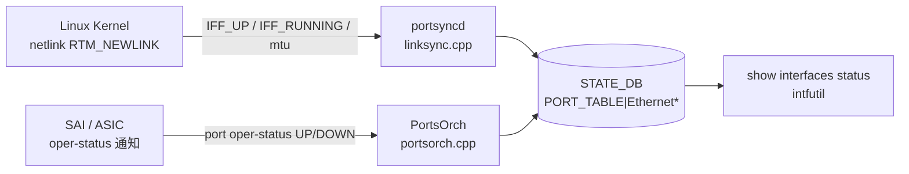

# PORT_TABLE ステータスフィールド（STATE_DB）

## 概要

`STATE_DB` の `PORT_TABLE|<port>` に書き込まれる動作状態フィールド群。**設定フィールドではなく読み取り専用の oper 状態値**であり、2 つのプロセスが書き込みを担う。

| 書き込み主体 | トリガー | 書き込みフィールド |
|------------|---------|-----------------|
| `portsyncd/linksync` | カーネル netlink RTM_NEWLINK | `state`, `netdev_oper_status`, `admin_status`, `mtu` |
| `orchagent` PortsOrch | SAI oper-status 通知 / 初期化 | `speed`, `fec`, `supported_speeds`, `supported_fecs`, `host_tx_ready`, `link_training_status`, `rmt_adv_speeds`, `phy_ctrl_unreliable_los` |

!!! note "CONFIG_DB との関係"
    ポートの **設定** は `CONFIG_DB` の `PORT` テーブルで行う。このページのフィールドは設定が ASIC / カーネルに適用された結果として STATE_DB に書き戻された **oper 状態値**。直接編集しても portsyncd / PortsOrch が上書きする。

!!! note "`oper_status` はここではない"
    ポートの SAI oper-status (`up`/`down`) は `PortsOrch::updateDbPortOperStatus()` が **APP_DB** `PORT_TABLE` に書く（STATE_DB ではない）。`sonic-swss/orchagent/portsorch.cpp:3930` 参照。

<!-- cdb-mermaid -->
### データフロー



<!-- /cdb-mermaid -->

## key 構造

```text
PORT_TABLE|<name>
```

`<name>` は `Ethernet<N>` 形式の物理ポート名。`RTM_DELLINK` を受信するとエントリ全体が削除される。

## フィールド一覧

| フィールド | 型 | 書込み主体 | コード由来デフォルト | 説明 |
|-----------|----|-----------|-------------------|------|
| `state` | `"ok"` (定数) | `portsyncd/linksync` | `"ok"` | カーネルが netdev を認識済みであることを示す。エントリが存在する = `"ok"` |
| `netdev_oper_status` | `"up"` / `"down"` | `portsyncd/linksync` | カーネル `IFF_RUNNING` フラグ値 | Linux netdev の oper 状態（`IFF_RUNNING`） |
| `admin_status` | `"up"` / `"down"` | `portsyncd/linksync` | カーネル `IFF_UP` フラグ値 | Linux netdev の admin 状態（`IFF_UP`） |
| `mtu` | uint (文字列) | `portsyncd/linksync` | カーネル netdev mtu | `rtnl_link_get_mtu()` で取得したカーネル MTU 値 |
| `host_tx_ready` | `"true"` / `"false"` | `PortsOrch` | `"false"` | ホスト側 TX が ready かどうか。ポート作成時に既存値がなければ `"false"` で初期化 |
| `speed` | uint / `"N/A"` (文字列) | `PortsOrch` | `"N/A"` | oper 動作速度 [Mbps]。DOWN 時や SAI 取得失敗時は `"N/A"` |
| `fec` | string / `"N/A"` | `PortsOrch` | `"N/A"` | oper FEC モード。詳細は [fec-state.md](fec-state.md) を参照 |
| `supported_speeds` | string (CSV) | `PortsOrch` | SAI 取得値（空なら空文字） | プラットフォームがサポートする速度のカンマ区切りリスト（例: `"10000,25000,100000"`） |
| `supported_fecs` | string (CSV) / 不在 | `PortsOrch` | `"N/A"` (空集合) / フィールド不在 | サポート FEC モード。詳細は [fec-state.md](fec-state.md) を参照 |
| `link_training_status` | string | `PortsOrch` | `"off"` | リンクトレーニング状態。LT 無効 / admin DOWN / 非サポートの場合 `"off"` |
| `rmt_adv_speeds` | string / `"N/A"` | `PortsOrch` | `"N/A"` | リモート (対向) が広告する速度 (auto-neg 時のみ有効)。admin DOWN / 取得失敗で `"N/A"` |
| `phy_ctrl_unreliable_los` | `"true"` / `"false"` | `PortsOrch` | `"false"` | PHY の LOS (Loss of Signal) が unreliable かどうか。serdes 設定変更時に更新 |

## フィールド別詳細

### `state`

`portsyncd/linksync.cpp:196` で定数 `"ok"` を書き込む。エントリの存在そのものが「ポートが kernel に認識済み」を意味する。`RTM_DELLINK` でエントリが削除されるため、存在しない = ポート未認識。

### `netdev_oper_status` / `admin_status`

いずれも linksync が RTM_NEWLINK メッセージの flags から取得:

```cpp
bool admin = flags & IFF_UP;
bool oper  = flags & IFF_RUNNING;
```

- `admin_status` は CONFIG_DB `PORT.admin_status` を portmgrd が netdev に反映した結果と一致する（書込み主体は linksync であり portmgrd ではない）
- `netdev_oper_status` は物理リンクの up/down を含む Linux の oper status

### `mtu`

カーネル netdev の MTU を文字列化して書き込む。portmgrd がデフォルト `9100` を APP_DB に書き（`portmgr.h:15`、`portmgr.cpp:176`）、orchagent 経由で SAI に反映した後、SAI が kernel netdev を更新し、linksync が STATE_DB に書く。**SAI に渡す実際の値は `mtu + 22 bytes`（Ethernet ヘッダ 14 + FCS 4 + VLAN tag 4）**（MACsec ポートはさらに加算）。STATE_DB の `mtu` 値は SAI 適用後の **kernel 側の値**であり、SAI に渡した値（+22 の加算後）とは異なる点に注意。

### `host_tx_ready`

`PortsOrch::initHostTxReadyState()` がポート作成時に STATE_DB を確認し、`host_tx_ready` が空なら `"false"` を書き込む (`portsorch.cpp:2202`)。

その後の更新タイミング:

| 条件 | 書き込み値 |
|------|-----------|
| admin_status を UP に変更 かつ Gearbox status=true かつ SAI 成功 かつ CMIS async 非対応 | `"true"` |
| admin_status を DOWN に変更 (CMIS async 非対応) | `"false"` |
| SAI `set_port_attribute` 失敗 (CMIS async 非対応) | `"false"` |
| CMIS モジュール非同期対応 (`m_cmisModuleAsicSyncSupported=true`) | **更新しない** (CMIS 側で制御) |

### `speed`

`PortsOrch::updateDbPortOperSpeed()` (`portsorch.cpp:9851`) がポート oper-status UP 通知時 / `refreshPortStatus()` 時に書き込む。

```cpp
string speedStr = speed != 0 ? to_string(speed) : "N/A";
m_portStateTable.set(port.m_alias, {{"speed", speedStr}});
```

DOWN 時はフィールドが更新されない（stale 値が残留する）。

### `link_training_status`

`PortsOrch::refreshPortStateLinkTraining()` (`portsorch.cpp:11343`) が書き込む。

| 条件 | 値 |
|------|---|
| `port.m_admin_state_up=false` | `"off"` |
| `port.m_link_training == 0` | `"off"` |
| `port.m_cap_lt == 0` | `"off"` |
| LT 有効 かつ SAI RX status 取得失敗 | `"on"` |
| `SAI_PORT_LINK_TRAINING_RX_STATUS_TRAINED` | `"trained"` |
| failure status が `NO_ERROR` 以外 | failure map の文字列 |

### `rmt_adv_speeds`

`PortsOrch::updatePortStateAutoNeg()` (`portsorch.cpp:11315`) が書き込む。port type が PHY 以外は即 return。

| 条件 | 値 |
|------|---|
| `port.m_admin_state_up=false` | `"N/A"` |
| `getPortAdvSpeeds()` 失敗 | `"N/A"` |
| 成功 | SAI から取得した速度リスト（カンマ区切り） |

<!-- value-behavior -->
## 値依存挙動マトリクス

### `state` の使われ方

`portmgrd` が `isPortStateOk()` (`portmgr.cpp:86`) で `state == "ok"` を確認してから netdev 操作を実行する。STATE_DB エントリが存在しない / `state` がない場合は待機継続。

### DOWN 時の stale 値問題

| フィールド | DOWN 時挙動 |
|-----------|-----------|
| `state` / `admin_status` / `netdev_oper_status` / `mtu` | linksync が RTM_NEWLINK を受信するたびに上書き |
| `speed` | DOWN 時は更新されない。最後に UP だった時の値が残留 |
| `fec` | DOWN 時は更新されない。stale 値残留 |
| `host_tx_ready` | admin DOWN 時は `"false"` に更新 |
| `supported_speeds` | orchagent 再起動まで更新されない (lazy init) |

<!-- /value-behavior -->

<!-- defaults -->
## コード由来の暗黙デフォルト (Phase A)

> **注記**: このページのフィールドは CONFIG_DB ではなく STATE_DB に存在し、YANG スキーマで定義されていない。以下はコード精読から導出した暗黙デフォルト。

<!-- evidence: meta/_intermediate/cdb-flow/ports-status-defaults.md -->

| フィールド | コード由来デフォルト | fallback 源 |
|-----------|-------------------|------------|
| `state` | `"ok"` (定数) | `portsyncd/linksync.cpp:196` — RTM_NEWLINK 受信時に定数を書き込む |
| `netdev_oper_status` | `"up"` or `"down"` | `linksync.cpp:201` — `flags & IFF_RUNNING` の結果 |
| `admin_status` | `"up"` or `"down"` | `linksync.cpp:197` — `flags & IFF_UP` の結果 |
| `mtu` | カーネル netdev mtu (文字列) | `linksync.cpp:198` — `rtnl_link_get_mtu()` |
| `host_tx_ready` | `"false"` | `portsorch.cpp:2202` — `initHostTxReadyState()` が既存値なしの場合に強制 `"false"` を書く |
| `speed` | `"N/A"` | `portsorch.cpp:9855` — `speed == 0` の場合のフォールバック |
| `link_training_status` | `"off"` | `portsorch.cpp:11351` — LT 無効 / admin DOWN / `m_cap_lt==0` 時 |
| `rmt_adv_speeds` | `"N/A"` | `portsorch.cpp:11327` — admin DOWN または `getPortAdvSpeeds()` 失敗時 |
| `supported_speeds` | SAI 取得値 (comma-separated) | `portsorch.cpp:3170` — 空の場合は空文字列 |
| `supported_fecs` | `"N/A"` (空集合) / フィールド不在 | `portsorch.cpp:3292` / `3279-3284` |
| `phy_ctrl_unreliable_los` | `"false"` | `portsorch.cpp:5191` — `m_unreliable_los` 初期値 false |

### 検出した挙動乖離・注意点

1. **`admin_status` の二重書き込み**: CONFIG_DB `PORT.admin_status` → portmgrd → APP_DB → orchagent → SAI → kernel netdev → linksync → STATE_DB `PORT_TABLE.admin_status` という経路。STATE_DB 値は最終的なカーネル状態を反映し、CONFIG_DB 値とは非同期に更新される。

2. **`oper_status` は STATE_DB にない**: SAI oper-status (`up`/`down`) は `PortsOrch::updateDbPortOperStatus()` が APP_DB `PORT_TABLE` に書く (`portsorch.cpp:3930`)。STATE_DB ではないため `sonic-db-cli STATE_DB hget 'PORT_TABLE|Ethernet0' oper_status` では取得できない。

3. **RTM_DELLINK = 全フィールド消去**: ポートがカーネルから削除されると STATE_DB エントリ全体が `del()` される。PortsOrch が書いた `speed` / `supported_speeds` / `host_tx_ready` なども消える。

4. **`host_tx_ready` と CMIS**: `m_cmisModuleAsicSyncSupported=true` の環境（CMIS モジュール非同期対応プラットフォーム）では admin_status 変更時に `host_tx_ready` を更新しない。CMIS 側のシーケンスが完了してから別途書き込まれる。

5. **`supported_speeds` の lazy init**: `m_portSupportedSpeeds` にキャッシュされると orchagent 再起動まで SAI を再クエリしない。トランシーバ換装後も STATE_DB 値が更新されない。

<!-- /defaults -->

<!-- ordering -->
## 書込み順依存 (Phase B — コード由来)

`portsyncd/linksync` と `PortsOrch` が STATE_DB `PORT_TABLE` に書き込む際の順序依存・タイミング依存をコード精読で検出した。詳細スキャンノート: [`meta/_intermediate/cdb-flow/ports-status-ordering.md`](https://github.com/aoki-taquan/sonic-unofficial-docs/blob/main/meta/_intermediate/cdb-flow/ports-status-ordering.md)。

| # | 依存関係 | 方向 | 緩和策 / 備考 |
|---|----------|------|--------------|
| 1 | `portsyncd` PortInitDone publish → `PortsOrch` 書込み開始 | **強制先行** | `PortsOrch::doPortTask()` は `m_initDone=false` の間すべての設定処理をスキップ。`portsorch.cpp:4613-4622` |
| 2 | `linksync` RTM_NEWLINK → `state="ok"` 書込み → portmgrd / teammgrd / intfmgrd アンロック | **強制先行** | 各デーモンの `isPortStateOk()` が `state` フィールドの存在を確認してから netdev 操作・IP 設定・LAG メンバー追加を実行。`portmgr.cpp:86-100`, `teammgr.cpp:67-80`, `intfmgr.cpp:686-695` |
| 3 | SAI `create_port` 成功 → `supported_speeds` / `host_tx_ready` 書込み | **強制先行** | `initPortSupportedSpeeds()` と `initHostTxReadyState()` はポート作成直後に 1 回だけ呼ばれる。SAI 失敗時は書込み自体が発生しない。`portsorch.cpp:3090`, `portsorch.cpp:2181-2207` |
| 4 | `gBufferOrch::isPortReady()` が true → `allPortsReady()` = true | **強制先行** | バッファプロファイル未適用ポートは `m_pendingPortSet` に留まり `allPortsReady()` が false を返し続けるため、VLAN / LAG タスクも待機する。`portsorch.cpp:4779-4788` |
| 5 | warm start: PortConfigDone **かつ** PortInitDone 双方存在 → 既存データ再読込 | 原子条件 | 一方でも欠けると `cleanPortTable()` で APP_DB を全削除して cold start にフォールバックする。`portsorch.cpp:4357` |

### 主要な制約詳細

**`state="ok"` が書かれるまでの中間状態 (依存 #2)**: `portsyncd` が `PortInitDone` を publish しても、linksync の RTM_NEWLINK 受信と `state="ok"` の書込みは非同期で進む。PortsOrch が `PortInitDone` を受信して処理を開始した時点では、個別ポートの STATE_DB エントリがまだ存在しない場合がある。portmgrd は `isPortStateOk()` が false の間イベントをスキップし次周回で自動再試行するため、この中間状態はユーザーが意識する必要はないが、ログに `Port Ethernet0 is not ready` が一時的に現れることがある。

**`supported_speeds` の 1 回限り書込み (依存 #3)**: `initPortSupportedSpeeds()` はキャッシュマップ `m_portSupportedSpeeds` を確認し、エントリが存在する場合は SAI を再クエリせず早期 return する（`portsorch.cpp:3161-3163`）。トランシーバ換装後も orchagent 再起動まで STATE_DB の `supported_speeds` が更新されない理由がここにある。

<!-- /ordering -->

<!-- cdb-exceptions -->
## 例外条件・特殊挙動

- PHY タイプ以外のポート（LAG / VLAN / TUNNEL）では `updatePortStateAutoNeg()` / `refreshPortStateLinkTraining()` / `updateDbPortOperSpeed()` などが即 `return` するため、対応フィールドの STATE_DB 書き込みが発生しない
- `switch_type == "dpu"` 環境では linksync の初期化ロジックが差異あり（`g_switchType == "dpu"` の場合は ifindex 比較ループを skip、`portsyncd.cpp`参照）
- Gearbox 対応ポートでは `setGearboxPortsAttr()` の成否が `host_tx_ready` の値に影響する（`portsorch.cpp:2245-2256`）

<!-- /cdb-exceptions -->

## 関連リファレンス

- CONFIG_DB: [`PORT` テーブル](port.md) — ポートの設定フィールド
- STATE_DB FEC 詳細: [`fec-state.md`](fec-state.md) — `fec` / `supported_fecs` の詳細
- CLI: `show interfaces status` — admin / oper status の一覧表示
- CLI: `sonic-db-cli STATE_DB hgetall 'PORT_TABLE|Ethernet0'` — 全フィールドの確認
