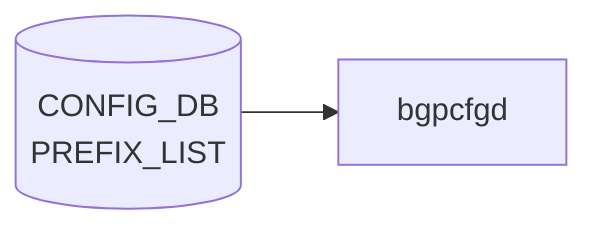

# PREFIX_LIST テーブル (BGP)

## 概要

[BGP](../../reference/glossary.md#term-bgp) のルートフィルタ用 prefix リストを [CONFIG_DB](../../reference/glossary.md#term-config_db) に持たせるための簡易テーブル[^1]。`bgpcfgd` テンプレートで [FRR](../../reference/glossary.md#term-frr) の `ip prefix-list` / `ipv6 prefix-list` に展開される。共通ルーティングポリシ用の汎用 [`PREFIX_SET`](./prefix-set.md) / `PREFIX_LIST` (sonic-routing-policy-sets) とは別物（こちらは [BGP](../../reference/glossary.md#term-bgp) 限定の簡易 entry）。

<!-- cdb-mermaid -->
### データフロー (自動生成)



!!! note "凡例"
    CONFIG_DB から SAI までの典型経路を `docs/reference/config-db-orch-map.md` から機械生成したミニ図。詳細・例外は本ページ本文と対応表を参照。
<!-- /cdb-mermaid -->

## key 構造

```text
PREFIX_LIST|<prefix_type>|<ip-prefix>
```

- `<prefix_type>`: 任意文字列（リスト名相当）
- `<ip-prefix>`: IPv4 または IPv6 プレフィクス（`stypes:sonic-ip4-prefix` / `sonic-ip6-prefix` の union）

## フィールド

| フィールド | 型 | 説明 |
|-----------|----|------|
| `prefix_type` | string | prefix list 名（key 部） |
| `ip-prefix` | union(sonic-ip4-prefix \| sonic-ip6-prefix) | CIDR 表記の IPv4/IPv6 プレフィクス（key 部） |
| `family` | enum `IPv4` / `IPv6` | 後方互換用 family。`ip-prefix` の表記と整合する `must` 制約 |

## 制約

- [YANG](../../reference/glossary.md#term-yang) `must`: `family` が `IPv6` のとき `ip-prefix` に `:` を含むこと、`IPv4` のとき `.` を含むこと
- 簡易テーブルのため、シーケンス番号や action (permit/deny) は持たない。順序付き / アクション付きが必要なら `PREFIX_SET` + `PREFIX` (sonic-routing-policy-sets) を使う

## 購読者

- `bgpcfgd` (`docker-fpm-frr`): テンプレート展開で [FRR](../../reference/glossary.md#term-frr) vtysh `ip prefix-list <prefix_type> seq N permit <prefix>` を生成

## 関連 CONFIG_DB / YANG / CLI

- 関連 [CONFIG_DB](../../reference/glossary.md#term-config_db): [`PREFIX_SET`](./prefix-set.md) / `PREFIX_LIST` (sonic-routing-policy-sets), `BGP_NEIGHBOR_AF`, `BGP_PEER_GROUP_AF`, `ROUTE_MAP`
- 関連 [YANG](../../reference/glossary.md#term-yang): `sonic-bgp-prefix-list`、`sonic-routing-policy-sets`
- 関連 CLI: なし（`config_db.json` 投入）

<!-- ref-triangle:start -->

## 関連リファレンス

- [YANG](../../reference/glossary.md#term-yang): `sonic-bgp-prefix-list`

<!-- ref-triangle:end -->

## 引用元

[^1]: YANG 定義: `sonic-bgp-prefix-list.yang`. <https://github.com/sonic-net/sonic-buildimage/blob/9ea932ec2e18f35e58268ec2e4456b1d4afd65cd/src/sonic-yang-models/yang-models/sonic-bgp-prefix-list.yang>

<!-- ops-hint -->
## 運用ヒント

### 典型値

- key 形式: `PREFIX_LIST|<name>|<seq>`。
- `action`: `permit` / `deny`、`prefix`: CIDR、`ge`/`le`: 長さレンジ。

### よくある誤設定

- 末尾の暗黙 deny を忘れて意図しない prefix まで通してしまう。明示的に `deny any` を入れるのが安全。

### 確認コマンド

```bash
sonic-db-cli CONFIG_DB keys 'PREFIX_LIST|*'
vtysh -c 'show ip prefix-list'
```
<!-- /ops-hint -->

<!-- value-behavior -->
## 値依存挙動マトリクス

### `prefix_type` 値別挙動
| 値 | 挙動 |
|----|------|
| `ANCHOR_PREFIX` | SpineRouter/UpstreamLC または UpperSpineRouter のみ許可。他デバイスは `log_warn` してスキップ。[FRR](../../reference/glossary.md#term-frr) の anchor prefix list に展開。 |
| `SUPPRESS_PREFIX` | 全デバイスタイプで許可。FRR の suppress prefix list に展開。 |
| その他 | `log_warn("PrefixListMgr:: Prefix type '...' is not supported")` → スキップ。FRR への設定生成は行われない。 |

### `family` 値別挙動
| 値 | 挙動 |
|----|------|
| `IPv4` | YANG `must`: `ip-prefix` に `.` を含むこと。FRR の `ip prefix-list` に展開。 |
| `IPv6` | YANG `must`: `ip-prefix` に `:` を含むこと。FRR の `ipv6 prefix-list` に展開。 |

<!-- /value-behavior -->

<!-- cdb-exceptions -->
## 例外条件・特殊挙動

- **prefix_type が未サポート**: `ANCHOR_PREFIX` / `SUPPRESS_PREFIX` 以外の type キーは `log_warn` を出してスキップされ、FRR への設定生成は行われない。[^2]
- **DEVICE_METADATA 未準備**: `DEVICE_METADATA|localhost` が未存在の場合はリトライ待ちになる。`type` / `bgp_asn` キーが欠けている場合も `KeyError` をキャッチしてスキップ。[^2]
- **デバイスタイプ制限 (ANCHOR_PREFIX)**: `ANCHOR_PREFIX` は `SpineRouter/UpstreamLC` または `UpperSpineRouter` デバイスのみ許可される。他デバイスでは `log_warn` してスキップ。`SUPPRESS_PREFIX` は全デバイスで有効。[^2]
- **プレフィクス形式不正**: `netaddr.IPNetwork()` がパース失敗した場合 (`NotRegisteredError` / `AddrFormatError` / `AddrConversionError`) は `log_warn` してエントリをスキップする（処理自体は `return True` で継続）。[^2]
- **constants オーバーライド**: `bgp.prefix_list.<type>.ipv4_name` / `ipv6_name` が constants に定義されていれば、デフォルトの prefix list 名を上書きする。

[^2]: [bgpcfgd](../../reference/glossary.md#term-bgpcfgd) PrefixListMgr 実装: `sonic-buildimage/src/sonic-bgpcfgd/bgpcfgd/managers_prefix_list.py`


<!-- derivation -->
## 派生・条件付き登録 (Phase 6/7)

### Phase 6: 自動派生

bgpcfgd の `PrefixListMgr` が `family` フィールドの値に基づいて FRR コマンド種別を自動決定する。`family==IPv6` → `ipv6 prefix-list`、`family==IPv4` → `ip prefix-list`。`constants` に `bgp.prefix_list.<type>.ipv4_name` が定義されていれば、リスト名を上書きする（暗黙的派生）。

### Phase 7: 条件付き登録 (add_manager 条件)

bgpcfgd は platform 非依存で常時起動し `PrefixListMgr` を無条件登録する。ただし `DEVICE_METADATA|localhost` が未存在の場合は `bgp_asn` / `type` キーが取得できずリトライ待ちになる。`ANCHOR_PREFIX` は SpineRouter / UpperSpineRouter 以外のデバイスではスキップされる。

<!-- /derivation -->

<!-- handler-branching -->
### Phase 8: Handler メソッド内分岐

| Handler | 分岐条件 | 効果 | evidence |
|---|---|---|---|
| `PrefixListMgr` | `prefix_type` が `ANCHOR_PREFIX`/`SUPPRESS_PREFIX` 以外 | `log_warn` + スキップ (FRR 設定なし) | `managers_prefix_list.py` |
| `PrefixListMgr` | `family==IPv6` | `ipv6 prefix-list` コマンド生成 | `managers_prefix_list.py` |
| `PrefixListMgr` | `family==IPv4` | `ip prefix-list` コマンド生成 | `managers_prefix_list.py` |
| `PrefixListMgr` | `netaddr.IPNetwork()` 解析失敗 | `log_warn` + return True (エントリスキップ) | `managers_prefix_list.py` |
| `PrefixListMgr` | `ANCHOR_PREFIX` + SpineRouter 以外 | `log_warn` + スキップ | `managers_prefix_list.py` |

> **スキャン証跡**: `managers_prefix_list.py` 全体読了。CONFIG_DB 内フィールド間の自動派生なし（Phase 6 は FRR テキスト変換のみ）。

<!-- /handler-branching -->

<!-- runtime-trace -->
## CDB → 実コンテナ動作トレース

### 段階 1: Consumer 登録

- **bgpcfgd** (`sonic-utilities` bgpcfgd): `PREFIX_LIST` テーブルを `ConfigDBConnector` で購読。

### 段階 2: CFG → APPL 翻訳

- bgpcfgd が FRR の `vtysh` に `ip prefix-list` コマンドを送信してプレフィックスリストを設定。
- APP_DB への書き込みなし (FRR 直接設定)。

### 段階 3: APPL → SAI

- FRR がプレフィックスリストをルートフィルタとして使用。SAI 経由なし (コントロールプレーン処理)。

### 段階 4: タイミング + 副作用

- vtysh 設定は即時有効。BGP セッションへの影響は次の UPDATE メッセージから。
- 副作用: 既存 BGP ピアのルートフィルタ変更はソフトリセット (`clear bgp soft`) が必要な場合あり。

<!-- /runtime-trace -->
<!-- entry-points -->
## 書き込み入り口 (Direction A)

PREFIX_LIST テーブルへの書き込みが発生するコード経路を網羅的に調査した結果。

### CLI

  - `config bgp prefix-list ...` — `config/bgp_cli.py` が PREFIX_LIST テーブルを書き込む (sonic-utilities/config/bgp_cli.py)

### minigraph / sonic-cfggen

minigraph.py に PREFIX_LIST 生成なし

### REST / gNMI

REST/gNMI 書き込み経路なし

### db_migrator

db_migrator.py での PREFIX_LIST マイグレーションなし

### ビルド時デフォルト (build-time default)

なし

### ハードコードデフォルト / ランタイム注入

**sonic-bgpcfgd** `managers_prefix_list.py` が PREFIX_LIST テーブルを監視し FRR bgpd に反映 (sonic-buildimage/src/sonic-bgpcfgd/bgpcfgd/managers_prefix_list.py)

### 死活・デッドコード

なし
<!-- /entry-points -->

<!-- failure -->
## 失敗挙動・エラーパス (Phase D)

### 不正 prefix 文字列

`PREFIX_LIST|<prefix_type>|<ip-prefix>` の `<ip-prefix>` 部が CIDR として解析不能な場合、`netaddr.IPNetwork()` が `NotRegisteredError` / `AddrFormatError` / `AddrConversionError` のいずれかを送出する。`set_handler` / `del_handler` ともに例外をキャッチし、`log_warn("PrefixListMgr:: Prefix '%s' format is wrong for prefix list '%s'")` を出力して `return True` で処理を継続する（FRR への設定生成はスキップ、エラーとして扱わない）。[^3]

```python
# managers_prefix_list.py L106-109 (set_handler)
try:
    prefix = netaddr.IPNetwork(str(prefix_str))
except (netaddr.NotRegisteredError, netaddr.AddrFormatError, netaddr.AddrConversionError):
    log_warn("PrefixListMgr:: Prefix '%s' format is wrong for prefix list '%s'" % (prefix_str, prefix_type))
    return True
```

代表的な不正例:
- `999.999.999.999/32` — アドレス値が範囲外
- `192.168.1.0/33` — prefix 長が範囲外 (IPv4 は /0〜/32)
- `not-an-ip` — 完全に非 IP 文字列

### FRR vtysh エラー

`bgpcfgd` は `cfg_mgr.push(cmd)` で FRR vtysh にコマンドを送信する。vtysh が構文エラーを返した場合、`bgpcfgd` のコマンドマネージャはログに記録するが、`PrefixListMgr` 自体はエラーを再送しない（fire-and-forget）。FRR 側では `ip prefix-list` コマンドの prefix 長範囲が YANG 制約と一致しない場合に `% Invalid prefix range for af_ipv4, make sure len < ge, le >= ge` のような vtysh エラーが発生しうる。確認は `vtysh -c 'show ip prefix-list'` で FRR への反映有無を検証する。[^3]

### 重複 seq（このテーブルには seq なし）

`PREFIX_LIST` テーブルはシーケンス番号 (seq) を key に持たない。FRR の `ip prefix-list` に展開する際は bgpcfgd テンプレートが seq を自動付与するため、同じ `<prefix_type>|<ip-prefix>` キーが複数存在することは YANG の list key 制約上あり得ない（重複キーは CONFIG_DB レベルで上書きされる）。seq の重複問題は本テーブルでは発生しない。

### prefix_type が未サポート

`ANCHOR_PREFIX` / `SUPPRESS_PREFIX` 以外の `prefix_type` 値を指定した場合、`generate_prefix_list_config()` が `log_warn("PrefixListMgr:: Prefix type '%s' is not supported")` を出力して `return False` を返す。FRR への設定生成は行われず、CONFIG_DB エントリはそのまま残る。[^3]

[^3]: bgpcfgd PrefixListMgr 実装: `sonic-buildimage/src/sonic-bgpcfgd/bgpcfgd/managers_prefix_list.py` (set_handler L101-117、del_handler L119-136、generate_prefix_list_config L58-99)

<!-- /failure -->

<!-- glossary-links-injected: 62ecddfa9dc4 -->
