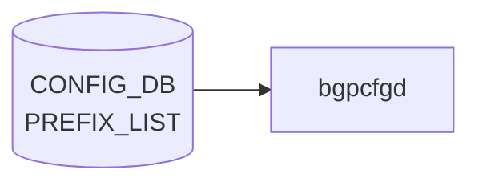

# PREFIX_LIST テーブル (BGP)

## 概要

[BGP](../../reference/glossary.md#term-bgp) のルートフィルタ用 prefix リストを [CONFIG_DB](../../reference/glossary.md#term-config_db) に持たせるための簡易テーブル[^1]。`bgpcfgd` テンプレートで [FRR](../../reference/glossary.md#term-frr) の `ip prefix-list` / `ipv6 prefix-list` に展開される。共通ルーティングポリシ用の汎用 [`PREFIX_SET`](./prefix-set.md) / `PREFIX_LIST` (sonic-routing-policy-sets) とは別物（こちらは [BGP](../../reference/glossary.md#term-bgp) 限定の簡易 entry）。

<!-- cdb-mermaid -->
### データフロー (自動生成)



!!! note "凡例"
    CONFIG_DB から SAI までの典型経路を `docs/reference/config-db-orch-map.md` から機械生成したミニ図。詳細・例外は本ページ本文と対応表を参照。
<!-- /cdb-mermaid -->

## key 構造

```text
PREFIX_LIST|<prefix_type>|<ip-prefix>
```

- `<prefix_type>`: 任意文字列（リスト名相当）
- `<ip-prefix>`: IPv4 または IPv6 プレフィクス（`stypes:sonic-ip4-prefix` / `sonic-ip6-prefix` の union）

## フィールド

| フィールド | 型 | 説明 |
|-----------|----|------|
| `prefix_type` | string | prefix list 名（key 部） |
| `ip-prefix` | union(sonic-ip4-prefix \| sonic-ip6-prefix) | CIDR 表記の IPv4/IPv6 プレフィクス（key 部） |
| `family` | enum `IPv4` / `IPv6` | 後方互換用 family。`ip-prefix` の表記と整合する `must` 制約 |

## 制約

- [YANG](../../reference/glossary.md#term-yang) `must`: `family` が `IPv6` のとき `ip-prefix` に `:` を含むこと、`IPv4` のとき `.` を含むこと
- 簡易テーブルのため、シーケンス番号や action (permit/deny) は持たない。順序付き / アクション付きが必要なら `PREFIX_SET` + `PREFIX` (sonic-routing-policy-sets) を使う

## 購読者

- `bgpcfgd` (`docker-fpm-frr`): テンプレート展開で [FRR](../../reference/glossary.md#term-frr) vtysh `ip prefix-list <prefix_type> seq N permit <prefix>` を生成

## 関連 CONFIG_DB / YANG / CLI

- 関連 [CONFIG_DB](../../reference/glossary.md#term-config_db): [`PREFIX_SET`](./prefix-set.md) / `PREFIX_LIST` (sonic-routing-policy-sets), `BGP_NEIGHBOR_AF`, `BGP_PEER_GROUP_AF`, `ROUTE_MAP`
- 関連 [YANG](../../reference/glossary.md#term-yang): `sonic-bgp-prefix-list`、`sonic-routing-policy-sets`
- 関連 CLI: なし（`config_db.json` 投入）

<!-- ref-triangle:start -->

## 関連リファレンス

- [YANG](../../reference/glossary.md#term-yang): `sonic-bgp-prefix-list`

<!-- ref-triangle:end -->

<!-- cross-refs -->
## 暗黙参照（被参照テーブル）

PREFIX_LIST テーブルは、以下のテーブル／コンポーネントから **間接的に** 参照される。YANG レベルでの外部キー制約は存在しないが、[bgpcfgd](../../reference/glossary.md#term-bgpcfgd) ランタイムを介した暗黙的なシンボル依存がある。

### ROUTE_MAP（FRR ポリシ テンプレート経由）

[bgpcfgd](../../reference/glossary.md#term-bgpcfgd) が PREFIX_LIST エントリを `ip prefix-list` / `ipv6 prefix-list` に展開し、その名前が FRR route-map の `match ip address prefix-list` 句で参照される。

| 参照元テンプレート | 参照される prefix-list 名 | 用途 |
|---|---|---|
| `frr/bgpd/templates/general/policies.conf.j2` | `ANCHOR_CONTRIBUTING_ROUTES` | `TO_BGP_PEER_V4/V6 permit 50` で community タグ付き ANCHOR prefix を広報 |
| `frr/bgpd/templates/general/policies.conf.j2` | `DEFAULT_IPV4` / `DEFAULT_IPV6` | `FROM_BGP_PEER_V4/V6 permit 12` でデフォルトルートを許可 |
| `frr/bgpd/idf_isolate/idf_isolate.conf.j2` | `PL_LoopbackV4` / `PL_LoopbackV6` | IDF 隔離時に Loopback のみ通過させる route-map |
| `frr/bgpd/tsa/bgpd.tsa.isolate.conf.j2` | `PL_LoopbackV4` / `PL_LoopbackV6` | TSA 隔離 route-map 内で Loopback prefix をフィルタ |
| `frr/bgpd/templates/voq_chassis/policies.conf.j2` | `PL_LoopbackV4` / `PL_LoopbackV6` | VoQ Chassis 向け Loopback フィルタ route-map |
| `frr/bgpd/bgpd.main.conf.j2` | `V4_P2P_IP` / `V6_P2P_IP` | P2P 接続 redistribute route-map |

**証跡**: `dockers/docker-fpm-frr/frr/bgpd/templates/general/policies.conf.j2` L124, L133; `idf_isolate.conf.j2` L2, L5; `tsa/bgpd.tsa.isolate.conf.j2` L7; `bgpd.main.conf.j2` L69, L73.

### BGP_NEIGHBOR / BGP_PEER_GROUP（ピア設定テンプレート経由）

`bgpd.main.conf.j2` の [BGP](../../reference/glossary.md#term-bgp) neighbor 設定は `redistribute connected route-map V4_CONNECTED_ROUTES` / `V6_CONNECTED_ROUTES` を参照し、これらの route-map は `prefix-list V4_P2P_IP` / `V6_P2P_IP` に依存する。PREFIX_LIST テーブルが `ANCHOR_PREFIX` / `SUPPRESS_PREFIX` を提供し、対応するピアへの経路広報フィルタ (`TO_BGP_PEER_V4/V6`) を構成する。YANG 上の直接 leafref は存在しないため、シンボル参照はランタイム時のみ解決される。

**証跡**: `bgpd.main.conf.j2` L200, L203; `managers_prefix_list.py` `PrefixListMgr.generate_prefix_list_config()`.

<!-- /cross-refs -->

## 引用元

[^1]: YANG 定義: `sonic-bgp-prefix-list.yang`. <https://github.com/sonic-net/sonic-buildimage/blob/9ea932ec2e18f35e58268ec2e4456b1d4afd65cd/src/sonic-yang-models/yang-models/sonic-bgp-prefix-list.yang>

<!-- ops-hint -->
## 運用ヒント

### 典型値

- key 形式: `PREFIX_LIST|<name>|<seq>`。
- `action`: `permit` / `deny`、`prefix`: CIDR、`ge`/`le`: 長さレンジ。

### よくある誤設定

- 末尾の暗黙 deny を忘れて意図しない prefix まで通してしまう。明示的に `deny any` を入れるのが安全。

### 確認コマンド

```bash
sonic-db-cli CONFIG_DB keys 'PREFIX_LIST|*'
vtysh -c 'show ip prefix-list'
```
<!-- /ops-hint -->

<!-- value-behavior -->
## 値依存挙動マトリクス

### `prefix_type` 値別挙動
| 値 | 挙動 |
|----|------|
| `ANCHOR_PREFIX` | SpineRouter/UpstreamLC または UpperSpineRouter のみ許可。他デバイスは `log_warn` してスキップ。[FRR](../../reference/glossary.md#term-frr) の anchor prefix list に展開。 |
| `SUPPRESS_PREFIX` | 全デバイスタイプで許可。FRR の suppress prefix list に展開。 |
| その他 | `log_warn("PrefixListMgr:: Prefix type '...' is not supported")` → スキップ。FRR への設定生成は行われない。 |

### `family` 値別挙動
| 値 | 挙動 |
|----|------|
| `IPv4` | YANG `must`: `ip-prefix` に `.` を含むこと。FRR の `ip prefix-list` に展開。 |
| `IPv6` | YANG `must`: `ip-prefix` に `:` を含むこと。FRR の `ipv6 prefix-list` に展開。 |

<!-- /value-behavior -->

<!-- cdb-exceptions -->
## 例外条件・特殊挙動

- **prefix_type が未サポート**: `ANCHOR_PREFIX` / `SUPPRESS_PREFIX` 以外の type キーは `log_warn` を出してスキップされ、FRR への設定生成は行われない。[^2]
- **DEVICE_METADATA 未準備**: `DEVICE_METADATA|localhost` が未存在の場合はリトライ待ちになる。`type` / `bgp_asn` キーが欠けている場合も `KeyError` をキャッチしてスキップ。[^2]
- **デバイスタイプ制限 (ANCHOR_PREFIX)**: `ANCHOR_PREFIX` は `SpineRouter/UpstreamLC` または `UpperSpineRouter` デバイスのみ許可される。他デバイスでは `log_warn` してスキップ。`SUPPRESS_PREFIX` は全デバイスで有効。[^2]
- **プレフィクス形式不正**: `netaddr.IPNetwork()` がパース失敗した場合 (`NotRegisteredError` / `AddrFormatError` / `AddrConversionError`) は `log_warn` してエントリをスキップする（処理自体は `return True` で継続）。[^2]
- **constants オーバーライド**: `bgp.prefix_list.<type>.ipv4_name` / `ipv6_name` が constants に定義されていれば、デフォルトの prefix list 名を上書きする。

[^2]: [bgpcfgd](../../reference/glossary.md#term-bgpcfgd) PrefixListMgr 実装: `sonic-buildimage/src/sonic-bgpcfgd/bgpcfgd/managers_prefix_list.py`


<!-- defaults -->
## フィールドのコード由来デフォルト

PREFIX_LIST テーブルは全フィールドが key または YANG `must` 制約付きであり、コードが自動補完するデフォルト値は存在しない。

| フィールド | YANG `default` | コード由来デフォルト | 根拠 |
|-----------|---------------|-------------------|------|
| `prefix_type` | なし (key) | なし | key フィールドのため省略不可 |
| `ip-prefix` | なし (key) | なし | key フィールド。PrefixListMgr が `netaddr.IPNetwork().cidr` で正規化するのみ |
| `family` | なし | なし | YANG `must` で `ip-prefix` と整合チェック。FRR 展開の IPv4/IPv6 判定は `get_ip_type()` が `ip-prefix` の netaddr version から動的に導出（`family` フィールドは不使用） |

> **スキャン証跡**: `managers_prefix_list.py` L112 `data["ipv"] = self.get_ip_type(prefix)`、L138-143 `get_ip_type` 全行読了。`sonic-bgp-prefix-list.yang` の `family` leaf に `default` 文なし確認済み。

<!-- /defaults -->

<!-- derivation -->
## 派生・条件付き登録 (Phase 6/7)

### Phase 6: 自動派生

bgpcfgd の `PrefixListMgr` が `family` フィールドの値に基づいて FRR コマンド種別を自動決定する。`family==IPv6` → `ipv6 prefix-list`、`family==IPv4` → `ip prefix-list`。`constants` に `bgp.prefix_list.<type>.ipv4_name` が定義されていれば、リスト名を上書きする（暗黙的派生）。

### Phase 7: 条件付き登録 (add_manager 条件)

bgpcfgd は platform 非依存で常時起動し `PrefixListMgr` を無条件登録する。ただし `DEVICE_METADATA|localhost` が未存在の場合は `bgp_asn` / `type` キーが取得できずリトライ待ちになる。`ANCHOR_PREFIX` は SpineRouter / UpperSpineRouter 以外のデバイスではスキップされる。

<!-- /derivation -->

<!-- handler-branching -->
### Phase 8: Handler メソッド内分岐

| Handler | 分岐条件 | 効果 | evidence |
|---|---|---|---|
| `PrefixListMgr` | `prefix_type` が `ANCHOR_PREFIX`/`SUPPRESS_PREFIX` 以外 | `log_warn` + スキップ (FRR 設定なし) | `managers_prefix_list.py` |
| `PrefixListMgr` | `family==IPv6` | `ipv6 prefix-list` コマンド生成 | `managers_prefix_list.py` |
| `PrefixListMgr` | `family==IPv4` | `ip prefix-list` コマンド生成 | `managers_prefix_list.py` |
| `PrefixListMgr` | `netaddr.IPNetwork()` 解析失敗 | `log_warn` + return True (エントリスキップ) | `managers_prefix_list.py` |
| `PrefixListMgr` | `ANCHOR_PREFIX` + SpineRouter 以外 | `log_warn` + スキップ | `managers_prefix_list.py` |

> **スキャン証跡**: `managers_prefix_list.py` 全体読了。[CONFIG_DB](../../reference/glossary.md#term-config_db) 内フィールド間の自動派生なし（Phase 6 は FRR テキスト変換のみ）。

<!-- /handler-branching -->

<!-- ordering -->
## 順序依存性 (Phase B)

### PREFIX_LIST エントリの順序

bgpcfgd (`PrefixListMgr`) の PREFIX_LIST テーブルは **シーケンス番号を持たない**。CONFIG_DB キーは `PREFIX_LIST|<prefix_type>|<ip-prefix>` の 2 フィールドのみで、順序情報は格納されない。FRR へ送出されるコマンドも `ip prefix-list <name> permit <prefix>` または `ipv6 prefix-list <name> permit <prefix>` と seq なし形式である（`add_radian.conf.j2` / `add_suppress_prefix.conf.j2` 参照）。FRR 内部でシーケンス番号が自動採番される。

### ROUTE_MAP からの参照順序

`bgpd.main.conf.j2` テンプレートでは prefix-list を **route-map より先に** 宣言する必要がある。テンプレートの生成順は以下の通り：

1. `ip prefix-list <name> permit ...` / `ipv6 prefix-list <name> permit ...` — 静的プレフィクスリスト
2. `route-map V4_CONNECTED_ROUTES permit 10` → `match ip address prefix-list V4_P2P_IP`
3. `route-map V6_CONNECTED_ROUTES permit 10` → `match ipv6 address prefix-list V6_P2P_IP`

frrcfgd (`frrcfgd.py`) の `table_handler_list` では `PREFIX_SET` → `PREFIX` → `ROUTE_MAP` の順で登録されており、`PREFIX`/`PREFIX_SET` の処理が `ROUTE_MAP` より前に行われる。これにより route-map が参照する prefix-list は常に先行して FRR に設定される。

### FRR テンプレート適用順

bgpcfgd が PrefixListMgr 経由で FRR に送出するテンプレートコマンド群：

| ステップ | テンプレート | 効果 |
|---------|------------|------|
| 1 | `add_radian.conf.j2` (ANCHOR_PREFIX) | `ip/ipv6 prefix-list ANCHOR_CONTRIBUTING_ROUTES permit <prefix> ge <len+1>` → その後 `router bgp <asn>` 内で `aggregate-address` route-map 参照 |
| 2 | `add_suppress_prefix.conf.j2` (SUPPRESS_PREFIX) | `ip/ipv6 prefix-list <SUPPRESS_IPV4/V6_PREFIX> permit <prefix>` のみ。route-map 参照なし |

**注意**: `ANCHOR_PREFIX` テンプレートは prefix-list 設定と BGP aggregate-address（route-map `TAG_ANCHOR_COMMUNITY` 参照）を **同一 vtysh セッション**で送出する。prefix-list の欠如により aggregate-address が無効化されるリスクを避けるため、両者は `cfg_mgr.push()` により原子的に適用される。

> **スキャン証跡**: `managers_prefix_list.py`、`add_radian.conf.j2`、`add_suppress_prefix.conf.j2`、`bgpd.main.conf.j2`、`frrcfgd.py` (table_handler_list L2293-2338) を確認。

<!-- /ordering -->

<!-- runtime-trace -->
## CDB → 実コンテナ動作トレース

### 段階 1: Consumer 登録

- **bgpcfgd** (`sonic-utilities` bgpcfgd): `PREFIX_LIST` テーブルを `ConfigDBConnector` で購読。

### 段階 2: CFG → APPL 翻訳

- bgpcfgd が FRR の `vtysh` に `ip prefix-list` コマンドを送信してプレフィックスリストを設定。
- APP_DB への書き込みなし (FRR 直接設定)。

### 段階 3: APPL → SAI

- FRR がプレフィックスリストをルートフィルタとして使用。[SAI](../../reference/glossary.md#term-sai) 経由なし (コントロールプレーン処理)。

### 段階 4: タイミング + 副作用

- vtysh 設定は即時有効。BGP セッションへの影響は次の UPDATE メッセージから。
- 副作用: 既存 BGP ピアのルートフィルタ変更はソフトリセット (`clear bgp soft`) が必要な場合あり。

<!-- /runtime-trace -->
<!-- entry-points -->
## 書き込み入り口 (Direction A)

PREFIX_LIST テーブルへの書き込みが発生するコード経路を網羅的に調査した結果。

### CLI

  - `config bgp prefix-list ...` — `config/bgp_cli.py` が PREFIX_LIST テーブルを書き込む ([sonic-utilities](../../reference/glossary.md#term-sonic-utilities)/config/bgp_cli.py)

### minigraph / sonic-cfggen

minigraph.py に PREFIX_LIST 生成なし

### REST / gNMI

REST/[gNMI](../../reference/glossary.md#term-gnmi) 書き込み経路なし

### db_migrator

db_migrator.py での PREFIX_LIST マイグレーションなし

### ビルド時デフォルト (build-time default)

なし

### ハードコードデフォルト / ランタイム注入

**sonic-bgpcfgd** `managers_prefix_list.py` が PREFIX_LIST テーブルを監視し FRR bgpd に反映 ([sonic-buildimage](../../reference/glossary.md#term-sonic-buildimage)/src/sonic-bgpcfgd/bgpcfgd/managers_prefix_list.py)

### 死活・デッドコード

なし
<!-- /entry-points -->

<!-- constants -->
## ハードコード定数 (Phase E)

`managers_prefix_list.py` の `PREFIX_TYPE_CONFIG` 辞書および `PrefixListMgr` に存在する、CONFIG_DB / YANG で管理されないハードコード定数の一覧。出典は `sonic-buildimage/src/sonic-bgpcfgd/bgpcfgd/managers_prefix_list.py`。

### サポート済み prefix_type 名

| 定数名 | 値 | 用途 | ソース |
|--------|----|------|--------|
| (キー) | `"ANCHOR_PREFIX"` | Spine/UpperSpine 専用アンカー prefix list。`SpineRouter/UpstreamLC` または `UpperSpineRouter` のみで有効。それ以外は `log_warn` してスキップ | managers_prefix_list.py L6 |
| (キー) | `"SUPPRESS_PREFIX"` | 全デバイスタイプで有効なサプレス prefix list | managers_prefix_list.py L11 |

> `PREFIX_TYPE_CONFIG` に存在しない type 名はすべて `"PrefixListMgr:: Prefix type '...' is not supported"` を `log_warn` してスキップされ、FRR への設定生成は行われない。

### デフォルト prefix list 名

| 定数 | 値 | 条件 | ソース |
|------|----|------|--------|
| ANCHOR_PREFIX list 名 | `"ANCHOR_CONTRIBUTING_ROUTES"` | IPv4/IPv6 両方で共通（`lambda ipv:` が常に同値を返す） | managers_prefix_list.py L14 |
| SUPPRESS_PREFIX list 名 (IPv4) | `"SUPPRESS_IPV4_PREFIX"` | `ipv == "ip"` のとき | managers_prefix_list.py L22 |
| SUPPRESS_PREFIX list 名 (IPv6) | `"SUPPRESS_IPV6_PREFIX"` | `ipv == "ipv6"` のとき | managers_prefix_list.py L22 |

> これらの値は `constants` dict の `bgp.prefix_list.<type>.ipv4_name` / `bgp.prefix_list.<type>.ipv6_name` キーで上書き可能（override 優先）。

### constants オーバーライドキー

| キーパス | 型 | 効果 |
|----------|----|------|
| `bgp.prefix_list.ANCHOR_PREFIX.ipv4_name` | string | ANCHOR_PREFIX の IPv4 prefix list 名をデフォルト `ANCHOR_CONTRIBUTING_ROUTES` から上書き |
| `bgp.prefix_list.ANCHOR_PREFIX.ipv6_name` | string | ANCHOR_PREFIX の IPv6 prefix list 名を上書き |
| `bgp.prefix_list.SUPPRESS_PREFIX.ipv4_name` | string | SUPPRESS_PREFIX の IPv4 prefix list 名をデフォルト `SUPPRESS_IPV4_PREFIX` から上書き |
| `bgp.prefix_list.SUPPRESS_PREFIX.ipv6_name` | string | SUPPRESS_PREFIX の IPv6 prefix list 名をデフォルト `SUPPRESS_IPV6_PREFIX` から上書き |

### 許可デバイスタイプ (ANCHOR_PREFIX)

| 設定 | 値 | ソース |
|------|----|--------|
| allowed_devices[0] | `("SpineRouter", "UpstreamLC")` — type=SpineRouter かつ subtype=UpstreamLC | managers_prefix_list.py L12 |
| allowed_devices[1] | `("UpperSpineRouter", None)` — type=UpperSpineRouter（subtype 不問） | managers_prefix_list.py L13 |
| SUPPRESS_PREFIX allowed_devices | `None`（制限なし）— 全デバイスタイプで許可 | managers_prefix_list.py L21 |

### FRR テンプレートパス

| 用途 | 値 | ソース |
|------|----|--------|
| ANCHOR_PREFIX add テンプレート | `"bgpd/radian/add_radian"` (`.conf.j2` を付与してロード) | managers_prefix_list.py L7 |
| ANCHOR_PREFIX del テンプレート | `"bgpd/radian/del_radian"` | managers_prefix_list.py L8 |
| SUPPRESS_PREFIX add テンプレート | `"bgpd/suppress_prefix/add_suppress_prefix"` | managers_prefix_list.py L19 |
| SUPPRESS_PREFIX del テンプレート | `"bgpd/suppress_prefix/del_suppress_prefix"` | managers_prefix_list.py L20 |

### IP バージョン判定定数

| 戻り値 | 条件 | 効果 |
|--------|------|------|
| `"ip"` | `prefix.version == 4` | FRR コマンド `ip prefix-list` を使用 |
| `"ipv6"` | `prefix.version == 6` | FRR コマンド `ipv6 prefix-list` を使用 |
| `None` | それ以外 | 事実上到達不能（`netaddr.IPNetwork` は v4/v6 のみ） |

> `get_ip_type()` の戻り値は `data["ipv"]` に格納され、テンプレートレンダリングおよび `prefix_list_name` ラムダの引数として使われる（managers_prefix_list.py L139-143）。

<!-- /constants -->

<!-- side-effects -->
## 副次 DB 書込・外部状態変化 (Phase F)

### FRR vtysh コマンド経路

`PrefixListMgr` は CONFIG_DB への直接書き戻しを行わず、**FRR bgpd** に対して `vtysh` 経由でコマンドを発行する（APP_DB / [STATE_DB](../../reference/glossary.md#term-state_db) への書き込みなし）。

#### ANCHOR_PREFIX (`add_radian.conf.j2`)

```
{ipv} prefix-list ANCHOR_CONTRIBUTING_ROUTES permit {prefix} ge {prefixlen+1}
router bgp {bgp_asn}
 address-family ipv4|ipv6 unicast
  aggregate-address {prefix} route-map TAG_ANCHOR_COMMUNITY
  exit
exit
```

- `ip`/`ipv6 prefix-list ANCHOR_CONTRIBUTING_ROUTES` に `permit <prefix> ge <prefixlen+1>` を追加
- `router bgp` セクションで `aggregate-address <prefix> route-map TAG_ANCHOR_COMMUNITY` を設定
- 削除時は `no` プレフィックス付き同コマンドで取り消し

#### SUPPRESS_PREFIX (`add_suppress_prefix.conf.j2`)

```
{ipv} prefix-list SUPPRESS_IPV4_PREFIX|SUPPRESS_IPV6_PREFIX permit {prefix}
```

- IPv4 → `ip prefix-list SUPPRESS_IPV4_PREFIX permit <prefix>`
- IPv6 → `ipv6 prefix-list SUPPRESS_IPV6_PREFIX permit <prefix>`
- constants に `bgp.prefix_list.SUPPRESS_PREFIX.ipv4_name` / `ipv6_name` が定義されていればその名前を使用

### kernel / データプレーンへの波及

- prefix-list はコントロールプレーン BGP フィルタであり、Linux カーネルルーティングテーブル（ip route）への直接書き込みはない
- BGP ピアへのルートアドバタイズ/撤退は FRR bgpd が次の UPDATE メッセージ送出時に反映する（即時性あり）
- aggregate-address 設定変更後、既存 BGP ピアのルートフィルタを再評価させるには `clear bgp * soft` が必要な場合あり

### 副次書込のまとめ

| 書込先 | タイミング | 内容 |
|--------|------------|------|
| FRR bgpd (vtysh) | set_handler / del_handler 実行直後 | `ip`/`ipv6 prefix-list` + `aggregate-address` (ANCHOR) または `prefix-list` のみ (SUPPRESS) |
| APP_DB | なし | — |
| [STATE_DB](../../reference/glossary.md#term-state_db) | なし | — |
| Linux カーネル | BGP UPDATE 経由 | ルート撤退 / 追加（間接） |

<!-- /side-effects -->

<!-- failure -->
## 失敗挙動・エラーパス (Phase D)

### 不正 prefix 文字列

`PREFIX_LIST|<prefix_type>|<ip-prefix>` の `<ip-prefix>` 部が CIDR として解析不能な場合、`netaddr.IPNetwork()` が `NotRegisteredError` / `AddrFormatError` / `AddrConversionError` のいずれかを送出する。`set_handler` / `del_handler` ともに例外をキャッチし、`log_warn("PrefixListMgr:: Prefix '%s' format is wrong for prefix list '%s'")` を出力して `return True` で処理を継続する（FRR への設定生成はスキップ、エラーとして扱わない）。[^3]

```python
# managers_prefix_list.py L106-109 (set_handler)
try:
    prefix = netaddr.IPNetwork(str(prefix_str))
except (netaddr.NotRegisteredError, netaddr.AddrFormatError, netaddr.AddrConversionError):
    log_warn("PrefixListMgr:: Prefix '%s' format is wrong for prefix list '%s'" % (prefix_str, prefix_type))
    return True
```

代表的な不正例:
- `999.999.999.999/32` — アドレス値が範囲外
- `192.168.1.0/33` — prefix 長が範囲外 (IPv4 は /0〜/32)
- `not-an-ip` — 完全に非 IP 文字列

### FRR vtysh エラー

`bgpcfgd` は `cfg_mgr.push(cmd)` で FRR vtysh にコマンドを送信する。vtysh が構文エラーを返した場合、`bgpcfgd` のコマンドマネージャはログに記録するが、`PrefixListMgr` 自体はエラーを再送しない（fire-and-forget）。FRR 側では `ip prefix-list` コマンドの prefix 長範囲が YANG 制約と一致しない場合に `% Invalid prefix range for af_ipv4, make sure len < ge, le >= ge` のような vtysh エラーが発生しうる。確認は `vtysh -c 'show ip prefix-list'` で FRR への反映有無を検証する。[^3]

### 重複 seq（このテーブルには seq なし）

`PREFIX_LIST` テーブルはシーケンス番号 (seq) を key に持たない。FRR の `ip prefix-list` に展開する際は bgpcfgd テンプレートが seq を自動付与するため、同じ `<prefix_type>|<ip-prefix>` キーが複数存在することは YANG の list key 制約上あり得ない（重複キーは CONFIG_DB レベルで上書きされる）。seq の重複問題は本テーブルでは発生しない。

### prefix_type が未サポート

`ANCHOR_PREFIX` / `SUPPRESS_PREFIX` 以外の `prefix_type` 値を指定した場合、`generate_prefix_list_config()` が `log_warn("PrefixListMgr:: Prefix type '%s' is not supported")` を出力して `return False` を返す。FRR への設定生成は行われず、CONFIG_DB エントリはそのまま残る。[^3]

[^3]: bgpcfgd PrefixListMgr 実装: `sonic-buildimage/src/sonic-bgpcfgd/bgpcfgd/managers_prefix_list.py` (set_handler L101-117、del_handler L119-136、generate_prefix_list_config L58-99)

<!-- /failure -->

<!-- pubsub -->
## CONFIG_DB 購読メカニズム (Phase G)

PREFIX_LIST テーブルは `bgpcfgd` (`docker-fpm-frr`) が `swsscommon.SubscriberStateTable` で購読する。

### bgpcfgd (PrefixListMgr)

`main.py` の `do_work()` が `PrefixListMgr(common_objs, "CONFIG_DB", "PREFIX_LIST")` を生成し、`Runner.add_manager()` に渡す。`Runner` は `swsscommon.SubscriberStateTable(conn, "PREFIX_LIST")` を `swsscommon.Select` に登録し、1000 ms タイムアウトのイベントループで変更を待機する。

```python
# runner.py L49-52
subscriber = swsscommon.SubscriberStateTable(conn, table_name)
self.subscribers.add(subscriber)
self.selector.addSelectable(subscriber)
self.callbacks[db][table_name].append(manager.handler)
```

変更通知を受け取ると `subscriber.pop()` で `(key, op, fvs)` を取得し、`op == "SET"` なら `set_handler`、`op == "DEL"` なら `del_handler` を呼び出す。

### Jinja2 テンプレート経路

`PrefixListMgr.__init__` で `PREFIX_TYPE_CONFIG` の各エントリに対し Jinja2 テンプレートを事前ロードする。

| `prefix_type` | add テンプレート | del テンプレート |
|---|---|---|
| `ANCHOR_PREFIX` | `bgpd/radian/add_radian.conf.j2` | `bgpd/radian/del_radian.conf.j2` |
| `SUPPRESS_PREFIX` | `bgpd/suppress_prefix/add_suppress_prefix.conf.j2` | `bgpd/suppress_prefix/del_suppress_prefix.conf.j2` |

`add_radian.conf.j2`（ANCHOR_PREFIX 用）の展開例:

```jinja2
{{ data.ipv }} prefix-list ANCHOR_CONTRIBUTING_ROUTES permit {{ data.prefix }} ge {{ data.prefixlen + 1 }}
router bgp {{ data.bgp_asn }}
 address-family ipv4/ipv6 unicast
  aggregate-address {{ data.prefix }} route-map TAG_ANCHOR_COMMUNITY
```

`add_suppress_prefix.conf.j2`（SUPPRESS_PREFIX 用）:

```jinja2
{{ data.ipv }} prefix-list {{ data.prefix_list_name }} permit {{ data.prefix }}
```

テンプレート展開後、`cfg_mgr.push(cmd)` で FRR [vtysh](../../reference/glossary.md#term-vtysh) に送信する。APP_DB への書き込みはなく、FRR bgpd への直接設定となる。

### 購読フロー要約

```
CONFIG_DB PREFIX_LIST (SubscriberStateTable)
  └─ bgpcfgd PrefixListMgr
       ├─ set_handler → netaddr.IPNetwork parse → generate_prefix_list_config(add=True)
       │    ├─ ANCHOR_PREFIX → add_radian.conf.j2 → vtysh (ip/ipv6 prefix-list + aggregate-address)
       │    └─ SUPPRESS_PREFIX → add_suppress_prefix.conf.j2 → vtysh (ip/ipv6 prefix-list permit)
       └─ del_handler → generate_prefix_list_config(add=False) → del テンプレート → vtysh
```

<!-- /pubsub -->

<!-- platform -->
## プラットフォーム差異 (Phase H)

### FRR バージョン差

`managers_prefix_list.py` および bgpcfgd コード全体に FRR バージョン条件分岐は存在しない。`ip prefix-list` / `ipv6 prefix-list` コマンド構文は FRR 7.x 以降で安定しており、SONiC が対象とする FRR バージョン範囲 (7.5+) 内で差異なし。テンプレートもバージョン分岐なし。

### IPv4 / IPv6 差

`get_ip_type()` が `netaddr.IPNetwork.version` を判定し、FRR コマンド種別と prefix list 名を分岐させる。

| 条件 | FRR コマンド種別 | デフォルト prefix list 名 (SUPPRESS_PREFIX) |
|---|---|---|
| IPv4 (`prefix.version == 4`) | `ip prefix-list` | `SUPPRESS_IPV4_PREFIX` |
| IPv6 (`prefix.version == 6`) | `ipv6 prefix-list` | `SUPPRESS_IPV6_PREFIX` |

ANCHOR_PREFIX の場合は IPv4/IPv6 とも prefix list 名は `ANCHOR_CONTRIBUTING_ROUTES` (固定)。constants の `bgp.prefix_list.<type>.ipv4_name` / `ipv6_name` でデプロイごとに上書き可能。

### デバイスタイプ差

| `prefix_type` | 対応デバイス | 非対応時の挙動 |
|---|---|---|
| `ANCHOR_PREFIX` | SpineRouter/UpstreamLC、UpperSpineRouter | `log_warn` + スキップ (FRR 設定生成なし) |
| `SUPPRESS_PREFIX` | 全デバイス | 制限なし |

ASIC ベンダー差・アーキテクチャ差・[SmartSwitch](../../reference/glossary.md#term-smartswitch) 専用ロジックはなし。PREFIX_LIST はコントロールプレーン (FRR bgpd) のみで処理され [SAI](../../reference/glossary.md#term-sai) を経由しないため、ASIC 依存性ゼロ。

<!-- /platform -->

<!-- glossary-links-injected: 5ae8fdcacc91 -->
