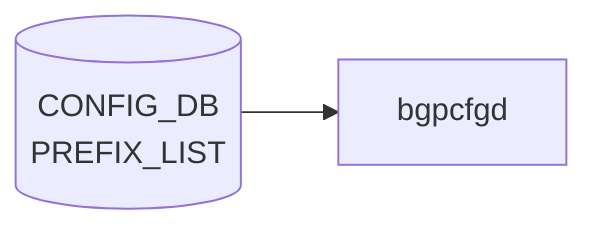

# PREFIX_LIST テーブル (BGP)

## 概要

[BGP](../../reference/glossary.md#term-bgp) のルートフィルタ用 prefix リストを [CONFIG_DB](../../reference/glossary.md#term-config_db) に持たせるための簡易テーブル[^1]。`bgpcfgd` テンプレートで [FRR](../../reference/glossary.md#term-frr) の `ip prefix-list` / `ipv6 prefix-list` に展開される。共通ルーティングポリシ用の汎用 [`PREFIX_SET`](./prefix-set.md) / `PREFIX_LIST` (sonic-routing-policy-sets) とは別物（こちらは BGP 限定の簡易 entry）。

<!-- cdb-mermaid -->
### データフロー (自動生成)



!!! note "凡例"
    CONFIG_DB から SAI までの典型経路を `docs/reference/config-db-orch-map.md` から機械生成したミニ図。詳細・例外は本ページ本文と対応表を参照。
<!-- /cdb-mermaid -->

## key 構造

```
PREFIX_LIST|<prefix_type>|<ip-prefix>
```

- `<prefix_type>`: 任意文字列（リスト名相当）
- `<ip-prefix>`: IPv4 または IPv6 プレフィクス（`stypes:sonic-ip4-prefix` / `sonic-ip6-prefix` の union）

## フィールド

| フィールド | 型 | 説明 |
|-----------|----|------|
| `prefix_type` | string | prefix list 名（key 部） |
| `ip-prefix` | union(sonic-ip4-prefix \| sonic-ip6-prefix) | CIDR 表記の IPv4/IPv6 プレフィクス（key 部） |
| `family` | enum `IPv4` / `IPv6` | 後方互換用 family。`ip-prefix` の表記と整合する `must` 制約 |

## 制約

- [YANG](../../reference/glossary.md#term-yang) `must`: `family` が `IPv6` のとき `ip-prefix` に `:` を含むこと、`IPv4` のとき `.` を含むこと
- 簡易テーブルのため、シーケンス番号や action (permit/deny) は持たない。順序付き / アクション付きが必要なら `PREFIX_SET` + `PREFIX` (sonic-routing-policy-sets) を使う

## 購読者

- `bgpcfgd` (`docker-fpm-frr`): テンプレート展開で FRR vtysh `ip prefix-list <prefix_type> seq N permit <prefix>` を生成

## 関連 CONFIG_DB / YANG / CLI

- 関連 CONFIG_DB: [`PREFIX_SET`](./prefix-set.md) / `PREFIX_LIST` (sonic-routing-policy-sets), `BGP_NEIGHBOR_AF`, `BGP_PEER_GROUP_AF`, `ROUTE_MAP`
- 関連 YANG: `sonic-bgp-prefix-list`、`sonic-routing-policy-sets`
- 関連 CLI: なし（`config_db.json` 投入）

<!-- ref-triangle:start -->

## 関連リファレンス

- YANG: `sonic-bgp-prefix-list`

<!-- ref-triangle:end -->

## 引用元

[^1]: YANG 定義: `sonic-bgp-prefix-list.yang`. <https://github.com/sonic-net/sonic-buildimage/blob/9ea932ec2e18f35e58268ec2e4456b1d4afd65cd/src/sonic-yang-models/yang-models/sonic-bgp-prefix-list.yang>

<!-- ops-hint -->
## 運用ヒント

### 典型値

- key 形式: `PREFIX_LIST|<name>|<seq>`。
- `action`: `permit` / `deny`、`prefix`: CIDR、`ge`/`le`: 長さレンジ。

### よくある誤設定

- 末尾の暗黙 deny を忘れて意図しない prefix まで通してしまう。明示的に `deny any` を入れるのが安全。

### 確認コマンド

```bash
sonic-db-cli CONFIG_DB keys 'PREFIX_LIST|*'
vtysh -c 'show ip prefix-list'
```
<!-- /ops-hint -->

<!-- glossary-links-injected: 3aa2902e22d8 -->
