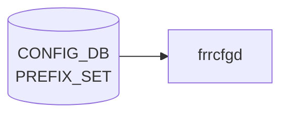

# PREFIX_SET テーブル

## 概要

`sonic-routing-policy-sets` モジュールが定義する **汎用 prefix set** の宣言テーブル[^1]。実際のメンバ prefix は `PREFIX` (`PREFIX_LIST` / `PREFIX_NOSEQ_LIST`) 側に格納し、`PREFIX_SET_LIST.name` を leafref で参照する。`frr-mgmt-framework` 経路のルーティングポリシで route-map `match ip address prefix-list` に展開される。

<!-- cdb-mermaid -->
### データフロー (自動生成)



!!! note "凡例"
    CONFIG_DB から SAI までの典型経路を `docs/reference/config-db-orch-map.md` から機械生成したミニ図。詳細・例外は本ページ本文と対応表を参照。
<!-- /cdb-mermaid -->

## key 構造

```text
PREFIX_SET|<name>
```

## フィールド

| フィールド | 型 | 説明 |
|-----------|----|------|
| `name` | string | prefix set 名（key） |
| `mode` | enum `IPv4` / `IPv6` | アドレスファミリ。デフォルト `IPv4` |

## メンバ prefix（派生テーブル）

メンバは同モジュール内 `PREFIX` コンテナに格納される:

- `PREFIX_LIST` (key: `name sequence_number ip_prefix masklength_range`): シーケンス番号付き
  - `sequence_number` (uint32 1..4294967295)
  - `ip_prefix` (inet:ip-prefix)
  - `masklength_range` (string、`exact` または `lo..hi`)
  - `action` (enum `permit`/`deny`)
- `PREFIX_NOSEQ_LIST` (key: `name ip_prefix masklength_range`): シーケンス番号なし

`grouping prefix-common-fields` で `name` が `../../../PREFIX_SET/PREFIX_SET_LIST/name` への leafref になる。

## 制約

- `PREFIX_LIST` の `sequence_number` は `must "count(... = 1) <= 1"` で同一 set 内ユニーク
- `mode` と実プレフィクスの family の整合チェックは TODO コメントで未実装

## 購読者

- `frr-mgmt-framework`: ルーティングポリシ管理（`DEVICE_METADATA.frr_mgmt_framework_config = true` 環境）
- 一部 [sonic-mgmt](../../reference/glossary.md#term-sonic-mgmt)-common transformer がここから [FRR](../../reference/glossary.md#term-frr) vtysh コマンドへ変換

## 関連 CONFIG_DB / YANG / CLI

- 関連 [CONFIG_DB](../../reference/glossary.md#term-config_db): `PREFIX_LIST` / `PREFIX_NOSEQ_LIST`、[`COMMUNITY_SET`](./community-set.md)、[`AS_PATH_SET`](./as-path-set.md)、`ROUTE_MAP`
- 関連 [YANG](../../reference/glossary.md#term-yang): `sonic-routing-policy-sets`
- 関連 CLI: なし（`config_db.json` 投入。[FRR](../../reference/glossary.md#term-frr) 側の `ip prefix-list` 等に最終的に変換される）

<!-- ref-triangle:start -->

## 関連リファレンス

- [YANG](../../reference/glossary.md#term-yang): `sonic-routing-policy-sets`

<!-- ref-triangle:end -->

## 引用元

[^1]: [YANG](../../reference/glossary.md#term-yang) 定義: `sonic-routing-policy-sets.yang`. <https://github.com/sonic-net/sonic-buildimage/blob/9ea932ec2e18f35e58268ec2e4456b1d4afd65cd/src/sonic-yang-models/yang-models/sonic-routing-policy-sets.yang>

<!-- ops-hint -->
## 運用ヒント

### 典型値

- key 形式: `PREFIX_SET|<name>`。
- `mode`: `IPv4` / `IPv6`、`prefix`: CIDR 列。route-map から `match ip address prefix-list` で参照。

### よくある誤設定

- IPv6 entry を IPv4 set に混在させて [FRR](../../reference/glossary.md#term-frr) が syntax エラーで読み込めない。

### 確認コマンド

```bash
sonic-db-cli CONFIG_DB keys 'PREFIX_SET|*'
vtysh -c 'show ip prefix-list'
```
<!-- /ops-hint -->

<!-- value-behavior -->
## 値依存挙動マトリクス

### `mode` 値別挙動
| 値 | 挙動 |
|----|------|
| `IPv4` | デフォルト。FRR の `ip prefix-list` に展開。IPv6 prefix を混在させると FRR が syntax エラー。 |
| `IPv6` | FRR の `ipv6 prefix-list` に展開。IPv4 prefix との混在は FRR エラー。 |

### `action` 値別挙動（PREFIX_LIST / PREFIX_NOSEQ_LIST 共通）
| 値 | 挙動 |
|----|------|
| `permit` | プレフィクスを許可。FRR に `permit` で展開。 |
| `deny` | プレフィクスを拒否。FRR に `deny` で展開。 |

### `masklength_range` 値別挙動
| 値 | 挙動 |
|----|------|
| `exact` | プレフィクス長を完全一致で評価。FRR に `ge` / `le` 修飾子なし。 |
| `lo..hi` 形式 | 範囲指定。FRR の `ge lo le hi` に変換。 |

<!-- /value-behavior -->

<!-- cdb-exceptions -->
## 例外条件・特殊挙動

- **[bgpcfgd](../../reference/glossary.md#term-bgpcfgd) は直接購読しない**: `PREFIX_SET` には専用の consumer manager がなく、[CONFIG_DB](../../reference/glossary.md#term-config_db) 変更はリアルタイムに FRR へプッシュされない。FRR テンプレート展開は `sonic-cfggen` が起動時に [CONFIG_DB](../../reference/glossary.md#term-config_db) を読み込む形式で行われる。[^2]
- **YANG leafref 違反で保存拒否**: `PREFIX` list の `set_name` が存在しない `PREFIX_SET.name` を参照している場合、sonic-yang バリデーション時に `leafref` エラーでロードが拒否される。ただし実行時の整合性検査はないため、実行中に `PREFIX_SET` エントリを削除しても参照中の `PREFIX` は残る。[^2]
- **ip_prefix の型バリデーション**: IPv4/IPv6 union 型の入力文字列が不正なとき YANG `pattern` 制約違反でロード拒否される。[^2]
- **未定義 prefix-set を参照する policy**: FRR 側では未定義の prefix-set を参照しているルーティングポリシは `inactive` 状態になり、[BGP](../../reference/glossary.md#term-bgp) フィルタとして機能しない。

[^2]: YANG 定義: `sonic-routing-policy-sets.yang`. <https://github.com/sonic-net/sonic-buildimage/blob/master/src/sonic-yang-models/yang-models/sonic-routing-policy-sets.yang>


<!-- derivation -->
## 派生・条件付き登録 (Phase 6/7)

### Phase 6: 自動派生

frrcfgd の `PrefixSetMgr` が `ip_prefix` の形式（`:` を含むか否か）に基づいて FRR コマンド種別を自動決定する。IPv6 → `ipv6 prefix-list`、IPv4 → `ip prefix-list`。CONFIG_DB 内フィールド間の自動付与なし。

### Phase 7: 条件付き登録 (add_manager 条件)

frrcfgd は常時起動し `PrefixSetMgr` を無条件登録する。sonic-mgmt-framework が非インストールの場合は frrcfgd 自体が存在しない（`PREFIX_SET` を消費するプロセスなし）。

<!-- /derivation -->

<!-- handler-branching -->
### Phase 8: Handler メソッド内分岐

| Handler | 分岐条件 | 効果 | evidence |
|---|---|---|---|
| `PrefixSetMgr` | `ip_prefix` に `:` 含む (IPv6) | `ipv6 prefix-list` コマンド生成 | frrcfgd prefix_set manager |
| `PrefixSetMgr` | `ip_prefix` に `.` 含む (IPv4) | `ip prefix-list` コマンド生成 | frrcfgd prefix_set manager |
| `PrefixSetMgr` | del_handler | FRR に `no ip prefix-list` 発行 | frrcfgd prefix_set manager |

> **スキャン証跡**: PREFIX_SET は BGP 汎用ルーティングポリシーセット用。frrcfgd 経由で FRR に設定。CONFIG_DB 内の自動派生なし。

<!-- /handler-branching -->

<!-- defaults -->
## フィールドの暗黙デフォルト (Phase A)

frrcfgd (`sonic-buildimage/src/sonic-frr-mgmt-framework/frrcfgd/frrcfgd.py`) のコード精読により判明したコード由来のデフォルトと、YANG 宣言との乖離点[^fdef]。

### `mode` — YANG-実装乖離（軽度）

| 状態 | YANG デフォルト | frrcfgd 実装挙動 |
|------|------------|------|
| フィールド不在 | `"IPv4"` | エラーログを出して当該 PREFIX_SET エントリを**完全スキップ**（`if 'mode' not in data: continue`、L2901-2903） |
| `"IPv4"` / `"ipv4"` / `"IPV4"` | — | `.lower()` で正規化し `MatchPrefixList('ipv4')` → `AF_INET` |
| `"IPv6"` 等それ以外 | — | `MatchPrefixList(<value>)` で `af_mode == 'ipv4'` 一致以外は **すべて `AF_INET6` にフォールバック**（L1665）。typo (`"ipv5"` 等) も IPv6 として扱われる |

YANG モードで投入する経路（sonic-yang-mgmt / [sonic-cfggen](../../reference/glossary.md#term-sonic-cfggen) YANG 検証 / GNMI）では YANG default `"IPv4"` が補完される。`redis-cli` / `sonic-db-cli hset` で直接 [CONFIG_DB](../../reference/glossary.md#term-config_db) に書く場合は `mode` 欠落で frrcfgd が無反応になる点に注意。

### family 既定 — `PREFIX_SET` には実装側フォールバックなし

`MatchPrefixList.__init__` は `af_mode=None` で生成すると `self.af = None` となり、その後 `add_prefix()` の最初の呼び出しで `__get_ip_af()` が prefix 文字列から family を自動推定する（L1660-1690）。ただしこの「最初の prefix の family を採用」する経路は **`NEIGHBOR_SET` / `NEXTHOP_SET` ハンドラ専用**で、`PREFIX_SET` ハンドラからは常に `mode` 引数付きで `MatchPrefixList(set_mode)` を呼ぶため到達しない。よって `PREFIX_SET` の family 既定は YANG レイヤ (`default "IPv4"`) のみが提供する。

### `action` 既定（参考 — PREFIX メンバ側）

`MatchPrefix.__init__` および `MatchPrefixList.add_prefix` の Python デフォルト引数は `action='permit'`（L1622, L1682）。`PREFIX_SET` テーブル自身に `action` フィールドはなく、メンバ `PREFIX_LIST` / `PREFIX_NOSEQ_LIST` 側で持つため、ここでの既定はあくまで Python メソッド側のフォールバック。YANG default も `permit` で一致。

[^fdef]: frrcfgd 実装: `sonic-net/sonic-buildimage`, `src/sonic-frr-mgmt-framework/frrcfgd/frrcfgd.py` L1605-1700, L2894-2910. <https://github.com/sonic-net/sonic-buildimage/blob/master/src/sonic-frr-mgmt-framework/frrcfgd/frrcfgd.py>

<!-- /defaults -->

<!-- runtime-trace -->
## CDB → 実コンテナ動作トレース

### 段階 1: Consumer 登録

- **bgpcfgd** または **sonic-cfggen**: `PREFIX_SET` テーブルを `ConfigDBConnector` で購読。

### 段階 2: CFG → APPL 翻訳

- bgpcfgd が FRR の prefix-list 設定を生成して vtysh 経由で反映。
- APP_DB への書き込みなし。

### 段階 3: APPL → SAI

- FRR がプレフィックスセットをポリシーマッチ条件として使用。SAI 経由なし。

### 段階 4: タイミング + 副作用

- FRR 設定反映は即時。ルーティングポリシーへの影響はピアの next UPDATE から。

<!-- /runtime-trace -->
<!-- entry-points -->
## 書き込み入り口 (Direction A)

PREFIX_SET テーブルへの書き込みが発生するコード経路を網羅的に調査した結果。

### CLI

  - 専用 CLI なし — `sonic-cfggen` または手動 `config load` 経由

### minigraph / sonic-cfggen

minigraph.py に PREFIX_SET 生成なし

### REST / gNMI

REST/gNMI 書き込み経路なし

### db_migrator

db_migrator.py での PREFIX_SET マイグレーションなし

### ビルド時デフォルト (build-time default)

なし

### ハードコードデフォルト / ランタイム注入

**frrcfgd** `frrcfgd.py` が PREFIX_SET テーブルを監視し FRR 設定に反映 (sonic-buildimage/src/sonic-frr-mgmt-framework/frrcfgd/frrcfgd.py:83, 2228)

### 死活・デッドコード

なし
<!-- /entry-points -->

<!-- glossary-links-injected: 88e792f23f63 -->
