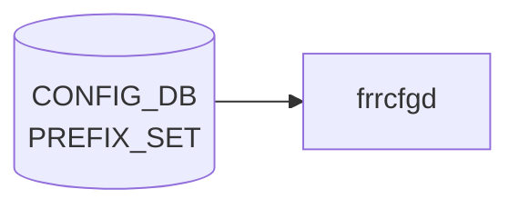

# PREFIX_SET テーブル

## 概要

`sonic-routing-policy-sets` モジュールが定義する **汎用 prefix set** の宣言テーブル[^1]。実際のメンバ prefix は `PREFIX` (`PREFIX_LIST` / `PREFIX_NOSEQ_LIST`) 側に格納し、`PREFIX_SET_LIST.name` を leafref で参照する。`frr-mgmt-framework` 経路のルーティングポリシで route-map `match ip address prefix-list` に展開される。

<!-- cdb-mermaid -->
### データフロー (自動生成)



!!! note "凡例"
    CONFIG_DB から SAI までの典型経路を `docs/reference/config-db-orch-map.md` から機械生成したミニ図。詳細・例外は本ページ本文と対応表を参照。
<!-- /cdb-mermaid -->

## key 構造

```text
PREFIX_SET|<name>
```

## フィールド

| フィールド | 型 | 説明 |
|-----------|----|------|
| `name` | string | prefix set 名（key） |
| `mode` | enum `IPv4` / `IPv6` | アドレスファミリ。デフォルト `IPv4` |

## メンバ prefix（派生テーブル）

メンバは同モジュール内 `PREFIX` コンテナに格納される:

- `PREFIX_LIST` (key: `name sequence_number ip_prefix masklength_range`): シーケンス番号付き
  - `sequence_number` (uint32 1..4294967295)
  - `ip_prefix` (inet:ip-prefix)
  - `masklength_range` (string、`exact` または `lo..hi`)
  - `action` (enum `permit`/`deny`)
- `PREFIX_NOSEQ_LIST` (key: `name ip_prefix masklength_range`): シーケンス番号なし

`grouping prefix-common-fields` で `name` が `../../../PREFIX_SET/PREFIX_SET_LIST/name` への leafref になる。

## 制約

- `PREFIX_LIST` の `sequence_number` は `must "count(... = 1) <= 1"` で同一 set 内ユニーク
- `mode` と実プレフィクスの family の整合チェックは TODO コメントで未実装

## 購読者

- `frr-mgmt-framework`: ルーティングポリシ管理（`DEVICE_METADATA.frr_mgmt_framework_config = true` 環境）
- 一部 [sonic-mgmt](../../reference/glossary.md#term-sonic-mgmt)-common transformer がここから [FRR](../../reference/glossary.md#term-frr) vtysh コマンドへ変換

## 関連 CONFIG_DB / YANG / CLI

- 関連 [CONFIG_DB](../../reference/glossary.md#term-config_db): `PREFIX_LIST` / `PREFIX_NOSEQ_LIST`、[`COMMUNITY_SET`](./community-set.md)、[`AS_PATH_SET`](./as-path-set.md)、`ROUTE_MAP`
- 関連 [YANG](../../reference/glossary.md#term-yang): `sonic-routing-policy-sets`
- 関連 CLI: なし（`config_db.json` 投入。[FRR](../../reference/glossary.md#term-frr) 側の `ip prefix-list` 等に最終的に変換される）

<!-- ref-triangle:start -->

## 関連リファレンス

- [YANG](../../reference/glossary.md#term-yang): `sonic-routing-policy-sets`

<!-- ref-triangle:end -->

## 引用元

[^1]: [YANG](../../reference/glossary.md#term-yang) 定義: `sonic-routing-policy-sets.yang`. <https://github.com/sonic-net/sonic-buildimage/blob/9ea932ec2e18f35e58268ec2e4456b1d4afd65cd/src/sonic-yang-models/yang-models/sonic-routing-policy-sets.yang>

<!-- ops-hint -->
## 運用ヒント

### 典型値

- key 形式: `PREFIX_SET|<name>`。
- `mode`: `IPv4` / `IPv6`、`prefix`: CIDR 列。route-map から `match ip address prefix-list` で参照。

### よくある誤設定

- IPv6 entry を IPv4 set に混在させて [FRR](../../reference/glossary.md#term-frr) が syntax エラーで読み込めない。

### 確認コマンド

```bash
sonic-db-cli CONFIG_DB keys 'PREFIX_SET|*'
vtysh -c 'show ip prefix-list'
```
<!-- /ops-hint -->

<!-- value-behavior -->
## 値依存挙動マトリクス

### `mode` 値別挙動
| 値 | 挙動 |
|----|------|
| `IPv4` | デフォルト。FRR の `ip prefix-list` に展開。IPv6 prefix を混在させると FRR が syntax エラー。 |
| `IPv6` | FRR の `ipv6 prefix-list` に展開。IPv4 prefix との混在は FRR エラー。 |

### `action` 値別挙動（PREFIX_LIST / PREFIX_NOSEQ_LIST 共通）
| 値 | 挙動 |
|----|------|
| `permit` | プレフィクスを許可。FRR に `permit` で展開。 |
| `deny` | プレフィクスを拒否。FRR に `deny` で展開。 |

### `masklength_range` 値別挙動
| 値 | 挙動 |
|----|------|
| `exact` | プレフィクス長を完全一致で評価。FRR に `ge` / `le` 修飾子なし。 |
| `lo..hi` 形式 | 範囲指定。FRR の `ge lo le hi` に変換。 |

<!-- /value-behavior -->

<!-- cdb-exceptions -->
## 例外条件・特殊挙動

- **[bgpcfgd](../../reference/glossary.md#term-bgpcfgd) は直接購読しない**: `PREFIX_SET` には専用の consumer manager がなく、[CONFIG_DB](../../reference/glossary.md#term-config_db) 変更はリアルタイムに FRR へプッシュされない。FRR テンプレート展開は `sonic-cfggen` が起動時に [CONFIG_DB](../../reference/glossary.md#term-config_db) を読み込む形式で行われる。[^2]
- **YANG leafref 違反で保存拒否**: `PREFIX` list の `set_name` が存在しない `PREFIX_SET.name` を参照している場合、sonic-yang バリデーション時に `leafref` エラーでロードが拒否される。ただし実行時の整合性検査はないため、実行中に `PREFIX_SET` エントリを削除しても参照中の `PREFIX` は残る。[^2]
- **ip_prefix の型バリデーション**: IPv4/IPv6 union 型の入力文字列が不正なとき YANG `pattern` 制約違反でロード拒否される。[^2]
- **未定義 prefix-set を参照する policy**: FRR 側では未定義の prefix-set を参照しているルーティングポリシは `inactive` 状態になり、[BGP](../../reference/glossary.md#term-bgp) フィルタとして機能しない。

[^2]: YANG 定義: `sonic-routing-policy-sets.yang`. <https://github.com/sonic-net/sonic-buildimage/blob/master/src/sonic-yang-models/yang-models/sonic-routing-policy-sets.yang>


<!-- derivation -->
## 派生・条件付き登録 (Phase 6/7)

### Phase 6: 自動派生

frrcfgd の `PrefixSetMgr` が `ip_prefix` の形式（`:` を含むか否か）に基づいて FRR コマンド種別を自動決定する。IPv6 → `ipv6 prefix-list`、IPv4 → `ip prefix-list`。CONFIG_DB 内フィールド間の自動付与なし。

### Phase 7: 条件付き登録 (add_manager 条件)

frrcfgd は常時起動し `PrefixSetMgr` を無条件登録する。sonic-mgmt-framework が非インストールの場合は frrcfgd 自体が存在しない（`PREFIX_SET` を消費するプロセスなし）。

<!-- /derivation -->

<!-- handler-branching -->
### Phase 8: Handler メソッド内分岐

| Handler | 分岐条件 | 効果 | evidence |
|---|---|---|---|
| `PrefixSetMgr` | `ip_prefix` に `:` 含む (IPv6) | `ipv6 prefix-list` コマンド生成 | frrcfgd prefix_set manager |
| `PrefixSetMgr` | `ip_prefix` に `.` 含む (IPv4) | `ip prefix-list` コマンド生成 | frrcfgd prefix_set manager |
| `PrefixSetMgr` | del_handler | FRR に `no ip prefix-list` 発行 | frrcfgd prefix_set manager |

> **スキャン証跡**: PREFIX_SET は BGP 汎用ルーティングポリシーセット用。frrcfgd 経由で FRR に設定。CONFIG_DB 内の自動派生なし。

<!-- /handler-branching -->

<!-- defaults -->
## フィールドの暗黙デフォルト (Phase A)

frrcfgd (`sonic-buildimage/src/sonic-frr-mgmt-framework/frrcfgd/frrcfgd.py`) のコード精読により判明したコード由来のデフォルトと、YANG 宣言との乖離点[^fdef]。

### `mode` — YANG-実装乖離（軽度）

| 状態 | YANG デフォルト | frrcfgd 実装挙動 |
|------|------------|------|
| フィールド不在 | `"IPv4"` | エラーログを出して当該 PREFIX_SET エントリを**完全スキップ**（`if 'mode' not in data: continue`、L2901-2903） |
| `"IPv4"` / `"ipv4"` / `"IPV4"` | — | `.lower()` で正規化し `MatchPrefixList('ipv4')` → `AF_INET` |
| `"IPv6"` 等それ以外 | — | `MatchPrefixList(<value>)` で `af_mode == 'ipv4'` 一致以外は **すべて `AF_INET6` にフォールバック**（L1665）。typo (`"ipv5"` 等) も IPv6 として扱われる |

YANG モードで投入する経路（sonic-yang-mgmt / [sonic-cfggen](../../reference/glossary.md#term-sonic-cfggen) YANG 検証 / GNMI）では YANG default `"IPv4"` が補完される。`redis-cli` / `sonic-db-cli hset` で直接 [CONFIG_DB](../../reference/glossary.md#term-config_db) に書く場合は `mode` 欠落で frrcfgd が無反応になる点に注意。

### family 既定 — `PREFIX_SET` には実装側フォールバックなし

`MatchPrefixList.__init__` は `af_mode=None` で生成すると `self.af = None` となり、その後 `add_prefix()` の最初の呼び出しで `__get_ip_af()` が prefix 文字列から family を自動推定する（L1660-1690）。ただしこの「最初の prefix の family を採用」する経路は **`NEIGHBOR_SET` / `NEXTHOP_SET` ハンドラ専用**で、`PREFIX_SET` ハンドラからは常に `mode` 引数付きで `MatchPrefixList(set_mode)` を呼ぶため到達しない。よって `PREFIX_SET` の family 既定は YANG レイヤ (`default "IPv4"`) のみが提供する。

### `action` 既定（参考 — PREFIX メンバ側）

`MatchPrefix.__init__` および `MatchPrefixList.add_prefix` の Python デフォルト引数は `action='permit'`（L1622, L1682）。`PREFIX_SET` テーブル自身に `action` フィールドはなく、メンバ `PREFIX_LIST` / `PREFIX_NOSEQ_LIST` 側で持つため、ここでの既定はあくまで Python メソッド側のフォールバック。YANG default も `permit` で一致。

[^fdef]: frrcfgd 実装: `sonic-net/sonic-buildimage`, `src/sonic-frr-mgmt-framework/frrcfgd/frrcfgd.py` L1605-1700, L2894-2910. <https://github.com/sonic-net/sonic-buildimage/blob/master/src/sonic-frr-mgmt-framework/frrcfgd/frrcfgd.py>

<!-- /defaults -->

<!-- runtime-trace -->
## CDB → 実コンテナ動作トレース

### 段階 1: Consumer 登録

- **bgpcfgd** または **sonic-cfggen**: `PREFIX_SET` テーブルを `ConfigDBConnector` で購読。

### 段階 2: CFG → APPL 翻訳

- bgpcfgd が FRR の prefix-list 設定を生成して vtysh 経由で反映。
- APP_DB への書き込みなし。

### 段階 3: APPL → SAI

- FRR がプレフィックスセットをポリシーマッチ条件として使用。SAI 経由なし。

### 段階 4: タイミング + 副作用

- FRR 設定反映は即時。ルーティングポリシーへの影響はピアの next UPDATE から。

<!-- /runtime-trace -->
<!-- entry-points -->
## 書き込み入り口 (Direction A)

PREFIX_SET テーブルへの書き込みが発生するコード経路を網羅的に調査した結果。

### CLI

  - 専用 CLI なし — `sonic-cfggen` または手動 `config load` 経由

### minigraph / sonic-cfggen

minigraph.py に PREFIX_SET 生成なし

### REST / gNMI

REST/gNMI 書き込み経路なし

### db_migrator

db_migrator.py での PREFIX_SET マイグレーションなし

### ビルド時デフォルト (build-time default)

なし

### ハードコードデフォルト / ランタイム注入

**frrcfgd** `frrcfgd.py` が PREFIX_SET テーブルを監視し FRR 設定に反映 (sonic-buildimage/src/sonic-frr-mgmt-framework/frrcfgd/frrcfgd.py:83, 2228)

### 死活・デッドコード

なし
<!-- /entry-points -->

<!-- ordering -->
## 書込み順依存 (Phase B)

`frrcfgd` (`bgp_table_handler_common`) が `PREFIX_SET` / `PREFIX` / `ROUTE_MAP` 三者間の順序依存を持つ。`frrcfgd.py` L2227-2246, L2894-2916, L2663-2676 および `sonic-route-map.yang:163-187` の精読から抽出。

### 強制順序（破ると DROP またはサイレントスキップ）

| # | 依存関係 | 方向 | 破った場合の挙動 |
|---|----------|------|----------------|
| 1 | `PREFIX_SET\|<name>` SET → `PREFIX\|<name>\|*` SET | **先行必須** | `PREFIX` イベント受信時 `pfx_set_name not in prefix_set_list` → LOG_ERR + `continue`（PREFIX エントリが完全 DROP） |
| 2 | `PREFIX_SET\|<name>` SET → `ROUTE_MAP.match_prefix_set/<name>` SET | **先行必須**（YANG 経路） | YANG leafref validation reject。直書き経路は通るが FRR コマンド生成時 af_mode 不明 → IPv4 として誤扱い |
| 3 | `PREFIX_SET\|<name>` SET → `ROUTE_MAP.match_next_hop_set/<name>` SET | **先行必須**（YANG 経路） | 同上 |
| 4 | `ROUTE_MAP.match_prefix_set` 参照削除 → `PREFIX\|<name>\|*` DEL → `PREFIX_SET\|<name>` DEL | 推奨 DEL 順 | YANG 経路: `PREFIX_SET` を先に DEL しようとすると leafref reject。直書き: DEL は通るが FRR ip prefix-list が残留 |

### mode 変更時のシーケンス（UPDATE 非対応）

runtime で既存 `PREFIX_SET|<name>` に SET イベントが届いても `mode` の変更は静かに無視される（`if pfx_set_name in self.prefix_set_list: continue`、L2896-2900）。`mode` を変更するには以下の順序が必要:

1. `ROUTE_MAP.match_prefix_set` / `match_next_hop_set` の当該 set 参照を削除
2. `PREFIX|<name>|*` の全エントリを DEL（FRR prefix-list エントリ削除）
3. `PREFIX_SET|<name>` を DEL（frrcfgd の内部キャッシュから削除）
4. `PREFIX_SET|<name>` を新 mode で SET
5. `PREFIX|<name>|*` を再投入

### daemon 優先度（PREFIX vs PREFIX_SET）

| テーブル | TABLE_DAEMON | 影響 FRR プロセス |
|---------|-------------|-----------------|
| `PREFIX_SET` | `['bgpd']` | bgpd のみ |
| `PREFIX` | `['zebra', 'bgpd', 'ospfd', 'pimd']` | 複数デーモン同時 |

`PREFIX` エントリの DEL は zebra / ospfd / pimd にも `no ip prefix-list` を発行するため、ルーティングポリシーへの波及が広い。

### 起動時の読み込み順（自然保証）

frrcfgd init (L2227-2245) は `PREFIX_SET` → `PREFIX` の順でテーブルを読み込む。起動時は順序衝突なし。runtime の非同期イベントのみ順序依存が問題となる。

<!-- evidence: frrcfgd.py:83,87,2227-2246,2894-2916,2663-2676; sonic-route-map.yang:163-187 -->

> 詳細根拠は `meta/_intermediate/cdb-flow/prefix-set-ordering.md` を参照
<!-- /ordering -->

<!-- cross-refs -->
## 暗黙参照テーブル (Phase C)

YANG leafref および frrcfgd 実装スキャンにより確認した参照先・被参照テーブル一覧。詳細は `meta/_intermediate/cdb-flow/prefix-set-cross-refs.md` を参照。

| 参照先テーブル / リソース | 参照方向 | 参照フィールド | 条件・備考 |
|--------------------------|---------|--------------|-----------|
| `PREFIX` (`PREFIX_LIST` / `PREFIX_NOSEQ_LIST`) | leafref ターゲット（被参照） | `set_name` | PREFIX_SET が先行必須。未作成時 YANG バリデーションでロード拒否 |
| [`ROUTE_MAP`](route-map.md) | 逆参照（ROUTE_MAP が PREFIX_SET を leafref） | `match_prefix_set`, `match_next_hop_set` | PREFIX_SET 未作成時 frrcfgd が AF 解決失敗 → FRR コマンド未発行（silent drop）。`frrcfgd.py:2669-2676` |
| [`ROUTE_MAP`](route-map.md) | 逆参照（YANG のみ、実装なし） | `match_ipv6_prefix_set` | sonic-route-map.yang には leafref あり、frrcfgd の `route_map_key_map` に未実装 → dead field |
| [`BGP_NEIGHBOR_AF`](bgp-neighbor-af.md) | 逆参照（BGP ネイバーが PREFIX_SET を leafref） | `prefix_list_in`, `prefix_list_out` | frrcfgd が `neighbor {} prefix-list {} in/out` として [FRR](../../reference/glossary.md#term-frr) に発行。`frrcfgd.py:1918-1919` |
| [`BGP_PEER_GROUP_AF`](bgp-peer-group-af.md) | 逆参照（BGP peer group が PREFIX_SET を leafref） | `prefix_list_in`, `prefix_list_out` | BGP_NEIGHBOR_AF と同一 handler 経路 |

!!! note "match_ipv6_prefix_set は dead field"
    `sonic-route-map.yang` では `match_ipv6_prefix_set` に `PREFIX_SET` への leafref が定義されているが、frrcfgd の `route_map_key_map`（`frrcfgd.py:1928-1929`）には `match_prefix_set|ipv4` / `match_prefix_set|ipv6` のエントリのみ存在し `match_ipv6_prefix_set` のエントリはない。CONFIG_DB に書いても frrcfgd が処理せず FRR に反映されない。

> 詳細根拠は `meta/_intermediate/cdb-flow/prefix-set-cross-refs.md` を参照
<!-- /cross-refs -->

<!-- failure -->
## 失敗挙動 (Phase D)

frrcfgd は PREFIX_SET / PREFIX の変換失敗をすべて **syslog LOG_ERR + `continue`** で処理する。retry・rollback（DEL 失敗時のみ例外）・STATE_DB 記録はない。

### 1. `mode` フィールド欠落 → LOG_ERR + silent drop

`PREFIX_SET|<name>` SET イベントに `mode` がない場合:

```
LOG_ERR: 'no mode given for prefix-set <name>'
```

`prefix_set_list` へのキャッシュ登録もされないため、後続の `PREFIX|<name>|*` SET イベントも全て DROP される（ガード #3 に該当）。**YANG 経路では YANG default `"IPv4"` が補完されるためこの問題は発生しない。`redis-cli hset` 等の直接書き込みでのみ発生する。**

### 2. 既存 PREFIX_SET への重複 SET → 無言スキップ

既存エントリへの SET 時は LOG_DEBUG のみ出力し更新をスキップする（`frrcfgd.py:2896-2900`）。
`mode` 変更は実行時に**反映されない**。変更には DEL → SET のシーケンスが必要（Phase B 参照）。

### 3. PREFIX_SET 未登録状態で PREFIX エントリが届く → LOG_ERR + DROP

対応 PREFIX_SET がキャッシュに存在しない状態で `PREFIX|<name>|*` SET イベントが届いた場合:

```
LOG_ERR: 'could not find prefix-set <name> from cache'
```

vtysh コマンド未発行。PREFIX エントリは CONFIG_DB に残るが FRR には反映されない。

### 4. PREFIX メンバ vtysh DEL 失敗 → LOG_ERR + キャッシュ不整合

`no ip prefix-list` コマンドが失敗した場合:

```
LOG_ERR: 'failed to delete prefix <ip> with range <range> from set <name>'
```

frrcfgd はキャッシュからの削除を行わず `continue`。**FRR に旧エントリが残存し、frrcfgd 内部キャッシュとの不整合が発生する。retry なし。**

### 5. PREFIX メンバ vtysh ADD 失敗 → LOG_ERR + キャッシュ revert + continue

ADD vtysh コマンドが失敗した場合:

```
LOG_ERR: 'failed to add prefix <ip> with range <range> to set <name>'
```

frrcfgd は内部キャッシュから追加済みエントリを **revert** する（DEL 失敗時は revert なし）。自動 retry はない。

### 6. ip_prefix 不正フォーマット → ValueError + LOG_ERR + continue

`MatchPrefixList.add_prefix()` が解析失敗すると `ValueError` を送出し:

```
LOG_ERR: 'failed to update prefix-set <name> in cache with prefix <ip> range <range>'
```

FRR には未登録。YANG バリデーション経路では事前に拒否されるため直接書き込み時のみ発生。

### 7. 起動時 FRR デーモン接続失敗 → 最大 100 回 retry → プロセス終了

frrcfgd 起動時に FRR Unix socket (`/run/frr/<daemon>.vty`) への接続を **2 秒間隔・最大 100 回（約 200 秒）** リトライ。超過時は `re-tried too many times, give up` LOG_ERR でプロセス終了。再起動後は CONFIG_DB の全エントリを再読み込みして再適用する。

### 失敗パターンサマリ

| ケース | テーブル | LOG_ERR | FRR 反映 | retry | 備考 |
|--------|---------|---------|---------|-------|------|
| `mode` 欠落 | PREFIX_SET | あり | なし | なし | 後続 PREFIX も全 DROP |
| 既存エントリ重複 SET | PREFIX_SET | なし (LOG_DEBUG) | なし | なし | mode 変更は無視 |
| PREFIX_SET 未登録で PREFIX 到着 | PREFIX | あり | なし | なし | SET 前に PREFIX_SET が必要 |
| vtysh DEL 失敗 | PREFIX | あり | なし | なし | FRR ゴーストエントリ残存 |
| vtysh ADD 失敗 | PREFIX | あり | なし | なし | キャッシュ revert あり |
| ip_prefix 不正 | PREFIX | あり | なし | なし | YANG 経路では事前拒否 |
| 起動時接続失敗 | 全般 | あり | なし | 最大 100 回 | 超過でプロセス終了 |

### STATE_DB / ERROR_TABLE

frrcfgd は PREFIX_SET / PREFIX の失敗を STATE_DB や ERROR_TABLE に**記録しない**。障害検知は syslog のみ。

```bash
journalctl -u frr-mgmt-framework | grep -E 'prefix-set|prefix-list'
vtysh -c 'show ip prefix-list'
vtysh -c 'show ipv6 prefix-list'
```

> **スキャン証跡**: `frrcfgd.py` L2894-2910 (PREFIX_SET ハンドラ), L2911-2997 (PREFIX ハンドラ), L181-218 (接続 retry)。詳細は `meta/_intermediate/cdb-flow/prefix-set-failure.md` を参照。

<!-- /failure -->

<!-- constants -->
## ハードコード定数 (Phase E)

frrcfgd が `PREFIX_SET` / `PREFIX` テーブル処理でハードコードしている定数一覧。詳細は `meta/_intermediate/cdb-flow/prefix-set-constants.md` を参照。

### TABLE_DAEMON ディスパッチ定数 (frrcfgd.py:83)

| テーブル | 対象 FRR デーモン |
|---------|----------------|
| `PREFIX_SET` | `bgpd` のみ |
| `PREFIX` | `zebra`, `bgpd`, `ospfd`, `pimd`（4 プロセス同時） |

`PREFIX_SET` の変更は bgpd にのみ反映されるが、`PREFIX` メンバの追加・削除は OSPF / PIM を含む全ルーティングデーモンに波及する。`PREFIX` DEL 操作は ルーティングポリシー全体への影響が広いため注意が必要。

### masklength_range 変換定数

```python
class MatchPrefix:
    IPV4_MAXLEN = 32   # frrcfgd.py:1606
    IPV6_MAXLEN = 128  # frrcfgd.py:1607
```

`masklength_range` の上限値がアドレスファミリの最大マスク長（IPv4: 32、IPv6: 128）に一致する場合、FRR コマンドの `le` 修飾子を省略する（FRR デフォルトと等価なため冗長修飾を避ける）。

**具体例**: `masklength_range = "0..32"` を IPv4 PREFIX に設定すると、`show ip prefix-list` の出力では `ge 0` のみ表示され `le 32` は現れない。CONFIG_DB の値と FRR の表示が一見異なるが正常動作。

### mode 文字列 正規化

`PREFIX_SET.mode` フィールドの YANG enum 値は大文字（`IPv4` / `IPv6`）だが、frrcfgd は `bgp_table_handler_common` (L2904) で `.lower()` 変換してから内部処理する（内部値: `'ipv4'` / `'ipv6'`）。YANG 経路以外の直接書き込みで大文字以外の variant を渡しても frrcfgd が正規化する。

### FRR コマンドテンプレート（ハードコード）

frrcfgd が発行する FRR コマンド文字列（frrcfgd.py:2945, 2960, 2977, 2991）:

| 操作 | FRR コマンドテンプレート |
|-----|----------------------|
| PREFIX ADD (IPv4) | `ip prefix-list <name> <seq> <action> <prefix> [ge X] [le Y]` |
| PREFIX ADD (IPv6) | `ipv6 prefix-list <name> <seq> <action> <prefix> [ge X] [le Y]` |
| PREFIX DEL (IPv4) | `no ip prefix-list <name> <entry>` |
| PREFIX DEL (IPv6) | `no ipv6 prefix-list <name> <entry>` |
| PREFIX_SET DEL (IPv4) | `no ip prefix-list <name>` |
| PREFIX_SET DEL (IPv6) | `no ipv6 prefix-list <name>` |

<!-- evidence: frrcfgd.py:83,1606-1607,1665,2904,2945,2960,2977,2991 -->

> 詳細根拠は `meta/_intermediate/cdb-flow/prefix-set-constants.md` を参照
<!-- /constants -->

<!-- side-effects -->
## 変更波及 / 副作用 (Phase F)

PREFIX_SET / PREFIX の変更は frrcfgd 経由で FRR に即時反映され、ルーティングポリシー・BGP・OSPF・PIM に連鎖的な影響を及ぼす。CONFIG_DB 内の他テーブルへの直接書き込みはない。

### 1. PREFIX_SET DEL → FRR prefix-list 全削除 → route-map 即時無効化

`PREFIX_SET|<name>` DEL 時、frrcfgd は `no ip prefix-list <name>`（または `no ipv6 prefix-list <name>`）を vtysh で発行し、FRR から prefix-list を完全削除する（frrcfgd.py:2976-2981）。その結果、当該 prefix-list を `match ip address prefix-list <name>` で参照するすべての route-map statement が **条件未一致（= deny）として即時動作**する。

!!! warning "意図せぬ全ルート拒否のリスク"
    PREFIX_SET を DEL する前に ROUTE_MAP / BGP_NEIGHBOR_AF / BGP_PEER_GROUP_AF 側の参照を先に削除しないと、参照先不明の prefix-list は FRR に `deny` として評価されるため、フィルタリング対象ルートが全拒否になる。

### 2. PREFIX メンバ変更 → 複数 FRR デーモンへ同時発行

`PREFIX_LIST` / `PREFIX_NOSEQ_LIST` の ADD / DEL は TABLE_DAEMON 定義（frrcfgd.py:87）に従い **bgpd / zebra / ospfd / pimd の 4 デーモンすべて**に vtysh コマンドを発行する。

| FRR デーモン | 影響 |
|------------|------|
| `bgpd` | BGP ルーティングポリシー再評価 |
| `zebra` | カーネル経路フィルタ再適用 |
| `ospfd` | OSPF redistribute フィルタ再評価 |
| `pimd` | PIM SSM グループレンジ変更（`ip pim ssm prefix-list` 参照時） |

PREFIX_SET 本体の変更は `bgpd` のみへの通知（frrcfgd.py:83）であり、PREFIX メンバの方が影響範囲が広い。

### 3. BGP ピアへの自動 soft-reconfiguration

frrcfgd は FRR への prefix-list 変更後に明示的な `clear ip bgp` コマンドを発行しない。FRR bgpd が変更を検知して対象ピアへ **自動で soft-reconfiguration** を実行する:

- 許可 → 拒否 に変わった経路: BGP WITHDRAW 送出
- 拒否 → 許可 に変わった経路: BGP UPDATE 送出

通知は FRR 内部の非同期処理のためミリ秒〜秒単位の遅延がある。

### 4. CONFIG_DB / STATE_DB / APPL_DB への副作用なし

PREFIX_SET / PREFIX の変更は CONFIG_DB 内他テーブル・APPL_DB・STATE_DB・COUNTERS_DB を直接書き換えない。すべての副作用は FRR vtysh コマンド経由の FRR 内部状態変更のみ。

<!-- evidence: frrcfgd.py:83,87,2931,2945,2960,2974-2981 -->

> 詳細根拠は `meta/_intermediate/cdb-flow/prefix-set-side-effects.md` を参照
<!-- /side-effects -->

<!-- pubsub -->
## CONFIG_DB 購読メカニズム (Phase G)

PREFIX_SET / PREFIX テーブルを購読するデーモンは **frrcfgd** のみ。bgpcfgd はこれらのテーブルを直接購読しない。

### frrcfgd (sonic-frr-mgmt-framework)

`frrcfgd.py` は `ExtConfigDBConnector`（`ConfigDBConnector` サブクラス）を使用し、Redis keyspace イベント (`__keyspace@<dbid>__:*`) を `psubscribe` で監視する。`subscribe_all()` が `table_handler_list` 内の `PREFIX_SET` / `PREFIX` エントリを登録し、共通ハンドラ `bgp_table_handler_common` が変更通知を受け取る。

```python
# frrcfgd.py L2298-2299
('PREFIX_SET', self.bgp_table_handler_common),
('PREFIX', self.bgp_table_handler_common),
...
# frrcfgd.py L2359-2361
def subscribe_all(self):
    for table, hdlr in self.table_handler_list:
        self.config_db.subscribe(table, hdlr)
```

変更検知後、`bgp_table_handler_common` がイベントを `bgp_message` キューに投入し、`__update_bgp` が処理する。

**PREFIX_SET イベント処理**（frrcfgd.py L2894-2910）: FRR コマンドを直接発行せず `prefix_set_list` キャッシュのみ更新（新規 SET → `MatchPrefixList(mode)` 追加、DEL → キャッシュ削除）。

**PREFIX イベント処理**（frrcfgd.py L2911-2936）: `prefix_set_list` キャッシュから af を参照し、Jinja2 テンプレート `bgpd.conf.db.pref_list.j2` 経由で `ip/ipv6 prefix-list` vtysh コマンドを生成・実行。適用対象デーモンは AF 依存（IPv4 → 全デーモン、IPv6 → `['bgpd', 'zebra']`）。

### 購読フロー要約

```
CONFIG_DB PREFIX_SET / PREFIX
  └─ frrcfgd (ExtConfigDBConnector psubscribe)
       └─ bgp_table_handler_common
            ├─ PREFIX_SET イベント: prefix_set_list キャッシュ更新のみ（FRR コマンド非発行）
            └─ PREFIX イベント: Jinja2 (bgpd.conf.db.pref_list.j2)
                 └─ vtysh ip/ipv6 prefix-list <name> [seq <seq>] <action> <prefix>
                    適用デーモン: IPv4 → 全デーモン / IPv6 → ['bgpd', 'zebra']
```

> **スキャン証跡**: `frrcfgd.py` L2298-2299 (table_handler_list 登録), L2359-2361 (subscribe_all), L1536-1552 (listen_thread/psubscribe), L2894-2910 (PREFIX_SET ハンドラ), L2911-2936 (PREFIX ハンドラ)。`bgpd.conf.db.pref_list.j2` L1-42 (Jinja2 テンプレート)。詳細は `meta/_intermediate/cdb-flow/prefix-set-pubsub.md` を参照。
<!-- /pubsub -->

<!-- glossary-links-injected: 88e792f23f63 -->
