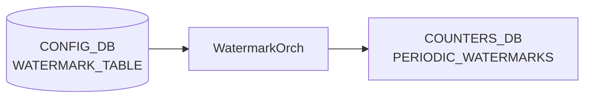

# WATERMARK_TABLE テーブル

## 概要

Periodic watermark のテレメトリ周期を設定するテーブル[^1]。`WatermarkOrch` ([orchagent](../../reference/glossary.md#term-orchagent)) が購読し、`PERIODIC_WATERMARKS` テーブル (COUNTERS_DB) を指定周期で自動クリアする。`FLEX_COUNTER_TABLE` の `QUEUE_WATERMARK` / `PG_WATERMARK` グループが enable になったときにタイマーが起動する。

<!-- cdb-mermaid -->
### データフロー (自動生成)



!!! note "凡例"
    CONFIG_DB から COUNTERS_DB までの典型経路を示す。詳細・例外は本ページ本文を参照。
<!-- /cdb-mermaid -->

## key 構造

```text
WATERMARK_TABLE|TELEMETRY_INTERVAL
```

シングルトンエントリ。`TELEMETRY_INTERVAL` のみが有効なキー。

## 主要フィールド

| フィールド | 型 | 説明 |
|----------|----|------|
| `interval` | uint32 (秒) | periodic watermark クリア間隔。省略時は 120 秒が内部デフォルト。 |

YANG モデルなし。スキーマ検証は orchagent 側の `to_uint<uint32_t>()` によるランタイム型変換のみ。

## 購読者

- `WatermarkOrch` (`orchagent/watermarkorch.cpp`): `CFG_WATERMARK_TABLE_NAME` を `SubscriberStateTable` で購読。`handleWmConfigUpdate()` が `interval` を受け取り `SelectableTimer` の周期を更新する。

## 関連 CONFIG_DB / YANG / CLI

- 関連 [CONFIG_DB](../../reference/glossary.md#term-config_db): `FLEX_COUNTER_TABLE`（`QUEUE_WATERMARK` / `PG_WATERMARK` の enable/disable でタイマー起動/停止）
- 関連 CLI: `watermarkcfg -c <秒>`（周期設定）、`watermarkcfg -s`（現在値表示）
- 関連 [YANG](../../reference/glossary.md#term-yang): なし（YANG モデル未定義）

<!-- defaults -->
## コード由来の暗黙デフォルト

<!-- evidence: meta/_intermediate/cdb-flow/pwm-defaults.md -->

### `interval` — ハードコードデフォルト 120 秒

`WatermarkOrch` コンストラクタ (`watermarkorch.cpp:9,41`) で `#define DEFAULT_TELEMETRY_INTERVAL 120` をタイマー初期値として使用する。

```cpp
#define DEFAULT_TELEMETRY_INTERVAL 120
// ...
auto intervT = timespec { .tv_sec = DEFAULT_TELEMETRY_INTERVAL , .tv_nsec = 0 };
m_telemetryTimer = new SelectableTimer(intervT);
```

`WATERMARK_TABLE|TELEMETRY_INTERVAL` エントリが CONFIG_DB に存在しない場合、orchagent は **120 秒**を telemetry 周期として使用する。`watermarkcfg -s` もエントリ不在時に `"Telemetry interval 120 second(s)"` を表示する (`watermarkcfg:show_interval()`)。

### タイマー起動条件 — FLEX_COUNTER enable 依存

タイマーは orchagent 起動時には停止状態 (`m_wmStatus = 0`)。`FLEX_COUNTER_TABLE` の `QUEUE_WATERMARK` または `PG_WATERMARK` の `FLEX_COUNTER_STATUS` が `enable` に変わると `m_telemetryTimer->start()` が呼ばれる (`watermarkorch.cpp:133`)。両グループとも disable になると `m_telemetryTimer->stop()` が呼ばれる。

### インターバル変更反映タイミング — 次タイマー満了後

`WATERMARK_TABLE|TELEMETRY_INTERVAL` を更新しても、現在の telemetry 周期が満了するまで新インターバルは適用されない（`m_timerChanged = true` セット → 次の timer tick で `m_telemetryTimer->reset()` を呼ぶ）。

<!-- /defaults -->

<!-- ordering -->
## 書込み順序依存 (Phase B)

<!-- evidence: meta/_intermediate/cdb-flow/pwm-ordering.md -->

### 依存関係マップ

```
PORT テーブル (PortsOrch allPortsReady)
  └─► WatermarkOrch 処理開始ゲート  （false の間は WATERMARK_TABLE / FLEX_COUNTER_TABLE 両方ブロック）

FLEX_COUNTER_TABLE|QUEUE_WATERMARK または PG_WATERMARK (FLEX_COUNTER_STATUS=enable)
  └─► telemetry タイマー起動         （m_wmStatus が 0 → 非ゼロに変化した瞬間に start()）

WATERMARK_TABLE|TELEMETRY_INTERVAL (interval フィールド)
  └─► telemetry タイマー周期変更     （即時反映ではなく、現タイマー満了後の次サイクルから適用）
```

### 書込み順序ルール

| 優先度 | ルール | 根拠 |
|--------|--------|------|
| 必須 | PortsOrch の `allPortsReady()` が true になるまで `WATERMARK_TABLE` / `FLEX_COUNTER_TABLE` への書込みは保留される | `watermarkorch.cpp:56` の早期 return ガード。false の間は `m_toSync` にキューイングされ自動再処理される |
| 重要 | telemetry タイマーを起動させるには `FLEX_COUNTER_TABLE|QUEUE_WATERMARK` または `FLEX_COUNTER_TABLE|PG_WATERMARK` の `FLEX_COUNTER_STATUS=enable` が必要 | `watermarkorch.cpp:136-138`: `!prevStatus && m_wmStatus` の条件を満たさないとタイマーが起動しない。`WATERMARK_TABLE` の設定だけではタイマーは起動しない |
| 推奨 | `WATERMARK_TABLE|TELEMETRY_INTERVAL` は `FLEX_COUNTER_TABLE` の enable より前に書く | enable 後の `interval` 変更は現タイマー満了（最大 120 秒）まで新値が適用されない (`m_timerChanged = true` → 次 tick で `reset()`) |
| 注意 | `FLEX_COUNTER_TABLE` の `QUEUE_WATERMARK` と `PG_WATERMARK` が両方 disable になるとタイマーが停止する | `watermarkorch.cpp:254-257`: `m_wmStatus == 0` のとき `m_telemetryTimer->stop()`。PERIODIC_WATERMARKS の自動クリアが停止する |

### タイミング制約

- **`WATERMARK_TABLE|TELEMETRY_INTERVAL` 書込みのタイミングは任意**。orchagent 起動前・起動後どちらでも機能する。起動前に書いた場合は `allPortsReady()` 後に `m_toSync` から再処理される。
- **インターバル変更の反映は次タイマー満了後**。変更直後のクリア間隔は旧値のまま。急ぎの場合は `watermarkcfg -c <新値>` 後に `watermark clear` で手動クリアを検討する。
- **`FLEX_COUNTER_TABLE` への書込みは `WATERMARK_TABLE` と独立**して処理されるが、同じ `allPortsReady()` ガードを共有する (`orchagent/watermarkorch.cpp:56`)。

<!-- /ordering -->

<!-- cross-refs -->
## 暗黙参照マップ (Phase C)

<!-- evidence: meta/_intermediate/cdb-flow/pwm-cross-refs.md -->

| 参照方向 | このテーブル | 相手テーブル / ページ | 条件 |
|---------|------------|---------------------|------|
| WATERMARK_TABLE → | `interval` 変更 → タイマー制御 | [`FLEX_COUNTER_TABLE`](flex-counter-table.md) | `QUEUE_WATERMARK` / `PG_WATERMARK` の `FLEX_COUNTER_STATUS=enable` がないとタイマーが起動しない。`WATERMARK_TABLE` 単独では watermark 自動クリアは動作しない |
| WATERMARK_TABLE → | タイマー満了ごとの 0 クリア | COUNTERS_DB `PERIODIC_WATERMARKS` | `WatermarkOrch` が telemetry 周期ごとに SAI 統計をリセットして書き込む |
| → WATERMARK_TABLE | `FLEX_COUNTER_TABLE\|QUEUE_WATERMARK` / `FLEX_COUNTER_TABLE\|PG_WATERMARK` の `FLEX_COUNTER_STATUS` | [`FLEX_COUNTER_TABLE`](flex-counter-table.md) | `FLEX_COUNTER_STATUS` の変化が `m_wmStatus` ビットマスクを更新し、タイマー起動 (`start()`) / 停止 (`stop()`) を制御する (`watermarkorch.cpp:136-138, 254-257`) |
| → WATERMARK_TABLE | APPL_DB `WATERMARK_CLEAR_REQUEST` 通知 | `watermarkcfg clear` CLI | `"PERSISTENT"` / `"USER"` op でそれぞれの COUNTERS_DB テーブルをリセット。`PERIODIC_WATERMARKS` はタイマーのみがリセット対象 |
| CLI | `watermarkcfg -c <秒>` / `-s` | [`watermarkcfg`](../cli/) | `interval` フィールドの書き込み（CONFIG_DB HSET）と読み出し |

> **ポイント**: `WATERMARK_TABLE` は interval 制御のみを担い、タイマー起動/停止は `FLEX_COUNTER_TABLE` が主導する。両テーブルを `WatermarkOrch` が同一 `Consumer` ループで購読する (`watermarkorch.cpp:72-78`)。

<!-- /cross-refs -->

<!-- ref-triangle:start -->

## 関連リファレンス

- CLI: `watermarkcfg`, `watermarkstat`
- 関連テーブル: [`FLEX_COUNTER_TABLE`](flex-counter-table.md)

<!-- ref-triangle:end -->

## 引用元

[^1]: `WatermarkOrch` 実装: `sonic-swss/orchagent/watermarkorch.cpp`. <https://github.com/sonic-net/sonic-swss/blob/master/orchagent/watermarkorch.cpp>
