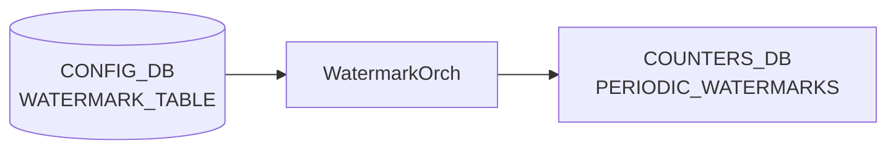

# WATERMARK_TABLE テーブル

## 概要

Periodic watermark のテレメトリ周期を設定するテーブル[^1]。`WatermarkOrch` ([orchagent](../../reference/glossary.md#term-orchagent)) が購読し、`PERIODIC_WATERMARKS` テーブル (COUNTERS_DB) を指定周期で自動クリアする。`FLEX_COUNTER_TABLE` の `QUEUE_WATERMARK` / `PG_WATERMARK` グループが enable になったときにタイマーが起動する。

<!-- cdb-mermaid -->
### データフロー (自動生成)



!!! note "凡例"
    CONFIG_DB から COUNTERS_DB までの典型経路を示す。詳細・例外は本ページ本文を参照。
<!-- /cdb-mermaid -->

## key 構造

```text
WATERMARK_TABLE|TELEMETRY_INTERVAL
```

シングルトンエントリ。`TELEMETRY_INTERVAL` のみが有効なキー。

## 主要フィールド

| フィールド | 型 | 説明 |
|----------|----|------|
| `interval` | uint32 (秒) | periodic watermark クリア間隔。省略時は 120 秒が内部デフォルト。 |

YANG モデルなし。スキーマ検証は orchagent 側の `to_uint<uint32_t>()` によるランタイム型変換のみ。

## 購読者

- `WatermarkOrch` (`orchagent/watermarkorch.cpp`): `CFG_WATERMARK_TABLE_NAME` を `SubscriberStateTable` で購読。`handleWmConfigUpdate()` が `interval` を受け取り `SelectableTimer` の周期を更新する。

## 関連 CONFIG_DB / YANG / CLI

- 関連 [CONFIG_DB](../../reference/glossary.md#term-config_db): `FLEX_COUNTER_TABLE`（`QUEUE_WATERMARK` / `PG_WATERMARK` の enable/disable でタイマー起動/停止）
- 関連 CLI: `watermarkcfg -c <秒>`（周期設定）、`watermarkcfg -s`（現在値表示）
- 関連 [YANG](../../reference/glossary.md#term-yang): なし（YANG モデル未定義）

<!-- defaults -->
## コード由来の暗黙デフォルト

<!-- evidence: meta/_intermediate/cdb-flow/pwm-defaults.md -->

### `interval` — ハードコードデフォルト 120 秒

`WatermarkOrch` コンストラクタ (`watermarkorch.cpp:9,41`) で `#define DEFAULT_TELEMETRY_INTERVAL 120` をタイマー初期値として使用する。

```cpp
#define DEFAULT_TELEMETRY_INTERVAL 120
// ...
auto intervT = timespec { .tv_sec = DEFAULT_TELEMETRY_INTERVAL , .tv_nsec = 0 };
m_telemetryTimer = new SelectableTimer(intervT);
```

`WATERMARK_TABLE|TELEMETRY_INTERVAL` エントリが CONFIG_DB に存在しない場合、orchagent は **120 秒**を telemetry 周期として使用する。`watermarkcfg -s` もエントリ不在時に `"Telemetry interval 120 second(s)"` を表示する (`watermarkcfg:show_interval()`)。

### タイマー起動条件 — FLEX_COUNTER enable 依存

タイマーは orchagent 起動時には停止状態 (`m_wmStatus = 0`)。`FLEX_COUNTER_TABLE` の `QUEUE_WATERMARK` または `PG_WATERMARK` の `FLEX_COUNTER_STATUS` が `enable` に変わると `m_telemetryTimer->start()` が呼ばれる (`watermarkorch.cpp:133`)。両グループとも disable になると `m_telemetryTimer->stop()` が呼ばれる。

### インターバル変更反映タイミング — 次タイマー満了後

`WATERMARK_TABLE|TELEMETRY_INTERVAL` を更新しても、現在の telemetry 周期が満了するまで新インターバルは適用されない（`m_timerChanged = true` セット → 次の timer tick で `m_telemetryTimer->reset()` を呼ぶ）。

<!-- /defaults -->

<!-- ref-triangle:start -->

## 関連リファレンス

- CLI: `watermarkcfg`, `watermarkstat`
- 関連テーブル: [`FLEX_COUNTER_TABLE`](flex-counter-table.md)

<!-- ref-triangle:end -->

## 引用元

[^1]: `WatermarkOrch` 実装: `sonic-swss/orchagent/watermarkorch.cpp`. <https://github.com/sonic-net/sonic-swss/blob/master/orchagent/watermarkorch.cpp>
