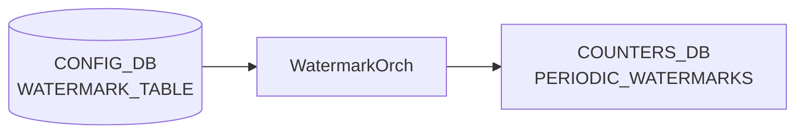

# WATERMARK_TABLE テーブル

## 概要

Periodic watermark のテレメトリ周期を設定するテーブル[^1]。`WatermarkOrch` ([orchagent](../../reference/glossary.md#term-orchagent)) が購読し、`PERIODIC_WATERMARKS` テーブル (COUNTERS_DB) を指定周期で自動クリアする。`FLEX_COUNTER_TABLE` の `QUEUE_WATERMARK` / `PG_WATERMARK` グループが enable になったときにタイマーが起動する。

<!-- cdb-mermaid -->
### データフロー (自動生成)



!!! note "凡例"
    CONFIG_DB から COUNTERS_DB までの典型経路を示す。詳細・例外は本ページ本文を参照。
<!-- /cdb-mermaid -->

## key 構造

```text
WATERMARK_TABLE|TELEMETRY_INTERVAL
```

シングルトンエントリ。`TELEMETRY_INTERVAL` のみが有効なキー。

## 主要フィールド

| フィールド | 型 | 説明 |
|----------|----|------|
| `interval` | uint32 (秒) | periodic watermark クリア間隔。省略時は 120 秒が内部デフォルト。 |

YANG モデルなし。スキーマ検証は orchagent 側の `to_uint<uint32_t>()` によるランタイム型変換のみ。

## 購読者

- `WatermarkOrch` (`orchagent/watermarkorch.cpp`): `CFG_WATERMARK_TABLE_NAME` を `SubscriberStateTable` で購読。`handleWmConfigUpdate()` が `interval` を受け取り `SelectableTimer` の周期を更新する。

## 関連 CONFIG_DB / YANG / CLI

- 関連 [CONFIG_DB](../../reference/glossary.md#term-config_db): `FLEX_COUNTER_TABLE`（`QUEUE_WATERMARK` / `PG_WATERMARK` の enable/disable でタイマー起動/停止）
- 関連 CLI: `watermarkcfg -c <秒>`（周期設定）、`watermarkcfg -s`（現在値表示）
- 関連 [YANG](../../reference/glossary.md#term-yang): なし（YANG モデル未定義）

<!-- defaults -->
## コード由来の暗黙デフォルト

<!-- evidence: meta/_intermediate/cdb-flow/pwm-defaults.md -->

### `interval` — ハードコードデフォルト 120 秒

`WatermarkOrch` コンストラクタ (`watermarkorch.cpp:9,41`) で `#define DEFAULT_TELEMETRY_INTERVAL 120` をタイマー初期値として使用する。

```cpp
#define DEFAULT_TELEMETRY_INTERVAL 120
// ...
auto intervT = timespec { .tv_sec = DEFAULT_TELEMETRY_INTERVAL , .tv_nsec = 0 };
m_telemetryTimer = new SelectableTimer(intervT);
```

`WATERMARK_TABLE|TELEMETRY_INTERVAL` エントリが CONFIG_DB に存在しない場合、orchagent は **120 秒**を telemetry 周期として使用する。`watermarkcfg -s` もエントリ不在時に `"Telemetry interval 120 second(s)"` を表示する (`watermarkcfg:show_interval()`)。

### タイマー起動条件 — FLEX_COUNTER enable 依存

タイマーは orchagent 起動時には停止状態 (`m_wmStatus = 0`)。`FLEX_COUNTER_TABLE` の `QUEUE_WATERMARK` または `PG_WATERMARK` の `FLEX_COUNTER_STATUS` が `enable` に変わると `m_telemetryTimer->start()` が呼ばれる (`watermarkorch.cpp:133`)。両グループとも disable になると `m_telemetryTimer->stop()` が呼ばれる。

### インターバル変更反映タイミング — 次タイマー満了後

`WATERMARK_TABLE|TELEMETRY_INTERVAL` を更新しても、現在の telemetry 周期が満了するまで新インターバルは適用されない（`m_timerChanged = true` セット → 次の timer tick で `m_telemetryTimer->reset()` を呼ぶ）。

<!-- /defaults -->

<!-- ordering -->
## 書込み順序依存 (Phase B)

<!-- evidence: meta/_intermediate/cdb-flow/pwm-ordering.md -->

### 依存関係マップ

```
PORT テーブル (PortsOrch allPortsReady)
  └─► WatermarkOrch 処理開始ゲート  （false の間は WATERMARK_TABLE / FLEX_COUNTER_TABLE 両方ブロック）

FLEX_COUNTER_TABLE|QUEUE_WATERMARK または PG_WATERMARK (FLEX_COUNTER_STATUS=enable)
  └─► telemetry タイマー起動         （m_wmStatus が 0 → 非ゼロに変化した瞬間に start()）

WATERMARK_TABLE|TELEMETRY_INTERVAL (interval フィールド)
  └─► telemetry タイマー周期変更     （即時反映ではなく、現タイマー満了後の次サイクルから適用）
```

### 書込み順序ルール

| 優先度 | ルール | 根拠 |
|--------|--------|------|
| 必須 | PortsOrch の `allPortsReady()` が true になるまで `WATERMARK_TABLE` / `FLEX_COUNTER_TABLE` への書込みは保留される | `watermarkorch.cpp:56` の早期 return ガード。false の間は `m_toSync` にキューイングされ自動再処理される |
| 重要 | telemetry タイマーを起動させるには `FLEX_COUNTER_TABLE|QUEUE_WATERMARK` または `FLEX_COUNTER_TABLE|PG_WATERMARK` の `FLEX_COUNTER_STATUS=enable` が必要 | `watermarkorch.cpp:136-138`: `!prevStatus && m_wmStatus` の条件を満たさないとタイマーが起動しない。`WATERMARK_TABLE` の設定だけではタイマーは起動しない |
| 推奨 | `WATERMARK_TABLE|TELEMETRY_INTERVAL` は `FLEX_COUNTER_TABLE` の enable より前に書く | enable 後の `interval` 変更は現タイマー満了（最大 120 秒）まで新値が適用されない (`m_timerChanged = true` → 次 tick で `reset()`) |
| 注意 | `FLEX_COUNTER_TABLE` の `QUEUE_WATERMARK` と `PG_WATERMARK` が両方 disable になるとタイマーが停止する | `watermarkorch.cpp:254-257`: `m_wmStatus == 0` のとき `m_telemetryTimer->stop()`。PERIODIC_WATERMARKS の自動クリアが停止する |

### タイミング制約

- **`WATERMARK_TABLE|TELEMETRY_INTERVAL` 書込みのタイミングは任意**。orchagent 起動前・起動後どちらでも機能する。起動前に書いた場合は `allPortsReady()` 後に `m_toSync` から再処理される。
- **インターバル変更の反映は次タイマー満了後**。変更直後のクリア間隔は旧値のまま。急ぎの場合は `watermarkcfg -c <新値>` 後に `watermark clear` で手動クリアを検討する。
- **`FLEX_COUNTER_TABLE` への書込みは `WATERMARK_TABLE` と独立**して処理されるが、同じ `allPortsReady()` ガードを共有する (`orchagent/watermarkorch.cpp:56`)。

<!-- /ordering -->

<!-- cross-refs -->
## 暗黙参照マップ (Phase C)

<!-- evidence: meta/_intermediate/cdb-flow/pwm-cross-refs.md -->

| 参照方向 | このテーブル | 相手テーブル / ページ | 条件 |
|---------|------------|---------------------|------|
| WATERMARK_TABLE → | `interval` 変更 → タイマー制御 | [`FLEX_COUNTER_TABLE`](flex-counter-table.md) | `QUEUE_WATERMARK` / `PG_WATERMARK` の `FLEX_COUNTER_STATUS=enable` がないとタイマーが起動しない。`WATERMARK_TABLE` 単独では watermark 自動クリアは動作しない |
| WATERMARK_TABLE → | タイマー満了ごとの 0 クリア | COUNTERS_DB `PERIODIC_WATERMARKS` | `WatermarkOrch` が telemetry 周期ごとに SAI 統計をリセットして書き込む |
| → WATERMARK_TABLE | `FLEX_COUNTER_TABLE\|QUEUE_WATERMARK` / `FLEX_COUNTER_TABLE\|PG_WATERMARK` の `FLEX_COUNTER_STATUS` | [`FLEX_COUNTER_TABLE`](flex-counter-table.md) | `FLEX_COUNTER_STATUS` の変化が `m_wmStatus` ビットマスクを更新し、タイマー起動 (`start()`) / 停止 (`stop()`) を制御する (`watermarkorch.cpp:136-138, 254-257`) |
| → WATERMARK_TABLE | APPL_DB `WATERMARK_CLEAR_REQUEST` 通知 | `watermarkcfg clear` CLI | `"PERSISTENT"` / `"USER"` op でそれぞれの COUNTERS_DB テーブルをリセット。`PERIODIC_WATERMARKS` はタイマーのみがリセット対象 |
| CLI | `watermarkcfg -c <秒>` / `-s` | [`watermarkcfg`](../cli/) | `interval` フィールドの書き込み（CONFIG_DB HSET）と読み出し |

> **ポイント**: `WATERMARK_TABLE` は interval 制御のみを担い、タイマー起動/停止は `FLEX_COUNTER_TABLE` が主導する。両テーブルを `WatermarkOrch` が同一 `Consumer` ループで購読する (`watermarkorch.cpp:72-78`)。

<!-- /cross-refs -->

<!-- failure -->
## 失敗挙動・エラーパス (Phase D)

> **調査根拠**: `watermarkorch.cpp` 全行精読、`converter.h` `to_uint` 実装、`orch.cpp` `Consumer::drain()` 例外ハンドリング確認 (2026-05-18)  
> 詳細証跡: `meta/_intermediate/cdb-flow/pwm-failure.md`

### `interval` 値が不正な場合 — 繰り返しエラーログ + タイマー未変更

`handleWmConfigUpdate()` (`watermarkorch.cpp:103`) は `to_uint<uint32_t>(i.second)` で文字列を変換する。非数値文字列・uint32 範囲外の値は `std::invalid_argument` を throw する (`converter.h:20,25`)。

| 条件 | ログ | 挙動 |
|------|------|------|
| `interval` が非数値 (例: `"abc"`) | `SWSS_LOG_ERROR "Exception caught: type=invalid_argument, table=..., error=failed to convert abc"` (`orch.cpp:614`) | エントリが `m_toSync` から**削除されない**まま残留。次 select イテレーションで再び同エラーが繰り返される。タイマー周期は変更されない |
| `interval` が uint32 範囲超過 | 同上 | 同上 |
| orchagent プロセスへの影響 | なし | `Consumer::drain()` (`orch.cpp:612-615`) が例外をキャッチするためクラッシュしない |

**回復方法**: `watermarkcfg -c <正値>` または `sonic-db-cli CONFIG_DB hset 'WATERMARK_TABLE|TELEMETRY_INTERVAL' interval <正値>` で上書きするとエントリが更新され、次のイテレーションで正常処理される。

### `interval` フィールド以外のキーが設定された場合

`handleWmConfigUpdate()` の `else` 分岐 (`watermarkorch.cpp:110`) で `SWSS_LOG_WARN("Unsupported key: %s", i.first.c_str())` を出力するのみ。エントリは正常に `m_toSync` から削除される（タイマー変更なし）。

### DEL_COMMAND — タイマーリセットなし

`WATERMARK_TABLE|TELEMETRY_INTERVAL` が CONFIG_DB から DEL された場合 (`watermarkorch.cpp:82-83`):

| 条件 | ログ | 挙動 |
|------|------|------|
| DEL_COMMAND 受信 | `SWSS_LOG_WARN("Unsupported op DEL")` | タイマー周期は変更されない。エントリは `m_toSync` から削除される（再試行なし）|

DEL 後もタイマーは直前の周期（またはデフォルト 120 秒）のまま動作し続ける。

### `allPortsReady()` 未達 — 無限保留

`doTask()` 冒頭 (`watermarkorch.cpp:56`) で `!gPortsOrch->allPortsReady()` の場合は即 return する。`WATERMARK_TABLE` / `FLEX_COUNTER_TABLE` 両イベントが `m_toSync` に保留され、ports ready 後に再処理される。通常は一時的だが、PortsOrch 初期化が永続的に失敗した環境では両テーブルの設定が永遠に適用されない。

### WATERMARK_CLEAR_REQUEST 不正 op / data

| 条件 | ログ | 挙動 |
|------|------|------|
| `op` が `"PERSISTENT"` / `"USER"` 以外 | `SWSS_LOG_WARN("Unknown watermark clear request op: ...")` | COUNTERS_DB への書き込みなし (`watermarkorch.cpp:180-181`) |
| `data` が既知クリア要求以外 | `SWSS_LOG_WARN("Unknown watermark clear request data: ...")` | COUNTERS_DB への書き込みなし (`watermarkorch.cpp:228-229`) |

### `clearSingleWm()` での空 OID リスト — silent スキップ

`init_pg_ids()` / `init_queue_ids()` 呼び出し後も COUNTERS_DB にエントリがない場合（ポート未初期化等）、`clearSingleWm()` の `for` ループがゼロ回実行されるだけでエラーログなく終了する。`PERIODIC_WATERMARKS` テーブルへのゼロクリアは発生しない（watermark 値は前回値のまま）。

<!-- /failure -->

<!-- constants -->
## ハードコード定数 (Phase E)

> **調査根拠**: `sonic-swss/orchagent/watermarkorch.cpp` 全行精読 (2026-05-18)

### タイマー定数 (watermarkorch.cpp)

| 定数 | 値 | 証拠 | 意味 |
|-----|-----|------|------|
| `DEFAULT_TELEMETRY_INTERVAL` | `120` 秒 | `watermarkorch.cpp:9` | `#define` で定義された periodic watermark クリア周期のデフォルト値。`WATERMARK_TABLE|TELEMETRY_INTERVAL` エントリが CONFIG_DB に存在しない場合に使用される |

### クリア要求文字列定数 (watermarkorch.cpp)

APPL_DB の `WATERMARK_CLEAR_REQUEST` 通知チャネルで使用される `data` 文字列はハードコードされており、`watermarkcfg` CLI が固定文字列を送信する。

| 定数マクロ | 値 | 証拠 | 対象 WM テーブル |
|-----------|-----|------|----------------|
| `CLEAR_PG_HEADROOM_REQUEST` | `"PG_HEADROOM"` | `watermarkorch.cpp:11` | `SAI_INGRESS_PRIORITY_GROUP_STAT_XOFF_ROOM_WATERMARK_BYTES` |
| `CLEAR_PG_SHARED_REQUEST` | `"PG_SHARED"` | `watermarkorch.cpp:12` | `SAI_INGRESS_PRIORITY_GROUP_STAT_SHARED_WATERMARK_BYTES` |
| `CLEAR_QUEUE_SHARED_UNI_REQUEST` | `"Q_SHARED_UNI"` | `watermarkorch.cpp:13` | `SAI_QUEUE_STAT_SHARED_WATERMARK_BYTES`（ユニキャストキュー） |
| `CLEAR_QUEUE_SHARED_MULTI_REQUEST` | `"Q_SHARED_MULTI"` | `watermarkorch.cpp:14` | `SAI_QUEUE_STAT_SHARED_WATERMARK_BYTES`（マルチキャストキュー） |
| `CLEAR_QUEUE_SHARED_ALL_REQUEST` | `"Q_SHARED_ALL"` | `watermarkorch.cpp:15` | `SAI_QUEUE_STAT_SHARED_WATERMARK_BYTES`（全キュー） |
| `CLEAR_BUFFER_POOL_REQUEST` | `"BUFFER_POOL"` | `watermarkorch.cpp:16` | `SAI_BUFFER_POOL_STAT_WATERMARK_BYTES` |
| `CLEAR_HEADROOM_POOL_REQUEST` | `"HEADROOM_POOL"` | `watermarkorch.cpp:17` | `SAI_BUFFER_POOL_STAT_XOFF_ROOM_WATERMARK_BYTES` |

### FLEX_COUNTER グループ名定数

`handleFcConfigUpdate()` (`watermarkorch.cpp:120`) は `FLEX_COUNTER_TABLE` のキーとして `"QUEUE_WATERMARK"` と `"PG_WATERMARK"` を固定文字列で比較する。これ以外のキーが届いても `m_wmStatus` は更新されない（無視される）。

### 定数の外部変更可否

| 定数 | 変更方法 | 備考 |
|------|---------|------|
| `DEFAULT_TELEMETRY_INTERVAL` (120 秒) | `WATERMARK_TABLE\|TELEMETRY_INTERVAL\|interval` フィールドで上書き可能 | CONFIG_DB 書込みで実行時変更可能 |
| クリア要求文字列 | 変更不可（コードと CLI が同期） | `watermarkcfg` が生成する文字列と `watermarkorch.cpp` のマクロが対応 |
| FLEX_COUNTER グループ名 | 変更不可（コードハードコード） | `schema.h` 等の定義変更が必要 |

<!-- /constants -->

<!-- side-effects -->
## 副次 DB 書込 (Phase F)

> **調査根拠**: `sonic-swss/orchagent/watermarkorch.cpp` 全行精読 (2026-05-18)  
> 詳細証跡: `meta/_intermediate/cdb-flow/pwm-side-effects.md`

`WATERMARK_TABLE|TELEMETRY_INTERVAL` および `FLEX_COUNTER_TABLE` への書込みが引き起こす、CONFIG_DB 以外の DB への副次的な書込みと SAI 呼び出しを示す。

### タイマー tick — COUNTERS_DB `PERIODIC_WATERMARKS` への自動ゼロクリア

telemetry タイマーが満了するたびに `clearSingleWm()` が呼ばれ、`COUNTERS_DB` の `PERIODIC_WATERMARKS` テーブルに **0** を書き込む。

| 対象 DB / テーブル | フィールド | 書込内容 | トリガー |
|-----------------|---------|---------|---------|
| COUNTERS_DB / `PERIODIC_WATERMARKS` | `SAI_INGRESS_PRIORITY_GROUP_STAT_XOFF_ROOM_WATERMARK_BYTES` (全 PG OID) | `"0"` | telemetry タイマー満了ごと (`watermarkorch.cpp:259-261`) |
| COUNTERS_DB / `PERIODIC_WATERMARKS` | `SAI_INGRESS_PRIORITY_GROUP_STAT_SHARED_WATERMARK_BYTES` (全 PG OID) | `"0"` | telemetry タイマー満了ごと (`watermarkorch.cpp:262-265`) |
| COUNTERS_DB / `PERIODIC_WATERMARKS` | `SAI_QUEUE_STAT_SHARED_WATERMARK_BYTES` (全ユニキャストキュー OID) | `"0"` | telemetry タイマー満了ごと (`watermarkorch.cpp:266-269`) |
| COUNTERS_DB / `PERIODIC_WATERMARKS` | `SAI_QUEUE_STAT_SHARED_WATERMARK_BYTES` (全マルチキャストキュー OID) | `"0"` | telemetry タイマー満了ごと (`watermarkorch.cpp:270-273`) |
| COUNTERS_DB / `PERIODIC_WATERMARKS` | `SAI_QUEUE_STAT_SHARED_WATERMARK_BYTES` (全キュー OID) | `"0"` | telemetry タイマー満了ごと (`watermarkorch.cpp:274-277`) |
| COUNTERS_DB / `PERIODIC_WATERMARKS` | `SAI_BUFFER_POOL_STAT_WATERMARK_BYTES` (全バッファプール) | `"0"` | telemetry タイマー満了ごと (`watermarkorch.cpp:278-281`) |
| COUNTERS_DB / `PERIODIC_WATERMARKS` | `SAI_BUFFER_POOL_STAT_XOFF_ROOM_WATERMARK_BYTES` (全バッファプール) | `"0"` | telemetry タイマー満了ごと (`watermarkorch.cpp:282-285`) |

**`interval` の変更**はゼロクリア頻度を変化させる。短くすると PERIODIC_WATERMARKS がより頻繁にリセットされる。

### 手動クリア — COUNTERS_DB `PERSISTENT_WATERMARKS` / `USER_WATERMARKS`

`watermarkcfg clear` CLI が APPL_DB `WATERMARK_CLEAR_REQUEST` 通知チャネルへ送信すると、`WatermarkOrch::doTask(NotificationConsumer)` が対応する COUNTERS_DB テーブルをゼロクリアする。

| `op` 値 | `data` 値 | 対象 DB / テーブル | 書込内容 |
|---------|---------|-----------------|---------|
| `"PERSISTENT"` | `"PG_HEADROOM"` | COUNTERS_DB / `PERSISTENT_WATERMARKS` | `SAI_INGRESS_PRIORITY_GROUP_STAT_XOFF_ROOM_WATERMARK_BYTES` = `"0"` |
| `"PERSISTENT"` | `"PG_SHARED"` | COUNTERS_DB / `PERSISTENT_WATERMARKS` | `SAI_INGRESS_PRIORITY_GROUP_STAT_SHARED_WATERMARK_BYTES` = `"0"` |
| `"PERSISTENT"` | `"Q_SHARED_UNI"` | COUNTERS_DB / `PERSISTENT_WATERMARKS` | `SAI_QUEUE_STAT_SHARED_WATERMARK_BYTES`（ユニキャスト） = `"0"` |
| `"PERSISTENT"` | `"BUFFER_POOL"` | COUNTERS_DB / `PERSISTENT_WATERMARKS` | `SAI_BUFFER_POOL_STAT_WATERMARK_BYTES` = `"0"` |
| `"USER"` | (上記と同じ) | COUNTERS_DB / `USER_WATERMARKS` | 同フィールドを `"0"` クリア |

`PERIODIC_WATERMARKS` は手動クリア対象外。telemetry タイマーのみがリセットする。

### SAI 呼び出し

`WATERMARK_TABLE|TELEMETRY_INTERVAL` への書込みは SAI を直接呼び出さない。orchagent が COUNTERS_DB へ書き込むことで flex_counter が SAI 統計を読み出すタイミングと周期が間接的に制御される。SAI への直接操作は `clearSingleWm()` からは行われない（Redis テーブルへの書き込みのみ）。

<!-- /side-effects -->

<!-- pubsub -->
## 通信メカニズム (Phase G)

> **調査根拠**: `sonic-swss/orchagent/watermarkorch.cpp`、`sonic-swss/orchagent/orchdaemon.cpp`、`sonic-utilities/scripts/watermarkstat` を精読 (2026-05-19)

### Producer/Consumer ペア

`WATERMARK_TABLE` は CONFIG_DB → COUNTERS_DB への**直接経路**をとる。APPL_DB への中継は行わない（クリア要求通知チャネルを除く）。

| 区間 | 方式 | チャンネル / パターン |
|------|------|----------------------|
| CONFIG_DB → WatermarkOrch | `SubscriberStateTable` | `__keyspace@4__:WATERMARK_TABLE\|*` |
| CONFIG_DB → WatermarkOrch | `SubscriberStateTable` | `__keyspace@4__:FLEX_COUNTER_TABLE\|QUEUE_WATERMARK` / `PG_WATERMARK` |
| WatermarkOrch → COUNTERS_DB | `Table::set()` 直接書き込み | `PERIODIC_WATERMARKS` / `PERSISTENT_WATERMARKS` / `USER_WATERMARKS` |
| watermarkstat → WatermarkOrch | `APPL_DB.publish()` (Redis Pub/Sub) | `WATERMARK_CLEAR_REQUEST` チャンネル |
| CONFIG_DB 書き込み側 | `watermarkcfg` CLI | `ConfigDBConnector.mod_entry('WATERMARK_TABLE', 'TELEMETRY_INTERVAL', ...)` |

### SubscriberStateTable の動作

`WatermarkOrch` は `orchdaemon.cpp:432-437` で次の 2 テーブルを同一インスタンスに登録して起動する:

```cpp
vector<string> wm_tables = {
    CFG_WATERMARK_TABLE_NAME,      // "WATERMARK_TABLE"
    CFG_FLEX_COUNTER_TABLE_NAME    // "FLEX_COUNTER_TABLE"
};
WatermarkOrch *wm_orch = new WatermarkOrch(m_configDb, wm_tables);
```

`Orch` 基底クラスが各テーブルに対して `SubscriberStateTable` を生成し、CONFIG_DB（DB ID = 4）の keyspace notification (`PSUBSCRIBE __keyspace@4__:<table>|*`) でエントリ変化を検出する。`doTask(Consumer &consumer)` が呼ばれ、テーブル名で分岐して `handleWmConfigUpdate()` / `handleFcConfigUpdate()` に振り分ける (`watermarkorch.cpp:72-78`)。

### NotificationConsumer — WATERMARK_CLEAR_REQUEST チャンネル

`WatermarkOrch` コンストラクタ (`watermarkorch.cpp:35-39`) が APPL_DB 上に `NotificationConsumer` を登録する:

```cpp
m_clearNotificationConsumer = new swss::NotificationConsumer(
    m_appDb.get(), "WATERMARK_CLEAR_REQUEST");
auto clearNotifier = new Notifier(m_clearNotificationConsumer, this, "WM_CLEAR_NOTIFIER");
Orch::addExecutor(clearNotifier);
```

`watermarkstat -c` コマンドが `APPL_DB.publish('WATERMARK_CLEAR_REQUEST', json.dumps((op, wm_type)))` でメッセージを送信し、`doTask(NotificationConsumer&)` が `op`(`"PERSISTENT"` / `"USER"`) と `data`（クリア対象 WM 種別）を受け取って対応 COUNTERS_DB テーブルをゼロクリアする。

### SelectableTimer

telemetry タイマー (`m_telemetryTimer`) はコンストラクタで `DEFAULT_TELEMETRY_INTERVAL = 120` 秒で初期化される。`doTask(SelectableTimer&)` がタイマー満了ごとに呼ばれ、`PERIODIC_WATERMARKS` テーブルの全 PG/Queue/BufferPool OID に `"0"` を書き込む。

### select() ループと実行順序

`orchdaemon` の主ループは `Select::select()` を `SELECT_TIMEOUT = 1000 ms` タイムアウトで実行する。`SubscriberStateTable` イベント、`NotificationConsumer` イベント、`SelectableTimer` タイムアウトが同じ `Select` ループで処理される。`doTask()` の冒頭で `!gPortsOrch->allPortsReady()` が true の間は即 return し、`m_toSync` キューにイベントが蓄積される。

### データフロー図

```
watermarkcfg -c <秒>
  ↓ ConfigDBConnector.mod_entry('WATERMARK_TABLE', 'TELEMETRY_INTERVAL', {'interval': <秒>})
  ↓
CONFIG_DB[WATERMARK_TABLE|TELEMETRY_INTERVAL]
  ↓ SubscriberStateTable (keyspace notification)
orchdaemon select() loop (SELECT_TIMEOUT=1000ms)
  ↓ Consumer::drain() → WatermarkOrch::doTask(Consumer&)
  ↓   handleWmConfigUpdate("TELEMETRY_INTERVAL", fvt)
  ↓     m_telemetryTimer->setInterval(new_interval)
  ↓     m_timerChanged = true
  ↓
SelectableTimer (周期: interval 秒) → doTask(SelectableTimer&)
  ↓ clearSingleWm(m_periodicWatermarkTable, ..., m_pg_ids)
  ↓ clearSingleWm(m_periodicWatermarkTable, ..., m_unicast_queue_ids)
  ↓ ...
    ↓ COUNTERS_DB[PERIODIC_WATERMARKS] に "0" を書き込む

watermarkstat -c (クリア要求)
  ↓ APPL_DB.publish('WATERMARK_CLEAR_REQUEST', '["PERSISTENT", "PG_HEADROOM"]')
  ↓
NotificationConsumer → WatermarkOrch::doTask(NotificationConsumer&)
  ↓ clearSingleWm(m_persistentWatermarkTable, ...)
    ↓ COUNTERS_DB[PERSISTENT_WATERMARKS] に "0" を書き込む

APPL_DB 書き込み: なし（WATERMARK_CLEAR_REQUEST はキーなし通知チャンネルのみ）
```

<!-- /pubsub -->

<!-- platform -->
## プラットフォーム差 (Phase H)

> 調査証跡: `meta/_intermediate/cdb-flow/pwm-platform.md`  
> 調査根拠: `sonic-swss/orchagent/watermarkorch.cpp` 全行精読 + `sonic-swss/orchagent/portsorch.cpp` watermark FlexCounter 設定部分精読 (2026-05-19)

### `watermarkorch.cpp` 自体にプラットフォーム固有コードは存在しない

`watermarkorch.cpp`（全 348 行）を精読した結果、以下の条件分岐は**一切存在しない**:

| 確認項目 | 結果 |
|---------|------|
| `gMySwitchType` / `"voq"` 参照 | なし |
| `platform` / `sub_platform` 文字列比較 | なし |
| `MLNX_PLATFORM_SUBSTRING` 等の定数参照 | なし |
| `isMlnxPlatform()` 等の helper 呼び出し | なし |
| SAI capability クエリ | なし |

WATERMARK_TABLE の interval 設定・タイマー制御・COUNTERS_DB ゼロクリアは全 ASIC ベンダーで同一コードを通る。

### ASIC 依存として間接的に現れるプラットフォーム差

#### SAI_QUEUE_TYPE_ALL キューの存在有無

`init_queue_ids()`（`watermarkorch.cpp:298`）は COUNTERS_DB `COUNTERS_QUEUE_TYPE_MAP` から
`SAI_QUEUE_TYPE_UNICAST` / `SAI_QUEUE_TYPE_MULTICAST` / `SAI_QUEUE_TYPE_ALL` に分類する。
`SAI_QUEUE_TYPE_ALL` の存在は ASIC ベンダーに依存する:

| ASIC 系統 | キュー型 | `m_all_queue_ids` の内容 |
|----------|---------|------------------------|
| Broadcom XGS / Mellanox | `SAI_QUEUE_TYPE_UNICAST` + `SAI_QUEUE_TYPE_MULTICAST` | 空（`Q_SHARED_ALL` クリアはノーオペレーション） |
| Broadcom DNX (Jericho 系) | `SAI_QUEUE_TYPE_ALL` のみ | 全キューが登録される |

`CLEAR_QUEUE_SHARED_ALL_REQUEST`（`"Q_SHARED_ALL"`）の `clearSingleWm()` は `m_all_queue_ids` が空の場合、ゼロ回ループで終了し、エラーログもなくサイレントにスキップされる（`watermarkorch.cpp:274-277`）。`SAI_QUEUE_TYPE_ALL` を持たない ASIC で `watermarkstat -c` を実行しても Q_SHARED_ALL のクリアは発生しない。

#### FLEX_COUNTER READ_AND_CLEAR モード — ASIC 対応依存

watermark FlexCounter グループは `STATS_MODE_READ_AND_CLEAR` で設定される（`portsorch.cpp:866-873`）。一部の ASIC は `SAI_QUEUE_STAT_SHARED_WATERMARK_BYTES` に対するアトミックな READ_AND_CLEAR をサポートせず `SAI_STATUS_NOT_SUPPORTED` を返す。この場合、flexcounter は統計収集に失敗し COUNTERS_DB の watermark 値が更新されない。`WatermarkOrch` はこのエラーを検知せず、PERIODIC_WATERMARKS のゼロクリアは引き続き実行される（COUNTERS_DB への書き込みは発生するが、flexcounter が値を更新しないため意味がない）。

#### VoQ モード — VoQ ユニキャストキューが収集対象外

`watermarkorch.cpp` に `gMySwitchType` 参照はなく、VoQ モードでも同一コードを通る。しかし VoQ 環境では `SAI_QUEUE_TYPE_UNICAST_VOQ` が存在するが、`init_queue_ids()` の分類ロジックに `SAI_QUEUE_TYPE_UNICAST_VOQ` ブランチがない（`watermarkorch.cpp:303-325`）。PortsOrch がキュー型を `COUNTERS_QUEUE_TYPE_MAP` に書き込む際も VoQ ユニキャストキューは型文字列 `"SAI_QUEUE_TYPE_UNICAST_VOQ"` で登録されるため、`init_queue_ids()` のどの分岐にも該当せずスキップされる。**VoQ モードでは VoQ ユニキャストキューの watermark 収集が行われない**。

### Lua プラグイン — ASIC 非依存

`watermark_queue.lua` と `watermark_pg.lua` は ASIC ベンダーに関わらず同一スクリプトが登録される。Nvidia 固有の `nvda_port_trim_drop.lua` はポート trim 統計専用であり WatermarkOrch には無関係。

!!! note "WATERMARK_TABLE 設定自体はプラットフォーム完全非依存"
    `WATERMARK_TABLE|TELEMETRY_INTERVAL` の書き込みと `interval` フィールドの処理は全プラットフォームで同一。プラットフォーム差は SAI 層での統計収集（FlexCounter）とキュー型サポートの有無として現れ、WATERMARK_TABLE の設定処理には直接影響しない。

<!-- /platform -->

<!-- ref-triangle:start -->

## 関連リファレンス

- CLI: `watermarkcfg`, `watermarkstat`
- 関連テーブル: [`FLEX_COUNTER_TABLE`](flex-counter-table.md)

<!-- ref-triangle:end -->

## 引用元

[^1]: `WatermarkOrch` 実装: `sonic-swss/orchagent/watermarkorch.cpp`. <https://github.com/sonic-net/sonic-swss/blob/master/orchagent/watermarkorch.cpp>
