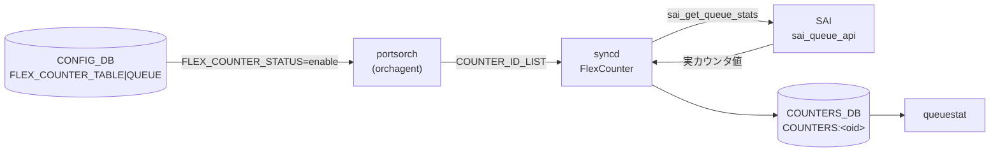

# COUNTERS_DB QUEUE カウンタ

## 概要

[portsorch](../../reference/glossary.md#term-portsorch)（[orchagent](../../reference/glossary.md#term-orchagent) 内）が [SAI](../../reference/glossary.md#term-sai) の flex counter 機構を通じてポートの送信キューごとに取得する統計カウンタ群[^1]。値は `COUNTERS_DB` の `COUNTERS:<oid>` に格納され、`queuestat` コマンドが読み出す。

> **関連ページ**: PG（Priority Group）カウンタおよびウォーターマーク体系の全体像は [`COUNTERS_DB キュー / PG カウンタテーブル群`](counters-queue.md) を参照。

<!-- cdb-mermaid -->
### データフロー (自動生成)



!!! note "凡例"
    CONFIG_DB の `FLEX_COUNTER_TABLE|QUEUE` が `enable` になると portsorch が SAI カウンタ ID リストを syncd へ投入。syncd が 10 秒ごと（コードデフォルト）にポーリングして `COUNTERS:<oid>` を更新する。

<!-- /cdb-mermaid -->

## key 構造

### キュー名→OID マップ

```text
COUNTERS_DB / COUNTERS_QUEUE_NAME_MAP   (Hash)
  field: <port_alias>:<queue_index>    (例: Ethernet0:0)
  value: <SAI OID>                     (例: oid:0x00000000000001a0)
```

VoQ システムでは field 形式が `<system_port_alias>:<queue_index>`（例: `Linecard1|ASIC0|Ethernet0:0`）となる。

### 補助マッピングテーブル

```text
COUNTERS_QUEUE_PORT_MAP   field: <queue_oid>  → value: <port_oid>
COUNTERS_QUEUE_INDEX_MAP  field: <queue_oid>  → value: <queue_index (int)>
COUNTERS_QUEUE_TYPE_MAP   field: <queue_oid>  → value: SAI_QUEUE_TYPE_UNICAST |
                                                        SAI_QUEUE_TYPE_MULTICAST |
                                                        SAI_QUEUE_TYPE_ALL |
                                                        SAI_QUEUE_TYPE_UNICAST_VOQ
```

### カウンタハッシュ

```text
COUNTERS_DB / COUNTERS:<oid>   (Hash)
  field: <SAI_QUEUE_STAT_*>
  value: <uint64 カウンタ値 (文字列)>
```

## フィールド一覧

### 通常カウンタ（QUEUE_STAT_COUNTER グループ）

`FLEX_COUNTER_TABLE|QUEUE` が `enable` のときに収集。ソース: `portsorch.cpp:389-398` の `queue_stat_ids`[^2]。

| COUNTERS:<oid> フィールド | 説明 |
|--------------------------|------|
| `SAI_QUEUE_STAT_PACKETS` | キューからの送信パケット数（累積） |
| `SAI_QUEUE_STAT_BYTES` | キューからの送信バイト数（累積） |
| `SAI_QUEUE_STAT_DROPPED_PACKETS` | キュードロップパケット数（累積） |
| `SAI_QUEUE_STAT_DROPPED_BYTES` | キュードロップバイト数（累積） |
| `SAI_QUEUE_STAT_TRIM_PACKETS` | Packet Trimming 発生パケット数 |
| `SAI_QUEUE_STAT_DROPPED_TRIM_PACKETS` | トリミング後ドロップパケット数 |
| `SAI_QUEUE_STAT_TX_TRIM_PACKETS` | トリミング後送信パケット数 |

VoQ システムでは追加フィールド `SAI_QUEUE_STAT_CREDIT_WD_DELETED_PACKETS`（Credit Watchdog 削除パケット数）が加わる[^2]。

### ウォーターマーク（QUEUE_WATERMARK_STAT_COUNTER グループ）

`FLEX_COUNTER_TABLE|QUEUE_WATERMARK` が `enable` のときに収集。`StatsMode::READ_AND_CLEAR`（ポーリングごとに SAI 側ウォーターマークレジスタをリセット）。ソース: `portsorch.cpp:405-408` の `queueWatermarkStatIds`[^2]。

| COUNTERS:<oid> フィールド | 説明 |
|--------------------------|------|
| `SAI_QUEUE_STAT_SHARED_WATERMARK_BYTES` | 共有バッファ使用量ウォーターマーク（バイト） |

### WRED/ECN カウンタ（WRED_ECN_QUEUE_STAT_COUNTER グループ）

`FLEX_COUNTER_TABLE|WRED_ECN_QUEUE` が `enable` かつ SAI が WRED ケイパビリティをサポートする場合のみ収集[^3]。ソース: `portsorch.cpp:429-435` の `wred_queue_stat_ids`。

| COUNTERS:<oid> フィールド | 説明 |
|--------------------------|------|
| `SAI_QUEUE_STAT_WRED_ECN_MARKED_PACKETS` | WRED ECN マーキングパケット数 |
| `SAI_QUEUE_STAT_WRED_ECN_MARKED_BYTES` | WRED ECN マーキングバイト数 |
| `SAI_QUEUE_STAT_WRED_DROPPED_PACKETS` | WRED ドロップパケット数 |
| `SAI_QUEUE_STAT_WRED_DROPPED_BYTES` | WRED ドロップバイト数 |

## FlexCounter グループとポーリング間隔

| FlexCounter グループ名 | CONFIG_DB キー | StatsMode | コードデフォルトポーリング間隔 |
|--------------------|--------------|-----------|--------------------------|
| `QUEUE_STAT_COUNTER` | `FLEX_COUNTER_TABLE\|QUEUE` | READ | 10000 ms |
| `QUEUE_WATERMARK_STAT_COUNTER` | `FLEX_COUNTER_TABLE\|QUEUE_WATERMARK` | READ_AND_CLEAR | 60000 ms |
| `WRED_ECN_QUEUE_STAT_COUNTER` | `FLEX_COUNTER_TABLE\|WRED_ECN_QUEUE` | READ | 10000 ms |

`counterpoll queue interval <ms>` / `counterpoll queue-watermark interval <ms>` で上書き可能。

<!-- defaults -->
## 暗黙デフォルト・コード由来挙動 (Phase A)

<!-- evidence: sonic-swss/orchagent/portsorch.cpp (ref:4305596156d7),
     sonic-swss/orchagent/portsorch.h (ref:4305596156d7),
     sonic-utilities/scripts/queuestat (ref:39732bceb8bd) -->

### カウンタフィールドセットはコードハードコード

`queue_stat_ids`（portsorch.cpp:389-398）はソースコードに静的配列として定義される。YANG モデル・CONFIG_DB・`FLEX_COUNTER_TABLE` のいずれからも変更不可[^4]。ハードウェアが当該カウンタをサポートしない場合、`queuestat` の表示では `N/A` となる。

### Packet Trimming フィールドは常時 queue_stat_ids に含まれる

`SAI_QUEUE_STAT_TRIM_PACKETS` / `SAI_QUEUE_STAT_DROPPED_TRIM_PACKETS` / `SAI_QUEUE_STAT_TX_TRIM_PACKETS` は、Packet Trimming 機能の有効・無効に関係なく `queue_stat_ids` に含まれる。Trimming 非対応 ASIC では値 `0` か `N/A`。`queuestat` の `--all`（`-a`）フラグで表示列が追加される（デフォルト `queuestat` では非表示）。

### ポーリング間隔のコードデフォルト

`FLEX_COUNTER_TABLE|QUEUE` に `POLL_INTERVAL` が未設定の場合、portsorch がコードにハードコードされた初期値を syncd に投入する[^4]。

| グループ | ハードコード定数（portsorch.cpp:90-91） | 値 |
|--------|--------------------------------------|-----|
| `QUEUE_STAT_COUNTER` | `QUEUE_STAT_FLEX_COUNTER_POLLING_INTERVAL_MS` | **10000 ms** |
| `QUEUE_WATERMARK_STAT_COUNTER` | `QUEUE_WATERMARK_STAT_FLEX_COUNTER_POLLING_INTERVAL_MS` | **60000 ms** |
| `WRED_ECN_QUEUE_STAT_COUNTER` | `QUEUE_STAT_FLEX_COUNTER_POLLING_INTERVAL_MS`（共用） | **10000 ms** |

### WRED カウンタは SAI ケイパビリティチェック必須

`SAI_QUEUE_STAT_WRED_ECN_MARKED_PACKETS` 等の WRED 統計は `checkWredCapability()`（portsorch.cpp:1894-1909）が SAI のケイパビリティクエリを実施し、サポートを確認したポートの queue にのみ `wred_queue_stat_manager` へ追加される[^3]。未サポート ASIC では `FLEX_COUNTER_TABLE|WRED_ECN_QUEUE` を `enable` にしても `COUNTERS:<oid>` に WRED フィールドが現れない（silent 非追加）。

### ウォーターマークは READ_AND_CLEAR で動作

`QUEUE_WATERMARK_STAT_COUNTER` グループは `StatsMode::READ_AND_CLEAR`（portsorch.cpp:735）で初期化される。syncd がポーリングするたびに SAI 側のウォーターマークレジスタがクリアされる。これは `watermarkstat` が PERIODIC / PERSISTENT / USER の 3 テーブルに分岐する基盤動作であり、異常ではない。

### VoQ システムでは voq_stat_ids が自動合算

`gMySwitchType == "voq"` の場合、`addQueueFlexCountersPerPortPerQueueIndex` が `voq=true` で呼ばれ、`queue_stat_ids` に加えて `voq_stat_ids`（`SAI_QUEUE_STAT_CREDIT_WD_DELETED_PACKETS`）が合算される（portsorch.cpp:8601-8614）。VoQ モード以外では Credit WD フィールドは `COUNTER_ID_LIST` に含まれない。

### isQueueMapGenerated 冪等ガード

`generateQueueMap()`（`COUNTERS_QUEUE_NAME_MAP` 等のマッピング書き込み）は `m_isQueueMapGenerated` フラグで一度だけ実行される（portsorch.cpp:8393-8396）。orchagent 再起動時に `COUNTERS_DB` のマッピングが重複書きされることはない。

### FLEX_COUNTER_STATUS 未設定時の挙動

`FLEX_COUNTER_TABLE|QUEUE` の `FLEX_COUNTER_STATUS` が `enable` になるまで、syncd は SAI ポーリングを行わない。カウンタ値は `0` のまま（または初期化前）。ポートが allPortsReady 前の場合、`enable` 受信後も FlexCounter への登録は遅延し、全ポート ready 後に一括適用される。

<!-- /defaults -->

<!-- ordering -->
## 書込み順序依存・タイミング依存 (Phase B)

<!-- evidence: sonic-swss/orchagent/portsorch.cpp (ref:4305596156d7),
     sonic-swss/orchagent/flexcounterorch.cpp (ref:4305596156d7) -->

### 1. SAI OID フェッチが先行必須

`PortsOrch::initializePorts()`（`portsorch.cpp:6583-6598`）が `initializeQueuesBulk()` で SAI から各ポートの Queue OID リスト（`SAI_PORT_ATTR_QOS_QUEUE_LIST`）を取得して `port.m_queue_ids` へキャッシュするまで、`generateQueueMap()` / `generateQueueMapPerPort()` は OID が空のまま動作してマッピングを書き込まない[^5]。`FlexCounterOrch::doTask()` は `gPortsOrch->allPortsReady()` が `false` の間 `return` する（`flexcounterorch.cpp:164-167`）ため、`FLEX_COUNTER_TABLE|QUEUE = enable` を orchagent 起動前に書き込んでいても、全ポート ready 後まで `generateQueueMap()` 呼び出しは自動的に遅延する。

### 2. Warm-reboot 時の 60 秒遅延

`FlexCounterOrch` コンストラクタ（`flexcounterorch.cpp:127-136`）は warm-reboot 時に `FLEX_COUNTER_DELAY_SEC = 60` 秒のタイマーを設定し、`doTask()` 先頭の `if (!m_delayTimerExpired) return;`（`flexcounterorch.cpp:156-158`）で全 FlexCounter 処理をブロックする。cold boot では即 `m_delayTimerExpired = true` になり遅延なし。warm-reboot 中に `FLEX_COUNTER_TABLE|QUEUE = enable` を書き込んでも最大 60 秒間 `COUNTERS:<oid>` の更新が停止する[^5]。

### 3. `BUFFER_QUEUE` と `FLEX_COUNTER_TABLE|QUEUE = enable` の順序

`BUFFER_QUEUE` SET が届いたときに `createPortBufferQueueCounters()`（`portsorch.cpp:8700-8755`）が `flexCounterOrch->getQueueCountersState()` を確認し、`false`（= `FLEX_COUNTER_TABLE|QUEUE` が disable）ならカウンタ登録をスキップする。`BUFFER_QUEUE` を先に書いた後に `enable` を書くと、`enable` 処理時に `addQueueFlexCounters(getQueueConfigurations())` が実行され、その時点で非ゼロプロファイルを持つ `BUFFER_QUEUE` エントリが一括登録される[^5]。逆順（`enable` 先・`BUFFER_QUEUE` 後）でも即時登録されるため、**どちらの順序でも最終状態は同じ**。

### 4. `m_isQueueMapGenerated` — `generateQueueMap()` は一度だけ実行

`generateQueueMap()`（`portsorch.cpp:8391-8396`）は `m_isQueueMapGenerated` フラグで保護されており、初回のみ実行される。`FLEX_COUNTER_TABLE|QUEUE` と `FLEX_COUNTER_TABLE|QUEUE_WATERMARK` の enable 順序に関係なく最初の enable で一度だけ走る。`m_isQueueMapGenerated` がセット済みの状態で新規ポートが追加された場合は `createPortBufferQueueCounters()` 経由でマッピングが生成される[^5]。

### 5. `isCreateOnlyConfigDbBuffers` の事後変更は限定的

`FlexCounterOrch` は起動時に `DEVICE_METADATA|localhost|create_only_config_db_buffers` を読み込み `m_createOnlyConfigDbBuffers` にキャッシュする。`true` の場合、`getQueueConfigurations()` は `BUFFER_QUEUE` に非ゼロプロファイルが設定されたキューのみ対象にする（デフォルト `false` = 全キュー）。起動後に値を変更しても、既に `m_isQueueMapGenerated = true` でガードされている場合は以後の `getQueueConfigurations()` 呼び出しにのみ影響し、既登録カウンタは変更されない。既存カウンタを変更するには orchagent 再起動が必要[^5]。

### 順序依存サマリ

| # | 依存関係 | 方向 | 緩和策 |
|---|----------|------|--------|
| 1 | SAI OID フェッチ (`initializeQueuesBulk`) → `generateQueueMap()` | 先行必須 | `allPortsReady()` チェックで自動待機 |
| 2 | Warm-reboot 時 60 秒 delay timer | 強制遅延 | 定数 `FLEX_COUNTER_DELAY_SEC=60`。60 秒後に自動再開 |
| 3 | `BUFFER_QUEUE` SET と `FLEX_COUNTER_TABLE\|QUEUE = enable` の順序 | どちらが先でも最終状態は同じ | enable 後に `addQueueFlexCounters()` で追加 |
| 4 | `m_isQueueMapGenerated` ガード | 冪等保護（順序非依存） | 新規ポートは `createPortBufferQueueCounters()` 経由 |
| 5 | `DEVICE_METADATA.create_only_config_db_buffers` 事後変更 | 以後の呼び出しにのみ影響 | 既存カウンタ変更には orchagent 再起動が必要 |

<!-- /ordering -->

<!-- cross-refs -->
## 暗黙参照テーブル (Phase C)

YANG leafref を超えた他テーブル・他 DB・プラットフォームファイルへの実装上の依存関係。

| 参照先 | DB / 場所 | 方向 | 契機 | 根拠コード |
|--------|-----------|------|------|-----------|
| `FLEX_COUNTER_TABLE\|QUEUE` | CONFIG_DB | READ | `FLEX_COUNTER_STATUS = enable` を受信した時点で `addQueueFlexCounters()` を呼び SAI カウンタ登録を開始。`disable` で `clearQueueFlexCounters()` を呼びカウンタ登録を解除 | `flexcounterorch.cpp:247-252` |
| `FLEX_COUNTER_TABLE\|QUEUE_WATERMARK` | CONFIG_DB | READ | `enable` 受信時に `addQueueWatermarkFlexCounters()` を呼び `QUEUE_WATERMARK_STAT_COUNTER` グループを開始。`disable` で解除 | `flexcounterorch.cpp:258-264` |
| `FLEX_COUNTER_TABLE\|WRED_ECN_QUEUE` | CONFIG_DB | READ | `enable` 受信時に `addWredQueueFlexCounters(getQueueConfigurations())` を呼び WRED カウンタ登録を開始。SAI ケイパビリティ未サポートポートは silent にスキップ | `flexcounterorch.cpp:276-281` |
| `BUFFER_QUEUE` | CONFIG_DB | READ | `create_only_config_db_buffers = true` の場合、`getQueueConfigurations()` が `BUFFER_QUEUE` に非ゼロプロファイルが設定されたキューのみを対象にする。`false`（デフォルト）では全キューを対象 | `flexcounterorch.cpp:544-554` |
| `DEVICE_METADATA\|localhost` | CONFIG_DB | READ | 起動時に `create_only_config_db_buffers` を 1 回読み込み `m_createOnlyConfigDbBuffers` にキャッシュ。`handleDeviceMetadataTable()` が動的更新を購読 | `flexcounterorch.cpp:106-124, 488-521` |
| `COUNTERS_QUEUE_NAME_MAP` | COUNTERS_DB | WRITE | `generateQueueMap()` が `<port_alias>:<queue_index>` → SAI OID マッピングを書き込む。`m_isQueueMapGenerated` フラグで冪等保護（初回のみ） | `portsorch.cpp:8391-8443` |
| `COUNTERS_QUEUE_PORT_MAP` | COUNTERS_DB | WRITE | `<queue_oid>` → `<port_oid>` の逆引きマップ。`generateQueueMapPerPort()` で書き込まれ、`queuestat` がキューをポートに紐付ける際に参照 | `portsorch.cpp:778-782` |
| `COUNTERS_QUEUE_INDEX_MAP` | COUNTERS_DB | WRITE | `<queue_oid>` → `<queue_index>` の逆引きマップ。`generateQueueMapPerPort()` で書き込まれ、`queuestat` が表示列の並べ替えに使用 | `portsorch.cpp:780-781` |
| `COUNTERS_QUEUE_TYPE_MAP` | COUNTERS_DB | WRITE | `<queue_oid>` → `SAI_QUEUE_TYPE_*` の逆引きマップ。UC / MC / ALL / VOQ の判別に使用 | `portsorch.cpp:781-782` |
| SAI `SAI_PORT_ATTR_QOS_QUEUE_LIST` | SAI（ハードウェア） | READ | `initializeQueuesBulk()` が各ポートの Queue OID リストを SAI から取得して `port.m_queue_ids` へキャッシュ。このフェッチが完了するまで `generateQueueMap()` はマッピングを書き込まない | `portsorch.cpp:6583-6598` |

### 補足

- **`FLEX_COUNTER_TABLE` との依存は双方向**: `COUNTERS_DB` の `COUNTERS:<oid>` は `FLEX_COUNTER_TABLE` の enable/disable 状態が `true` の間のみ syncd がポーリングして更新する。disable にするとポーリングは停止するが、`COUNTERS_QUEUE_NAME_MAP` 等のマッピングテーブルは削除されない。
- **`BUFFER_QUEUE` との依存は条件付き**: `create_only_config_db_buffers = false`（デフォルト）では `BUFFER_QUEUE` の設定内容に関係なく全キューのカウンタが有効化される。この場合 `BUFFER_QUEUE` の書込み順序はカウンタ有効化の最終状態に影響しない（Phase B 依存 #3 参照）。
- **VoQ モード固有**: `gMySwitchType == "voq"` の場合、`FLEX_COUNTER_TABLE|QUEUE` の enable 状態に関係なく `generateQueueMapPerPort()` が直接 `addQueueFlexCountersPerPortPerQueueIndex()` を呼ぶため、VoQ 環境では上記 `FLEX_COUNTER_TABLE` 依存の一部が無効化される（`portsorch.cpp:8499-8514`）。

<!-- /cross-refs -->

<!-- failure -->
## 失敗挙動 (Phase D)

`COUNTERS_DB` QUEUE カウンタ書き込み経路（`portsorch` + `flexcounterorch`）における失敗は、(A) SAI 初期化段階で orchagent abort に至る致命的失敗、(B) FlexCounter グループ設定の非致命的エラー（ログのみ・継続）、(C) `BUFFER_QUEUE` キー解析エラー（silent skip）、(D) WRED ケイパビリティクエリ失敗（フォールバック）、(E) warm-reboot 遅延中の受信（設計上の猶予処理）の 5 系統に分類される。

中間調査: `meta/_intermediate/cdb-flow/queue-counter-failure.md`

### A. SAI Queue OID フェッチ失敗 → orchagent abort（致命的）

`initializeQueuesBulk()` (`portsorch.cpp:6854-6935`) は 2 段バルク GET:

| フェーズ | SAI 属性 | 失敗時の挙動 |
|---|---|---|
| フェーズ 1 | `SAI_PORT_ATTR_QOS_NUMBER_OF_QUEUES` | `handleSaiGetStatus(SAI_API_PORT, status)` → `throw runtime_error("PortsOrch initialization failure.")` |
| フェーズ 2 | `SAI_PORT_ATTR_QOS_QUEUE_LIST` | 同上 |

`runtime_error` は `PortsOrch` コンストラクタを超えて伝播し orchagent プロセスが abort する。systemd が自動再起動するまで `COUNTERS_QUEUE_NAME_MAP` 等の初期化マッピングは書き込まれず、`queuestat` / `wredstat` はキューを表示できない状態になる（evidence: `portsorch.cpp:6878-6890, 6922-6934`）。

!!! warning "例外: キュー数 0 のポートはスキップ"
    `port.m_queue_ids.size() == 0` のポートはフェーズ 2 の bulk GET 対象から除外され継続する。Queue OID 取得失敗が問題ポートのみで発生する場合でも、そのポートのキューは `COUNTERS_QUEUE_NAME_MAP` に登録されない。

### B. FlexCounter グループ初期化の runtime_error（継続）

`PortsOrch` コンストラクタ (`portsorch.cpp:820-840`) の try-catch:

```
try {
    // FlexCounter グループ setFlexCounterGroupPollInterval 等
}
catch (const runtime_error& e) {
    SWSS_LOG_ERROR("Port flex counter groups were not set successfully: %s", e.what());
}
```

例外を **飲み込んで継続**。FlexCounter グループが不完全な状態で起動した場合、`COUNTERS:<oid>` の更新が一部のグループで停止する可能性があるが、orchagent プロセスは落ちない（evidence: `portsorch.cpp:820-840`）。

### C. `BUFFER_QUEUE` キー / インデックス解析失敗（silent skip）

`FlexCounterOrch::getQueueConfigurations()` (`flexcounterorch.cpp:544-606`) でのエラー:

| 失敗条件 | 挙動 | COUNTERS_DB への影響 |
|---|---|---|
| `BUFFER_QUEUE` キーのトークン数が 2 以外 | `SWSS_LOG_ERROR("Invalid BUFFER_QUEUE key: [%s]")` → `continue` | 当該キーのカウンタが未登録（silent skip） |
| キューインデックスが範囲外または非数値 | `std::invalid_argument` を catch → `SWSS_LOG_ERROR("Invalid queue index [%s] for port [%s]")` → `continue` | 当該ポートの対象キューが未登録（silent skip） |

どちらも orchagent は継続するが、無効キーに対応するキューの `COUNTER_ID_LIST` が syncd に投入されず `COUNTERS:<oid>` が更新されない。`queuestat` で該当キューが N/A または欠落表示になる（evidence: `flexcounterorch.cpp:555-605`）。

### D. WRED ケイパビリティクエリ失敗（フォールバック）

`initCounterCapabilities()` (`portsorch.cpp:1882-1921`):

| 失敗条件 | 挙動 | STATE_DB / COUNTERS_DB への影響 |
|---|---|---|
| `sai_query_stats_capability()` → `SAI_STATUS_BUFFER_OVERFLOW` → リサイズ後再クエリも失敗 | `SWSS_LOG_NOTICE("Queue stat capability get failed: ...")` | `QUEUE_COUNTER_CAPABILITIES|WRED_*` 全フラグが `"false"` のまま。WRED フィールドは `COUNTERS:<oid>` に追加されない |
| `sai_query_stats_capability()` が `SUCCESS` 以外 (初回) | 同上 | 同上 |
| `sai_query_stats_capability()` 成功だが WRED 統計がリストに含まれない | `SWSS_LOG_INFO("WRED queue stats is_capable: ...")` (各フラグ false) | 対応フラグのみ `"false"` のまま（部分サポートあり） |

WRED カウンタ失敗は **non-fatal**。orchagent は継続し、WRED 以外のキューカウンタ（通常 Packets/Bytes/Drops）は正常に収集される（evidence: `portsorch.cpp:1882-1921`）。

### E. `create_only_config_db_buffers` 読み込み失敗（フォールバック）

`FlexCounterOrch` コンストラクタ (`flexcounterorch.cpp:120-125`):

```cpp
catch(const std::system_error& e) {
    SWSS_LOG_ERROR("System error reading create_only_config_db_buffers: %s", e.what());
}
```

フォールバック: `m_createOnlyConfigDbBuffers` は初期値 `false`（全キュー対象）のまま。読み込み失敗でも orchagent は継続し、全キューのカウンタが有効化される（evidence: `flexcounterorch.cpp:120-125`）。

### 失敗時の COUNTERS_DB 状態まとめ

| 失敗シナリオ | `COUNTERS_QUEUE_NAME_MAP` 等 | `COUNTERS:<oid>` 更新 | orchagent 状態 |
|---|---|---|---|
| SAI Queue OID フェッチ失敗 | 未書き込み（初期化未完了） | 停止 | abort → systemd 再起動 |
| FlexCounter グループ初期化 runtime_error | 書き込み済み（マップは完了後） | 一部グループが停止する可能性 | 継続（ログのみ） |
| BUFFER_QUEUE キー解析失敗 | 正常書き込み済み | 問題キューの `COUNTER_ID_LIST` 未登録 | 継続（ログのみ） |
| WRED capability クエリ失敗 | 正常書き込み済み | WRED フィールドのみ追加されない | 継続（NOTICE ログ） |
| `create_only_config_db_buffers` 読み込み失敗 | 正常書き込み済み | 全キュー対象（フォールバック） | 継続（ログのみ） |
| warm-reboot delay 中 enable 受信 | タイマー満了後に書き込み（最大 60 秒猶予） | タイマー満了後に開始 | 正常（設計上の遅延） |

> **証跡**: `initializeQueuesBulk()` `portsorch.cpp:6854-6935`、FlexCounter グループ try-catch `portsorch.cpp:820-840`、`getQueueConfigurations()` `flexcounterorch.cpp:544-606`、`initCounterCapabilities()` `portsorch.cpp:1850-1942`、warm-reboot delay `flexcounterorch.cpp:127-136,156-158`。詳細は `meta/_intermediate/cdb-flow/queue-counter-failure.md` を参照。

<!-- /failure -->

<!-- constants -->
## ハードコード定数 (Phase E)

> **調査根拠**: `sonic-swss/orchagent/portsorch.h` L34-42、`sonic-swss/orchagent/portsorch.cpp` L90-93, L734-739、`sonic-swss/orchagent/flexcounterorch.cpp` L44-63 全行精読 (2026-05-19)

### FlexCounter グループ名定数 (portsorch.h)

| 定数マクロ | 値（文字列） | 証拠 | 対応する CONFIG_DB キー |
|-----------|------------|------|------------------------|
| `QUEUE_STAT_COUNTER_FLEX_COUNTER_GROUP` | `"QUEUE_STAT_COUNTER"` | `portsorch.h:34` | `FLEX_COUNTER_TABLE\|QUEUE` |
| `QUEUE_WATERMARK_STAT_COUNTER_FLEX_COUNTER_GROUP` | `"QUEUE_WATERMARK_STAT_COUNTER"` | `portsorch.h:35` | `FLEX_COUNTER_TABLE\|QUEUE_WATERMARK` |
| `WRED_QUEUE_STAT_COUNTER_FLEX_COUNTER_GROUP` | `"WRED_ECN_QUEUE_STAT_COUNTER"` | `portsorch.h:42` | `FLEX_COUNTER_TABLE\|WRED_ECN_QUEUE` |

これらの文字列は FLEX_COUNTER_DB および syncd 内部で FlexCounter グループを識別する。CONFIG_DB から変更不可。

### ポーリング間隔定数 (portsorch.cpp)

| 定数マクロ | 値 | 証拠 | 対応グループ |
|-----------|-----|------|------------|
| `QUEUE_STAT_FLEX_COUNTER_POLLING_INTERVAL_MS` | `10000` ms | `portsorch.cpp:90` | `QUEUE_STAT_COUNTER`（通常カウンタ） |
| `QUEUE_WATERMARK_STAT_FLEX_COUNTER_POLLING_INTERVAL_MS` | `60000` ms | `portsorch.cpp:91` | `QUEUE_WATERMARK_STAT_COUNTER`（ウォーターマーク） |
| `QUEUE_WATERMARK_FLEX_STAT_COUNTER_POLL_MSECS` | `"60000"` | `portsorch.h:38` | 同上（文字列版。setFlexCounterGroupParameter に渡される） |

`WRED_ECN_QUEUE_STAT_COUNTER` グループは `QUEUE_STAT_FLEX_COUNTER_POLLING_INTERVAL_MS`（10000 ms）を共用する（`portsorch.cpp:739`）。

### FlexCounter CONFIG_DB キー名定数 (flexcounterorch.cpp)

`FlexCounterOrch::doTask()` が CONFIG_DB の `FLEX_COUNTER_TABLE` エントリを照合する際に用いる固定文字列:

| 定数マクロ | 値 | 証拠 |
|-----------|-----|------|
| `QUEUE_KEY` | `"QUEUE"` | `flexcounterorch.cpp:51` |
| `QUEUE_WATERMARK` | `"QUEUE_WATERMARK"` | `flexcounterorch.cpp:52` |
| `WRED_QUEUE_KEY` | `"WRED_ECN_QUEUE"` | `flexcounterorch.cpp:62` |

これらの文字列が `FLEX_COUNTER_TABLE` のキー（`FLEX_COUNTER_TABLE|QUEUE` の `QUEUE` 部分）として一致しない場合、`flexcounterorch.cpp` はそのエントリを無視する。

### warm-reboot 遅延定数 (flexcounterorch.cpp)

| 定数マクロ | 値 | 証拠 | 意味 |
|-----------|-----|------|------|
| `FLEX_COUNTER_DELAY_SEC` | `60` 秒 | `flexcounterorch.cpp:44` | warm-reboot 時に FlexCounter 処理を遅延させる秒数。cold boot では即 `m_delayTimerExpired = true` になりこの定数は使用されない |

### 定数の外部変更可否

| 定数 / 設定 | 外部変更可否 | 変更方法 |
|------------|------------|---------|
| FlexCounter グループ名（`QUEUE_STAT_COUNTER` 等） | **不可**（コードハードコード） | ソースコード修正 + 再ビルドが必要 |
| ポーリング間隔デフォルト（10000 / 60000 ms） | **可**（上書き可能） | `counterpoll queue interval <ms>` / `counterpoll queue-watermark interval <ms>` で `FLEX_COUNTER_TABLE` の `POLL_INTERVAL` を書換える。orchagent が反映する |
| CONFIG_DB キー照合文字列（`"QUEUE"` 等） | **不可**（コードハードコード） | ソースコード修正 + 再ビルドが必要 |
| warm-reboot 遅延（60 秒） | **不可**（コードハードコード） | ソースコード修正 + 再ビルドが必要 |

<!-- /constants -->

<!-- side-effects -->
## SET/DEL 副次 DB 書込み (Phase F)

`FLEX_COUNTER_TABLE|QUEUE` / `FLEX_COUNTER_TABLE|QUEUE_WATERMARK` / `FLEX_COUNTER_TABLE|WRED_ECN_QUEUE` の enable/disable および PORT の追加・削除に伴い、portsorch (orchagent) がトリガとなって複数の DB・テーブルへ副次書き込みを行う。

### portsorch 起動時 — STATE_DB への WRED ケイパビリティ初期化

| 操作 | 対象 DB / テーブル | キー | 条件 |
|------|-----------------|------|------|
| SET `isSupported=false` | STATE_DB / `QUEUE_COUNTER_CAPABILITIES` | `WRED_ECN_QUEUE_ECN_MARKED_PKT_COUNTER` | orchagent 起動時 `initCounterCapabilities()` 冒頭で無条件初期化[^f1] |
| SET `isSupported=false` | STATE_DB / `QUEUE_COUNTER_CAPABILITIES` | `WRED_ECN_QUEUE_ECN_MARKED_BYTE_COUNTER` | 同上[^f1] |
| SET `isSupported=false` | STATE_DB / `QUEUE_COUNTER_CAPABILITIES` | `WRED_ECN_QUEUE_WRED_DROPPED_PKT_COUNTER` | 同上[^f1] |
| SET `isSupported=false` | STATE_DB / `QUEUE_COUNTER_CAPABILITIES` | `WRED_ECN_QUEUE_WRED_DROPPED_BYTE_COUNTER` | 同上[^f1] |
| SET `isSupported=true` | STATE_DB / `QUEUE_COUNTER_CAPABILITIES` | 上記各キー | SAI `sai_query_stats_capability()` でプラットフォームが当該統計をサポートしていると報告した場合のみ上書き[^f1] |

**ポイント**: `initCounterCapabilities()` は起動時に 1 回のみ実行される。プラットフォームが WRED 統計をサポートしない場合（または SAI クエリ失敗）、全フラグは `false` のまま。`wredstat` / `counterpoll wred-ecn-queue` はこのフラグを参照して表示・操作対象を決定する（evidence: `portsorch.cpp:1850-1921`）。

### FLEX_COUNTER_TABLE|QUEUE が enable — COUNTERS_DB マッピング書込み

`FLEX_COUNTER_TABLE|QUEUE = enable` を受信した `FlexCounterOrch` が `addQueueFlexCounters()` → `generateQueueMap()` を呼ぶと、portsorch は以下を COUNTERS_DB へ書き込む:

| 操作 | 対象 DB / テーブル | キー / フィールド | 条件 |
|------|-----------------|------|------|
| SET `<port_alias>:<queue_index>` → `<sai_oid>` | COUNTERS_DB / `COUNTERS_QUEUE_NAME_MAP` | ハッシュフィールド | `m_isQueueMapGenerated` フラグで一度だけ実行（`portsorch.cpp:8391-8396`）[^f2] |
| SET `<queue_oid>` → `<port_oid>` | COUNTERS_DB / `COUNTERS_QUEUE_PORT_MAP` | ハッシュフィールド | 同上[^f2] |
| SET `<queue_oid>` → `<queue_index>` | COUNTERS_DB / `COUNTERS_QUEUE_INDEX_MAP` | ハッシュフィールド | 同上[^f2] |
| SET `<queue_oid>` → `SAI_QUEUE_TYPE_*` | COUNTERS_DB / `COUNTERS_QUEUE_TYPE_MAP` | ハッシュフィールド | 同上[^f2] |

VoQ モード (`gMySwitchType == "voq"`) では `COUNTERS_QUEUE_NAME_MAP` の代わりに `COUNTERS_VOQ_NAME_MAP`（`m_voqTable`）へ書き込まれる（`portsorch.cpp:8518-8521`）。

### FLEX_COUNTER_TABLE|QUEUE が enable — FLEX_COUNTER_DB への COUNTER_ID_LIST 書込み

`addQueueFlexCountersPerPortPerQueueIndex()` が `queue_stat_manager.setCounterIdList()` を呼ぶと、swss FlexCounterManager が FLEX_COUNTER_DB の `FLEX_COUNTER_TABLE|QUEUE_STAT_COUNTER:<queue_oid>` ハッシュへ `COUNTER_ID_LIST` フィールドを書き込む:

| 操作 | 対象 DB / テーブル | キー | フィールド | 条件 |
|------|-----------------|------|------------|------|
| SET | FLEX_COUNTER_DB / `FLEX_COUNTER_TABLE` | `QUEUE_STAT_COUNTER:<queue_oid>` | `COUNTER_ID_LIST=SAI_QUEUE_STAT_PACKETS,...` | `FLEX_COUNTER_TABLE\|QUEUE = enable` 後に全対象キューで実行[^f2] |
| SET | FLEX_COUNTER_DB / `FLEX_COUNTER_TABLE` | `QUEUE_WATERMARK_STAT_COUNTER:<queue_oid>` | `COUNTER_ID_LIST=SAI_QUEUE_STAT_SHARED_WATERMARK_BYTES` | `FLEX_COUNTER_TABLE\|QUEUE_WATERMARK = enable` 後[^f2] |
| SET | FLEX_COUNTER_DB / `FLEX_COUNTER_TABLE` | `WRED_ECN_QUEUE_STAT_COUNTER:<queue_oid>` | `COUNTER_ID_LIST=SAI_QUEUE_STAT_WRED_ECN_MARKED_PACKETS,...` | `FLEX_COUNTER_TABLE\|WRED_ECN_QUEUE = enable` 後かつ SAI ケイパビリティ確認済みキューのみ[^f2] |

syncd はこの COUNTER_ID_LIST を受け取り、ポーリング周期ごとに `sai_queue_api->get_queue_stats()` を実行して `COUNTERS:<queue_oid>` を更新する（これは syncd の書込みであり、portsorch の直接書込みではない）。

### PORT 削除時 — COUNTERS_DB マッピング DEL

ポートが削除される (`removePortCounterMap()` / `clearQueueFlexCounters()`) と、以下が COUNTERS_DB から削除される:

| 操作 | 対象 DB / テーブル | キー / フィールド | 条件 |
|------|-----------------|------|------|
| DEL `<port_alias>:<queue_index>` | COUNTERS_DB / `COUNTERS_QUEUE_NAME_MAP` | ハッシュフィールド | ポート削除時 `m_queueCounterNameMapUpdater->delCounterNameMap()`[^f3] |
| DEL `<queue_oid>` | COUNTERS_DB / `COUNTERS_QUEUE_PORT_MAP` | ハッシュフィールド | 同上 `m_queuePortTable->hdel()`[^f3] |
| DEL `<queue_oid>` | COUNTERS_DB / `COUNTERS_QUEUE_TYPE_MAP` | ハッシュフィールド | 同上 `m_queueTypeTable->hdel()`[^f3] |
| DEL `<queue_oid>` | COUNTERS_DB / `COUNTERS_QUEUE_INDEX_MAP` | ハッシュフィールド | 同上 `m_queueIndexTable->hdel()`[^f3] |
| clearCounterIdList | FLEX_COUNTER_DB / `FLEX_COUNTER_TABLE` | `QUEUE_STAT_COUNTER:<queue_oid>` | `getQueueCountersState()` が true のとき `queue_stat_manager.clearCounterIdList()`[^f3] |
| clearCounterIdList | FLEX_COUNTER_DB / `FLEX_COUNTER_TABLE` | `QUEUE_WATERMARK_STAT_COUNTER:<queue_oid>` | `getQueueWatermarkCountersState()` が true のとき[^f3] |
| clearCounterIdList | FLEX_COUNTER_DB / `FLEX_COUNTER_TABLE` | `WRED_ECN_QUEUE_STAT_COUNTER:<queue_oid>` | `getWredQueueCountersState()` が true のとき[^f3] |

[^f1]: `sonic-swss/orchagent/portsorch.cpp:1850-1921` — `initCounterCapabilities()` による STATE_DB `QUEUE_COUNTER_CAPABILITIES` 初期化。<https://github.com/sonic-net/sonic-swss/blob/4305596156d7/orchagent/portsorch.cpp#L1850>
[^f2]: `sonic-swss/orchagent/portsorch.cpp:8391-8614` — `generateQueueMap()` / `generateQueueMapPerPort()` / `addQueueFlexCountersPerPortPerQueueIndex()` による COUNTERS_DB・FLEX_COUNTER_DB 書込み。<https://github.com/sonic-net/sonic-swss/blob/4305596156d7/orchagent/portsorch.cpp#L8391>
[^f3]: `sonic-swss/orchagent/portsorch.cpp:8780-8816` — ポート削除時の COUNTERS_DB マッピング削除および FLEX_COUNTER_DB clearCounterIdList。<https://github.com/sonic-net/sonic-swss/blob/4305596156d7/orchagent/portsorch.cpp#L8780>
<!-- /side-effects -->

<!-- pubsub -->
## 通信メカニズム (Phase G)

> 調査証跡: `meta/_intermediate/cdb-flow/queue-counter-pubsub.md`

### Producer/Consumer ペア

COUNTERS_DB QUEUE カウンタは CONFIG_DB → FlexCounterOrch → portsorch → syncd FlexCounter という
多段中継経路をとる。各区間の通信方式は以下の通り。

| 区間 | 方式 | チャンネル / パターン |
|------|------|--------------------|
| CONFIG_DB `FLEX_COUNTER_TABLE\|QUEUE` → FlexCounterOrch | `SubscriberStateTable` keyspace PSUBSCRIBE | `__keyspace@{cfg_db}__:FLEX_COUNTER_TABLE\|QUEUE` |
| FlexCounterOrch → portsorch | 直接関数呼び出し (`gPortsOrch->generateQueueMap()` 等) | — (同プロセス内) |
| portsorch → COUNTERS_DB マッピングテーブル | `swss::Table::set()` (plain HSET) | **なし（PUBLISH 非発行）** |
| portsorch → FLEX_COUNTER_DB (traditional) | `ProducerTable` PUBLISH | `FLEX_COUNTER_TABLE_CHANNEL` |
| syncd FlexCounter → `COUNTERS:<oid>` | `swss::Table::set()` (plain HSET) | **なし（PUBLISH 非発行）** |

### CONFIG_DB → FlexCounterOrch の SubscriberStateTable

`FlexCounterOrch` は `Orch(db, tableNames)` 基底クラスを通じて CONFIG_DB の `FLEX_COUNTER_TABLE` に対する
`SubscriberStateTable` を生成する (`orchdaemon.cpp:620-626`)。
`FLEX_COUNTER_TABLE|QUEUE = enable` の keyspace 通知を受けて `FlexCounterOrch::doTask()` が起動する
(`flexcounterorch.cpp:247-252`)。

### portsorch → COUNTERS_DB への書き込み (plain HSET)

`generateQueueMapPerPort()` (`portsorch.cpp:8446-8531`) は `swss::Table::set()` で
`COUNTERS_QUEUE_NAME_MAP` / `COUNTERS_QUEUE_PORT_MAP` / `COUNTERS_QUEUE_INDEX_MAP` / `COUNTERS_QUEUE_TYPE_MAP`
を直接書き込む。`ProducerStateTable` を経由しないため、書き込みに伴う PUBLISH チャンネル通知は発行されない。

### syncd FlexCounter → `COUNTERS:<oid>` への書き込み (plain HSET)

syncd の FlexCounter ポーリングスレッドは SAI bulk counter API でカウンタを収集し、
`swss::Table::set()` (pipeline 付き HSET) で `COUNTERS_DB:COUNTERS:<queue_oid>` を更新する
(`FlexCounter.cpp:3123`)。この書き込みも PUBLISH チャンネル通知を発行しない。

### 消費側の読み出し方式

COUNTERS_DB の QUEUE カウンタを読む consumer はすべて **on-demand polling** または **タイマー起動 polling**
であり、keyspace 通知購読は行わない:

| consumer | 読み出し方式 |
|----------|------------|
| `queuestat` (CLI) | 起動時に `HGETALL COUNTERS_QUEUE_NAME_MAP` + `HGETALL COUNTERS:<oid>` を on-demand 実行 |
| `watermarkorch` | タイマー満了時に `HGET COUNTERS:<oid>` (`SAI_QUEUE_STAT_SHARED_WATERMARK_BYTES`) を実行し PERIODIC / PERSISTENT / USER の 3 テーブルへ転写 |
| `countercheckorch` (PFC WD) | PFC 嵐検出ループ内で `HGET COUNTERS_QUEUE_TYPE_MAP` + `HGETALL COUNTERS:<oid>` を polling |
| `HFTelOrch` (高頻度テレメトリ) | `COUNTERS_QUEUE_NAME_MAP` を参照して SAI TAM API 経由でストリーミング |
| PFC detect/restore Lua | `EVAL` 内で `HGET COUNTERS_QUEUE_INDEX_MAP` / `COUNTERS_QUEUE_PORT_MAP` を直接参照 |
| gNMI telemetry | COUNTERS_DB を gNMI STREAM サブスクリプションで定期取得（上位レイヤー） |

### select() ループとポーリング周期

orchdaemon の `Select::select()` はタイムアウト 1000 ms で実行され、FlexCounterOrch の doTask は
keyspace 通知着信時のみ起動する。COUNTERS_DB への実際のカウンタ書き込みは syncd FlexCounter スレッドが
担当し、ポーリング周期はグループ定数（通常 10 秒 / ウォーターマーク 60 秒）に従う。

<!-- /pubsub -->

<!-- ref-triangle:start -->

## 関連リファレンス

- [CONFIG_DB FLEX_COUNTER_TABLE](flex-counter-table.md)
- [CONFIG_DB BUFFER_QUEUE](buffer-queue.md)
- [COUNTERS_DB キュー / PG カウンタ全体](counters-queue.md)
- CLI: `queuestat`、`counterpoll`

<!-- ref-triangle:end -->

## 引用元

[^1]: portsorch.cpp:758-782 — COUNTERS_DB 接続と COUNTERS_QUEUE_NAME_MAP / COUNTERS_QUEUE_PORT_MAP / COUNTERS_QUEUE_INDEX_MAP / COUNTERS_QUEUE_TYPE_MAP 初期化。<https://github.com/sonic-net/sonic-swss/blob/4305596156d7/orchagent/portsorch.cpp#L758>

[^2]: portsorch.cpp:389-408 — `queue_stat_ids` / `voq_stat_ids` / `queueWatermarkStatIds` 静的配列定義。<https://github.com/sonic-net/sonic-swss/blob/4305596156d7/orchagent/portsorch.cpp#L389>

[^3]: portsorch.cpp:1894-1909 — `checkWredCapability()` による SAI ケイパビリティ問い合わせ。サポート確認後のみ FlexCounter に WRED 統計を追加。<https://github.com/sonic-net/sonic-swss/blob/4305596156d7/orchagent/portsorch.cpp#L1894>

[^4]: portsorch.h:34-42 および portsorch.cpp:90-91 — FlexCounter グループ名定数とハードコードポーリング間隔定義。<https://github.com/sonic-net/sonic-swss/blob/4305596156d7/orchagent/portsorch.h#L34>

[^5]: `sonic-swss/orchagent/portsorch.cpp:6583-6598,8391-8443,8700-8755` / `sonic-swss/orchagent/flexcounterorch.cpp:127-136,156-167,247-252,544-554` — 書込み順序依存・タイミング依存の実装根拠。<https://github.com/sonic-net/sonic-swss/blob/4305596156d7/orchagent/flexcounterorch.cpp>
