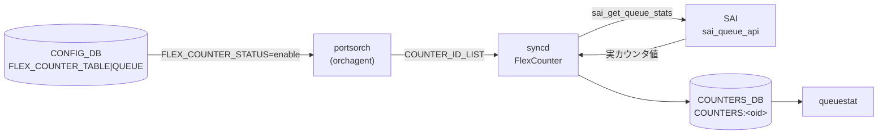

# COUNTERS_DB QUEUE カウンタ

## 概要

[portsorch](../../reference/glossary.md#term-portsorch)（[orchagent](../../reference/glossary.md#term-orchagent) 内）が [SAI](../../reference/glossary.md#term-sai) の flex counter 機構を通じてポートの送信キューごとに取得する統計カウンタ群[^1]。値は `COUNTERS_DB` の `COUNTERS:<oid>` に格納され、`queuestat` コマンドが読み出す。

> **関連ページ**: PG（Priority Group）カウンタおよびウォーターマーク体系の全体像は [`COUNTERS_DB キュー / PG カウンタテーブル群`](counters-queue.md) を参照。

<!-- cdb-mermaid -->
### データフロー (自動生成)



!!! note "凡例"
    CONFIG_DB の `FLEX_COUNTER_TABLE|QUEUE` が `enable` になると portsorch が SAI カウンタ ID リストを syncd へ投入。syncd が 10 秒ごと（コードデフォルト）にポーリングして `COUNTERS:<oid>` を更新する。

<!-- /cdb-mermaid -->

## key 構造

### キュー名→OID マップ

```text
COUNTERS_DB / COUNTERS_QUEUE_NAME_MAP   (Hash)
  field: <port_alias>:<queue_index>    (例: Ethernet0:0)
  value: <SAI OID>                     (例: oid:0x00000000000001a0)
```

VoQ システムでは field 形式が `<system_port_alias>:<queue_index>`（例: `Linecard1|ASIC0|Ethernet0:0`）となる。

### 補助マッピングテーブル

```text
COUNTERS_QUEUE_PORT_MAP   field: <queue_oid>  → value: <port_oid>
COUNTERS_QUEUE_INDEX_MAP  field: <queue_oid>  → value: <queue_index (int)>
COUNTERS_QUEUE_TYPE_MAP   field: <queue_oid>  → value: SAI_QUEUE_TYPE_UNICAST |
                                                        SAI_QUEUE_TYPE_MULTICAST |
                                                        SAI_QUEUE_TYPE_ALL |
                                                        SAI_QUEUE_TYPE_UNICAST_VOQ
```

### カウンタハッシュ

```text
COUNTERS_DB / COUNTERS:<oid>   (Hash)
  field: <SAI_QUEUE_STAT_*>
  value: <uint64 カウンタ値 (文字列)>
```

## フィールド一覧

### 通常カウンタ（QUEUE_STAT_COUNTER グループ）

`FLEX_COUNTER_TABLE|QUEUE` が `enable` のときに収集。ソース: `portsorch.cpp:389-398` の `queue_stat_ids`[^2]。

| COUNTERS:<oid> フィールド | 説明 |
|--------------------------|------|
| `SAI_QUEUE_STAT_PACKETS` | キューからの送信パケット数（累積） |
| `SAI_QUEUE_STAT_BYTES` | キューからの送信バイト数（累積） |
| `SAI_QUEUE_STAT_DROPPED_PACKETS` | キュードロップパケット数（累積） |
| `SAI_QUEUE_STAT_DROPPED_BYTES` | キュードロップバイト数（累積） |
| `SAI_QUEUE_STAT_TRIM_PACKETS` | Packet Trimming 発生パケット数 |
| `SAI_QUEUE_STAT_DROPPED_TRIM_PACKETS` | トリミング後ドロップパケット数 |
| `SAI_QUEUE_STAT_TX_TRIM_PACKETS` | トリミング後送信パケット数 |

VoQ システムでは追加フィールド `SAI_QUEUE_STAT_CREDIT_WD_DELETED_PACKETS`（Credit Watchdog 削除パケット数）が加わる[^2]。

### ウォーターマーク（QUEUE_WATERMARK_STAT_COUNTER グループ）

`FLEX_COUNTER_TABLE|QUEUE_WATERMARK` が `enable` のときに収集。`StatsMode::READ_AND_CLEAR`（ポーリングごとに SAI 側ウォーターマークレジスタをリセット）。ソース: `portsorch.cpp:405-408` の `queueWatermarkStatIds`[^2]。

| COUNTERS:<oid> フィールド | 説明 |
|--------------------------|------|
| `SAI_QUEUE_STAT_SHARED_WATERMARK_BYTES` | 共有バッファ使用量ウォーターマーク（バイト） |

### WRED/ECN カウンタ（WRED_ECN_QUEUE_STAT_COUNTER グループ）

`FLEX_COUNTER_TABLE|WRED_ECN_QUEUE` が `enable` かつ SAI が WRED ケイパビリティをサポートする場合のみ収集[^3]。ソース: `portsorch.cpp:429-435` の `wred_queue_stat_ids`。

| COUNTERS:<oid> フィールド | 説明 |
|--------------------------|------|
| `SAI_QUEUE_STAT_WRED_ECN_MARKED_PACKETS` | WRED ECN マーキングパケット数 |
| `SAI_QUEUE_STAT_WRED_ECN_MARKED_BYTES` | WRED ECN マーキングバイト数 |
| `SAI_QUEUE_STAT_WRED_DROPPED_PACKETS` | WRED ドロップパケット数 |
| `SAI_QUEUE_STAT_WRED_DROPPED_BYTES` | WRED ドロップバイト数 |

## FlexCounter グループとポーリング間隔

| FlexCounter グループ名 | CONFIG_DB キー | StatsMode | コードデフォルトポーリング間隔 |
|--------------------|--------------|-----------|--------------------------|
| `QUEUE_STAT_COUNTER` | `FLEX_COUNTER_TABLE\|QUEUE` | READ | 10000 ms |
| `QUEUE_WATERMARK_STAT_COUNTER` | `FLEX_COUNTER_TABLE\|QUEUE_WATERMARK` | READ_AND_CLEAR | 60000 ms |
| `WRED_ECN_QUEUE_STAT_COUNTER` | `FLEX_COUNTER_TABLE\|WRED_ECN_QUEUE` | READ | 10000 ms |

`counterpoll queue interval <ms>` / `counterpoll queue-watermark interval <ms>` で上書き可能。

<!-- defaults -->
## 暗黙デフォルト・コード由来挙動 (Phase A)

<!-- evidence: sonic-swss/orchagent/portsorch.cpp (ref:4305596156d7),
     sonic-swss/orchagent/portsorch.h (ref:4305596156d7),
     sonic-utilities/scripts/queuestat (ref:39732bceb8bd) -->

### カウンタフィールドセットはコードハードコード

`queue_stat_ids`（portsorch.cpp:389-398）はソースコードに静的配列として定義される。YANG モデル・CONFIG_DB・`FLEX_COUNTER_TABLE` のいずれからも変更不可[^4]。ハードウェアが当該カウンタをサポートしない場合、`queuestat` の表示では `N/A` となる。

### Packet Trimming フィールドは常時 queue_stat_ids に含まれる

`SAI_QUEUE_STAT_TRIM_PACKETS` / `SAI_QUEUE_STAT_DROPPED_TRIM_PACKETS` / `SAI_QUEUE_STAT_TX_TRIM_PACKETS` は、Packet Trimming 機能の有効・無効に関係なく `queue_stat_ids` に含まれる。Trimming 非対応 ASIC では値 `0` か `N/A`。`queuestat` の `--all`（`-a`）フラグで表示列が追加される（デフォルト `queuestat` では非表示）。

### ポーリング間隔のコードデフォルト

`FLEX_COUNTER_TABLE|QUEUE` に `POLL_INTERVAL` が未設定の場合、portsorch がコードにハードコードされた初期値を syncd に投入する[^4]。

| グループ | ハードコード定数（portsorch.cpp:90-91） | 値 |
|--------|--------------------------------------|-----|
| `QUEUE_STAT_COUNTER` | `QUEUE_STAT_FLEX_COUNTER_POLLING_INTERVAL_MS` | **10000 ms** |
| `QUEUE_WATERMARK_STAT_COUNTER` | `QUEUE_WATERMARK_STAT_FLEX_COUNTER_POLLING_INTERVAL_MS` | **60000 ms** |
| `WRED_ECN_QUEUE_STAT_COUNTER` | `QUEUE_STAT_FLEX_COUNTER_POLLING_INTERVAL_MS`（共用） | **10000 ms** |

### WRED カウンタは SAI ケイパビリティチェック必須

`SAI_QUEUE_STAT_WRED_ECN_MARKED_PACKETS` 等の WRED 統計は `checkWredCapability()`（portsorch.cpp:1894-1909）が SAI のケイパビリティクエリを実施し、サポートを確認したポートの queue にのみ `wred_queue_stat_manager` へ追加される[^3]。未サポート ASIC では `FLEX_COUNTER_TABLE|WRED_ECN_QUEUE` を `enable` にしても `COUNTERS:<oid>` に WRED フィールドが現れない（silent 非追加）。

### ウォーターマークは READ_AND_CLEAR で動作

`QUEUE_WATERMARK_STAT_COUNTER` グループは `StatsMode::READ_AND_CLEAR`（portsorch.cpp:735）で初期化される。syncd がポーリングするたびに SAI 側のウォーターマークレジスタがクリアされる。これは `watermarkstat` が PERIODIC / PERSISTENT / USER の 3 テーブルに分岐する基盤動作であり、異常ではない。

### VoQ システムでは voq_stat_ids が自動合算

`gMySwitchType == "voq"` の場合、`addQueueFlexCountersPerPortPerQueueIndex` が `voq=true` で呼ばれ、`queue_stat_ids` に加えて `voq_stat_ids`（`SAI_QUEUE_STAT_CREDIT_WD_DELETED_PACKETS`）が合算される（portsorch.cpp:8601-8614）。VoQ モード以外では Credit WD フィールドは `COUNTER_ID_LIST` に含まれない。

### isQueueMapGenerated 冪等ガード

`generateQueueMap()`（`COUNTERS_QUEUE_NAME_MAP` 等のマッピング書き込み）は `m_isQueueMapGenerated` フラグで一度だけ実行される（portsorch.cpp:8393-8396）。orchagent 再起動時に `COUNTERS_DB` のマッピングが重複書きされることはない。

### FLEX_COUNTER_STATUS 未設定時の挙動

`FLEX_COUNTER_TABLE|QUEUE` の `FLEX_COUNTER_STATUS` が `enable` になるまで、syncd は SAI ポーリングを行わない。カウンタ値は `0` のまま（または初期化前）。ポートが allPortsReady 前の場合、`enable` 受信後も FlexCounter への登録は遅延し、全ポート ready 後に一括適用される。

<!-- /defaults -->

<!-- ordering -->
## 書込み順依存 (Phase B)

`portsorch` / `FlexCounterOrch` は CONFIG_DB の `FLEX_COUNTER_TABLE|QUEUE` 系エントリを受け取り、SAI OID フェッチ・マッピング生成・カウンタ登録の順で COUNTERS_DB を構築する。以下の順序依存がコード解析で確認された。

<!-- evidence: sonic-swss/orchagent/portsorch.cpp (ref:4305596156d7),
     sonic-swss/orchagent/flexcounterorch.cpp (ref:4305596156d7) -->

### 検出された順序依存

| # | 依存関係 | 方向 | 緩和策 |
|---|----------|------|--------|
| 1 | `initializeQueuesBulk()` による SAI OID フェッチ → `generateQueueMap()` → COUNTERS_DB 書込み | 強制先行（`allPortsReady()` 前は `doTask()` がブロック） | `FlexCounterOrch::doTask()` が `allPortsReady()` チェックで自動待機 |
| 2 | Warm-reboot 時 60 秒 delay timer → FlexCounter 処理ブロック | 強制遅延（warm-reboot 固有） | `FLEX_COUNTER_DELAY_SEC=60` は定数。COUNTERS_DB 更新は 60 秒後から再開 |
| 3 | `m_isQueueMapGenerated` ガード: `generateQueueMap()` は初回のみ | 冪等保護（順序非依存） | 新規ポート追加は `createPortBufferQueueCounters()` 経由 |
| 4 | `BUFFER_QUEUE` SET と `FLEX_COUNTER_TABLE\|QUEUE = enable` の前後 | どちらが先でも最終状態は同じ。逆順でも `addQueueFlexCounters()` で追加 | 推奨: 同時または `BUFFER_QUEUE` 先 |
| 5 | `DEVICE_METADATA.create_only_config_db_buffers` の事後変更 | 以後の `getQueueConfigurations()` にのみ影響。既登録カウンタは変更されない | 変更反映には orchagent 再起動が必要 |
| 6 | VoQ モード: egress queue カウンタは常時登録（`FLEX_COUNTER_TABLE` / `BUFFER_QUEUE` 順序無関係） | 順序依存なし | VoQ 固有仕様 |
| 7 | `FLEX_COUNTER_TABLE\|WRED_ECN_QUEUE = enable` と `BUFFER_QUEUE` の順序 | どちらが先でも最終状態同じ（依存 #4 と同パターン） | ASIC 非サポートは silent 未登録（順序と無関係） |
| 8 | `BUFFER_QUEUE` DEL → カウンタ即時停止（`FLEX_COUNTER_TABLE` 状態に依存しない） | 順序依存なし | DEL 前に `disable` 不要 |

### 主要制約の詳細

**SAI OID フェッチが先行必須 (依存 #1)**: `PortsOrch::initializePorts()` 内で `initializeQueuesBulk(ports)` が呼ばれ、SAI から各ポートの Queue OID リスト（`SAI_PORT_ATTR_QOS_QUEUE_LIST`）を取得して `port.m_queue_ids` へキャッシュする。`port.m_queue_ids` が空の状態で `generateQueueMapPerPort()` が呼ばれると、ループが 0 回で終わりマッピングが書き込まれない。`FlexCounterOrch::doTask()` は `gPortsOrch->allPortsReady()` が `false` の間は先頭で `return` するため（`flexcounterorch.cpp:164-167`）、`FLEX_COUNTER_TABLE|QUEUE = enable` が orchagent 起動前に書き込まれていても OID フェッチ完了まで `generateQueueMap()` は呼ばれない。

**Warm-reboot 60 秒遅延 (依存 #2)**: `FlexCounterOrch` コンストラクタ（`flexcounterorch.cpp:127-136`）で `FLEX_COUNTER_DELAY_SEC = 60` 秒の `SelectableTimer` を設定する。Cold boot では即 `m_delayTimerExpired = true` になり遅延なし。Warm-reboot では `doTask()` 冒頭の `if (!m_delayTimerExpired) return;`（`flexcounterorch.cpp:156-158`）で全 FlexCounter 処理が 60 秒間ブロックされる。

**`BUFFER_QUEUE` と `FLEX_COUNTER_TABLE|QUEUE` の順序 (依存 #4)**: ランタイム中に `BUFFER_QUEUE` への SET が届くと `createPortBufferQueueCounters()`（`portsorch.cpp:8700-8755`）が呼ばれる。`flexCounterOrch->getQueueCountersState()` が `true`（= QUEUE が enable）の場合のみ `addQueueFlexCountersPerPortPerQueueIndex()` が呼ばれる。`BUFFER_QUEUE` を先に書いて後から `enable` にした場合も、`enable` 処理時に `addQueueFlexCounters(getQueueConfigurations())` で遡及追加されるため、最終状態は同じになる（evidence: `portsorch.cpp:8730-8744`, `flexcounterorch.cpp:247-252`）。

<!-- /ordering -->

<!-- ref-triangle:start -->

## 関連リファレンス

- [CONFIG_DB FLEX_COUNTER_TABLE](flex-counter-table.md)
- [CONFIG_DB BUFFER_QUEUE](buffer-queue.md)
- [COUNTERS_DB キュー / PG カウンタ全体](counters-queue.md)
- CLI: `queuestat`、`counterpoll`

<!-- ref-triangle:end -->

## 引用元

[^1]: portsorch.cpp:758-782 — COUNTERS_DB 接続と COUNTERS_QUEUE_NAME_MAP / COUNTERS_QUEUE_PORT_MAP / COUNTERS_QUEUE_INDEX_MAP / COUNTERS_QUEUE_TYPE_MAP 初期化。<https://github.com/sonic-net/sonic-swss/blob/4305596156d7/orchagent/portsorch.cpp#L758>

[^2]: portsorch.cpp:389-408 — `queue_stat_ids` / `voq_stat_ids` / `queueWatermarkStatIds` 静的配列定義。<https://github.com/sonic-net/sonic-swss/blob/4305596156d7/orchagent/portsorch.cpp#L389>

[^3]: portsorch.cpp:1894-1909 — `checkWredCapability()` による SAI ケイパビリティ問い合わせ。サポート確認後のみ FlexCounter に WRED 統計を追加。<https://github.com/sonic-net/sonic-swss/blob/4305596156d7/orchagent/portsorch.cpp#L1894>

[^4]: portsorch.h:34-42 および portsorch.cpp:90-91 — FlexCounter グループ名定数とハードコードポーリング間隔定義。<https://github.com/sonic-net/sonic-swss/blob/4305596156d7/orchagent/portsorch.h#L34>
