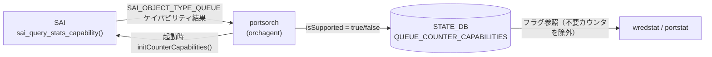

# QUEUE_COUNTER_CAPABILITIES (STATE_DB)

## 概要

`STATE_DB` の `QUEUE_COUNTER_CAPABILITIES` テーブルは、`sonic-swss` の `portsorch` が orchagent 起動時に [SAI](../../reference/glossary.md#term-sai) ケイパビリティクエリ（`sai_query_stats_capability`）を実行した結果を書き込む読み取り専用テーブルである[^1]。

書き込まれるフィールドは WRED/ECN キューカウンタ 4 種のサポート可否フラグ（`isSupported: "true"/"false"`）のみ。`wredstat` スクリプトおよび `portstat.py` がこのフラグを参照して、未サポートの ASIC では COUNTERS_DB から対応フィールドを除外する。

!!! note "CONFIG_DB との関係"
    `QUEUE_COUNTER_CAPABILITIES` は STATE_DB の**読み取り専用**テーブルであり、CONFIG_DB には対応する設定テーブルが存在しない。WRED/ECN カウンタの有効化は `FLEX_COUNTER_TABLE|WRED_ECN_QUEUE` の `FLEX_COUNTER_STATUS` で行うが、ASIC が対応していない場合はフラグが `"false"` のまま残る。

<!-- cdb-mermaid -->
### データフロー



<!-- /cdb-mermaid -->

## key 構造

```text
QUEUE_COUNTER_CAPABILITIES|<capability_name>
```

現在定義されているキー（`portsorch.cpp:1872-1875`）:

| キー | 対応 SAI 統計 |
|------|-------------|
| `WRED_ECN_QUEUE_ECN_MARKED_PKT_COUNTER` | `SAI_QUEUE_STAT_WRED_ECN_MARKED_PACKETS` |
| `WRED_ECN_QUEUE_ECN_MARKED_BYTE_COUNTER` | `SAI_QUEUE_STAT_WRED_ECN_MARKED_BYTES` |
| `WRED_ECN_QUEUE_WRED_DROPPED_PKT_COUNTER` | `SAI_QUEUE_STAT_WRED_DROPPED_PACKETS` |
| `WRED_ECN_QUEUE_WRED_DROPPED_BYTE_COUNTER` | `SAI_QUEUE_STAT_WRED_DROPPED_BYTES` |

## フィールド一覧

各キーに対して 1 フィールドのみ存在する:

| フィールド | 型 | 書込み主体 | デフォルト | 説明 |
|-----------|----|-----------|-----------|------|
| `isSupported` | boolean string | `portsorch` (initCounterCapabilities) | `"false"` | ASIC が当該 WRED/ECN カウンタをサポートする場合 `"true"`、未サポートの場合 `"false"` |

## 書き込みロジック詳細

`portsorch.cpp:1850-1918` の `initCounterCapabilities()` が `switchId` を引数に起動直後 1 回だけ呼ばれる:

1. **初期化フェーズ**: 4 つの全キーに `isSupported = "false"` を書き込む（デフォルト）
2. **SAI クエリフェーズ**: `sai_query_stats_capability(switchId, SAI_OBJECT_TYPE_QUEUE, &queue_stats_capability)` を実行
3. **更新フェーズ**: クエリが `SAI_STATUS_SUCCESS` を返した場合のみ、対応する統計を含む行があれば `isSupported = "true"` に上書き
4. **失敗時**: `SAI_STATUS_SUCCESS` 以外（`SAI_STATUS_BUFFER_OVERFLOW` リトライ失敗含む）では全フラグが `"false"` のまま

```cpp
// portsorch.cpp:1871-1913
m_queueCounterCapabilitiesTable->set("WRED_ECN_QUEUE_ECN_MARKED_PKT_COUNTER",  fieldValuesFalse);
m_queueCounterCapabilitiesTable->set("WRED_ECN_QUEUE_ECN_MARKED_BYTE_COUNTER", fieldValuesFalse);
m_queueCounterCapabilitiesTable->set("WRED_ECN_QUEUE_WRED_DROPPED_PKT_COUNTER",  fieldValuesFalse);
m_queueCounterCapabilitiesTable->set("WRED_ECN_QUEUE_WRED_DROPPED_BYTE_COUNTER", fieldValuesFalse);

// ... sai_query_stats_capability() ...

if (SAI_QUEUE_STAT_WRED_ECN_MARKED_PACKETS == queue_stats_capability.list[it].stat_enum)
    m_queueCounterCapabilitiesTable->set("WRED_ECN_QUEUE_ECN_MARKED_PKT_COUNTER", fieldValuesTrue);
// ... (4 統計すべて同様)
```

## 消費者 (consumer)

| プロセス | 参照方法 | 用途 |
|---------|---------|------|
| `sonic-utilities/utilities_common/portstat.py` | `STATE_DB QUEUE_COUNTER_CAPABILITIES|...` の `isSupported` フィールドを直接 GET | portstat が COUNTERS_DB から取得するカウンタ列を絞り込む |
| `sonic-utilities/scripts/wredstat` | `state_db.connect(STATE_DB)` 後に参照 | wredstat が N/A 表示 vs 実値表示を制御 |
| `sonic-utilities/counterpoll/main.py` | 間接的（FLEX_COUNTER_TABLE|WRED_ECN_QUEUE 経由） | counterpoll show で `WRED_ECN_QUEUE_STAT` 行を表示 |

<!-- defaults -->
## フィールド暗黙デフォルト (Phase A — コード由来)

YANG schema は存在しない。すべてのデフォルトは `portsorch.cpp` のコードに由来する。

| フィールド / キー | コード由来デフォルト | fallback 源 |
|-----------------|-------------------|------------|
| `WRED_ECN_QUEUE_ECN_MARKED_PKT_COUNTER.isSupported` | `"false"` | `portsorch.cpp:1872` — `initCounterCapabilities()` が set 前に必ず `"false"` で初期化 |
| `WRED_ECN_QUEUE_ECN_MARKED_BYTE_COUNTER.isSupported` | `"false"` | `portsorch.cpp:1873` — 同上 |
| `WRED_ECN_QUEUE_WRED_DROPPED_PKT_COUNTER.isSupported` | `"false"` | `portsorch.cpp:1874` — 同上 |
| `WRED_ECN_QUEUE_WRED_DROPPED_BYTE_COUNTER.isSupported` | `"false"` | `portsorch.cpp:1875` — 同上 |

### 補足

- **全デフォルトは `"false"`**: ASIC が WRED/ECN 統計をまったくサポートしない環境では、4 フィールド全てが `"false"` のままとなる。`wredstat` は N/A を表示し、counterpoll の WRED_ECN_QUEUE を `enable` にしても COUNTERS_DB に対応フィールドが現れない（silent non-addition）。
- **orchagent 再起動でリセット**: `initCounterCapabilities()` は起動のたびに実行される。ただし `sai_query_stats_capability()` の結果が一貫しているため、再起動ごとに同じフラグが書き込まれる。
- **部分サポートあり**: ECN マーキングのみサポートし WRED ドロップはサポートしない ASIC の場合、`WRED_ECN_QUEUE_ECN_MARKED_PKT_COUNTER` / `WRED_ECN_QUEUE_ECN_MARKED_BYTE_COUNTER` のみ `"true"` となる（独立したフラグ）。
- **`PORT_COUNTER_CAPABILITIES` との対称性**: 同じ `initCounterCapabilities()` 内でポート側の `PORT_COUNTER_CAPABILITIES` テーブルも同様のパターンで書き込まれる。ポート側は `SAI_OBJECT_TYPE_PORT` でクエリする。

<!-- /defaults -->

<!-- cdb-exceptions -->
## 例外条件・特殊挙動

| 条件 | 挙動 |
|------|------|
| `sai_query_stats_capability()` 失敗 | `SWSS_LOG_NOTICE("Queue stat capability get failed: ...")` を出力し、4 フィールド全て `"false"` のまま |
| SAI が `SAI_STATUS_BUFFER_OVERFLOW` を返す | `queue_stats_capability.list` をリサイズして再クエリ。再クエリも失敗した場合は上記と同じ |
| orchagent 起動前に `wredstat` を実行 | STATE_DB に当該キーが存在しないため、`state_db.get()` が `None` を返す。wredstat は WRED カウンタを N/A 扱いする |
| FLEX_COUNTER_TABLE|WRED_ECN_QUEUE が `disable` | `QUEUE_COUNTER_CAPABILITIES` の `isSupported` には影響しない（SAI ケイパビリティフラグは FLEX_COUNTER 設定と独立） |

<!-- /cdb-exceptions -->

<!-- ordering -->
## 書込み順依存 (Phase B)

`QUEUE_COUNTER_CAPABILITIES` テーブルへの書込みは `PortsOrch::initCounterCapabilities(gSwitchId)` が PortsOrch 初期化処理の末尾（`portsorch.cpp:1107`）で 1 回のみ実行する。書込みは以下の固定順序で行われ、この順序は変更不可能。

### 検出された順序依存

| # | 依存関係 | 方向 | 緩和策 |
|---|----------|------|--------|
| 1 | 全 4 キーへの `isSupported = "false"` 初期化 → SAI クエリ | **強制先行** — 初期化が必ず先に実行される | orchagent 起動直後の一瞬、すべてのキーが `"false"` の中間状態になる |
| 2 | SAI クエリ成功 → 対応キーへの `isSupported = "true"` 上書き | **SAI 応答後**（初期化完了後のみ） | SAI クエリ失敗時は上書きされず全キーが `"false"` のまま確定 |
| 3 | `SAI_STATUS_BUFFER_OVERFLOW` 発生 → リスト拡張 → 再クエリ | 最大 1 回リトライ | 再クエリも失敗した場合は上書きされない（初期化値 `"false"` が確定） |
| 4 | `QUEUE_COUNTER_CAPABILITIES` 書込み完了 → `wredstat` / `portstat.py` の参照 | **orchagent 初期化完了後に参照すること** | 初期化前に参照すると STATE_DB にキーが存在せず `None` が返る |

### 主要な制約詳細

**初期化 → SAI クエリの強制先行順序 (依存 #1, #2)**: `initCounterCapabilities()` は冒頭でテーブルの 4 キー全てに `isSupported = "false"` を書き込んだ後に `sai_query_stats_capability()` を呼ぶ（`portsorch.cpp:1871-1882`）。SAI クエリが成功した場合のみ、対応する統計を含む行を `isSupported = "true"` で上書きする（`portsorch.cpp:1889-1915`）。この 2 ステップの間に consumer が参照した場合、全フラグが `"false"` の中間状態を観測しうる。ただし `initCounterCapabilities()` は orchagent の起動シーケンス中のみ実行され、通常の動作状態での更新は発生しない。

**PORT_COUNTER_CAPABILITIES との非依存関係**: 同じ `initCounterCapabilities()` 内で `PORT_COUNTER_CAPABILITIES` テーブルも同様のパターンで書き込まれるが（`portsorch.cpp:1876-1879`, `portsorch.cpp:1928-1970`）、2 つのテーブル間に相互依存はない。QUEUE 側が成功し PORT 側が失敗した場合もそれぞれ独立した結果となる。

**FlexCounterOrch との関係**: `QUEUE_COUNTER_CAPABILITIES` の書込みは FlexCounterOrch の動作に依存しない。ただし、`counterpoll wred-queue enable` により `FLEX_COUNTER_TABLE|WRED_ECN_QUEUE` が設定されても、`isSupported = "false"` のキーに対応するカウンタは COUNTERS_DB に現れない（`wredstat` は N/A 表示）。consumer は FLEX_COUNTER 設定と `QUEUE_COUNTER_CAPABILITIES` の両方を確認する必要がある。

<!-- /ordering -->

<!-- cross-refs -->
## 暗黙参照テーブル (Phase C)

YANG leafref を超えた他テーブル・他 DB・プラットフォームとの実装上の依存関係。`QUEUE_COUNTER_CAPABILITIES` は `portsorch` が**書き手専用**のテーブルであり、consumer 側（`wredstat` / `portstat.py`）は参照のみ行う。

| 参照先 | DB / 場所 | 方向 | 契機 | 根拠コード |
|--------|-----------|------|------|-----------|
| SAI `sai_query_stats_capability(gSwitchId, SAI_OBJECT_TYPE_QUEUE, ...)` | SAI / プラットフォーム | READ | `initCounterCapabilities()` が orchagent 初期化時に 1 回呼び出す。返却された統計ケイパビリティリストに基づいて 4 キーの `isSupported` フラグを確定する。クエリ失敗時は全フラグが `"false"` のまま固定される | `portsorch.cpp:1882-1916` |
| `PORT_COUNTER_CAPABILITIES` | STATE_DB | WRITE（兄弟テーブル） | 同じ `initCounterCapabilities()` 内で `SAI_OBJECT_TYPE_PORT` ケイパビリティを問い合わせ、`WRED_ECN_PORT_*` キーを書き込む。QUEUE 側の 4 キーと PORT 側の 4 キーは独立して成否が決まり、相互依存はない | `portsorch.cpp:1927-1970` |
| `FLEX_COUNTER_TABLE\|WRED_ECN_QUEUE` | CONFIG_DB | READ（間接） | `counterpoll wred-queue enable` により `FLEX_COUNTER_STATUS = enable` が書かれると `FlexCounterOrch` が `addWredQueueFlexCounters()` を呼ぶ。`isSupported = "false"` のポートのキューカウンタは `wred_queue_stat_manager.setCounterIdList()` に渡されないため COUNTERS_DB に出現しない | `flexcounterorch.cpp:276-281`, `portsorch.cpp:9574-9593` |
| `COUNTERS_DB COUNTERS:<queue_oid>` | COUNTERS_DB | READ（downstream consumer） | `wredstat` スクリプトが COUNTERS_DB から WRED/ECN カウンタ値を取得する際、`QUEUE_COUNTER_CAPABILITIES.isSupported = "false"` のキューは FlexCounter に登録されていないため `None` が返り `STATUS_NA` が表示される | `wredstat:198-204` |

### 補足

- **書き手は `portsorch` のみ**: `QUEUE_COUNTER_CAPABILITIES` に書き込むのは `initCounterCapabilities()` 1 関数だけで、動的な更新（フィールドの追加・変更）は orchagent 再起動以外では発生しない。
- **`FLEX_COUNTER_TABLE` との関係は間接的**: `QUEUE_COUNTER_CAPABILITIES` 自体は `FLEX_COUNTER_TABLE` を参照しない。FlexCounter の enable/disable が `addWredQueueFlexCounters()` 呼び出し可否を制御し、その内部で syncd 側の登録対象（`setCounterIdList()`）が変わることで COUNTERS_DB の出現可否に影響する。
- **SAI プラットフォーム依存**: `sai_query_stats_capability` の結果はプラットフォーム実装に依存する。`SAI_STATUS_NOT_SUPPORTED` を返す SAI 実装では常に全フラグ `"false"` となる。

<!-- /cross-refs -->

<!-- failure -->
## 失敗挙動・エラーパス (Phase D)

> **調査根拠**: `sonic-swss/orchagent/portsorch.cpp` @ master 全行精読  
> 詳細証跡: `meta/_intermediate/cdb-flow/queue-state-failure.md`

### SAI クエリ失敗（`sai_query_stats_capability` エラー）

```cpp
// portsorch.cpp:1882-1921
sai_status_t status = sai_query_stats_capability(switchId, SAI_OBJECT_TYPE_QUEUE, &queue_stats_capability);
if (status == SAI_STATUS_BUFFER_OVERFLOW)
{
    qstat_cap_list.resize(queue_stats_capability.count, stat_initializer);
    queue_stats_capability.list = qstat_cap_list.data();
    status = sai_query_stats_capability(switchId, SAI_OBJECT_TYPE_QUEUE, &queue_stats_capability);
}
if (status == SAI_STATUS_SUCCESS) { /* isSupported = "true" 上書き */ }
else
{
    SWSS_LOG_NOTICE("Queue stat capability get failed: WRED queue stats can not be enabled, rv:%d", status);
}
```

**挙動**: 最終的に `status != SAI_STATUS_SUCCESS` となった場合、`SWSS_LOG_NOTICE` を出力して全 4 キーを `"false"` のまま確定する。自動リトライはなく orchagent 再起動まで状態が変化しない。

### SAI_STATUS_BUFFER_OVERFLOW — リトライパス

`sai_query_stats_capability()` が `SAI_STATUS_BUFFER_OVERFLOW` を返した場合、`queue_stats_capability.count` に返却されたエントリ数を用いてリストをリサイズし、同一関数を **1 回だけ再呼び出し** する（`portsorch.cpp:1883-1888`）。

- 再クエリが成功 → 通常と同じ `isSupported = "true"` 上書きフロー
- 再クエリも失敗 → `SWSS_LOG_NOTICE` を出力し全フラグが `"false"` のまま確定（2 回目以降のリトライなし）

### orchagent 起動完了前の consumer アクセス

`initCounterCapabilities()` は `PortsOrch` コンストラクタの末尾（`portsorch.cpp:1107`）で 1 回実行されるため、orchagent が完全に起動するまで STATE_DB にキーが存在しない。

| consumer | 挙動 |
|---------|------|
| `wredstat` | `state_db.get()` が `None` → `counter_data is None` → `STATUS_NA` 表示。再実行で解消 |
| `portstat.py` | `isSupported` が `None` → `!= "true"` 判定成立 → 対応 SAI 統計を `counter_bucket_dict` から除外 |

### FlexCounter 未登録による COUNTERS_DB 欠落

`isSupported = "false"` のキャパビリティキーに対応するキューカウンタは `FlexCounterOrch::addWredQueueFlexCounters()` で `setCounterIdList()` の対象外となる。結果として COUNTERS_DB に `SAI_QUEUE_STAT_WRED_*` フィールドが現れず、`wredstat` は常に N/A を表示する。`counterpoll wred-queue enable` を設定しても変化しない（SAI ケイパビリティと FLEX_COUNTER 設定は独立）。

### 失敗挙動サマリ

| 条件 | ログ | STATE_DB への影響 | リカバー |
|------|------|------------------|---------|
| SAI クエリ初回失敗（BUFFER_OVERFLOW 以外） | `SWSS_LOG_NOTICE` | 全 4 キーが `"false"` のまま確定 | orchagent 再起動 |
| SAI クエリ BUFFER_OVERFLOW → リトライ失敗 | `SWSS_LOG_NOTICE` | 全 4 キーが `"false"` のまま確定 | orchagent 再起動 |
| orchagent 起動完了前に consumer が参照 | なし（consumer 側で N/A） | STATE_DB にキーが存在しない | orchagent 起動完了後に再実行 |
| 一部キーのみ SAI 未サポート（部分的） | なし（正常フロー） | 未サポートキーは `"false"`、サポートキーは `"true"` | N/A（仕様通り） |
| FlexCounter 未登録（isSupported が false） | なし | COUNTERS_DB に対応カウンタが出現しない | プラットフォームの SAI 実装変更が必要 |

<!-- /failure -->

<!-- constants -->
## ハードコード定数 (Phase E)

> **調査根拠**: `sonic-swss/orchagent/portsorch.cpp` @ master 全行精読  
> 詳細証跡: `meta/_intermediate/cdb-flow/queue-state-constants.md`

`QUEUE_COUNTER_CAPABILITIES` テーブルに関わるハードコード定数は `portsorch.cpp` の `initCounterCapabilities()` 内にすべて埋め込まれており、YANG / CONFIG_DB に対応するスキーマ定義は存在しない。

### テーブル名定数

| 定数名 | 値 | 定義箇所 |
|--------|----|---------|
| `STATE_QUEUE_COUNTER_CAPABILITIES_NAME` | `"QUEUE_COUNTER_CAPABILITIES"` | `sonic-swss-common/common/schema.h:528` |

### キー名文字列（コード埋め込みリテラル）

4 つのキー名はマクロ定義なしで `portsorch.cpp` 内にリテラル文字列として直接記述される。

| キー文字列 | 対応 SAI 統計 | コード行 |
|-----------|-------------|---------|
| `"WRED_ECN_QUEUE_ECN_MARKED_PKT_COUNTER"` | `SAI_QUEUE_STAT_WRED_ECN_MARKED_PACKETS` | `portsorch.cpp:1872, 1896` |
| `"WRED_ECN_QUEUE_ECN_MARKED_BYTE_COUNTER"` | `SAI_QUEUE_STAT_WRED_ECN_MARKED_BYTES` | `portsorch.cpp:1873, 1901` |
| `"WRED_ECN_QUEUE_WRED_DROPPED_PKT_COUNTER"` | `SAI_QUEUE_STAT_WRED_DROPPED_PACKETS` | `portsorch.cpp:1874, 1906` |
| `"WRED_ECN_QUEUE_WRED_DROPPED_BYTE_COUNTER"` | `SAI_QUEUE_STAT_WRED_DROPPED_BYTES` | `portsorch.cpp:1875, 1911` |

### フィールド値定数

| フィールド名 | 値 | 意味 | コード行 |
|------------|-----|------|---------|
| `"isSupported"` | `"false"` | 初期値（全キーへの書込み）および SAI クエリ失敗時の確定値 | `portsorch.cpp:1868-1875` — `fieldValuesFalse` |
| `"isSupported"` | `"true"` | SAI クエリ成功時、対応する統計を含む行に上書き | `portsorch.cpp:1865-1866, 1896-1911` — `fieldValuesTrue` |

### ログメッセージ定数

| ログレベル | メッセージ | コード行 |
|----------|-----------|---------|
| `SWSS_LOG_NOTICE` | `"Queue stat capability get failed: WRED queue stats can not be enabled, rv:%d"` | `portsorch.cpp:1921` |
| `SWSS_LOG_INFO` | `"WRED queue stats is_capable: [ecn-marked-pkts:%d,ecn-marked-bytes:%d,wred-drop-pkts:%d,wred-drop-bytes:%d]"` | `portsorch.cpp:1916-1917` |

> **注意**: `SAI_STATUS_BUFFER_OVERFLOW` リトライ時のリスト初期化は `stat_enum = 0, stat_modes = 0` のゼロ初期化定数で行われる（`portsorch.cpp:1859-1860`）。これは有効な SAI 統計を示す値ではなく、リスト拡張時のプレースホルダとしてのみ使用される。

<!-- /constants -->

<!-- side-effects -->
## SET/DEL 副次 DB 書込み (Phase F)

> 詳細証跡: `meta/_intermediate/cdb-flow/queue-state-side-effects.md`

`initCounterCapabilities()` は `QUEUE_COUNTER_CAPABILITIES` への書込みと同一関数呼び出し内で、STATE_DB の別テーブル `PORT_COUNTER_CAPABILITIES` にも書込む。

### STATE_DB `PORT_COUNTER_CAPABILITIES` への副次書込み (portsorch.cpp:1876-1963)

`initCounterCapabilities()` は冒頭で `PORT_COUNTER_CAPABILITIES` の 4 キーを `isSupported=false` で初期化し、その後 `SAI_OBJECT_TYPE_PORT` の `sai_query_stats_capability()` 結果に応じて `true` に上書きする。

| 操作 | 対象 DB / テーブル | キー | 条件 |
|------|-----------------|------|------|
| SET `isSupported=false`（初期化） | STATE_DB / `PORT_COUNTER_CAPABILITIES` | `WRED_ECN_PORT_WRED_GREEN_DROP_COUNTER` | 常に（portsorch.cpp:1876） |
| SET `isSupported=false`（初期化） | STATE_DB / `PORT_COUNTER_CAPABILITIES` | `WRED_ECN_PORT_WRED_YELLOW_DROP_COUNTER` | 常に（portsorch.cpp:1877） |
| SET `isSupported=false`（初期化） | STATE_DB / `PORT_COUNTER_CAPABILITIES` | `WRED_ECN_PORT_WRED_RED_DROP_COUNTER` | 常に（portsorch.cpp:1878） |
| SET `isSupported=false`（初期化） | STATE_DB / `PORT_COUNTER_CAPABILITIES` | `WRED_ECN_PORT_WRED_TOTAL_DROP_COUNTER` | 常に（portsorch.cpp:1879） |
| SET `isSupported=true` | STATE_DB / `PORT_COUNTER_CAPABILITIES` | `WRED_ECN_PORT_WRED_GREEN_DROP_COUNTER` | `SAI_OBJECT_TYPE_PORT` クエリ成功 + `SAI_PORT_STAT_GREEN_WRED_DROPPED_PACKETS` 確認時（portsorch.cpp:1943） |
| SET `isSupported=true` | STATE_DB / `PORT_COUNTER_CAPABILITIES` | `WRED_ECN_PORT_WRED_YELLOW_DROP_COUNTER` | `SAI_OBJECT_TYPE_PORT` クエリ成功 + `SAI_PORT_STAT_YELLOW_WRED_DROPPED_PACKETS` 確認時（portsorch.cpp:1948） |
| SET `isSupported=true` | STATE_DB / `PORT_COUNTER_CAPABILITIES` | `WRED_ECN_PORT_WRED_RED_DROP_COUNTER` | `SAI_OBJECT_TYPE_PORT` クエリ成功 + `SAI_PORT_STAT_RED_WRED_DROPPED_PACKETS` 確認時（portsorch.cpp:1953） |
| SET `isSupported=true` | STATE_DB / `PORT_COUNTER_CAPABILITIES` | `WRED_ECN_PORT_WRED_TOTAL_DROP_COUNTER` | `SAI_OBJECT_TYPE_PORT` クエリ成功 + `SAI_PORT_STAT_WRED_DROPPED_PACKETS` 確認時（portsorch.cpp:1958） |

### 副次書込みの特性

- **不可分 2 テーブル書込み**: `QUEUE_COUNTER_CAPABILITIES` と `PORT_COUNTER_CAPABILITIES` は同一 `initCounterCapabilities()` 呼び出し内で書き込まれる。2 テーブルの SAI クエリ（`SAI_OBJECT_TYPE_QUEUE` と `SAI_OBJECT_TYPE_PORT`）は独立して実行されるため、一方のクエリが失敗しても他方の書込み結果には影響しない。
- **portstat.py の間接依存**: `sonic-utilities/utilities_common/portstat.py` は `PORT_COUNTER_CAPABILITIES|*` エントリの `isSupported` を参照して、COUNTERS_DB から取得するポートカウンタ列を絞り込む（portstat.py:297-312）。orchagent 停止中は `PORT_COUNTER_CAPABILITIES` も未書込みのため、portstat の WRED 列が N/A 表示となる。
- **DEL 操作なし**: `initCounterCapabilities()` は SET 専用。orchagent 再起動時は上書き SET のみ行われ、既存エントリの DEL は実施されない。

<!-- /side-effects -->

<!-- pubsub -->
## 通信メカニズム (Phase G)

> 詳細証跡: `meta/_intermediate/cdb-flow/queue-state-pubsub.md`

### Producer/Consumer 構造

`QUEUE_COUNTER_CAPABILITIES` は **orchagent 起動時 1 回のみ書き込まれる静的ステータステーブル**であり、Redis Pub/Sub や keyspace notification を使用しない。

| 区間 | 方式 | 使用クラス / API |
|------|------|----------------|
| portsorch → STATE_DB | `Table::set()` (`HSET` 直接) | `swss::Table`（`portsorch.cpp:793`） |
| consumer → STATE_DB | `SonicV2Connector.get()` → `HGET` 直接読み出し | `wredstat:196-197`、`portstat.py:297-312` |

### Producer 詳細 — portsorch の書き込み

`PortsOrch` コンストラクタ（`portsorch.cpp:793`）で `swss::Table` インスタンスを生成し、`initCounterCapabilities()` 内で `table->set()` を呼ぶ。`swss::Table` は内部で `HSET` を実行するため、Redis Pub/Sub の `LPUSH` + `PUBLISH` は発行されない。

```cpp
// portsorch.cpp:793
m_queueCounterCapabilitiesTable = unique_ptr<Table>(
    new Table(m_state_db.get(), STATE_QUEUE_COUNTER_CAPABILITIES_NAME));

// portsorch.cpp:1872-1875 (initCounterCapabilities 内)
m_queueCounterCapabilitiesTable->set("WRED_ECN_QUEUE_ECN_MARKED_PKT_COUNTER",  fieldValuesFalse);
m_queueCounterCapabilitiesTable->set("WRED_ECN_QUEUE_ECN_MARKED_BYTE_COUNTER", fieldValuesFalse);
// ...（SAI クエリ成功後は fieldValuesTrue で上書き）
```

書き込みは `PortsOrch::PortsOrch()` → `init()` → `initCounterCapabilities(gSwitchId)` の呼び出しチェーンで起動時 **1 回のみ**実行される。CONFIG_DB イベントに反応した動的更新はない。

### Consumer 詳細 — 直接 HGET による読み出し

**wredstat** (`sonic-utilities/scripts/wredstat:196-197`):

```python
self.state_db = SonicV2Connector(use_unix_socket_path=False)
self.state_db.connect(self.state_db.STATE_DB)
```

`wredstat` は `SonicV2Connector.get()` で `HGET QUEUE_COUNTER_CAPABILITIES|<cap_name> isSupported` を呼ぶ。SUBSCRIBE や keyspace notification は使用しない（毎コマンド実行時に都度 GET）。

**portstat.py** (`sonic-utilities/utilities_common/portstat.py:297-312`): 兄弟テーブル `PORT_COUNTER_CAPABILITIES` を同様の直接 GET で参照する（`QUEUE_COUNTER_CAPABILITIES` への直接参照はなし）。

### keyspace notification の不使用

STATE_DB の `notify-keyspace-events` 設定に関わらず、orchagent / consumer のいずれも `SUBSCRIBE` / `PSUBSCRIBE` を使用しない。このため:

- **consumer は orchagent の書き込み完了を待機しない**: `wredstat` は起動時に都度 GET するため、orchagent がまだ書き込む前に実行された場合は `None` が返り N/A 表示になる（Phase D 「orchagent 起動前の wredstat」参照）
- **書き込み通知遅延は存在しない**: SET 後は即時 Redis に反映され、次回 GET で最新値が得られる

<!-- /pubsub -->

<!-- platform -->
## プラットフォーム / SAI Capability 差異 (Phase H)

> 調査証跡: `meta/_intermediate/cdb-flow/queue-state-platform.md`

`QUEUE_COUNTER_CAPABILITIES` テーブルのキー構造・フィールド名はすべてのプラットフォームで共通であり、コードレベルのプラットフォーム条件分岐（`gMySwitchType` 等）は `initCounterCapabilities()` 内に存在しない。唯一のプラットフォーム差分は `isSupported` の値であり、これは `sai_query_stats_capability(gSwitchId, SAI_OBJECT_TYPE_QUEUE, ...)` に対する SAI SDK の応答に完全に依存する。

### switchType 別の動作

| switchType | `initCounterCapabilities()` 実行有無 | WRED/ECN カウンタ期待値 |
|-----------|-----------------------------------|--------------------|
| 標準 BOX スイッチ（Broadcom ASIC 等） | 常に実行（無条件） | SAI 実装依存。WRED 対応 SKU では対応キーが `"true"` |
| DPU (`gMySwitchType == "dpu"`) | 常に実行（DPU 用スキップなし） | DPU SAI は WRED 未サポートが多く、全 4 キーが `"false"` となる傾向 |
| VoQ シャーシ (`gMySwitchType == "voq"`) | 常に実行（VoQ 用スキップなし） | VoQ ハードウェアは WRED/ECN をサポートしないケースが多く、全 4 キーが `"false"` となる傾向 |

`initCounterCapabilities()` の呼び出し元 (`portsorch.cpp:1107`) は DPU / VOQ / 標準スイッチいずれの場合も条件なしで到達する。

### SAI 実装ごとの差異

| SAI 実装ケース | 結果 |
|--------------|------|
| SAI が `SAI_STATUS_SUCCESS` を返し WRED/ECN 統計がケイパビリティリストに含まれる | 対応する `isSupported` キーが `"true"` に上書き |
| SAI が `SAI_STATUS_SUCCESS` を返すが WRED/ECN 統計がリストに含まれない | 全 4 キーが `"false"` のまま確定 |
| SAI が `SAI_STATUS_BUFFER_OVERFLOW` を返す | リサイズして 1 回リトライ。再クエリ成功なら通常フロー、失敗なら全 4 キー `"false"` 確定 |
| SAI が `SAI_STATUS_NOT_SUPPORTED` / その他エラーを返す | `SWSS_LOG_NOTICE` 出力後、全 4 キーが `"false"` のまま確定 |

### VoQ シャーシ — FlexCounter 登録先の差異

`isSupported = "true"` となった場合でも、VoQ 環境では WRED キューカウンタの FlexCounter 登録先の OID セットが異なる: `addWredQueueFlexCountersPerPortPerQueueIndex()` (portsorch.cpp:9583-9586) は VoQ ポートに対して `m_port_voq_ids` を使用する。`QUEUE_COUNTER_CAPABILITIES` テーブル自体の内容（`isSupported` 値）には影響しない。

### プラットフォーム共通要素

以下は全プラットフォームで不変:

- 書き込まれる 4 キー名（リテラル文字列、`portsorch.cpp:1872-1875`）
- `isSupported` フィールド名
- テーブル名 `QUEUE_COUNTER_CAPABILITIES`（`schema.h:528` の定数由来）
- 問い合わせ対象の SAI 統計 enum 4 種（`wred_queue_stat_ids` 静的定数、`portsorch.cpp:429-435`）

<!-- /platform -->

<!-- ref-triangle:start -->

## 関連リファレンス

- CONFIG_DB: [`FLEX_COUNTER_TABLE`](flex-counter-table.md) — WRED_ECN_QUEUE グループの enable/disable 設定
- CONFIG_DB: [`QUEUE`](queue.md) — egress queue ごとの SCHEDULER / WRED_PROFILE 割り当て
- CONFIG_DB: [`BUFFER_QUEUE`](buffer-queue.md) — バッファキュー割り当て
- COUNTERS_DB: [`counters-queue`](counters-queue.md) — Queue/PG カウンタテーブル群の詳細

<!-- ref-triangle:end -->

## 引用元

[^1]: `sonic-swss/orchagent/portsorch.cpp:1850-1918` — `initCounterCapabilities()` 実装。SAI ケイパビリティクエリと STATE_DB への書き込みロジック。`sonic-swss-common/common/schema.h:528` — `STATE_QUEUE_COUNTER_CAPABILITIES_NAME "QUEUE_COUNTER_CAPABILITIES"` 定義。<https://github.com/sonic-net/sonic-swss/blob/master/orchagent/portsorch.cpp>

<!-- ops-hint -->
## 運用ヒント

### STATE_DB 確認コマンド

```bash
# WRED/ECN キューカウンタのサポート状況を確認
sonic-db-cli STATE_DB keys 'QUEUE_COUNTER_CAPABILITIES|*'
sonic-db-cli STATE_DB hgetall 'QUEUE_COUNTER_CAPABILITIES|WRED_ECN_QUEUE_ECN_MARKED_PKT_COUNTER'
sonic-db-cli STATE_DB hgetall 'QUEUE_COUNTER_CAPABILITIES|WRED_ECN_QUEUE_WRED_DROPPED_PKT_COUNTER'

# 4 フィールド一括確認（bash ループ）
for key in WRED_ECN_QUEUE_ECN_MARKED_PKT_COUNTER WRED_ECN_QUEUE_ECN_MARKED_BYTE_COUNTER \
           WRED_ECN_QUEUE_WRED_DROPPED_PKT_COUNTER WRED_ECN_QUEUE_WRED_DROPPED_BYTE_COUNTER; do
    echo -n "$key: "
    sonic-db-cli STATE_DB hget "QUEUE_COUNTER_CAPABILITIES|$key" isSupported
done

# WRED 統計を表示（isSupported が true の場合のみ実値が表示される）
wredstat
```

### よくある確認ポイント

- `isSupported` が `"false"` のまま `wredstat` を実行しても N/A 表示になる。これは正常動作（ASIC が WRED を SAI でサポートしていない）
- `counterpoll wred-queue enable` 後も wredstat が N/A の場合、この `QUEUE_COUNTER_CAPABILITIES` テーブルのフラグを確認する
- `"true"` になっているのに wredstat が N/A の場合は FLEX_COUNTER_TABLE|WRED_ECN_QUEUE の STATUS を確認する

<!-- /ops-hint -->
