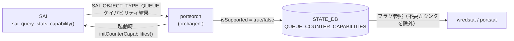

# QUEUE_COUNTER_CAPABILITIES (STATE_DB)

## 概要

`STATE_DB` の `QUEUE_COUNTER_CAPABILITIES` テーブルは、`sonic-swss` の `portsorch` が orchagent 起動時に [SAI](../../reference/glossary.md#term-sai) ケイパビリティクエリ（`sai_query_stats_capability`）を実行した結果を書き込む読み取り専用テーブルである[^1]。

書き込まれるフィールドは WRED/ECN キューカウンタ 4 種のサポート可否フラグ（`isSupported: "true"/"false"`）のみ。`wredstat` スクリプトおよび `portstat.py` がこのフラグを参照して、未サポートの ASIC では COUNTERS_DB から対応フィールドを除外する。

!!! note "CONFIG_DB との関係"
    `QUEUE_COUNTER_CAPABILITIES` は STATE_DB の**読み取り専用**テーブルであり、CONFIG_DB には対応する設定テーブルが存在しない。WRED/ECN カウンタの有効化は `FLEX_COUNTER_TABLE|WRED_ECN_QUEUE` の `FLEX_COUNTER_STATUS` で行うが、ASIC が対応していない場合はフラグが `"false"` のまま残る。

<!-- cdb-mermaid -->
### データフロー



<!-- /cdb-mermaid -->

## key 構造

```text
QUEUE_COUNTER_CAPABILITIES|<capability_name>
```

現在定義されているキー（`portsorch.cpp:1872-1875`）:

| キー | 対応 SAI 統計 |
|------|-------------|
| `WRED_ECN_QUEUE_ECN_MARKED_PKT_COUNTER` | `SAI_QUEUE_STAT_WRED_ECN_MARKED_PACKETS` |
| `WRED_ECN_QUEUE_ECN_MARKED_BYTE_COUNTER` | `SAI_QUEUE_STAT_WRED_ECN_MARKED_BYTES` |
| `WRED_ECN_QUEUE_WRED_DROPPED_PKT_COUNTER` | `SAI_QUEUE_STAT_WRED_DROPPED_PACKETS` |
| `WRED_ECN_QUEUE_WRED_DROPPED_BYTE_COUNTER` | `SAI_QUEUE_STAT_WRED_DROPPED_BYTES` |

## フィールド一覧

各キーに対して 1 フィールドのみ存在する:

| フィールド | 型 | 書込み主体 | デフォルト | 説明 |
|-----------|----|-----------|-----------|------|
| `isSupported` | boolean string | `portsorch` (initCounterCapabilities) | `"false"` | ASIC が当該 WRED/ECN カウンタをサポートする場合 `"true"`、未サポートの場合 `"false"` |

## 書き込みロジック詳細

`portsorch.cpp:1850-1918` の `initCounterCapabilities()` が `switchId` を引数に起動直後 1 回だけ呼ばれる:

1. **初期化フェーズ**: 4 つの全キーに `isSupported = "false"` を書き込む（デフォルト）
2. **SAI クエリフェーズ**: `sai_query_stats_capability(switchId, SAI_OBJECT_TYPE_QUEUE, &queue_stats_capability)` を実行
3. **更新フェーズ**: クエリが `SAI_STATUS_SUCCESS` を返した場合のみ、対応する統計を含む行があれば `isSupported = "true"` に上書き
4. **失敗時**: `SAI_STATUS_SUCCESS` 以外（`SAI_STATUS_BUFFER_OVERFLOW` リトライ失敗含む）では全フラグが `"false"` のまま

```cpp
// portsorch.cpp:1871-1913
m_queueCounterCapabilitiesTable->set("WRED_ECN_QUEUE_ECN_MARKED_PKT_COUNTER",  fieldValuesFalse);
m_queueCounterCapabilitiesTable->set("WRED_ECN_QUEUE_ECN_MARKED_BYTE_COUNTER", fieldValuesFalse);
m_queueCounterCapabilitiesTable->set("WRED_ECN_QUEUE_WRED_DROPPED_PKT_COUNTER",  fieldValuesFalse);
m_queueCounterCapabilitiesTable->set("WRED_ECN_QUEUE_WRED_DROPPED_BYTE_COUNTER", fieldValuesFalse);

// ... sai_query_stats_capability() ...

if (SAI_QUEUE_STAT_WRED_ECN_MARKED_PACKETS == queue_stats_capability.list[it].stat_enum)
    m_queueCounterCapabilitiesTable->set("WRED_ECN_QUEUE_ECN_MARKED_PKT_COUNTER", fieldValuesTrue);
// ... (4 統計すべて同様)
```

## 消費者 (consumer)

| プロセス | 参照方法 | 用途 |
|---------|---------|------|
| `sonic-utilities/utilities_common/portstat.py` | `STATE_DB QUEUE_COUNTER_CAPABILITIES|...` の `isSupported` フィールドを直接 GET | portstat が COUNTERS_DB から取得するカウンタ列を絞り込む |
| `sonic-utilities/scripts/wredstat` | `state_db.connect(STATE_DB)` 後に参照 | wredstat が N/A 表示 vs 実値表示を制御 |
| `sonic-utilities/counterpoll/main.py` | 間接的（FLEX_COUNTER_TABLE|WRED_ECN_QUEUE 経由） | counterpoll show で `WRED_ECN_QUEUE_STAT` 行を表示 |

<!-- defaults -->
## フィールド暗黙デフォルト (Phase A — コード由来)

YANG schema は存在しない。すべてのデフォルトは `portsorch.cpp` のコードに由来する。

| フィールド / キー | コード由来デフォルト | fallback 源 |
|-----------------|-------------------|------------|
| `WRED_ECN_QUEUE_ECN_MARKED_PKT_COUNTER.isSupported` | `"false"` | `portsorch.cpp:1872` — `initCounterCapabilities()` が set 前に必ず `"false"` で初期化 |
| `WRED_ECN_QUEUE_ECN_MARKED_BYTE_COUNTER.isSupported` | `"false"` | `portsorch.cpp:1873` — 同上 |
| `WRED_ECN_QUEUE_WRED_DROPPED_PKT_COUNTER.isSupported` | `"false"` | `portsorch.cpp:1874` — 同上 |
| `WRED_ECN_QUEUE_WRED_DROPPED_BYTE_COUNTER.isSupported` | `"false"` | `portsorch.cpp:1875` — 同上 |

### 補足

- **全デフォルトは `"false"`**: ASIC が WRED/ECN 統計をまったくサポートしない環境では、4 フィールド全てが `"false"` のままとなる。`wredstat` は N/A を表示し、counterpoll の WRED_ECN_QUEUE を `enable` にしても COUNTERS_DB に対応フィールドが現れない（silent non-addition）。
- **orchagent 再起動でリセット**: `initCounterCapabilities()` は起動のたびに実行される。ただし `sai_query_stats_capability()` の結果が一貫しているため、再起動ごとに同じフラグが書き込まれる。
- **部分サポートあり**: ECN マーキングのみサポートし WRED ドロップはサポートしない ASIC の場合、`WRED_ECN_QUEUE_ECN_MARKED_PKT_COUNTER` / `WRED_ECN_QUEUE_ECN_MARKED_BYTE_COUNTER` のみ `"true"` となる（独立したフラグ）。
- **`PORT_COUNTER_CAPABILITIES` との対称性**: 同じ `initCounterCapabilities()` 内でポート側の `PORT_COUNTER_CAPABILITIES` テーブルも同様のパターンで書き込まれる。ポート側は `SAI_OBJECT_TYPE_PORT` でクエリする。

<!-- /defaults -->

<!-- cdb-exceptions -->
## 例外条件・特殊挙動

| 条件 | 挙動 |
|------|------|
| `sai_query_stats_capability()` 失敗 | `SWSS_LOG_NOTICE("Queue stat capability get failed: ...")` を出力し、4 フィールド全て `"false"` のまま |
| SAI が `SAI_STATUS_BUFFER_OVERFLOW` を返す | `queue_stats_capability.list` をリサイズして再クエリ。再クエリも失敗した場合は上記と同じ |
| orchagent 起動前に `wredstat` を実行 | STATE_DB に当該キーが存在しないため、`state_db.get()` が `None` を返す。wredstat は WRED カウンタを N/A 扱いする |
| FLEX_COUNTER_TABLE|WRED_ECN_QUEUE が `disable` | `QUEUE_COUNTER_CAPABILITIES` の `isSupported` には影響しない（SAI ケイパビリティフラグは FLEX_COUNTER 設定と独立） |

<!-- /cdb-exceptions -->

## 関連リファレンス

- CONFIG_DB: [`FLEX_COUNTER_TABLE`](flex-counter-table.md) — WRED_ECN_QUEUE グループの enable/disable 設定
- CONFIG_DB: [`QUEUE`](queue.md) — egress queue ごとの SCHEDULER / WRED_PROFILE 割り当て
- CONFIG_DB: [`BUFFER_QUEUE`](buffer-queue.md) — バッファキュー割り当て
- COUNTERS_DB: [`counters-queue`](counters-queue.md) — Queue/PG カウンタテーブル群の詳細

<!-- ref-triangle:start -->

## 関連リファレンス

- CONFIG_DB: [`FLEX_COUNTER_TABLE`](flex-counter-table.md)
- CONFIG_DB: [`QUEUE`](queue.md)

<!-- ref-triangle:end -->

## 引用元

[^1]: `sonic-swss/orchagent/portsorch.cpp:1850-1918` — `initCounterCapabilities()` 実装。SAI ケイパビリティクエリと STATE_DB への書き込みロジック。`sonic-swss-common/common/schema.h:528` — `STATE_QUEUE_COUNTER_CAPABILITIES_NAME "QUEUE_COUNTER_CAPABILITIES"` 定義。<https://github.com/sonic-net/sonic-swss/blob/master/orchagent/portsorch.cpp>

<!-- ops-hint -->
## 運用ヒント

### STATE_DB 確認コマンド

```bash
# WRED/ECN キューカウンタのサポート状況を確認
sonic-db-cli STATE_DB keys 'QUEUE_COUNTER_CAPABILITIES|*'
sonic-db-cli STATE_DB hgetall 'QUEUE_COUNTER_CAPABILITIES|WRED_ECN_QUEUE_ECN_MARKED_PKT_COUNTER'
sonic-db-cli STATE_DB hgetall 'QUEUE_COUNTER_CAPABILITIES|WRED_ECN_QUEUE_WRED_DROPPED_PKT_COUNTER'

# 4 フィールド一括確認（bash ループ）
for key in WRED_ECN_QUEUE_ECN_MARKED_PKT_COUNTER WRED_ECN_QUEUE_ECN_MARKED_BYTE_COUNTER \
           WRED_ECN_QUEUE_WRED_DROPPED_PKT_COUNTER WRED_ECN_QUEUE_WRED_DROPPED_BYTE_COUNTER; do
    echo -n "$key: "
    sonic-db-cli STATE_DB hget "QUEUE_COUNTER_CAPABILITIES|$key" isSupported
done

# WRED 統計を表示（isSupported が true の場合のみ実値が表示される）
wredstat
```

### よくある確認ポイント

- `isSupported` が `"false"` のまま `wredstat` を実行しても N/A 表示になる。これは正常動作（ASIC が WRED を SAI でサポートしていない）
- `counterpoll wred-queue enable` 後も wredstat が N/A の場合、この `QUEUE_COUNTER_CAPABILITIES` テーブルのフラグを確認する
- `"true"` になっているのに wredstat が N/A の場合は FLEX_COUNTER_TABLE|WRED_ECN_QUEUE の STATUS を確認する

<!-- /ops-hint -->
