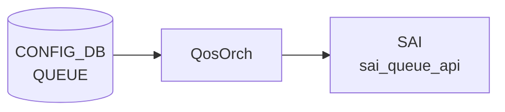

# QUEUE テーブル

## 概要

ポートの egress queue ごとに `SCHEDULER` ([WRR](../../reference/glossary.md#term-wrr)/[DWRR](../../reference/glossary.md#term-dwrr)/STRICT) と `WRED_PROFILE` を割り当てる[^1]。`qosorch` が [SAI](../../reference/glossary.md#term-sai) queue scheduler / [WRED](../../reference/glossary.md#term-wred) を設定する。[VOQ](../../reference/glossary.md#term-voq) シャーシでは `QUEUE_LIST` ではなく `VOQ_QUEUE_LIST` を使う。

<!-- cdb-mermaid -->
### データフロー (自動生成)



!!! note "凡例"
    CONFIG_DB から SAI までの典型経路を `docs/reference/config-db-orch-map.md` から機械生成したミニ図。詳細・例外は本ページ本文と対応表を参照。
<!-- /cdb-mermaid -->

## key 構造

非 [VOQ](../../reference/glossary.md#term-voq):
```text
QUEUE|<ifname>|<qindex>
```

[VOQ](../../reference/glossary.md#term-voq) chassis:
```text
QUEUE|<hostname>|<asic_name>|<ifname>|<qindex>
```

`<ifname>` は `PORT.name` への leafref または文字列 `CPU`。`<qindex>` はプラットフォーム依存（物理 0-7、CPU 0-48 等）、範囲表現も可。

## フィールド一覧 (非 VOQ: `QUEUE_LIST`)

| フィールド | 型 | 必須 | 説明 |
|-----------|----|------|------|
| `ifname` (key) | leafref `PORT.name` または `CPU` | ✅ | IF 名 |
| `qindex` (key) | string | ✅ | Q-index または範囲 |
| `scheduler` | leafref `SCHEDULER.name` | - | スケジューラ参照 |
| `wred_profile` | leafref `WRED_PROFILE.name` | - | [WRED](../../reference/glossary.md#term-wred) プロファイル参照 |

`when` 条件: `switch_type` が `voq` でないか未指定。

## フィールド一覧 (VOQ: `VOQ_QUEUE_LIST`)

| フィールド | 型 | 必須 | 説明 |
|-----------|----|------|------|
| `hostname` (key) | `hostname` | ✅ | シャーシホスト名 |
| `asic_name` (key) | `asic_name` | ✅ | [ASIC](../../reference/glossary.md#term-asic) 名 |
| `ifname` (key) | string (1..128) | ✅ | IF 名 |
| `qindex` (key) | string | ✅ | Q-index |
| `scheduler` | leafref `SCHEDULER.name` | - | スケジューラ |
| `wred_profile` | leafref `WRED_PROFILE.name` | - | [WRED](../../reference/glossary.md#term-wred) プロファイル |

`when` 条件: `switch_type = voq`。

## 購読者

- `qosorch`: [SAI](../../reference/glossary.md#term-sai) queue scheduler / WRED を生成
- `bufferorch` と協調

## 関連 CONFIG_DB / YANG / CLI

- 関連 [CONFIG_DB](../../reference/glossary.md#term-config_db): `SCHEDULER`、`WRED_PROFILE`、`PORT`、`BUFFER_QUEUE`、`TC_TO_QUEUE_MAP`
- 関連 CLI: なし（`config_db.json` ロード）
- 関連 [YANG](../../reference/glossary.md#term-yang): `sonic-queue`

<!-- ref-triangle:start -->

## 関連リファレンス

- [YANG](../../reference/glossary.md#term-yang): [`sonic-queue`](../yang/sonic-queue.md)

<!-- ref-triangle:end -->

## 引用元

[^1]: [YANG](../../reference/glossary.md#term-yang) 定義: `sonic-queue.yang`. <https://github.com/sonic-net/sonic-buildimage/blob/9ea932ec2e18f35e58268ec2e4456b1d4afd65cd/src/sonic-yang-models/yang-models/sonic-queue.yang>

<!-- topics-back-ref -->
## 関連 Topics

- [Topics: QoS / Buffer / PFC / Watermark](../../topics/08-qos-buffer/index.md)

<!-- /topics-back-ref -->

<!-- ops-hint -->
## 運用ヒント

### 典型値

- key 形式: `QUEUE|<port>|<queue-range>` (例 `QUEUE|Ethernet0|3-4`)。
- `scheduler`: `scheduler.0` 等。
- `wred_profile`: `AZURE_LOSSY` 等。

### よくある誤設定

- [PFC](../../reference/glossary.md#term-pfc) 対応 queue に `wred_profile` を当てて [ECN](../../reference/glossary.md#term-ecn) を有効にしないと、輻輳時に [PFC](../../reference/glossary.md#term-pfc) が連続発火する。

### 確認コマンド

```bash
sonic-db-cli CONFIG_DB keys 'QUEUE|Ethernet0|*'
show queue counters
```
<!-- /ops-hint -->

<!-- value-behavior -->
## 値依存挙動マトリクス

### `ifname` 値別挙動
| 値 | 挙動 |
|----|------|
| `PORT.name` に存在する値 | 正常処理。[SAI](../../reference/glossary.md#term-sai) queue scheduler / WRED 適用。 |
| `CPU` | CPU queue 用の専用処理パス。 |
| 存在しないポート名 | `SWSS_LOG_ERROR("Port with alias:%s not found")` → `task_invalid_entry` でスキップ。 |

### `scheduler` フィールド挙動
| 状態 | 挙動 |
|------|------|
| 省略 | スケジューラなし。[ASIC](../../reference/glossary.md#term-asic) デフォルト動作。 |
| 存在する SCHEDULER 名 | `qosorch` が SAI scheduler を queue に適用。 |
| 存在しない SCHEDULER 名 | `task_need_retry`（後で再試行）。解決不可なら `task_failed`。 |

### `wred_profile` フィールド挙動
| 状態 | 挙動 |
|------|------|
| 省略 | WRED なし。 |
| 存在する WRED_PROFILE 名 | SAI WRED を queue に適用。 |
| 存在しない WRED_PROFILE 名 | `task_need_retry`。解決不可なら `task_failed`。 |

<!-- /value-behavior -->

<!-- cdb-exceptions -->
## 例外条件・特殊挙動

- **key トークン数不正**: 非 VOQ 環境では `<ifname>|<qindex>` の 2 トークン必須。VOQ 環境では `<hostname>|<asic_name>|<ifname>|<qindex>` の 4 トークン必須。違反時は `task_invalid_entry` で処理中断。[^2]
- **queue index 範囲外**: `<qindex>` が SAI の queue 数を超えた場合 `SWSS_LOG_ERROR("Invalid queue index specified")` でエントリがスキップされる。[^2]
- **SCHEDULER 参照未解決 (リトライ)**: `scheduler` フィールドの参照先 SCHEDULER エントリがまだ存在しない場合は `task_need_retry` で後で再試行される。解決できない恒久エラーの場合は `task_failed`。[^2]
- **WRED_PROFILE 参照未解決 (リトライ)**: `wred_profile` も同様に未解決なら `task_need_retry`、恒久エラーは `task_failed`。[^2]
- **port 未検出**: `<ifname>` が PORT テーブルに存在しない場合 `SWSS_LOG_ERROR("Port with alias:%s not found")` でスキップ。[^2]
- **scheduler group 未検出**: ポートは存在しても queue index に対応する SAI scheduler group が見つからない場合 `task_failed`。[^2]

[^2]: qosorch 実装: `sonic-swss/orchagent/qosorch.cpp`. <https://github.com/sonic-net/sonic-swss/blob/master/orchagent/qosorch.cpp>

<!-- derivation -->
## 派生・条件付き登録 (Phase 6/7)

### Phase 6: 自動派生

QosOrch が `QUEUE.wred_profile` / `QUEUE.scheduler` フィールドを参照して各テーブルの OID を解決し、SAI キューオブジェクトに bind する。参照先テーブルが未作成の場合は設定がペンディング状態になる（待機派生）。

### Phase 7: 条件付き登録 (add_manager 条件)

QosOrch は常時登録し `QUEUE` テーブルを無条件購読する。ただし `SCHEDULER` / `WRED_PROFILE` が未作成の場合は対応 OID が未解決でペンディングとなる。port が未初期化の場合はエラーログ + スキップ。

<!-- /derivation -->

<!-- handler-branching -->
### Phase 8: Handler メソッド内分岐

| Handler | 分岐条件 | 効果 | evidence |
|---|---|---|---|
| `QosOrch` | `wred_profile` フィールドあり | `WRED_PROFILE` OID 参照 → `SAI_QUEUE_ATTR_WRED_PROFILE_ID` 設定 | `qosorch.cpp` |
| `QosOrch` | `scheduler` フィールドあり | `SCHEDULER` OID 参照 → `SAI_QUEUE_ATTR_SCHEDULER_PROFILE_ID` 設定 | `qosorch.cpp` |
| `QosOrch` | port のキュー番号が範囲外 | ERROR ログ + スキップ | `qosorch.cpp` |
| `QosOrch` | del_handler: `wred_profile` あり | SAI attribute を NULL OID に設定して解除 | `qosorch.cpp` |

> **スキャン証跡**: QUEUE は SAI キューオブジェクトの属性 (scheduler, wred_profile) を束ねる。Phase 6 派生はフィールドから OID 解決への変換。自動付与はなし。

<!-- /handler-branching -->

<!-- runtime-trace -->
## CDB → 実コンテナ動作トレース

### 段階 1: Consumer 登録

- **[orchagent](../../reference/glossary.md#term-orchagent) / QosOrch** (`sonic-swss/orchagent/qosorch.cpp`): `QUEUE` テーブルを `SubscriberStateTable` で購読。

### 段階 2: CFG → APPL 翻訳

- QosOrch がキューのスケジューラマップ (`scheduler`) と WRED プロファイル (`wred_profile`) を解析。
- APP_DB への書き込みなし。

### 段階 3: APPL → SAI

- QosOrch が `sai_scheduler_api` / `sai_wred_api` を呼び出し、キュー OID に対してスケジューラと WRED を適用。

### 段階 4: タイミング + 副作用

- 参照するスケジューラ/WRED が未作成の場合は `task_need_retry`。
- 副作用: キューの WRED 変更は既存フロー中のパケットからリアルタイムに適用される。

<!-- /runtime-trace -->

<!-- pubsub -->
## 通信メカニズム (Phase G)

### Producer/Consumer ペア

QUEUE テーブルは [CONFIG_DB](../../reference/glossary.md#term-config_db) → SAI の **直接経路**をとる。[APPL_DB](../../reference/glossary.md#term-appl_db) への中継は行わない。

| 区間 | 方式 | チャンネル/パターン |
|------|------|--------------------|
| [CONFIG_DB](../../reference/glossary.md#term-config_db) → QosOrch | `SubscriberStateTable` | `__keyspace@{config_db_id}__:QUEUE\|*` |
| QosOrch → SAI | SAI API 直接呼び出し | `sai_scheduler_group_api` / `sai_queue_api` |

### SubscriberStateTable の動作

`QosOrch` は `Orch(db, tableNames)` 基底クラスの `addConsumer()` を通じて `CFG_QUEUE_TABLE_NAME` に対する `SubscriberStateTable` を生成する (`orch.cpp:1188-1190`)。CONFIG_DB の keyspace notification (`PSUBSCRIBE __keyspace@db__:QUEUE|*`) でエントリの変化を検出し、`pops()` で現在値を読み出す。初回起動時は `getKeys()` で既存エントリを先読みし、起動前の設定を取りこぼさない。

### select() ループと doTask 実行順序

orchdaemon は `Select::select()` を 1000 ms タイムアウトで実行する。イベント受信時は `Consumer::drain()` → `QosOrch::doTask(Consumer&)` が呼ばれる。

`QosOrch::doTask()` (`qosorch.cpp:2231`) はカスタム実行順序を実装する:

1. `SCHEDULER` / `WRED_PROFILE` などの参照先テーブルを先に drain
2. `PORT_QOS_MAP` を drain
3. 最後に `QUEUE` を drain（参照先が揃った状態で実行し `task_need_retry` を最小化）

`doTask(Consumer&)` の冒頭では `gPortsOrch->allPortsReady()` チェックがあり、全ポート初期化完了まで処理を保留する。

### retry メカニズム

`scheduler` / `wred_profile` の参照先が未登録の場合は `task_need_retry` を返し、エントリは `m_toSync` に残留する。参照先テーブルの登録イベントが来ると doTask の実行順序制御により直ちに再試行される。解決不可な恒久エラーは `task_failed` で silent drop となる。

### データフロー図

```
CONFIG_DB[QUEUE|<port>|<qindex>]
  ↓ SubscriberStateTable (keyspace notification)
  ↓ PSUBSCRIBE __keyspace@config_db_id__:QUEUE|*
orchdaemon select() loop (SELECT_TIMEOUT=1000ms)
  ↓ Consumer::drain() → QosOrch::doTask()
  ↓   [allPortsReady() チェック]
  ↓   [実行順序: 参照先テーブル → PORT_QOS_MAP → QUEUE]
  ↓ handleQueueTable()
    ↓ applySchedulerToQueueSchedulerGroup()
    ↓   → sai_scheduler_group_api
    ↓     SAI_SCHEDULER_GROUP_ATTR_SCHEDULER_PROFILE_ID
    ↓ applyWredProfileToQueue()
    ↓   → sai_queue_api
    ↓     SAI_QUEUE_ATTR_WRED_PROFILE_ID
ASIC (sairedis → ASIC_DB 経由)

APPL_DB 書き込み: なし
STATE_DB 書き込み: なし
NotificationConsumer: なし
```

<!-- /pubsub -->

<!-- entry-points -->
## 書き込み入り口 (Direction A)

QUEUE テーブルへの書き込みが発生するコード経路を網羅的に調査した結果。

### CLI

  - `config qos reload` — [sonic-cfggen](../../reference/glossary.md#term-sonic-cfggen) が `files/build_templates/qos_config.j2` を展開し QUEUE エントリを生成 ([sonic-buildimage](../../reference/glossary.md#term-sonic-buildimage)/files/build_templates/qos_config.j2)

### minigraph / sonic-cfggen

minigraph.py に QUEUE 直接生成なし — `qos_config.j2` テンプレート経由

### REST / gNMI

REST/[gNMI](../../reference/glossary.md#term-gnmi) 書き込み経路なし

### db_migrator

**db_migrator.py** が QUEUE テーブルのマイグレーション処理を実装 ([sonic-utilities](../../reference/glossary.md#term-sonic-utilities)/scripts/db_migrator.py)

### ビルド時デフォルト (build-time default)

各プラットフォームの `qos.json.j2` に QUEUE エントリが定義され、ビルド時に投入

### ハードコードデフォルト / ランタイム注入

なし

### 死活・デッドコード

なし
<!-- /entry-points -->

<!-- defaults -->
## コード由来の暗黙デフォルト (Phase A)

| フィールド | 省略/未設定時の実装動作 | コードロケーション |
|-----------|----------------------|------------------|
| `scheduler` | SAI scheduler group に何も設定しない (no-op)。[ASIC](../../reference/glossary.md#term-asic) 実装依存のデフォルト動作。 | `qosorch.cpp` `handleQueueTable` `donotChangeScheduler=true` |
| `wred_profile` | SAI `WRED_PROFILE_ID` 未設定。実質 tail-drop (WRED なし)。 | `qosorch.cpp` `donotChangeWredProfile=true` |
| `scheduler` (後から削除) | `SAI_SCHEDULER_GROUP_ATTR_SCHEDULER_PROFILE_ID` を NULL OID に更新しスケジューラ解除。 | `qosorch.cpp` SET 時フィールド消去パス |
| `wred_profile` (後から削除) | `SAI_QUEUE_ATTR_WRED_PROFILE_ID` を NULL OID に更新し WRED 解除。 | `qosorch.cpp` SET 時フィールド消去パス |
| `qindex` 範囲 (`X-Y`) | range_low < range_high を強制。同値 `X-X` は `parseIndexRange` 失敗 → `task_invalid_entry`。 | `orch.cpp` `parseIndexRange` |
| `qindex` 超過 | port の queue 数を超えると `task_failed` (silent drop)。 | `qosorch.cpp` `applySchedulerToQueueSchedulerGroup` |
| VOQ remote port の `scheduler` | no-op (即 `true` 返却)。リモートシステムポートには適用なし。 | `qosorch.cpp` `applySchedulerToQueueSchedulerGroup` VOQ 分岐 |
| ビルド時 queue 割当 (標準) | q3/q4: `scheduler.1` + `AZURE_LOSSLESS`; q0/q1/q2/q5: `scheduler.0` のみ | `qos_config.j2` |
| ビルド時 queue 割当 (DPC ポート) | q3/q4 も `scheduler.0` に格下げ (lossless なし) | `qos_config.j2` DPC 分岐 |

### 書込み順依存

- `scheduler` / `wred_profile` の参照先テーブル (`SCHEDULER`, `WRED_PROFILE`) が先行して存在しない場合は `task_need_retry` で処理がペンディング。参照先登録後に自動再処理される。
- `db_migrator` が旧 ABNF 形式 (`scheduler|scheduler.0`) を除去する前は参照解決に失敗し続ける。バージョン移行直後に注意。

### 既知 YANG-実装 discrepancy

- `qindex` の YANG 型は `string` (無制限)。実装の `parseIndexRange` は整数または `X-Y` (`X < Y`) のみ受け付ける。YANG バリデーションでは弾かれないが [orchagent](../../reference/glossary.md#term-orchagent) が `task_invalid_entry` で捨てる。
- Phase 8 コメントに記載の `dscp_to_tc_map` フィールドは QUEUE テーブルには存在しない。PORT_QOS_MAP テーブルのフィールドであり誤記。

<!-- /defaults -->

<!-- failure -->
## 失敗挙動・retry / recovery (Phase D)

<!-- evidence: meta/_intermediate/cdb-flow/queue-failure.md -->

### retry パターン概要

QUEUE テーブルの SET 処理は `QosOrch::handleQueueTable()` が `task_process_status` を返し、`Consumer` ベースのタスクキュー (`m_toSync`) で管理される。

| パターン | 代表的なトリガー | 挙動 |
|---|---|---|
| **`task_need_retry`** | `scheduler` / `wred_profile` の参照先エントリ未作成 | `m_toSync` に残し次 doTask() で再試行。上限なし |
| **`task_invalid_entry`** | key トークン数不正、`qindex` パース失敗、存在しないポート名、unknown op | エントリ削除。retry なし |
| **`task_failed`** | queue index 超過、scheduler group 未検出、SAI 設定失敗、参照解決の内部エラー | エントリ削除。retry なし |

### フィールド別 failure 詳細

#### key トークン数不正

非 VOQ で 2 トークン、VOQ で 4 トークンでない場合: `SWSS_LOG_ERROR "malformed key: ... Must contain N tokens"` → `task_invalid_entry`。(`qosorch.cpp:1772-1811`)

#### `qindex` パース失敗

整数または `X-Y` (`X < Y`) 以外の文字列: `SWSS_LOG_ERROR "Failed to parse range: ..."` → `task_invalid_entry`。YANG 型は `string` のため YANG レベルでは弾かれない。(`qosorch.cpp:1781-1811`, `orch.cpp:parseIndexRange`)

#### `scheduler` 参照未解決

- SCHEDULER エントリ未作成 (`not_resolved`): `SWSS_LOG_INFO "Missing or invalid scheduler reference"` → `task_need_retry`。SCHEDULER 登録後に自動再試行。(`qosorch.cpp:1822-1854`)
- 内部エラー: `SWSS_LOG_ERROR "Resolving scheduler reference failed"` → `task_failed`。

#### `wred_profile` 参照未解決

`scheduler` と同一パターン。`SWSS_LOG_INFO "Missing or invalid wred profile reference"` → `task_need_retry`。WRED_PROFILE 登録後に自動再試行。(`qosorch.cpp:1856-1887`)

#### 存在しないポート名

`SWSS_LOG_ERROR "Port with alias: ... not found"` → `task_invalid_entry`。(`qosorch.cpp:1911-1915`)

#### queue index 超過

`port.m_queue_ids.size() <= queue_ind`: `SWSS_LOG_ERROR "Invalid queue index specified: N"` → `false` → `task_failed`。(`qosorch.cpp:1670-1674`, `1727-1731`, `1926-1929`)

#### scheduler group 未検出

`getSchedulerGroup()` が `SAI_NULL_OBJECT_ID` を返す: `SWSS_LOG_ERROR "Failed to find a scheduler group for port: X queue: N"` → `false` → `task_failed`。(`qosorch.cpp:1658-1663`, `1677-1682`)

#### SAI 設定失敗

- `sai_scheduler_group_api->set_scheduler_group_attribute` 失敗: `SWSS_LOG_ERROR "Failed applying scheduler profile: ... to scheduler group: ..., port: ..."` → `handleSaiSetStatus()` 経由で `task_need_retry` / `task_failed`。(`qosorch.cpp:1692-1700`)
- `sai_queue_api->set_queue_attribute` 失敗: `SWSS_LOG_ERROR "Failed to set queue attribute: N"` → 同経路。(`qosorch.cpp:1737-1745`)

### 部分適用の注意

`scheduler` と `wred_profile` は独立して適用される (`qosorch.cpp:1922-1944`)。`scheduler` 適用成功後に `wred_profile` で `task_failed` が返ると、scheduler は SAI 書き込み済みのまま rollback されない。range 指定 (`X-Y`) の途中 index での失敗も同様に部分適用が残る。QosOrch は [STATE_DB](../../reference/glossary.md#term-state_db) / ERROR_TABLE への失敗記録を行わないため、反映状況の確認は `sonic-db-cli ASIC_DB hgetall` が必要。

<!-- /failure -->

<!-- ordering -->
## 書込み順依存 (Phase B)

> 調査証跡: `meta/_intermediate/cdb-flow/queue-ordering.md`

### SET 時の先行必須テーブル

| 先行テーブル | 理由 | ソース |
|---|---|---|
| `PORT` (PortInitDone 済み) | `handleQueueTable` が `gPortsOrch->getPort()` でポート存在を確認。未存在時は `task_invalid_entry`（リトライなし、恒久スキップ） | `qosorch.cpp:1911-1914` |
| `SCHEDULER` (`scheduler` フィールドがある場合) | `resolveFieldRefValue` で SCHEDULER OID を参照。未解決なら `task_need_retry`（自動リトライ） | `qosorch.cpp:1822-1835` |
| `WRED_PROFILE` (`wred_profile` フィールドがある場合) | `resolveFieldRefValue` で WRED_PROFILE OID を参照。未解決なら `task_need_retry`（自動リトライ） | `qosorch.cpp:1857-1870` |

!!! warning "PORT 未初期化は恒久スキップ"
    `PORT` が PortInitDone 済みでない状態で QUEUE エントリを書いても `task_invalid_entry` となり
    リトライキューに残らない。必ず `portsyncd` が PortInitDone を発行した後に投入すること。

### フィールド解決順序

`handleQueueTable` は `scheduler` → `wred_profile` の順に `resolveFieldRefValue` を呼び出す。
`scheduler` が未解決の段階で `task_need_retry` を返すため、**SCHEDULER が未解決の間は
WRED_PROFILE の確認・適用も保留される**。

### SAI queue bind 順序

フィールド解決後、各 queue index に対して以下の順で SAI 呼び出しが行われる（`qosorch.cpp:1920-1944`）:

1. **`applySchedulerToQueueSchedulerGroup()`** — `SAI_SCHEDULER_GROUP_ATTR_SCHEDULER_PROFILE_ID` を scheduler group に設定
2. **`applyWredProfileToQueue()`** — `SAI_QUEUE_ATTR_WRED_PROFILE_ID` を queue オブジェクトに設定

`scheduler` と `wred_profile` は独立した SAI オブジェクト（scheduler group / queue）に別々に bind される。
`scheduler` の SAI 書き込みが成功した後に `wred_profile` が失敗した場合、scheduler は SAI に残ったまま rollback されない（部分適用）。

### VOQ 4-token key の順序制約

VOQ シャーシ (`gMySwitchType == "voq"`) では key は 4 トークン必須（`qosorch.cpp:1772-1799`）:

```
QUEUE|<hostname>|<asic_name>|<ifname>|<qindex>
```

`handleQueueTable` は token[0]==`gMyHostName` かつ token[1]==`gMyAsicName`（大文字小文字無視）の場合のみ `local_port = true` としてローカルポートとして処理する。それ以外はリモートシステムポート扱いで `applySchedulerToQueueSchedulerGroup` の VOQ 分岐が `return true` (no-op) を返す。

**VOQ 環境での投入要件**: `hostname` と `asic_name` が自 ASIC と一致するエントリのみ scheduler 適用が実行される。リモートポートへの scheduler 適用は意図的にスキップされる。

### bufferorch との関係 (BUFFER_QUEUE)

`bufferorch` は `BUFFER_QUEUE` テーブル ([APPL_DB](../../reference/glossary.md#term-appl_db)) を購読し、`SAI_QUEUE_ATTR_BUFFER_PROFILE_ID` を設定する。これは `qosorch` の QUEUE テーブル処理とは独立した経路だが、同一 queue OID を共有する:

| orch | テーブル | SAI 属性 | 先行必須 |
|------|---------|---------|---------|
| `qosorch` | `QUEUE` (CONFIG_DB) | `SAI_SCHEDULER_GROUP_ATTR_SCHEDULER_PROFILE_ID` / `SAI_QUEUE_ATTR_WRED_PROFILE_ID` | PORT, SCHEDULER, WRED_PROFILE |
| `bufferorch` | `BUFFER_QUEUE` ([APPL_DB](../../reference/glossary.md#term-appl_db)) | `SAI_QUEUE_ATTR_BUFFER_PROFILE_ID` | PORT, BUFFER_PROFILE |

`bufferorch.processQueue()` も VOQ 4-token key を同じロジックで処理する（`bufferorch.cpp:920-944`）。BUFFER_PROFILE が未解決の場合は `task_need_retry`。

### DEL 時の順序制約

DEL ハンドラは参照先（SCHEDULER / WRED_PROFILE）の存在チェックを行わず、SAI attribute を
NULL OID に無条件設定して解除する。QUEUE DEL の前後に SCHEDULER / WRED_PROFILE を削除しても
問題は生じない（逆参照エラーなし）。

### 起動時シーケンス

```
portsyncd → PortConfigDone → PortInitDone
  ↓
allPortsReady() = true → QosOrch アンブロック
  ↓
SCHEDULER / WRED_PROFILE エントリが CONFIG_DB に存在
  ↓
QUEUE エントリを投入
  ↓ resolveFieldRefValue: scheduler → wred_profile の順に OID 解決
  ↓ for each port_name / queue_ind:
      applySchedulerToQueueSchedulerGroup() → SAI_SCHEDULER_GROUP_ATTR_SCHEDULER_PROFILE_ID
      applyWredProfileToQueue()             → SAI_QUEUE_ATTR_WRED_PROFILE_ID
```

実運用では `config qos reload` が `qos_config.j2` テンプレートから
SCHEDULER / WRED_PROFILE / QUEUE を一括生成するため、順序は [sonic-cfggen](../../reference/glossary.md#term-sonic-cfggen) が暗黙に担保する。

<!-- /ordering -->

<!-- platform -->
## プラットフォーム / SAI Capability 差異 (Phase H)

<!-- evidence: meta/_intermediate/cdb-flow/queue-platform.md -->

### VoQ シャーシ vs 非 VoQ — 処理パスの違い

`gMySwitchType == "voq"` で scheduler 適用と [WRED](../../reference/glossary.md#term-wred) 適用の両方が独立した実装パスに分岐する。

#### key トークン数

| モード | key 形式 | トークン数 |
|--------|----------|-----------|
| 非 [VOQ](../../reference/glossary.md#term-voq) | `<ifname>\|<qindex>` | 2 |
| [VOQ](../../reference/glossary.md#term-voq) | `<hostname>\|<asic_name>\|<ifname>\|<qindex>` | 4 |

トークン数の不一致は `task_invalid_entry` で即時破棄。

#### リモートシステムポートのスキップ

[VOQ](../../reference/glossary.md#term-voq) 環境では、エントリが **リモートシステムポート** (`SAI_SYSTEM_PORT_TYPE_REMOTE`) に対応する場合、scheduler 適用を skip して即 `true` を返す。ローカルポートのみ [SAI](../../reference/glossary.md#term-sai) scheduler 適用が実行される。

```
qosorch.cpp:applySchedulerToQueueSchedulerGroup
  if (gMySwitchType == "voq")
    if (port.m_system_port_info.type == SAI_SYSTEM_PORT_TYPE_REMOTE)
      return true   // no-op
    → system port から local port を解決してから scheduler 適用
```

#### WRED 適用で使う queue OID

| モード | queue OID の取得元 |
|--------|------------------|
| 非 [VOQ](../../reference/glossary.md#term-voq) | `port.m_queue_ids` (egress queue リスト) |
| [VOQ](../../reference/glossary.md#term-voq) | `getPortVoQIds()` → `SAI_SYSTEM_PORT_ATTR_QOS_VOQ_LIST` から取得した VoQ OID リスト |

[VOQ](../../reference/glossary.md#term-voq) の VoQ 数はプラットフォームの [SAI](../../reference/glossary.md#term-sai) 実装が返す値に依存し、[SONiC](../../reference/glossary.md#term-sonic) 側でハードコードしていない。

---

### vendor SAI — WRED 閾値更新の制約

一部ベンダーの SAI 実装では、WRED の `min_threshold` / `max_threshold` を 1 属性ずつ SET する制約上、中間状態で `min > max` となりサニティチェックが失敗するケースがある。[SONiC](../../reference/glossary.md#term-sonic) は「違反する属性を 2nd half リストに分離して適用順を制御する」ワークアラウンドを実装済み (`qosorch.cpp:595-632`)。

---

### ビルド時 QUEUE デフォルト — プラットフォーム分岐 (`qos_config.j2`)

`config qos reload` / ビルド時 JSON 生成は以下の優先順位で分岐する。

| 優先度 | 条件 | q3/q4 の設定 |
|--------|------|------------|
| 1 | `switch_type = voq` ([VOQ](../../reference/glossary.md#term-voq) シャーシ) | `SYSTEM_PORT_ALL` に `wred_profile=AZURE_LOSSLESS`; `SYSTEM_PORT_ACTIVE` のみ `scheduler=scheduler.1` |
| 2 | SKU カスタム関数 (`generate_direction_based_queue_per_sku` 等) | SKU 定義に委譲 |
| 3a | `resource_type = ComputeAI` | q3: `scheduler.2`+LOSSLESS, q4: `scheduler.3`+LOSSLESS |
| 3b | DPC ポート (`PORT_DPC` 所属) | `scheduler.0` のみ — lossless なし |
| 3c | apollo resource_type | q4: `scheduler.2`+LOSSLESS |
| 3d | 標準 + `port_names_list_extra_queues` | q2/q6 も `scheduler.1`+LOSSLESS |
| 3e | 標準 (それ以外) | q3/q4: `scheduler.1`+LOSSLESS |

DPC (Direct Port Connect) ポートは q3/q4 の lossless 設定を省略する点がビルド時の重要な差異。

<!-- /platform -->

<!-- side-effects -->
## 副次 DB 書込 (Phase F)

> 詳細証跡: `meta/_intermediate/cdb-flow/queue-side-effects.md`

QUEUE テーブルへの SET/DEL が引き起こす、CONFIG_DB 以外の DB への書込みと SAI 呼び出しを示す。

### QUEUE SET — SAI 呼び出し (ASIC_DB)

| 条件 | SAI API / 属性 | 対象 |
|------|--------------|------|
| `scheduler` フィールドあり | `set_scheduler_group_attribute(SAI_SCHEDULER_GROUP_ATTR_SCHEDULER_PROFILE_ID)` | [ASIC_DB](../../reference/glossary.md#term-asic_db) `SAI_OBJECT_TYPE_SCHEDULER_GROUP` |
| `wred_profile` フィールドあり | `set_queue_attribute(SAI_QUEUE_ATTR_WRED_PROFILE_ID)` | [ASIC_DB](../../reference/glossary.md#term-asic_db) `SAI_OBJECT_TYPE_QUEUE` |
| `scheduler` フィールド削除 | 上記属性を NULL OID に更新 | スケジューラ解除 |
| `wred_profile` フィールド削除 | `SAI_QUEUE_ATTR_WRED_PROFILE_ID = OID_NULL` | WRED 解除 |

QosOrch は APPL_DB / [STATE_DB](../../reference/glossary.md#term-state_db) への直接書き込みを行わない。

### ポート作成時 (PORT SET) — COUNTERS_DB Queue マップ群

`generateQueueMapPerPort()` が各ポートの全 queue OID に対して書き込む:

| 対象 DB / テーブル | キー / フィールド | 書込内容 |
|------------------|-----------------|---------|
| [COUNTERS_DB](../../reference/glossary.md#term-counters_db) / `COUNTERS_QUEUE_NAME_MAP` | `""` field=`<alias>:<qindex>` | queue SAI OID |
| [COUNTERS_DB](../../reference/glossary.md#term-counters_db) / `COUNTERS_QUEUE_PORT_MAP` | `""` field=`<queue_oid>` | port SAI OID |
| [COUNTERS_DB](../../reference/glossary.md#term-counters_db) / `COUNTERS_QUEUE_INDEX_MAP` | `""` field=`<queue_oid>` | queue real index |
| COUNTERS_DB / `COUNTERS_QUEUE_TYPE_MAP` | `""` field=`<queue_oid>` | queue type 文字列 (`SAI_QUEUE_TYPE_UNICAST` 等) |

### ポート作成時 — FLEX_COUNTER_DB Queue Counter 登録

| [FlexCounter](../../reference/glossary.md#term-flexcounter) グループ | [FLEX_COUNTER_DB](../../reference/glossary.md#term-flex_counter_db) キー | ポーリング間隔 | 有効化条件 | カウンタ |
|--------------------|-------------------|-------------|---------|---------|
| `QUEUE_STAT_COUNTER` | `QUEUE_STAT_COUNTER:<queue_oid>` | 10,000 ms | `FLEX_COUNTER_TABLE\|QUEUE` enable | PACKETS / BYTES / DROPPED_PACKETS / DROPPED_BYTES / TRIM 系[^3] |
| `QUEUE_WATERMARK_STAT_COUNTER` | `QUEUE_WATERMARK_STAT_COUNTER:<queue_oid>` | 60,000 ms | `FLEX_COUNTER_TABLE\|QUEUE_WATERMARK` enable | `SAI_QUEUE_STAT_SHARED_WATERMARK_BYTES` |
| `WRED_ECN_QUEUE_STAT_COUNTER` | `WRED_ECN_QUEUE_STAT_COUNTER:<queue_oid>` | 10,000 ms | `FLEX_COUNTER_TABLE\|WRED_ECN_QUEUE` enable | WRED_ECN_MARKED / WRED_DROPPED 系[^3] |

VoQ モードでは `SAI_QUEUE_STAT_CREDIT_WD_DELETED_PACKETS` が自動追加される。

### orchagent 起動時 — STATE_DB QUEUE_COUNTER_CAPABILITIES

`initCounterCapabilities()` が起動時 1 回のみ SAI 能力クエリを実行し書き込む:

| [STATE_DB](../../reference/glossary.md#term-state_db) キー | フィールド | デフォルト | SAI 成功時 |
|--------------|---------|---------|-----------|
| `QUEUE_COUNTER_CAPABILITIES\|WRED_ECN_QUEUE_ECN_MARKED_PKT_COUNTER` | `isSupported` | `"false"` | `"true"` |
| `QUEUE_COUNTER_CAPABILITIES\|WRED_ECN_QUEUE_ECN_MARKED_BYTE_COUNTER` | `isSupported` | `"false"` | `"true"` |
| `QUEUE_COUNTER_CAPABILITIES\|WRED_ECN_QUEUE_WRED_DROPPED_PKT_COUNTER` | `isSupported` | `"false"` | `"true"` |
| `QUEUE_COUNTER_CAPABILITIES\|WRED_ECN_QUEUE_WRED_DROPPED_BYTE_COUNTER` | `isSupported` | `"false"` | `"true"` |

### ポート削除時 (PORT DEL) — COUNTERS_DB / FLEX_COUNTER_DB クリーンアップ

| 対象 DB / テーブル | 操作 |
|------------------|------|
| COUNTERS_DB / `COUNTERS_QUEUE_NAME_MAP` | `hdel` (全 queue OID) |
| COUNTERS_DB / `COUNTERS_QUEUE_PORT_MAP` | `hdel` |
| COUNTERS_DB / `COUNTERS_QUEUE_INDEX_MAP` | `hdel` |
| COUNTERS_DB / `COUNTERS_QUEUE_TYPE_MAP` | `hdel` |
| [FLEX_COUNTER_DB](../../reference/glossary.md#term-flex_counter_db) / `QUEUE_STAT_COUNTER:<oid>` | `clearCounterIdList` |
| [FLEX_COUNTER_DB](../../reference/glossary.md#term-flex_counter_db) / `WRED_ECN_QUEUE_STAT_COUNTER:<oid>` | `clearCounterIdList` |

[^3]: カウンタ定義: `sonic-swss/orchagent/portsorch.cpp` L389-435 (`queue_stat_ids`, `queueWatermarkStatIds`, `wred_queue_stat_ids`)

<!-- 証跡: sonic-swss/orchagent/portsorch.cpp, sonic-swss/orchagent/qosorch.cpp, sonic-swss/orchagent/flexcounterorch.cpp -->
<!-- /side-effects -->

<!-- cross-refs -->
## 暗黙参照テーブル (Phase C)

> 証跡: `meta/_intermediate/cdb-flow/queue-cross-refs.md`

YANG leafref に加え、`qosorch.cpp` の実装レベルで依存する他テーブルを示す。

| 参照先テーブル | YANG leafref | 参照種別 | 参照元コード | 非充足時の挙動 |
|---------------|:------------:|---------|------------|--------------|
| `SCHEDULER` | ✅ (`scheduler` フィールド) | 必須: OID 解決 → `SAI_SCHEDULER_GROUP_ATTR_SCHEDULER_PROFILE_ID` 設定 | `qosorch.cpp:1822-1854` | `task_need_retry`。SCHEDULER 登録後に自動再試行。解決不可なら `task_failed` |
| `WRED_PROFILE` | ✅ (`wred_profile` フィールド) | 必須: OID 解決 → `SAI_QUEUE_ATTR_WRED_PROFILE_ID` 設定 | `qosorch.cpp:1857-1887` | `task_need_retry`。WRED_PROFILE 登録後に自動再試行。解決不可なら `task_failed` |
| `PORT` | ✅ (`ifname` key の leafref) | 必須: `gPortsOrch->getPort()` で OID 取得。PortInitDone ゲート | `qosorch.cpp:1911-1914`, `2258` | `task_invalid_entry`（retry なし、恒久スキップ） |
| `PORT_QOS_MAP` | ✗ | 実行順序先行依存: `doTask()` で `PORT_QOS_MAP` を QUEUE より先に drain | `qosorch.cpp:2231-2260` | 直接エラーなし。QUEUE の SAI 適用タイミングに影響 |

### 解決順序の詳細

`handleQueueTable()` は `scheduler` → `wred_profile` の順に `resolveFieldRefValue` を呼び出す。`scheduler` が未解決の段階で `task_need_retry` を返すため、**SCHEDULER が未解決の間は WRED_PROFILE の確認・適用も保留される**。

`doTask()` (L2231) は以下の実行順序を強制する:

1. `SCHEDULER` / `WRED_PROFILE` などの参照先テーブルを先に drain
2. `PORT_QOS_MAP` を drain
3. 最後に `QUEUE` を drain（参照先が揃った状態で実行し `task_need_retry` を最小化）

PORT が PortInitDone 済みでない状態で QUEUE エントリを書いても `task_invalid_entry` となりリトライキューに残らない。必ず `portsyncd` が PortInitDone を発行した後に投入すること。

<!-- /cross-refs -->

<!-- constants -->
## ハードコード定数 (Phase E)

QUEUE テーブル処理でコード内に固定された定数の一覧。`scheduler` / `wred_profile` 以外のフィールドは存在せず、フィールド数は最少クラスに属する。

### フィールド名文字列定数 (`qosorch.h`)

| 定数名 | 値 | 行 |
|---|---|---|
| `scheduler_field_name` | `"scheduler"` | `qosorch.h:22` |
| `wred_profile_field_name` | `"wred_profile"` | `qosorch.h:39` |

### key 区切り文字定数 (`orch.h`)

| 定数名 | 値 | 用途 | 行 |
|---|---|---|---|
| `config_db_key_delimiter` | `'|'` | key トークン分割 | `orch.h:37` |
| `range_specifier` | `'-'` | `qindex` 範囲 `X-Y` の区切り | `orch.h:36` |

### key トークン数制約

| 環境 | 要求トークン数 | 違反時の動作 |
|---|---|---|
| 非 [VOQ](../../reference/glossary.md#term-voq) | **2** (`ifname|qindex`) | `task_invalid_entry` (`qosorch.cpp:1801`) |
| [VOQ](../../reference/glossary.md#term-voq) | **4** (`hostname|asic_name|ifname|qindex`) | `task_invalid_entry` (`qosorch.cpp:1774`) |

### `parseIndexRange` 制約 (`orch.cpp:1024`)

| 制約 | 値 |
|---|---|
| 単一インデックス | 符号なし整数 (`stoul`) |
| 範囲形式 | `X-Y` で **X < Y** が必須。X >= Y は `task_invalid_entry` |
| 型 | `sai_uint32_t` (uint32) |

YANG 型は `string` のため YANG バリデーションでは弾かれないが、[orchagent](../../reference/glossary.md#term-orchagent) がエントリを捨てる。

### SAI 属性 ID 定数

| 定数名 | 用途 | ソース |
|---|---|---|
| `SAI_SCHEDULER_GROUP_ATTR_SCHEDULER_PROFILE_ID` | scheduler を queue の scheduler group に設定 | `qosorch.cpp:1689` |
| `SAI_QUEUE_ATTR_WRED_PROFILE_ID` | WRED プロファイルを queue に設定 | `qosorch.cpp:1735` |
| `SAI_NULL_OBJECT_ID` | フィールド削除時に NULL OID を設定して解除 | `qosorch.cpp:1842, 1877` |

### ビルド時デフォルト queue 割当 (`qos_config.j2`)

標準 L2/L3 ポート（非 DPC）:

| qindex | `scheduler` | `wred_profile` |
|---|---|---|
| `3`, `4` | `"scheduler.1"` | `"AZURE_LOSSLESS"` |
| `0`, `1`, `2`, `5`, `6` | `"scheduler.0"` | (なし) |

DPC ポートは q3/q4 も `"scheduler.0"` (lossless なし)。VOQ remote port には scheduler 未適用。`SELECT_TIMEOUT` = `1000` ms（`orchdaemon.cpp:23`）。

> 詳細スキャン証跡: `meta/_intermediate/cdb-flow/queue-constants.md`

<!-- /constants -->

<!-- glossary-links-injected: b62afb596de5 -->
