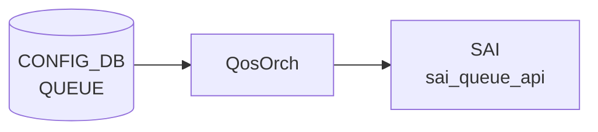

# QUEUE テーブル

## 概要

ポートの egress queue ごとに `SCHEDULER` (WRR/DWRR/STRICT) と `WRED_PROFILE` を割り当てる[^1]。`qosorch` が [SAI](../../reference/glossary.md#term-sai) queue scheduler / [WRED](../../reference/glossary.md#term-wred) を設定する。[VOQ](../../reference/glossary.md#term-voq) シャーシでは `QUEUE_LIST` ではなく `VOQ_QUEUE_LIST` を使う。

<!-- cdb-mermaid -->
### データフロー (自動生成)



!!! note "凡例"
    CONFIG_DB から SAI までの典型経路を `docs/reference/config-db-orch-map.md` から機械生成したミニ図。詳細・例外は本ページ本文と対応表を参照。
<!-- /cdb-mermaid -->

## key 構造

非 [VOQ](../../reference/glossary.md#term-voq):
```
QUEUE|<ifname>|<qindex>
```

[VOQ](../../reference/glossary.md#term-voq) chassis:
```
QUEUE|<hostname>|<asic_name>|<ifname>|<qindex>
```

`<ifname>` は `PORT.name` への leafref または文字列 `CPU`。`<qindex>` はプラットフォーム依存（物理 0-7、CPU 0-48 等）、範囲表現も可。

## フィールド一覧 (非 VOQ: `QUEUE_LIST`)

| フィールド | 型 | 必須 | 説明 |
|-----------|----|------|------|
| `ifname` (key) | leafref `PORT.name` または `CPU` | ✅ | IF 名 |
| `qindex` (key) | string | ✅ | Q-index または範囲 |
| `scheduler` | leafref `SCHEDULER.name` | - | スケジューラ参照 |
| `wred_profile` | leafref `WRED_PROFILE.name` | - | [WRED](../../reference/glossary.md#term-wred) プロファイル参照 |

`when` 条件: `switch_type` が `voq` でないか未指定。

## フィールド一覧 (VOQ: `VOQ_QUEUE_LIST`)

| フィールド | 型 | 必須 | 説明 |
|-----------|----|------|------|
| `hostname` (key) | `hostname` | ✅ | シャーシホスト名 |
| `asic_name` (key) | `asic_name` | ✅ | ASIC 名 |
| `ifname` (key) | string (1..128) | ✅ | IF 名 |
| `qindex` (key) | string | ✅ | Q-index |
| `scheduler` | leafref `SCHEDULER.name` | - | スケジューラ |
| `wred_profile` | leafref `WRED_PROFILE.name` | - | [WRED](../../reference/glossary.md#term-wred) プロファイル |

`when` 条件: `switch_type = voq`。

## 購読者

- `qosorch`: [SAI](../../reference/glossary.md#term-sai) queue scheduler / WRED を生成
- `bufferorch` と協調

## 関連 CONFIG_DB / YANG / CLI

- 関連 [CONFIG_DB](../../reference/glossary.md#term-config_db): `SCHEDULER`、`WRED_PROFILE`、`PORT`、`BUFFER_QUEUE`、`TC_TO_QUEUE_MAP`
- 関連 CLI: なし（`config_db.json` ロード）
- 関連 [YANG](../../reference/glossary.md#term-yang): `sonic-queue`

<!-- ref-triangle:start -->

## 関連リファレンス

- [YANG](../../reference/glossary.md#term-yang): [`sonic-queue`](../yang/sonic-queue.md)

<!-- ref-triangle:end -->

## 引用元

[^1]: [YANG](../../reference/glossary.md#term-yang) 定義: `sonic-queue.yang`. <https://github.com/sonic-net/sonic-buildimage/blob/9ea932ec2e18f35e58268ec2e4456b1d4afd65cd/src/sonic-yang-models/yang-models/sonic-queue.yang>

<!-- topics-back-ref -->
## 関連 Topics

- [Topics: QoS / Buffer / PFC / Watermark](../../topics/08-qos-buffer/index.md)

<!-- /topics-back-ref -->

<!-- ops-hint -->
## 運用ヒント

### 典型値

- key 形式: `QUEUE|<port>|<queue-range>` (例 `QUEUE|Ethernet0|3-4`)。
- `scheduler`: `scheduler.0` 等。
- `wred_profile`: `AZURE_LOSSY` 等。

### よくある誤設定

- [PFC](../../reference/glossary.md#term-pfc) 対応 queue に `wred_profile` を当てて ECN を有効にしないと、輻輳時に [PFC](../../reference/glossary.md#term-pfc) が連続発火する。

### 確認コマンド

```bash
sonic-db-cli CONFIG_DB keys 'QUEUE|Ethernet0|*'
show queue counters
```
<!-- /ops-hint -->

<!-- glossary-links-injected: 2ae60ae29e92 -->
