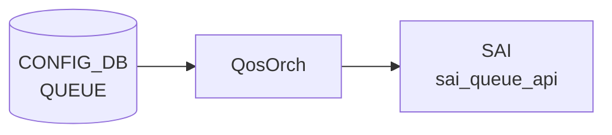

# QUEUE テーブル

## 概要

ポートの egress queue ごとに `SCHEDULER` (WRR/[DWRR](../../reference/glossary.md#term-dwrr)/STRICT) と `WRED_PROFILE` を割り当てる[^1]。`qosorch` が [SAI](../../reference/glossary.md#term-sai) queue scheduler / [WRED](../../reference/glossary.md#term-wred) を設定する。[VOQ](../../reference/glossary.md#term-voq) シャーシでは `QUEUE_LIST` ではなく `VOQ_QUEUE_LIST` を使う。

<!-- cdb-mermaid -->
### データフロー (自動生成)



!!! note "凡例"
    CONFIG_DB から SAI までの典型経路を `docs/reference/config-db-orch-map.md` から機械生成したミニ図。詳細・例外は本ページ本文と対応表を参照。
<!-- /cdb-mermaid -->

## key 構造

非 [VOQ](../../reference/glossary.md#term-voq):
```text
QUEUE|<ifname>|<qindex>
```

[VOQ](../../reference/glossary.md#term-voq) chassis:
```text
QUEUE|<hostname>|<asic_name>|<ifname>|<qindex>
```

`<ifname>` は `PORT.name` への leafref または文字列 `CPU`。`<qindex>` はプラットフォーム依存（物理 0-7、CPU 0-48 等）、範囲表現も可。

## フィールド一覧 (非 VOQ: `QUEUE_LIST`)

| フィールド | 型 | 必須 | 説明 |
|-----------|----|------|------|
| `ifname` (key) | leafref `PORT.name` または `CPU` | ✅ | IF 名 |
| `qindex` (key) | string | ✅ | Q-index または範囲 |
| `scheduler` | leafref `SCHEDULER.name` | - | スケジューラ参照 |
| `wred_profile` | leafref `WRED_PROFILE.name` | - | [WRED](../../reference/glossary.md#term-wred) プロファイル参照 |

`when` 条件: `switch_type` が `voq` でないか未指定。

## フィールド一覧 (VOQ: `VOQ_QUEUE_LIST`)

| フィールド | 型 | 必須 | 説明 |
|-----------|----|------|------|
| `hostname` (key) | `hostname` | ✅ | シャーシホスト名 |
| `asic_name` (key) | `asic_name` | ✅ | ASIC 名 |
| `ifname` (key) | string (1..128) | ✅ | IF 名 |
| `qindex` (key) | string | ✅ | Q-index |
| `scheduler` | leafref `SCHEDULER.name` | - | スケジューラ |
| `wred_profile` | leafref `WRED_PROFILE.name` | - | [WRED](../../reference/glossary.md#term-wred) プロファイル |

`when` 条件: `switch_type = voq`。

## 購読者

- `qosorch`: [SAI](../../reference/glossary.md#term-sai) queue scheduler / WRED を生成
- `bufferorch` と協調

## 関連 CONFIG_DB / YANG / CLI

- 関連 [CONFIG_DB](../../reference/glossary.md#term-config_db): `SCHEDULER`、`WRED_PROFILE`、`PORT`、`BUFFER_QUEUE`、`TC_TO_QUEUE_MAP`
- 関連 CLI: なし（`config_db.json` ロード）
- 関連 [YANG](../../reference/glossary.md#term-yang): `sonic-queue`

<!-- ref-triangle:start -->

## 関連リファレンス

- [YANG](../../reference/glossary.md#term-yang): [`sonic-queue`](../yang/sonic-queue.md)

<!-- ref-triangle:end -->

## 引用元

[^1]: [YANG](../../reference/glossary.md#term-yang) 定義: `sonic-queue.yang`. <https://github.com/sonic-net/sonic-buildimage/blob/9ea932ec2e18f35e58268ec2e4456b1d4afd65cd/src/sonic-yang-models/yang-models/sonic-queue.yang>

<!-- topics-back-ref -->
## 関連 Topics

- [Topics: QoS / Buffer / PFC / Watermark](../../topics/08-qos-buffer/index.md)

<!-- /topics-back-ref -->

<!-- ops-hint -->
## 運用ヒント

### 典型値

- key 形式: `QUEUE|<port>|<queue-range>` (例 `QUEUE|Ethernet0|3-4`)。
- `scheduler`: `scheduler.0` 等。
- `wred_profile`: `AZURE_LOSSY` 等。

### よくある誤設定

- [PFC](../../reference/glossary.md#term-pfc) 対応 queue に `wred_profile` を当てて ECN を有効にしないと、輻輳時に [PFC](../../reference/glossary.md#term-pfc) が連続発火する。

### 確認コマンド

```bash
sonic-db-cli CONFIG_DB keys 'QUEUE|Ethernet0|*'
show queue counters
```
<!-- /ops-hint -->

<!-- value-behavior -->
## 値依存挙動マトリクス

### `ifname` 値別挙動
| 値 | 挙動 |
|----|------|
| `PORT.name` に存在する値 | 正常処理。[SAI](../../reference/glossary.md#term-sai) queue scheduler / WRED 適用。 |
| `CPU` | CPU queue 用の専用処理パス。 |
| 存在しないポート名 | `SWSS_LOG_ERROR("Port with alias:%s not found")` → `task_invalid_entry` でスキップ。 |

### `scheduler` フィールド挙動
| 状態 | 挙動 |
|------|------|
| 省略 | スケジューラなし。ASIC デフォルト動作。 |
| 存在する SCHEDULER 名 | `qosorch` が SAI scheduler を queue に適用。 |
| 存在しない SCHEDULER 名 | `task_need_retry`（後で再試行）。解決不可なら `task_failed`。 |

### `wred_profile` フィールド挙動
| 状態 | 挙動 |
|------|------|
| 省略 | WRED なし。 |
| 存在する WRED_PROFILE 名 | SAI WRED を queue に適用。 |
| 存在しない WRED_PROFILE 名 | `task_need_retry`。解決不可なら `task_failed`。 |

<!-- /value-behavior -->

<!-- cdb-exceptions -->
## 例外条件・特殊挙動

- **key トークン数不正**: 非 VOQ 環境では `<ifname>|<qindex>` の 2 トークン必須。VOQ 環境では `<hostname>|<asic_name>|<ifname>|<qindex>` の 4 トークン必須。違反時は `task_invalid_entry` で処理中断。[^2]
- **queue index 範囲外**: `<qindex>` が SAI の queue 数を超えた場合 `SWSS_LOG_ERROR("Invalid queue index specified")` でエントリがスキップされる。[^2]
- **SCHEDULER 参照未解決 (リトライ)**: `scheduler` フィールドの参照先 SCHEDULER エントリがまだ存在しない場合は `task_need_retry` で後で再試行される。解決できない恒久エラーの場合は `task_failed`。[^2]
- **WRED_PROFILE 参照未解決 (リトライ)**: `wred_profile` も同様に未解決なら `task_need_retry`、恒久エラーは `task_failed`。[^2]
- **port 未検出**: `<ifname>` が PORT テーブルに存在しない場合 `SWSS_LOG_ERROR("Port with alias:%s not found")` でスキップ。[^2]
- **scheduler group 未検出**: ポートは存在しても queue index に対応する SAI scheduler group が見つからない場合 `task_failed`。[^2]

[^2]: qosorch 実装: `sonic-swss/orchagent/qosorch.cpp`. <https://github.com/sonic-net/sonic-swss/blob/master/orchagent/qosorch.cpp>


<!-- derivation -->
## 派生・条件付き登録 (Phase 6/7)

### Phase 6: 自動派生

QosOrch が `QUEUE.wred_profile` / `QUEUE.scheduler` / `QUEUE.dscp_to_tc_map` フィールドを参照して各テーブルの OID を解決し、SAI キューオブジェクトに bind する。参照先テーブルが未作成の場合は設定がペンディング状態になる（待機派生）。

### Phase 7: 条件付き登録 (add_manager 条件)

QosOrch は常時登録し `QUEUE` テーブルを無条件購読する。ただし `SCHEDULER` / `WRED_PROFILE` が未作成の場合は対応 OID が未解決でペンディングとなる。port が未初期化の場合はエラーログ + スキップ。

<!-- /derivation -->

<!-- handler-branching -->
### Phase 8: Handler メソッド内分岐

| Handler | 分岐条件 | 効果 | evidence |
|---|---|---|---|
| `QosOrch` | `wred_profile` フィールドあり | `WRED_PROFILE` OID 参照 → `SAI_QUEUE_ATTR_WRED_PROFILE_ID` 設定 | `qosorch.cpp` |
| `QosOrch` | `scheduler` フィールドあり | `SCHEDULER` OID 参照 → `SAI_QUEUE_ATTR_SCHEDULER_PROFILE_ID` 設定 | `qosorch.cpp` |
| `QosOrch` | port のキュー番号が範囲外 | ERROR ログ + スキップ | `qosorch.cpp` |
| `QosOrch` | del_handler: `wred_profile` あり | SAI attribute を NULL OID に設定して解除 | `qosorch.cpp` |

> **スキャン証跡**: QUEUE は SAI キューオブジェクトの属性 (scheduler, wred_profile) を束ねる。Phase 6 派生はフィールドから OID 解決への変換。自動付与はなし。

<!-- /handler-branching -->

<!-- runtime-trace -->
## CDB → 実コンテナ動作トレース

### 段階 1: Consumer 登録

- **orchagent / QosOrch** (`sonic-swss/orchagent/qosorch.cpp`): `QUEUE` テーブルを `SubscriberStateTable` で購読。

### 段階 2: CFG → APPL 翻訳

- QosOrch がキューのスケジューラマップ (`scheduler`) と WRED プロファイル (`wred_profile`) を解析。
- APP_DB への書き込みなし。

### 段階 3: APPL → SAI

- QosOrch が `sai_scheduler_api` / `sai_wred_api` を呼び出し、キュー OID に対してスケジューラと WRED を適用。

### 段階 4: タイミング + 副作用

- 参照するスケジューラ/WRED が未作成の場合は `task_need_retry`。
- 副作用: キューの WRED 変更は既存フロー中のパケットからリアルタイムに適用される。

<!-- /runtime-trace -->

<!-- pubsub -->
## 通信メカニズム (Phase G)

### Producer/Consumer ペア

QUEUE テーブルは CONFIG_DB → SAI の **直接経路**をとる。APPL_DB への中継は行わない。

| 区間 | 方式 | チャンネル/パターン |
|------|------|--------------------|
| CONFIG_DB → QosOrch | `SubscriberStateTable` | `__keyspace@{config_db_id}__:QUEUE\|*` |
| QosOrch → SAI | SAI API 直接呼び出し | `sai_scheduler_group_api` / `sai_queue_api` |

### SubscriberStateTable の動作

`QosOrch` は `Orch(db, tableNames)` 基底クラスの `addConsumer()` を通じて `CFG_QUEUE_TABLE_NAME` に対する `SubscriberStateTable` を生成する (`orch.cpp:1188-1190`)。CONFIG_DB の keyspace notification (`PSUBSCRIBE __keyspace@db__:QUEUE|*`) でエントリの変化を検出し、`pops()` で現在値を読み出す。初回起動時は `getKeys()` で既存エントリを先読みし、起動前の設定を取りこぼさない。

### select() ループと doTask 実行順序

orchdaemon は `Select::select()` を 1000 ms タイムアウトで実行する。イベント受信時は `Consumer::drain()` → `QosOrch::doTask(Consumer&)` が呼ばれる。

`QosOrch::doTask()` (`qosorch.cpp:2231`) はカスタム実行順序を実装する:

1. `SCHEDULER` / `WRED_PROFILE` などの参照先テーブルを先に drain
2. `PORT_QOS_MAP` を drain
3. 最後に `QUEUE` を drain（参照先が揃った状態で実行し `task_need_retry` を最小化）

`doTask(Consumer&)` の冒頭では `gPortsOrch->allPortsReady()` チェックがあり、全ポート初期化完了まで処理を保留する。

### retry メカニズム

`scheduler` / `wred_profile` の参照先が未登録の場合は `task_need_retry` を返し、エントリは `m_toSync` に残留する。参照先テーブルの登録イベントが来ると doTask の実行順序制御により直ちに再試行される。解決不可な恒久エラーは `task_failed` で silent drop となる。

### データフロー図

```
CONFIG_DB[QUEUE|<port>|<qindex>]
  ↓ SubscriberStateTable (keyspace notification)
  ↓ PSUBSCRIBE __keyspace@config_db_id__:QUEUE|*
orchdaemon select() loop (SELECT_TIMEOUT=1000ms)
  ↓ Consumer::drain() → QosOrch::doTask()
  ↓   [allPortsReady() チェック]
  ↓   [実行順序: 参照先テーブル → PORT_QOS_MAP → QUEUE]
  ↓ handleQueueTable()
    ↓ applySchedulerToQueueSchedulerGroup()
    ↓   → sai_scheduler_group_api
    ↓     SAI_SCHEDULER_GROUP_ATTR_SCHEDULER_PROFILE_ID
    ↓ applyWredProfileToQueue()
    ↓   → sai_queue_api
    ↓     SAI_QUEUE_ATTR_WRED_PROFILE_ID
ASIC (sairedis → ASIC_DB 経由)

APPL_DB 書き込み: なし
STATE_DB 書き込み: なし
NotificationConsumer: なし
```

<!-- /pubsub -->

<!-- entry-points -->
## 書き込み入り口 (Direction A)

QUEUE テーブルへの書き込みが発生するコード経路を網羅的に調査した結果。

### CLI

  - `config qos reload` — sonic-cfggen が `files/build_templates/qos_config.j2` を展開し QUEUE エントリを生成 (sonic-buildimage/files/build_templates/qos_config.j2)

### minigraph / sonic-cfggen

minigraph.py に QUEUE 直接生成なし — `qos_config.j2` テンプレート経由

### REST / gNMI

REST/gNMI 書き込み経路なし

### db_migrator

**db_migrator.py** が QUEUE テーブルのマイグレーション処理を実装 (sonic-utilities/scripts/db_migrator.py)

### ビルド時デフォルト (build-time default)

各プラットフォームの `qos.json.j2` に QUEUE エントリが定義され、ビルド時に投入

### ハードコードデフォルト / ランタイム注入

なし

### 死活・デッドコード

なし
<!-- /entry-points -->

<!-- defaults -->
## コード由来の暗黙デフォルト (Phase A)

| フィールド | 省略/未設定時の実装動作 | コードロケーション |
|-----------|----------------------|------------------|
| `scheduler` | SAI scheduler group に何も設定しない (no-op)。ASIC 実装依存のデフォルト動作。 | `qosorch.cpp` `handleQueueTable` `donotChangeScheduler=true` |
| `wred_profile` | SAI `WRED_PROFILE_ID` 未設定。実質 tail-drop (WRED なし)。 | `qosorch.cpp` `donotChangeWredProfile=true` |
| `scheduler` (後から削除) | `SAI_SCHEDULER_GROUP_ATTR_SCHEDULER_PROFILE_ID` を NULL OID に更新しスケジューラ解除。 | `qosorch.cpp` SET 時フィールド消去パス |
| `wred_profile` (後から削除) | `SAI_QUEUE_ATTR_WRED_PROFILE_ID` を NULL OID に更新し WRED 解除。 | `qosorch.cpp` SET 時フィールド消去パス |
| `qindex` 範囲 (`X-Y`) | range_low < range_high を強制。同値 `X-X` は `parseIndexRange` 失敗 → `task_invalid_entry`。 | `orch.cpp` `parseIndexRange` |
| `qindex` 超過 | port の queue 数を超えると `task_failed` (silent drop)。 | `qosorch.cpp` `applySchedulerToQueueSchedulerGroup` |
| VOQ remote port の `scheduler` | no-op (即 `true` 返却)。リモートシステムポートには適用なし。 | `qosorch.cpp` `applySchedulerToQueueSchedulerGroup` VOQ 分岐 |
| ビルド時 queue 割当 (標準) | q3/q4: `scheduler.1` + `AZURE_LOSSLESS`; q0/q1/q2/q5: `scheduler.0` のみ | `qos_config.j2` |
| ビルド時 queue 割当 (DPC ポート) | q3/q4 も `scheduler.0` に格下げ (lossless なし) | `qos_config.j2` DPC 分岐 |

### 書込み順依存

- `scheduler` / `wred_profile` の参照先テーブル (`SCHEDULER`, `WRED_PROFILE`) が先行して存在しない場合は `task_need_retry` で処理がペンディング。参照先登録後に自動再処理される。
- `db_migrator` が旧 ABNF 形式 (`scheduler|scheduler.0`) を除去する前は参照解決に失敗し続ける。バージョン移行直後に注意。

### 既知 YANG-実装 discrepancy

- `qindex` の YANG 型は `string` (無制限)。実装の `parseIndexRange` は整数または `X-Y` (`X < Y`) のみ受け付ける。YANG バリデーションでは弾かれないが orchagent が `task_invalid_entry` で捨てる。
- Phase 8 コメントに記載の `dscp_to_tc_map` フィールドは QUEUE テーブルには存在しない。PORT_QOS_MAP テーブルのフィールドであり誤記。

<!-- /defaults -->

<!-- glossary-links-injected: f9445b5b4106 -->
