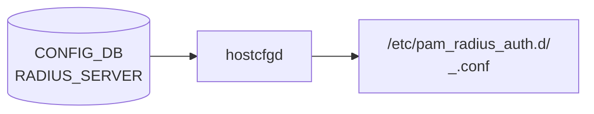

# RADIUS_SERVER テーブル

## 概要

サーバごとの RADIUS クライアント設定を保持するリストテーブル[^1]。`hostcfgd` の [AAA](../../reference/glossary.md#term-aaa) ハンドラが読み、`/etc/pam_radius_auth.d/<ip>_<port>.conf` を生成する。グローバル設定は `RADIUS|global` 側にある。

<!-- cdb-mermaid -->
### データフロー (自動生成)



!!! note "凡例"
    CONFIG_DB から SAI までの典型経路を `docs/reference/config-db-orch-map.md` から機械生成したミニ図。詳細・例外は本ページ本文と対応表を参照。
<!-- /cdb-mermaid -->

## key 構造

```text
RADIUS_SERVER|<ip_or_hostname>
```

`<ip_or_hostname>` は YANG の `inet:host` 型。IPv4 / IPv6 アドレスまたはドメイン名。

## フィールド

| フィールド | 型 | デフォルト | 説明 |
|-----------|----|-----------|------|
| `auth_port` | `inet:port-number` (1..65535) | `1812` | RADIUS 認証 UDP ポート番号 |
| `passkey` | string (1..65 chars、SPACE/`#`/`,` 不可) | なし (空文字列フォールバック) | サーバ固有の共有秘密鍵 |
| `auth_type` | enum `pap`/`chap`/`mschapv2` | `pap` | サーバ固有の認証プロトコル |
| `priority` | uint8 (1..64) | `1` (CLI 経由) | サーバ選択優先度。降順でソートされる |
| `timeout` | uint16 (1..60 秒) | `5` | サーバ固有の応答待ちタイムアウト |
| `retransmit` | uint8 (0..10) | `3` | サーバ固有の再送回数 |
| `vrf` | enum `mgmt`/`default` | なし (デフォルト VRF) | 接続に使用する VRF |
| `src_intf` | union leafref | なし | 送信元インタフェース |

## 制約

- `passkey` は印字可能 ASCII から SPACE/`#`/`,` を除外 (`pattern '[^ #,]*'`)
- `priority` 範囲外は YANG 制約違反でロード拒否
- `timeout` 範囲: 1..60
- `retransmit` 範囲: 0..10 (YANG) — CLI は 1..10 のみ許容 (YANG-CLI discrepancy は下記「コード由来の暗黙デフォルト」セクション参照)
- エントリ上限: **8 台** (`max-elements 8` in YANG / `RADIUS_MAXSERVERS = 8` in CLI)

## 購読者

- `hostcfgd` (`sonic-host-services` の AAA ハンドラ): [CONFIG_DB](../../reference/glossary.md#term-config_db) → `/etc/pam_radius_auth.d/<ip>_<port>.conf` を生成し PAM に反映
- `AAA.authentication.login` が `radius` を含むとき、PAM 経由でログイン認証時に参照される

## 関連 CONFIG_DB / YANG / CLI

- 関連 [CONFIG_DB](../../reference/glossary.md#term-config_db): [`RADIUS`](radius.md) (グローバル設定), [`AAA`](aaa.md)
- 関連 CLI: `config radius add/del ...`
- 関連 [YANG](../../reference/glossary.md#term-yang): `sonic-system-radius` (list `RADIUS_SERVER_LIST`)

<!-- ref-triangle:start -->

## 関連リファレンス

- [YANG](../../reference/glossary.md#term-yang): [`sonic-system-radius`](../yang/sonic-system-radius.md)
- CLI: `config radius add`
- [CONFIG_DB: RADIUS](radius.md)

<!-- ref-triangle:end -->

## 引用元

[^1]: `src/sonic-yang-models/yang-models/sonic-system-radius.yang` (list `RADIUS_SERVER_LIST`). <https://github.com/sonic-net/sonic-buildimage/blob/9ea932ec2e18f35e58268ec2e4456b1d4afd65cd/src/sonic-yang-models/yang-models/sonic-system-radius.yang>

## 関連ページ
- [CONFIG_DB: RADIUS](radius.md)
- [CONFIG_DB: AAA](aaa.md)

<!-- ops-hint -->
## 運用ヒント

### 典型値

- key 形式: `RADIUS_SERVER|<ip_or_hostname>`
- 例: `RADIUS_SERVER|192.168.1.10` — `auth_port: 1812`, `priority: 1`, `auth_type: pap`, `timeout: 5`, `retransmit: 3`
- 最大 8 台まで登録可能。`priority` 降順で PAM に渡される

### よくある誤設定

- `passkey` 未設定のまま登録 → hostcfgd が空文字列で pam_radius_auth.conf を生成 → 認証は常に失敗
- `src_intf` と `src_ip` を同時指定 → `src_intf` が優先され `src_ip` は無視される (syslog に警告)
- `retransmit: 0` を直接 CONFIG_DB に書き込むと YANG は valid (0..10) だが CLI 経由では設定不可能

### 確認コマンド

```bash
sonic-db-cli CONFIG_DB keys 'RADIUS_SERVER*'
show radius
```
<!-- /ops-hint -->

<!-- value-behavior -->
## 値依存挙動マトリクス

### `auth_type` 値別挙動
| 値 | 挙動 |
|----|------|
| `pap` | PAP 平文パスワード認証（デフォルト）。グローバル `auth_type` を per-server で上書き可能。 |
| `chap` | CHAP チャレンジ認証。 |
| `mschapv2` | MS-CHAPv2 認証。Active Directory 連携で主に使用。 |

### `priority` 値別挙動
| 値 | 挙動 |
|----|------|
| 1..64 | YANG 有効範囲。hostcfgd は降順ソート (`reverse=True`) でサーバリストを並べる。 |
| 0 | YANG 違反だが hostcfgd の `radius_global_default['priority']` は 0 を持つ。直接 DB 書き込みで設定された場合、最低優先度として動作。 |

### `vrf` 値別挙動
| 値 | 挙動 |
|----|------|
| `mgmt` | pam_radius_auth.conf に `vrf=mgmt` 行を追記。 |
| `default` | pam_radius_auth.conf に `vrf=default` 行を追記。 |
| 未設定 | vrf 行なし → OS デフォルト VRF で接続。 |

### `src_intf` 値別挙動
| 値 | 挙動 |
|----|------|
| 有効インタフェース名 | `get_interface_ip(src_intf, addr)` で IP を解決し `src_ip` に上書き。`src_ip` が既に設定されていても無視 (syslog INFO)。 |
| IP 未解決のインタフェース | `src_ip` を削除 (`del server['src_ip']`)。pam_radius_auth.conf の source_ip 行が省略される。 |
| 未設定 | グローバル `src_ip` を継承 (radius_global_default 経由)。 |

<!-- /value-behavior -->

<!-- cdb-exceptions -->
## 例外条件・特殊挙動

- **data={} で削除**: `radius_server_update` で `data == {}` の場合は対象サーバエントリを `radius_servers` から削除し設定ファイルを再生成する。[^2]
- **pam_radius_auth.conf の残留ファイル**: `auth_port` が変更されると旧ポートのファイル (`<ip>_<old_port>.conf`) は自動削除されない。[^2]
- **passkey 空文字フォールバック**: `passkey` 未設定時は `RADIUS_SERVER_PASSKEY_DEFAULT = ""` が使われ空文字列で PAM 設定が生成される → 認証失敗するが silent drop はなく設定ファイルは生成される。[^2]
- **src_intf 変更時の再設定**: インタフェース IP が変わると `handle_radius_source_intf_ip_chg` が `modify_conf_file()` を再呼び出し。インタフェースが存在しない場合は pam_radius_auth.conf の `src_ip` 行が省略される。[^2]
- **modify_conf_file 失敗は syslog のみ**: テンプレート展開やサービス SIGHUP 送信に失敗しても例外はキャッチされ `LOG_ERR` / `LOG_WARNING` に記録されるだけ。設定ファイルとメモリ内 radius_servers とのずれが生じる可能性がある。[^2]
- **skip_msg_auth は CLI から設定不能**: YANG に未定義、CLI にオプションなし。直接 CONFIG_DB 書き込みのみで設定可能。[^2]

[^2]: [hostcfgd](../../reference/glossary.md#term-hostcfgd) 実装: `sonic-host-services/scripts/hostcfgd`. <https://github.com/sonic-net/sonic-host-services/blob/master/scripts/hostcfgd>

<!-- /cdb-exceptions -->

<!-- defaults -->
## コード由来の暗黙デフォルト

本セクションは YANG `default` 文以外のコード実装から検出した暗黙デフォルト・フォールバックをまとめる。

### フィールド別デフォルト源泉

| フィールド | YANG default | hostcfgd fallback 定数 | CLI `add` default | 備考 |
|-----------|-------------|----------------------|------------------|------|
| `auth_port` | `1812` | `RADIUS_SERVER_AUTH_PORT_DEFAULT = "1812"` (L.92) | `default=1812` | 三箇所一致 |
| `auth_type` | `pap` | `RADIUS_SERVER_AUTH_TYPE_DEFAULT = "pap"` (L.96) | なし (未設定なら未書き込み) | CLI 省略時は DB に書かれず hostcfgd が補完 |
| `timeout` | `5` | `RADIUS_SERVER_TIMEOUT_DEFAULT = "5"` (L.95) | なし | CLI `-t` 省略時は未書き込み → hostcfgd が補完 |
| `retransmit` | `3` | `RADIUS_SERVER_RETRANSMIT_DEFAULT = "3"` (L.94) | なし | CLI `-r` 省略時は未書き込み → hostcfgd が補完 |
| `passkey` | なし | `RADIUS_SERVER_PASSKEY_DEFAULT = ""` (L.93) | なし | **空文字列フォールバック** — PAM が認証失敗する |
| `priority` | なし (1..64) | `radius_global_default['priority'] = 0` (L.375) | `default=1` | **YANG-実装 discrepancy**: hostcfgd の内部 default は YANG 範囲外の 0 |
| `skip_msg_auth` | **YANG 未定義** | `RADIUS_SERVER_SKIP_MSG_AUTH = False` (L.98) | **なし** | **dead field from YANG/CLI perspective** — direct DB 書き込みのみ |
| `vrf` | なし | なし | なし (フラグ `--use-mgmt-vrf`) | 未設定 → vrf 行なし → デフォルト VRF |
| `src_intf` | なし | なし | なし | 未設定 → src_ip 行なし |

### YANG-CLI Discrepancy: `retransmit`

- **YANG**: `range "0..10"` — 0 は有効値
- **CLI** (`config/aaa.py`): `type=click.IntRange(1, 10)` — 0 は設定不能
- 影響: `retransmit: 0` (再送なし) を設定するには `sonic-db-cli CONFIG_DB hset 'RADIUS_SERVER|<ip>' retransmit 0` で直接書き込む必要がある

### Priority の YANG-実装 Discrepancy

- **YANG**: `range "1..64"` (0 は無効)
- **hostcfgd** `radius_global_default`: `'priority': 0` を内部デフォルトとして保持
- `radius_global_default` は各サーバにコピーされる基底オブジェクト。直接 DB 書き込みで `priority` 未設定の場合、ランタイムで 0 が使われ降順ソートで最低優先度になる。YANG ロード時は 0 を拒否するが hostcfgd はランタイムで 0 を許容する

### NAS 情報の自動補完

- `nas_ip` が `RADIUS|global` 未設定の場合: `get_interface_ip("eth0")` で管理インタフェース IP を自動補完し `NAS-IP-Address` に使用
- `nas_id` が `RADIUS|global` 未設定の場合: `get_hostname()` でホスト名を自動補完し `NAS-Identifier` に使用
- これらは `radius_global_default` ベースのコピーを通じて各サーバエントリに継承される

### pam_radius_auth.conf ファイル名の暗黙規則

- 生成パス: `RADIUS_PAM_AUTH_CONF_DIR + srv['ip'] + "_" + srv['auth_port'] + ".conf"`
- 定数: `RADIUS_PAM_AUTH_CONF_DIR = "/etc/pam_radius_auth.d/"` (L.97)
- 例: `RADIUS_SERVER|192.0.2.10` / `auth_port: 1812` → `/etc/pam_radius_auth.d/192.0.2.10_1812.conf`
- **暗黙の副作用**: `auth_port` を変更すると旧ファイルが残留する。hostcfgd は古いファイルを削除しない

<!-- /defaults -->

<!-- derivation -->
## 派生・条件付き登録 (Phase 6/7)

### Phase 6: 自動派生

hostcfgd が `RADIUS_SERVER` テーブルを読み、未設定フィールドに `radius_global_default` のデフォルト値を補完する。`auth_port` 未設定 → `1812`、`auth_type` 未設定 → `pap`、`timeout` 未設定 → `5`、`retransmit` 未設定 → `3`、`priority` 未設定 → `0`。さらに `RADIUS|global` の値が各サーバにコピーされ、サーバ固有設定で上書きされる (server merge)。

### Phase 7: 条件付き登録 (add_manager 条件)

hostcfgd は常時起動し `RADIUS_SERVER` テーブルを無条件購読する。ただし `AAA.authentication.login` に `radius` が含まれない場合、RADIUS_SERVER エントリがあっても PAM に反映されない (NSS の radius プラグインは無効化される)。

<!-- /derivation -->

<!-- ordering -->
## 設定生成順序・PAM 順序 (Phase B)

### RADIUS 設定ファイル生成順序

`hostcfgd` の `modify_conf_file()` は以下の順序で RADIUS 設定を生成する。

1. **グローバル設定マージ**: `radius_global_default` に `RADIUS|global` の値を上書きコピー (`radius_global.update(self.radius_global)`)。
2. **NAS 情報補完**: `nas_ip` 未設定 → `get_interface_ip("eth0")` で eth0 IP を取得。`nas_id` 未設定 → `get_hostname()` でホスト名を取得。
3. **サーバエントリ構築**: `RADIUS_SERVER` の各エントリに対し、グローバル設定をコピーして `server.update()` でサーバ固有設定を上書き。
4. **priority 降順ソート**: `sorted(..., key=lambda t: int(t['priority']), reverse=True)` により `radsrvs_conf` を priority 高い順に並べる（`hostcfgd` L.703）。
5. **PAM 設定生成**: `common-auth-sonic.j2` テンプレートに `radsrvs_conf`（priority 降順）を渡して `/etc/pam.d/common-auth-sonic` を生成。`AAA.authentication.login` に `radius` が含まれる場合のみ実行（L.722–723）。
6. **NSS 設定生成**: `radius_nss.conf.j2` テンプレートに同じ `radsrvs_conf` を渡して `/etc/radius_nss.conf` を生成（L.821）。
7. **per-server ファイル生成**: `radsrvs_conf` の順に `/etc/pam_radius_auth.d/<ip>_<auth_port>.conf` を生成（L.827–837）。ファイル名はサーバ IP と auth_port の組み合わせ。
8. **aaastatsd 制御**: `radius` が login 認証に含まれ `statistics` が有効な場合 `aaastatsd` を start、そうでなければ stop（L.839–844）。

### PAM スタック内の RADIUS サーバ順序

| 順序決定要因 | 詳細 | evidence |
|---|---|---|
| `priority` 降順 | `radsrvs_conf = sorted(..., key=lambda t: int(t['priority']), reverse=True)` — priority 値が大きいサーバが先にリストされ、PAM が先に試行する | `hostcfgd` L.703 |
| 同 priority の場合 | Python の `sorted()` は安定ソートのため、`self.radius_servers` dict のイテレーション順（登録順）が維持される | Python sort stability |
| `priority` 未設定時のデフォルト | `radius_global_default['priority'] = 0` — YANG 範囲外 (1..64) の 0 が使われ最低優先度として扱われる | `hostcfgd` L.375 |

### 設定反映タイミング

- RADIUS_SERVER エントリが変更されると `radius_server_update()` → `modify_conf_file()` が即座に呼ばれ、上記手順 1–8 が全実行される（部分更新なし）。
- PAM の変更は次回ログインから有効。既存 SSH セッションには影響しない。
- `auth_port` 変更時は旧ポート番号のファイル (`<ip>_<old_port>.conf`) が `/etc/pam_radius_auth.d/` に残留する（自動クリーンアップなし）。

<!-- /ordering -->

<!-- handler-branching -->
### Phase 8: Handler メソッド内分岐

| Handler | 分岐条件 | 効果 | evidence |
|---|---|---|---|
| `hostcfgd` radius_server_update | `data == {}` | サーバエントリを radius_servers から削除して設定ファイル再生成 | `hostcfgd` L.536 |
| `hostcfgd` modify_conf_file | `src_intf` あり | `get_interface_ip(src_intf)` で IP 解決し `src_ip` を上書き。解決失敗時は `src_ip` 削除 | `hostcfgd` L.687-700 |
| `hostcfgd` modify_conf_file | `vrf` あり | pam_radius_auth.conf に `vrf=<vrf>` 行を追記 | `pam_radius_auth.conf.j2` |
| `hostcfgd` modify_conf_file | `src_ip` あり | pam_radius_auth.conf に ` <src_ip>` を追記 | `pam_radius_auth.conf.j2` |
| `hostcfgd` radius_server_update | `skip_msg_auth` あり | `is_true()` で bool 変換 | `hostcfgd` L.541 |
| `hostcfgd` modify_conf_file | `radsrvs_conf` 空 | 統計サービス (`aaastatsd`) を stop | `hostcfgd` L.839-844 |

> **スキャン証跡**: `RADIUS_SERVER` テーブルは `hostcfgd` が `RADIUS|global` と merged して各サーバの pam_radius_auth.conf を生成する。CLI は `auth_port` と `priority` を必ず書き込むが `auth_type`/`timeout`/`retransmit` は省略時に未書き込みとなり hostcfgd の fallback 定数が使われる。

<!-- /handler-branching -->

<!-- side-effects -->
## 副次 DB 書込 (Phase F)

> **調査根拠**: `sonic-host-services/scripts/hostcfgd` 全行精読 (2026-05-16)
> 詳細証跡: `meta/_intermediate/cdb-flow/radius-server-side-effects.md`

`RADIUS_SERVER` テーブルへの書込みが発生すると、`hostcfgd` の `AaaCfg.modify_conf_file()` が以下の副次処理を行う。DB への書込みは発生しない（すべてファイルシステム書込みと systemd サービス制御）。

### `/etc/pam_radius_auth.d/<ip>_<port>.conf`（PAM 認証設定）

サーバ 1 台ごとに `RADIUS_PAM_AUTH_CONF_DIR + srv['ip'] + "_" + srv['auth_port'] + ".conf"` を生成する。テンプレート: `pam_radius_auth.conf.j2`。パーミッション `0o600`。`radsrvs_conf` が空（RADIUS_SERVER エントリなし）の場合は生成をスキップ。`auth_port` 変更時は旧ポートのファイルが残留する（自動削除なし）。

> **Evidence**: `hostcfgd:825-837`

### `/etc/radius_nss.conf`（NSS RADIUS 設定）

サーバリストと debug/trace フラグを `radius_nss.conf.j2` でレンダリングし、`/etc/radius_nss.conf` に常時上書きする。`radsrvs_conf` が空の場合も実行される（空リスト）。

> **Evidence**: `hostcfgd:818-823`

### `/etc/nsswitch.conf`（NSS passwd エントリ）

`AAA.authentication.login` に `radius` が含まれる場合、`sed` インプレース編集で `passwd` 行に `radius` を追加する。含まれない場合は ` radius` を除去する。

```
# radius 有効時の sed 操作（L.765-767）
/^passwd/s/tacplus //
/^passwd/s/ ldap//
/radius/b; /^passwd/s/compat/& radius/; /^passwd/s/files/& radius/
```

> **Evidence**: `hostcfgd:763-780`

### `/etc/pam.d/common-auth-sonic`（PAM 認証スタック）

`common-auth-sonic.j2` テンプレートから生成し、アトミック書込み（`.tmp` → `os.rename()`）で `/etc/pam.d/common-auth-sonic` に反映する。`radius` が `authentication.login` に含まれる場合は `radsrvs_conf` をレンダリングコンテキストに渡す。

> **Evidence**: `hostcfgd:715-731`

### `/etc/pam.d/sshd`、`/etc/pam.d/login`（@include 書き換え）

`common-auth-sonic` が存在する場合は `@include common-auth` → `@include common-auth-sonic` に、存在しない場合は逆方向に `sed` 書き換えする。`/etc/pam.d/sudo` は対象外。

> **Evidence**: `hostcfgd:744-752`

### `aaastatsd` systemd サービス制御

| 条件 | 操作 |
|------|------|
| `radius` が `authentication.login` に含まれ `RADIUS\|global.statistics=true` | `service aaastatsd start` |
| 上記以外 | `service aaastatsd stop` |

失敗時は `CalledProcessError` をキャッチし `LOG_ERR` を記録して継続する。RADIUS_SERVER エントリ変更のたびに毎回評価される。

> **Evidence**: `hostcfgd:839-851`

<!-- /side-effects -->

<!-- runtime-trace -->
## CDB → 実コンテナ動作トレース

### 段階 1: Consumer 登録

- **hostcfgd**: `RADIUS_SERVER` テーブルを `ConfigDBConnector` で購読。`radius_server_update()` がコールバック。

### 段階 2: CFG → APPL 翻訳

- hostcfgd の `modify_conf_file()` が各 RADIUS_SERVER エントリと RADIUS|global をマージし `/etc/pam_radius_auth.d/<ip>_<port>.conf` を生成。
- NSS 設定 (`/etc/sonic/radius_nss.conf`) も更新。
- APP_DB への書き込みなし。

### 段階 3: APPL → SAI

- SAI 経由なし。RADIUS は SSH/コンソール認証のコントロールプレーン処理。

### 段階 4: タイミング + 副作用

- 設定反映は hostcfgd が pam_radius_auth.conf を書き換えた直後から有効。既存 SSH セッションは影響なし (新規ログインから適用)。
- `auth_port` 変更時は旧ポート番号のファイルが `/etc/pam_radius_auth.d/` に残留する。

<!-- /runtime-trace -->
<!-- entry-points -->
## 書き込み入り口 (Direction A)

RADIUS_SERVER テーブルへの書き込みが発生するコード経路を調査した結果。

### CLI

  - `config radius add <addr> [--auth-port PORT] [--pri PRI] [--auth_type TYPE] [--timeout SEC] [--retransmit COUNT] [--key SECRET] [--use-mgmt-vrf] [--source-interface INTF]` — `config/aaa.py` が RADIUS_SERVER を書き込む

### minigraph / sonic-cfggen

minigraph.py に RADIUS_SERVER テーブル生成なし

### REST / gNMI

REST/gNMI 書き込み経路なし

### db_migrator

db_migrator.py での RADIUS_SERVER マイグレーションなし

### ビルド時デフォルト (build-time default)

なし

### ハードコードデフォルト / ランタイム注入

**sonic-host-services** `data/templates/pam_radius_auth.conf.j2` が RADIUS_SERVER エントリを読み pam_radius_auth を生成 (読み取り側)

### 死活・デッドコード

- `skip_msg_auth`: YANG 未定義・CLI 未実装だが hostcfgd が参照。直接 DB 書き込みのみで設定可能なフィールド
<!-- /entry-points -->

<!-- cross-refs -->
## 暗黙参照 — `radius_server_update` が間接読み出す関連 CONFIG_DB テーブル (Phase C)

`hostcfgd` の `radius_server_update()` は `RADIUS_SERVER` テーブルをメモリに反映した後、`modify_conf_file()` を呼ぶ。この関数は `RADIUS_SERVER` 単体ではなく、以下の関連テーブルを結合してから PAM / NSS テンプレを再生成する。

### `modify_conf_file()` 内で結合される共依存テーブル

| テーブル | 参照タイミング | 用途 | evidence |
|---|---|---|---|
| [`AAA`](aaa.md) (`authentication`) | `modify_conf_file()` 冒頭 | `authentication['login']` に `radius` が含まれるか確認。含まれない場合は RADIUS PAM スタックが組まれず `RADIUS_SERVER` エントリが存在しても認証に使われない | hostcfgd:639,722,763,840 |
| [`TACPLUS_SERVER`](tacplus-server.md) | `modify_conf_file()` — `servers_conf` 構築 | TACACS+ サーバリストを並列構築。`tacacs+` が `login` に含まれる場合は TACACS が優先され RADIUS が PAM chain に現れない | hostcfgd:648-666 |
| [`RADIUS`](radius.md) (`radius_global`) | `modify_conf_file()` — `radius_global` 構築 | `nas_ip` / `nas_id` / `src_intf` / `statistics` を各 `RADIUS_SERVER` エントリにマージ | hostcfgd:667-686 |

### 動的 IP / hostname 解決 (`get_interface_ip` / `get_hostname` 経由)

| テーブル | 参照箇所 | 用途 | evidence |
|---|---|---|---|
| [`MGMT_INTERFACE`](mgmt-interface.md) | `get_interface_ip("eth0")` | `RADIUS|global` に `nas_ip` 未設定の場合、eth0 管理 IP を `nas_ip` として自動補完 | hostcfgd:600,671-674 |
| `INTERFACE` | `get_interface_ip("Eth...")` | `RADIUS_SERVER.src_intf` が物理ポートのとき src_ip を解決 | hostcfgd:586,694 |
| `VLAN_INTERFACE` | `get_interface_ip("Vlan...")` | `src_intf` が VLAN のとき | hostcfgd:593 |
| `VLAN_SUB_INTERFACE` | `get_interface_ip` 分岐 | `src_intf` が VLAN sub-interface のとき | hostcfgd:588 |
| `PORTCHANNEL_INTERFACE` | `get_interface_ip("Po...")` | `src_intf` が PortChannel のとき | hostcfgd:591 |
| `LOOPBACK_INTERFACE` | `get_interface_ip("Loopback...")` | `src_intf` が Loopback のとき | hostcfgd:595 |
| [`DEVICE_METADATA`](device-metadata.md) (`localhost.hostname`) | `get_hostname()` | `RADIUS|global` に `nas_id` 未設定の場合、ホスト名を `nas_id` として自動補完 | hostcfgd:566-577,675-678 |

### ランタイム subscribe — RADIUS_SERVER に間接影響するテーブル変化

| テーブル | handler | 影響 | evidence |
|---|---|---|---|
| [`AAA`](aaa.md) | `aaa_handler` → `aaacfg.aaa_update()` | `authentication['login']` が変化すると RADIUS PAM スタックの有効/無効が即座に切り替わる | hostcfgd:2289-2291,2470 |
| [`TACPLUS_SERVER`](tacplus-server.md) | `tacacs_server_handler` → `aaacfg.tacacs_server_update()` | TACACS+ サーバ追加/削除で PAM chain の優先順に影響し RADIUS が有効でも適用されなくなる場合がある | hostcfgd:2304,2472 |
| [`MGMT_INTERFACE`](mgmt-interface.md) | `mgmt_intf_handler` → `handle_radius_nas_ip_chg()` | eth0 IP 変化時に RADIUS `nas_ip` を再計算し pam_radius_auth.conf を再生成 | hostcfgd:2348-2349,2485 |
| `MGMT_VRF_CONFIG` | `mgmt_vrf_handler` | 管理 VRF 切替時に eth0 の到達性が変わり `nas_ip` 自動補完結果に影響。`vrf: mgmt` を持つ RADIUS_SERVER エントリの接続経路も切り替わる | hostcfgd:2352-2353,2496 |

詳細スキャン手順と grep 結果は `meta/_intermediate/cdb-flow/radius-server-cross-refs.md` を参照。
<!-- /cross-refs -->

<!-- platform -->
## プラットフォーム差 (Phase H)

ソース: `sonic-net/sonic-host-services/scripts/hostcfgd`

### 結論

**プラットフォーム差なし**。RADIUS_SERVER 処理は host 単位で適用され、ASIC 種別・multi-asic / VOQ chassis 構成・ベンダー固有 PAM モジュールに依存しない。

### 根拠

#### 1. multi-asic: `is_multi_npu` は AaaCfg に渡されない

`hostcfgd` 行 2182 で `self.is_multi_npu = device_info.is_multi_npu()` を取得するが、行 2185 の `AaaCfg(self.config_db)` コンストラクタには渡されない。`AaaCfg.__init__` は `ConfigDBConnector` 1 個のみを保持し、`asic0..N` namespace への接続や iteration を一切しない。RADIUS_SERVER テーブルは host CONFIG_DB のみに置かれ、`asicN` namespace の CONFIG_DB には存在しない。

#### 2. MGMT_VRF_CONFIG は RADIUS_SERVER 処理に直接影響しない

`MGMT_VRF_CONFIG` の変更は `MgmtIfaceCfg.update_mgmt_vrf()` が受け取り、`chrony` / `interfaces-config` サービスのみ再起動する (`hostcfgd` 行 1657–1668)。`AaaCfg.modify_conf_file()` は呼ばれない。RADIUS_SERVER の `vrf` フィールドはオペレータが per-server で明示的に `mgmt` / `default` を設定するものであり、`MGMT_VRF_CONFIG.mgmtVrfEnabled` から自動注入されることはない。

`MGMT_INTERFACE` の変更は `handle_radius_source_intf_ip_chg()` を呼び出し (`hostcfgd` 行 2348)、`src_intf` が管理インタフェースを参照している場合のみ `modify_conf_file()` を再実行する。これは VRF 設定の伝播ではなく IP アドレス再解決のトリガーである。

#### 3. PAM モジュールにプラットフォーム差なし

`pam_radius_auth.so` は community SONiC の標準 Debian パッケージ。`common-auth-sonic.j2` テンプレート (`sonic-host-services/data/templates/`) を `platform|asic|chassis|namespace|vendor` で検索してもヒットなし。条件分岐は `AAA.authentication.login` 文字列・`failthrough` / `debug` / `trace` ブール・サーバリストのみ。`pam_radius_auth.conf.j2` テンプレートもプラットフォーム固有分岐なし。

#### 4. VOQ chassis / line card

VOQ chassis の各 line card / supervisor は独立した host `hostcfgd` を持ち、それぞれが自身の host CONFIG_DB の RADIUS_SERVER テーブルを処理する。chassis 全体での集中適用機構は存在しない。オペレータが各 host に同一の RADIUS_SERVER 設定を流す運用が前提。

#### 5. `NAS-IP-Address` の自動補完は eth0 固定

`nas_ip` が `RADIUS|global` 未設定の場合、`get_interface_ip("eth0")` で管理インタフェース IP を自動補完する (`hostcfgd` 行付近)。この処理は `eth0` 固定であり、管理インタフェース名が異なるプラットフォーム（例: `ma1`）では IP 解決に失敗し `NAS-IP-Address` が省略される可能性がある。これが唯一の実質的なプラットフォーム依存点だが、YANG / CONFIG_DB スキーマ上の差異ではなくランタイム挙動の差にとどまる。

<!-- /platform -->

<!-- glossary-links-injected: radius-server-2026-05-14 -->
