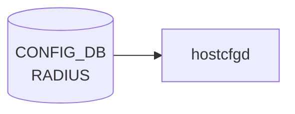

# RADIUS テーブル

## 概要

[RADIUS](../../reference/glossary.md#term-radius) クライアントのグローバル設定を保持するシングルトンテーブル[^1]。`hostcfgd` の [AAA](../../reference/glossary.md#term-aaa) ハンドラが読み、PAM (`/etc/pam.d/common-auth`) と NSS、`/etc/pam_radius_auth.conf` を生成する。サーバ固有の設定は `RADIUS_SERVER` 側にある。

<!-- cdb-mermaid -->
### データフロー (自動生成)



!!! note "凡例"
    CONFIG_DB から SAI までの典型経路を `docs/reference/config-db-orch-map.md` から機械生成したミニ図。詳細・例外は本ページ本文と対応表を参照。
<!-- /cdb-mermaid -->

## key 構造

```text
RADIUS|global
```

固定キー `global` のみのシングルトン container (`RADIUS.global`)。

## フィールド

| フィールド | 型 | デフォルト | 説明 |
|-----------|----|-----------|------|
| `passkey` | string (1..65 chars、SPACE/`#`/`,` 不可) | なし | 既定の共有秘密鍵 ([RADIUS](../../reference/glossary.md#term-radius) shared secret) |
| `auth_type` | enum `pap`/`chap`/`mschapv2` | `pap` | 既定の認証プロトコル |
| `src_ip` | `inet:ip-address` | なし | [RADIUS](../../reference/glossary.md#term-radius) パケット送信元アドレス |
| `nas_ip` | `inet:ip-address` | なし | NAS-IP-Address / NAS-IPv6-Address 属性に乗せる値 |
| `statistics` | boolean | なし | サーバ統計収集の有効化 |
| `timeout` | uint16 (1..60 秒) | `5` | 既定の応答待ちタイムアウト |
| `retransmit` | uint8 (0..10) | `3` | 既定の再送回数 |

## 制約

- `passkey` は印字可能 ASCII から SPACE/`#`/`,` を除外 (`pattern '[^ #,]*'`)
- `timeout` 範囲外は `RADIUS timeout must be 1..60` エラー
- container 名 `RADIUS` / 内部 container 名 `global`

## 購読者

- `hostcfgd` (`sonic-host-services` の [AAA](../../reference/glossary.md#term-aaa) ハンドラ): [CONFIG_DB](../../reference/glossary.md#term-config_db) → PAM / nsswitch / pam_radius 設定の再生成
- `AAA.authentication.login` が `radius` を含むとき、PAM 経由でログイン認証時に参照される

## 関連 CONFIG_DB / YANG / CLI

- 関連 [CONFIG_DB](../../reference/glossary.md#term-config_db): `RADIUS_SERVER` (※サーバごとのエントリ、[YANG](../../reference/glossary.md#term-yang): `sonic-system-radius` の同名 list), [`AAA`](aaa.md)
- 関連 CLI: `config radius { passkey | timeout | retransmit | authtype | nasip | sourceip | statistics }`
- 関連 [YANG](../../reference/glossary.md#term-yang): `sonic-system-radius`

<!-- ref-triangle:start -->

## 関連リファレンス

- [YANG](../../reference/glossary.md#term-yang): [`sonic-system-radius`](../yang/sonic-system-radius.md)
- CLI: `config radius`

<!-- ref-triangle:end -->

## 引用元

[^1]: `src/sonic-yang-models/yang-models/sonic-system-radius.yang` (container `RADIUS` / `global`、typedef `auth_type_enumeration`). <https://github.com/sonic-net/sonic-buildimage/blob/9ea932ec2e18f35e58268ec2e4456b1d4afd65cd/src/sonic-yang-models/yang-models/sonic-system-radius.yang>

## 関連ページ
- [CONFIG_DB: AAA](aaa.md)

<!-- ops-hint -->
## 運用ヒント

### 典型値

- key 形式: `RADIUS|global / RADIUS_SERVER|<ip>`。
- global: `auth_type`: `pap`、`timeout`: `5`、`retransmit`: `3`。server: `priority`, `passkey`, `vrf`。

### よくある誤設定

- auth_type を `chap` にしているのに NAS 側で pap しか喋れず認証が通らない。

### 確認コマンド

```bash
sonic-db-cli CONFIG_DB keys 'RADIUS*'
show radius
```
<!-- /ops-hint -->

<!-- value-behavior -->
## 値依存挙動マトリクス

### `auth_type` 値別挙動
| 値 | 挙動 |
|----|------|
| `pap` | PAP 平文パスワード認証（デフォルト）。PAM に `pap` で展開。`RADIUS_SERVER_AUTH_TYPE_DEFAULT = "pap"`。 |
| `chap` | CHAP チャレンジ認証。NAS 側も CHAP 対応が必要。 |
| `mschapv2` | MS-CHAPv2 認証。Active Directory 連携で主に使用。 |

### `statistics` 値別挙動
| 値 | 挙動 |
|----|------|
| `true` / `True` / `yes` / `1` | `is_true()` で True。`AAA.authentication.login` に `radius` が含まれる場合に統計サービス起動。 |
| その他すべて | False 扱い。統計サービス起動しない。 |

### `timeout` 値別挙動
| 値 | 挙動 |
|----|------|
| 1..60 | 有効範囲。pam_radius_auth.conf に反映。デフォルト `5`。 |
| 0 または 61 以上 | YANG `range "1..60"` 制約違反。ロード拒否。 |

### `retransmit` 値別挙動
| 値 | 挙動 |
|----|------|
| 0..10 | 有効範囲。再送回数として pam_radius_auth.conf に反映。デフォルト `3`。 |
| 11 以上 | YANG `range "0..10"` 制約違反。ロード拒否。 |

<!-- /value-behavior -->

<!-- cdb-exceptions -->
## 例外条件・特殊挙動

- **radius_global_update は key='global' のみ処理**: `RADIUS|global` 以外の key は無視（サイレントスキップ）。[^2]
- **データ空の場合は削除**: `radius_server_update` で `data == {}` の場合は対象サーバエントリを削除して設定ファイルを再生成する。[^2]
- **src_intf 変更時の再設定**: グローバルまたは per-server `src_intf` が参照するインタフェースの IP が変わると `modify_conf_file()` が再呼び出しされる。インタフェースが存在しない場合は pam_radius_auth.conf の `src_ip` 行が省略される。[^2]
- **modify_conf_file 失敗は syslog のみ**: テンプレート展開やサービス SIGHUP 送信に失敗しても例外はキャッチされ `LOG_ERR` / `LOG_WARNING` に記録されるだけ。設定ファイルとメモリ内 radius_servers とのずれが生じる可能性がある。[^2]
- **statistics / skip_msg_auth のブール変換**: `is_true()` で変換され `True/true/yes/1` 以外はすべて False 扱い。[^2]

[^2]: [hostcfgd](../../reference/glossary.md#term-hostcfgd) 実装: `sonic-host-services/scripts/hostcfgd`. <https://github.com/sonic-net/sonic-host-services/blob/master/scripts/hostcfgd>

<!-- ordering -->
## 書込み順依存 (Phase B)

`hostcfgd` (`AaaCfg`) は `load()` フェーズで `AAA` → `TACPLUS` / `TACPLUS_SERVER` → `RADIUS` / `RADIUS_SERVER` → `LDAP` / `LDAP_SERVER` の順に全テーブルを読み込み、最後に 1 回だけ `modify_conf_file()` を呼ぶ。runtime (subscribe) フェーズでは各テーブルのイベントごとに即時 `modify_conf_file()` が呼ばれる。このため書き込み順序が中間状態の整合性に直結する。

### 検出された順序依存

| # | 依存関係 | 方向 | 緩和策 |
|---|----------|------|--------|
| 1 | `RADIUS_SERVER` 先行 → `RADIUS\|global` 書き込み | 推奨（中間状態最小化） | runtime は subscribe 後追い自動更新 |
| 2 | `RADIUS_SERVER.src_intf` 参照インタフェース IP が `MGMT_INTERFACE` / `INTERFACE` に存在 → 先行必須 | 推奨先行 | 後追い `handle_radius_source_intf_ip_chg()` で自動更新 |
| 3 | `eth0` の IP (`get_interface_ip("eth0")`) → `nas_ip` 自動補完 | load 時 1 回解決 | `nas_ip` を明示指定すれば `eth0` IP 変化の影響を受けない |
| 4 | `DEVICE_METADATA.hostname` → `nas_id` 自動補完 | load 時 1 回解決 | runtime 追加時は hostname 設定済みであること |
| 5 | `AAA.authentication.login` に `radius` 追加 → NSS/PAM が RADIUS サーバを参照し始める | `AAA` は **後書き推奨**（サーバ登録完了後） | `AAA` 先書き時は設定反映タイムラグで一時 `local` 相当動作 |
| 6 | `RADIUS\|global` 以外の key（`global` 以外） → サイレントスキップ | — | key は常に `global` のみ |

### 主要な制約詳細

**RADIUS_SERVER 先行推奨 (依存 #1)**: `RADIUS|global` を先に書いて `RADIUS_SERVER` を後から追加する場合、`RADIUS|global` 書き込み時点では `radius_servers` が空のため `pam_radius_auth.conf` はサーバなしで生成される（実質 RADIUS 無効）。`RADIUS_SERVER` 追加後に再度 `modify_conf_file()` が呼ばれて正しい設定になる。管理接続中の設定変更では影響に留意すること（evidence: `hostcfgd:399-417`, `hostcfgd:535-545`）。

**src_intf IP 解決の順序 (依存 #2)**: `RADIUS_SERVER` / `RADIUS|global` に `src_intf` を指定した場合、`modify_conf_file()` は `get_interface_ip(src_intf)` で該当インタフェースの IP を引く。インタフェースが未設定 / IP なしの場合 `pam_radius_auth.conf` の `src_ip` 行が省略される。後から `MGMT_INTERFACE` / `INTERFACE` が設定されると `handle_radius_source_intf_ip_chg()` が自動的に `modify_conf_file()` を再呼び出しして補完するため、インタフェース設定が後追いでも最終的には整合する（evidence: `hostcfgd:495-510`）。

**nas_ip / nas_id の load 時単回解決 (依存 #3, #4)**: `modify_conf_file()` は `'nas_ip' not in radius_global` の場合に `get_interface_ip("eth0")` を呼んで eth0 の IP を nas_ip とする。`'nas_id' not in radius_global` の場合は `get_hostname()` で hostname を取得する。これらは `modify_conf_file()` 呼び出しごとに再評価されるため、runtime での `MGMT_INTERFACE` / `DEVICE_METADATA` 変更は次回の `RADIUS` イベント時に自動的に反映されるが、`RADIUS|global` に `nas_ip` / `nas_id` を明示指定すれば環境依存を排除できる（evidence: `hostcfgd:667-678`）。

**[AAA](../../reference/glossary.md#term-aaa) 後書き推奨 (依存 #5)**: `AAA.authentication.login = "radius"` を書く前に `RADIUS_SERVER` エントリを揃えること。`AAA` を先に書くと `modify_conf_file()` が RADIUS サーバなしで PAM 設定を再生成し、RADIUS サーバ追加 (`RADIUS_SERVER` 書き込み) まで既存ログインは local フォールバックで処理される（evidence: `hostcfgd:752-780`）。

<!-- /ordering -->

<!-- cross-refs -->
## 暗黙参照 — `AaaCfg` が `RADIUS` 処理時に読み出す関連テーブル (Phase C)

`hostcfgd` の `AaaCfg` は `RADIUS|global` イベントを受け取ると `radius_global_update()` でメモリ上の `self.radius_global` を更新し、即座に `modify_conf_file()` を呼ぶ。この `modify_conf_file()` は RADIUS 設定の生成に際して `RADIUS` 単体だけでなく、以下の関連テーブルを直接または間接に参照する。

### 常時結合されるテーブル (modify_conf_file 内で参照)

| テーブル | 参照タイミング | 用途 | evidence |
|---|---|---|---|
| [`RADIUS_SERVER`](radius-server.md) | 毎回 | サーバ毎の `auth_port` / `passkey` / `retransmit` / `timeout` / `src_intf` を global dict とマージ | [hostcfgd](../../reference/glossary.md#term-hostcfgd):681-695 |
| [`AAA`](aaa.md) | 毎回 | `authentication.login` に `radius` が含まれる場合のみ PAM に RADIUS 設定を反映 | [hostcfgd](../../reference/glossary.md#term-hostcfgd):752-780 |

### 動的 IP / hostname 解決 (modify_conf_file 内で get_interface_ip 経由)

`RADIUS|global` に `nas_ip` が指定されていない場合、`get_interface_ip("eth0")` を呼んで `MGMT_INTERFACE` テーブルを読み `nas_ip` を自動補完する。`nas_id` が未指定の場合は `get_hostname()` で `DEVICE_METADATA.localhost.hostname` を取得する。

| テーブル | 参照条件 | 用途 | evidence |
|---|---|---|---|
| [`MGMT_INTERFACE`](mgmt-interface.md) | `nas_ip` フィールド未指定 | `eth0` の管理 IPv4 を `nas_ip` として PAM 設定に注入 | hostcfgd:671-674 |
| [`DEVICE_METADATA`](device-metadata.md) (`localhost.hostname`) | `nas_id` フィールド未指定 | ホスト名を `nas_id` として PAM 設定に注入 | hostcfgd:675-678 |
| `INTERFACE` / `VLAN_INTERFACE` / `VLAN_SUB_INTERFACE` / `PORTCHANNEL_INTERFACE` / `LOOPBACK_INTERFACE` | `RADIUS_SERVER.src_intf` または `RADIUS.src_intf` 指定時 | 指定インタフェースの IP を `src_ip` として解決 | hostcfgd:582-614 |

### 逆方向 subscribe — RADIUS 設定を再トリガするテーブル

RADIUS 設定は `RADIUS` / `RADIUS_SERVER` テーブルのイベントだけでなく、以下の subscribe でも `modify_conf_file()` が再呼び出しされる。

| テーブル | handler | RADIUS への影響 | evidence |
|---|---|---|---|
| `MGMT_INTERFACE` | `mgmt_intf_handler` → `handle_radius_source_intf_ip_chg()` + `handle_radius_nas_ip_chg()` | eth0 IP 変化時に `src_ip` / `nas_ip` を再計算して conf 再生成 | hostcfgd:2348-2349, 2485 |
| `INTERFACE` | `phy_intf_handler` → `handle_radius_source_intf_ip_chg()` | 物理ポート IP 変化時に RADIUS `src_ip` を更新 | hostcfgd:2365, 2489 |
| `VLAN_INTERFACE` | `vlan_intf_handler` → `handle_radius_source_intf_ip_chg()` | [VLAN](../../reference/glossary.md#term-vlan) IP 変化時に RADIUS `src_ip` を更新 | hostcfgd:2369, 2486 |
| `PORTCHANNEL_INTERFACE` | `portchannel_intf_handler` → `handle_radius_source_intf_ip_chg()` | [PortChannel](../../reference/glossary.md#term-portchannel) IP 変化時に RADIUS `src_ip` を更新 | hostcfgd:2377, 2488 |
| [`DEVICE_METADATA`](device-metadata.md) | `device_metadata_handler` → `aaacfg.hostname_update()` | hostname 変化時に RADIUS `nas_id` を再生成 | hostcfgd:2280, 2492 |

> RADIUS 設定ファイル (`pam_radius_auth.conf` / `radius_nss.conf`) は `RADIUS` テーブルの変更以外にも、上記テーブルの変更で再生成される。特に `MGMT_INTERFACE` の IP 変化は `nas_ip` に影響するため、管理アドレス変更時は RADIUS 認証が一時的に中断される可能性がある。

<!-- /cross-refs -->

<!-- failure -->
## 失敗挙動 (Phase D)

`hostcfgd` の `AaaCfg.radius_global_update()` と `modify_conf_file()` (`sonic-host-services/scripts/hostcfgd`) を全行調査した結果。

### SET 処理における失敗経路

| 失敗条件 | 検出箇所 | 結果 | ログ出力 | evidence |
|---|---|---|---|---|
| `RADIUS\|<key>` で `key != 'global'` | `radius_global_update()` L528 | 内部状態更新なし・`modify_conf_file()` 呼び出しもスキップ (silent skip) | なし | `hostcfgd:527-533` |
| `statistics` に `is_true()` が失敗する値 (`True/true/yes/1` 以外) | `is_true()` L156 | `False` 扱い・`syslog LOG_ERR` で "Failed to get bool value" 出力 | LOG_ERR | `hostcfgd:156-162, 531` |
| `src_intf` に対応する IP アドレスが解決できない | `modify_conf_file()` L697-700 | `server['src_ip']` を削除して `pam_radius_auth.conf` 生成を継続 (`src_ip` 行省略) | LOG_INFO ("src_intf has no usable IP addr.") | `hostcfgd:695-700` |
| `src_intf` と `src_ip` が両方指定されている | `modify_conf_file()` L689-691 | `src_intf` 優先で IP 解決・`src_ip` を無視して処理継続 | LOG_INFO ("src_intf found. Ignoring src_ip") | `hostcfgd:687-696` |
| Jinja2 テンプレート (`pam-auth-sonic.j2`) レンダリング中に例外発生 | `modify_conf_file()` L716-731 | 例外がそのまま伝播 (catch なし) → PAM 設定ファイル未更新 | スタックトレースが syslog へ (未捕捉) | `hostcfgd:716-731` |
| PAM 設定ファイルの `open()` / `os.rename()` が `OSError` | `modify_conf_file()` L728-731 | 例外伝播・ファイル未更新 (`.tmp` ファイルが残存する場合あり) | スタックトレースが syslog へ (未捕捉) | `hostcfgd:728-731` |
| NSS RADIUS 設定ファイル (`/etc/radius_nss.conf`) の `open()` が `OSError` | `modify_conf_file()` L822 | 例外伝播 (catch なし)・`radius_nss.conf` 未更新 | スタックトレースが syslog へ (未捕捉) | `hostcfgd:820-823` |
| `pam_radius_auth.conf` ディレクトリ配下のファイル書き込みに失敗 | `modify_conf_file()` L834-837 | 例外伝播 (catch なし)・per-server PAM conf 未更新 | スタックトレースが syslog へ (未捕捉) | `hostcfgd:826-837` |
| `aaastatsd` サービスの start/stop が `CalledProcessError` | `modify_conf_file()` L846-851 | `syslog LOG_ERR` のみ・処理継続 (NSLCD 設定へ進む) | LOG_ERR ("{cmd} - failed: return code - {}, output:...") | `hostcfgd:846-851` |
| `nas_ip` 未指定かつ `eth0` に IP がない (`get_interface_ip("eth0")` が空) | `modify_conf_file()` L671-674 | `nas_ip` キーが radius_global に追加されず・PAM 設定の `nas_ip` 行が省略 | なし (silent) | `hostcfgd:671-674` |
| `nas_id` 未指定かつ `get_hostname()` が空文字を返す | `modify_conf_file()` L675-678 | `nas_id` キーが radius_global に追加されず・PAM 設定の `nas_id` 行が省略 | なし (silent) | `hostcfgd:675-678` |

### DEL 処理における失敗経路

| 失敗条件 | 検出箇所 | 結果 | ログ出力 | evidence |
|---|---|---|---|---|
| `RADIUS\|global` の DEL (`data == {}`) | `radius_global_update()` L527-533 | `self.radius_global` が空 dict `{}` にリセット → `radius_global_default` のみ有効に。`modify_conf_file()` が呼ばれ PAM 設定がデフォルト状態に再生成される | なし | `hostcfgd:527-533` |
| `RADIUS_SERVER\|<addr>` の DEL で `data == {}` | `radius_server_update()` L536-538 | `self.radius_servers` から当該エントリを削除。`modify_conf_file()` が呼ばれるが `/etc/pam_radius_auth.d/<addr>_*.conf` は**削除されない** (残留) | なし | `hostcfgd:535-545` |

### 検出ロジック補足

- **key バリデーションは `if key == 'global'` のみ**: `radius_global_update()` は `key == 'global'` 以外を silent drop する。ログ出力も例外送出もなく `modify_conf_file()` も呼ばれない (evidence: `hostcfgd:527-528`)。
- **PAM 設定の atomic 書き込み**: `modify_conf_file()` は `.tmp` ファイル経由で `os.rename()` により atomic 置換する。`os.rename()` 失敗時は `.tmp` が残存し PAM 設定は変化しない。
- **per-server conf ファイルの残留**: `RADIUS_SERVER` エントリが DEL されても `/etc/pam_radius_auth.d/<ip>_<port>.conf` は削除されない。残留ファイルは通常無害だが IP 再利用時に混乱する可能性がある。
- **`statistics` の自動縮退**: 不正値の場合でも `modify_conf_file()` が呼び出されるため PAM 設定は `statistics=False` として生成される。`aaastatsd` は stop されるだけで設定破損には至らない。

> **証跡**: `sonic-net/sonic-host-services/scripts/hostcfgd` L527-545 (`radius_global_update`/`radius_server_update`)、L641-851 (`modify_conf_file`). <https://github.com/sonic-net/sonic-host-services/blob/master/scripts/hostcfgd>
<!-- /failure -->

<!-- constants -->
## ハードコード定数 (Phase E)

`RADIUS` テーブルを処理する `hostcfgd` (`sonic-host-services/scripts/hostcfgd`) 内に存在する、[CONFIG_DB](../../reference/glossary.md#term-config_db) / YANG で管理されないハードコード定数の一覧。

### RADIUS 設定ファイルパス

| 定数 | 値 | 用途 | evidence |
|------|----|------|---------|
| `NSS_RADIUS_CONF` | `/etc/radius_nss.conf` | libnss-radius NSS 設定ファイルのパス (テンプレートから再生成) | `hostcfgd:36` |
| `NSS_RADIUS_CONF_TEMPLATE` | `/usr/share/sonic/templates/radius_nss.conf.j2` | `radius_nss.conf` 生成用 Jinja2 テンプレートのパス | `hostcfgd:37` |
| `PAM_RADIUS_AUTH_CONF_TEMPLATE` | `/usr/share/sonic/templates/pam_radius_auth.conf.j2` | `pam_radius_auth.conf` 生成用 Jinja2 テンプレートのパス | `hostcfgd:38` |
| `RADIUS_PAM_AUTH_CONF_DIR` | `/etc/pam_radius_auth.d/` | サーバごとの PAM RADIUS 設定ファイル (`{ip}_{auth_port}.conf`) を 0600 で配置するディレクトリ | `hostcfgd:97` |

> **ファイル命名規則**: サーバごとの PAM 設定ファイルは `RADIUS_PAM_AUTH_CONF_DIR + srv['ip'] + "_" + srv['auth_port'] + ".conf"` の形式で生成される (`hostcfgd:829`)。サーバ削除時にはファイルが削除されずに残留する（Phase D 参照）。

### RADIUS サーバデフォルト値

`hostcfgd` は `self.radius_global_default` dict に以下の定数を注入し、`RADIUS|global` フィールドが未指定の場合のフォールバック値として使用する (`hostcfgd:374-382`)。

| 定数 | 値 | 用途 | YANG との整合 | evidence |
|------|----|------|-------------|---------|
| `RADIUS_SERVER_AUTH_PORT_DEFAULT` | `"1812"` (UDP) | `RADIUS_SERVER.auth_port` 未指定時のデフォルト (RFC 2865 標準ポート) | YANG `RADIUS_SERVER.auth_port` の `default 1812` と一致 | `hostcfgd:92` |
| `RADIUS_SERVER_PASSKEY_DEFAULT` | `""` (空文字) | RADIUS 共有秘密鍵未指定時の fallback | YANG に default 宣言なし（空は PAM で `secret=` 行省略相当） | `hostcfgd:93` |
| `RADIUS_SERVER_RETRANSMIT_DEFAULT` | `"3"` | 再送回数デフォルト | YANG `RADIUS.global.retransmit` / `RADIUS_SERVER.retransmit` の `default 3` と一致 | `hostcfgd:94` |
| `RADIUS_SERVER_TIMEOUT_DEFAULT` | `"5"` 秒 | 応答待ちタイムアウトデフォルト | YANG `RADIUS.global.timeout` / `RADIUS_SERVER.timeout` の `default 5` と一致 | `hostcfgd:95` |
| `RADIUS_SERVER_AUTH_TYPE_DEFAULT` | `"pap"` | 認証プロトコルデフォルト | YANG `RADIUS.global.auth_type` / `RADIUS_SERVER.auth_type` の `default "pap"` と一致 | `hostcfgd:96` |
| `RADIUS_SERVER_SKIP_MSG_AUTH` | `False` | Message-Authenticator 属性スキップフラグのデフォルト | YANG に対応フィールドなし。コード定数のみ。 | `hostcfgd:98` |

### 注記

- **YANG 一致率が高い**: RADIUS テーブルは `auth_type`・`timeout`・`retransmit`・`auth_port` のデフォルト値について YANG 宣言とコード定数が完全一致している。ただし `passkey` は YANG に default なく、コードでは空文字 fallback となっており PAM 的には「認証不能」を意味するため、実運用では必ず明示指定が必要。
- **`skip_msg_auth` はコードのみ**: YANG モジュール `sonic-system-radius.yang` に `skip_msg_auth` フィールドの宣言がなく、デフォルト値 `False` はコード定数 `RADIUS_SERVER_SKIP_MSG_AUTH` のみで担保されている。CONFIG_DB から書き込まれた場合 `is_true()` で変換される (`hostcfgd:542`)。
- **`radius_global_default` のマージ順**: `modify_conf_file()` は `radius_global_default.copy()` に `self.radius_global`（CONFIG_DB の実値）を `update()` でマージするため、CONFIG_DB の値が定数を上書きする。定数は未設定フィールドの補完に限定される (`hostcfgd:661-665`)。

<!-- /constants -->

<!-- side-effects -->
## 副次書込・副次動作 (Phase F)

> 調査証跡: `meta/_intermediate/cdb-flow/radius-side-effects.md`
> ソース: `sonic-host-services/scripts/hostcfgd` L641-860 (`modify_conf_file`)

`RADIUS` の SET/DEL を受けた `hostcfgd` (`AaaCfg`) の処理経路では **[Redis](../../reference/glossary.md#term-redis) DB（[STATE_DB](../../reference/glossary.md#term-state_db) / [APPL_DB](../../reference/glossary.md#term-appl_db) / [COUNTERS_DB](../../reference/glossary.md#term-counters_db) 等）への書き込みは一切発生しない**。副次動作はすべて OS ファイルシステムへの設定ファイル再生成と systemd サービス制御。

### PAM 設定ファイル再生成

| ファイルパス | 操作 | 条件 | evidence |
|-------------|------|------|---------|
| `/etc/pam.d/common-auth-sonic` | Jinja2 テンプレートから上書き (`.tmp` 経由 atomic rename) | `RADIUS\|global` SET/DEL 時に常時 | `hostcfgd:716-731` |
| `/etc/pam.d/sshd` | `@include common-auth` → `common-auth-sonic` に置換 (または逆) | `PAM_AUTH_CONF` ファイルの存否に応じて | `hostcfgd:733-738` |
| `/etc/pam.d/login` | 同上 | 同上 | `hostcfgd:733-738` |
| `/etc/pam_radius_auth.d/<ip>_<auth_port>.conf` | 新規作成または上書き (パーミッション 0600) | `RADIUS_SERVER` エントリが存在する場合 (各サーバ 1 ファイル) | `hostcfgd:826-837` |

### NSS / RADIUS NSS 設定ファイル再生成

| ファイルパス | 操作 | 条件 | evidence |
|-------------|------|------|---------|
| `/etc/nsswitch.conf` | `passwd` / `group` / `shadow` 行の `radius` エントリを追加または削除 (`sed -i` 相当) | `AAA.authentication.login` に `radius` が含まれる場合に追加、それ以外は削除 | `hostcfgd:748-760` |
| `/etc/radius_nss.conf` | Jinja2 テンプレート (`NSS_RADIUS_CONF_TEMPLATE`) から全体再生成 | 常時 | `hostcfgd:820-823` |

### systemd サービス制御

| サービス | 操作 | 条件 | evidence |
|---------|------|------|---------|
| `aaastatsd` | `service aaastatsd start` | `AAA.authentication.login` に `radius` があり、かつ `RADIUS.statistics = True` | `hostcfgd:840-851` |
| `aaastatsd` | `service aaastatsd stop` | 上記以外のすべての場合 | `hostcfgd:840-851` |

### Redis DB への書き込み: なし

`modify_conf_file()` は `swsscommon` の `Table.set()` / `ProducerStateTable` / `ConfigDBConnector.set_entry()` を一切呼び出さない。RADIUS 処理経路は CONFIG_DB から読み取るのみで、他の [Redis](../../reference/glossary.md#term-redis) DB への書き戻しは行わない。

<!-- /side-effects -->

<!-- pubsub -->
## 通信メカニズム (Phase G)

### Redis 購読方式

`RADIUS` テーブルへの変更通知は、`hostcfgd` が **`ConfigDBConnector.subscribe()` + `listen()`** で登録する **[Redis](../../reference/glossary.md#term-redis) keyspace 通知 (PSUBSCRIBE `__keyspace@<dbId>__:RADIUS|*`)** によって配信される。`swsscommon.SubscriberStateTable` や `ConsumerStateTable` (channel ベース PUBLISH/SUBSCRIBE) は **使用しない**。CONFIG_DB は永続前提のため TTL は設定されない。

| 購読者 | 購読 API | 購読テーブル | ハンドラ |
|--------|---------|--------------|---------|
| `hostcfgd` (`AaaCfg` 経由) | `ConfigDBConnector.subscribe()` | `RADIUS` | `radius_global_handler` → `radius_global_update` |
| `hostcfgd` (`AaaCfg` 経由) | `ConfigDBConnector.subscribe()` | `RADIUS_SERVER` | `radius_server_handler` → `radius_server_update` |
| `hostcfgd` | `ConfigDBConnector.subscribe()` | `MGMT_INTERFACE` | `mgmt_intf_handler` → `handle_radius_source_intf_ip_chg` + `handle_radius_nas_ip_chg` |
| `hostcfgd` | `ConfigDBConnector.subscribe()` | `INTERFACE` | `phy_intf_handler` → `handle_radius_source_intf_ip_chg` |
| `hostcfgd` | `ConfigDBConnector.subscribe()` | `VLAN_INTERFACE` | `vlan_intf_handler` → `handle_radius_source_intf_ip_chg` |
| `hostcfgd` | `ConfigDBConnector.subscribe()` | `PORTCHANNEL_INTERFACE` | `portchannel_intf_handler` → `handle_radius_source_intf_ip_chg` |
| `hostcfgd` | `ConfigDBConnector.subscribe()` | `DEVICE_METADATA` | `device_metadata_handler` → `hostname_update` |

`hostcfgd` 以外で `RADIUS` テーブルを購読するプロセスは存在しない。`pam_radius_auth.so` は PAM 認証呼び出し時に `/etc/pam_radius_auth.conf` を直接読むのみで Redis を購読しない。

### keyspace 通知 → ハンドラ呼び出しの流れ

```
config radius passkey <secret>
  ↓ HSET "RADIUS|global" passkey "<secret>"
Redis keyspace PUBLISH "__keyspace@4__:RADIUS|global" "hset"
  ↓ ConfigDBConnector.listen() がパターンマッチ
make_callback() で (key, op, data) を生成
  ↓ HGETALL "RADIUS|global"  ← 通知後に値を再取得
radius_global_handler(key="global", op=SET, data={passkey: "..."})
  ↓ AaaCfg.radius_global_update() → modify_conf_file()
  ↓ /etc/pam_radius_auth.conf 再生成 (Jinja2 テンプレート)
  ↓ /etc/radius_nss.conf 再生成
  ↓ /etc/pam_radius_auth.d/<ip>_<port>.conf 再生成 (各サーバ)
  ↓ aaastatsd start/stop (statistics フラグに応じて)
```

- keyspace 通知のペイロードは操作名 (`hset`/`del` 等) のみ。フィールド値は `HGETALL` で取得する。
- `op` は `data is None ? DEL : SET` で 2 値判定。`HDEL` / `HSET` の Redis 操作種別自体は区別しない。
- 起動時は `config_db.listen(init_data_handler=self.load)` (hostcfgd:2528) により、Subscribe ループ開始前に `AaaCfg.load()` が `RADIUS` / `RADIUS_SERVER` / `AAA` / `TACPLUS*` / `LDAP*` を一括スナップショットで適用し、初回 `modify_conf_file()` を呼ぶ。

### 間接トリガー (`src_intf` / `nas_ip` 再計算)

`RADIUS` テーブル自体の変更以外に、以下のテーブル変更でも `RADIUS` 設定ファイルが再生成される。

| テーブル | ハンドラ | RADIUS への影響 | evidence |
|---|---|---|---|
| `MGMT_INTERFACE` | `handle_radius_source_intf_ip_chg()` + `handle_radius_nas_ip_chg()` | eth0 IP 変化時に `src_ip` / `nas_ip` を再計算して PAM 再生成 | hostcfgd:2348-2349, 2485 |
| `INTERFACE` | `handle_radius_source_intf_ip_chg()` | 物理ポート IP 変化時に `src_ip` を更新 | hostcfgd:2365, 2489 |
| `VLAN_INTERFACE` | `handle_radius_source_intf_ip_chg()` | [VLAN](../../reference/glossary.md#term-vlan) IP 変化時に `src_ip` を更新 | hostcfgd:2369, 2486 |
| `PORTCHANNEL_INTERFACE` | `handle_radius_source_intf_ip_chg()` | [PortChannel](../../reference/glossary.md#term-portchannel) IP 変化時に `src_ip` を更新 | hostcfgd:2377, 2488 |
| `DEVICE_METADATA` | `hostname_update()` | hostname 変化時に `nas_id` を再生成 | hostcfgd:2280, 2492 |

### サービス再起動トリガー

| 契機 | 操作 | evidence |
|------|------|---------|
| `RADIUS.statistics = True` かつ `AAA.authentication.login` に `radius` あり | `service aaastatsd start` | hostcfgd:840-851 |
| 上記以外のすべての場合 | `service aaastatsd stop` | hostcfgd:840-851 |
| PAM 設定ファイル書き換え | デーモン restart **なし** (PAM は次回ログイン時にファイルを読む) | hostcfgd:716-731 |

> **Evidence**: `sonic-host-services/scripts/hostcfgd:2473-2474` (RADIUS/RADIUS_SERVER subscribe)、`hostcfgd:2528` (listen/init_data_handler)、`hostcfgd:2324-2329` (`radius_global_handler`)、`hostcfgd:2317-2322` (`radius_server_handler`)、`hostcfgd:527-545` (`radius_global_update`/`radius_server_update`)、`hostcfgd:641-851` (`modify_conf_file`)
<!-- /pubsub -->

<!-- platform -->
## プラットフォーム差 (Phase H)

**プラットフォーム差なし**: RADIUS は SSH / コンソール認証のコントロールプレーン処理であり、[SAI](../../reference/glossary.md#term-sai) 非経由。[ASIC](../../reference/glossary.md#term-asic) 種別・multi-asic / [VOQ](../../reference/glossary.md#term-voq) chassis 構成・ベンダーに依らない。

> 調査証跡: `meta/_intermediate/cdb-flow/radius-platform.md`

| 観点 | 結果 | 根拠 |
|------|------|------|
| [ASIC](../../reference/glossary.md#term-asic) 種別 (Broadcom / Mellanox / Marvell 等) | 影響なし | `hostcfgd` の RADIUS ハンドラは [SAI](../../reference/glossary.md#term-sai) API を呼び出さない。PAM / NSS 設定ファイルの生成のみ (`hostcfgd:527-545, 641-851`) |
| multi-asic (`is_multi_npu() == True`) | 影響なし | `hostcfgd` は `ConfigDBConnector()` (引数なし) で host 単体の CONFIG_DB のみを購読する。`asicN` namespace を iterate しない (`hostcfgd:2166-2185`)。RADIUS は per-host 認証のため namespace 分割は無関係 |
| [VOQ](../../reference/glossary.md#term-voq) chassis (supervisor + line cards) | 各 host で独立適用 | RADIUS テーブルは host scope。chassis 全体での集中認証機構はなく、各 line card host で `hostcfgd` が独立に PAM 設定を再生成する |
| ベンダー固有 PAM モジュール | なし | community master の RADIUS スタックは `pam_radius_auth.so` (Debian 標準パッケージ)。`sonic-buildimage` の `files/image_config/` にベンダー向け hook 注入箇所なし |
| [SmartSwitch](../../reference/glossary.md#term-smartswitch) ([NPU](../../reference/glossary.md#term-npu) + [DPU](../../reference/glossary.md#term-dpu) 構成) | 影響なし | RADIUS は管理プレーン認証。[DPU](../../reference/glossary.md#term-dpu) 側の [orchagent](../../reference/glossary.md#term-orchagent) / [SAI](../../reference/glossary.md#term-sai) は参照しない。`DPU` テーブルに RADIUS 関連フィールドなし |
| Jinja2 テンプレート内のプラットフォーム分岐 | なし | `pam_radius_auth.conf.j2` / `radius_nss.conf.j2` を `platform|asic|chassis|namespace|vendor` で grep して 0 ヒット。分岐は `auth_type` / `src_ip` / `vrf_name` / `statistics` フィールド値のみ |

<!-- evidence: sonic-host-services/scripts/hostcfgd:527-545 (radius_global_update — SAI 呼び出しなし) -->
<!-- evidence: sonic-host-services/scripts/hostcfgd:2166-2185 (hostcfgd main — multi-asic 無考慮) -->
<!-- /platform -->

<!-- defaults -->
## コード由来の暗黙デフォルト・Fallback

hostcfgd の `RadiusCfg` は `self.radius_global_default` というモジュール定数由来の dict を保持し、`modify_conf_file()` で `radius_global_default.copy()` → `update(self.radius_global)` の順にマージしてから `pam_radius_auth.conf` / `radius_nss.conf` を生成する。このため `RADIUS|global` に該当キーが書かれていなくても、以下の値が PAM 設定に反映される。

### `auth_type` — コード `"pap"` + YANG `default "pap"`

`RADIUS_SERVER_AUTH_TYPE_DEFAULT = "pap"` (`hostcfgd:96`) が `radius_global_default['auth_type']` (`hostcfgd:377`) に設定される。YANG `sonic-system-radius.yang` の `default "pap"` 宣言と二重で一致しており、DB absent でも CLI 未指定でも `pap` で PAM テンプレートに展開される。

### `timeout` — コード `"5"` 秒 + YANG `default 5`

`RADIUS_SERVER_TIMEOUT_DEFAULT = "5"` (`hostcfgd:95`) が `radius_global_default['timeout']` (`hostcfgd:379`) に設定。YANG `default 5` と一致。`pam_radius_auth.conf` の応答待ち秒数として書き込まれる。

### `retransmit` — コード `"3"` 回 + YANG `default 3`

`RADIUS_SERVER_RETRANSMIT_DEFAULT = "3"` (`hostcfgd:94`) が `radius_global_default['retransmit']` (`hostcfgd:378`) に設定。YANG `default 3` と一致。

### `auth_port` — コードのみの fallback `"1812"`

`RADIUS_SERVER_AUTH_PORT_DEFAULT = "1812"` (`hostcfgd:92`) が `radius_global_default['auth_port']` (`hostcfgd:376`) に注入される。`RADIUS` global container 側の YANG には `auth_port` は宣言されていない（フィールドは `RADIUS_SERVER` 側）が、hostcfgd は global default dict にこの値を一括で持っているため、PAM 設定生成時にサーバごとの `auth_port` が未指定ならこの値が使われる。コード由来のみで担保される fallback。

### `passkey` — コード `""` (空文字)

`RADIUS_SERVER_PASSKEY_DEFAULT = ""` (`hostcfgd:93`) が `radius_global_default['passkey']` (`hostcfgd:380`) に設定。空文字は PAM 設定で `secret=` 行が省略される動作に相当し、サーバごとの passkey 上書きが無い場合は認証が成立しない設定となる（YANG-実装 discrepancy: YANG は `passkey` を `RADIUS` global の任意フィールドとして許容するが、値なし時のフォールバックは空文字でありそのまま使うと PAM が認証拒否する）。

> **Evidence**: `sonic-host-services/scripts/hostcfgd:92-96` (モジュール定数)、`:374-382` (`self.radius_global_default` 構築)。SHA `c5bbbe8b07b96f078fa4b761316627404b01bd04`。詳細は `meta/_intermediate/cdb-flow/radius-defaults.md` を参照。
<!-- /defaults -->

<!-- derivation -->
## 派生・条件付き登録 (Phase 6/7)

### Phase 6: 自動派生

hostcfgd が `RADIUS` テーブルを読み、未設定フィールドに PAM のデフォルト値を補完する。`auth_type` 未設定 → `pap`、`auth_port` 未設定 → `1812`、`timeout` 未設定 → `5`、`retransmit` 未設定 → `3`。これらはデフォルト値による自動補完（Phase 6 相当）。

### Phase 7: 条件付き登録 (add_manager 条件)

hostcfgd は常時起動し `RADIUS` テーブルを無条件購読する。ただし `aaa.authentication.login` に `radius` が含まれない場合、RADIUS サーバ設定があっても PAM に反映されない。

<!-- /derivation -->

<!-- handler-branching -->
### Phase 8: Handler メソッド内分岐

| Handler | 分岐条件 | 効果 | evidence |
|---|---|---|---|
| `hostcfgd` RADIUS handler | `auth_type==chap` | PAM に chap オプションを追加 | `hostcfgd.py` |
| `hostcfgd` RADIUS handler | `auth_type==mschapv2` | PAM に mschapv2 オプションを追加 | `hostcfgd.py` |
| `hostcfgd` RADIUS handler | `auth_type==pap` (デフォルト) | PAM に pap 設定 | `hostcfgd.py` |
| `hostcfgd` RADIUS handler | `src_ip` あり | `source_ip=<src_ip>` を PAM 設定に追加 | `hostcfgd.py` |
| `hostcfgd` RADIUS handler | `vrf_name` あり | `vrf=<vrf_name>` を PAM 設定に追加 | `hostcfgd.py` |
| `hostcfgd` RADIUS handler | `passkey` フィールドあり | `secret=<passkey>` を設定 | `hostcfgd.py` |

> **スキャン証跡**: `RADIUS` テーブルは PAM/NSS 設定ファイル生成のための入力。hostcfgd が `RADIUS` + `RADIUS_SERVER` + `AAA` を合わせて処理する。デフォルト値補完が Phase 6 派生相当。

<!-- /handler-branching -->

<!-- runtime-trace -->
## CDB → 実コンテナ動作トレース

### 段階 1: Consumer 登録

- **hostcfgd**: `RADIUS` / `RADIUS_SERVER` テーブルを `ConfigDBConnector` で購読。

### 段階 2: CFG → APPL 翻訳

- hostcfgd の `radiusHandler` が PAM / AAA 設定ファイル (`/etc/pam.d/`, `/etc/freeradius/`) を更新し、認証デーモンを再起動。
- APP_DB への書き込みなし。

### 段階 3: APPL → SAI

- SAI 経由なし。RADIUS は SSH/コンソール認証のコントロールプレーン処理。

### 段階 4: タイミング + 副作用

- 設定反映は hostcfgd が PAM 設定を書き換えた直後から有効。既存 SSH セッションは影響なし (新規ログインから適用)。
- 副作用: RADIUS サーバが到達不能の場合は `auth_type=local` フォールバックの有無に注意。

<!-- /runtime-trace -->
<!-- entry-points -->
## 書き込み入り口 (Direction A)

RADIUS / RADIUS_SERVER テーブルへの書き込みが発生するコード経路を網羅的に調査した結果。

### CLI

  - `config radius add/del/set ...` — `config/aaa.py` が RADIUS_SERVER を書き込む ([sonic-utilities](../../reference/glossary.md#term-sonic-utilities)/config/aaa.py)

### minigraph / sonic-cfggen

minigraph.py に RADIUS テーブル生成なし

### REST / gNMI

REST/[gNMI](../../reference/glossary.md#term-gnmi) 書き込み経路なし

### db_migrator

db_migrator.py での RADIUS マイグレーションなし

### ビルド時デフォルト (build-time default)

なし

### ハードコードデフォルト / ランタイム注入

**sonic-host-services** `data/templates/radius_nss.conf.j2` が RADIUS テーブルを参照して NSS 設定を生成 (読み取り側)

### 死活・デッドコード

なし
<!-- /entry-points -->

<!-- glossary-links-injected: 841e6cdca746 -->
