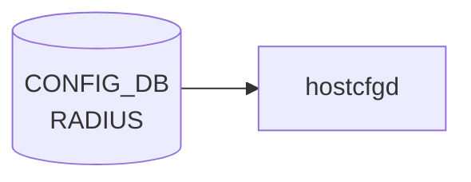

# RADIUS テーブル

## 概要

RADIUS クライアントのグローバル設定を保持するシングルトンテーブル[^1]。`hostcfgd` の [AAA](../../reference/glossary.md#term-aaa) ハンドラが読み、PAM (`/etc/pam.d/common-auth`) と NSS、`/etc/pam_radius_auth.conf` を生成する。サーバ固有の設定は `RADIUS_SERVER` 側にある。

<!-- cdb-mermaid -->
### データフロー (自動生成)



!!! note "凡例"
    CONFIG_DB から SAI までの典型経路を `docs/reference/config-db-orch-map.md` から機械生成したミニ図。詳細・例外は本ページ本文と対応表を参照。
<!-- /cdb-mermaid -->

## key 構造

```text
RADIUS|global
```

固定キー `global` のみのシングルトン container (`RADIUS.global`)。

## フィールド

| フィールド | 型 | デフォルト | 説明 |
|-----------|----|-----------|------|
| `passkey` | string (1..65 chars、SPACE/`#`/`,` 不可) | なし | 既定の共有秘密鍵 (RADIUS shared secret) |
| `auth_type` | enum `pap`/`chap`/`mschapv2` | `pap` | 既定の認証プロトコル |
| `src_ip` | `inet:ip-address` | なし | RADIUS パケット送信元アドレス |
| `nas_ip` | `inet:ip-address` | なし | NAS-IP-Address / NAS-IPv6-Address 属性に乗せる値 |
| `statistics` | boolean | なし | サーバ統計収集の有効化 |
| `timeout` | uint16 (1..60 秒) | `5` | 既定の応答待ちタイムアウト |
| `retransmit` | uint8 (0..10) | `3` | 既定の再送回数 |

## 制約

- `passkey` は印字可能 ASCII から SPACE/`#`/`,` を除外 (`pattern '[^ #,]*'`)
- `timeout` 範囲外は `RADIUS timeout must be 1..60` エラー
- container 名 `RADIUS` / 内部 container 名 `global`

## 購読者

- `hostcfgd` (`sonic-host-services` の [AAA](../../reference/glossary.md#term-aaa) ハンドラ): [CONFIG_DB](../../reference/glossary.md#term-config_db) → PAM / nsswitch / pam_radius 設定の再生成
- `AAA.authentication.login` が `radius` を含むとき、PAM 経由でログイン認証時に参照される

## 関連 CONFIG_DB / YANG / CLI

- 関連 [CONFIG_DB](../../reference/glossary.md#term-config_db): `RADIUS_SERVER` (※サーバごとのエントリ、[YANG](../../reference/glossary.md#term-yang): `sonic-system-radius` の同名 list), [`AAA`](aaa.md)
- 関連 CLI: `config radius { passkey | timeout | retransmit | authtype | nasip | sourceip | statistics }`
- 関連 [YANG](../../reference/glossary.md#term-yang): `sonic-system-radius`

<!-- ref-triangle:start -->

## 関連リファレンス

- [YANG](../../reference/glossary.md#term-yang): [`sonic-system-radius`](../yang/sonic-system-radius.md)
- CLI: `config radius`

<!-- ref-triangle:end -->

## 引用元

[^1]: `src/sonic-yang-models/yang-models/sonic-system-radius.yang` (container `RADIUS` / `global`、typedef `auth_type_enumeration`). <https://github.com/sonic-net/sonic-buildimage/blob/9ea932ec2e18f35e58268ec2e4456b1d4afd65cd/src/sonic-yang-models/yang-models/sonic-system-radius.yang>

## 関連ページ
- [CONFIG_DB: AAA](aaa.md)

<!-- ops-hint -->
## 運用ヒント

### 典型値

- key 形式: `RADIUS|global / RADIUS_SERVER|<ip>`。
- global: `auth_type`: `pap`、`timeout`: `5`、`retransmit`: `3`。server: `priority`, `passkey`, `vrf`。

### よくある誤設定

- auth_type を `chap` にしているのに NAS 側で pap しか喋れず認証が通らない。

### 確認コマンド

```bash
sonic-db-cli CONFIG_DB keys 'RADIUS*'
show radius
```
<!-- /ops-hint -->

<!-- glossary-links-injected: 213d79b8c3ff -->
