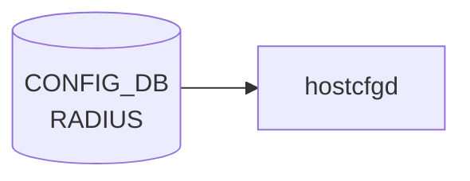

# RADIUS テーブル

## 概要

RADIUS クライアントのグローバル設定を保持するシングルトンテーブル[^1]。`hostcfgd` の [AAA](../../reference/glossary.md#term-aaa) ハンドラが読み、PAM (`/etc/pam.d/common-auth`) と NSS、`/etc/pam_radius_auth.conf` を生成する。サーバ固有の設定は `RADIUS_SERVER` 側にある。

<!-- cdb-mermaid -->
### データフロー (自動生成)



!!! note "凡例"
    CONFIG_DB から SAI までの典型経路を `docs/reference/config-db-orch-map.md` から機械生成したミニ図。詳細・例外は本ページ本文と対応表を参照。
<!-- /cdb-mermaid -->

## key 構造

```text
RADIUS|global
```

固定キー `global` のみのシングルトン container (`RADIUS.global`)。

## フィールド

| フィールド | 型 | デフォルト | 説明 |
|-----------|----|-----------|------|
| `passkey` | string (1..65 chars、SPACE/`#`/`,` 不可) | なし | 既定の共有秘密鍵 (RADIUS shared secret) |
| `auth_type` | enum `pap`/`chap`/`mschapv2` | `pap` | 既定の認証プロトコル |
| `src_ip` | `inet:ip-address` | なし | RADIUS パケット送信元アドレス |
| `nas_ip` | `inet:ip-address` | なし | NAS-IP-Address / NAS-IPv6-Address 属性に乗せる値 |
| `statistics` | boolean | なし | サーバ統計収集の有効化 |
| `timeout` | uint16 (1..60 秒) | `5` | 既定の応答待ちタイムアウト |
| `retransmit` | uint8 (0..10) | `3` | 既定の再送回数 |

## 制約

- `passkey` は印字可能 ASCII から SPACE/`#`/`,` を除外 (`pattern '[^ #,]*'`)
- `timeout` 範囲外は `RADIUS timeout must be 1..60` エラー
- container 名 `RADIUS` / 内部 container 名 `global`

## 購読者

- `hostcfgd` (`sonic-host-services` の [AAA](../../reference/glossary.md#term-aaa) ハンドラ): [CONFIG_DB](../../reference/glossary.md#term-config_db) → PAM / nsswitch / pam_radius 設定の再生成
- `AAA.authentication.login` が `radius` を含むとき、PAM 経由でログイン認証時に参照される

## 関連 CONFIG_DB / YANG / CLI

- 関連 [CONFIG_DB](../../reference/glossary.md#term-config_db): `RADIUS_SERVER` (※サーバごとのエントリ、[YANG](../../reference/glossary.md#term-yang): `sonic-system-radius` の同名 list), [`AAA`](aaa.md)
- 関連 CLI: `config radius { passkey | timeout | retransmit | authtype | nasip | sourceip | statistics }`
- 関連 [YANG](../../reference/glossary.md#term-yang): `sonic-system-radius`

<!-- ref-triangle:start -->

## 関連リファレンス

- [YANG](../../reference/glossary.md#term-yang): [`sonic-system-radius`](../yang/sonic-system-radius.md)
- CLI: `config radius`

<!-- ref-triangle:end -->

## 引用元

[^1]: `src/sonic-yang-models/yang-models/sonic-system-radius.yang` (container `RADIUS` / `global`、typedef `auth_type_enumeration`). <https://github.com/sonic-net/sonic-buildimage/blob/9ea932ec2e18f35e58268ec2e4456b1d4afd65cd/src/sonic-yang-models/yang-models/sonic-system-radius.yang>

## 関連ページ
- [CONFIG_DB: AAA](aaa.md)

<!-- ops-hint -->
## 運用ヒント

### 典型値

- key 形式: `RADIUS|global / RADIUS_SERVER|<ip>`。
- global: `auth_type`: `pap`、`timeout`: `5`、`retransmit`: `3`。server: `priority`, `passkey`, `vrf`。

### よくある誤設定

- auth_type を `chap` にしているのに NAS 側で pap しか喋れず認証が通らない。

### 確認コマンド

```bash
sonic-db-cli CONFIG_DB keys 'RADIUS*'
show radius
```
<!-- /ops-hint -->

<!-- value-behavior -->
## 値依存挙動マトリクス

### `auth_type` 値別挙動
| 値 | 挙動 |
|----|------|
| `pap` | PAP 平文パスワード認証（デフォルト）。PAM に `pap` で展開。`RADIUS_SERVER_AUTH_TYPE_DEFAULT = "pap"`。 |
| `chap` | CHAP チャレンジ認証。NAS 側も CHAP 対応が必要。 |
| `mschapv2` | MS-CHAPv2 認証。Active Directory 連携で主に使用。 |

### `statistics` 値別挙動
| 値 | 挙動 |
|----|------|
| `true` / `True` / `yes` / `1` | `is_true()` で True。`AAA.authentication.login` に `radius` が含まれる場合に統計サービス起動。 |
| その他すべて | False 扱い。統計サービス起動しない。 |

### `timeout` 値別挙動
| 値 | 挙動 |
|----|------|
| 1..60 | 有効範囲。pam_radius_auth.conf に反映。デフォルト `5`。 |
| 0 または 61 以上 | YANG `range "1..60"` 制約違反。ロード拒否。 |

### `retransmit` 値別挙動
| 値 | 挙動 |
|----|------|
| 0..10 | 有効範囲。再送回数として pam_radius_auth.conf に反映。デフォルト `3`。 |
| 11 以上 | YANG `range "0..10"` 制約違反。ロード拒否。 |

<!-- /value-behavior -->

<!-- cdb-exceptions -->
## 例外条件・特殊挙動

- **radius_global_update は key='global' のみ処理**: `RADIUS|global` 以外の key は無視（サイレントスキップ）。[^2]
- **データ空の場合は削除**: `radius_server_update` で `data == {}` の場合は対象サーバエントリを削除して設定ファイルを再生成する。[^2]
- **src_intf 変更時の再設定**: グローバルまたは per-server `src_intf` が参照するインタフェースの IP が変わると `modify_conf_file()` が再呼び出しされる。インタフェースが存在しない場合は pam_radius_auth.conf の `src_ip` 行が省略される。[^2]
- **modify_conf_file 失敗は syslog のみ**: テンプレート展開やサービス SIGHUP 送信に失敗しても例外はキャッチされ `LOG_ERR` / `LOG_WARNING` に記録されるだけ。設定ファイルとメモリ内 radius_servers とのずれが生じる可能性がある。[^2]
- **statistics / skip_msg_auth のブール変換**: `is_true()` で変換され `True/true/yes/1` 以外はすべて False 扱い。[^2]

[^2]: [hostcfgd](../../reference/glossary.md#term-hostcfgd) 実装: `sonic-host-services/scripts/hostcfgd`. <https://github.com/sonic-net/sonic-host-services/blob/master/scripts/hostcfgd>


<!-- defaults -->
## コード由来の暗黙デフォルト・Fallback

hostcfgd の `RadiusCfg` は `self.radius_global_default` というモジュール定数由来の dict を保持し、`modify_conf_file()` で `radius_global_default.copy()` → `update(self.radius_global)` の順にマージしてから `pam_radius_auth.conf` / `radius_nss.conf` を生成する。このため `RADIUS|global` に該当キーが書かれていなくても、以下の値が PAM 設定に反映される。

### `auth_type` — コード `"pap"` + YANG `default "pap"`

`RADIUS_SERVER_AUTH_TYPE_DEFAULT = "pap"` (`hostcfgd:96`) が `radius_global_default['auth_type']` (`hostcfgd:377`) に設定される。YANG `sonic-system-radius.yang` の `default "pap"` 宣言と二重で一致しており、DB absent でも CLI 未指定でも `pap` で PAM テンプレートに展開される。

### `timeout` — コード `"5"` 秒 + YANG `default 5`

`RADIUS_SERVER_TIMEOUT_DEFAULT = "5"` (`hostcfgd:95`) が `radius_global_default['timeout']` (`hostcfgd:379`) に設定。YANG `default 5` と一致。`pam_radius_auth.conf` の応答待ち秒数として書き込まれる。

### `retransmit` — コード `"3"` 回 + YANG `default 3`

`RADIUS_SERVER_RETRANSMIT_DEFAULT = "3"` (`hostcfgd:94`) が `radius_global_default['retransmit']` (`hostcfgd:378`) に設定。YANG `default 3` と一致。

### `auth_port` — コードのみの fallback `"1812"`

`RADIUS_SERVER_AUTH_PORT_DEFAULT = "1812"` (`hostcfgd:92`) が `radius_global_default['auth_port']` (`hostcfgd:376`) に注入される。`RADIUS` global container 側の YANG には `auth_port` は宣言されていない（フィールドは `RADIUS_SERVER` 側）が、hostcfgd は global default dict にこの値を一括で持っているため、PAM 設定生成時にサーバごとの `auth_port` が未指定ならこの値が使われる。コード由来のみで担保される fallback。

### `passkey` — コード `""` (空文字)

`RADIUS_SERVER_PASSKEY_DEFAULT = ""` (`hostcfgd:93`) が `radius_global_default['passkey']` (`hostcfgd:380`) に設定。空文字は PAM 設定で `secret=` 行が省略される動作に相当し、サーバごとの passkey 上書きが無い場合は認証が成立しない設定となる（YANG-実装 discrepancy: YANG は `passkey` を `RADIUS` global の任意フィールドとして許容するが、値なし時のフォールバックは空文字でありそのまま使うと PAM が認証拒否する）。

> **Evidence**: `sonic-host-services/scripts/hostcfgd:92-96` (モジュール定数)、`:374-382` (`self.radius_global_default` 構築)。SHA `c5bbbe8b07b96f078fa4b761316627404b01bd04`。詳細は `meta/_intermediate/cdb-flow/radius-defaults.md` を参照。
<!-- /defaults -->


<!-- derivation -->
## 派生・条件付き登録 (Phase 6/7)

### Phase 6: 自動派生

hostcfgd が `RADIUS` テーブルを読み、未設定フィールドに PAM のデフォルト値を補完する。`auth_type` 未設定 → `pap`、`auth_port` 未設定 → `1812`、`timeout` 未設定 → `5`、`retransmit` 未設定 → `3`。これらはデフォルト値による自動補完（Phase 6 相当）。

### Phase 7: 条件付き登録 (add_manager 条件)

hostcfgd は常時起動し `RADIUS` テーブルを無条件購読する。ただし `aaa.authentication.login` に `radius` が含まれない場合、RADIUS サーバー設定があっても PAM に反映されない。

<!-- /derivation -->

<!-- handler-branching -->
### Phase 8: Handler メソッド内分岐

| Handler | 分岐条件 | 効果 | evidence |
|---|---|---|---|
| `hostcfgd` RADIUS handler | `auth_type==chap` | PAM に chap オプションを追加 | `hostcfgd.py` |
| `hostcfgd` RADIUS handler | `auth_type==mschapv2` | PAM に mschapv2 オプションを追加 | `hostcfgd.py` |
| `hostcfgd` RADIUS handler | `auth_type==pap` (デフォルト) | PAM に pap 設定 | `hostcfgd.py` |
| `hostcfgd` RADIUS handler | `src_ip` あり | `source_ip=<src_ip>` を PAM 設定に追加 | `hostcfgd.py` |
| `hostcfgd` RADIUS handler | `vrf_name` あり | `vrf=<vrf_name>` を PAM 設定に追加 | `hostcfgd.py` |
| `hostcfgd` RADIUS handler | `passkey` フィールドあり | `secret=<passkey>` を設定 | `hostcfgd.py` |

> **スキャン証跡**: `RADIUS` テーブルは PAM/NSS 設定ファイル生成のための入力。hostcfgd が `RADIUS` + `RADIUS_SERVER` + `AAA` を合わせて処理する。デフォルト値補完が Phase 6 派生相当。

<!-- /handler-branching -->

<!-- runtime-trace -->
## CDB → 実コンテナ動作トレース

### 段階 1: Consumer 登録

- **hostcfgd**: `RADIUS` / `RADIUS_SERVER` テーブルを `ConfigDBConnector` で購読。

### 段階 2: CFG → APPL 翻訳

- hostcfgd の `radiusHandler` が PAM / AAA 設定ファイル (`/etc/pam.d/`, `/etc/freeradius/`) を更新し、認証デーモンを再起動。
- APP_DB への書き込みなし。

### 段階 3: APPL → SAI

- SAI 経由なし。RADIUS は SSH/コンソール認証のコントロールプレーン処理。

### 段階 4: タイミング + 副作用

- 設定反映は hostcfgd が PAM 設定を書き換えた直後から有効。既存 SSH セッションは影響なし (新規ログインから適用)。
- 副作用: RADIUS サーバが到達不能の場合は `auth_type=local` フォールバックの有無に注意。

<!-- /runtime-trace -->
<!-- entry-points -->
## 書き込み入り口 (Direction A)

RADIUS / RADIUS_SERVER テーブルへの書き込みが発生するコード経路を網羅的に調査した結果。

### CLI

  - `config radius add/del/set ...` — `config/aaa.py` が RADIUS_SERVER を書き込む (sonic-utilities/config/aaa.py)

### minigraph / sonic-cfggen

minigraph.py に RADIUS テーブル生成なし

### REST / gNMI

REST/gNMI 書き込み経路なし

### db_migrator

db_migrator.py での RADIUS マイグレーションなし

### ビルド時デフォルト (build-time default)

なし

### ハードコードデフォルト / ランタイム注入

**sonic-host-services** `data/templates/radius_nss.conf.j2` が RADIUS テーブルを参照して NSS 設定を生成 (読み取り側)

### 死活・デッドコード

なし
<!-- /entry-points -->

<!-- glossary-links-injected: 9bd150521228 -->
