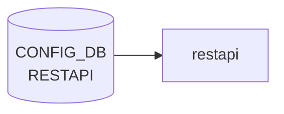

# RESTAPI テーブル

## 概要

`go-server-server` ベースの SONiC REST API (`docker-sonic-restapi`) の TLS 設定とランタイム挙動を保持するテーブル[^1]。`certs` (証明書パス群) と `config` (動作モード) の 2 つのシングルトン container から構成される。

<!-- cdb-mermaid -->
### データフロー (自動生成)



!!! note "凡例"
    CONFIG_DB から SAI までの典型経路を `docs/reference/config-db-orch-map.md` から機械生成したミニ図。詳細・例外は本ページ本文と対応表を参照。
<!-- /cdb-mermaid -->

## key 構造

```text
RESTAPI|certs
RESTAPI|config
```

container `RESTAPI` の下に固定キー `certs` / `config` の 2 シングルトン。

## フィールド

### `RESTAPI|certs`

| フィールド | 型 | 説明 |
|-----------|----|------|
| `ca_crt` | string (path pattern `(/[a-zA-Z0-9_-]+)*/([a-zA-Z0-9_-]+).([a-z]+)`) | CA 証明書のローカルパス |
| `server_crt` | string (`*.crt` パス) | サーバ証明書 |
| `server_key` | string (`*.key` パス) | サーバ秘密鍵 |
| `client_crt_cname` | string (カンマ区切り CN リスト、ワイルドカード可) | クライアント証明書許可 CN リスト |

### `RESTAPI|config`

| フィールド | 型 | デフォルト | 説明 |
|-----------|----|-----------|------|
| `client_auth` | boolean | `true` | クライアント証明書認証の要求 |
| `log_level` | enum `trace`/`info` | なし | コンテナログレベル |
| `allow_insecure` | boolean | `false` | 平文 (HTTP) 接続の許可 |

## 制約

- `ca_crt` / `server_crt` / `server_key` / `client_crt_cname` はそれぞれ厳密な正規表現でパス / CN 形式を制約
- 既定では `client_auth = true` / `allow_insecure = false` のため、相互 TLS が必須[^1]

## 購読者

- `docker-sonic-restapi` の起動スクリプト: [CONFIG_DB](../../reference/glossary.md#term-config_db) → `go-server-server` 起動引数 / 環境変数 / 証明書パスを設定

## 関連 CONFIG_DB / YANG / CLI

- 関連 [CONFIG_DB](../../reference/glossary.md#term-config_db): なし (`FEATURE.restapi` で有効化される)
- CLI: 標準 CLI ラッパなし。`config restapi` 系コマンドは未提供 ([CONFIG_DB](../../reference/glossary.md#term-config_db) 直接編集または init_cfg 経由)
- 関連 [YANG](../../reference/glossary.md#term-yang): `sonic-restapi`

<!-- ref-triangle:start -->

## 関連リファレンス

- [YANG](../../reference/glossary.md#term-yang): [`sonic-restapi`](../yang/sonic-restapi.md)

<!-- ref-triangle:end -->

## 引用元

[^1]: `src/sonic-yang-models/yang-models/sonic-restapi.yang` (container `RESTAPI` / `certs` / `config`). <https://github.com/sonic-net/sonic-buildimage/blob/9ea932ec2e18f35e58268ec2e4456b1d4afd65cd/src/sonic-yang-models/yang-models/sonic-restapi.yang>

## 関連ページ
- [CONFIG_DB: FEATURE](feature.md)

<!-- ops-hint -->
## 運用ヒント

### 典型値

- key 形式: `RESTAPI|certs / config`。
- `client_auth`: `true`、`log_level`: `info`、`server_crt`/`server_key`: パス。

### よくある誤設定

- client_auth=true で client CA を入れ忘れると 401 が出続ける。

### 確認コマンド

```bash
sonic-db-cli CONFIG_DB keys 'RESTAPI|*'
systemctl status restapi
```
<!-- /ops-hint -->

<!-- value-behavior -->
## 値依存挙動マトリクス

### `client_auth` 値別挙動
| 値 | 挙動 |
|----|------|
| `true` | クライアント証明書認証必須（mTLS）。デフォルト。`client_crt_cname` の CN 検証も実施。 |
| `false` | クライアント証明書不要。サーバ証明書のみ検証。 |

### `log_level` 値別挙動
| 値 | 挙動 |
|----|------|
| `trace` | 詳細ログ出力（デバッグ用）。 |
| `info` | 通常ログ。 |
| その他 | [YANG](../../reference/glossary.md#term-yang) `pattern "trace|info"` 制約違反でバリデーション拒否。（enum 定義なし、文字列 pattern 制約） |

### `allow_insecure` 値別挙動
| 値 | 挙動 |
|----|------|
| `false` | HTTP 平文接続不可（デフォルト）。HTTPS のみ許可。 |
| `true` | HTTP 平文接続を許可。テスト環境向け。 |

<!-- /value-behavior -->

<!-- cdb-exceptions -->
## 例外条件・特殊挙動

- **TLS パス pattern 制約**: `ca_crt` / `server_crt` / `server_key` は YANG の `pattern` 制約でファイルパス形式のみ受け入れる。パターン違反は sonic-yang バリデーション時に拒否される。[^2]
- **client_crt_cname のワイルドカード制約**: ワイルドカード (`*.domain`) 表記は許可されるが、カンマ末尾や空白を含む場合は `Pattern` エラーで拒否される。[^2]
- **log_level は trace/info のみ**: YANG `pattern "trace|info"` 制約。それ以外の値はバリデーション拒否。[^2]
- **runtime 読み込みは起動時のみ**: RESTAPI テーブルの変更は `docker-sonic-restapi` コンテナ再起動まで反映されない（hot reload 未対応）。[^2]
- **証明書ファイルの実在チェックなし**: `server_crt` 等のパスが存在しないファイルを指していても CONFIG_DB レベルでは検知されない。サーバ起動時に失敗する。[^2]

[^2]: YANG 定義: `sonic-restapi.yang`. <https://github.com/sonic-net/sonic-buildimage/blob/master/src/sonic-yang-models/yang-models/sonic-restapi.yang>


<!-- runtime-trace -->
## CDB → 実コンテナ動作トレース

### 段階 1: Consumer 登録

- **hostcfgd**: `RESTAPI` テーブルを `ConfigDBConnector` で購読。

### 段階 2: CFG → APPL 翻訳

- hostcfgd が REST API サービス (sonic-restapi / sonic-gnmi) の有効・無効設定を `/etc/sonic/` に書き込む。
- APP_DB への書き込みなし。

### 段階 3: APPL → SAI

- SAI 経由なし。REST API は管理プレーン機能。

### 段階 4: タイミング + 副作用

- hostcfgd が設定を反映後、対象サービスが再起動されるまで数秒。
- 副作用: REST API 無効化中に自動化スクリプトが接続しようとするとタイムアウトが発生。

<!-- /runtime-trace -->
<!-- entry-points -->
## 書き込み入り口 (Direction A)

RESTAPI テーブルへの書き込みが発生するコード経路を網羅的に調査した結果。

### CLI

  - 専用 CLI なし

### minigraph / sonic-cfggen

**minigraph.py** が `results['RESTAPI']` に REST API 設定を投入 (sonic-buildimage/src/sonic-config-engine/minigraph.py:2689)

### REST / gNMI

REST/gNMI 書き込み経路なし

### db_migrator

**db_migrator.py** が RESTAPI のマイグレーション処理 (`config` / `certs` サブキー) を実装 (sonic-utilities/scripts/db_migrator.py:609–619)

### ビルド時デフォルト (build-time default)

なし

### ハードコードデフォルト / ランタイム注入

なし

### 死活・デッドコード

なし
<!-- /entry-points -->

<!-- glossary-links-injected: d5320e852f7a -->
