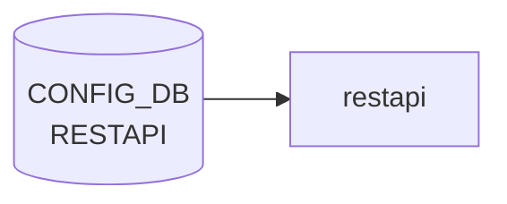

# RESTAPI テーブル

## 概要

`go-server-server` ベースの SONiC REST API (`docker-sonic-restapi`) の TLS 設定とランタイム挙動を保持するテーブル[^1]。`certs` (証明書パス群) と `config` (動作モード) の 2 つのシングルトン container から構成される。

<!-- cdb-mermaid -->
### データフロー (自動生成)



!!! note "凡例"
    CONFIG_DB から SAI までの典型経路を `docs/reference/config-db-orch-map.md` から機械生成したミニ図。詳細・例外は本ページ本文と対応表を参照。
<!-- /cdb-mermaid -->

## key 構造

```text
RESTAPI|certs
RESTAPI|config
```

container `RESTAPI` の下に固定キー `certs` / `config` の 2 シングルトン。

## フィールド

### `RESTAPI|certs`

| フィールド | 型 | 説明 |
|-----------|----|------|
| `ca_crt` | string (path pattern `(/[a-zA-Z0-9_-]+)*/([a-zA-Z0-9_-]+).([a-z]+)`) | CA 証明書のローカルパス |
| `server_crt` | string (`*.crt` パス) | サーバ証明書 |
| `server_key` | string (`*.key` パス) | サーバ秘密鍵 |
| `client_crt_cname` | string (カンマ区切り CN リスト、ワイルドカード可) | クライアント証明書許可 CN リスト |

### `RESTAPI|config`

| フィールド | 型 | デフォルト | 説明 |
|-----------|----|-----------|------|
| `client_auth` | boolean | `true` | クライアント証明書認証の要求 |
| `log_level` | enum `trace`/`info` | なし | コンテナログレベル |
| `allow_insecure` | boolean | `false` | 平文 (HTTP) 接続の許可 |

## 制約

- `ca_crt` / `server_crt` / `server_key` / `client_crt_cname` はそれぞれ厳密な正規表現でパス / CN 形式を制約
- 既定では `client_auth = true` / `allow_insecure = false` のため、相互 TLS が必須[^1]

## 購読者

- `docker-sonic-restapi` の起動スクリプト: [CONFIG_DB](../../reference/glossary.md#term-config_db) → `go-server-server` 起動引数 / 環境変数 / 証明書パスを設定

## 関連 CONFIG_DB / YANG / CLI

- 関連 [CONFIG_DB](../../reference/glossary.md#term-config_db): なし (`FEATURE.restapi` で有効化される)
- CLI: 標準 CLI ラッパなし。`config restapi` 系コマンドは未提供 ([CONFIG_DB](../../reference/glossary.md#term-config_db) 直接編集または init_cfg 経由)
- 関連 [YANG](../../reference/glossary.md#term-yang): `sonic-restapi`

<!-- ref-triangle:start -->

## 関連リファレンス

- [YANG](../../reference/glossary.md#term-yang): [`sonic-restapi`](../yang/sonic-restapi.md)

<!-- ref-triangle:end -->

## 引用元

[^1]: `src/sonic-yang-models/yang-models/sonic-restapi.yang` (container `RESTAPI` / `certs` / `config`). <https://github.com/sonic-net/sonic-buildimage/blob/9ea932ec2e18f35e58268ec2e4456b1d4afd65cd/src/sonic-yang-models/yang-models/sonic-restapi.yang>

## 関連ページ
- [CONFIG_DB: FEATURE](feature.md)

<!-- ops-hint -->
## 運用ヒント

### 典型値

- key 形式: `RESTAPI|certs / config`。
- `client_auth`: `true`、`log_level`: `info`、`server_crt`/`server_key`: パス。

### よくある誤設定

- client_auth=true で client CA を入れ忘れると 401 が出続ける。

### 確認コマンド

```bash
sonic-db-cli CONFIG_DB keys 'RESTAPI|*'
systemctl status restapi
```
<!-- /ops-hint -->

<!-- glossary-links-injected: 4b3b3fd0739b -->
