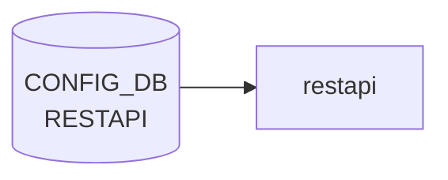

# RESTAPI テーブル

## 概要

`go-server-server` ベースの SONiC REST API (`docker-sonic-restapi`) の TLS 設定とランタイム挙動を保持するテーブル[^1]。`certs` (証明書パス群) と `config` (動作モード) の 2 つのシングルトン container から構成される。

<!-- cdb-mermaid -->
### データフロー (自動生成)



!!! note "凡例"
    CONFIG_DB から SAI までの典型経路を `docs/reference/config-db-orch-map.md` から機械生成したミニ図。詳細・例外は本ページ本文と対応表を参照。
<!-- /cdb-mermaid -->

## key 構造

```text
RESTAPI|certs
RESTAPI|config
```

container `RESTAPI` の下に固定キー `certs` / `config` の 2 シングルトン。

## フィールド

### `RESTAPI|certs`

| フィールド | 型 | 説明 |
|-----------|----|------|
| `ca_crt` | string (path pattern `(/[a-zA-Z0-9_-]+)*/([a-zA-Z0-9_-]+).([a-z]+)`) | CA 証明書のローカルパス |
| `server_crt` | string (`*.crt` パス) | サーバ証明書 |
| `server_key` | string (`*.key` パス) | サーバ秘密鍵 |
| `client_crt_cname` | string (カンマ区切り CN リスト、ワイルドカード可) | クライアント証明書許可 CN リスト |

### `RESTAPI|config`

| フィールド | 型 | デフォルト | 説明 |
|-----------|----|-----------|------|
| `client_auth` | boolean | `true` | クライアント証明書認証の要求 |
| `log_level` | enum `trace`/`info` | なし | コンテナログレベル |
| `allow_insecure` | boolean | `false` | 平文 (HTTP) 接続の許可 |

## 制約

- `ca_crt` / `server_crt` / `server_key` / `client_crt_cname` はそれぞれ厳密な正規表現でパス / CN 形式を制約
- 既定では `client_auth = true` / `allow_insecure = false` のため、相互 TLS が必須[^1]

## 購読者

- `docker-sonic-restapi` の起動スクリプト: [CONFIG_DB](../../reference/glossary.md#term-config_db) → `go-server-server` 起動引数 / 環境変数 / 証明書パスを設定

## 関連 CONFIG_DB / YANG / CLI

- 関連 [CONFIG_DB](../../reference/glossary.md#term-config_db): なし (`FEATURE.restapi` で有効化される)
- CLI: 標準 CLI ラッパなし。`config restapi` 系コマンドは未提供 ([CONFIG_DB](../../reference/glossary.md#term-config_db) 直接編集または init_cfg 経由)
- 関連 [YANG](../../reference/glossary.md#term-yang): `sonic-restapi`

<!-- ref-triangle:start -->

## 関連リファレンス

- [YANG](../../reference/glossary.md#term-yang): [`sonic-restapi`](../yang/sonic-restapi.md)

<!-- ref-triangle:end -->

## 引用元

[^1]: `src/sonic-yang-models/yang-models/sonic-restapi.yang` (container `RESTAPI` / `certs` / `config`). <https://github.com/sonic-net/sonic-buildimage/blob/9ea932ec2e18f35e58268ec2e4456b1d4afd65cd/src/sonic-yang-models/yang-models/sonic-restapi.yang>

## 関連ページ
- [CONFIG_DB: FEATURE](feature.md)

<!-- ops-hint -->
## 運用ヒント

### 典型値

- key 形式: `RESTAPI|certs / config`。
- `client_auth`: `true`、`log_level`: `info`、`server_crt`/`server_key`: パス。

### よくある誤設定

- client_auth=true で client CA を入れ忘れると 401 が出続ける。

### 確認コマンド

```bash
sonic-db-cli CONFIG_DB keys 'RESTAPI|*'
systemctl status restapi
```
<!-- /ops-hint -->

<!-- value-behavior -->
## 値依存挙動マトリクス

### `client_auth` 値別挙動
| 値 | 挙動 |
|----|------|
| `true` | クライアント証明書認証必須（mTLS）。デフォルト。`client_crt_cname` の CN 検証も実施。 |
| `false` | クライアント証明書不要。サーバ証明書のみ検証。 |

### `log_level` 値別挙動
| 値 | 挙動 |
|----|------|
| `trace` | 詳細ログ出力（デバッグ用）。 |
| `info` | 通常ログ。 |
| その他 | [YANG](../../reference/glossary.md#term-yang) `pattern "trace|info"` 制約違反でバリデーション拒否。（enum 定義なし、文字列 pattern 制約） |

### `allow_insecure` 値別挙動
| 値 | 挙動 |
|----|------|
| `false` | HTTP 平文接続不可（デフォルト）。HTTPS のみ許可。 |
| `true` | HTTP 平文接続を許可。テスト環境向け。 |

<!-- /value-behavior -->

<!-- cdb-exceptions -->
## 例外条件・特殊挙動

- **TLS パス pattern 制約**: `ca_crt` / `server_crt` / `server_key` は YANG の `pattern` 制約でファイルパス形式のみ受け入れる。パターン違反は sonic-yang バリデーション時に拒否される。[^2]
- **client_crt_cname のワイルドカード制約**: ワイルドカード (`*.domain`) 表記は許可されるが、カンマ末尾や空白を含む場合は `Pattern` エラーで拒否される。[^2]
- **log_level は trace/info のみ**: YANG `pattern "trace|info"` 制約。それ以外の値はバリデーション拒否。[^2]
- **runtime 読み込みは起動時のみ**: RESTAPI テーブルの変更は `docker-sonic-restapi` コンテナ再起動まで反映されない（hot reload 未対応）。[^2]
- **証明書ファイルの実在チェックなし**: `server_crt` 等のパスが存在しないファイルを指していても CONFIG_DB レベルでは検知されない。サーバ起動時に失敗する。[^2]

[^2]: YANG 定義: `sonic-restapi.yang`. <https://github.com/sonic-net/sonic-buildimage/blob/master/src/sonic-yang-models/yang-models/sonic-restapi.yang>


<!-- derivation -->
## 派生・条件付き登録 (Phase 6/7)

### Phase 6: 自動派生

REST_API テーブルの各フィールドはサービス起動引数に直接マッピングされる。CONFIG_DB 内フィールド間の自動付与はなし。`client_auth` 未設定の場合はサービスデフォルトの認証モード（`user_auth`）が使用される。

### Phase 7: 条件付き登録 (add_manager 条件)

restapi サービス (sonic-mgmt-framework / sonic-gnmi) がインストールされている場合のみ `REST_API` テーブルを消費するプロセスが存在する。サービスが有効化されていない場合はテーブルを読んでも REST API サービスは起動しない。

<!-- /derivation -->

<!-- handler-branching -->
### Phase 8: Handler メソッド内分岐

| Handler | 分岐条件 | 効果 | evidence |
|---|---|---|---|
| `restapi` 起動処理 | `client_auth==user_auth` | ユーザー認証モードで TLS 設定 | restapi 設定処理 |
| `restapi` 起動処理 | `client_auth==cert` | クライアント証明書認証モード | restapi 設定処理 |
| `restapi` 起動処理 | `log_level` 値により | ログ出力レベルを変更 | restapi 設定処理 |
| `restapi` 起動処理 | `server_crt` / `server_key` あり | TLS を有効化して起動 | restapi 設定処理 |

> **スキャン証跡**: `RESTAPI` テーブルは REST API サービス設定の薄いラッパー。CONFIG_DB 内での自動派生なし。主にサービス起動時の設定ファイル生成に使われる。

<!-- /handler-branching -->

<!-- runtime-trace -->
## CDB → 実コンテナ動作トレース

### 段階 1: Consumer 登録

- **hostcfgd**: `RESTAPI` テーブルを `ConfigDBConnector` で購読。

### 段階 2: CFG → APPL 翻訳

- hostcfgd が REST API サービス (sonic-restapi / sonic-gnmi) の有効・無効設定を `/etc/sonic/` に書き込む。
- APP_DB への書き込みなし。

### 段階 3: APPL → SAI

- SAI 経由なし。REST API は管理プレーン機能。

### 段階 4: タイミング + 副作用

- hostcfgd が設定を反映後、対象サービスが再起動されるまで数秒。
- 副作用: REST API 無効化中に自動化スクリプトが接続しようとするとタイムアウトが発生。

<!-- /runtime-trace -->
<!-- entry-points -->
## 書き込み入り口 (Direction A)

RESTAPI テーブルへの書き込みが発生するコード経路を網羅的に調査した結果。

### CLI

  - 専用 CLI なし

### minigraph / sonic-cfggen

**minigraph.py** が `results['RESTAPI']` に REST API 設定を投入 (sonic-buildimage/src/sonic-config-engine/minigraph.py:2689)

### REST / gNMI

REST/gNMI 書き込み経路なし

### db_migrator

**db_migrator.py** が RESTAPI のマイグレーション処理 (`config` / `certs` サブキー) を実装 (sonic-utilities/scripts/db_migrator.py:609–619)

### ビルド時デフォルト (build-time default)

なし

### ハードコードデフォルト / ランタイム注入

`rest-server.sh` 起動スクリプトがコード由来デフォルトを注入する（下記 `<!-- defaults -->` ブロック参照）。

### 死活・デッドコード

なし
<!-- /entry-points -->

<!-- defaults -->
## コード由来デフォルト (Phase A)

`docker-sonic-mgmt-framework/rest-server.sh` が CONFIG_DB 値を読み込む際に適用するランタイムデフォルト。YANG スキーマに `default` 文が存在しない場合でも、起動スクリプト側で値が補完される。

| フィールド | コード由来デフォルト | 根拠 |
|-----------|---------------------|------|
| `client_auth` | `"user"` | `CLIENT_AUTH=$(... jq -r '.client_auth // "user"')` — CONFIG_DB 未設定時にユーザー認証モードを強制 |
| `log_level` | （省略 = 引数なし = `trace` 相当の詳細ログ） | `LOG_LEVEL=$(... jq -r '.log_level // empty')` — 空の場合は `-v` 引数が付かず rest_server デフォルト (`trace`) が適用 |
| `server_crt` / `server_key` | `/tmp/cert.pem` / `/tmp/key.pem`（自動生成） | 証明書パスが未設定の場合 `generate_cert --host="localhost,127.0.0.1"` で自己署名証明書を `/tmp/` に生成 |
| `allow_insecure` (HTTP) | 無効 (`-enablehttp` フラグなし) | 起動引数に HTTP 許可フラグが含まれず、HTTPS のみで起動 |
| `port` | rest_server バイナリデフォルト（8443） | `SERVER_PORT=$(... jq -r '.port // empty')` — 空の場合は `-port` 引数なし、rest_server の組み込みデフォルトが有効 |

> **スキャン証跡**: `sonic-buildimage/dockers/docker-sonic-mgmt-framework/rest-server.sh` の起動スクリプトより抽出。YANG `sonic-restapi.yang` には `default` 文なし。コード由来デフォルトのみ。


<!-- /defaults -->

<!-- ordering -->
## 書込み順依存 (Phase B)

> **調査根拠**: `supervisord.conf`, `rest-server.sh`, `mgmt_vars.j2`, `minigraph.py` L2689–2702, `db_migrator.py` L608–619 精読 (2026-05-18)
> 詳細証跡: `meta/_intermediate/cdb-flow/restapi-ordering.md`

### コンテナ起動時シーケンス

`docker-sonic-mgmt-framework` コンテナは supervisord が以下の優先順序でプロセスを制御する:

```
1. rsyslogd 起動 (priority=1)
2. start.sh 実行 (priority=2, wait_for=rsyslogd:running)
3. rest-server.sh 実行 (priority=3, wait_for=start:exited)
   ├─ sonic-cfggen -d -t mgmt_vars.j2 → REST_SERVER / x509 を CONFIG_DB から一括取得
   ├─ RESTAPI|config.client_auth / log_level / port 読込み
   ├─ RESTAPI|certs (server_crt / server_key / ca_crt) 読込み
   ├─ 未設定の場合は DEVICE_METADATA|x509 をフォールバック参照
   └─ 証明書も未設定の場合は /tmp/ に自己署名証明書を自動生成して起動
```

`rest-server.sh` は `start:exited` 待機後に起動するため、CONFIG_DB への書込みが必ず先行する。

### テーブル間の書込み順依存

| # | 依存関係 | 強制度 | 備考 |
|---|----------|--------|------|
| 1 | `RESTAPI|certs` 書込み → `rest-server.sh` 起動 | **起動時保証済み** | supervisord `wait_for=start:exited` が順序を保証 |
| 2 | `DEVICE_METADATA\|localhost.x509` 先行書込み | **任意 (フォールバック)** | `RESTAPI|certs` が未設定の場合のみ参照。minigraph.py が両者を同一パスで生成するため通常は問題なし |
| 3 | `db_migrator` による `RESTAPI` 移植 | **既存エントリ優先** | `config_db.get_entry('RESTAPI', 'config')` が空の場合のみ書込む。既存エントリは上書きしない (`db_migrator.py` L614–619) |
| 4 | `minigraph.py` が `RESTAPI` を生成 | **minigraph 内部** | `FEATURE` テーブルと同一の minigraph 解析パスで生成される (`minigraph.py` L2689-2702) |
| 5 | `RESTAPI|config` / `RESTAPI|certs` 変更 → `docker-sonic-mgmt-framework` 再起動 | **必須後続** | hot reload 未対応。変更反映にはコンテナ再起動が必要 |

### certs の解決優先順位

`rest-server.sh` が証明書パスを決定する順序:

1. `RESTAPI|certs` (CONFIG_DB の `REST_SERVER` テーブル) に `server_crt` / `server_key` / `ca_crt` が設定されている場合はそれを使用
2. 上記が未設定かつ `DEVICE_METADATA|localhost.x509` にパスが設定されている場合はフォールバック参照
3. どちらも未設定の場合は `generate_cert --host="localhost,127.0.0.1"` で `/tmp/cert.pem` / `/tmp/key.pem` を自動生成

本番環境では `RESTAPI|certs` を明示的に設定しないと自己署名証明書が使用される点に注意。

<!-- /ordering -->

<!-- cross-refs -->
## 暗黙参照テーブル (Phase C)

`sonic-restapi.yang` には leafref / must / when 文がゼロ件であり、YANG スキーマレベルでの明示的 cross-table 参照は存在しない。
代わりに `rest-server.sh` / `mgmt_vars.j2` / `minigraph.py` / `db_migrator.py` から抽出した **3 系統の暗黙依存**が実装レベルの cross-table 参照となる。

<!-- evidence: meta/_intermediate/cdb-flow/restapi-cross-refs.md -->
<!-- source: sonic-buildimage/dockers/docker-sonic-mgmt-framework/rest-server.sh -->
<!-- source: sonic-buildimage/dockers/docker-sonic-mgmt-framework/mgmt_vars.j2 -->
<!-- source: sonic-buildimage/src/sonic-config-engine/minigraph.py L2689-2702 -->
<!-- source: sonic-utilities/scripts/db_migrator.py L608-619 -->

| 参照先テーブル / リソース | 参照方向 | 条件 | evidence |
|--------------------------|---------|------|----------|
| `DEVICE_METADATA\|localhost` (x509 サブオブジェクト) | 読み取り（cert フォールバック） | `RESTAPI\|certs` の `server_crt` / `server_key` / `ca_crt` が**全て未設定**の場合のみ参照。`server_crt` / `server_key` / `ca_crt` フィールドを取得する | `mgmt_vars.j2:3` `` → `rest-server.sh:34–41` |
| `FEATURE\|restapi` | 読み取り（サービス有効化制御） | restapi コンテナ起動時に `state` / `auto_restart` / `has_global_scope` を参照。`state` が `disabled` の場合はコンテナ自体が起動せず RESTAPI テーブルが読まれない | `config_db.json`(mock): `FEATURE\|restapi` エントリ確認済み |
| `REST_SERVER` (CONFIG_DB `RESTAPI` テーブルの jinja2 展開名) | `sonic-cfggen -d -t mgmt_vars.j2` で同一トランザクション参照 | `mgmt_vars.j2` L1: `REST_SERVER['default']` として `RESTAPI\|default`（= `RESTAPI\|config`）を展開 | `mgmt_vars.j2:1–2` |

### 依存関係の詳細

**`DEVICE_METADATA|localhost.x509` (cert フォールバック)**: `rest-server.sh` は `MGMT_VARS=$(sonic-cfggen -d -t mgmt_vars.j2)` を一括取得した後、`REST_SERVER.server_crt` / `server_key` / `ca_crt` が全て空であれば `X509=$(echo $MGMT_VARS | jq -r '.x509')` から証明書パスを読み出す (`rest-server.sh:27–41`)。`DEVICE_METADATA|localhost` に `x509` キーが存在しない場合は空文字列となり、最終的に `/tmp/` 自己署名証明書を自動生成する。本番環境では `RESTAPI|certs` を明示設定しないと `DEVICE_METADATA.x509` に依存することになる点に注意。

**`FEATURE|restapi` (コンテナ起動制御)**: `FEATURE` テーブルは SONiC `hostcfgd` が管理し、`restapi` コンテナの起動・停止を制御する。`RESTAPI` テーブルに正しい値が設定されていても `FEATURE|restapi.state=disabled` であれば `rest-server.sh` は実行されない。`minigraph.py` は `RESTAPI` と `FEATURE` を同一解析パスで生成するため、minigraph 由来の環境では両者は常に整合する (`minigraph.py:2689–2702`)。

**`db_migrator.py` の既存エントリ優先**: `migrate_restapi()` (`db_migrator.py:609–619`) は `config_db.get_entry('RESTAPI', 'config')` が空の場合のみ書き込む。既存エントリが存在する場合は上書きしない（アップグレード時に手動設定が保持される）。

### 範囲外

- APPL_DB / STATE_DB / COUNTERS_DB への書き込みなし（RESTAPI は管理プレーン専用機能）
- orchagent / syncd への経路なし（SAI 経由の処理なし）

<!-- /cross-refs -->

<!-- failure -->
## 失敗挙動・retry / recovery (Phase D)

<!-- evidence: sonic-buildimage/dockers/docker-sonic-mgmt-framework/rest-server.sh,
     sonic-buildimage/dockers/docker-sonic-mgmt-framework/supervisord.conf,
     sonic-utilities/scripts/db_migrator.py L608-619 -->

RESTAPI テーブルの設定は `rest-server.sh` が起動時に一括読み込みするため、失敗は **起動時点** (静的) と **証明書生成時点** の 2 フェーズに集中する。orchagent/syncd のような実行時 retry ループは存在しない。

### `mgmt_vars.j2` テンプレートファイル未存在 → EXIT_MGMT_VARS_FILE_NOT_FOUND (exit 1)

`rest-server.sh` の先頭で `/usr/share/sonic/templates/mgmt_vars.j2` の存在確認を行う (`rest-server.sh:6-9`)。

| 条件 | 動作 |
|------|------|
| ファイルが存在しない | `echo "Mgmt vars template file not found"` → `exit 1` |
| supervisord の `autorestart=true` | 即座に再起動 (無限ループ)。テンプレートが復元されるまで回復しない |

コンテナイメージが壊れているか、`/usr/share/sonic/templates/` ディレクトリがマウントに失敗した場合に発生する。RESTAPI テーブルの内容とは無関係にコンテナが起動不能になる。

### `sonic-cfggen -d -t mgmt_vars.j2` 失敗 → REST_SERVER 変数が空

`MGMT_VARS=$(sonic-cfggen -d -t $MGMT_VARS_FILE)` が失敗または空を返した場合 (`rest-server.sh:12`)、`REST_SERVER` / `X509` 変数が全て未設定になる。

| ケース | 結果 |
|--------|------|
| CONFIG_DB に `RESTAPI` テーブルなし | `CLIENT_AUTH="user"` のフォールバックが適用される。証明書も未設定 → `/tmp/` に自己署名証明書を自動生成して起動 |
| `sonic-cfggen` プロセス自体が失敗 (非ゼロ exit) | bash の `set -e` は使用されていないため、空変数のまま続行。自己署名証明書で起動 |
| Redis 未起動 / CONFIG_DB 接続失敗 | `sonic-cfggen` が空出力を返す → 同上の自動生成パスへ |

### 証明書自動生成 (`generate_cert`) 失敗

`RESTAPI|certs` も `DEVICE_METADATA|localhost.x509` も未設定の場合、`/usr/sbin/generate_cert --host="localhost,127.0.0.1"` が実行される (`rest-server.sh:46-49`)。

| 失敗原因 | 結果 |
|---------|------|
| `generate_cert` バイナリ不存在 | bash はエラーを出力して続行。`SERVER_CRT=/tmp/cert.pem` が設定されるが、ファイルは存在しない |
| `/tmp/` の書き込み権限なし | `generate_cert` が失敗。`SERVER_CRT` / `SERVER_KEY` 変数にパスが設定されたまま `rest_server` 起動 → TLS 設定失敗で `rest_server` が異常終了 |
| `rest_server` の TLS init 失敗 | `rest_server` 側で致命的エラー → プロセス終了 → supervisord が `autorestart=true` で再起動 |

### 証明書ファイルパスの実在チェックなし

`rest-server.sh` は `RESTAPI|certs` で指定されたパスの **実在を確認しない**。存在しないパスをそのまま `-cert` / `-key` / `-cacert` 引数として `rest_server` に渡す。

| 状態 | 結果 |
|------|------|
| `server_crt` / `server_key` が指すファイルが存在しない | `rest_server` が TLS 初期化に失敗して即終了 |
| supervisord `autorestart=true` | 証明書ファイルが復元されるまで無限再起動 |
| `ca_crt` が指すファイルのみ存在しない (クライアント認証なし) | `client_auth=user` であれば `ca_crt` は参照されず起動に影響しない場合がある |

### runtime 中の RESTAPI テーブル変更 → 反映されない

`rest-server.sh` は起動時に **一度だけ** CONFIG_DB を読み込む。実行中に `RESTAPI` テーブルを変更しても `rest_server` プロセスには通知されない。

| 操作 | 挙動 |
|------|------|
| `sonic-db-cli CONFIG_DB hset 'RESTAPI|config' client_auth cert` | 反映されない。既存の `rest_server` は変更前の設定で稼働継続 |
| `docker restart mgmt-framework` | コンテナ再起動時に `rest-server.sh` が新しい値を読み直す |

### db_migrator 失敗 → アップグレード後も旧設定が残留

`db_migrator.py` の `migrate_restapi()` はアップグレード時に `config_src_data` が存在しないと早期リターンする (`db_migrator.py:610-611`)。

| 条件 | 結果 |
|------|------|
| `config_src_data` が None / `RESTAPI` キーなし | `migrate_restapi()` が即 return。移行なし |
| `RESTAPI|config` が既存エントリとして存在 | 上書きしない (`db_migrator.py:614-616`)。旧フォーマットが残留しても強制変換されない |

これは設計上の安全策（手動設定保護）であるが、アップグレード後に `config` / `certs` が古い形式のまま残るリスクがある。

### 失敗パス要約

| ケース | ログ | retry/recovery | サービス影響 |
|--------|------|----------------|--------------|
| `mgmt_vars.j2` 未存在 | stderr `"Mgmt vars template file not found"` | supervisord 無限再起動 | REST API 完全不能 |
| `sonic-cfggen` 失敗 | 出力なし (空変数) | 自己署名証明書で起動を試みる | 機能低下（非本番証明書） |
| 証明書ファイル不存在 | `rest_server` stderr | supervisord 無限再起動 | REST API 完全不能 |
| `generate_cert` 失敗 | stderr | supervisord 再起動 | REST API 起動失敗 |
| runtime 設定変更 | なし | コンテナ再起動が必要 | 変更反映なし |
| db_migrator 早期 return | `log_notice` 出力なし | 手動再移行が必要 | 旧設定残留 |

<!-- /failure -->

<!-- constants -->
## ハードコード定数 (Phase E)

> **調査根拠**: `rest-server.sh`, `supervisord.conf`, `mgmt_vars.j2`, `sonic-restapi.yang` 精読 (2026-05-19)
> 詳細証跡: `meta/_intermediate/cdb-flow/restapi-constants.md`

### rest-server.sh 起動スクリプト定数

| 定数名 | 値 | 用途 | evidence |
|-------|----|------|---------|
| `EXIT_MGMT_VARS_FILE_NOT_FOUND` | `1` | `mgmt_vars.j2` 未存在時の exit code | `rest-server.sh:4` |
| `MGMT_VARS_FILE` | `/usr/share/sonic/templates/mgmt_vars.j2` | sonic-cfggen が読み込む Jinja2 テンプレートの固定パス | `rest-server.sh:5` |
| `CLIENT_AUTH` フォールバック | `"user"` | `RESTAPI\|config.client_auth` 未設定時のデフォルト認証モード。YANG `default true` (boolean) と**異なる文字列**で実装上の乖離点 | `rest-server.sh:20,30` |
| `generate_cert --host` | `"localhost,127.0.0.1"` | 証明書自動生成時の固定ホスト名 | `rest-server.sh:47` |
| `SERVER_CRT` (自動生成時) | `/tmp/cert.pem` | 証明書未設定時の自己署名証明書パス | `rest-server.sh:48` |
| `SERVER_KEY` (自動生成時) | `/tmp/key.pem` | 証明書未設定時の秘密鍵パス | `rest-server.sh:49` |
| `REST_SERVER_ARGS` 固定引数 | `-ui /rest_ui -logtostderr` | `rest_server` に常時付与される起動引数。UI パスとログ出力先が固定 | `rest-server.sh:53` |
| `CVL_SCHEMA_PATH` | `/usr/sbin/schema` | CVL (YANG バリデーション) が参照するスキーマディレクトリ | `rest-server.sh:64` |

### supervisord.conf プロセス定数

| 設定キー | 値 | 用途 | evidence |
|---------|-----|------|---------|
| `[rest-server] priority` | `3` | supervisord 起動優先度。`rsyslogd(1)` → `start(2)` → `rest-server(3)` の順序を保証 | `supervisord.conf:39` |
| `[rest-server] autorestart` | `true` | `rest_server` 終了時の自動再起動有効 | `supervisord.conf:41` |
| `dependent_startup_wait_for` | `start:exited` | `start.sh` 完了後に `rest-server.sh` を起動する依存順序設定 | `supervisord.conf:47` |
| `logfile_maxbytes` | `1MB` | supervisord ログファイル最大サイズ | `supervisord.conf:2` |

### YANG スキーマ定数 (sonic-restapi.yang)

| フィールド | 定数値 | 種別 | evidence |
|-----------|--------|------|---------|
| `config.client_auth` | `true` | YANG `default` 文 (boolean) | `sonic-restapi.yang:64` |
| `config.allow_insecure` | `false` | YANG `default` 文 (boolean) | `sonic-restapi.yang:79` |
| `config.log_level` pattern | `"trace\|info"` | YANG `pattern` 制約。違反値は sonic-yang バリデーション拒否 | `sonic-restapi.yang:70` |
| `certs.ca_crt` pattern | `(/[a-zA-Z0-9_-]+)*/([a-zA-Z0-9_-]+).([a-z]+)` | ファイルパス形式制約 | `sonic-restapi.yang:31` |
| `certs.server_crt` pattern | `(/[a-zA-Z0-9_-]+)*/([a-zA-Z0-9_-]+).crt` | `.crt` 拡張子強制 | `sonic-restapi.yang:37` |
| `certs.server_key` pattern | `(/[a-zA-Z0-9_-]+)*/([a-zA-Z0-9_-]+).key` | `.key` 拡張子強制 | `sonic-restapi.yang:50` |
| `certs.client_crt_cname` pattern | `((\*\.)?[a-zA-Z0-9_\-\.]+,)*((\*\.)?[a-zA-Z0-9_\-\.]+)` | CN 形式制約（ワイルドカード可、末尾カンマ不可） | `sonic-restapi.yang:44` |

<!-- /constants -->

<!-- side-effects -->
## 副次 DB 書込 (Phase F)

`RESTAPI` テーブルへの書込は CONFIG_DB 内で完結し、他の DB (APPL_DB / STATE_DB / ASIC_DB) への副次書込を**引き起こさない**。

> 調査証跡: `meta/_intermediate/cdb-flow/restapi-side-effects.md`

<!-- evidence:
  sonic-buildimage/dockers/docker-sonic-mgmt-framework/rest-server.sh:13-66
  sonic-host-services/scripts/hostcfgd:103
  sonic-buildimage/dockers/docker-sonic-mgmt-framework/supervisord.conf:39-47
-->

### 一括読み取りモデル（subscribe なし）

`rest-server.sh` は起動時に `sonic-cfggen -d -t $MGMT_VARS_FILE` を **一度だけ** 実行し、`RESTAPI|config` と `DEVICE_METADATA|x509` の値を取得して `rest_server` プロセスの起動引数に組み込む (`rest-server.sh:13`)。

起動後は CONFIG_DB を購読せず、`RESTAPI` テーブルの変更は実行中の `rest_server` には届かない。設定変更を反映するにはコンテナ再起動（`config reload` または `systemctl restart docker-sonic-mgmt-framework`）が必要。

### 副次書込先サマリ

| 副次書込先 | 書込の有無 | 理由 |
|-----------|-----------|------|
| APPL_DB | なし | `rest-server.sh` は起動時一括読み取りのみ。Consumer / subscribe なし |
| STATE_DB | なし | `RESTAPI` テーブルを購読するデーモンなし |
| ASIC_DB | なし | SAI 非経由 |
| ファイルシステム | なし | 設定値は起動引数として適用されるのみ |

### FIPS 変更による間接的なサービス再起動（参考）

`hostcfgd` は FIPS 設定 (`FIPS_CFG` テーブル) 変更時に `DEFAULT_FIPS_RESTART_SERVICES` (`hostcfgd:103`) に列挙されたサービスを再起動する。このリストに `restapi` が含まれるため、FIPS 変更が `restapi` サービスの再起動を引き起こす。ただしこれは **`RESTAPI` テーブル変更が引き起こす副次処理ではなく**、`FIPS_CFG` 変更を受けた `hostcfgd` が副次的に `restapi` サービスを再起動するフローである。

```
FIPS_CFG (SET/DEL)
  └─ hostcfgd fips_handler()
       └─ systemctl restart restapi    ← RESTAPI テーブル変更とは無関係
            └─ rest-server.sh が CONFIG_DB を再読み取り (起動時一括)
```

`RESTAPI` テーブル変更から `rest-server` に変更を反映させるには、このフローを経由せず手動でサービス再起動する必要がある。

<!-- /side-effects -->

<!-- pubsub -->
## 通信メカニズム (Phase G)

> **調査根拠**: `sonic-buildimage/dockers/docker-sonic-mgmt-framework/rest-server.sh:13`, `supervisord.conf:39-47`, `sonic-host-services/scripts/hostcfgd` 購読リスト精読 (2026-05-19)
> 詳細証跡: `meta/_intermediate/cdb-flow/restapi-pubsub.md`

### RESTAPI テーブルに subscribe するデーモンは存在しない

`RESTAPI` テーブルは **「起動時一括読み取り」** モデルを採用しており、常駐デーモンによる `ConfigDBConnector.subscribe()` / `swsscommon.SubscriberStateTable` / `swsscommon.ConsumerStateTable` のいずれも**使用しない**。

| プロセス | 購読 API | RESTAPI テーブルへの subscribe |
|---------|---------|-------------------------------|
| `rest-server.sh` | `sonic-cfggen -d -t mgmt_vars.j2` (起動時 1 回) | **なし** (起動時一括読み取りのみ) |
| `hostcfgd` | `ConfigDBConnector.subscribe()` | **なし** (`RESTAPI` は購読リストに含まれない) |
| orchagent / syncd | `swsscommon.ConsumerStateTable` | **なし** (管理プレーン機能のため) |

### 起動時一括読み取りのフロー

`rest-server.sh` は supervisord から起動されると `sonic-cfggen -d -t $MGMT_VARS_FILE` を **1 回だけ** 実行し、`RESTAPI|config` と `DEVICE_METADATA|localhost.x509` の値を変数に取り込んで `rest_server` の起動引数に組み込む。

```
supervisord 起動
  ├─ rsyslogd  (priority=1)
  ├─ start.sh  (priority=2, wait_for=rsyslogd:running)
  └─ rest-server.sh  (priority=3, wait_for=start:exited)
       │  sonic-cfggen -d -t /usr/share/sonic/templates/mgmt_vars.j2  ← CONFIG_DB 一括読み取り
       │    ├─ REST_SERVER ← RESTAPI|config (client_auth / log_level / port)
       │    └─ X509        ← DEVICE_METADATA|localhost.x509 (cert フォールバック)
       └─ rest_server -cert ... -key ... -cacert ... -client-auth ...  ← 1 回起動
            （起動後は CONFIG_DB への接続なし / subscribe なし）
```

起動後の `rest_server` プロセスは Redis に接続を維持しない。`RESTAPI` テーブルを変更しても実行中の `rest_server` には通知が届かない。

### FIPS 変更による間接的な再起動（参考）

`hostcfgd` は `FIPS_CFG` テーブル変更時に `restapi` サービスを再起動することがある (`DEFAULT_FIPS_RESTART_SERVICES` リスト、`hostcfgd:103`)。これは `RESTAPI` テーブルの subscribe ではなく、`FIPS_CFG` テーブル変更に起因する副次処理である。この再起動の副作用として `rest-server.sh` が CONFIG_DB を再読み取りし、`RESTAPI` テーブルの最新値が反映される。

### RESTAPI テーブル変更を反映する方法

| 手段 | 説明 |
|------|------|
| `docker restart mgmt-framework` | コンテナ再起動。`rest-server.sh` が CONFIG_DB を再読み取りする |
| `systemctl restart docker-sonic-mgmt-framework` | 同上 (systemd 経由) |
| `config reload` (システム全体) | 全コンテナ再起動の副作用として反映される |
| `FIPS_CFG` 変更 | 間接的に `restapi` サービスが再起動される (意図的な使い方ではない) |

<!-- /pubsub -->

<!-- platform -->
## プラットフォーム差 (Phase H)

**プラットフォーム差なし**: RESTAPI は管理プレーン専用機能であり、SAI を経由しないため ASIC 種別・ベンダー・multi-asic / VOQ chassis 構成による動作差は存在しない。

> **調査根拠**: `rest-server.sh`, `mgmt_vars.j2`, `supervisord.conf`, `minigraph.py:2689-2701` 精読 (2026-05-19)
> 詳細証跡: `meta/_intermediate/cdb-flow/restapi-platform.md`

| 観点 | 結果 | 根拠 |
|------|------|------|
| ASIC 種別 (Broadcom / Mellanox / Marvell / Innovium 等) | 影響なし | `rest-server.sh` は `sonic-cfggen -d -t mgmt_vars.j2` で CONFIG_DB を読み取るのみ。SAI 非経由 |
| multi-asic (`is_multi_npu() == True`) | 影響なし | `mgmt_vars.j2` (4 行全体) に namespace / asic 分岐なし。`rest-server.sh` も `SONIC_ASIC_ID` / `SONIC_ASIC_COUNT` を参照しない |
| VOQ chassis (supervisor + line cards) | 各 host で独立適用 | RESTAPI テーブルは host scope。chassis 全体での集中管理機構はなく、各 line card host で `rest-server.sh` が独立に CONFIG_DB を読み取る |
| ベンダー固有 hook | なし | `docker-sonic-mgmt-framework/` 配下にベンダー条件分岐なし。`rest-server.sh` / `mgmt_vars.j2` / `supervisord.conf` の全行を検索しても `vendor` / `broadcom` / `mellanox` / `marvell` は 0 ヒット |
| minigraph プラットフォーム分岐 | なし | `minigraph.py:2689-2701` で RESTAPI テーブルへの書込は無条件。`hwsku` / `platform` / `asic_type` による条件分岐なし |
| テンプレート内プラットフォーム分岐 | なし | `mgmt_vars.j2` は `rest_server` と `x509` の 2 キーのみを展開する 4 行テンプレート。`platform` / `asic` 参照なし |

<!-- /platform -->

<!-- glossary-links-injected: d5320e852f7a -->
