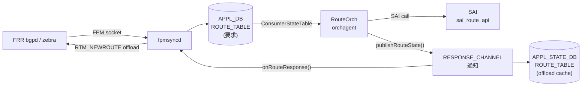

# APPL_STATE_DB ROUTE_TABLE (route offload cache)

## 概要

`APPL_STATE_DB` の `ROUTE_TABLE` は、`orchagent` の `RouteOrch` が SAI 経路プログラミング完了後に書き込む**経路オフロードキャッシュ**。APPL_DB の `ROUTE_TABLE`（fpmsyncd が書き込む経路要求テーブル）と **テーブル名・キー構造が同一** だが、格納先 DB が異なる（DB インデックス 0 vs 14）[^schema]。

`fpmsyncd` がこのテーブルを `APPL_DB_ROUTE_TABLE_RESPONSE_CHANNEL` 経由で購読し、SAI プログラミング成功を確認した後に FRR zebra へ **offload 通知**（RTM_NEWROUTE）を送出する。Route suppression 機能（APPL_DB suppress-pending）が有効な場合に本フローが活性化する。

!!! note "ROUTE_TABLE が存在する DB は 3 つ"
    同名テーブルが `APPL_DB`・`STATE_DB`・`APPL_STATE_DB` の 3 箇所に存在する。  
    STATE_DB の `ROUTE_TABLE` はデフォルト経路専用の別テーブル（[ROUTE_TABLE (STATE_DB)](route-state.md) 参照）。

<!-- cdb-mermaid -->
### データフロー



<!-- /cdb-mermaid -->

## key 構造

```text
ROUTE_TABLE:<prefix>
ROUTE_TABLE:<vrf_name>:<prefix>
```

APPL_DB の `ROUTE_TABLE` キーと完全に同一。SAI プログラミングに成功した経路のみエントリが存在する。

| key 要素 | 説明 |
|---------|------|
| `<prefix>` | IPv4 / IPv6 プレフィクス（例: `10.0.0.0/24`、`2001:db8::/32`） |
| `<vrf_name>:` | VRF-aware 経路。VRF 名 + `:` のプレフィクス |

## フィールド一覧

| フィールド | 型 | 書込み条件 | 説明 |
|-----------|----|-----------|----|
| `protocol` | string | SET 操作かつ SAI 成功時 | APPL_DB から引き継いだ経路プロトコル名（`bgp`・`static`・`kernel` 等、または空文字列） |
| `err_str` | string | 通知チャネル専用 | SAI 操作結果。成功時 `"SWSS_RC_SUCCESS"`。APPL_STATE_DB 実エントリには書き込まれない |

!!! warning "`err_str` は通知チャネル専用"
    `err_str` は `APPL_DB_ROUTE_TABLE_RESPONSE_CHANNEL` の通知メッセージに含まれるが、  
    APPL_STATE_DB のエントリ（`ROUTE_TABLE:<prefix>` ハッシュ）には書き込まれない。  
    `redis-cli hgetall` で見えるのは `protocol` のみ。

## 書き込みロジック — `publishRouteState()`

ソース: `orchagent/routeorch.cpp` lines 3185–3202[^rorch]

```cpp
void RouteOrch::publishRouteState(const RouteBulkContext& ctx, const ReturnCode& status)
{
    std::vector<FieldValueTuple> fvs;

    /* DEL 操作時は fvs を空にする。
     * ResponsePublisher::publish() は空 fvs を DEL コマンドとして処理し
     * APPL_STATE_DB のエントリを削除する */
    if (ctx.is_set)
    {
        fvs.emplace_back("protocol", ctx.protocol);
    }

    const bool replace = false;
    m_publisher.publish(APP_ROUTE_TABLE_NAME, ctx.key, fvs, status, replace);
}
```

呼ばれるタイミング:

| 呼び出し元 | 行 | 条件 |
|-----------|---|------|
| `doTask()` — サブネット経路（ip2me 相当） | 1050 | SET、既存 IP2ME 経路のみ |
| `doTask()` — 重複エントリ | 1090 | SET、重複 DEL+SET の整合取り |
| `doTask()` — ADD 成功後 | 2729 | SAI `create_route_entry` 成功後 |
| `doTask()` — UPDATE 成功後 | 2970 | SAI `set_route_entry_attribute` 成功後 |

## SET vs DEL の動作

| 操作 | `fvs` | APPL_STATE_DB | 通知チャネル |
|------|-------|---------------|------------|
| SET + SAI 成功 | `[("protocol", value)]` | エントリを書き込み | `err_str=SWSS_RC_SUCCESS` + `protocol` 送信 |
| SET + SAI 失敗 | `[("protocol", value)]` | 書き込みスキップ | `err_str=[SAI] ...` + `protocol` 送信 |
| DEL + SAI 成功 | `[]` | エントリを削除 | `err_str=SWSS_RC_SUCCESS` 送信 |
| DEL + SAI 失敗 | `[]` | 削除スキップ | `err_str=[SAI] ...` 送信 |

`ResponsePublisher` の書き込み条件[^respub]:

```cpp
// response_publisher.cpp:129-133
if (m_enable_db_write_and_notify &&
     ((intent_attrs.size() && state_attrs.size()) ||
     (status.ok() && !intent_attrs.size()))) {
        writeToDB(table, key, state_attrs,
                  intent_attrs.size() ? SET_COMMAND : DEL_COMMAND, replace);
}
```

## fpmsyncd による購読 — `onRouteResponse()`

ソース: `fpmsyncd/routesync.cpp` lines 3165–3265[^fpmsyncd]

`fpmsyncd` は `APPL_DB_ROUTE_TABLE_RESPONSE_CHANNEL` を `NotificationConsumer` で購読し、通知を `onRouteResponse()` に渡す。

```cpp
// fpmsyncd.cpp:78
const auto routeResponseChannelName = std::string("APPL_DB_") + APP_ROUTE_TABLE_NAME + "_RESPONSE_CHANNEL";
```

処理条件:

1. `isSuppressionEnabled()` が `false` の場合は即リターン（route suppression 無効時は offload 通知しない）
2. `err_str != "SWSS_RC_SUCCESS"` → 失敗扱い、offload 通知スキップ
3. `protocol` フィールド不在 → DEL 操作とみなして offload 通知スキップ
4. `protocol == ""` → offload 通知スキップ（プロトコル不明経路）
5. 上記を通過した場合 → `sendOffloadReply()` で FRR zebra に RTM_NEWROUTE を送信

```cpp
// routesync.cpp:3195-3206
for (const auto& fieldValue: fieldValues)
{
    if (field == "err_str")
        isSuccessReply = (value == "SWSS_RC_SUCCESS");
    else if (field == "protocol")
    {
        // protocol フィールドがあれば SET 操作とみなす（DEL 時は不在）
        isSetOperation = true;
        protocol = value;
    }
}
```

## Warm Restart 時の動作

Warm restart 完了後、`fpmsyncd::onWarmStartEnd()` が呼ばれる際に `markRoutesOffloaded()` が実行される[^fpmsyncd]:

```cpp
void RouteSync::markRoutesOffloaded(swss::DBConnector& db)
{
    sendOffloadReply(db, APP_ROUTE_TABLE_NAME);
}
```

APPL_STATE_DB の全 ROUTE_TABLE エントリを読み取り、zebra に offload 通知を一括送信する。これにより warm restart 後に FRR が持つ経路の offload フラグが復元される。

<!-- defaults -->
## フィールドのコード由来デフォルト (Phase A)

<!-- evidence: meta/_intermediate/cdb-flow/route-cache-defaults.md -->

### `protocol` フィールドのデフォルト

ソース: `orchagent/routeorch.h` line 152、`orchagent/routeorch.cpp` lines 157–160, 785–788[^rorch]

`RouteBulkContext` 構造体の `protocol` メンバーは `std::string` のデフォルトコンストラクタによって `""` に初期化される:

```cpp
// routeorch.h:152
std::string protocol;  // Protocol string

// routeorch.h:157-160 (コンストラクタ: protocol の明示初期化なし)
RouteBulkContext(const std::string& key, bool is_set)
    : key(key), excp_intfs_flag(false), using_temp_nhg(false), is_set(is_set),
      fallback_to_default_route(false), retry_cst(DUMMY_CONSTRAINT)
{}
```

APPL_DB の `protocol` フィールドが存在する場合のみ `ctx.protocol` に値が設定される:

```cpp
// routeorch.cpp:785-788
if (fvField(i) == "protocol" && fvValue(i) != "")
{
    ctx.protocol = fvValue(i);
}
```

| APPL_DB `protocol` の状態 | APPL_STATE_DB `protocol` の書込み値 |
|--------------------------|-------------------------------------|
| `"bgp"` 等（非空文字列）  | `"bgp"` 等（そのままコピー）         |
| フィールド不在             | `""` （空文字列）                   |
| `""` 空文字列              | `""` （空文字列）                   |

**重要**: `m_publisher.m_directDbWrite = true`（routeorch.cpp:58）のため、`ResponsePublisher` は既存エントリとのマージや NULL フィルタリングを行わず、`applStateTable.set(key, attrs)` を直接実行する[^respub]。

### `err_str` フィールドのデフォルト

`err_str` は通知チャネル専用であり APPL_STATE_DB の実エントリには書き込まれない[^respub]:

```cpp
// response_publisher.cpp:102-103
swss::FieldValueTuple err_str("err_str", PrependedComponent(status) + status.message());
intent_attrs_copy.insert(intent_attrs_copy.begin(), err_str);
```

```cpp
// response_publisher.cpp:144-148
std::vector<FieldValueTuple> state_attrs;
if (status.ok())
{
    state_attrs = intent_attrs;  // err_str を含まない intent_attrs（元の fvs）のみ
}
```

通知チャネルの `err_str` 値:

| SAI 結果 | 通知チャネルの `err_str` |
|---------|----------------------|
| 成功 | `"SWSS_RC_SUCCESS"` |
| SAI エラー | `"[SAI] " + status.message()` |
| Orchagent エラー | `"[OrchAgent] " + status.message()` |

### フィールドまとめ

| フィールド | コード由来デフォルト | 書込み先 | 書込み条件 |
|-----------|-------------------|---------|-----------|
| `protocol` | `""` (空文字列) | APPL_STATE_DB エントリ | SET 操作かつ SAI 成功時 |
| `err_str` | `"SWSS_RC_SUCCESS"` (成功時) | 通知チャネルのみ | 全 SET / DEL 操作で送信 |

<!-- /defaults -->

## 確認コマンド

```bash
# APPL_STATE_DB の特定経路エントリを確認
sonic-db-cli APPL_STATE_DB hgetall 'ROUTE_TABLE:10.0.0.0/24'

# APPL_STATE_DB の全 ROUTE_TABLE エントリ数を確認
sonic-db-cli APPL_STATE_DB keys 'ROUTE_TABLE:*' | wc -l

# APPL_DB と APPL_STATE_DB の経路エントリ数比較（差分がある場合 SAI 失敗の可能性）
echo "APPL_DB:"
sonic-db-cli APPL_DB keys 'ROUTE_TABLE:*' | wc -l
echo "APPL_STATE_DB:"
sonic-db-cli APPL_STATE_DB keys 'ROUTE_TABLE:*' | wc -l

# route_check.py でテーブル整合を確認
sudo route_check.py
```

### 典型エントリ例

```
# BGP 経路のオフロード成功
APPL_STATE_DB> hgetall ROUTE_TABLE:10.1.0.0/24
1) "protocol"
2) "bgp"

# protocol 不明（fpmsyncd 側で protocol を省略した経路）
APPL_STATE_DB> hgetall ROUTE_TABLE:192.168.0.0/16
1) "protocol"
2) ""
```

## 関連ページ

- [`ROUTE_TABLE (APPL_DB)`](appl-db-route.md) — fpmsyncd が書き込む経路要求テーブル
- [`ROUTE_TABLE (STATE_DB / APPL_STATE_DB)`](route-state.md) — STATE_DB のデフォルト経路状態テーブルも含む統合ページ
- [`STATIC_ROUTE`](static-route.md) — CONFIG_DB の静的経路設定

## 引用元

[^rorch]: RouteOrch publishRouteState 実装: `orchagent/routeorch.cpp`. <https://github.com/sonic-net/sonic-swss/blob/4305596156d70e9797e8a881b3d19b46de0bce0d/orchagent/routeorch.cpp#L3185>
[^respub]: ResponsePublisher publish 実装: `orchagent/response_publisher.cpp`. <https://github.com/sonic-net/sonic-swss/blob/4305596156d70e9797e8a881b3d19b46de0bce0d/orchagent/response_publisher.cpp#L96>
[^fpmsyncd]: fpmsyncd onRouteResponse / markRoutesOffloaded 実装: `fpmsyncd/routesync.cpp`. <https://github.com/sonic-net/sonic-swss/blob/4305596156d70e9797e8a881b3d19b46de0bce0d/fpmsyncd/routesync.cpp#L3165>
[^schema]: テーブル名・DB インデックス定数: `common/schema.h`. <https://github.com/sonic-net/sonic-swss-common/blob/158de8d3463ff4b841653f6d57190bb142b80d9c/common/schema.h#L27>
