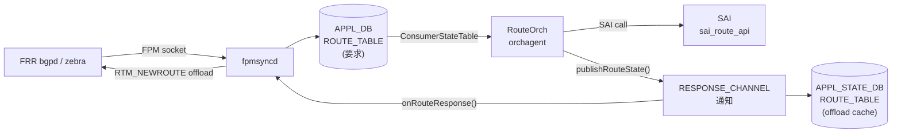

# APPL_STATE_DB ROUTE_TABLE (route offload cache)

## 概要

`APPL_STATE_DB` の `ROUTE_TABLE` は、`orchagent` の `RouteOrch` が SAI 経路プログラミング完了後に書き込む**経路オフロードキャッシュ**。APPL_DB の `ROUTE_TABLE`（fpmsyncd が書き込む経路要求テーブル）と **テーブル名・キー構造が同一** だが、格納先 DB が異なる（DB インデックス 0 vs 14）[^schema]。

`fpmsyncd` がこのテーブルを `APPL_DB_ROUTE_TABLE_RESPONSE_CHANNEL` 経由で購読し、SAI プログラミング成功を確認した後に FRR zebra へ **offload 通知**（RTM_NEWROUTE）を送出する。Route suppression 機能（APPL_DB suppress-pending）が有効な場合に本フローが活性化する。

!!! note "ROUTE_TABLE が存在する DB は 3 つ"
    同名テーブルが `APPL_DB`・`STATE_DB`・`APPL_STATE_DB` の 3 箇所に存在する。  
    STATE_DB の `ROUTE_TABLE` はデフォルト経路専用の別テーブル（[ROUTE_TABLE (STATE_DB)](route-state.md) 参照）。

<!-- cdb-mermaid -->
### データフロー



<!-- /cdb-mermaid -->

## key 構造

```text
ROUTE_TABLE:<prefix>
ROUTE_TABLE:<vrf_name>:<prefix>
```

APPL_DB の `ROUTE_TABLE` キーと完全に同一。SAI プログラミングに成功した経路のみエントリが存在する。

| key 要素 | 説明 |
|---------|------|
| `<prefix>` | IPv4 / IPv6 プレフィクス（例: `10.0.0.0/24`、`2001:db8::/32`） |
| `<vrf_name>:` | VRF-aware 経路。VRF 名 + `:` のプレフィクス |

## フィールド一覧

| フィールド | 型 | 書込み条件 | 説明 |
|-----------|----|-----------|----|
| `protocol` | string | SET 操作かつ SAI 成功時 | APPL_DB から引き継いだ経路プロトコル名（`bgp`・`static`・`kernel` 等、または空文字列） |
| `err_str` | string | 通知チャネル専用 | SAI 操作結果。成功時 `"SWSS_RC_SUCCESS"`。APPL_STATE_DB 実エントリには書き込まれない |

!!! warning "`err_str` は通知チャネル専用"
    `err_str` は `APPL_DB_ROUTE_TABLE_RESPONSE_CHANNEL` の通知メッセージに含まれるが、  
    APPL_STATE_DB のエントリ（`ROUTE_TABLE:<prefix>` ハッシュ）には書き込まれない。  
    `redis-cli hgetall` で見えるのは `protocol` のみ。

## 書き込みロジック — `publishRouteState()`

ソース: `orchagent/routeorch.cpp` lines 3185–3202[^rorch]

```cpp
void RouteOrch::publishRouteState(const RouteBulkContext& ctx, const ReturnCode& status)
{
    std::vector<FieldValueTuple> fvs;

    /* DEL 操作時は fvs を空にする。
     * ResponsePublisher::publish() は空 fvs を DEL コマンドとして処理し
     * APPL_STATE_DB のエントリを削除する */
    if (ctx.is_set)
    {
        fvs.emplace_back("protocol", ctx.protocol);
    }

    const bool replace = false;
    m_publisher.publish(APP_ROUTE_TABLE_NAME, ctx.key, fvs, status, replace);
}
```

呼ばれるタイミング:

| 呼び出し元 | 行 | 条件 |
|-----------|---|------|
| `doTask()` — サブネット経路（ip2me 相当） | 1050 | SET、既存 IP2ME 経路のみ |
| `doTask()` — 重複エントリ | 1090 | SET、重複 DEL+SET の整合取り |
| `doTask()` — ADD 成功後 | 2729 | SAI `create_route_entry` 成功後 |
| `doTask()` — UPDATE 成功後 | 2970 | SAI `set_route_entry_attribute` 成功後 |

## SET vs DEL の動作

| 操作 | `fvs` | APPL_STATE_DB | 通知チャネル |
|------|-------|---------------|------------|
| SET + SAI 成功 | `[("protocol", value)]` | エントリを書き込み | `err_str=SWSS_RC_SUCCESS` + `protocol` 送信 |
| SET + SAI 失敗 | `[("protocol", value)]` | 書き込みスキップ | `err_str=[SAI] ...` + `protocol` 送信 |
| DEL + SAI 成功 | `[]` | エントリを削除 | `err_str=SWSS_RC_SUCCESS` 送信 |
| DEL + SAI 失敗 | `[]` | 削除スキップ | `err_str=[SAI] ...` 送信 |

`ResponsePublisher` の書き込み条件[^respub]:

```cpp
// response_publisher.cpp:129-133
if (m_enable_db_write_and_notify &&
     ((intent_attrs.size() && state_attrs.size()) ||
     (status.ok() && !intent_attrs.size()))) {
        writeToDB(table, key, state_attrs,
                  intent_attrs.size() ? SET_COMMAND : DEL_COMMAND, replace);
}
```

## fpmsyncd による購読 — `onRouteResponse()`

ソース: `fpmsyncd/routesync.cpp` lines 3165–3265[^fpmsyncd]

`fpmsyncd` は `APPL_DB_ROUTE_TABLE_RESPONSE_CHANNEL` を `NotificationConsumer` で購読し、通知を `onRouteResponse()` に渡す。

```cpp
// fpmsyncd.cpp:78
const auto routeResponseChannelName = std::string("APPL_DB_") + APP_ROUTE_TABLE_NAME + "_RESPONSE_CHANNEL";
```

処理条件:

1. `isSuppressionEnabled()` が `false` の場合は即リターン（route suppression 無効時は offload 通知しない）
2. `err_str != "SWSS_RC_SUCCESS"` → 失敗扱い、offload 通知スキップ
3. `protocol` フィールド不在 → DEL 操作とみなして offload 通知スキップ
4. `protocol == ""` → offload 通知スキップ（プロトコル不明経路）
5. 上記を通過した場合 → `sendOffloadReply()` で FRR zebra に RTM_NEWROUTE を送信

```cpp
// routesync.cpp:3195-3206
for (const auto& fieldValue: fieldValues)
{
    if (field == "err_str")
        isSuccessReply = (value == "SWSS_RC_SUCCESS");
    else if (field == "protocol")
    {
        // protocol フィールドがあれば SET 操作とみなす（DEL 時は不在）
        isSetOperation = true;
        protocol = value;
    }
}
```

## Warm Restart 時の動作

Warm restart 完了後、`fpmsyncd::onWarmStartEnd()` が呼ばれる際に `markRoutesOffloaded()` が実行される[^fpmsyncd]:

```cpp
void RouteSync::markRoutesOffloaded(swss::DBConnector& db)
{
    sendOffloadReply(db, APP_ROUTE_TABLE_NAME);
}
```

APPL_STATE_DB の全 ROUTE_TABLE エントリを読み取り、zebra に offload 通知を一括送信する。これにより warm restart 後に FRR が持つ経路の offload フラグが復元される。

<!-- ordering -->
## 書込み順依存 (Phase B)

<!-- evidence: meta/_intermediate/cdb-flow/route-cache-ordering.md -->

`RouteOrch::publishRouteState()` が `ResponsePublisher` 経由で APPL_STATE_DB ROUTE_TABLE へ書き込む際の順序依存を示す。

### 検出された順序依存

| # | 依存関係 | 方向 | 緩和策 |
|---|----------|------|--------|
| 1 | APPL_DB ROUTE_TABLE → SAI 成功 → APPL_STATE_DB 書き込み | 強制先行（SAI 失敗時はエントリ不在） | SAI 失敗経路は APPL_STATE_DB に存在しない点に注意 |
| 2 | VRF SAI 登録 → VRF 経路の APPL_STATE_DB 書き込み | 強制先行（isVRFexists false → 後回し） | VRF を先に作成 |
| 3 | doTask() flush() → APPL_STATE_DB 書き込みのまとめ到着 | バッチ境界（同サイクル内変更はまとめて送出） | consumer は同一バッチ変更の個別到着順を仮定しないこと |
| 4 | suppress-fib-pending 有効 → fpmsyncd が RESPONSE_CHANNEL 購読 | 機能有効時のみ | 無効時は APPL_STATE_DB 書き込みは発生するが offload 通知は行われない |
| 5 | Warm Restart: APPL_STATE_DB 既存 → onWarmStartEnd → offload 通知 | 後払い（通常フローとは逆順） | warm restart 完了後に offload フラグ復元が自動実行される |

### 主要な制約詳細

**SAI 成功ゲート（依存 #1）**: APPL_STATE_DB エントリは `addRoutePost()`（routeorch.cpp:L2729）または `removeRoutePost()`（routeorch.cpp:L2970）末尾の `publishRouteState()` 呼び出しから `ResponsePublisher::publish()` を経由して書き込まれる。`response_publisher.cpp:L129-148` の条件ガードにより、SAI 失敗（`status.ok()` が false）かつ SET 操作の場合は APPL_STATE_DB への書き込みがスキップされる。このため APPL_STATE_DB と APPL_DB の経路数差分は SAI プログラミング失敗経路の指標となる:

```cpp
// response_publisher.cpp:129-133
if (m_enable_db_write_and_notify &&
     ((intent_attrs.size() && state_attrs.size()) ||
     (status.ok() && !intent_attrs.size()))) {
        writeToDB(table, key, state_attrs, ...);
}
```

**VRF 経路の先行制約（依存 #2）**: key が `Vrf<name>:<prefix>` 形式の場合、RouteOrch は `m_vrfOrch->isVRFexists(vrf_name)` を確認し、VRF SAI オブジェクトが未登録の間は処理を `it++; continue` で後回しにする（routeorch.cpp:L711-714）。VRF が存在しなければ SAI プログラミング自体が行われず、APPL_STATE_DB への書き込みも発生しない。

**バッファリングと flush（依存 #3）**: `RouteOrch` は `m_publisher.setBuffered(true)` で RESPONSE_CHANNEL + APPL_STATE_DB 書き込みをバッファリングし、`doTask()` 末尾の `m_publisher.flush()` で一括送出する（routeorch.cpp:L57, L1231）。同一 `doTask()` サイクル内で処理された複数経路の状態変更は、flush 時にまとめて Redis パイプラインに投入される。consumer は同一バッチ内の書き込みが個別到着順を保証しないことを前提とする必要がある。

**suppression 有効時のみ fpmsyncd が購読（依存 #4）**: APPL_STATE_DB への書き込みは `suppress-fib-pending` 設定に関わらず発生するが、fpmsyncd がその結果を `APPL_DB_ROUTE_TABLE_RESPONSE_CHANNEL` 経由で受け取って FRR zebra へ offload 通知を送るのは `suppress-fib-pending = enabled` の場合のみ。suppression 無効時は APPL_STATE_DB への書き込みが発生しても FRR の offload フラグは更新されない（fpmsyncd.cpp:L113-118、routesync.cpp:L3174）。

**Warm Restart の後払い offload（依存 #5）**: Warm restart 完了時には `onWarmStartEnd()` が APPL_STATE_DB の全 ROUTE_TABLE エントリを走査して FRR zebra に RTM_NEWROUTE を一括送信する。この経路では通常フローと逆に APPL_STATE_DB が先に存在しており、それを読んで offload 通知を送出する（routesync.cpp:L3298-3310）。

<!-- /ordering -->

<!-- cross-refs -->
## 暗黙参照テーブル (Phase C)

<!-- evidence: meta/_intermediate/cdb-flow/route-cache-cross-refs.md -->

APPL_STATE_DB `ROUTE_TABLE` は YANG 未定義のオペレーショナルテーブルで、`RouteOrch` が**書き手 (producer)**、`fpmsyncd` と `route_check.py` が**読み手 (consumer)** となる。以下は `ResponsePublisher`・`routeorch.cpp`・`fpmsyncd.cpp`・`routesync.cpp`・`route_check.py` を横断したコード調査で検出した暗黙参照の一覧。

### 1. APPL_DB ROUTE_TABLE（書き込みトリガ兼キー源泉）

- **参照先**: APPL_DB `ROUTE_TABLE`
- **方向**: 読み取り（`ConsumerStateTable` 購読） → APPL_STATE_DB `ROUTE_TABLE` への書き込みトリガ
- **参照元**: `routeorch.cpp:192`（`createRetryCache(APP_ROUTE_TABLE_NAME)`）、`routeorch.cpp:622`（dispatch: `APP_ROUTE_TABLE_NAME`）
- **意味**: APPL_DB `ROUTE_TABLE` に経路が SET されると `RouteOrch::doTask()` が起動し、SAI プログラミング成功後に APPL_STATE_DB `ROUTE_TABLE` の同一キーに `protocol` フィールドを書き込む。DEL 時は APPL_STATE_DB の同一キーエントリを削除する。APPL_STATE_DB のキー構造は APPL_DB と同一（`ROUTE_TABLE:<prefix>` または `ROUTE_TABLE:<vrf>:<prefix>`）。

### 2. CONFIG_DB VRF（VRF 経路の先行依存）

- **参照先**: CONFIG_DB `VRF` テーブル（`VRFOrch` 管理）
- **方向**: 読み取り（`m_vrfOrch->isVRFexists(vrf_name)`）
- **参照元**: `routeorch.cpp:706-716`（`Vrf<name>:` プレフィックスキーの解決）
- **意味**: key が `Vrf<name>:<prefix>` 形式の VRF 経路を処理する際、VRF SAI オブジェクトが未登録の場合は `it++; continue` で後回しになり APPL_STATE_DB への書き込みは行われない。VRF が存在しない間は当該 VRF の経路エントリは APPL_STATE_DB に出現しない。
- **ブロッキング**: VRF SAI 未登録時は対象 VRF 経路の APPL_STATE_DB エントリが書かれない。VRF を先に CONFIG_DB で作成・処理完了させること。

### 3. CONFIG_DB DEVICE_METADATA|localhost.suppress-fib-pending（suppression 機能スイッチ）

- **参照先**: CONFIG_DB `DEVICE_METADATA|localhost` の `suppress-fib-pending` フィールド
- **方向**: 読み取り（起動時）＋動的変更監視（`SubscriberStateTable` 購読）
- **参照元**: `fpmsyncd.cpp:82-83`（`deviceMetadataTable`）、`fpmsyncd.cpp:113`（起動時読み取り）、`fpmsyncd.cpp:278-297`（動的変更追従）
- **意味**: fpmsyncd が `APPL_DB_ROUTE_TABLE_RESPONSE_CHANNEL` を購読して FRR zebra へ offload 通知を送るかどうかを制御する。`"enabled"` の場合のみ `NotificationConsumer` を生成し suppression を有効化する。APPL_STATE_DB への書き込み自体は suppression 設定に関わらず RouteOrch が行う。runtime に無効化された場合は `markRoutesOffloaded()` で全経路の offload フラグを一括復元する。

### 4. fpmsyncd / RouteSync（RESPONSE_CHANNEL 購読 consumer）

- **参照先**: `APPL_DB_ROUTE_TABLE_RESPONSE_CHANNEL`（通知チャネル）、`APPL_STATE_DB ROUTE_TABLE`（Warm Restart 時読み出し）
- **方向**: 読み取り（購読）
- **参照元**: `fpmsyncd.cpp:78`（チャネル名定義）、`routesync.cpp:3165-3265`（`onRouteResponse()`）、`routesync.cpp:3290-3310`（`markRoutesOffloaded()`）
- **意味**: fpmsyncd は RESPONSE_CHANNEL 経由で SAI プログラミング結果を受け取り、成功した経路について FRR zebra に RTM_NEWROUTE（offload フラグ付き）を送信する。Warm Restart 完了時（`onWarmStartEnd()`）は APPL_STATE_DB ROUTE_TABLE の全エントリを走査して一括 offload 通知を送る。

### 5. route_check.py（APPL_STATE_DB 読み出し + RESPONSE_CHANNEL 注入）

- **参照先**: `APPL_STATE_DB`、`APPL_DB_ROUTE_TABLE_RESPONSE_CHANNEL`
- **方向**: 読み取り（整合確認）＋書き込み（RESPONSE_CHANNEL へ recovery 注入）
- **参照元**: `scripts/route_check.py:767-771`（`mitigate_installed_not_offloaded_frr_routes()`）
- **意味**: `route_check.py` は FRR に存在するが offload フラグが立っていない経路を検出した場合、`NotificationProducer` で `APPL_DB_ROUTE_TABLE_RESPONSE_CHANNEL` に `SWSS_RC_SUCCESS` を注入して fpmsyncd に offload 通知を再送させる。APPL_STATE_DB を直接書き換えるのではなくチャネル経由でフローを再起動する点が特徴。

### 参照関係サマリ

| 参照先テーブル / リソース | 参照方向 | 条件 | 参照元 evidence |
|--------------------------|---------|------|----------------|
| `APPL_DB ROUTE_TABLE` | 読み取り（書き込みトリガ） | 常時 | `routeorch.cpp:192, 622` |
| `CONFIG_DB VRF` | 読み取り（VRF SAI OID 解決） | VRF 経路（`Vrf<name>:` プレフィックス）のみ | `routeorch.cpp:706-716` |
| `CONFIG_DB DEVICE_METADATA\|localhost.suppress-fib-pending` | 読み取り + 動的監視 | fpmsyncd 起動時・runtime 変更時 | `fpmsyncd.cpp:82-118, 278-297` |
| `fpmsyncd RouteSync`（RESPONSE_CHANNEL 購読） | 読み取り（offload 通知先） | suppression 有効時 + Warm Restart | `routesync.cpp:3165-3310` |
| `route_check.py`（RESPONSE_CHANNEL 注入） | 読み取り + 注入 | 整合チェック実行時 | `route_check.py:767-771` |

<!-- /cross-refs -->

<!-- defaults -->
## フィールドのコード由来デフォルト (Phase A)

<!-- evidence: meta/_intermediate/cdb-flow/route-cache-defaults.md -->

### `protocol` フィールドのデフォルト

ソース: `orchagent/routeorch.h` line 152、`orchagent/routeorch.cpp` lines 157–160, 785–788[^rorch]

`RouteBulkContext` 構造体の `protocol` メンバーは `std::string` のデフォルトコンストラクタによって `""` に初期化される:

```cpp
// routeorch.h:152
std::string protocol;  // Protocol string

// routeorch.h:157-160 (コンストラクタ: protocol の明示初期化なし)
RouteBulkContext(const std::string& key, bool is_set)
    : key(key), excp_intfs_flag(false), using_temp_nhg(false), is_set(is_set),
      fallback_to_default_route(false), retry_cst(DUMMY_CONSTRAINT)
{}
```

APPL_DB の `protocol` フィールドが存在する場合のみ `ctx.protocol` に値が設定される:

```cpp
// routeorch.cpp:785-788
if (fvField(i) == "protocol" && fvValue(i) != "")
{
    ctx.protocol = fvValue(i);
}
```

| APPL_DB `protocol` の状態 | APPL_STATE_DB `protocol` の書込み値 |
|--------------------------|-------------------------------------|
| `"bgp"` 等（非空文字列）  | `"bgp"` 等（そのままコピー）         |
| フィールド不在             | `""` （空文字列）                   |
| `""` 空文字列              | `""` （空文字列）                   |

**重要**: `m_publisher.m_directDbWrite = true`（routeorch.cpp:58）のため、`ResponsePublisher` は既存エントリとのマージや NULL フィルタリングを行わず、`applStateTable.set(key, attrs)` を直接実行する[^respub]。

### `err_str` フィールドのデフォルト

`err_str` は通知チャネル専用であり APPL_STATE_DB の実エントリには書き込まれない[^respub]:

```cpp
// response_publisher.cpp:102-103
swss::FieldValueTuple err_str("err_str", PrependedComponent(status) + status.message());
intent_attrs_copy.insert(intent_attrs_copy.begin(), err_str);
```

```cpp
// response_publisher.cpp:144-148
std::vector<FieldValueTuple> state_attrs;
if (status.ok())
{
    state_attrs = intent_attrs;  // err_str を含まない intent_attrs（元の fvs）のみ
}
```

通知チャネルの `err_str` 値:

| SAI 結果 | 通知チャネルの `err_str` |
|---------|----------------------|
| 成功 | `"SWSS_RC_SUCCESS"` |
| SAI エラー | `"[SAI] " + status.message()` |
| Orchagent エラー | `"[OrchAgent] " + status.message()` |

### フィールドまとめ

| フィールド | コード由来デフォルト | 書込み先 | 書込み条件 |
|-----------|-------------------|---------|-----------|
| `protocol` | `""` (空文字列) | APPL_STATE_DB エントリ | SET 操作かつ SAI 成功時 |
| `err_str` | `"SWSS_RC_SUCCESS"` (成功時) | 通知チャネルのみ | 全 SET / DEL 操作で送信 |

<!-- /defaults -->

## 確認コマンド

```bash
# APPL_STATE_DB の特定経路エントリを確認
sonic-db-cli APPL_STATE_DB hgetall 'ROUTE_TABLE:10.0.0.0/24'

# APPL_STATE_DB の全 ROUTE_TABLE エントリ数を確認
sonic-db-cli APPL_STATE_DB keys 'ROUTE_TABLE:*' | wc -l

# APPL_DB と APPL_STATE_DB の経路エントリ数比較（差分がある場合 SAI 失敗の可能性）
echo "APPL_DB:"
sonic-db-cli APPL_DB keys 'ROUTE_TABLE:*' | wc -l
echo "APPL_STATE_DB:"
sonic-db-cli APPL_STATE_DB keys 'ROUTE_TABLE:*' | wc -l

# route_check.py でテーブル整合を確認
sudo route_check.py
```

### 典型エントリ例

```
# BGP 経路のオフロード成功
APPL_STATE_DB> hgetall ROUTE_TABLE:10.1.0.0/24
1) "protocol"
2) "bgp"

# protocol 不明（fpmsyncd 側で protocol を省略した経路）
APPL_STATE_DB> hgetall ROUTE_TABLE:192.168.0.0/16
1) "protocol"
2) ""
```

## 関連ページ

- [`ROUTE_TABLE (APPL_DB)`](appl-db-route.md) — fpmsyncd が書き込む経路要求テーブル
- [`ROUTE_TABLE (STATE_DB / APPL_STATE_DB)`](route-state.md) — STATE_DB のデフォルト経路状態テーブルも含む統合ページ
- [`STATIC_ROUTE`](static-route.md) — CONFIG_DB の静的経路設定

## 引用元

[^rorch]: RouteOrch publishRouteState 実装: `orchagent/routeorch.cpp`. <https://github.com/sonic-net/sonic-swss/blob/4305596156d70e9797e8a881b3d19b46de0bce0d/orchagent/routeorch.cpp#L3185>
[^respub]: ResponsePublisher publish 実装: `orchagent/response_publisher.cpp`. <https://github.com/sonic-net/sonic-swss/blob/4305596156d70e9797e8a881b3d19b46de0bce0d/orchagent/response_publisher.cpp#L96>
[^fpmsyncd]: fpmsyncd onRouteResponse / markRoutesOffloaded 実装: `fpmsyncd/routesync.cpp`. <https://github.com/sonic-net/sonic-swss/blob/4305596156d70e9797e8a881b3d19b46de0bce0d/fpmsyncd/routesync.cpp#L3165>
[^schema]: テーブル名・DB インデックス定数: `common/schema.h`. <https://github.com/sonic-net/sonic-swss-common/blob/158de8d3463ff4b841653f6d57190bb142b80d9c/common/schema.h#L27>
