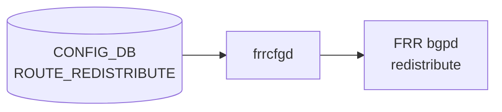

# ROUTE_REDISTRIBUTE テーブル

## 概要

`ROUTE_REDISTRIBUTE` は [FRR](../../reference/glossary.md#term-frr) ルーティングデーモン間の経路再配布ポリシーを [CONFIG_DB](../../reference/glossary.md#term-config_db) に保持するテーブル。[YANG](../../reference/glossary.md#term-yang) モジュール `sonic-route-common` が定義し、`frrcfgd` が購読して `vtysh` コマンドへ変換する[^1]。現在 `dst_protocol` は `bgp` のみサポートされており、`connected`・`static`・`ospf`・`ospf3` のいずれかのプロトコルを [BGP](../../reference/glossary.md#term-bgp) へ再配布する用途に限定されている[^2]。

<!-- defaults -->
## フィールドのコード由来デフォルト

### デフォルト値一覧

| フィールド | 型 | 既定値 | 省略可否 | コード根拠 |
|-----------|-----|--------|---------|-----------|
| `vrf_name` | string (key) | — | 必須 (key) | YANG key 定義[^1] |
| `src_protocol` | string (key) | — | 必須 (key) | YANG key 定義[^1] |
| `dst_protocol` | string (key) | — | 必須 (key) | YANG key 定義[^1] |
| `addr_family` | string (key) | — | 必須 (key) | YANG key 定義[^1] |
| `route_map` | leaf-list string | 省略可 (absent) | 任意 | YANG optional + `frrcfgd` L1979 `+route_map`[^2] |
| `metric` | uint32 | 省略可 (absent) | 任意 | YANG optional + `frrcfgd` L1979 `++metric`[^2] |

### 解説

`metric` および `route_map` はどちらも YANG 上で任意フィールド（必須制約なし）。`frrcfgd` の `route_redist_key_map` では `++metric` / `+route_map` のプレフィクス表記により「フィールドが absent の場合は FRR コマンドへの引数出力をスキップ」する実装になっている[^2]。

```python
# frrcfgd.py L1979
route_redist_key_map = [
    (['protocol', '++metric', '+route_map'],
     '{no:no-prefix}redistribute {} {:redist-metric} {:redist-route-map}',
     hdl_route_redist_set)
]
```

- `metric` 省略時 → FRR コマンド `redistribute connected` のみ（metric 句なし）
- `route_map` 省略時 → FRR コマンドに `route-map` 句なし

### テスト実例

`sample_config_db.json` での最小構成:

```json
"ROUTE_REDISTRIBUTE": {
    "default|connected|bgp|ipv4": {}
}
```

`route_map` も `metric` も省略した状態が有効エントリ。

<!-- /defaults -->

<!-- ordering -->
## 書込み順依存 (Phase B)

`frrcfgd`（`BGPConfigDaemon`）が `ROUTE_REDISTRIBUTE` イベントを処理する前に `BGP_GLOBALS.local_asn` を参照し、未設定の場合は **silent drop** する。また削除順序の逆転により FRR 側に設定が残存するリスクがある。

### 検出された順序依存

| # | 依存関係 | 方向 | 影響 | 緩和策 |
|---|----------|------|------|--------|
| 1 | `BGP_GLOBALS.local_asn` 設定 → `ROUTE_REDISTRIBUTE` 書き込み | ハード先行必須 | local_asn 未設定の場合は silent drop | `BGP_GLOBALS` を先に設定すること |
| 2 | `BGP_GLOBALS.local_asn` SET 後 → `ROUTE_REDISTRIBUTE` 自動再適用 | 自動リカバー | 順序逆でも BGP_GLOBALS SET 後に自動的に反映される | 本番では正順を守る |
| 3 | unified モード: `BGP_GLOBALS` が `ROUTE_REDISTRIBUTE` より先に処理 | 起動時保証 | unified モードでは正常 | 通常の SONiC unified モードで保証 |
| 4 | `ROUTE_REDISTRIBUTE` DEL → `BGP_GLOBALS` DEL | 推奨削除順序 | BGP_GLOBALS 先削除時は FRR に redistribute 設定が残存 | `ROUTE_REDISTRIBUTE` を全削除してから `BGP_GLOBALS` を削除 |

### 主要な制約詳細

**BGP_GLOBALS.local_asn ゲート（依存 #1）**: `frrcfgd.py` の `bgp_table_handler_common` はすべての VRF テーブルイベントの先頭で `__get_vrf_asn(vrf)` を呼び出す。`ROUTE_REDISTRIBUTE` は `vrf_tables`（L2138）に含まれるため、VRF に対応する `BGP_GLOBALS.local_asn` が CONFIG_DB に未設定だと `local_asn is None` となり、イベントは DEBUG ログのみで静かに捨てられる。エラーログも出ないため運用上の検出が困難（evidence: `frrcfgd.py:2658-2661`, `frrcfgd.py:2442-2447`）[^2]。

**BGP_GLOBALS 設定後の自動再適用（依存 #2）**: `BGP_GLOBALS.local_asn` の SET が成功した直後、`frrcfgd` は `__apply_dep_vrf_table(vrf, 'ROUTE_REDISTRIBUTE')` を呼び出し、すでに CONFIG_DB に存在する当該 VRF の全 `ROUTE_REDISTRIBUTE` エントリをキューに再送する。このため逆順で書いた場合も最終的には FRR に反映される。ただし再適用はアトミックでなく、中間状態で他のテーブル更新が割り込む可能性がある（evidence: `frrcfgd.py:2703-2704`, `frrcfgd.py:2530-2545`）[^2]。

**DEL 順序のリスク（依存 #4）**: `BGP_GLOBALS.local_asn` を先に削除すると `bgp_asn[vrf]` が消去され、その後の `ROUTE_REDISTRIBUTE` DEL イベントが silent drop される。結果として FRR bgpd 側に `redistribute <src>` 設定が残存する。**推奨削除順序: `ROUTE_REDISTRIBUTE` 全エントリを DEL → `BGP_GLOBALS.local_asn` を DEL**（evidence: `frrcfgd.py:2449-2465`）[^2]。

<!-- /ordering -->

<!-- cross-refs -->
## 暗黙参照マップ (Phase C)

> YANG leafref として静的に強制される参照と、`frrcfgd` が処理時に参照するランタイム依存を網羅する。
> 詳細証跡: `meta/_intermediate/cdb-flow/route-redistribute-ordering.md`

### ROUTE_REDISTRIBUTE が参照する下流テーブル / リソース

| 対象 | 参照機構 | 効果 |
|---|---|---|
| `VRF` (`vrf_name`) | YANG leafref (`sonic-vrf/VRF/VRF_LIST/name`) | `default` 以外の `vrf_name` に対し存在しない VRF 名は config-load で reject される[^1] |
| `ROUTE_MAP_SET` (`route_map`) | YANG leafref (`sonic-route-map/ROUTE_MAP_SET/ROUTE_MAP_SET_LIST/name`) | `route_map` フィールドに存在しない ROUTE_MAP 名を指定すると config-load で reject される[^1] |
| `BGP_GLOBALS` (`local_asn`) | runtime ゲート (`frrcfgd` `__get_vrf_asn`) | VRF に対応する `BGP_GLOBALS.local_asn` が未設定の場合、ROUTE_REDISTRIBUTE イベントは silent drop される（evidence: `frrcfgd.py:2658-2661`）[^2] |

### ROUTE_REDISTRIBUTE を参照する上流コンポーネント

| 参照元 | 参照機構 | 効果 |
|---|---|---|
| `frrcfgd` (`BGPConfigDaemon`) | `subscribe` + `bgp_table_handler_common` | ROUTE_REDISTRIBUTE の SET/DEL を購読し `vtysh redistribute` コマンドを FRR bgpd へ発行する[^2] |
| `frrcfgd` `__apply_dep_vrf_table` | `BGP_GLOBALS.local_asn` SET 後に自動再適用 | `BGP_GLOBALS.local_asn` が設定されると、当該 VRF の全 ROUTE_REDISTRIBUTE エントリをキューに再送して FRR に反映する（evidence: `frrcfgd.py:2703-2704`）[^2] |

### 参照関係サマリ

```
ROUTE_REDISTRIBUTE
  |- [YANG leafref]  VRF.name                  (vrf_name が non-default の場合)
  |- [YANG leafref]  ROUTE_MAP_SET.name         (route_map フィールド、任意)
  |- [runtime gate]  BGP_GLOBALS.local_asn      (local_asn 未設定時 silent drop)
  |
  <- [subscribe]  frrcfgd BGPConfigDaemon       (vtysh redistribute コマンドへ変換)
```

<!-- /cross-refs -->

## key 構造

```text
ROUTE_REDISTRIBUTE|<vrf_name>|<src_protocol>|<dst_protocol>|<addr_family>
```

| key 要素 | 取りうる値 |
|---------|-----------|
| `vrf_name` | `default` または `Vrf...` 形式の VRF 名 |
| `src_protocol` | `connected` / `static` / `ospf` / `ospf3` |
| `dst_protocol` | `bgp`（現在このみ） |
| `addr_family` | `ipv4` / `ipv6` |

## 主要フィールド

| フィールド | 型 | 既定値 | 説明 |
|-----------|----|--------|------|
| `route_map` | string (leaf-list, max 1) | 省略可 | 再配布時に適用する [ROUTE_MAP](../../reference/glossary.md#term-route_map) フィルタ名 |
| `metric` | uint32 | 省略可 | 再配布経路に付与するメトリック値 |

## 制約

- `dst_protocol` は `bgp` のみ有効。`frrcfgd` は `bgp` 以外を受け取るとエラーログを出力してスキップする[^2]。
- `route_map` は最大 1 エントリ（YANG `max-elements 1`）[^1]。
- IPv6 かつ `src_protocol=ospf3` の場合、`frrcfgd` が FRR コマンド生成時に `ospf6` へ内部変換する[^2]。
- `vrf_name` は `default` または VRF テーブルへの leafref。

## 購読者・処理フロー

`frrcfgd`（`sonic-frr-mgmt-framework`）が `ROUTE_REDISTRIBUTE` テーブルを購読し、変更を以下のように FRR へ反映する[^2]。

1. key を `vrf_name|src_protocol|dst_protocol|addr_family` の 4 要素に分解
2. `router bgp <asn> vrf <vrf>` → `address-family <af> unicast` のコンテキストに移行
3. `redistribute <src_proto> [metric <N>] [route-map <name>]` を発行
4. 削除時は事前に `no redistribute <src_proto>` でリセットしてから再設定

<!-- cdb-mermaid -->
### データフロー (自動生成)



!!! note "凡例"
    CONFIG_DB から FRR までの典型経路を示すミニ図。
<!-- /cdb-mermaid -->

## 関連 CONFIG_DB / YANG

- 関連 CONFIG_DB: `VRF`、`ROUTE_MAP`
- 関連 YANG: `sonic-route-common`、`sonic-route-map`、`sonic-vrf`

## 引用元

[^1]: YANG 定義: `sonic-route-common.yang`. <https://github.com/sonic-net/sonic-buildimage/blob/9ea932ec2e18f35e58268ec2e4456b1d4afd65cd/src/sonic-yang-models/yang-models/sonic-route-common.yang>
[^2]: ハンドラ実装: `frrcfgd.py`. <https://github.com/sonic-net/sonic-buildimage/blob/9ea932ec2e18f35e58268ec2e4456b1d4afd65cd/src/sonic-frr-mgmt-framework/frrcfgd/frrcfgd.py>
