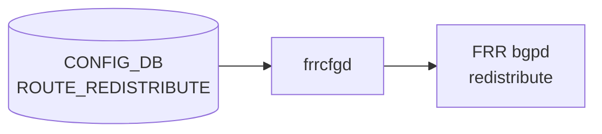

# ROUTE_REDISTRIBUTE テーブル

## 概要

`ROUTE_REDISTRIBUTE` は [FRR](../../reference/glossary.md#term-frr) ルーティングデーモン間の経路再配布ポリシーを [CONFIG_DB](../../reference/glossary.md#term-config_db) に保持するテーブル。[YANG](../../reference/glossary.md#term-yang) モジュール `sonic-route-common` が定義し、`frrcfgd` が購読して `vtysh` コマンドへ変換する[^1]。現在 `dst_protocol` は `bgp` のみサポートされており、`connected`・`static`・`ospf`・`ospf3` のいずれかのプロトコルを [BGP](../../reference/glossary.md#term-bgp) へ再配布する用途に限定されている[^2]。

<!-- defaults -->
## フィールドのコード由来デフォルト

### デフォルト値一覧

| フィールド | 型 | 既定値 | 省略可否 | コード根拠 |
|-----------|-----|--------|---------|-----------|
| `vrf_name` | string (key) | — | 必須 (key) | YANG key 定義[^1] |
| `src_protocol` | string (key) | — | 必須 (key) | YANG key 定義[^1] |
| `dst_protocol` | string (key) | — | 必須 (key) | YANG key 定義[^1] |
| `addr_family` | string (key) | — | 必須 (key) | YANG key 定義[^1] |
| `route_map` | leaf-list string | 省略可 (absent) | 任意 | YANG optional + `frrcfgd` L1979 `+route_map`[^2] |
| `metric` | uint32 | 省略可 (absent) | 任意 | YANG optional + `frrcfgd` L1979 `++metric`[^2] |

### 解説

`metric` および `route_map` はどちらも YANG 上で任意フィールド（必須制約なし）。`frrcfgd` の `route_redist_key_map` では `++metric` / `+route_map` のプレフィクス表記により「フィールドが absent の場合は FRR コマンドへの引数出力をスキップ」する実装になっている[^2]。

```python
# frrcfgd.py L1979
route_redist_key_map = [
    (['protocol', '++metric', '+route_map'],
     '{no:no-prefix}redistribute {} {:redist-metric} {:redist-route-map}',
     hdl_route_redist_set)
]
```

- `metric` 省略時 → FRR コマンド `redistribute connected` のみ（metric 句なし）
- `route_map` 省略時 → FRR コマンドに `route-map` 句なし

### テスト実例

`sample_config_db.json` での最小構成:

```json
"ROUTE_REDISTRIBUTE": {
    "default|connected|bgp|ipv4": {}
}
```

`route_map` も `metric` も省略した状態が有効エントリ。

<!-- /defaults -->

<!-- ordering -->
## 書込み順依存 (Phase B)

`frrcfgd`（`BGPConfigDaemon`）が `ROUTE_REDISTRIBUTE` イベントを処理する前に `BGP_GLOBALS.local_asn` を参照し、未設定の場合は **silent drop** する。また削除順序の逆転により FRR 側に設定が残存するリスクがある。

### 検出された順序依存

| # | 依存関係 | 方向 | 影響 | 緩和策 |
|---|----------|------|------|--------|
| 1 | `BGP_GLOBALS.local_asn` 設定 → `ROUTE_REDISTRIBUTE` 書き込み | ハード先行必須 | local_asn 未設定の場合は silent drop | `BGP_GLOBALS` を先に設定すること |
| 2 | `BGP_GLOBALS.local_asn` SET 後 → `ROUTE_REDISTRIBUTE` 自動再適用 | 自動リカバー | 順序逆でも BGP_GLOBALS SET 後に自動的に反映される | 本番では正順を守る |
| 3 | unified モード: `BGP_GLOBALS` が `ROUTE_REDISTRIBUTE` より先に処理 | 起動時保証 | unified モードでは正常 | 通常の SONiC unified モードで保証 |
| 4 | `ROUTE_REDISTRIBUTE` DEL → `BGP_GLOBALS` DEL | 推奨削除順序 | BGP_GLOBALS 先削除時は FRR に redistribute 設定が残存 | `ROUTE_REDISTRIBUTE` を全削除してから `BGP_GLOBALS` を削除 |

### 主要な制約詳細

**BGP_GLOBALS.local_asn ゲート（依存 #1）**: `frrcfgd.py` の `bgp_table_handler_common` はすべての VRF テーブルイベントの先頭で `__get_vrf_asn(vrf)` を呼び出す。`ROUTE_REDISTRIBUTE` は `vrf_tables`（L2138）に含まれるため、VRF に対応する `BGP_GLOBALS.local_asn` が CONFIG_DB に未設定だと `local_asn is None` となり、イベントは DEBUG ログのみで静かに捨てられる。エラーログも出ないため運用上の検出が困難（evidence: `frrcfgd.py:2658-2661`, `frrcfgd.py:2442-2447`）[^2]。

**BGP_GLOBALS 設定後の自動再適用（依存 #2）**: `BGP_GLOBALS.local_asn` の SET が成功した直後、`frrcfgd` は `__apply_dep_vrf_table(vrf, 'ROUTE_REDISTRIBUTE')` を呼び出し、すでに CONFIG_DB に存在する当該 VRF の全 `ROUTE_REDISTRIBUTE` エントリをキューに再送する。このため逆順で書いた場合も最終的には FRR に反映される。ただし再適用はアトミックでなく、中間状態で他のテーブル更新が割り込む可能性がある（evidence: `frrcfgd.py:2703-2704`, `frrcfgd.py:2530-2545`）[^2]。

**DEL 順序のリスク（依存 #4）**: `BGP_GLOBALS.local_asn` を先に削除すると `bgp_asn[vrf]` が消去され、その後の `ROUTE_REDISTRIBUTE` DEL イベントが silent drop される。結果として FRR bgpd 側に `redistribute <src>` 設定が残存する。**推奨削除順序: `ROUTE_REDISTRIBUTE` 全エントリを DEL → `BGP_GLOBALS.local_asn` を DEL**（evidence: `frrcfgd.py:2449-2465`）[^2]。

<!-- /ordering -->

<!-- cross-refs -->
## 暗黙参照マップ (Phase C)

> YANG leafref として静的に強制される参照と、`frrcfgd` が処理時に参照するランタイム依存を網羅する。
> 詳細証跡: `meta/_intermediate/cdb-flow/route-redistribute-ordering.md`

### ROUTE_REDISTRIBUTE が参照する下流テーブル / リソース

| 対象 | 参照機構 | 効果 |
|---|---|---|
| `VRF` (`vrf_name`) | YANG leafref (`sonic-vrf/VRF/VRF_LIST/name`) | `default` 以外の `vrf_name` に対し存在しない VRF 名は config-load で reject される[^1] |
| `ROUTE_MAP_SET` (`route_map`) | YANG leafref (`sonic-route-map/ROUTE_MAP_SET/ROUTE_MAP_SET_LIST/name`) | `route_map` フィールドに存在しない ROUTE_MAP 名を指定すると config-load で reject される[^1] |
| `BGP_GLOBALS` (`local_asn`) | runtime ゲート (`frrcfgd` `__get_vrf_asn`) | VRF に対応する `BGP_GLOBALS.local_asn` が未設定の場合、ROUTE_REDISTRIBUTE イベントは silent drop される（evidence: `frrcfgd.py:2658-2661`）[^2] |

### ROUTE_REDISTRIBUTE を参照する上流コンポーネント

| 参照元 | 参照機構 | 効果 |
|---|---|---|
| `frrcfgd` (`BGPConfigDaemon`) | `subscribe` + `bgp_table_handler_common` | ROUTE_REDISTRIBUTE の SET/DEL を購読し `vtysh redistribute` コマンドを FRR bgpd へ発行する[^2] |
| `frrcfgd` `__apply_dep_vrf_table` | `BGP_GLOBALS.local_asn` SET 後に自動再適用 | `BGP_GLOBALS.local_asn` が設定されると、当該 VRF の全 ROUTE_REDISTRIBUTE エントリをキューに再送して FRR に反映する（evidence: `frrcfgd.py:2703-2704`）[^2] |

### 参照関係サマリ

```
ROUTE_REDISTRIBUTE
  |- [YANG leafref]  VRF.name                  (vrf_name が non-default の場合)
  |- [YANG leafref]  ROUTE_MAP_SET.name         (route_map フィールド、任意)
  |- [runtime gate]  BGP_GLOBALS.local_asn      (local_asn 未設定時 silent drop)
  |
  <- [subscribe]  frrcfgd BGPConfigDaemon       (vtysh redistribute コマンドへ変換)
```

<!-- /cross-refs -->

<!-- failure -->
## 失敗挙動 (Phase D)

<!-- evidence: meta/_intermediate/cdb-flow/route-common-failure.md -->

`frrcfgd`（`BGPConfigDaemon`）が `ROUTE_REDISTRIBUTE` イベントを処理する際の失敗は、(A) `BGP_GLOBALS.local_asn` 未設定による silent drop、(B) `dst_protocol` 不正による LOG_ERR + 恒久スキップ、(C) vtysh コマンド送出失敗による FRR 未反映の 3 系統に分類される。いずれの場合も CONFIG_DB エントリは変更されず、FRR running-config との乖離が生じる。

### A. BGP_GLOBALS.local_asn 未設定 → silent drop

`ROUTE_REDISTRIBUTE` イベントの先頭で `__get_vrf_asn(vrf)` を呼び出し、`BGP_GLOBALS.local_asn` が未設定の場合は DEBUG ログのみで `continue`（silent drop）する（evidence: `frrcfgd.py:2658-2661`）[^2]。

```python
local_asn = self.__get_vrf_asn(vrf)
if local_asn is None and (table != 'BGP_GLOBALS' or 'local_asn' not in data):
    syslog.syslog(LOG_DEBUG, 'ignore table {} update because local_asn for VRF {} was not configured')
    continue
```

| 条件 | FRR 状態 | ログ | 自動回復 |
|------|----------|------|---------|
| `BGP_GLOBALS.local_asn` 未設定 | `redistribute` 未発行 | DEBUG のみ（ERROR なし） | `BGP_GLOBALS.local_asn` SET 後に `__apply_dep_vrf_table` で自動再適用 |

!!! note "自動リカバー経路"
    `BGP_GLOBALS.local_asn` が後から設定されると、`__apply_dep_vrf_table(vrf, 'ROUTE_REDISTRIBUTE')` が呼ばれ当該 VRF の全 `ROUTE_REDISTRIBUTE` エントリが再処理される。最終的には FRR に反映されるが、アトミックではない（evidence: `frrcfgd.py:2703-2704`）[^2]。

### B. dst_protocol != 'bgp' → LOG_ERR + 恒久スキップ

`dst_protocol` が `bgp` 以外の場合、LOG_ERR を出力して `continue`。リトライなし・自動回復なし（evidence: `frrcfgd.py:3156-3158`）[^2]。

```python
if dst_proto != 'bgp':
    syslog.syslog(syslog.LOG_ERR, 'only bgp could be used as dst protocol, but {} was given'.format(dst_proto))
    continue
```

YANG バリデーションは `dst_protocol` の値を制約しないため、不正値のエントリが CONFIG_DB に存在し続けると、イベント再発行のたびに同エラーが出力され続ける。FRR への反映はゼロ。

### C. vtysh コマンド送出失敗 → LOG_ERR + FRR 未反映

`key_map.run_command()` が `False` を返した場合（FRR bgpd への接続失敗・vtysh エラー等）、LOG_ERR を記録して `continue`（evidence: `frrcfgd.py:3165-3168`）[^2]。

```python
ret_val = key_map.run_command(self, table, data, cmd_prefix)
if not ret_val:
    syslog.syslog(syslog.LOG_ERR, 'failed running BGP route redistribute config command')
    continue
```

FRR bgpd が未起動の場合や socket 切断時に発生する。CONFIG_DB のエントリは残存するが FRR running-config は更新されない。自動リトライなし。frrcfgd または FRR 再起動後に手動での再トリガーが必要。

### 失敗時の状態まとめ

| 失敗シナリオ | FRR 状態 | ログレベル | 自動回復 |
|---|---|---|---|
| `BGP_GLOBALS.local_asn` 未設定（silent drop） | 未反映 | DEBUG | あり（BGP_GLOBALS.local_asn SET 後に自動再適用） |
| `dst_protocol != 'bgp'`（不正値） | 未反映 | ERR | なし（CONFIG_DB から不正エントリを削除するまで繰り返し drop） |
| vtysh コマンド送出失敗（FRR 未接続等） | 未反映 | ERR | なし（frrcfgd / FRR 再起動後に手動 re-trigger 必要） |

<!-- /failure -->

<!-- constants -->
## ハードコード定数 (Phase E)

ソース: `sonic-net/sonic-buildimage` `src/sonic-frr-mgmt-framework/frrcfgd/frrcfgd.py`
証跡: `meta/_intermediate/cdb-flow/route-common-constants.md`

| 定数 / リテラル | 値 | 定義箇所 | 用途 |
|---|---|---|---|
| `ip_type` | `'unicast'` | `frrcfgd.py:3153` | `address-family <af> unicast` の ip_type 固定値。`multicast`・`vpn` は未サポート |
| ospf3→ospf6 変換条件 | `af == 'ipv6' and src_proto == 'ospf3'` | `frrcfgd.py:3151-3152` | CONFIG_DB の `ospf3` を FRR コマンドの `ospf6` へ変換するハードコードマッピング |
| 許容 `dst_protocol` | `'bgp'` | `frrcfgd.py:3156` | YANG に enum 制約なし。実行時に `frrcfgd` が `'bgp'` のみを許容するリテラル検証 |
| ROUTE_REDISTRIBUTE ターゲットデーモン | `['bgpd']` | `frrcfgd.py:97` | vtysh コマンドを `bgpd` のみへ送信。`zebra`・`staticd` は含まない |
| `route_map` 最大要素数 | `1` | `sonic-route-common.yang max-elements` | leaf-list 型だが YANG で要素数上限を 1 に固定 |

### 補足

**ip_type 固定**: `ROUTE_REDISTRIBUTE` イベント処理（`frrcfgd.py:3153`）では `ip_type = 'unicast'` を文字列リテラルとして代入し、`address-family <af> unicast` を生成する。CONFIG_DB フィールドには対応する設定項目がなく、`unicast` 以外を指定する手段がない[^2]。

**ospf3→ospf6 変換**: FRR bgpd は `redistribute ospf3` コマンドを認識しないため、`frrcfgd` が `src_proto == 'ospf3'` かつ `af == 'ipv6'` の組み合わせを検出した際に `ospf6` へ内部変換する。`addr_family=ipv4` の場合は変換されない（OSPFv3 は IPv6 専用のため IPv4 × ospf3 の組み合わせは実運用上発生しない）[^2]。

**YANG 非制約 + 実行時制約**: `dst_protocol` は YANG 上で `type string` のみ定義されており enum 値のリストはない。`frrcfgd` の実行時検証が唯一の制約であるため、YANG 検証ツールは不正な `dst_protocol` を通過させる可能性がある[^1][^2]。

<!-- /constants -->

<!-- side-effects -->
## 副次 DB 書込 (Phase F)

<!-- evidence: meta/_intermediate/cdb-flow/route-common-side-effects.md -->

`frrcfgd`（`BGPConfigDaemon`）は `ROUTE_REDISTRIBUTE` イベントを `bgpd` への vtysh コマンドに変換するのみで、STATE_DB・APPL_DB・ASIC_DB への書込みは一切行わない。`frrcfgd.py` が接続する DB は `ConfigDBConnector`（CONFIG_DB 読み取り・購読）のみであり、ERROR_TABLE への書込みも実装されていない（evidence: `frrcfgd.py:2157`, `frrcfgd.py:3149-3168`）[^2]。

### 副次書込先テーブル

| 副次書込先 DB | テーブル名 | 有無 |
|-------------|----------|------|
| STATE_DB | — | なし |
| APPL_DB | — | なし |
| ASIC_DB | — | なし |
| ERROR_TABLE | — | なし |

### FRR 側の副作用（DB 外）

ROUTE_REDISTRIBUTE の SET/DEL は以下の FRR running-config 変化と、それに伴う BGP 制御プレーンの動作変化を引き起こす（DB への反映はない）。

| 操作 | FRR bgpd 側の変化 |
|------|-----------------|
| SET | `hdl_route_redist_set()` が `no redistribute <src_proto>` で既存設定をリセット後、`redistribute <src_proto> [metric <N>] [route-map <name>]` を発行。再配布対象プロトコルの経路が BGP RIB に追加され、ピアへ BGP UPDATE で広告される（evidence: `frrcfgd.py:1330-1342`）[^2] |
| DEL | `no redistribute <src_proto>` を発行。bgpd が該当プロトコルの再配布経路を BGP RIB から削除し、ピアへ BGP WITHDRAW を送出する（evidence: `frrcfgd.py:3160-3168`）[^2] |

<!-- /side-effects -->

<!-- pubsub -->
## 通信メカニズム（Pub/Sub・イベント経路）(Phase G)

`ROUTE_REDISTRIBUTE` テーブルは `frrcfgd`（`sonic-frr-mgmt-framework`）の `BGPConfigDaemon` が **Redis keyspace 通知**経由で購読する。`swsscommon.SubscriberStateTable` は使用せず、独自の `ExtConfigDBConnector` を介して CONFIG_DB の変更イベントを受け取る[^2]。

### frrcfgd — ExtConfigDBConnector（Redis keyspace 購読）

`frrcfgd.py` の `ExtConfigDBConnector.listen()` は Redis の `__keyspace@<dbid>__:*` チャンネルに `psubscribe` し、バックグラウンドスレッドでイベントを受信する。

```python
# frrcfgd.py:1539-1541  listen_thread
sub_key_space = "__keyspace@{}__:*".format(self.get_dbid(self.db_name))
self.pubsub.psubscribe(sub_key_space)
while self.__listen_thread_running:
    msg = self.pubsub.get_message(timeout, True)
```

イベントメッセージのチャンネル名からテーブル名・キーを分離し（`sub_msg_handler`）、登録済みハンドラ（`subscribe_all` で設定）を呼び出す（evidence: `frrcfgd.py:1521-1530`）[^2]。

### subscribe_all — テーブルごとのハンドラ登録

`BGPConfigDaemon.__init__()` の末尾で `subscribe_all()` を呼び、`table_handler_list` に列挙された全テーブルを購読する。

```python
# frrcfgd.py:2359-2361  subscribe_all
def subscribe_all(self):
    for table, hdlr in self.table_handler_list:
        self.config_db.subscribe(table, hdlr)
```

`ROUTE_REDISTRIBUTE` のハンドラとして `bgp_table_handler_common` が登録される（L2316）。その後 `config_db.listen()` を呼び出してバックグラウンドスレッドを起動する（L3956）[^2]。

### bgp_table_handler_common → vtysh 経路

イベント到着時の処理フロー:

1. `bgp_table_handler_common` がキーから `vrf_name` を抽出し `__get_vrf_asn(vrf)` で `BGP_GLOBALS.local_asn` を取得
2. `key_map`（`route_redist_key_map`）の `run_command()` が `redistribute <src_proto> [metric N] [route-map name]` を生成
3. 生成コマンドが `g_run_command()` → vtysh ソケット経由で `bgpd` へ送信される

### 通信経路サマリ

```
CONFIG_DB:ROUTE_REDISTRIBUTE
  └─ frrcfgd ExtConfigDBConnector
       │  keyspace: __keyspace@<CONFIG_DB_id>__:ROUTE_REDISTRIBUTE|*
       └─ subscribe_all → bgp_table_handler_common
            └─ route_redist_key_map.run_command()
                 └─ g_run_command() → vtysh socket → FRR bgpd
                      └─ "redistribute <src_proto> [metric N] [route-map name]"
```

| 経路 | チャンネル / テーブル | 方向 | ハンドラ |
|------|----------------------|------|---------|
| CONFIG_DB → frrcfgd | `__keyspace@*__:ROUTE_REDISTRIBUTE|*`（Redis keyspace） | Pub/Sub | `bgp_table_handler_common` |
| frrcfgd → FRR bgpd | vtysh UNIX ソケット | 同期コマンド発行 | `g_run_command()` → `bgpd` |

<!-- /pubsub -->

<!-- platform -->
## プラットフォーム差分 (Phase H)

調査ソース: `frrcfgd.py` 全行スキャン。詳細スキャン結果は `meta/_intermediate/cdb-flow/route-common-platform.md`。

### docker_routing_config_mode（unified / separated）

`frrcfgd` は起動時に `DEVICE_METADATA.localhost.docker_routing_config_mode` を読み取る（evidence: `frrcfgd.py:2167-2170`）[^2]。

| モード | 起動時動作 | 定常動作 |
|--------|-----------|---------|
| `unified` | `ROUTE_REDISTRIBUTE` を含む全テーブルを CONFIG_DB から読み込み FRR へ一括リプレイ（`frrcfgd.py:2344-2357`） | SET/DEL イベント購読・処理（変更なし） |
| `separated`（デフォルト） | 起動時リプレイなし | SET/DEL イベント購読・処理（変更なし） |

`unified` モードは T1/T2 以上の SONiC 構成で利用されることが多く、frrcfgd 再起動後に CONFIG_DB の設定が FRR へ自動再適用される点が `separated` との唯一の動作差分。

### VOQ Chassis

`frrcfgd.py` に VOQ chassis 固有の分岐コードなし。`ChassisAppDbMgr`（`bgpcfgd/main.py` 側機能）は frrcfgd に含まれない。各 linecard は独立した CONFIG_DB を持ち、`ROUTE_REDISTRIBUTE` 処理ロジックは linecard スコープで共通。

### SmartSwitch (DPU)

frrcfgd は NPU 側 host namespace で動作し、DPU 固有の BGP テーブル（`BGP_VOQ_CHASSIS_NEIGHBOR` 等）は別テーブルで管理される。`ROUTE_REDISTRIBUTE` ハンドラに DPU 固有分岐なし。

### multi-asic

multi-asic 構成では frrcfgd が各 namespace（asic0/asic1 …）で独立して起動する。`ROUTE_REDISTRIBUTE` 処理に namespace 間差分コードなし。

### FRR バージョン差

`frrcfgd.py` に FRR バージョン検出・条件分岐コードなし。`vtysh` へのコマンド文字列は固定。

| プラットフォーム | 動作差分 | 備考 |
|----------------|---------|------|
| 標準 T0/T1/T2（separated） | なし | デフォルト。起動時リプレイなし |
| T1/T2（unified） | 起動時リプレイあり | frrcfgd.py:2344–2357 |
| VOQ chassis (linecard) | なし | linecard スコープで独立動作 |
| SmartSwitch (NPU 側) | なし | DPU 経路は別テーブル管理 |
| multi-asic | なし | namespace ごとに独立起動 |

<!-- /platform -->

## key 構造

```text
ROUTE_REDISTRIBUTE|<vrf_name>|<src_protocol>|<dst_protocol>|<addr_family>
```

| key 要素 | 取りうる値 |
|---------|-----------|
| `vrf_name` | `default` または `Vrf...` 形式の VRF 名 |
| `src_protocol` | `connected` / `static` / `ospf` / `ospf3` |
| `dst_protocol` | `bgp`（現在このみ） |
| `addr_family` | `ipv4` / `ipv6` |

## 主要フィールド

| フィールド | 型 | 既定値 | 説明 |
|-----------|----|--------|------|
| `route_map` | string (leaf-list, max 1) | 省略可 | 再配布時に適用する [ROUTE_MAP](../../reference/glossary.md#term-route_map) フィルタ名 |
| `metric` | uint32 | 省略可 | 再配布経路に付与するメトリック値 |

## 制約

- `dst_protocol` は `bgp` のみ有効。`frrcfgd` は `bgp` 以外を受け取るとエラーログを出力してスキップする[^2]。
- `route_map` は最大 1 エントリ（YANG `max-elements 1`）[^1]。
- IPv6 かつ `src_protocol=ospf3` の場合、`frrcfgd` が FRR コマンド生成時に `ospf6` へ内部変換する[^2]。
- `vrf_name` は `default` または VRF テーブルへの leafref。

## 購読者・処理フロー

`frrcfgd`（`sonic-frr-mgmt-framework`）が `ROUTE_REDISTRIBUTE` テーブルを購読し、変更を以下のように FRR へ反映する[^2]。

1. key を `vrf_name|src_protocol|dst_protocol|addr_family` の 4 要素に分解
2. `router bgp <asn> vrf <vrf>` → `address-family <af> unicast` のコンテキストに移行
3. `redistribute <src_proto> [metric <N>] [route-map <name>]` を発行
4. 削除時は事前に `no redistribute <src_proto>` でリセットしてから再設定

<!-- cdb-mermaid -->
### データフロー (自動生成)



!!! note "凡例"
    CONFIG_DB から FRR までの典型経路を示すミニ図。
<!-- /cdb-mermaid -->

## 関連 CONFIG_DB / YANG

- 関連 CONFIG_DB: `VRF`、`ROUTE_MAP`
- 関連 YANG: `sonic-route-common`、`sonic-route-map`、`sonic-vrf`

## 引用元

[^1]: YANG 定義: `sonic-route-common.yang`. <https://github.com/sonic-net/sonic-buildimage/blob/9ea932ec2e18f35e58268ec2e4456b1d4afd65cd/src/sonic-yang-models/yang-models/sonic-route-common.yang>
[^2]: ハンドラ実装: `frrcfgd.py`. <https://github.com/sonic-net/sonic-buildimage/blob/9ea932ec2e18f35e58268ec2e4456b1d4afd65cd/src/sonic-frr-mgmt-framework/frrcfgd/frrcfgd.py>
