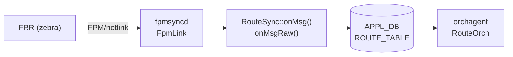

# ROUTE_TABLE handler 分岐 (fpmsyncd / RouteSync)

## 概要

`fpmsyncd` の `RouteSync` クラスは FRR (zebra) から [FPM](../../reference/glossary.md#term-fpm) プロトコル経由で受け取った netlink メッセージを解析し、[APPL_DB](../../reference/glossary.md#term-appl_db) の `ROUTE_TABLE` へ書き込む[^1]。

メッセージの種類（アドレスファミリ、netlink メッセージタイプ、encap タイプ）に応じて複数のハンドラに分岐し、各ハンドラがフィールドを構築する。本ページはその分岐ロジックとフィールドの**コード由来デフォルト**を詳解する。

!!! info "関連ページ"
    `ROUTE_TABLE` のフィールド一覧・運用ヒントは [`ROUTE_TABLE (APPL_DB)`](route.md) を参照。本ページはそのハンドラ実装の詳細を補完する。

<!-- cdb-mermaid -->
### データフロー概略



!!! note "凡例"
    FRR から orchagent までの典型フロー。SRv6 / EVPN / MPLS 系は専用ハンドラ経由。
<!-- /cdb-mermaid -->

## ハンドラ分岐ツリー

### onMsg() — libnl オブジェクト経由 (通常経路・MPLS・VNET)

```
RouteSync::onMsg(nlmsg_type, nl_object)
├── RTM_NEWLINK / RTM_DELLINK
│   └── nl_cache_refill() → return (link cache 更新のみ)
├── AF_MPLS
│   └── onLabelRouteMsg() → LABEL_ROUTE_TABLE (APPL_DB)
└── AF_INET / AF_INET6
    ├── master = "Vnet..." → onVnetRouteMsg() → VNET_ROUTE_TABLE (APPL_DB)
    └── master = "Vrf..." または NULL → onRouteMsg() → ROUTE_TABLE (APPL_DB)
```

### onMsgRaw() — raw FPM メッセージ (SRv6・EVPN・NHG)

```
RouteSync::onMsgRaw(nlmsghdr)
├── RTM_NEWNEXTHOP / RTM_DELNEXTHOP
│   └── onNextHopMsg() → NEXTHOP_GROUP_TABLE (APPL_DB)
├── RTM_NEWPICCONTEXT / RTM_DELPICCONTEXT
│   └── onPicContextMsg() → PIC_CONTEXT_GROUP_TABLE (APPL_DB)
├── RTM_NEWSRV6VPNROUTE / RTM_DELSRV6VPNROUTE
│   └── onSrv6VpnRouteMsg() → ROUTE_TABLE (SRv6 VPN 経路)
├── RTM_NEWSRV6LOCALSID / RTM_DELSRV6LOCALSID
│   └── onSrv6MySidMsg() → SRV6_MY_SID_TABLE (APPL_DB)
└── getEncapType() switch
    ├── NH_ENCAP_SRV6_ROUTE (=101)
    │   └── onSrv6SteerRouteMsg() → ROUTE_TABLE (SRv6 steer 経路)
    └── default (未知 encap)
        └── onEvpnRouteMsg() → ROUTE_TABLE (EVPN Type-5 等)
```

### onRouteMsg() — RTN タイプ分岐

```
onRouteMsg(nlmsg_type, route_obj, vrf)
├── RTM_DELROUTE → delWithWarmRestart() → return
├── vrf = "mgmt..." → スキップ (管理 VRF 除外) → return
├── RTN_BLACKHOLE → blackhole="true" set → return
├── RTN_UNICAST
│   ├── nhg_id あり (kernel NHG)
│   │   ├── group.size()==0 (単一 NH) → nexthop/ifname 解決
│   │   └── group.size()>0 → nexthop_group キー設定
│   └── nhg_id なし (libnl nexthop リスト)
│       ├── ifname が eth0/docker0/eth1-midplane 単体 → DEL 送信 → return
│       └── getNextHopList() + getNextHopWt() → nexthop/ifname/weight 設定
├── RTN_MULTICAST / RTN_BROADCAST / RTN_LOCAL
│   └── "BUM routes aren't supported yet" → return
└── default → return
```

## フィールドのコード由来デフォルト

<!-- defaults -->
### `blackhole` — 宣言デフォルト `"false"`

C++ メンバー宣言 (`routesync.h` L117)[^1]:

```cpp
string blackhole = string("false");
```

**non-ZMQ path** では条件付き emit (`routesync.cpp` L1022-1023):

```cpp
if (blackhole != string("false")) {
    fvVector.push_back(FieldValueTuple("blackhole", blackhole.c_str()));
}
```

`RTN_UNICAST` ではフィールド自体が APPL_DB に**存在しない**。`RTN_BLACKHOLE` の netlink を受け取った場合のみ `"true"` が書き込まれる (`routesync.cpp` L2173-2178):

```cpp
case RTN_BLACKHOLE:
    RouteTableFieldValueTupleWrapper fvw {...};
    fvw.blackhole = "true";
    setRouteWithWarmRestart(fvw, *m_routeTable);
    return;
```

**orchagent 消費** (`routeorch.cpp` L765-766)[^3]:

```cpp
if (fvField(i) == "blackhole")
    blackhole = fvValue(i) == "true";
```

フィールド不在 → `blackhole = false` として処理。最終的に `NextHopGroupKey::getSize() == 0` のとき blackhole として SAI へ渡される (`routeorch.cpp` L2063-2067)。

---

### `protocol` — 未知番号は数値文字列にフォールバック

`rtnl_route_get_protocol()` で取得した rtm_protocol 番号を `getProtocolString()` で変換[^1]:

```cpp
static string getProtocolString(int proto)
{
    char buffer[128] = {};
    if (!rtnl_route_proto2str(proto, buffer, sizeof(buffer)))
        return std::to_string(proto);  // 未知プロトコルは数値文字列
    return buffer;
}
```

`/usr/share/iproute2/rt_protos` が変換テーブル。`/etc/iproute2/rt_protos` で上書き可能。変換成功例: `bgp`、`static`、`kernel`、`connected`。未知番号例: `"186"`。

**non-ZMQ emit 条件** (`routesync.cpp` L1019-1021): `protocol != ""` のとき emit。空文字列になる経路は存在しないため、常に emit される。

**orchagent 消費**: フィールド不在または空文字列のとき `ctx.protocol = ""` のまま。

---

### `weight` — kernel weight=0 → 1 フォールバック

`getNextHopWt()` 内でハードコード (`routesync.cpp` L3083-3088)[^1]:

```cpp
uint8_t weight = rtnl_route_nh_get_weight(nexthop);
if (weight == 0)
{
    SWSS_LOG_INFO("Using default weight of 1 for nexthop");
    weight = 1; // default weight is 1
}
```

kernel は ECMP weight を **0-based** で格納する（iproute2 v5.19.0 参照）。FRR が weight を指定しない場合は kernel weight=0 → fpmsyncd が 1 に変換して APPL_DB に書き込む。

kernel NHG (nexthop group) path でも同様に +1 補正 (`routesync.cpp` L2361, L2523-2524):

```cpp
group[i] = std::make_pair(nha_grp[i].id, nha_grp[i].weight + 1);
// ...
weight_list += to_string(nha_grp[i].weight + 1);
```

---

### `nexthop` / `ifname` — interface route のデフォルト IP

kernel NHG path で単一 nexthop (`group.size() == 0`) かつ `nhg.nexthop` が空の場合(`routesync.cpp` L2214):

```cpp
string nexthops = nhg.nexthop.empty()
    ? (rtnl_route_get_family(route_obj) == AF_INET ? "0.0.0.0" : "::")
    : nhg.nexthop;
```

- IPv4 interface route: `nexthop = "0.0.0.0"`
- IPv6 interface route: `nexthop = "::"`

これは `ifname` のみ持つ直結経路（link-local next hop）において、nexthop IP が不明な場合のゼロアドレス補完。

---

### `nexthop_group` と `nexthop`/`ifname` の相互排他

orchagent が両フィールドを同時に検出した場合はエラー棄却 (`routeorch.cpp` L810-814)[^3]:

```cpp
if (!nhg_index.empty() && (!ips.empty() || !aliases.empty()))
{
    SWSS_LOG_ERROR("Route %s has both nexthop_group and ips/aliases", key.c_str());
    it = consumer.m_toSync.erase(it);
    continue;
}
```

fpmsyncd 側ではこの競合は発生しない（kernel NHG が存在するか否かで排他的に設定）が、外部ツールが直接 APPL_DB を書く場合に注意が必要。

---

### `vni_label` — 存在で `overlay_nh=true` フラグが立つ

orchagent 消費 (`routeorch.cpp` L757-759)[^3]:

```cpp
if (fvField(i) == "vni_label" && fvValue(i) != "") {
    vni_labels = fvValue(i);
    overlay_nh = true;  // EVPN overlay nexthop として処理
}
```

`vni_label` フィールドが存在するだけで EVPN overlay nexthop パスに切り替わる。EVPN Type-5 経路 (`onEvpnRouteMsg()`) 専用。

---

### ZMQ path の差異

`ORCH_NORTHBOND_ROUTE_ZMQ_ENABLED` が有効な場合、`nbZmqEnabled=true` となり、全フィールドを条件なしで送信 (`routesync.cpp` L1006-1017):

```cpp
if(nbZmqEnabled) {
    fvVector.push_back(FieldValueTuple("protocol", protocol.c_str()));
    fvVector.push_back(FieldValueTuple("blackhole", blackhole.c_str()));
    fvVector.push_back(FieldValueTuple("nexthop", nexthop.c_str()));
    // ... 全フィールドを常時送信
}
```

非 ZMQ path の「フィールド不在=デフォルト」ロジックは ZMQ path では機能しない。`blackhole="false"` も明示送信される。

---

### スキップ・DEL 変換ルール

| 条件 | 動作 | 箇所 |
|------|------|------|
| VRF 名が `mgmt` で始まる | SWSS_LOG_INFO してスキップ (return) | `onRouteMsg()` L2125-2136 |
| nexthop インターフェースが `eth0` 単体 | DEL 送信後 return | `onRouteMsg()` L2250-2257 |
| nexthop インターフェースが `docker0` 単体 | DEL 送信後 return | `onRouteMsg()` L2250-2257 |
| nexthop インターフェースが `eth1-midplane` 単体 | DEL 送信後 return | `onRouteMsg()` L2250-2257 |
| `RTN_MULTICAST` / `RTN_BROADCAST` / `RTN_LOCAL` | "BUM routes aren't supported yet" スキップ | `onRouteMsg()` L2184-2188 |

<!-- /defaults -->

## 制約

- `nexthop_group` と `nexthop`/`ifname` を同時に持つ経路は orchagent がエラー棄却（`m_toSync` から削除）。
- 管理 VRF (`mgmt`) 向け経路は fpmsyncd がスキップするため APPL_DB に存在しない。
- EVPN Multipath SRv6 経路は未対応でサイレントスキップ（`onSrv6VpnRouteMsg()` 内コメント）。
- ZMQ path と non-ZMQ path でフィールドの存在パターンが異なる。orchagent は両方を正しく消費できる。

## 関連リファレンス

- APPL_DB テーブル詳細: [`ROUTE_TABLE`](route.md)
- 静的経路設定: [`STATIC_ROUTE`](static-route.md)

## 引用元

[^1]: RouteSync 実装: `fpmsyncd/routesync.h` / `routesync.cpp` @ `4305596156d70e9797e8a881b3d19b46de0bce0d`. <https://github.com/sonic-net/sonic-swss/blob/4305596156d70e9797e8a881b3d19b46de0bce0d/fpmsyncd/routesync.cpp>
[^2]: RouteSync ヘッダ宣言: `fpmsyncd/routesync.h` @ `4305596156d70e9797e8a881b3d19b46de0bce0d`. <https://github.com/sonic-net/sonic-swss/blob/4305596156d70e9797e8a881b3d19b46de0bce0d/fpmsyncd/routesync.h>
[^3]: orchagent フィールド消費: `orchagent/routeorch.cpp` @ `4305596156d70e9797e8a881b3d19b46de0bce0d`. <https://github.com/sonic-net/sonic-swss/blob/4305596156d70e9797e8a881b3d19b46de0bce0d/orchagent/routeorch.cpp>
