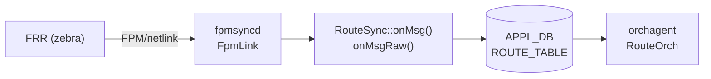

# ROUTE_TABLE handler 分岐 (fpmsyncd / RouteSync)

## 概要

`fpmsyncd` の `RouteSync` クラスは FRR (zebra) から [FPM](../../reference/glossary.md#term-fpm) プロトコル経由で受け取った netlink メッセージを解析し、[APPL_DB](../../reference/glossary.md#term-appl_db) の `ROUTE_TABLE` へ書き込む[^1]。

メッセージの種類（アドレスファミリ、netlink メッセージタイプ、encap タイプ）に応じて複数のハンドラに分岐し、各ハンドラがフィールドを構築する。本ページはその分岐ロジックとフィールドの**コード由来デフォルト**を詳解する。

!!! info "関連ページ"
    `ROUTE_TABLE` のフィールド一覧・運用ヒントは [`ROUTE_TABLE (APPL_DB)`](route.md) を参照。本ページはそのハンドラ実装の詳細を補完する。

<!-- cdb-mermaid -->
### データフロー概略



!!! note "凡例"
    FRR から orchagent までの典型フロー。SRv6 / EVPN / MPLS 系は専用ハンドラ経由。
<!-- /cdb-mermaid -->

## ハンドラ分岐ツリー

### onMsg() — libnl オブジェクト経由 (通常経路・MPLS・VNET)

```
RouteSync::onMsg(nlmsg_type, nl_object)
├── RTM_NEWLINK / RTM_DELLINK
│   └── nl_cache_refill() → return (link cache 更新のみ)
├── AF_MPLS
│   └── onLabelRouteMsg() → LABEL_ROUTE_TABLE (APPL_DB)
└── AF_INET / AF_INET6
    ├── master = "Vnet..." → onVnetRouteMsg() → VNET_ROUTE_TABLE (APPL_DB)
    └── master = "Vrf..." または NULL → onRouteMsg() → ROUTE_TABLE (APPL_DB)
```

### onMsgRaw() — raw FPM メッセージ (SRv6・EVPN・NHG)

```
RouteSync::onMsgRaw(nlmsghdr)
├── RTM_NEWNEXTHOP / RTM_DELNEXTHOP
│   └── onNextHopMsg() → NEXTHOP_GROUP_TABLE (APPL_DB)
├── RTM_NEWPICCONTEXT / RTM_DELPICCONTEXT
│   └── onPicContextMsg() → PIC_CONTEXT_GROUP_TABLE (APPL_DB)
├── RTM_NEWSRV6VPNROUTE / RTM_DELSRV6VPNROUTE
│   └── onSrv6VpnRouteMsg() → ROUTE_TABLE (SRv6 VPN 経路)
├── RTM_NEWSRV6LOCALSID / RTM_DELSRV6LOCALSID
│   └── onSrv6MySidMsg() → SRV6_MY_SID_TABLE (APPL_DB)
└── getEncapType() switch
    ├── NH_ENCAP_SRV6_ROUTE (=101)
    │   └── onSrv6SteerRouteMsg() → ROUTE_TABLE (SRv6 steer 経路)
    └── default (未知 encap)
        └── onEvpnRouteMsg() → ROUTE_TABLE (EVPN Type-5 等)
```

### onRouteMsg() — RTN タイプ分岐

```
onRouteMsg(nlmsg_type, route_obj, vrf)
├── RTM_DELROUTE → delWithWarmRestart() → return
├── vrf = "mgmt..." → スキップ (管理 VRF 除外) → return
├── RTN_BLACKHOLE → blackhole="true" set → return
├── RTN_UNICAST
│   ├── nhg_id あり (kernel NHG)
│   │   ├── group.size()==0 (単一 NH) → nexthop/ifname 解決
│   │   └── group.size()>0 → nexthop_group キー設定
│   └── nhg_id なし (libnl nexthop リスト)
│       ├── ifname が eth0/docker0/eth1-midplane 単体 → DEL 送信 → return
│       └── getNextHopList() + getNextHopWt() → nexthop/ifname/weight 設定
├── RTN_MULTICAST / RTN_BROADCAST / RTN_LOCAL
│   └── "BUM routes aren't supported yet" → return
└── default → return
```

## フィールドのコード由来デフォルト

<!-- defaults -->
### `blackhole` — 宣言デフォルト `"false"`

C++ メンバー宣言 (`routesync.h` L117)[^1]:

```cpp
string blackhole = string("false");
```

**non-ZMQ path** では条件付き emit (`routesync.cpp` L1022-1023):

```cpp
if (blackhole != string("false")) {
    fvVector.push_back(FieldValueTuple("blackhole", blackhole.c_str()));
}
```

`RTN_UNICAST` ではフィールド自体が APPL_DB に**存在しない**。`RTN_BLACKHOLE` の netlink を受け取った場合のみ `"true"` が書き込まれる (`routesync.cpp` L2173-2178):

```cpp
case RTN_BLACKHOLE:
    RouteTableFieldValueTupleWrapper fvw {...};
    fvw.blackhole = "true";
    setRouteWithWarmRestart(fvw, *m_routeTable);
    return;
```

**orchagent 消費** (`routeorch.cpp` L765-766)[^3]:

```cpp
if (fvField(i) == "blackhole")
    blackhole = fvValue(i) == "true";
```

フィールド不在 → `blackhole = false` として処理。最終的に `NextHopGroupKey::getSize() == 0` のとき blackhole として SAI へ渡される (`routeorch.cpp` L2063-2067)。

---

### `protocol` — 未知番号は数値文字列にフォールバック

`rtnl_route_get_protocol()` で取得した rtm_protocol 番号を `getProtocolString()` で変換[^1]:

```cpp
static string getProtocolString(int proto)
{
    char buffer[128] = {};
    if (!rtnl_route_proto2str(proto, buffer, sizeof(buffer)))
        return std::to_string(proto);  // 未知プロトコルは数値文字列
    return buffer;
}
```

`/usr/share/iproute2/rt_protos` が変換テーブル。`/etc/iproute2/rt_protos` で上書き可能。変換成功例: `bgp`、`static`、`kernel`、`connected`。未知番号例: `"186"`。

**non-ZMQ emit 条件** (`routesync.cpp` L1019-1021): `protocol != ""` のとき emit。空文字列になる経路は存在しないため、常に emit される。

**orchagent 消費**: フィールド不在または空文字列のとき `ctx.protocol = ""` のまま。

---

### `weight` — kernel weight=0 → 1 フォールバック

`getNextHopWt()` 内でハードコード (`routesync.cpp` L3083-3088)[^1]:

```cpp
uint8_t weight = rtnl_route_nh_get_weight(nexthop);
if (weight == 0)
{
    SWSS_LOG_INFO("Using default weight of 1 for nexthop");
    weight = 1; // default weight is 1
}
```

kernel は ECMP weight を **0-based** で格納する（iproute2 v5.19.0 参照）。FRR が weight を指定しない場合は kernel weight=0 → fpmsyncd が 1 に変換して APPL_DB に書き込む。

kernel NHG (nexthop group) path でも同様に +1 補正 (`routesync.cpp` L2361, L2523-2524):

```cpp
group[i] = std::make_pair(nha_grp[i].id, nha_grp[i].weight + 1);
// ...
weight_list += to_string(nha_grp[i].weight + 1);
```

---

### `nexthop` / `ifname` — interface route のデフォルト IP

kernel NHG path で単一 nexthop (`group.size() == 0`) かつ `nhg.nexthop` が空の場合(`routesync.cpp` L2214):

```cpp
string nexthops = nhg.nexthop.empty()
    ? (rtnl_route_get_family(route_obj) == AF_INET ? "0.0.0.0" : "::")
    : nhg.nexthop;
```

- IPv4 interface route: `nexthop = "0.0.0.0"`
- IPv6 interface route: `nexthop = "::"`

これは `ifname` のみ持つ直結経路（link-local next hop）において、nexthop IP が不明な場合のゼロアドレス補完。

---

### `nexthop_group` と `nexthop`/`ifname` の相互排他

orchagent が両フィールドを同時に検出した場合はエラー棄却 (`routeorch.cpp` L810-814)[^3]:

```cpp
if (!nhg_index.empty() && (!ips.empty() || !aliases.empty()))
{
    SWSS_LOG_ERROR("Route %s has both nexthop_group and ips/aliases", key.c_str());
    it = consumer.m_toSync.erase(it);
    continue;
}
```

fpmsyncd 側ではこの競合は発生しない（kernel NHG が存在するか否かで排他的に設定）が、外部ツールが直接 APPL_DB を書く場合に注意が必要。

---

### `vni_label` — 存在で `overlay_nh=true` フラグが立つ

orchagent 消費 (`routeorch.cpp` L757-759)[^3]:

```cpp
if (fvField(i) == "vni_label" && fvValue(i) != "") {
    vni_labels = fvValue(i);
    overlay_nh = true;  // EVPN overlay nexthop として処理
}
```

`vni_label` フィールドが存在するだけで EVPN overlay nexthop パスに切り替わる。EVPN Type-5 経路 (`onEvpnRouteMsg()`) 専用。

---

### ZMQ path の差異

`ORCH_NORTHBOND_ROUTE_ZMQ_ENABLED` が有効な場合、`nbZmqEnabled=true` となり、全フィールドを条件なしで送信 (`routesync.cpp` L1006-1017):

```cpp
if(nbZmqEnabled) {
    fvVector.push_back(FieldValueTuple("protocol", protocol.c_str()));
    fvVector.push_back(FieldValueTuple("blackhole", blackhole.c_str()));
    fvVector.push_back(FieldValueTuple("nexthop", nexthop.c_str()));
    // ... 全フィールドを常時送信
}
```

非 ZMQ path の「フィールド不在=デフォルト」ロジックは ZMQ path では機能しない。`blackhole="false"` も明示送信される。

---

### スキップ・DEL 変換ルール

| 条件 | 動作 | 箇所 |
|------|------|------|
| VRF 名が `mgmt` で始まる | SWSS_LOG_INFO してスキップ (return) | `onRouteMsg()` L2125-2136 |
| nexthop インターフェースが `eth0` 単体 | DEL 送信後 return | `onRouteMsg()` L2250-2257 |
| nexthop インターフェースが `docker0` 単体 | DEL 送信後 return | `onRouteMsg()` L2250-2257 |
| nexthop インターフェースが `eth1-midplane` 単体 | DEL 送信後 return | `onRouteMsg()` L2250-2257 |
| `RTN_MULTICAST` / `RTN_BROADCAST` / `RTN_LOCAL` | "BUM routes aren't supported yet" スキップ | `onRouteMsg()` L2184-2188 |

<!-- /defaults -->

<!-- ordering -->
## 書込み順依存 (Phase B)

### 前提プロセス・コンポーネントの先行必須

| 先行コンポーネント | 理由 | 違反時の挙動 |
|---|---|---|
| FRR (`zebra`) FPM クライアント接続 | `fpmsyncd` は `FpmLink.accept()` でブロックし、FPM 接続が確立するまでメッセージを受信しない | 接続待機のまま APPL_DB への書き込みなし (`fpmsyncd.cpp:139-143`) |
| netlink RTNLGRP_LINK イベント (インタフェース作成) | `onMsg()` が `RTM_NEWLINK` 受信時に `nl_cache_refill()` を実行して link cache を更新する。link cache が空だと `rtnl_link_get()` が NULL を返し、VRF/VNET 経路の master デバイス名判定が機能しない | master=NULL → `onRouteMsg()` にフォールバック (VRF/VNET 分岐が発動しない) (`routesync.cpp:2076-2103`) |
| VNET インタフェース (名前 `Vnet*`) の作成 | `onMsg()` の master デバイス名が `Vnet` で始まる場合のみ `onVnetRouteMsg()` → `VNET_ROUTE_TABLE` へ書き込まれる | master 未確立の場合は通常の ROUTE_TABLE に書き込まれる恐れ |
| VRF インタフェース (名前 `Vrf*`) の作成 | VRF スコープ経路 (`<vrf_name>:<prefix>`) は VRF インタフェースが存在してはじめて FRR から通知される | VRF 未作成時は FRR からも経路が来ない |

### CONFIG_DB 設定の先行必須

| CONFIG_DB エントリ | 読取タイミング | 反映タイミング |
|---|---|---|
| `DEVICE_METADATA\|localhost suppress-fib-pending` | fpmsyncd **起動時に 1 回のみ** 読む | 変更後は fpmsyncd を再起動しないと有効にならない (`fpmsyncd.cpp:112-121`) |

### warm-restart 時の書込み順

warm-restart が有効な場合 (`checkAndStart()` が `true`)、fpmsyncd は FPM から受信した経路を **直接 APPL_DB に書かず** `WarmStartHelper::insertRefMap()` にキャッシュする:

```
FPM message 受信
  → setRouteWithWarmRestart()
  → warm-restart 進行中? YES → insertRefMap(key, fvVector)  # APPL_DB 書込みなし
                             NO  → ProducerStateTable::set()   # 通常書込み
```

EOIU (End of Initial Updates) タイムアウト (デフォルト 5 秒待機 + hold 3 秒) 後に reconciliation を実行し、refMap と既存 APPL_DB を比較して差分のみ書き込む。

**warm-restart 時の順序**:
```
1. fpmsyncd 起動 → WarmStartHelper.checkAndStart() → warm-restart モード ON
2. FPM 接続 → 経路受信 → refMap キャッシュ (APPL_DB 書込みなし)
3. EOIU タイムアウト OR warm-restart タイマー (デフォルト 120 秒) 満了
4. reconciliation: 変更分のみ APPL_DB に書込み (存続経路はそのまま)
5. orchagent RouteOrch が APPL_DB 変化を処理
```

evidence: `fpmsyncd/routesync.cpp:172-200`; `fpmsyncd/fpmsyncd.cpp:148-220`

### 書込み順の推奨

```
# 通常フロー (非 warm-restart)
1. systemd: frr.service 起動 (zebra が FPM クライアントとして待機)
2. systemd: fpmsyncd.service 起動 → FpmLink.accept() で zebra と接続
3. zebra が FRR 内の経路を FPM メッセージとして送信
4. RouteSync が APPL_DB ROUTE_TABLE へ書込み → orchagent RouteOrch が処理

# mgmt VRF 経路はスキップされる (APPL_DB に書かれない)
# eth0 / docker0 / eth1-midplane 単体 nexthop 経路は DEL に変換されて送信
```

> **Evidence**: `fpmsyncd/fpmsyncd.cpp:76-143` (起動・FPM 接続); `fpmsyncd/routesync.cpp:2053-2136` (onMsg/onRouteMsg 分岐・mgmt スキップ); `fpmsyncd/fpmsyncd.cpp:112-121` (suppress-fib-pending 読取)
<!-- /ordering -->

<!-- cross-refs -->
## 暗黙参照テーブル (Phase C)

`RouteSync` は **書き手 (producer)** として複数の APPL_DB テーブルに書き込む一方、
起動設定・warm-restart 状態・suppress-fib-pending 応答の 3 系統を**入力参照**として持つ。

### 入力参照（RouteSync が読み取るテーブル）

| テーブル / チャネル | DB | 参照タイミング | フィールド | evidence |
|---|---|---|---|---|
| `DEVICE_METADATA\|localhost` | CONFIG_DB | **起動時 1 回のみ** | `suppress-fib-pending` | `fpmsyncd.cpp:113` |
| `BGP_STATE_TABLE\|IPv4\|eoiu` | STATE_DB | warm-restart 中のポーリング | `state` | `fpmsyncd.cpp:58` |
| `BGP_STATE_TABLE\|IPv6\|eoiu` | STATE_DB | warm-restart 中のポーリング | `state` | `fpmsyncd.cpp:64` |
| `APPL_DB_ROUTE_TABLE_RESPONSE_CHANNEL` | APPL_STATE_DB | suppress-fib-pending 有効時のみ | `err_str`, `protocol` | `fpmsyncd.cpp:307-317` |

**`suppress-fib-pending` の注意点**: 起動後に CONFIG_DB の値を変更しても fpmsyncd を再起動するまで有効にならない。`SubscriberStateTable` が変更イベントを受信するパスは `fpmsyncd.cpp:278` にあるが、suppress モードの動的切り替えは実装上サポートされていない[^1]。

**EOIU ポーリングは warm-restart 時のみ**: 通常起動では `bgpStateTable` は参照されない。warm-restart が有効な場合、`eoiuCheckTimer`（デフォルト 1 秒周期）で `eoiuFlagsSet()` を呼び出し、IPv4/IPv6 両方の state が `"reached"` になるまで reconciliation を遅延する[^1]。

**RESPONSE_CHANNEL**: orchagent が SAI プログラミング結果を `APPL_DB_ROUTE_TABLE_RESPONSE_CHANNEL` 経由で通知し、RouteSync が `err_str=SWSS_RC_SUCCESS` を確認して FRR へ `RTM_F_OFFLOAD` フラグ付き netlink 応答を送信する。suppress-fib-pending が無効（デフォルト）の場合、このチャネルは使用されない[^1]。

### 出力テーブル（RouteSync が書き込む APPL_DB テーブル）

| APPL_DB テーブル | マクロ | ハンドラ |
|---|---|---|
| `ROUTE_TABLE` | `APP_ROUTE_TABLE_NAME` | `onRouteMsg()` / `onEvpnRouteMsg()` / `onSrv6SteerRouteMsg()` / `onSrv6VpnRouteMsg()` |
| `NEXTHOP_GROUP_TABLE` | `APP_NEXTHOP_GROUP_TABLE_NAME` | `onNextHopMsg()` |
| `LABEL_ROUTE_TABLE` | `APP_LABEL_ROUTE_TABLE_NAME` | `onLabelRouteMsg()` |
| `VNET_ROUTE_TABLE` | `APP_VNET_RT_TABLE_NAME` | `onVnetRouteMsg()` (通常 VNET 経路) |
| `VNET_ROUTE_TUNNEL_TABLE` | `APP_VNET_RT_TUNNEL_TABLE_NAME` | `onVnetRouteMsg()` (VXLAN tunnel 経路) |
| `SRV6_MY_SID_TABLE` | `APP_SRV6_MY_SID_TABLE_NAME` | `onSrv6MySidMsg()` |
| `SRV6_SID_LIST_TABLE` | `APP_SRV6_SID_LIST_TABLE_NAME` | `onSrv6RouteMsg()` 内 SID list 登録 |
| `PIC_CONTEXT_TABLE` | `APP_PIC_CONTEXT_TABLE_NAME` | `onPicContextMsg()` |

`ROUTE_TABLE` が主要出力であり、8 つのハンドラのうち 4 つがこのテーブルに書き込む。残りの 7 テーブルは専用ハンドラが 1 対 1 で担当する。

Evidence: `routesync.cpp:156-164` (ProducerStateTable 初期化); `fpmsyncd.cpp:78-118` (suppress-fib-pending 読取・チャネル設定); 詳細スキャン手順は `meta/_intermediate/cdb-flow/route-handler-cross-refs.md` を参照。
<!-- /cross-refs -->

<!-- failure -->
## 失敗挙動・エラーパス (Phase D)

> **調査根拠**: `fpmsyncd/routesync.cpp` @ `4305596156d70e9797e8a881b3d19b46de0bce0d` 全行精読  
> 詳細証跡: `meta/_intermediate/cdb-flow/route-handler-failure.md`

### onMsgRaw() — netlink メッセージサイズ不正

```cpp
if (len < 0)
{
    SWSS_LOG_ERROR("%s: Message received from netlink is of a broken size ...");
    return;
}
```

**挙動**: `SWSS_LOG_ERROR` を出力して即座に `return`。APPL_DB への書き込みなし。メッセージはサイレントに破棄される。FRR が次の経路変化を通知した時点で自然解消。(`routesync.cpp:2005-2010`)

### onRouteMsg() — VRF ifindex → 名前変換失敗

| 条件 | ログ | 挙動 |
|---|---|---|
| `rtnl_link_get(m_link_cache, vrf_index)` が NULL | `SWSS_LOG_ERROR "Fail to get the VRF name (ifindex %u)"` | `return` — 経路は APPL_DB に書き込まれない。`RTM_NEWLINK` が先に届いて link cache が更新されるまで後続の VRF 経路も失われる (`routesync.cpp:821`) |
| VRF 名が `Vrf` プレフィクスでも `mgmt` でもない | `SWSS_LOG_ERROR "Invalid VRF name %s"` | `return` — 経路ドロップ。リカバーなし (`routesync.cpp:2127`) |
| VRF 名が `mgmt` で始まる | `SWSS_LOG_INFO "Skip routes for Mgmt VRF name ..."` | **意図的スキップ** — 管理 VRF は設計上 APPL_DB に書かない (`routesync.cpp:2131-2136`) |

### onRouteMsg() — kernel NHG 未登録

```cpp
const auto itg = m_nh_groups.find(nhg_id);
if (itg == m_nh_groups.end())
{
    SWSS_LOG_ERROR("NextHop group id %d not found. Dropping the route %s", nhg_id, destipprefix);
    return;
}
```

`RTM_NEWNEXTHOP` より前に `RTM_NEWROUTE` が到着した場合に発生。**自動リトライなし**。FRR が再送するか FPM 再接続時に再配信されるまで経路は APPL_DB に存在しない。(`routesync.cpp:2207-2210`)

### nexthop group count が MAX_MULTIPATH_NUM 超過

```cpp
if (grp_count > MAX_MULTIPATH_NUM)
{
    SWSS_LOG_ERROR("Nexthop group count (%d) exceeds the maximum allowed (%d). Clamping to maximum.", ...);
    grp_count = MAX_MULTIPATH_NUM;
}
```

**挙動**: エラーログを出力するが **クランプして処理を継続**。APPL_DB には最大 `MAX_MULTIPATH_NUM` 個のメンバーのみ書き込まれ、超過分は**永続的に欠落**する。(`routesync.cpp:2354-2357`)

### MPLS 経路 — RTN_BLACKHOLE / RTN_UNREACHABLE / RTN_PROHIBIT

```cpp
case RTN_UNREACHABLE:
case RTN_PROHIBIT:
{
    SWSS_LOG_ERROR("RTN_BLACKHOLE route not expected (%s)", destipprefix);
    return;
}
```

`onLabelRouteMsg()` 内でのみ発生 (`routesync.cpp:878`)。MPLS 経路での blackhole は未サポート。通常の IPv4/IPv6 経路 (`onRouteMsg()`) では RTN_BLACKHOLE は正常処理 (`blackhole="true"` を書き込む) される点に注意。

### suppress-fib-pending — offload 応答送信失敗

suppress-fib-pending 有効時、RouteSync は orchagent から RESPONSE_CHANNEL 経由で通知を受け取り FRR へ `RTM_F_OFFLOAD` フラグ付き netlink 応答を返す。この送信が失敗した場合:

| 条件 | ログ | 挙動 |
|---|---|---|
| FPM インタフェース未接続 (`!m_fpmInterface`) | `SWSS_LOG_ERROR "Cannot send offload reply to zebra: FPM is disconnected"` | `false` 返却。FRR は offload 確認不可のまま経路を保持。BGP 広告は継続するためデータプレーン未書込みの経路が広告される恐れ (`routesync.cpp:3119`) |
| `m_fpmInterface->send()` 失敗 | `SWSS_LOG_ERROR "Failed to send reply to zebra"` | 同上。FPM 再接続・warm-restart で解消 (`routesync.cpp:3126`) |

### 失敗挙動サマリ

| 条件 | ログ | APPL_DB への影響 | リカバー |
|---|---|---|---|
| netlink メッセージサイズ不正 | ERROR | 書込みなし | FRR 再送で自然解消 |
| VRF ifindex 変換失敗 | ERROR | 書込みなし | link cache 更新後は以降の経路は正常（ドロップ分のリカバーなし） |
| VRF 名形式不正 | ERROR | 書込みなし | なし |
| 管理 VRF 経路 | INFO | 書込みなし (意図的) | N/A |
| kernel NHG 未登録 | ERROR | 書込みなし | FRR 再送 or FPM 再接続 |
| MPLS RTN_BLACKHOLE | ERROR | 書込みなし | なし (未サポート) |
| NHG count 超過 | ERROR | 超過分を切り捨てて書込み | 超過分は永続的に欠落 |
| offload 応答送信失敗 | ERROR | APPL_DB には影響なし | FPM 再接続・warm-restart |
<!-- /failure -->

## 制約

- `nexthop_group` と `nexthop`/`ifname` を同時に持つ経路は orchagent がエラー棄却（`m_toSync` から削除）。
- 管理 VRF (`mgmt`) 向け経路は fpmsyncd がスキップするため APPL_DB に存在しない。
- EVPN Multipath SRv6 経路は未対応でサイレントスキップ（`onSrv6VpnRouteMsg()` 内コメント）。
- ZMQ path と non-ZMQ path でフィールドの存在パターンが異なる。orchagent は両方を正しく消費できる。

## 関連リファレンス

- APPL_DB テーブル詳細: [`ROUTE_TABLE`](route.md)
- 静的経路設定: [`STATIC_ROUTE`](static-route.md)

## 引用元

[^1]: RouteSync 実装: `fpmsyncd/routesync.h` / `routesync.cpp` @ `4305596156d70e9797e8a881b3d19b46de0bce0d`. <https://github.com/sonic-net/sonic-swss/blob/4305596156d70e9797e8a881b3d19b46de0bce0d/fpmsyncd/routesync.cpp>
[^2]: RouteSync ヘッダ宣言: `fpmsyncd/routesync.h` @ `4305596156d70e9797e8a881b3d19b46de0bce0d`. <https://github.com/sonic-net/sonic-swss/blob/4305596156d70e9797e8a881b3d19b46de0bce0d/fpmsyncd/routesync.h>
[^3]: orchagent フィールド消費: `orchagent/routeorch.cpp` @ `4305596156d70e9797e8a881b3d19b46de0bce0d`. <https://github.com/sonic-net/sonic-swss/blob/4305596156d70e9797e8a881b3d19b46de0bce0d/orchagent/routeorch.cpp>
