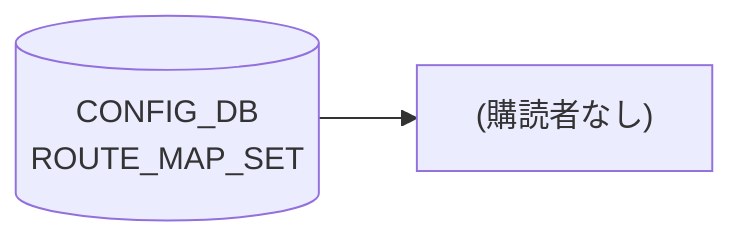

# ROUTE_MAP_SET テーブル

## 概要

route-map 名を登録する YANG レジストリテーブル[^1]。`sonic-route-map.yang` の `ROUTE_MAP_SET` コンテナで定義されており、`ROUTE_MAP.call_route_map` や `BGP_NEIGHBOR_AF` / `BGP_PEER_GROUP_AF` 等の route-map 参照 leafref の整合性検証に使われる。

**frrcfgd・bgpcfgd・orchagent のいずれも本テーブルを購読しない**。[FRR](../../reference/glossary.md#term-frr) への反映は行われず、純粋に [YANG](../../reference/glossary.md#term-yang) データモデル上の名前空間として機能する。

<!-- cdb-mermaid -->
### データフロー (自動生成)



!!! note "凡例"
    CONFIG_DB から SAI までの典型経路を `docs/reference/config-db-orch-map.md` から機械生成したミニ図。詳細・例外は本ページ本文と対応表を参照。
<!-- /cdb-mermaid -->

## key 構造

```text
ROUTE_MAP_SET|<name>
```

`<name>` は route-map の名称文字列。同名のエントリを `ROUTE_MAP|<name>|<seq>` で参照する。

## フィールド

| フィールド | 型 | 説明 |
|-----------|----|------|
| `name` | string (key) | route-map 名。フィールドは key のみで、他のデータフィールドは存在しない |

## 購読者

なし。`frrcfgd`・`bgpcfgd`・orchagent のいずれも ROUTE_MAP_SET テーブルを購読しない（`frrcfgd.py` の `table_handler_list` および `tbl_to_key_map` に含まれないことを全行確認済み）。

## 関連 CONFIG_DB / YANG / CLI

- 関連 [CONFIG_DB](../../reference/glossary.md#term-config_db): [`ROUTE_MAP`](./route-map.md)（`call_route_map` leafref）、`BGP_NEIGHBOR_AF`、`BGP_PEER_GROUP_AF`、`BGP_GLOBALS_AF`（route-map 参照 leafref）
- 関連 [YANG](../../reference/glossary.md#term-yang): `sonic-route-map`
- 関連 CLI: なし（`config load` / `sonic-db-cli` による直接投入）

<!-- cdb-exceptions -->
## 例外条件・特殊挙動

| 条件 | 挙動 |
|------|------|
| ROUTE_MAP_SET への書き込み | frrcfgd はイベントを受信しない。FRR 反映なし |
| ROUTE_MAP_SET が未作成で ROUTE_MAP を設定 | sonic-db-cli 直接書き込みは YANG 検証をバイパス。FRR への反映は ROUTE_MAP テーブルのみで決まる |
| YANG strict mode (gNMI/NETCONF) でのみ | ROUTE_MAP.call_route_map が存在しない名前を参照するとリジェクトされる |

<!-- evidence: sonic-route-map.yang:125-134; frrcfgd.py:2293-2338 table_handler_list -->
<!-- /cdb-exceptions -->

<!-- defaults -->
## 暗黙デフォルト・コード由来の落とし穴

YANG に定義されているフィールドは `name`（key）のみ。データフィールドが存在しないため、デフォルト値の概念は該当しない。

| フィールド | YANG default | コード実効デフォルト | パターン | 根拠 |
|-----------|-------------|-------------------|---------|------|
| `name` | なし（key、必須） | なし（必須キー） | — | `sonic-route-map.yang:129`; frrcfgd 非購読 |

### frrcfgd 非購読による落とし穴

`ROUTE_MAP_SET` を書き込むだけでは FRR に route-map は作成されない。route-map の実体は `ROUTE_MAP|<name>|<seq>` テーブルへの書き込みによって frrcfgd が `vtysh route-map` コマンドで作成する。

**ROUTE_MAP_SET は YANG leafref 整合性のための名前登録のみ**を担う。ROUTE_MAP エントリを作成する前後いずれかのタイミングで ROUTE_MAP_SET エントリを作成するかは、sonic-db-cli 直接投入では YANG 検証がバイパスされるため任意。

### db_migrator 非対応

`db_migrator.py` に ROUTE_MAP_SET の参照なし（grep 確認済み）。バージョン移行での自動補完なし。
<!-- /defaults -->

<!-- ordering -->
## 書込み順依存 (Phase B)

`ROUTE_MAP_SET` テーブルは frrcfgd・bgpcfgd・orchagent のいずれも購読しないため、
**FRR への反映という観点での書込み順序制約は存在しない**。

ただし gNMI / NETCONF 等の YANG 検証が有効なパスでは、以下のテーブルのフィールドが
`ROUTE_MAP_SET_LIST/name` を leafref で参照しているため、**参照元エントリを書く前に
`ROUTE_MAP_SET|<name>` エントリが存在しなければ leafref 検証失敗**となる。

| 参照元テーブル | 参照フィールド | 根拠 |
|---------------|---------------|------|
| `ROUTE_MAP` | `call_route_map` | `sonic-route-map.yang:269-273` |
| `BGP_NEIGHBOR_AF` / `BGP_PEER_GROUP_AF` | `default_rmap` | `sonic-bgp-common.yang:354-358` |
| `BGP_NEIGHBOR_AF` / `BGP_PEER_GROUP_AF` | `route_map_in` | `sonic-bgp-common.yang:385-392` |
| `BGP_NEIGHBOR_AF` / `BGP_PEER_GROUP_AF` | `route_map_out` | `sonic-bgp-common.yang:394-401` |
| `BGP_NEIGHBOR_AF` / `BGP_PEER_GROUP_AF` | `unsuppress_map_name` | `sonic-bgp-common.yang:408-413` |
| `BGP_GLOBALS_AF` | 各 route-map フィールド | `sonic-bgp-global.yang:373,380,502,532` |
| `ROUTE_REDISTRIBUTE` | `route_map` | `sonic-route-common.yang:60-66` |

`sonic-db-cli` 直接投入は YANG 検証をバイパスするため、この順序制約は実質適用されない。
DEL 時も同様で、`sonic-db-cli` であれば参照中の `ROUTE_MAP_SET` エントリを先に削除することは可能だが、
gNMI/NETCONF では参照元の解除が先行必須となる。

> **スキャン証跡**: `sonic-route-map.yang:125-134,269-273`、`sonic-bgp-common.yang:354-413`、`sonic-bgp-global.yang:373,380,502,532`、`sonic-route-common.yang:60-66`。詳細は `meta/_intermediate/cdb-flow/route-map-set-ordering.md` を参照。
<!-- /ordering -->

<!-- cross-refs -->
## 暗黙参照テーブル (Phase C)

YANG leafref スキャン (`sonic-route-map.yang`, `sonic-bgp-common.yang`, `sonic-bgp-global.yang`, `sonic-route-common.yang`) および frrcfgd 実装確認による参照関係。詳細は `meta/_intermediate/cdb-flow/route-map-set-cross-refs.md` を参照。

`ROUTE_MAP_SET` テーブル自身は他テーブルを leafref で参照するフィールドを持たない（`name` key のみの名前レジストリ）。以下はすべて **被参照**（他テーブルから ROUTE_MAP_SET.name を参照する逆参照）。

| 参照元テーブル | 参照フィールド | YANG 根拠 | 備考 |
|--------------|--------------|----------|------|
| [`ROUTE_MAP`](./route-map.md) | `call_route_map` | `sonic-route-map.yang:269-273` | frrcfgd が FRR に `call <name>` を発行。call 先未定義時は FRR がポリシー素通り |
| [`BGP_NEIGHBOR_AF`](./bgp-neighbor-af.md) | `route_map_in`, `route_map_out`, `default_rmap`, `unsuppress_map_name` | `sonic-bgp-common.yang:354-413` | frrcfgd が `neighbor {} route-map {} in/out` に変換 |
| [`BGP_PEER_GROUP_AF`](./bgp-peer-group-af.md) | `route_map_in`, `route_map_out`, `default_rmap`, `unsuppress_map_name` | `sonic-bgp-common.yang:354-413` | BGP_NEIGHBOR_AF と同一 YANG grouping を共有 |
| `BGP_GLOBALS_AF` | `import_vrf_route_map`, `route_download_filter` | `sonic-bgp-global.yang:371-382` | frrcfgd が `vrf import` / `table-map` コマンドに変換 |
| `BGP_GLOBALS_AF_AGGREGATE_ADDR` | `policy` | `sonic-bgp-global.yang:500-505` | BGP aggregate-address に route-map を適用 |
| `BGP_GLOBALS_AF_NETWORK` | `policy` | `sonic-bgp-global.yang:530-534` | BGP network コマンドに route-map を適用 |
| `ROUTE_REDISTRIBUTE` | `route_map` (leaf-list) | `sonic-route-common.yang:60-66` | redistribute コマンドへの route-map 付与 |

!!! note "frrcfgd の実行時チェックなし"
    これらの参照は YANG レベルの leafref 整合性検証のみ機能する。frrcfgd は ROUTE_MAP_SET エントリの存在を実行時にチェックせず、name 文字列を FRR コマンドにそのまま渡す（`sonic-route-map.yang:269-273`; `frrcfgd.py:1942`）。`sonic-db-cli` 直接投入では YANG 検証もバイパスされるため、参照整合性は実質ユーザー責任となる。

<!-- /cross-refs -->

<!-- failure -->
## 失敗挙動・エラーパス (Phase D)

> **調査根拠**: `sonic-route-map.yang:125-134,269-273`; `frrcfgd.py` 全文 grep (2026-05-18)
> 詳細証跡: `meta/_intermediate/cdb-flow/route-map-set-failure.md`

ROUTE_MAP_SET テーブルには **購読デーモンが存在しない**。frrcfgd・bgpcfgd・orchagent のいずれも本テーブルを購読しないため、「デーモンが書き込みを処理してエラーを返す」形式の失敗パスは存在しない。

### SET / DEL 失敗マトリクス

| 操作 | 条件 | 動作 | 備考 |
|------|------|------|------|
| ROUTE_MAP_SET エントリ SET | gNMI / NETCONF 経由かつ ROUTE_MAP.call_route_map から参照中の name と重複 | YANG leafref 整合性違反として拒否 | sonic-db-cli 直接書き込みではバイパス |
| ROUTE_MAP_SET エントリ DEL | gNMI / NETCONF 経由かつ ROUTE_MAP.call_route_map が参照中 | YANG leafref 参照先削除として拒否 | sonic-db-cli では拒否されず Redis から削除される |
| ROUTE_MAP_SET エントリ SET | sonic-db-cli 直接書き込み | 常に成功（YANG 検証なし） | 購読デーモンがないため副作用なし |
| 存在しない ROUTE_MAP_SET を参照する ROUTE_MAP の FRR 反映 | frrcfgd が call_route_map 値をそのまま vtysh に渡す | FRR が `% Unknown command` 等で拒否 → `LOG_ERR` + `continue` | frrcfgd の実行時チェックなし (`frrcfgd.py:1942`) |

### ステータス書き戻しなし

ROUTE_MAP_SET への SET/DEL の成否は CONFIG_DB に書き戻されない。YANG 検証エラーは gNMI/NETCONF のレスポンスで返されるのみ。

<!-- evidence: sonic-net/sonic-buildimage/src/sonic-yang-models/yang-models/sonic-route-map.yang:125-134 (ROUTE_MAP_SET_LIST 定義、must 句なし) -->
<!-- evidence: sonic-net/sonic-buildimage/src/sonic-yang-models/yang-models/sonic-route-map.yang:269-273 (call_route_map leafref) -->
<!-- /failure -->

<!-- ref-triangle:start -->

## 関連リファレンス

- [YANG](../../reference/glossary.md#term-yang): [`sonic-route-map`](../yang/sonic-route-map.md)
- 関連テーブル: [`ROUTE_MAP`](./route-map.md)

<!-- ref-triangle:end -->

## 引用元

[^1]: [YANG](../../reference/glossary.md#term-yang) 定義: `sonic-route-map.yang`. <https://github.com/sonic-net/sonic-buildimage/blob/9ea932ec2e18f35e58268ec2e4456b1d4afd65cd/src/sonic-yang-models/yang-models/sonic-route-map.yang>

<!-- ops-hint -->
## 運用ヒント

### 典型値

- key 形式: `ROUTE_MAP_SET|<name>` (例: `ROUTE_MAP_SET|ALLOW`)。
- フィールドは key のみ。値なし。

### よくある誤設定

- ROUTE_MAP_SET エントリだけを作成し ROUTE_MAP エントリを作成しない場合、FRR に route-map は生成されない。実体は `ROUTE_MAP|<name>|<seq>` テーブルにある。

### 確認コマンド

```bash
sonic-db-cli CONFIG_DB keys 'ROUTE_MAP_SET|*'
sonic-db-cli CONFIG_DB keys 'ROUTE_MAP|*'
vtysh -c 'show route-map'
```
<!-- /ops-hint -->
