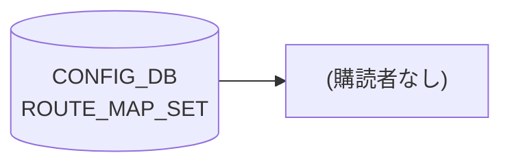

# ROUTE_MAP_SET テーブル

## 概要

route-map 名を登録する YANG レジストリテーブル[^1]。`sonic-route-map.yang` の `ROUTE_MAP_SET` コンテナで定義されており、`ROUTE_MAP.call_route_map` や `BGP_NEIGHBOR_AF` / `BGP_PEER_GROUP_AF` 等の route-map 参照 leafref の整合性検証に使われる。

**frrcfgd・bgpcfgd・orchagent のいずれも本テーブルを購読しない**。[FRR](../../reference/glossary.md#term-frr) への反映は行われず、純粋に [YANG](../../reference/glossary.md#term-yang) データモデル上の名前空間として機能する。

<!-- cdb-mermaid -->
### データフロー (自動生成)



!!! note "凡例"
    CONFIG_DB から SAI までの典型経路を `docs/reference/config-db-orch-map.md` から機械生成したミニ図。詳細・例外は本ページ本文と対応表を参照。
<!-- /cdb-mermaid -->

## key 構造

```text
ROUTE_MAP_SET|<name>
```

`<name>` は route-map の名称文字列。同名のエントリを `ROUTE_MAP|<name>|<seq>` で参照する。

## フィールド

| フィールド | 型 | 説明 |
|-----------|----|------|
| `name` | string (key) | route-map 名。フィールドは key のみで、他のデータフィールドは存在しない |

## 購読者

なし。`frrcfgd`・`bgpcfgd`・orchagent のいずれも ROUTE_MAP_SET テーブルを購読しない（`frrcfgd.py` の `table_handler_list` および `tbl_to_key_map` に含まれないことを全行確認済み）。

## 関連 CONFIG_DB / YANG / CLI

- 関連 [CONFIG_DB](../../reference/glossary.md#term-config_db): [`ROUTE_MAP`](./route-map.md)（`call_route_map` leafref）、`BGP_NEIGHBOR_AF`、`BGP_PEER_GROUP_AF`、`BGP_GLOBALS_AF`（route-map 参照 leafref）
- 関連 [YANG](../../reference/glossary.md#term-yang): `sonic-route-map`
- 関連 CLI: なし（`config load` / `sonic-db-cli` による直接投入）

<!-- cdb-exceptions -->
## 例外条件・特殊挙動

| 条件 | 挙動 |
|------|------|
| ROUTE_MAP_SET への書き込み | frrcfgd はイベントを受信しない。FRR 反映なし |
| ROUTE_MAP_SET が未作成で ROUTE_MAP を設定 | sonic-db-cli 直接書き込みは YANG 検証をバイパス。FRR への反映は ROUTE_MAP テーブルのみで決まる |
| YANG strict mode (gNMI/NETCONF) でのみ | ROUTE_MAP.call_route_map が存在しない名前を参照するとリジェクトされる |

<!-- evidence: sonic-route-map.yang:125-134; frrcfgd.py:2293-2338 table_handler_list -->
<!-- /cdb-exceptions -->

<!-- defaults -->
## 暗黙デフォルト・コード由来の落とし穴

YANG に定義されているフィールドは `name`（key）のみ。データフィールドが存在しないため、デフォルト値の概念は該当しない。

| フィールド | YANG default | コード実効デフォルト | パターン | 根拠 |
|-----------|-------------|-------------------|---------|------|
| `name` | なし（key、必須） | なし（必須キー） | — | `sonic-route-map.yang:129`; frrcfgd 非購読 |

### frrcfgd 非購読による落とし穴

`ROUTE_MAP_SET` を書き込むだけでは FRR に route-map は作成されない。route-map の実体は `ROUTE_MAP|<name>|<seq>` テーブルへの書き込みによって frrcfgd が `vtysh route-map` コマンドで作成する。

**ROUTE_MAP_SET は YANG leafref 整合性のための名前登録のみ**を担う。ROUTE_MAP エントリを作成する前後いずれかのタイミングで ROUTE_MAP_SET エントリを作成するかは、sonic-db-cli 直接投入では YANG 検証がバイパスされるため任意。

### db_migrator 非対応

`db_migrator.py` に ROUTE_MAP_SET の参照なし（grep 確認済み）。バージョン移行での自動補完なし。
<!-- /defaults -->

<!-- ref-triangle:start -->

## 関連リファレンス

- [YANG](../../reference/glossary.md#term-yang): [`sonic-route-map`](../yang/sonic-route-map.md)
- 関連テーブル: [`ROUTE_MAP`](./route-map.md)

<!-- ref-triangle:end -->

## 引用元

[^1]: [YANG](../../reference/glossary.md#term-yang) 定義: `sonic-route-map.yang`. <https://github.com/sonic-net/sonic-buildimage/blob/9ea932ec2e18f35e58268ec2e4456b1d4afd65cd/src/sonic-yang-models/yang-models/sonic-route-map.yang>

<!-- ops-hint -->
## 運用ヒント

### 典型値

- key 形式: `ROUTE_MAP_SET|<name>` (例: `ROUTE_MAP_SET|ALLOW`)。
- フィールドは key のみ。値なし。

### よくある誤設定

- ROUTE_MAP_SET エントリだけを作成し ROUTE_MAP エントリを作成しない場合、FRR に route-map は生成されない。実体は `ROUTE_MAP|<name>|<seq>` テーブルにある。

### 確認コマンド

```bash
sonic-db-cli CONFIG_DB keys 'ROUTE_MAP_SET|*'
sonic-db-cli CONFIG_DB keys 'ROUTE_MAP|*'
vtysh -c 'show route-map'
```
<!-- /ops-hint -->
