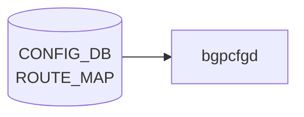

# ROUTE_MAP テーブル

## 概要

ルーティングポリシー (route-map) の statement 単位の定義テーブル。[BGP](../../reference/glossary.md#term-bgp) neighbor / peer-group や redistribute から名前で参照される。`frr-mgmt-framework` (`DEVICE_METADATA.frr_mgmt_framework_config = true`) が [CONFIG_DB](../../reference/glossary.md#term-config_db) を購読し [FRR](../../reference/glossary.md#term-frr) `route-map` コマンドに変換する[^1]。

<!-- cdb-mermaid -->
### データフロー (自動生成)



!!! note "凡例"
    CONFIG_DB から SAI までの典型経路を `docs/reference/config-db-orch-map.md` から機械生成したミニ図。詳細・例外は本ページ本文と対応表を参照。
<!-- /cdb-mermaid -->

## key 構造

```text
ROUTE_MAP|<name>|<stmt_name>
```

`<stmt_name>` は uint16 (1..65535)。同一 `<name>` で複数の statement を順序づけて評価する。
名前の一覧は別テーブル `ROUTE_MAP_SET|<name>` で管理する。

## 主要フィールド

| フィールド | 型 | 説明 |
|-----------|----|------|
| `route_operation` | enum (`PERMIT`/`DENY`) | permit/deny |
| `match_interface` | union leafref `PORT`/`PORTCHANNEL`/`LOOPBACK_INTERFACE`/Vlan pattern | interface match |
| `match_prefix_set` | leafref `PREFIX_SET.name` | IPv4 prefix list match |
| `match_ipv6_prefix_set` | leafref `PREFIX_SET.name` | IPv6 prefix list match |
| `match_protocol` | string | bgp/connected/ospf/ospf3/static |
| `match_next_hop_set` | leafref `PREFIX_SET.name` | next-hop match |
| `match_src_vrf` | union (`default`/leafref `VRF.name`) | source [VRF](../../reference/glossary.md#term-vrf) match |
| `match_neighbor` | leaf-list union | IP / interface match |
| `match_tag` | leaf-list uint32 | tag match |
| `match_med` / `match_origin` / `match_local_pref` | numeric / string / uint32 | [BGP](../../reference/glossary.md#term-bgp) attribute match |
| `match_community` | leafref `COMMUNITY_SET.name` | [BGP](../../reference/glossary.md#term-bgp) community match |
| `match_ext_community` | leafref `EXTENDED_COMMUNITY_SET.name` | extended community match |
| `match_as_path` | leafref `AS_PATH_SET.name` | AS-path match |
| `call_route_map` | leafref `ROUTE_MAP_SET.name` | 別の route-map 呼出し |
| `set_origin` | string | BGP origin set |
| `set_local_pref` | uint32 | local-pref set |
| `set_med` | uint32 | MED set |
| `set_metric_action` | enum `metric-action-type` | metric 操作種別 |
| `set_metric` | uint32 | metric 値 |
| `set_next_hop` | string | IP nexthop set |
| `set_ipv6_next_hop_global` / `set_ipv6_next_hop_prefer_global` | string / boolean | IPv6 nexthop 操作 |
| `set_repeat_asn` / `set_asn` / `set_asn_list` | numeric / string | AS prepend |
| `set_community_inline` / `set_community_ref` | leaf-list / leafref | community 設定 |
| `set_ext_community_inline` / `set_ext_community_ref` | leaf-list / leafref | ext community 設定 |
| `set_tag` | uint32 | tag 設定 |

`metric-action-type`: `METRIC_SET_VALUE`, `METRIC_ADD_VALUE`, `METRIC_SUBTRACT_VALUE`, `METRIC_SET_RTT`, `METRIC_ADD_RTT`, `METRIC_SUBTRACT_RTT`。

## 購読者

- `frr-mgmt-framework`: [CONFIG_DB](../../reference/glossary.md#term-config_db) → `vtysh route-map` コマンド
- `bgpcfgd` (テンプレ経路): 簡易な BGP テンプレ展開時に間接利用

## 関連 CONFIG_DB / YANG / CLI

- 関連 [CONFIG_DB](../../reference/glossary.md#term-config_db): `ROUTE_MAP_SET` (名前一覧)、`PREFIX_SET`、`COMMUNITY_SET`、`AS_PATH_SET`、`BGP_NEIGHBOR_AF`、`BGP_PEER_GROUP_AF`
- 関連 CLI: `config route_map`、`vtysh -c "show route-map"`
- 関連 [YANG](../../reference/glossary.md#term-yang): `sonic-route-map`、`sonic-routing-policy-sets`

<!-- ref-triangle:start -->

## 関連リファレンス

- [YANG](../../reference/glossary.md#term-yang): [`sonic-route-map`](../yang/sonic-route-map.md) / `sonic-routing-policy-sets`
- CLI: [`config route_map`](../cli/config-route.md)

<!-- ref-triangle:end -->

## 引用元

[^1]: [YANG](../../reference/glossary.md#term-yang) 定義: `sonic-route-map.yang`. <https://github.com/sonic-net/sonic-buildimage/blob/9ea932ec2e18f35e58268ec2e4456b1d4afd65cd/src/sonic-yang-models/yang-models/sonic-route-map.yang>

<!-- ops-hint -->
## 運用ヒント

### 典型値

- key 形式: `ROUTE_MAP|<name>|<seq>`。
- `route_operation`: `permit`、`match_*` で条件、`set_*` で属性変更。BGP で in/out に適用。

### よくある誤設定

- 末尾の暗黙 deny を忘れて意図せず全 prefix を drop する。

### 確認コマンド

```bash
sonic-db-cli CONFIG_DB keys 'ROUTE_MAP|*'
vtysh -c 'show route-map'
```
<!-- /ops-hint -->

<!-- value-behavior -->
## 値依存挙動マトリクス

### `route_operation` 値別挙動
| 値 | 挙動 |
|----|------|
| `PERMIT` | match した経路を許可し、`set_*` アクションを適用。 |
| `DENY` | match した経路を拒否（DROP）。`set_*` アクションは無視される。 |

### `set_metric_action` 値別挙動
| 値 | 挙動 |
|----|------|
| `METRIC_SET_VALUE` | MED を `set_metric` の値に設定。 |
| `METRIC_ADD_VALUE` | MED に `set_metric` を加算。 |
| `METRIC_SUBTRACT_VALUE` | MED から `set_metric` を減算。 |
| `METRIC_SET_RTT` | MED を RTT 値に設定。 |
| `METRIC_ADD_RTT` | MED に RTT を加算。 |
| `METRIC_SUBTRACT_RTT` | MED から RTT を減算。 |

### BGPRouteMapMgr が処理する key 値別挙動
| key 値 | 挙動 |
|--------|------|
| `FROM_SDN_SLB_ROUTES` | 有効（SDN SLB ユースケース専用）。 |
| `FROM_SDN_APPLIANCE_ROUTES` | 有効（SDN Appliance ユースケース専用）。 |
| その他 | `log_err("BGPRouteMapMgr:: Invalid key for route-map %s")` → 拒否。汎用 route-map は [bgpcfgd](../../reference/glossary.md#term-bgpcfgd) テンプレート経由で管理。 |

<!-- /value-behavior -->

<!-- cdb-exceptions -->
## 例外条件・特殊挙動

- **BGPRouteMapMgr は固定 2 キーのみ処理**: `FROM_SDN_SLB_ROUTES` / `FROM_SDN_APPLIANCE_ROUTES` 以外の key は `log_err("BGPRouteMapMgr:: Invalid key for route-map %s")` で拒否される。これらは SDN ユースケース専用であり、汎用 route-map の CONFIG_DB 管理は [bgpcfgd](../../reference/glossary.md#term-bgpcfgd) の [ROUTE_MAP](../../reference/glossary.md#term-route_map) テーブル consumer ではなく [bgpcfgd](../../reference/glossary.md#term-bgpcfgd) テンプレートが担う。[^2]
- **community_id 形式不正**: `<0-65535>:<0-65535>` 形式でない場合 `log_err` してスキップ。[^2]
- **BGP ASN 未設定 (constants)**: `deployment_id_asn_map` が constants に存在しないか、`deployment_id=2` のエントリがない場合は route-map の更新をスキップする（既存 route-map は残る）。[^2]
- **シーケンス番号枯渇**: `managers_allow_list.py` との連携でシーケンス番号が不足した場合 `RuntimeError("No free sequence numbers")` で追加が失敗する。[^2]

[^2]: bgpcfgd RouteMapMgr 実装: `sonic-buildimage/src/sonic-bgpcfgd/bgpcfgd/managers_rm.py`. <https://github.com/sonic-net/sonic-buildimage/blob/master/src/sonic-bgpcfgd/bgpcfgd/managers_rm.py>


<!-- derivation -->
## 派生・条件付き登録 (Phase 6/7)

### Phase 6: 自動派生

bgpcfgd の `RouteMapMgr` が `ROUTE_MAP` テーブルの各フィールド（`MATCH_PREFIX_LIST`、`MATCH_AS_PATH`、`SET_COMMUNITY` 等）を [FRR](../../reference/glossary.md#term-frr) の `match` / `set` 句コマンドへ変換する。CONFIG_DB 内フィールド間の自動付与なし。

### Phase 7: 条件付き登録 (add_manager 条件)

bgpcfgd は常時起動し `RouteMapMgr` を無条件登録する。参照先の `PREFIX_LIST` / `AS_PATH_SET` / `COMMUNITY_SET` が未設定でも [FRR](../../reference/glossary.md#term-frr) コマンドは発行されるが、FRR 側で未解決参照エラーになる場合がある。

<!-- /derivation -->

<!-- handler-branching -->
### Phase 8: Handler メソッド内分岐

| Handler | 分岐条件 | 効果 | evidence |
|---|---|---|---|
| `RouteMapMgr` | `action==permit` | `route-map <name> permit <seq>` | `managers_route_map.py` |
| `RouteMapMgr` | `action==deny` | `route-map <name> deny <seq>` | `managers_route_map.py` |
| `RouteMapMgr` | `MATCH_PREFIX_LIST` フィールドあり | `match ip address prefix-list <list>` 追加 | `managers_route_map.py` |
| `RouteMapMgr` | `MATCH_AS_PATH` フィールドあり | `match as-path <list>` 追加 | `managers_route_map.py` |
| `RouteMapMgr` | `SET_COMMUNITY` フィールドあり | `set community <value>` 追加 | `managers_route_map.py` |
| `RouteMapMgr` | del_handler | FRR に `no route-map <name>` 発行 | `managers_route_map.py` |

> **スキャン証跡**: `ROUTE_MAP` は BGP ルーティングポリシーの中核。bgpcfgd が FRR [vtysh](../../reference/glossary.md#term-vtysh) に変換。CONFIG_DB 内フィールド間の自動派生なし。

<!-- /handler-branching -->

<!-- runtime-trace -->
## CDB → 実コンテナ動作トレース

### 段階 1: Consumer 登録

- **bgpcfgd**: `ROUTE_MAP` テーブルを `ConfigDBConnector` で購読。

### 段階 2: CFG → APPL 翻訳

- bgpcfgd が FRR の `route-map` を `vtysh` 経由で設定。PREFIX_LIST / PREFIX_SET を参照する場合は先に作成が必要。
- APP_DB への書き込みなし。

### 段階 3: APPL → SAI

- FRR がルートマップを BGP ポリシー (import/export filter, redistribution) として使用。[SAI](../../reference/glossary.md#term-sai) 経由なし。

### 段階 4: タイミング + 副作用

- route-map 変更は FRR に即時反映。BGP ピアへの影響は次の UPDATE/KEEPALIVE から。
- 副作用: `set local-preference` 変更等でルート選択が変わり、トラフィックパスが切り替わる可能性。

<!-- /runtime-trace -->
<!-- entry-points -->
## 書き込み入り口 (Direction A)

[ROUTE_MAP](../../reference/glossary.md#term-route_map) テーブルへの書き込みが発生するコード経路を網羅的に調査した結果。

### CLI

  - 専用 CLI なし — `sonic-cfggen` または `config load` 経由

### minigraph / sonic-cfggen

minigraph.py に [ROUTE_MAP](../../reference/glossary.md#term-route_map) 生成なし

### REST / gNMI

REST/[gNMI](../../reference/glossary.md#term-gnmi) 書き込み経路なし

### db_migrator

db_migrator.py での ROUTE_MAP マイグレーションなし

### ビルド時デフォルト (build-time default)

なし

### ハードコードデフォルト / ランタイム注入

**sonic-bgpcfgd** `managers_rm.py` が ROUTE_MAP テーブルを監視し FRR bgpd に反映 ([sonic-buildimage](../../reference/glossary.md#term-sonic-buildimage)/src/sonic-bgpcfgd/bgpcfgd/managers_rm.py); **frrcfgd** `frrcfgd.py` も ROUTE_MAP を監視

### 死活・デッドコード

なし
<!-- /entry-points -->

<!-- pubsub -->
## CONFIG_DB 購読メカニズム (Phase G)

ROUTE_MAP テーブルは 2 つの独立したデーモンが購読する。

### frrcfgd (sonic-frr-mgmt-framework)

`frrcfgd.py` は `ExtConfigDBConnector`（`ConfigDBConnector` サブクラス）を使用し、[Redis](../../reference/glossary.md#term-redis) keyspace イベント (`__keyspace@<dbid>__:*`) を `psubscribe` で監視する。`subscribe_all()` が `table_handler_list` 内の `('ROUTE_MAP', self.bgp_table_handler_common)` を登録し、変更通知を受け取る。

```python
# frrcfgd.py L2302, 2359-2361
('ROUTE_MAP', self.bgp_table_handler_common),
...
def subscribe_all(self):
    for table, hdlr in self.table_handler_list:
        self.config_db.subscribe(table, hdlr)
```

変更検知後、`bgp_table_handler_common` が Jinja2 テンプレート (`bgpd.conf.db.route_map.j2`) を展開して FRR [vtysh](../../reference/glossary.md#term-vtysh) コマンドを生成・実行する。

**Jinja2 テンプレート経路** (`bgpd.conf.db.route_map.j2`):

```jinja2



route-map {{rm_key[0]}} {{rm_val['route_operation']}} {{rm_key[1]}}

 match as-path {{rm_val['match_as_path']}}

...



```

テンプレートは `ROUTE_MAP` 全エントリを走査し、`route_operation` (permit/deny)、各 `match_*` / `set_*` フィールドを条件付きで FRR コマンドに変換する。適用対象デーモンは `['zebra', 'bgpd', 'ospfd']`。

### bgpcfgd (sonic-bgpcfgd) — SDN 専用経路

`RouteMapMgr` は `APPL_DB` の `BGP_PROFILE_TABLE` を `SubscriberStateTable` 相当で購読し、SDN 専用の 2 キー (`FROM_SDN_SLB_ROUTES`, `FROM_SDN_APPLIANCE_ROUTES`) のみを処理する。ROUTE_MAP テーブルを直接購読するのではなく、bgpcfgd テンプレートエンジンが CONFIG_DB の ROUTE_MAP を読み込んで FRR 設定を生成する。

```python
# managers_rm.py L47-52
ROUTE_MAPS = ["FROM_SDN_SLB_ROUTES", "FROM_SDN_APPLIANCE_ROUTES"]

def set_handler(self, key, data):
    if not self.__set_handler_validate(key, data):
        return True
    self.__update_rm(key, data)
```

`__update_rm` は `cfg_mgr.push_list(cmds)` で FRR [vtysh](../../reference/glossary.md#term-vtysh) に直接コマンドを送信する。

### 購読フロー要約

```
CONFIG_DB ROUTE_MAP
  ├─ frrcfgd (ExtConfigDBConnector psubscribe)
  │    └─ bgp_table_handler_common
  │         └─ Jinja2 (bgpd.conf.db.route_map.j2)
  │              └─ vtysh configure terminal / route-map <name> <action> <seq>
  └─ bgpcfgd RouteMapMgr (SDN 専用; APPL_DB BGP_PROFILE 経由)
       └─ cfg_mgr.push_list → vtysh route-map FROM_SDN_*_RM
```

<!-- /pubsub -->
<!-- side-effects -->
## 副次 DB 書込・外部副作用 (Phase F)

### FRR vtysh コマンド発行 (bgpcfgd)

`managers_rm.py` の `RouteMapMgr` は `cfg_mgr.push_list()` → `ConfigMgr.commit()` → `vtysh -f <tmpfile>` で FRR bgpd へ設定を書込む[^3]。

| イベント | vtysh コマンド | 対象デーモン |
|---|---|---|
| set (FROM_SDN_SLB/APPLIANCE_ROUTES) | `route-map <NAME>_RM permit 100` | bgpd |
| set | `set as-path prepend <asn> <asn>` | bgpd |
| set | `set community <community_id>` | bgpd |
| set | `set origin incomplete` | bgpd |
| del | `no route-map <NAME>_RM permit 100` | bgpd |

### FRR vtysh コマンド発行 (frrcfgd)

`frrcfgd.py` は `ROUTE_MAP` テーブルを `['zebra', 'bgpd', 'ospfd']` の各デーモンに対して反映する[^4]。

| イベント | vtysh コマンド | 対象デーモン |
|---|---|---|
| set (`route_operation=permit`) | `route-map <name> permit <seq>` | [zebra](../../reference/glossary.md#term-zebra), bgpd, ospfd |
| set (`route_operation=deny`) | `route-map <name> deny <seq>` | [zebra](../../reference/glossary.md#term-zebra), bgpd, ospfd |
| set (match_*/set_* フィールド) | 各 `match`/`set` サブコマンド | [zebra](../../reference/glossary.md#term-zebra), bgpd, ospfd |
| del | `no route-map <name> <action> <seq>` | zebra, bgpd, ospfd |

### kernel route 経路への影響

route-map は FRR の BGP/OSPF/zebra ルーティングポリシーとして機能する。`set local-preference` / `set next-hop` 等の変更がルート選択に影響し、zebra が kernel RIB (`ip route`) を更新する。BGP ピアへの影響は次の UPDATE/KEEPALIVE 以降。

### 副次書込まとめ

| 副次先 | 操作 | 内容 | evidence |
|---|---|---|---|
| FRR bgpd (vtysh) | configure | `route-map <NAME>_RM permit 100` + AS-path/community/origin set | `managers_rm.py:87-98`[^3] |
| FRR bgpd (vtysh) | delete | `no route-map <NAME>_RM permit 100` | `managers_rm.py:41-44`[^3] |
| FRR zebra/bgpd/ospfd (vtysh) | configure | `route-map <name> permit/deny <seq>` + match/set サブコマンド | `frrcfgd.py:3118-3126`[^4] |
| FRR zebra/bgpd/ospfd (vtysh) | delete | `no route-map <name> <action> <seq>` | `frrcfgd.py:3143-3148`[^4] |
| kernel RIB (`ip route`) | 間接変更 | zebra が FRR RIB 変化を kernel に反映 | FRR zebra 標準動作 |
| [STATE_DB](../../reference/glossary.md#term-state_db) | なし | — | スキャン 0 件 |
| [APPL_DB](../../reference/glossary.md#term-appl_db) | なし | — | スキャン 0 件 |

<!-- /side-effects -->

[^3]: bgpcfgd RouteMapMgr set/del 実装: `sonic-buildimage/src/sonic-bgpcfgd/bgpcfgd/managers_rm.py`. <https://github.com/sonic-net/sonic-buildimage/blob/master/src/sonic-bgpcfgd/bgpcfgd/managers_rm.py>
[^4]: frrcfgd ROUTE_MAP handler 実装: `sonic-buildimage/src/sonic-frr-mgmt-framework/frrcfgd/frrcfgd.py`. <https://github.com/sonic-net/sonic-buildimage/blob/master/src/sonic-frr-mgmt-framework/frrcfgd/frrcfgd.py>

<!-- constants -->
## ハードコード定数 (Phase E)

`bgpcfgd` の `RouteMapMgr` (`managers_rm.py`) から抽出した ROUTE_MAP 経路に関わるハードコード定数。詳細スキャン結果は `meta/_intermediate/cdb-flow/route-map-constants.md`。

### 処理対象キー定数 (`ROUTE_MAPS`)

`RouteMapMgr` が受け付けるキーは以下の 2 値のみ。それ以外は `log_err` で拒否される。

| 定数 | 値 | evidence |
|------|-----|---------|
| `ROUTE_MAPS[0]` | `"FROM_SDN_SLB_ROUTES"` | `managers_rm.py:5` |
| `ROUTE_MAPS[1]` | `"FROM_SDN_APPLIANCE_ROUTES"` | `managers_rm.py:5` |

### action enum と固定シーケンス番号

`RouteMapMgr` が生成する FRR コマンドの action は `permit` のみ。`deny` は生成しない。シーケンス番号は `100` 固定。

| FRR コマンド | action | seq | evidence |
|------------|--------|-----|---------|
| `route-map <key>_RM permit 100` | `permit` | `100` | `managers_rm.py:87` |
| `no route-map <key>_RM permit 100` | `permit` | `100` | `managers_rm.py:41` |

### `FROM_SDN_SLB_DEPLOYMENT_ID` 定数

ASN 解決時に `constants["deployment_id_asn_map"]` から引くキー。

| 定数名 | 値 | 型 | evidence |
|--------|-----|-----|---------|
| `FROM_SDN_SLB_DEPLOYMENT_ID` | `'2'` | str | `managers_rm.py:6` |

### community_id バリデーション範囲

| 検証対象 | 許容範囲 | evidence |
|---------|---------|---------|
| community_id 形式 | `<A>:<B>`（コロン区切り 2 要素） | `managers_rm.py:56-57` |
| `<A>` / `<B>` | `0` 〜 `65535` の整数 | `managers_rm.py:58-59` |

### FRR set 句ハードコード値

| FRR コマンド | ハードコード部分 | 動的部分 | evidence |
|------------|--------------|---------|---------|
| ` set as-path prepend <asn> <asn>` | コマンド形式 | `<asn>` = `constants["deployment_id_asn_map"]["2"]` | `managers_rm.py:92` |
| ` set community <community_id>` | コマンド形式 | `<community_id>` = data フィールド値 | `managers_rm.py:93` |
| ` set origin incomplete` | `incomplete` 固定 | — | `managers_rm.py:94` |

### route-map 名生成ルール

| テンプレート | 生成例 | evidence |
|-----------|--------|---------|
| `<key>_RM` | `FROM_SDN_SLB_ROUTES_RM`, `FROM_SDN_APPLIANCE_ROUTES_RM` | `managers_rm.py:41,87` |

### constants 依存キー

| 定数キー | 型 | 未設定時の挙動 | evidence |
|---------|-----|-------------|---------|
| `deployment_id_asn_map` | dict | `log_err` + ASN=None → route-map 更新スキップ | `managers_rm.py:76-81` |
| `deployment_id_asn_map["2"]` | str/int | `log_err` + ASN=None → route-map 更新スキップ | `managers_rm.py:79-81` |

<!-- /constants -->

<!-- platform -->
## プラットフォーム差・ファミリー差

### bgpcfgd vs frrcfgd 実装差

ROUTE_MAP テーブルは **2 つの独立したデーモン** が異なる経路で処理する:

| 観点 | bgpcfgd RouteMapMgr | frrcfgd |
|------|---------------------|---------|
| 購読元 | [APPL_DB](../../reference/glossary.md#term-appl_db) `BGP_PROFILE_TABLE` | CONFIG_DB `ROUTE_MAP` |
| 対象キー | `FROM_SDN_SLB_ROUTES` / `FROM_SDN_APPLIANCE_ROUTES` のみ | 任意の route-map 名・seq |
| FRR コマンド範囲 | `set as-path prepend` / `set community` / `set origin incomplete` の 3 件 | `match_*` / `set_*` 全 30+ フィールド |
| ユースケース | SDN SLB / SDN Appliance 専用 | 汎用 BGP ポリシー |

### IPv4 / IPv6 ファミリー差 (frrcfgd)

- `match_prefix_set|ipv4` → FRR `match ip address prefix-list`
- `match_prefix_set|ipv6` → FRR `match ipv6 address prefix-list`
- `match_next_hop_set|ipv6` は **IPv6 next-hop prefix-list が FRR 未サポート** のため `match ip next-hop prefix-list`（IPv4 コマンド）へフォールバック。
- `set_ipv6_next_hop_global` / `set_ipv6_next_hop_prefer_global` は bgpd 限定。zebra・ospfd には送信されない。
- BGP 属性系 match（`match_origin`, `match_local_pref`, `match_community`, `match_as_path` 等）は bgpd 限定。
- `match_protocol`（`match source-protocol`）は zebra 限定。

### SmartSwitch DPU

[SmartSwitch](../../reference/glossary.md#term-smartswitch) / [DPU](../../reference/glossary.md#term-dpu) 固有の分岐なし。通常の BGP コンテナと同一処理経路。
<!-- /platform -->
<!-- defaults -->
## 暗黙デフォルト・コード由来の落とし穴

### `route_operation` 欠落 → 全フィールド処理スキップ

frrcfgd は起動時に `route_operation` を内部キャッシュに登録する。フィールドが CONFIG_DB エントリに存在しない場合、後続の `match_*` / `set_*` フィールドが全て `route-map {name} seq {seq} not found for update` エラーでスキップされる（silent drop）。YANG に mandatory / default 宣言なし。

### `match_ipv6_prefix_set` — dead field (frrcfgd 未処理)

YANG に定義はあるが `frrcfgd` の `route_map_key_map` に対応エントリなし。CONFIG_DB に書き込んでも FRR に反映されない。IPv6 prefix-list match は `match_prefix_set` で代替し、参照先 `PREFIX_SET.mode=IPv6` で AF を決定させること。

### `set_tag` — dead field (frrcfgd 未処理)

YANG に `set_tag` (uint32) が定義されているが `route_map_key_map` に対応エントリなし。frrcfgd は無視する。

### `match_prefix_set` / `match_next_hop_set` — 書き込み順依存

frrcfgd は参照先 `PREFIX_SET.mode` を動的に参照して IPv4/IPv6 を判定する。PREFIX_SET が先に作成されていない場合、AF が特定できず FRR へのコマンド発行がスキップされる。**PREFIX_SET を先に作成してから ROUTE_MAP を設定すること。**

### `set_metric_action` + `set_metric` の組み合わせ依存

- `METRIC_SET_VALUE` / `METRIC_ADD_VALUE` / `METRIC_SUBTRACT_VALUE` は `set_metric` が必須。未設定時 `handle_rmap_set_metric` が `LOG_ERR` を出力し `None` を返却 → FRR コマンド未発行（silent drop）。
- RTT 系 (`METRIC_SET_RTT` / `METRIC_ADD_RTT` / `METRIC_SUBTRACT_RTT`) は `set_metric` 不要。
- `set_metric_action` なしで `set_med` のみを設定した場合、`set_med` の値がそのまま `set metric` コマンドに使われる（フォールバック）。

### `set_repeat_asn` 単独設定 — silent drop

`set_asn` が未設定で `set_repeat_asn` のみ設定しても `hdl_set_asn` が `return None` → FRR コマンド未発行。`set_repeat_asn` は `set_asn` とセットで設定すること。`set_repeat_asn` 省略時は繰り返し 1 回（デフォルト）。

### `set_asn_list` — カンマ区切り → スペース区切り変換

CONFIG_DB では `"1111,2222,3333"` 形式で格納するが、FRR コマンドでは `"1111 2222 3333"` に自動変換される。

### `match_protocol` — zebra daemon のみ有効

`[zebra]` タグが付いており bgpd インスタンスでは無視される。また `ospf3` は frrcfgd が `ospf6` に変換して発行する。

### `match_neighbor` — max-elements 1 だが複数書込み時は先頭のみ

YANG は `max-elements 1` の leaf-list。frrcfgd の format `:peer-ip` は list の場合先頭要素のみ使用。2 番目以降は silent drop。

### BGPRouteMapMgr のハードコード (SDN ユースケース専用)

`FROM_SDN_SLB_ROUTES` / `FROM_SDN_APPLIANCE_ROUTES` の 2 キーに限り `managers_rm.py` が以下をハードコード:
- シーケンス番号: **`permit 100`** (固定)
- `set origin incomplete` (固定)
- `set as-path prepend <bgp_asn> <bgp_asn>` (ASN を **2 回** prepend)

BGP ASN は `constants['deployment_id_asn_map']['2']` から取得。未設定時は既存 route-map を残したまま更新スキップ。

### `set_community_ref` — 参照先未作成時 silent drop

参照先 `COMMUNITY_SET` が CONFIG_DB に存在しないか `is_configurable()` が False の場合、FRR コマンドが生成されない。COMMUNITY_SET を先に作成すること。

<!-- /defaults -->

<!-- ordering -->
## 書込み順依存 (Phase B)

ROUTE_MAP テーブルへの書き込みには以下の順序制約がある。`frrcfgd` の実装（`frrcfgd.py`）を全行精読して確認した。

### 必須制約（違反すると silent drop）

1. **`route_operation` を最初に書き込む** — 同一キー `ROUTE_MAP|<name>|<seq>` の処理で `route_operation` が内部キャッシュ（`self.route_map`）に登録されていない場合、後続の `match_*` / `set_*` フィールドは全て `route-map {} seq {} not found for update` エラーでスキップされる（FRR への反映なし）。

2. **`match_prefix_set` / `match_next_hop_set` を書く前に `PREFIX_SET` を先に作成する** — frrcfgd は `PREFIX_SET.mode` (IPv4/IPv6) を参照して FRR コマンドの `match ip address prefix-list` / `match ipv6 address prefix-list` を選択する。`PREFIX_SET` が未登録の場合は AF が特定できず FRR コマンド未発行（silent drop）。

3. **`route_operation` を permit → deny（またはその逆）に変更する場合は DEL → SET** — FRR では `route-map <name> permit <seq>` と `route-map <name> deny <seq>` は**別エントリ**として扱われる。SET 上書きでは古いエントリが残るため、`no route-map` で旧エントリを削除してから新規作成すること。

### 推奨制約（違反すると FRR 側でエラーまたは運用影響）

4. **`set_community_ref` を書く前に `COMMUNITY_SET` を先に作成する** — 参照先が未作成の場合 FRR `set community` コマンドが発行されない（silent drop）。

5. **`match_as_path` を書く前に `AS_PATH_SET` を先に作成する** — 未作成の場合 FRR bgpd 側で無効参照エラーが発生し BGP ポリシーが機能しない。

6. **`call_route_map` 参照先 route-map を先に作成する** — 参照先が未定義の場合 FRR は黙って素通り（ポリシー未適用）。

7. **ROUTE_MAP を DEL する前に `BGP_NEIGHBOR_AF` / `BGP_PEER_GROUP_AF` の参照（`route_map_in` / `route_map_out`）を先に解除する** — 参照中の route-map を先に削除すると BGP フィルタが消えた状態でセッションが継続しトラフィックに影響する可能性がある。

8. **`match_prefix_set` を参照している ROUTE_MAP エントリを更新する前に参照先 `PREFIX_SET` を削除しない** — PREFIX_SET DEL 後は frrcfgd の内部 AF キャッシュからエントリが消え、以降の ROUTE_MAP 更新で AF が特定できず silent drop になる。

### 書込み順依存サマリ

| # | 依存関係 | 方向 | 影響 |
|---|----------|------|------|
| 1 | `route_operation` → `match_*` / `set_*` | 同一エントリ内で先行必須 | silent drop |
| 2 | `PREFIX_SET` → `match_prefix_set` / `match_next_hop_set` | PREFIX_SET 先行必須 | silent drop |
| 3 | `route_operation` 変更: DEL → SET | DEL 後に SET | FRR に旧エントリ残留 |
| 4 | `COMMUNITY_SET` → `set_community_ref` | 先行推奨 | silent drop |
| 5 | `AS_PATH_SET` → `match_as_path` | 先行推奨 | FRR 無効参照 |
| 6 | 参照先 route-map → `call_route_map` | 先行推奨 | FRR 素通り |
| 7 | BGP_NEIGHBOR_AF 参照解除 → ROUTE_MAP DEL | 先行推奨 | BGP フィルタ消滅 |
| 8 | ROUTE_MAP 参照除去 → PREFIX_SET DEL | 先行推奨 | subsequent update silent drop |

> **スキャン証跡**: `frrcfgd.py` L2669-2676 (PREFIX_SET AF 解決), L3113-3133 (route_operation ガード), L3139-3148 (DEL 処理), L2875-2882 (COMMUNITY_SET), L2907-2908 (PREFIX_SET DEL)。詳細は `meta/_intermediate/cdb-flow/route-map-ordering.md` を参照。

<!-- /ordering -->

<!-- cross-refs -->
## 暗黙テーブル参照 (Phase C)

ROUTE_MAP テーブルが直接・間接に参照する他テーブル、および ROUTE_MAP を参照する逆方向テーブルの一覧。`sonic-route-map.yang` leafref 全行スキャンと `frrcfgd.py` のランタイム参照から抽出。[^5]

### ROUTE_MAP → 他テーブル (順方向 leafref)

| フィールド | 参照先テーブル | 参照方式 | 備考 |
|-----------|--------------|---------|------|
| `match_interface` | `PORT` | YANG leafref | union 1: ポート名 |
| `match_interface` | `PORTCHANNEL` | YANG leafref | union 2: [LAG](../../reference/glossary.md#term-lag) 名 |
| `match_interface` | `LOOPBACK_INTERFACE` | YANG leafref | union 3: Loopback 名 |
| `match_prefix_set` | `PREFIX_SET` | YANG leafref + frrcfgd ランタイム参照 | frrcfgd が `PREFIX_SET.mode` を参照して IPv4/IPv6 AF を決定 |
| `match_ipv6_prefix_set` | `PREFIX_SET` | YANG leafref のみ | frrcfgd 未処理 (dead field) |
| `match_next_hop_set` | `PREFIX_SET` | YANG leafref + frrcfgd ランタイム参照 | IPv6 next-hop は IPv4 コマンドにフォールバック |
| `match_src_vrf` | `VRF` | YANG leafref | union 内; `default` 文字列は leafref 外 |
| `match_neighbor` | `PORT` | YANG leafref | union; max-elements 1 |
| `match_neighbor` | `PORTCHANNEL` | YANG leafref | union |
| `match_community` | `COMMUNITY_SET` | YANG leafref + frrcfgd `get_table()` | set 未作成時 silent drop |
| `match_ext_community` | `EXTENDED_COMMUNITY_SET` | YANG leafref + frrcfgd `get_table()` | |
| `match_as_path` | `AS_PATH_SET` | YANG leafref + frrcfgd `get_table()` | 未作成時 FRR 無効参照 |
| `call_route_map` | `ROUTE_MAP_SET` | YANG leafref (同モジュール内) | 参照先未作成時 FRR 素通り |
| `set_community_ref` | `COMMUNITY_SET` | YANG leafref + frrcfgd `get_table()` | 未作成時 silent drop |
| `set_ext_community_ref` | `EXTENDED_COMMUNITY_SET` | YANG leafref + frrcfgd `get_table()` | |

[VLAN](../../reference/glossary.md#term-vlan) (`match_interface` / `match_neighbor`) は YANG 上でコメントアウト済みのため実際には参照不可。

### 他テーブル → ROUTE_MAP (逆方向参照)

frrcfgd および YANG の逆方向 leafref スキャン結果:

| 参照元テーブル | フィールド | leafref 先 | 参照コード |
|--------------|-----------|-----------|---------|
| `BGP_NEIGHBOR_AF` | `route_map_in` | `ROUTE_MAP_SET.name` | `frrcfgd.py` L1903, `sonic-bgp-common.yang` L385 |
| `BGP_NEIGHBOR_AF` | `route_map_out` | `ROUTE_MAP_SET.name` | `frrcfgd.py` L1904, `sonic-bgp-common.yang` L394 |
| `BGP_NEIGHBOR_AF` | `default_rmap` | `ROUTE_MAP_SET.name` | `frrcfgd.py` L1900, `sonic-bgp-common.yang` L354 |
| `BGP_PEER_GROUP_AF` | `route_map_in` | `ROUTE_MAP_SET.name` | `frrcfgd.py` L1903, `sonic-bgp-common.yang` L385 |
| `BGP_PEER_GROUP_AF` | `route_map_out` | `ROUTE_MAP_SET.name` | `frrcfgd.py` L1904, `sonic-bgp-common.yang` L394 |
| `BGP_PEER_GROUP_AF` | `default_rmap` | `ROUTE_MAP_SET.name` | `frrcfgd.py` L1900 |
| `BGP_GLOBALS_AF` | `import_vrf_route_map` | `ROUTE_MAP_SET.name` | `frrcfgd.py` L1863, `sonic-bgp-global.yang` L371 |
| `ROUTE_REDISTRIBUTE` | `route_map` | `ROUTE_MAP_SET.name` | `frrcfgd.py` L1979, `sonic-route-common.yang` L60 |

ROUTE_MAP 名は `ROUTE_MAP_SET` テーブルで管理される。`BGP_NEIGHBOR_AF` 等の `route_map_in` / `route_map_out` は `ROUTE_MAP_SET.name` を leafref で参照し、frrcfgd が `neighbor <X> route-map <name> in/out` コマンドを生成する。

### 依存テーブル削除時の影響

| 削除テーブル | ROUTE_MAP への影響 |
|------------|------------------|
| `PREFIX_SET` | frrcfgd 内部 AF キャッシュからエントリ消去 → 以降の `match_prefix_set` / `match_next_hop_set` 更新が silent drop |
| `COMMUNITY_SET` | `match_community` / `set_community_ref` の FRR コマンド未発行 |
| `AS_PATH_SET` | `match_as_path` の FRR bgpd 側で無効参照エラー |
| `ROUTE_MAP_SET` | `call_route_map` 参照先消滅 → FRR 素通り |

> **スキャン証跡**: `sonic-route-map.yang` leafref 全行、`frrcfgd.py` L82-99, L1863, L1899-1904, L1942, L1979, L2214-2249, L2298-2315。詳細は `meta/_intermediate/cdb-flow/route-map-cross-refs.md`。

[^5]: YANG leafref 定義: `sonic-route-map.yang`, `sonic-bgp-common.yang`. <https://github.com/sonic-net/sonic-buildimage/blob/master/src/sonic-yang-models/yang-models/sonic-route-map.yang>

<!-- /cross-refs -->

<!-- failure -->
## 失敗挙動 (Phase D)

frrcfgd の ROUTE_MAP 処理における失敗パターンを全行スキャンして確認した。詳細は `meta/_intermediate/cdb-flow/route-map-failure.md` を参照。

### frrcfgd の失敗パターン

#### 1. vtysh コマンド失敗 → LOG_ERR + silent drop

`frrcfgd.py` L3120-3122: vtysh コマンド送信失敗時に `syslog.LOG_ERR` を出力して `continue`。内部キャッシュ (`self.route_map`) は更新されない。retry なし、rollback なし。

```python
if not self.__run_command(table, command):
    syslog.syslog(syslog.LOG_ERR, 'failed to configure route-map {} seq {}'.format(map_name, seq_no))
    continue
```

#### 2. `route_operation` 欠落 → `match_*` / `set_*` が全 silent drop

`frrcfgd.py` L3131-3133: `route_operation` が内部キャッシュに未登録の場合、後続フィールドを全て `continue` でスキップ。FRR への反映ゼロ。

```python
if map_name not in self.route_map or seq_no not in self.route_map[map_name]:
    syslog.syslog(syslog.LOG_ERR, 'route-map {} seq {} not found for update'.format(map_name, seq_no))
    continue
```

#### 3. DEL 時キャッシュ未登録 → FRR ゴーストエントリ残存リスク

`frrcfgd.py` L3140-3142: DEL イベント時にキャッシュ未登録の場合、FRR への `no route-map` 発行をスキップ。CONFIG_DB では DEL 済み、FRR 上には設定が残存するリスクがある。

#### 4. `set_metric_action` + `set_metric` 未設定 → silent drop

`frrcfgd.py` L502-504: `METRIC_SET_VALUE` / `METRIC_ADD_VALUE` / `METRIC_SUBTRACT_VALUE` 指定時に `set_metric` が空の場合、handler が `None` を返しコマンド未生成。

```python
if metric_param == '':
    syslog.syslog(syslog.LOG_ERR, 'handle_rmap_set_metric not set for {}'.format(args))
    return None
```

#### 5. `set_asn` 未設定で `set_repeat_asn` のみ → silent drop

`hdl_set_asn` が `None` を返しコマンド未生成。LOG_ERR なし（完全 silent）。

#### 6. FRR デーモン接続失敗 → 起動時 100 回 retry

frrcfgd 起動時、FRR Unix socket (`/run/frr/<daemon>.vty`) への接続を **2 秒間隔・最大 100 回（約 200 秒）** リトライ。超過時は `RuntimeError('connect to FRR daemon failed')` でプロセス終了。実行中のコネクション断は retry なし（個別コマンド失敗として処理）。

### 失敗パターンサマリ

| ケース | LOG_ERR | FRR 反映 | retry | 備考 |
|--------|---------|---------|-------|------|
| vtysh コマンド失敗 | あり | なし | なし | continue でイベント破棄 |
| `route_operation` 欠落 | あり | なし | なし | 内部キャッシュ未登録 |
| DEL 時キャッシュ未登録 | あり | なし | なし | FRR ゴーストエントリ残存 |
| `set_metric` 未設定 | あり | なし | なし | handler が `None` 返却 |
| `set_asn` 未設定 | なし | なし | なし | 完全 silent drop |
| 起動時デーモン接続失敗 | あり | なし | 最大 100 回 | 超過で RuntimeError |

### STATE_DB / ERROR_TABLE

frrcfgd は ROUTE_MAP の失敗を [STATE_DB](../../reference/glossary.md#term-state_db) や ERROR_TABLE に**記録しない**。障害検知は syslog のみ。

```bash
journalctl -u frr-mgmt-framework | grep 'route-map'
vtysh -c 'show route-map'
```

> **スキャン証跡**: `frrcfgd.py` L47-63 (`g_run_command`), L181-218 (接続 retry), L502-504 (`handle_rmap_set_metric`), L3109-3148 (ROUTE_MAP handler), L1532-1534 (例外吸収)。詳細は `meta/_intermediate/cdb-flow/route-map-failure.md` を参照。

<!-- /failure -->

<!-- glossary-links-injected: 604e3e1620d1 -->
