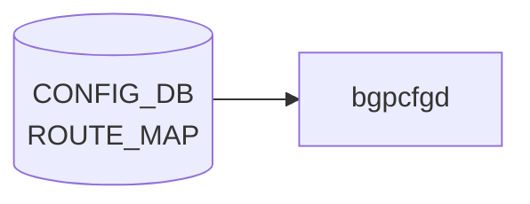

# ROUTE_MAP テーブル

## 概要

ルーティングポリシー (route-map) の statement 単位の定義テーブル。[BGP](../../reference/glossary.md#term-bgp) neighbor / peer-group や redistribute から名前で参照される。`frr-mgmt-framework` (`DEVICE_METADATA.frr_mgmt_framework_config = true`) が [CONFIG_DB](../../reference/glossary.md#term-config_db) を購読し [FRR](../../reference/glossary.md#term-frr) `route-map` コマンドに変換する[^1]。

<!-- cdb-mermaid -->
### データフロー (自動生成)



!!! note "凡例"
    CONFIG_DB から SAI までの典型経路を `docs/reference/config-db-orch-map.md` から機械生成したミニ図。詳細・例外は本ページ本文と対応表を参照。
<!-- /cdb-mermaid -->

## key 構造

```text
ROUTE_MAP|<name>|<stmt_name>
```

`<stmt_name>` は uint16 (1..65535)。同一 `<name>` で複数の statement を順序づけて評価する。
名前の一覧は別テーブル `ROUTE_MAP_SET|<name>` で管理する。

## 主要フィールド

| フィールド | 型 | 説明 |
|-----------|----|------|
| `route_operation` | enum (`PERMIT`/`DENY`) | permit/deny |
| `match_interface` | union leafref `PORT`/`PORTCHANNEL`/`LOOPBACK_INTERFACE`/Vlan pattern | interface match |
| `match_prefix_set` | leafref `PREFIX_SET.name` | IPv4 prefix list match |
| `match_ipv6_prefix_set` | leafref `PREFIX_SET.name` | IPv6 prefix list match |
| `match_protocol` | string | bgp/connected/ospf/ospf3/static |
| `match_next_hop_set` | leafref `PREFIX_SET.name` | next-hop match |
| `match_src_vrf` | union (`default`/leafref `VRF.name`) | source [VRF](../../reference/glossary.md#term-vrf) match |
| `match_neighbor` | leaf-list union | IP / interface match |
| `match_tag` | leaf-list uint32 | tag match |
| `match_med` / `match_origin` / `match_local_pref` | numeric / string / uint32 | [BGP](../../reference/glossary.md#term-bgp) attribute match |
| `match_community` | leafref `COMMUNITY_SET.name` | [BGP](../../reference/glossary.md#term-bgp) community match |
| `match_ext_community` | leafref `EXTENDED_COMMUNITY_SET.name` | extended community match |
| `match_as_path` | leafref `AS_PATH_SET.name` | AS-path match |
| `call_route_map` | leafref `ROUTE_MAP_SET.name` | 別の route-map 呼出し |
| `set_origin` | string | BGP origin set |
| `set_local_pref` | uint32 | local-pref set |
| `set_med` | uint32 | MED set |
| `set_metric_action` | enum `metric-action-type` | metric 操作種別 |
| `set_metric` | uint32 | metric 値 |
| `set_next_hop` | string | IP nexthop set |
| `set_ipv6_next_hop_global` / `set_ipv6_next_hop_prefer_global` | string / boolean | IPv6 nexthop 操作 |
| `set_repeat_asn` / `set_asn` / `set_asn_list` | numeric / string | AS prepend |
| `set_community_inline` / `set_community_ref` | leaf-list / leafref | community 設定 |
| `set_ext_community_inline` / `set_ext_community_ref` | leaf-list / leafref | ext community 設定 |
| `set_tag` | uint32 | tag 設定 |

`metric-action-type`: `METRIC_SET_VALUE`, `METRIC_ADD_VALUE`, `METRIC_SUBTRACT_VALUE`, `METRIC_SET_RTT`, `METRIC_ADD_RTT`, `METRIC_SUBTRACT_RTT`。

## 購読者

- `frr-mgmt-framework`: [CONFIG_DB](../../reference/glossary.md#term-config_db) → `vtysh route-map` コマンド
- `bgpcfgd` (テンプレ経路): 簡易な BGP テンプレ展開時に間接利用

## 関連 CONFIG_DB / YANG / CLI

- 関連 [CONFIG_DB](../../reference/glossary.md#term-config_db): `ROUTE_MAP_SET` (名前一覧)、`PREFIX_SET`、`COMMUNITY_SET`、`AS_PATH_SET`、`BGP_NEIGHBOR_AF`、`BGP_PEER_GROUP_AF`
- 関連 CLI: `config route_map`、`vtysh -c "show route-map"`
- 関連 [YANG](../../reference/glossary.md#term-yang): `sonic-route-map`、`sonic-routing-policy-sets`

<!-- ref-triangle:start -->

## 関連リファレンス

- [YANG](../../reference/glossary.md#term-yang): [`sonic-route-map`](../yang/sonic-route-map.md) / `sonic-routing-policy-sets`
- CLI: [`config route_map`](../cli/config-route.md)

<!-- ref-triangle:end -->

## 引用元

[^1]: [YANG](../../reference/glossary.md#term-yang) 定義: `sonic-route-map.yang`. <https://github.com/sonic-net/sonic-buildimage/blob/9ea932ec2e18f35e58268ec2e4456b1d4afd65cd/src/sonic-yang-models/yang-models/sonic-route-map.yang>

<!-- ops-hint -->
## 運用ヒント

### 典型値

- key 形式: `ROUTE_MAP|<name>|<seq>`。
- `route_operation`: `permit`、`match_*` で条件、`set_*` で属性変更。BGP で in/out に適用。

### よくある誤設定

- 末尾の暗黙 deny を忘れて意図せず全 prefix を drop する。

### 確認コマンド

```bash
sonic-db-cli CONFIG_DB keys 'ROUTE_MAP|*'
vtysh -c 'show route-map'
```
<!-- /ops-hint -->

<!-- glossary-links-injected: 4b960f6e2623 -->
