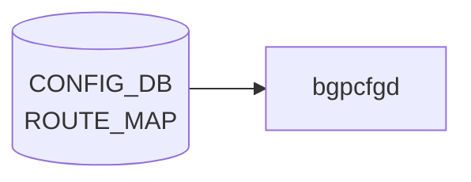

# ROUTE_MAP テーブル

## 概要

ルーティングポリシー (route-map) の statement 単位の定義テーブル。[BGP](../../reference/glossary.md#term-bgp) neighbor / peer-group や redistribute から名前で参照される。`frr-mgmt-framework` (`DEVICE_METADATA.frr_mgmt_framework_config = true`) が [CONFIG_DB](../../reference/glossary.md#term-config_db) を購読し [FRR](../../reference/glossary.md#term-frr) `route-map` コマンドに変換する[^1]。

<!-- cdb-mermaid -->
### データフロー (自動生成)



!!! note "凡例"
    CONFIG_DB から SAI までの典型経路を `docs/reference/config-db-orch-map.md` から機械生成したミニ図。詳細・例外は本ページ本文と対応表を参照。
<!-- /cdb-mermaid -->

## key 構造

```text
ROUTE_MAP|<name>|<stmt_name>
```

`<stmt_name>` は uint16 (1..65535)。同一 `<name>` で複数の statement を順序づけて評価する。
名前の一覧は別テーブル `ROUTE_MAP_SET|<name>` で管理する。

## 主要フィールド

| フィールド | 型 | 説明 |
|-----------|----|------|
| `route_operation` | enum (`PERMIT`/`DENY`) | permit/deny |
| `match_interface` | union leafref `PORT`/`PORTCHANNEL`/`LOOPBACK_INTERFACE`/Vlan pattern | interface match |
| `match_prefix_set` | leafref `PREFIX_SET.name` | IPv4 prefix list match |
| `match_ipv6_prefix_set` | leafref `PREFIX_SET.name` | IPv6 prefix list match |
| `match_protocol` | string | bgp/connected/ospf/ospf3/static |
| `match_next_hop_set` | leafref `PREFIX_SET.name` | next-hop match |
| `match_src_vrf` | union (`default`/leafref `VRF.name`) | source [VRF](../../reference/glossary.md#term-vrf) match |
| `match_neighbor` | leaf-list union | IP / interface match |
| `match_tag` | leaf-list uint32 | tag match |
| `match_med` / `match_origin` / `match_local_pref` | numeric / string / uint32 | [BGP](../../reference/glossary.md#term-bgp) attribute match |
| `match_community` | leafref `COMMUNITY_SET.name` | [BGP](../../reference/glossary.md#term-bgp) community match |
| `match_ext_community` | leafref `EXTENDED_COMMUNITY_SET.name` | extended community match |
| `match_as_path` | leafref `AS_PATH_SET.name` | AS-path match |
| `call_route_map` | leafref `ROUTE_MAP_SET.name` | 別の route-map 呼出し |
| `set_origin` | string | BGP origin set |
| `set_local_pref` | uint32 | local-pref set |
| `set_med` | uint32 | MED set |
| `set_metric_action` | enum `metric-action-type` | metric 操作種別 |
| `set_metric` | uint32 | metric 値 |
| `set_next_hop` | string | IP nexthop set |
| `set_ipv6_next_hop_global` / `set_ipv6_next_hop_prefer_global` | string / boolean | IPv6 nexthop 操作 |
| `set_repeat_asn` / `set_asn` / `set_asn_list` | numeric / string | AS prepend |
| `set_community_inline` / `set_community_ref` | leaf-list / leafref | community 設定 |
| `set_ext_community_inline` / `set_ext_community_ref` | leaf-list / leafref | ext community 設定 |
| `set_tag` | uint32 | tag 設定 |

`metric-action-type`: `METRIC_SET_VALUE`, `METRIC_ADD_VALUE`, `METRIC_SUBTRACT_VALUE`, `METRIC_SET_RTT`, `METRIC_ADD_RTT`, `METRIC_SUBTRACT_RTT`。

## 購読者

- `frr-mgmt-framework`: [CONFIG_DB](../../reference/glossary.md#term-config_db) → `vtysh route-map` コマンド
- `bgpcfgd` (テンプレ経路): 簡易な BGP テンプレ展開時に間接利用

## 関連 CONFIG_DB / YANG / CLI

- 関連 [CONFIG_DB](../../reference/glossary.md#term-config_db): `ROUTE_MAP_SET` (名前一覧)、`PREFIX_SET`、`COMMUNITY_SET`、`AS_PATH_SET`、`BGP_NEIGHBOR_AF`、`BGP_PEER_GROUP_AF`
- 関連 CLI: `config route_map`、`vtysh -c "show route-map"`
- 関連 [YANG](../../reference/glossary.md#term-yang): `sonic-route-map`、`sonic-routing-policy-sets`

<!-- ref-triangle:start -->

## 関連リファレンス

- [YANG](../../reference/glossary.md#term-yang): [`sonic-route-map`](../yang/sonic-route-map.md) / `sonic-routing-policy-sets`
- CLI: [`config route_map`](../cli/config-route.md)

<!-- ref-triangle:end -->

## 引用元

[^1]: [YANG](../../reference/glossary.md#term-yang) 定義: `sonic-route-map.yang`. <https://github.com/sonic-net/sonic-buildimage/blob/9ea932ec2e18f35e58268ec2e4456b1d4afd65cd/src/sonic-yang-models/yang-models/sonic-route-map.yang>

<!-- ops-hint -->
## 運用ヒント

### 典型値

- key 形式: `ROUTE_MAP|<name>|<seq>`。
- `route_operation`: `permit`、`match_*` で条件、`set_*` で属性変更。BGP で in/out に適用。

### よくある誤設定

- 末尾の暗黙 deny を忘れて意図せず全 prefix を drop する。

### 確認コマンド

```bash
sonic-db-cli CONFIG_DB keys 'ROUTE_MAP|*'
vtysh -c 'show route-map'
```
<!-- /ops-hint -->

<!-- value-behavior -->
## 値依存挙動マトリクス

### `route_operation` 値別挙動
| 値 | 挙動 |
|----|------|
| `PERMIT` | match した経路を許可し、`set_*` アクションを適用。 |
| `DENY` | match した経路を拒否（DROP）。`set_*` アクションは無視される。 |

### `set_metric_action` 値別挙動
| 値 | 挙動 |
|----|------|
| `METRIC_SET_VALUE` | MED を `set_metric` の値に設定。 |
| `METRIC_ADD_VALUE` | MED に `set_metric` を加算。 |
| `METRIC_SUBTRACT_VALUE` | MED から `set_metric` を減算。 |
| `METRIC_SET_RTT` | MED を RTT 値に設定。 |
| `METRIC_ADD_RTT` | MED に RTT を加算。 |
| `METRIC_SUBTRACT_RTT` | MED から RTT を減算。 |

### BGPRouteMapMgr が処理する key 値別挙動
| key 値 | 挙動 |
|--------|------|
| `FROM_SDN_SLB_ROUTES` | 有効（SDN SLB ユースケース専用）。 |
| `FROM_SDN_APPLIANCE_ROUTES` | 有効（SDN Appliance ユースケース専用）。 |
| その他 | `log_err("BGPRouteMapMgr:: Invalid key for route-map %s")` → 拒否。汎用 route-map は [bgpcfgd](../../reference/glossary.md#term-bgpcfgd) テンプレート経由で管理。 |

<!-- /value-behavior -->

<!-- cdb-exceptions -->
## 例外条件・特殊挙動

- **BGPRouteMapMgr は固定 2 キーのみ処理**: `FROM_SDN_SLB_ROUTES` / `FROM_SDN_APPLIANCE_ROUTES` 以外の key は `log_err("BGPRouteMapMgr:: Invalid key for route-map %s")` で拒否される。これらは SDN ユースケース専用であり、汎用 route-map の CONFIG_DB 管理は [bgpcfgd](../../reference/glossary.md#term-bgpcfgd) の ROUTE_MAP テーブル consumer ではなく [bgpcfgd](../../reference/glossary.md#term-bgpcfgd) テンプレートが担う。[^2]
- **community_id 形式不正**: `<0-65535>:<0-65535>` 形式でない場合 `log_err` してスキップ。[^2]
- **BGP ASN 未設定 (constants)**: `deployment_id_asn_map` が constants に存在しないか、`deployment_id=2` のエントリがない場合は route-map の更新をスキップする（既存 route-map は残る）。[^2]
- **シーケンス番号枯渇**: `managers_allow_list.py` との連携でシーケンス番号が不足した場合 `RuntimeError("No free sequence numbers")` で追加が失敗する。[^2]

[^2]: bgpcfgd RouteMapMgr 実装: `sonic-buildimage/src/sonic-bgpcfgd/bgpcfgd/managers_rm.py`. <https://github.com/sonic-net/sonic-buildimage/blob/master/src/sonic-bgpcfgd/bgpcfgd/managers_rm.py>


<!-- derivation -->
## 派生・条件付き登録 (Phase 6/7)

### Phase 6: 自動派生

bgpcfgd の `RouteMapMgr` が `ROUTE_MAP` テーブルの各フィールド（`MATCH_PREFIX_LIST`、`MATCH_AS_PATH`、`SET_COMMUNITY` 等）を FRR の `match` / `set` 句コマンドへ変換する。CONFIG_DB 内フィールド間の自動付与なし。

### Phase 7: 条件付き登録 (add_manager 条件)

bgpcfgd は常時起動し `RouteMapMgr` を無条件登録する。参照先の `PREFIX_LIST` / `AS_PATH_SET` / `COMMUNITY_SET` が未設定でも FRR コマンドは発行されるが、FRR 側で未解決参照エラーになる場合がある。

<!-- /derivation -->

<!-- handler-branching -->
### Phase 8: Handler メソッド内分岐

| Handler | 分岐条件 | 効果 | evidence |
|---|---|---|---|
| `RouteMapMgr` | `action==permit` | `route-map <name> permit <seq>` | `managers_route_map.py` |
| `RouteMapMgr` | `action==deny` | `route-map <name> deny <seq>` | `managers_route_map.py` |
| `RouteMapMgr` | `MATCH_PREFIX_LIST` フィールドあり | `match ip address prefix-list <list>` 追加 | `managers_route_map.py` |
| `RouteMapMgr` | `MATCH_AS_PATH` フィールドあり | `match as-path <list>` 追加 | `managers_route_map.py` |
| `RouteMapMgr` | `SET_COMMUNITY` フィールドあり | `set community <value>` 追加 | `managers_route_map.py` |
| `RouteMapMgr` | del_handler | FRR に `no route-map <name>` 発行 | `managers_route_map.py` |

> **スキャン証跡**: `ROUTE_MAP` は BGP ルーティングポリシーの中核。bgpcfgd が FRR vtysh に変換。CONFIG_DB 内フィールド間の自動派生なし。

<!-- /handler-branching -->

<!-- runtime-trace -->
## CDB → 実コンテナ動作トレース

### 段階 1: Consumer 登録

- **bgpcfgd**: `ROUTE_MAP` テーブルを `ConfigDBConnector` で購読。

### 段階 2: CFG → APPL 翻訳

- bgpcfgd が FRR の `route-map` を `vtysh` 経由で設定。PREFIX_LIST / PREFIX_SET を参照する場合は先に作成が必要。
- APP_DB への書き込みなし。

### 段階 3: APPL → SAI

- FRR がルートマップを BGP ポリシー (import/export filter, redistribution) として使用。SAI 経由なし。

### 段階 4: タイミング + 副作用

- route-map 変更は FRR に即時反映。BGP ピアへの影響は次の UPDATE/KEEPALIVE から。
- 副作用: `set local-preference` 変更等でルート選択が変わり、トラフィックパスが切り替わる可能性。

<!-- /runtime-trace -->
<!-- entry-points -->
## 書き込み入り口 (Direction A)

ROUTE_MAP テーブルへの書き込みが発生するコード経路を網羅的に調査した結果。

### CLI

  - 専用 CLI なし — `sonic-cfggen` または `config load` 経由

### minigraph / sonic-cfggen

minigraph.py に ROUTE_MAP 生成なし

### REST / gNMI

REST/gNMI 書き込み経路なし

### db_migrator

db_migrator.py での ROUTE_MAP マイグレーションなし

### ビルド時デフォルト (build-time default)

なし

### ハードコードデフォルト / ランタイム注入

**sonic-bgpcfgd** `managers_rm.py` が ROUTE_MAP テーブルを監視し FRR bgpd に反映 (sonic-buildimage/src/sonic-bgpcfgd/bgpcfgd/managers_rm.py); **frrcfgd** `frrcfgd.py` も ROUTE_MAP を監視

### 死活・デッドコード

なし
<!-- /entry-points -->

<!-- side-effects -->
## 副次 DB 書込・外部副作用 (Phase F)

### FRR vtysh コマンド発行 (bgpcfgd)

`managers_rm.py` の `RouteMapMgr` は `cfg_mgr.push_list()` → `ConfigMgr.commit()` → `vtysh -f <tmpfile>` で FRR bgpd へ設定を書込む[^3]。

| イベント | vtysh コマンド | 対象デーモン |
|---|---|---|
| set (FROM_SDN_SLB/APPLIANCE_ROUTES) | `route-map <NAME>_RM permit 100` | bgpd |
| set | `set as-path prepend <asn> <asn>` | bgpd |
| set | `set community <community_id>` | bgpd |
| set | `set origin incomplete` | bgpd |
| del | `no route-map <NAME>_RM permit 100` | bgpd |

### FRR vtysh コマンド発行 (frrcfgd)

`frrcfgd.py` は `ROUTE_MAP` テーブルを `['zebra', 'bgpd', 'ospfd']` の各デーモンに対して反映する[^4]。

| イベント | vtysh コマンド | 対象デーモン |
|---|---|---|
| set (`route_operation=permit`) | `route-map <name> permit <seq>` | zebra, bgpd, ospfd |
| set (`route_operation=deny`) | `route-map <name> deny <seq>` | zebra, bgpd, ospfd |
| set (match_*/set_* フィールド) | 各 `match`/`set` サブコマンド | zebra, bgpd, ospfd |
| del | `no route-map <name> <action> <seq>` | zebra, bgpd, ospfd |

### kernel route 経路への影響

route-map は FRR の BGP/OSPF/zebra ルーティングポリシーとして機能する。`set local-preference` / `set next-hop` 等の変更がルート選択に影響し、zebra が kernel RIB (`ip route`) を更新する。BGP ピアへの影響は次の UPDATE/KEEPALIVE 以降。

### 副次書込まとめ

| 副次先 | 操作 | 内容 | evidence |
|---|---|---|---|
| FRR bgpd (vtysh) | configure | `route-map <NAME>_RM permit 100` + AS-path/community/origin set | `managers_rm.py:87-98`[^3] |
| FRR bgpd (vtysh) | delete | `no route-map <NAME>_RM permit 100` | `managers_rm.py:41-44`[^3] |
| FRR zebra/bgpd/ospfd (vtysh) | configure | `route-map <name> permit/deny <seq>` + match/set サブコマンド | `frrcfgd.py:3118-3126`[^4] |
| FRR zebra/bgpd/ospfd (vtysh) | delete | `no route-map <name> <action> <seq>` | `frrcfgd.py:3143-3148`[^4] |
| kernel RIB (`ip route`) | 間接変更 | zebra が FRR RIB 変化を kernel に反映 | FRR zebra 標準動作 |
| STATE_DB | なし | — | スキャン 0 件 |
| APPL_DB | なし | — | スキャン 0 件 |

<!-- /side-effects -->

[^3]: bgpcfgd RouteMapMgr set/del 実装: `sonic-buildimage/src/sonic-bgpcfgd/bgpcfgd/managers_rm.py`. <https://github.com/sonic-net/sonic-buildimage/blob/master/src/sonic-bgpcfgd/bgpcfgd/managers_rm.py>
[^4]: frrcfgd ROUTE_MAP handler 実装: `sonic-buildimage/src/sonic-frr-mgmt-framework/frrcfgd/frrcfgd.py`. <https://github.com/sonic-net/sonic-buildimage/blob/master/src/sonic-frr-mgmt-framework/frrcfgd/frrcfgd.py>

<!-- glossary-links-injected: 24dbb72211e3 -->
