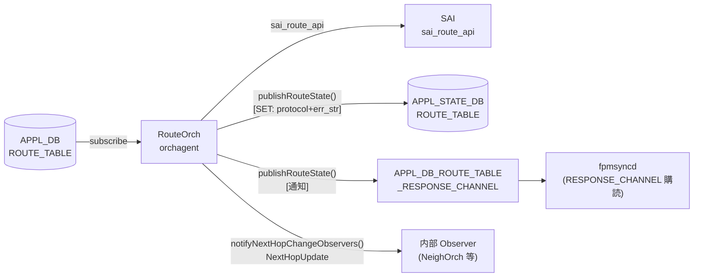

# RouteOrch event / notification

## 概要

`orchagent` の `RouteOrch` は経路の SAI プログラミング完了時に **2 種類の通知** を送出する。

| 種別 | 機構 | 送信先 | 目的 |
|------|------|--------|------|
| **ResponsePublisher** | `publishRouteState()` | APPL_STATE_DB + `APPL_DB_ROUTE_TABLE_RESPONSE_CHANNEL` | fpmsyncd へのプログラミング結果フィードバック |
| **NextHopObserver** | `notifyNextHopChangeObservers()` | 内部 Observer（NeighOrch, MirrorOrch 等） | ルーティング変化のオーケストレーション内通知 |

!!! info "関連ページ"
    - APPL_DB の `ROUTE_TABLE` フィールド: [`ROUTE_TABLE (APPL_DB)`](route.md)
    - STATE_DB / APPL_STATE_DB のテーブル構造: [`ROUTE_TABLE (STATE_DB/APPL_STATE_DB)`](route-state.md)
    - fpmsyncd のハンドラ分岐: [`ROUTE_TABLE handler 分岐`](route-handler.md)

<!-- cdb-mermaid -->
### データフロー



<!-- /cdb-mermaid -->

---

## 1. ResponsePublisher 通知

### 呼び出し契機

`RouteOrch::publishRouteState()` は以下のタイミングで呼ばれる[^1]:

| 状況 | 行番号 |
|------|--------|
| `addRoute()` 内: SAI エラー時 | L923 |
| `addRoute()` 内: 既存エントリと完全一致（再 publish） | L1050 |
| `addRoute()` 内: 重複エントリ追加スキップ時 | L1090 |
| `addRoutePost()` 末尾: SAI 操作完了後 | L2729 |
| `removeRoutePost()` 末尾: SAI 操作完了後 | L2970 |

### 送出フィールド

```cpp
// routeorch.cpp L3185–3202
void RouteOrch::publishRouteState(const RouteBulkContext& ctx, const ReturnCode& status)
{
    std::vector<FieldValueTuple> fvs;

    if (ctx.is_set)
    {
        fvs.emplace_back("protocol", ctx.protocol);
    }

    const bool replace = false;
    m_publisher.publish(APP_ROUTE_TABLE_NAME, ctx.key, fvs, status, replace);
}
```

| フィールド | SET 操作時 | DEL 操作時 |
|-----------|-----------|-----------|
| `protocol` | `ctx.protocol`（空文字列またはプロトコル名） | **送信しない**（fvs が空） |
| `err_str` | `ResponsePublisher` が自動付与 | 同上（自動付与） |

### `protocol` フィールドのデフォルト

`RouteBulkContext::protocol` の初期値は `""`:

```cpp
// routeorch.cpp L157–177: clear() 実装
protocol.clear();  // → ""
```

APPL_DB の SET メッセージから `protocol` フィールドを読み取る (L785–788)[^1]:

```cpp
if (fvField(i) == "protocol" && fvValue(i) != "")
{
    ctx.protocol = fvValue(i);
}
```

| APPL_DB の `protocol` フィールド | APPL_STATE_DB の `protocol` 値 |
|---------------------------------|-------------------------------|
| `"bgp"` 等（空でない文字列） | そのままコピー |
| 存在しない、または空文字列 | `""` （空文字列） |

### `err_str` フィールドのデフォルト

`ResponsePublisher::publish()` が `err_str` を自動付与する (response_publisher.cpp L102–103)[^3]:

```cpp
swss::FieldValueTuple err_str("err_str", PrependedComponent(status) + status.message());
intent_attrs_copy.insert(intent_attrs_copy.begin(), err_str);
```

`PrependedComponent()` の決定ロジック (response_publisher.cpp L16–28)[^3]:

```cpp
std::string PrependedComponent(const ReturnCode &status)
{
    if (status.ok())    return "";
    if (status.isSai()) return "[SAI] ";
    return "[OrchAgent] ";
}
```

| SAI 結果 | `err_str` の値 |
|---------|----------------|
| 成功 | `"SWSS_RC_SUCCESS"` |
| SAI エラー | `"[SAI] <エラーメッセージ>"` |
| OrchAgent エラー | `"[OrchAgent] <エラーメッセージ>"` |

### APPL_STATE_DB 書き込み条件

`ResponsePublisher` は以下の条件でのみ APPL_STATE_DB を更新する (response_publisher.cpp L133–138)[^3]:

| 操作 | SAI 結果 | APPL_STATE_DB |
|------|---------|---------------|
| SET | 成功 | `protocol` + `err_str` を書き込む |
| SET | 失敗 | 書き込まない（RESPONSE_CHANNEL 通知のみ） |
| DEL | 成功 | エントリを削除（DEL_COMMAND） |
| DEL | 失敗 | 書き込まない |

### バッファリングと flush

RouteOrch コンストラクタ (routeorch.cpp L57–58)[^1]:

```cpp
m_publisher.setBuffered(true);
m_publisher.m_directDbWrite = true;
```

- `setBuffered(true)`: 通知は Redis パイプライン経由でバッファリング
- `m_directDbWrite = true`: DB 書き込みはパイプライン経由（非スレッド）
- `doTask()` の最後に必ず `flush()` が呼ばれる (routeorch.cpp L1231)[^1]:

```cpp
/* Flush response publisher so route notifications reach fpmsyncd every batch.
 * Without this, notifications stay buffered in the Redis pipeline until the
 * next batch. */
m_publisher.flush();
```

---

## 2. NextHopObserver 内部通知

### `NextHopUpdate` 構造体

`notifyNextHopChangeObservers()` が送出する `NextHopUpdate` 構造体 (routeorch.h L61–68)[^2]:

```cpp
struct NextHopUpdate
{
    sai_object_id_t vrf_id;
    IpAddress destination;
    IpPrefix prefix;
    NextHopGroupKey nexthopGroup;
};
```

| フィールド | 型 | 説明 |
|-----------|-----|------|
| `vrf_id` | `sai_object_id_t` | VRF の SAI オブジェクト ID |
| `destination` | `IpAddress` | Observer が追跡しているホスト IP アドレス |
| `prefix` | `IpPrefix` | 現在の最長プレフィックスマッチ |
| `nexthopGroup` | `NextHopGroupKey` | 新しい nexthop グループキー |

`nexthopGroup` にデフォルト値はなく、常にその時点の実際の nexthop グループキーが設定される。

### 通知発火条件

```cpp
// routeorch.cpp L1270
void RouteOrch::notifyNextHopChangeObservers(
    sai_object_id_t vrf_id, const IpPrefix &prefix,
    const NextHopGroupKey &nexthops, bool add)
```

**ADD 時（`add=true`）**:
- 新規ルートが追加され、そのルートが当該 Observer 宛先の最長プレフィックスマッチになった場合
- 既存ルートの `nexthopGroup` が変化し、そのルートが最長プレフィックスマッチの場合

**DEL 時（`add=false`）**:
- 削除されたルートが最長プレフィックスマッチであった場合（次の最長マッチを `NextHopUpdate` で再通知）

### `attach()` 時の即時通知

Observer が `attach()` した時点で最長プレフィックスマッチが存在すれば即時通知 (routeorch.cpp L340–350)[^1]:

```cpp
// Trigger next hop change for the first time the observer is attached
auto route = observerEntry->second.routeTable.rbegin();
if (route != observerEntry->second.routeTable.rend())
{
    NextHopUpdate update = { vrf_id, dstAddr, route->first, route->second.nhg_key };
    observer->update(SUBJECT_TYPE_NEXTHOP_CHANGE, static_cast<void *>(&update));
}
```

### デフォルトルートの存在保証

Observer 追跡テーブルには必ずデフォルトルート (`0.0.0.0/0` / `::/0`) が含まれるため、
最長プレフィックスマッチは常に 1 件以上存在する:

```cpp
/* Table should not be empty. Default route should always exists. */
assert(!entry.second.routeTable.empty());
```

### 主な Observer

| Observer | 用途 |
|---------|------|
| `NeighOrch` | ARP/ND エントリの nexthop 変化追跡 |
| `MirrorOrch` | ミラーセッションの宛先 IP 解決 |
| `TunnelDecapOrch` | トンネル decap 処理の nexthop 解決 |

---

<!-- defaults -->
## コード由来デフォルト詳細 (Phase A)

<!-- evidence: meta/_intermediate/cdb-flow/route-orch-event-defaults.md -->

### ResponsePublisher — `protocol` フィールドのデフォルト: `""`

`RouteBulkContext::protocol` は初期化時に空文字列:

```cpp
// routeorch.cpp: clear() メソッド
protocol.clear();  // デフォルト: ""
```

APPL_DB に `protocol` フィールドが存在する場合のみ上書き (L785–788):

```cpp
if (fvField(i) == "protocol" && fvValue(i) != "")
{
    ctx.protocol = fvValue(i);
}
```

- `protocol` フィールドが存在しない、または空文字列 → `ctx.protocol = ""`（空文字列）のまま APPL_STATE_DB に `protocol: ""` として書き込まれる
- `protocol` フィールドが空でない文字列 → その値をそのままコピー

### ResponsePublisher — `err_str` フィールドのデフォルト: `"SWSS_RC_SUCCESS"`

SAI 成功時は `PrependedComponent(status)` が `""` を返し、`status.message()` が `"SWSS_RC_SUCCESS"` になる:

```cpp
// response_publisher.cpp L102
swss::FieldValueTuple err_str("err_str", PrependedComponent(status) + status.message());
```

- 成功時の `err_str` 値: `"SWSS_RC_SUCCESS"`（プレフィックスなし）
- SAI エラー時: `"[SAI] "` + エラーメッセージ
- OrchAgent エラー時: `"[OrchAgent] "` + エラーメッセージ

### ResponsePublisher — flush タイミング

`doTask()` の末尾で必ず `flush()` が呼ばれるため、バッチ処理完了後に全通知がまとめて送出される。個別 route ごとに flush は **行われない**。

### NextHopObserver — `NextHopUpdate` のデフォルト値

`NextHopUpdate` 構造体のフィールドはすべて呼び出し時の実際の値で埋められる。構造体自体にデフォルト値は定義されていない:

```cpp
NextHopUpdate update = { vrf_id, entry.first.second, prefix, nexthops };
```

- `nexthopGroup` が空（nexthop なし）の状態で通知されるのは、削除時に次の最長マッチが blackhole ルートのみの場合。

<!-- /defaults -->

---

<!-- ordering -->
## 書込み順・初期化順依存 (Phase B)

<!-- evidence: meta/_intermediate/cdb-flow/route-orch-event-ordering.md -->

RouteOrch の通知機構（ResponsePublisher / NextHopObserver）は以下の 2 軸で順序依存が存在する。

### ResponsePublisher — suppress-fib-pending 設定が先行必須

`fpmsyncd` が `APPL_DB_ROUTE_TABLE_RESPONSE_CHANNEL` を購読するのは、
`CONFIG_DB DEVICE_METADATA|localhost` に `suppress-fib-pending = "enabled"` が設定されているときのみ
(fpmsyncd.cpp L78–120)[^4]:

```cpp
deviceMetadataTable.hget("localhost", "suppress-fib-pending", suppressionEnabledStr);
if (suppressionEnabledStr == "enabled")
{
    routeResponseChannel = std::make_unique<NotificationConsumer>(
        &applStateDb, routeResponseChannelName);
    sync.setSuppressionEnabled(true);
}
```

Redis の Pub/Sub は通知をバッファしないため、この設定が未有効の状態で fpmsyncd が起動すると
`publishRouteState()` が送出する通知はすべて消失する。

**必要な順序**:
```
CONFIG_DB|DEVICE_METADATA|localhost  suppress-fib-pending = enabled
  → fpmsyncd 起動（または再起動）
  → APPL_DB_ROUTE_TABLE_RESPONSE_CHANNEL を購読開始
  → orchagent RouteOrch からの通知が有効利用される
```

### ResponsePublisher — `flush()` は `doTask()` 末尾まで遅延

RouteOrch コンストラクタで `m_publisher.setBuffered(true)` が設定され、
個別ルートごとではなくバッチ処理完了後に一括 flush される (routeorch.cpp L57, L1231)[^1]:

```cpp
// コンストラクタ
m_publisher.setBuffered(true);

// doTask() 末尾
m_publisher.flush();
```

同一バッチ内で複数のルートが処理されても、RESPONSE_CHANNEL 通知は `doTask()` が完了するまで発火しない。

### NextHopObserver — `attach()` タイミングと即時通知

Observer が `attach()` した時点でルートが存在すれば即時通知が発火する (routeorch.cpp L308–350)[^1]:

```cpp
auto route = observerEntry->second.routeTable.rbegin();
if (route != observerEntry->second.routeTable.rend())
{
    NextHopUpdate update = { vrf_id, dstAddr, route->first, route->second.nhg_key };
    observer->update(SUBJECT_TYPE_NEXTHOP_CHANGE, static_cast<void *>(&update));
}
```

| `attach()` のタイミング | 初回 `NextHopUpdate` |
|-------------------------|----------------------|
| デフォルトルート SAI 書き込み **前** | 通知なし（テーブルが空） |
| デフォルトルート SAI 書き込み **後** | 即時通知（`0.0.0.0/0` or `::/0`） |

### `m_orchList` による `doTask()` 呼び出し順 (orchdaemon.cpp L500)[^5]

```
gNeighOrch → gNhgOrch → gCbfNhgOrch → gFgNhgOrch → gRouteOrch
```

同一バッチサイクルで NeighOrch・NhgOrch が先に `doTask()` を完了するため、
RouteOrch が `addRoute()` 内で `hasNhg()` / `hasNextHop()` を確認した時点で
同バッチのエントリが登録済みになっている。

### 順序依存サマリ

| # | 依存関係 | 方向 | 影響 |
|---|----------|------|------|
| 1 | `suppress-fib-pending = enabled` → fpmsyncd 起動 | 設定先行必須 | 未設定では RESPONSE_CHANNEL 通知が消失 |
| 2 | RouteOrch `doTask()` 完了 → RESPONSE_CHANNEL 通知発火 | `flush()` 依存 | バッチ完了まで通知はバッファされる |
| 3 | RouteOrch 生成 → Observer `attach()` | Observer は RouteOrch 後に初期化 | MirrorOrch・NatOrch はセッション設定時に `attach()` |
| 4 | デフォルトルート SAI 書き込み後 → Observer `attach()` | 即時通知の有無が変わる | `attach()` 前にルートがない場合、初回通知は次のルート変化まで遅延 |
| 5 | NeighOrch / NhgOrch `doTask()` → RouteOrch `doTask()` | `m_orchList` 順で担保 | 同バッチ内で nexthop 登録 → 経路 SAI プログラミングが完結 |

<!-- /ordering -->

---

<!-- cross-refs -->
## 暗黙参照テーブル (Phase C)

<!-- evidence: meta/_intermediate/cdb-flow/route-orch-event-cross-refs.md -->

全依存が実装レベルの暗黙参照（YANG 未定義テーブル）。

| 参照先テーブル / リソース | 参照方向 | 条件 | 参照元 evidence |
|--------------------------|---------|------|----------------|
| `CONFIG_DB DEVICE_METADATA\|localhost.suppress-fib-pending` | 読み取り（起動時 + 動的変更 Subscribe） | fpmsyncd 起動時・DEVICE_METADATA 変更通知受信時 | `fpmsyncd.cpp` L113–117, L278–302 |
| `APPL_STATE_DB ROUTE_TABLE` | 書き込み先（SAI SET 成功時） | `publishRouteState()` が `protocol` / `err_str` を書き込む | `response_publisher.cpp` L93–148 |
| `fpmsyncd` (`APPL_DB_ROUTE_TABLE_RESPONSE_CHANNEL` 消費) | Pub/Sub 通知送信先 | `suppress-fib-pending = enabled` かつ fpmsyncd 稼働中のみ | `fpmsyncd.cpp` L78, L116; `routesync.cpp` L3156–3190 |
| `CONFIG_DB MIRROR_SESSION` | 間接参照（MirrorOrch が `attach()`/`detach()` のトリガ） | MirrorOrch がセッションエントリを処理するとき | `mirrororch.cpp` L517 (`attach`), L557 (`detach`) |
| `CONFIG_DB NAT_ENTRY` / `NAT_TWICE_ENTRY` | 間接参照（NatOrch が `attach()`/`detach()` のトリガ） | NatOrch が DNAT / 双方向 NAT エントリを処理するとき | `natorch.cpp` L414, L458, L504, L591 (`attach`); L558, L646, L688, L732 (`detach`) |
| `APPL_DB ROUTE_TABLE` → `m_syncdRoutes`（RouteOrch 内部テーブル） | 内部依存（最長プレフィックスマッチの計算源） | `notifyNextHopChangeObservers()` が最長マッチを求めるとき | `routeorch.cpp` L1270–1340 |

!!! note "`suppress-fib-pending` が欠如した場合の挙動"
    `CONFIG_DB DEVICE_METADATA|localhost` に `suppress-fib-pending = enabled` が設定されていない場合、
    fpmsyncd は `APPL_DB_ROUTE_TABLE_RESPONSE_CHANNEL` を一切購読しない。
    Redis の Pub/Sub はメッセージをバッファしないため、orchagent が `publishRouteState()` で送出した通知は消失する。
    `route_check.py` は `APPL_STATE_DB ROUTE_TABLE` の `err_str` を直接 GET するため、この設定に関係なく動作する。

!!! note "NextHopObserver の登録者"
    `RouteOrch::attach()` を呼ぶ Orch は MirrorOrch と NatOrch のみ（ソース精読で確認済み）。
    NeighOrch は `routeorch.h` の `Subject` 継承を通じて別経路で通知を受け取るが、
    `attach(IpAddress)` 経由の NextHopObserver 登録は行わない。

<!-- /cross-refs -->

---

## 制約

- `publishRouteState()` は SET 操作時のみ `protocol` を送信する。DEL 操作時は `fvs` が空のため APPL_STATE_DB からエントリが削除される。
- SAI プログラミング失敗時は APPL_STATE_DB への書き込みは行われないが、RESPONSE_CHANNEL への通知は行われる。
- `notifyNextHopChangeObservers()` は **最長プレフィックスマッチが変化した場合のみ** 通知を発火する。最長マッチが同じルートで nexthopGroup も同じ場合は通知しない。
- Observer は `attach()` で登録した IP アドレスを含む最長プレフィックスマッチの変化のみを受け取る。

## 購読者 (consumer)

### ResponsePublisher 通知

| プロセス | 参照 | 用途 |
|---------|------|------|
| `fpmsyncd` | `APPL_DB_ROUTE_TABLE_RESPONSE_CHANNEL` | SAI プログラミング結果を FRR へフィードバック |
| `route_check.py` | `APPL_STATE_DB ROUTE_TABLE` | APPL_DB と APPL_STATE_DB の整合確認 |

### NextHopObserver 通知

| Observer | `attach()` 箇所 |
|---------|----------------|
| `NeighOrch` | ネイバー解決時 |
| `MirrorOrch` | ミラーセッション設定時 |

## 関連リファレンス

- APPL_DB: [`ROUTE_TABLE`](route.md)
- STATE_DB / APPL_STATE_DB: [`ROUTE_TABLE (STATE_DB/APPL_STATE_DB)`](route-state.md)
- CONFIG_DB: [`STATIC_ROUTE`](static-route.md)
- handler 分岐: [`ROUTE_TABLE handler 分岐`](route-handler.md)

## 引用元

[^1]: RouteOrch 実装: `orchagent/routeorch.cpp`. <https://github.com/sonic-net/sonic-swss/blob/4305596156d70e9797e8a881b3d19b46de0bce0d/orchagent/routeorch.cpp>
[^2]: RouteOrch ヘッダ: `orchagent/routeorch.h`. <https://github.com/sonic-net/sonic-swss/blob/4305596156d70e9797e8a881b3d19b46de0bce0d/orchagent/routeorch.h>
[^3]: ResponsePublisher 実装: `orchagent/response_publisher.cpp`. <https://github.com/sonic-net/sonic-swss/blob/4305596156d70e9797e8a881b3d19b46de0bce0d/orchagent/response_publisher.cpp>
[^4]: fpmsyncd 実装: `fpmsyncd/fpmsyncd.cpp`. <https://github.com/sonic-net/sonic-swss/blob/4305596156d70e9797e8a881b3d19b46de0bce0d/fpmsyncd/fpmsyncd.cpp>
[^5]: orchdaemon 初期化: `orchagent/orchdaemon.cpp`. <https://github.com/sonic-net/sonic-swss/blob/4305596156d70e9797e8a881b3d19b46de0bce0d/orchagent/orchdaemon.cpp>
[^6]: routesync 実装: `fpmsyncd/routesync.cpp`. <https://github.com/sonic-net/sonic-swss/blob/4305596156d70e9797e8a881b3d19b46de0bce0d/fpmsyncd/routesync.cpp>
[^7]: MirrorOrch 実装: `orchagent/mirrororch.cpp`. <https://github.com/sonic-net/sonic-swss/blob/4305596156d70e9797e8a881b3d19b46de0bce0d/orchagent/mirrororch.cpp>
[^8]: NatOrch 実装: `orchagent/natorch.cpp`. <https://github.com/sonic-net/sonic-swss/blob/4305596156d70e9797e8a881b3d19b46de0bce0d/orchagent/natorch.cpp>

<!-- ops-hint -->
## 運用ヒント

### 確認コマンド

```bash
# APPL_STATE_DB の経路プログラミング結果確認
sonic-db-cli APPL_STATE_DB hgetall 'ROUTE_TABLE:10.0.0.0/24'

# err_str でエラー経路を検索
sonic-db-cli APPL_STATE_DB keys 'ROUTE_TABLE:*' | while read k; do
  err=$(sonic-db-cli APPL_STATE_DB hget "$k" err_str)
  [ "$err" != "SWSS_RC_SUCCESS" ] && echo "$k: $err"
done

# RESPONSE_CHANNEL の通知を監視（デバッグ用）
redis-cli -n 0 subscribe APPL_DB_ROUTE_TABLE_RESPONSE_CHANNEL
```

### 典型エントリ例

```
# APPL_STATE_DB: BGP 経路のプログラミング成功
APPL_STATE_DB ROUTE_TABLE:10.1.0.0/24
  err_str: SWSS_RC_SUCCESS
  protocol: bgp

# APPL_STATE_DB: protocol フィールドなし経路（static など fpmsyncd 経由以外）
APPL_STATE_DB ROUTE_TABLE:192.168.1.0/24
  err_str: SWSS_RC_SUCCESS
  protocol: (空文字列)
```

### よくある問題

- `err_str` が `"[SAI] ..."` → SAI プログラミング失敗。`/var/log/syslog` の orchagent ログで詳細を確認する。
- APPL_STATE_DB にエントリが存在しない → SAI 失敗または DEL 操作後。`RESPONSE_CHANNEL` のログを確認する。
- `protocol` が空文字列 → APPL_DB の `ROUTE_TABLE` エントリに `protocol` フィールドが存在しない（静的経路や一部の直接書き込みツールで発生する）。
<!-- /ops-hint -->
