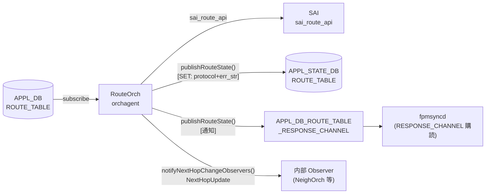

# RouteOrch event / notification

## 概要

`orchagent` の `RouteOrch` は経路の [SAI](../../reference/glossary.md#term-sai) プログラミング完了時に **2 種類の通知** を送出する。

| 種別 | 機構 | 送信先 | 目的 |
|------|------|--------|------|
| **ResponsePublisher** | `publishRouteState()` | APPL_STATE_DB + `APPL_DB_ROUTE_TABLE_RESPONSE_CHANNEL` | [fpmsyncd](../../reference/glossary.md#term-fpmsyncd) へのプログラミング結果フィードバック |
| **NextHopObserver** | `notifyNextHopChangeObservers()` | 内部 Observer（NeighOrch, MirrorOrch 等） | ルーティング変化のオーケストレーション内通知 |

!!! info "関連ページ"
    - APPL_DB の `ROUTE_TABLE` フィールド: [`ROUTE_TABLE (APPL_DB)`](route.md)
    - STATE_DB / APPL_STATE_DB のテーブル構造: [`ROUTE_TABLE (STATE_DB/APPL_STATE_DB)`](route-state.md)
    - fpmsyncd のハンドラ分岐: [`ROUTE_TABLE handler 分岐`](route-handler.md)

<!-- cdb-mermaid -->
### データフロー



<!-- /cdb-mermaid -->

---

## 1. ResponsePublisher 通知

### 呼び出し契機

`RouteOrch::publishRouteState()` は以下のタイミングで呼ばれる[^1]:

| 状況 | 行番号 |
|------|--------|
| `addRoute()` 内: [SAI](../../reference/glossary.md#term-sai) エラー時 | L923 |
| `addRoute()` 内: 既存エントリと完全一致（再 publish） | L1050 |
| `addRoute()` 内: 重複エントリ追加スキップ時 | L1090 |
| `addRoutePost()` 末尾: [SAI](../../reference/glossary.md#term-sai) 操作完了後 | L2729 |
| `removeRoutePost()` 末尾: SAI 操作完了後 | L2970 |

### 送出フィールド

```cpp
// routeorch.cpp L3185–3202
void RouteOrch::publishRouteState(const RouteBulkContext& ctx, const ReturnCode& status)
{
    std::vector<FieldValueTuple> fvs;

    if (ctx.is_set)
    {
        fvs.emplace_back("protocol", ctx.protocol);
    }

    const bool replace = false;
    m_publisher.publish(APP_ROUTE_TABLE_NAME, ctx.key, fvs, status, replace);
}
```

| フィールド | SET 操作時 | DEL 操作時 |
|-----------|-----------|-----------|
| `protocol` | `ctx.protocol`（空文字列またはプロトコル名） | **送信しない**（fvs が空） |
| `err_str` | `ResponsePublisher` が自動付与 | 同上（自動付与） |

### `protocol` フィールドのデフォルト

`RouteBulkContext::protocol` の初期値は `""`:

```cpp
// routeorch.cpp L157–177: clear() 実装
protocol.clear();  // → ""
```

[APPL_DB](../../reference/glossary.md#term-appl_db) の SET メッセージから `protocol` フィールドを読み取る (L785–788)[^1]:

```cpp
if (fvField(i) == "protocol" && fvValue(i) != "")
{
    ctx.protocol = fvValue(i);
}
```

| [APPL_DB](../../reference/glossary.md#term-appl_db) の `protocol` フィールド | APPL_STATE_DB の `protocol` 値 |
|---------------------------------|-------------------------------|
| `"bgp"` 等（空でない文字列） | そのままコピー |
| 存在しない、または空文字列 | `""` （空文字列） |

### `err_str` フィールドのデフォルト

`ResponsePublisher::publish()` が `err_str` を自動付与する (response_publisher.cpp L102–103)[^3]:

```cpp
swss::FieldValueTuple err_str("err_str", PrependedComponent(status) + status.message());
intent_attrs_copy.insert(intent_attrs_copy.begin(), err_str);
```

`PrependedComponent()` の決定ロジック (response_publisher.cpp L16–28)[^3]:

```cpp
std::string PrependedComponent(const ReturnCode &status)
{
    if (status.ok())    return "";
    if (status.isSai()) return "[SAI] ";
    return "[OrchAgent] ";
}
```

| SAI 結果 | `err_str` の値 |
|---------|----------------|
| 成功 | `"SWSS_RC_SUCCESS"` |
| SAI エラー | `"[SAI] <エラーメッセージ>"` |
| OrchAgent エラー | `"[OrchAgent] <エラーメッセージ>"` |

### APPL_STATE_DB 書き込み条件

`ResponsePublisher` は以下の条件でのみ APPL_STATE_DB を更新する (response_publisher.cpp L133–138)[^3]:

| 操作 | SAI 結果 | APPL_STATE_DB |
|------|---------|---------------|
| SET | 成功 | `protocol` + `err_str` を書き込む |
| SET | 失敗 | 書き込まない（RESPONSE_CHANNEL 通知のみ） |
| DEL | 成功 | エントリを削除（DEL_COMMAND） |
| DEL | 失敗 | 書き込まない |

### バッファリングと flush

RouteOrch コンストラクタ (routeorch.cpp L57–58)[^1]:

```cpp
m_publisher.setBuffered(true);
m_publisher.m_directDbWrite = true;
```

- `setBuffered(true)`: 通知は [Redis](../../reference/glossary.md#term-redis) パイプライン経由でバッファリング
- `m_directDbWrite = true`: DB 書き込みはパイプライン経由（非スレッド）
- `doTask()` の最後に必ず `flush()` が呼ばれる (routeorch.cpp L1231)[^1]:

```cpp
/* Flush response publisher so route notifications reach fpmsyncd every batch.
 * Without this, notifications stay buffered in the Redis pipeline until the
 * next batch. */
m_publisher.flush();
```

---

## 2. NextHopObserver 内部通知

### `NextHopUpdate` 構造体

`notifyNextHopChangeObservers()` が送出する `NextHopUpdate` 構造体 (routeorch.h L61–68)[^2]:

```cpp
struct NextHopUpdate
{
    sai_object_id_t vrf_id;
    IpAddress destination;
    IpPrefix prefix;
    NextHopGroupKey nexthopGroup;
};
```

| フィールド | 型 | 説明 |
|-----------|-----|------|
| `vrf_id` | `sai_object_id_t` | [VRF](../../reference/glossary.md#term-vrf) の SAI オブジェクト ID |
| `destination` | `IpAddress` | Observer が追跡しているホスト IP アドレス |
| `prefix` | `IpPrefix` | 現在の最長プレフィックスマッチ |
| `nexthopGroup` | `NextHopGroupKey` | 新しい nexthop グループキー |

`nexthopGroup` にデフォルト値はなく、常にその時点の実際の nexthop グループキーが設定される。

### 通知発火条件

```cpp
// routeorch.cpp L1270
void RouteOrch::notifyNextHopChangeObservers(
    sai_object_id_t vrf_id, const IpPrefix &prefix,
    const NextHopGroupKey &nexthops, bool add)
```

**ADD 時（`add=true`）**:
- 新規ルートが追加され、そのルートが当該 Observer 宛先の最長プレフィックスマッチになった場合
- 既存ルートの `nexthopGroup` が変化し、そのルートが最長プレフィックスマッチの場合

**DEL 時（`add=false`）**:
- 削除されたルートが最長プレフィックスマッチであった場合（次の最長マッチを `NextHopUpdate` で再通知）

### `attach()` 時の即時通知

Observer が `attach()` した時点で最長プレフィックスマッチが存在すれば即時通知 (routeorch.cpp L340–350)[^1]:

```cpp
// Trigger next hop change for the first time the observer is attached
auto route = observerEntry->second.routeTable.rbegin();
if (route != observerEntry->second.routeTable.rend())
{
    NextHopUpdate update = { vrf_id, dstAddr, route->first, route->second.nhg_key };
    observer->update(SUBJECT_TYPE_NEXTHOP_CHANGE, static_cast<void *>(&update));
}
```

### デフォルトルートの存在保証

Observer 追跡テーブルには必ずデフォルトルート (`0.0.0.0/0` / `::/0`) が含まれるため、
最長プレフィックスマッチは常に 1 件以上存在する:

```cpp
/* Table should not be empty. Default route should always exists. */
assert(!entry.second.routeTable.empty());
```

### 主な Observer

| Observer | 用途 |
|---------|------|
| `NeighOrch` | [ARP](../../reference/glossary.md#term-arp)/ND エントリの nexthop 変化追跡 |
| `MirrorOrch` | ミラーセッションの宛先 IP 解決 |
| `TunnelDecapOrch` | トンネル decap 処理の nexthop 解決 |

---

<!-- ordering -->
## 書込み順依存 (Phase B)

<!-- evidence: meta/_intermediate/cdb-flow/route-orch-event-ordering.md -->

`RouteOrch` の `publishRouteState()` (ResponsePublisher) と `notifyNextHopChangeObservers()` (NextHopObserver) は、複数の依存関係に従って発火順序が制御される。

### 検出された順序依存

| # | 依存関係 | 方向 | 緩和策 |
|---|----------|------|--------|
| 1 | `PortsOrch::allPortsReady()` → `doTask()` 処理開始 | **強制先行** | 未完了時は全エントリ保留、ポート Ready 後に自動再処理 |
| 2 | `NeighOrch` / `NhgOrch` `doTask()` → `RouteOrch::doTask()` | `m_orchList` 順序で担保 | 同バッチ内で nexthop 登録 → SAI プログラミングが完結 |
| 3 | [VRF](../../reference/glossary.md#term-vrf) の `VRFOrch` 登録 → [VRF](../../reference/glossary.md#term-vrf) ルートの SAI プログラミング | **強制先行** | 未登録時はスキップ・自動リトライ |
| 4 | SAI バルクコミット → `notifyNextHopChangeObservers` → `publishRouteState` (ADD) | **固定順序** | Observer 通知が RESPONSE_CHANNEL 通知より常に先行 |
| 5 | `doTask()` 全ルート処理 → `m_publisher.flush()` → [fpmsyncd](../../reference/glossary.md#term-fpmsyncd) 受信 | バッチ単位 | 個別ルートの即時通知なし。最大 1s の遅延 |
| 6 | `CONFIG_DB suppress-fib-pending = enabled` + [fpmsyncd](../../reference/glossary.md#term-fpmsyncd) 起動 → RESPONSE_CHANNEL 購読 | **機能有効化依存** | 無効時 fpmsyncd は RESPONSE_CHANNEL を無視 |
| 7 | `publishRouteState` → `notifyNextHopChangeObservers` (DEL) | **固定順序（ADD と逆）** | DEL 時は ResponsePublisher が Observer より先行 |

### 主要な制約詳細

**[PortsOrch](../../reference/glossary.md#term-portsorch) 先行必須 (依存 #1)**: `RouteOrch::doTask()` の冒頭 (routeorch.cpp:609) で `gPortsOrch->allPortsReady()` を確認し、false なら即 return する。ポート初期化が完了するまで [APPL_DB](../../reference/glossary.md#term-appl_db) に積まれた [ROUTE_TABLE](../../reference/glossary.md#term-route_table) エントリは一切処理されず、`publishRouteState()` も `notifyNextHopChangeObservers()` も発火しない（evidence: `routeorch.cpp:605-612`）。

**orchList 処理順序 (依存 #2)**: orchdaemon.cpp の `m_orchList` は `gNeighOrch` → `gNhgOrch` → `gCbfNhgOrch` → `gFgNhgOrch` → `gRouteOrch` の順で `doTask()` を呼ぶ (orchdaemon.cpp:500)。これにより同一バッチサイクルで NeighOrch・NhgOrch が処理を完了してから RouteOrch が起動するため、`addRoute()` 内で `hasNhg()` / `hasNextHop()` を確認した時点で同バッチ内のエントリが既に登録済みになる（evidence: `orchdaemon.cpp:500`）。

**ADD 時の固定発火順 (依存 #4)**: `addRoutePost()` の末尾 (routeorch.cpp:2724-2729) で、SAI バルクコミット完了後に `notifyNextHopChangeObservers()` → `publishRouteState()` の順が固定される。Observer（`MirrorOrch` / `NeighOrch` 等）は RESPONSE_CHANNEL 通知より常に先に nexthop 変化を受け取り、CASCADE する SAI 操作を開始する可能性がある（evidence: `routeorch.cpp:2724-2729`）。

**flush はバッチ末尾のみ (依存 #5)**: `m_publisher.setBuffered(true)` のため、個々の `publishRouteState()` は [Redis](../../reference/glossary.md#term-redis) パイプラインにバッファされるだけで即時送出されない。`doTask()` 末尾の `m_publisher.flush()` (routeorch.cpp:1231) でまとめて送出されるため、fpmsyncd が RESPONSE_CHANNEL 通知を受け取るのはバッチ全体の完了後となる（evidence: `routeorch.cpp:57-58`, `routeorch.cpp:1231`）。

**suppress-fib-pending 設定依存 (依存 #6)**: `fpmsyncd` が RESPONSE_CHANNEL を購読するのは `CONFIG_DB DEVICE_METADATA|localhost.suppress-fib-pending = "enabled"` が設定されている場合のみ (fpmsyncd.cpp:116)。未設定だと [orchagent](../../reference/glossary.md#term-orchagent) 側が通知を送出しても fpmsyncd は受信しない（[Redis](../../reference/glossary.md#term-redis) Pub/Sub はバッファされないため通知は消失する）。`onRouteResponse()` 内でも `isSuppressionEnabled()` が false なら即 return する (routesync.cpp:3176-3180)（evidence: `fpmsyncd.cpp:113-117`, `routesync.cpp:3176-3180`）。

<!-- /ordering -->

<!-- defaults -->
## コード由来デフォルト詳細 (Phase A)

<!-- evidence: meta/_intermediate/cdb-flow/route-orch-event-defaults.md -->

### ResponsePublisher — `protocol` フィールドのデフォルト: `""`

`RouteBulkContext::protocol` は初期化時に空文字列:

```cpp
// routeorch.cpp: clear() メソッド
protocol.clear();  // デフォルト: ""
```

APPL_DB に `protocol` フィールドが存在する場合のみ上書き (L785–788):

```cpp
if (fvField(i) == "protocol" && fvValue(i) != "")
{
    ctx.protocol = fvValue(i);
}
```

- `protocol` フィールドが存在しない、または空文字列 → `ctx.protocol = ""`（空文字列）のまま APPL_STATE_DB に `protocol: ""` として書き込まれる
- `protocol` フィールドが空でない文字列 → その値をそのままコピー

### ResponsePublisher — `err_str` フィールドのデフォルト: `"SWSS_RC_SUCCESS"`

SAI 成功時は `PrependedComponent(status)` が `""` を返し、`status.message()` が `"SWSS_RC_SUCCESS"` になる:

```cpp
// response_publisher.cpp L102
swss::FieldValueTuple err_str("err_str", PrependedComponent(status) + status.message());
```

- 成功時の `err_str` 値: `"SWSS_RC_SUCCESS"`（プレフィックスなし）
- SAI エラー時: `"[SAI] "` + エラーメッセージ
- OrchAgent エラー時: `"[OrchAgent] "` + エラーメッセージ

### ResponsePublisher — flush タイミング

`doTask()` の末尾で必ず `flush()` が呼ばれるため、バッチ処理完了後に全通知がまとめて送出される。個別 route ごとに flush は **行われない**。

### NextHopObserver — `NextHopUpdate` のデフォルト値

`NextHopUpdate` 構造体のフィールドはすべて呼び出し時の実際の値で埋められる。構造体自体にデフォルト値は定義されていない:

```cpp
NextHopUpdate update = { vrf_id, entry.first.second, prefix, nexthops };
```

- `nexthopGroup` が空（nexthop なし）の状態で通知されるのは、削除時に次の最長マッチが blackhole ルートのみの場合。

<!-- /defaults -->

---

<!-- ordering -->
## 書込み順・初期化順依存 (Phase B)

<!-- evidence: meta/_intermediate/cdb-flow/route-orch-event-ordering.md -->

RouteOrch の通知機構（ResponsePublisher / NextHopObserver）は以下の 2 軸で順序依存が存在する。

### ResponsePublisher — suppress-fib-pending 設定が先行必須

`fpmsyncd` が `APPL_DB_ROUTE_TABLE_RESPONSE_CHANNEL` を購読するのは、
`CONFIG_DB DEVICE_METADATA|localhost` に `suppress-fib-pending = "enabled"` が設定されているときのみ
(fpmsyncd.cpp L78–120)[^4]:

```cpp
deviceMetadataTable.hget("localhost", "suppress-fib-pending", suppressionEnabledStr);
if (suppressionEnabledStr == "enabled")
{
    routeResponseChannel = std::make_unique<NotificationConsumer>(
        &applStateDb, routeResponseChannelName);
    sync.setSuppressionEnabled(true);
}
```

Redis の Pub/Sub は通知をバッファしないため、この設定が未有効の状態で fpmsyncd が起動すると
`publishRouteState()` が送出する通知はすべて消失する。

**必要な順序**:
```
CONFIG_DB|DEVICE_METADATA|localhost  suppress-fib-pending = enabled
  → fpmsyncd 起動（または再起動）
  → APPL_DB_ROUTE_TABLE_RESPONSE_CHANNEL を購読開始
  → orchagent RouteOrch からの通知が有効利用される
```

### ResponsePublisher — `flush()` は `doTask()` 末尾まで遅延

RouteOrch コンストラクタで `m_publisher.setBuffered(true)` が設定され、
個別ルートごとではなくバッチ処理完了後に一括 flush される (routeorch.cpp L57, L1231)[^1]:

```cpp
// コンストラクタ
m_publisher.setBuffered(true);

// doTask() 末尾
m_publisher.flush();
```

同一バッチ内で複数のルートが処理されても、RESPONSE_CHANNEL 通知は `doTask()` が完了するまで発火しない。

### NextHopObserver — `attach()` タイミングと即時通知

Observer が `attach()` した時点でルートが存在すれば即時通知が発火する (routeorch.cpp L308–350)[^1]:

```cpp
auto route = observerEntry->second.routeTable.rbegin();
if (route != observerEntry->second.routeTable.rend())
{
    NextHopUpdate update = { vrf_id, dstAddr, route->first, route->second.nhg_key };
    observer->update(SUBJECT_TYPE_NEXTHOP_CHANGE, static_cast<void *>(&update));
}
```

| `attach()` のタイミング | 初回 `NextHopUpdate` |
|-------------------------|----------------------|
| デフォルトルート SAI 書き込み **前** | 通知なし（テーブルが空） |
| デフォルトルート SAI 書き込み **後** | 即時通知（`0.0.0.0/0` or `::/0`） |

### `m_orchList` による `doTask()` 呼び出し順 (orchdaemon.cpp L500)[^5]

```
gNeighOrch → gNhgOrch → gCbfNhgOrch → gFgNhgOrch → gRouteOrch
```

同一バッチサイクルで NeighOrch・NhgOrch が先に `doTask()` を完了するため、
RouteOrch が `addRoute()` 内で `hasNhg()` / `hasNextHop()` を確認した時点で
同バッチのエントリが登録済みになっている。

### 順序依存サマリ

| # | 依存関係 | 方向 | 影響 |
|---|----------|------|------|
| 1 | `suppress-fib-pending = enabled` → fpmsyncd 起動 | 設定先行必須 | 未設定では RESPONSE_CHANNEL 通知が消失 |
| 2 | RouteOrch `doTask()` 完了 → RESPONSE_CHANNEL 通知発火 | `flush()` 依存 | バッチ完了まで通知はバッファされる |
| 3 | RouteOrch 生成 → Observer `attach()` | Observer は RouteOrch 後に初期化 | MirrorOrch・NatOrch はセッション設定時に `attach()` |
| 4 | デフォルトルート SAI 書き込み後 → Observer `attach()` | 即時通知の有無が変わる | `attach()` 前にルートがない場合、初回通知は次のルート変化まで遅延 |
| 5 | NeighOrch / NhgOrch `doTask()` → RouteOrch `doTask()` | `m_orchList` 順で担保 | 同バッチ内で nexthop 登録 → 経路 SAI プログラミングが完結 |

<!-- /ordering -->

---

<!-- cross-refs -->
## 暗黙参照テーブル (Phase C)

<!-- evidence: meta/_intermediate/cdb-flow/route-orch-event-cross-refs.md -->

全依存が実装レベルの暗黙参照（[YANG](../../reference/glossary.md#term-yang) 未定義テーブル）。

| 参照先テーブル / リソース | 参照方向 | 条件 | 参照元 evidence |
|--------------------------|---------|------|----------------|
| `CONFIG_DB DEVICE_METADATA\|localhost.suppress-fib-pending` | 読み取り（起動時 + 動的変更 Subscribe） | fpmsyncd 起動時・[DEVICE_METADATA](../../reference/glossary.md#term-device_metadata) 変更通知受信時 | `fpmsyncd.cpp` L113–117, L278–302 |
| `APPL_STATE_DB ROUTE_TABLE` | 書き込み先（SAI SET 成功時） | `publishRouteState()` が `protocol` / `err_str` を書き込む | `response_publisher.cpp` L93–148 |
| `fpmsyncd` (`APPL_DB_ROUTE_TABLE_RESPONSE_CHANNEL` 消費) | Pub/Sub 通知送信先 | `suppress-fib-pending = enabled` かつ fpmsyncd 稼働中のみ | `fpmsyncd.cpp` L78, L116; `routesync.cpp` L3156–3190 |
| `CONFIG_DB MIRROR_SESSION` | 間接参照（MirrorOrch が `attach()`/`detach()` のトリガ） | MirrorOrch がセッションエントリを処理するとき | `mirrororch.cpp` L517 (`attach`), L557 (`detach`) |
| `CONFIG_DB NAT_ENTRY` / `NAT_TWICE_ENTRY` | 間接参照（NatOrch が `attach()`/`detach()` のトリガ） | NatOrch が DNAT / 双方向 NAT エントリを処理するとき | `natorch.cpp` L414, L458, L504, L591 (`attach`); L558, L646, L688, L732 (`detach`) |
| `APPL_DB ROUTE_TABLE` → `m_syncdRoutes`（RouteOrch 内部テーブル） | 内部依存（最長プレフィックスマッチの計算源） | `notifyNextHopChangeObservers()` が最長マッチを求めるとき | `routeorch.cpp` L1270–1340 |

!!! note "`suppress-fib-pending` が欠如した場合の挙動"
    `CONFIG_DB DEVICE_METADATA|localhost` に `suppress-fib-pending = enabled` が設定されていない場合、
    fpmsyncd は `APPL_DB_ROUTE_TABLE_RESPONSE_CHANNEL` を一切購読しない。
    Redis の Pub/Sub はメッセージをバッファしないため、orchagent が `publishRouteState()` で送出した通知は消失する。
    `route_check.py` は `APPL_STATE_DB ROUTE_TABLE` の `err_str` を直接 GET するため、この設定に関係なく動作する。

!!! note "NextHopObserver の登録者"
    `RouteOrch::attach()` を呼ぶ Orch は MirrorOrch と NatOrch のみ（ソース精読で確認済み）。
    NeighOrch は `routeorch.h` の `Subject` 継承を通じて別経路で通知を受け取るが、
    `attach(IpAddress)` 経由の NextHopObserver 登録は行わない。

<!-- /cross-refs -->

<!-- failure -->
## 失敗挙動 (Phase D)

<!-- evidence: meta/_intermediate/cdb-flow/route-orch-event-failure.md -->

`RouteOrch` の通知経路（ResponsePublisher + NextHopObserver）における失敗は、(A) SAI バルク操作失敗による APPL_STATE_DB 非更新、(B) 事前失敗パスでの SUCCESS 扱い publish、(C) `addRoutePost()` false 返却によるリトライ、(D) SAI DEL 失敗時の矛盾した状態遷移の 4 系統に分類される。

### A. SAI ADD 失敗 → APPL_STATE_DB 非更新 + RESPONSE_CHANNEL 通知なし

`addRoutePost()` は SAI バルク結果 (`ctx.object_statuses`) を確認し、失敗時は `publishRouteState()` を呼ばずに `false` を返す（evidence: `routeorch.cpp:2462-2476`, `routeorch.cpp:2726-2729`）:

```cpp
// addRoutePost(): SAI 失敗なら publishRouteState() に到達しない
if (*it_status++ != SAI_STATUS_SUCCESS) {
    SWSS_LOG_ERROR("Failed to create route %s ...", ...);
    return false;   // publishRouteState() は呼ばれない
}
// ...成功経路...
publishRouteState(ctx);  // L2729: 成功時のみ
```

`ResponsePublisher::publish()` の DB 書き込み条件 (`response_publisher.cpp:126-133`):

```cpp
// SET 操作で status が失敗 → state_attrs が空 → writeToDB() 呼ばれない
if (status.ok()) { state_attrs = intent_attrs; }
```

| 失敗条件 | APPL_STATE_DB | RESPONSE_CHANNEL |
|----------|---------------|-----------------|
| SAI ADD 失敗 (`*it_status != SUCCESS`) | 更新なし（旧値維持または未作成） | 通知なし |
| `object_statuses` 空（バルク前の早期失敗） | 更新なし | 通知なし |

### B. 事前スキップパス — SUCCESS 扱いで publishRouteState() が発火する

`doTask()` 内の一部パスでは SAI バルク実行前に `publishRouteState()` が呼ばれる（evidence: `routeorch.cpp:923, 1050, 1090`）。これらは SAI 操作が不要なケースであり失敗ではないが、挙動上は注意が必要:

| 行番号 | 状況 | APPL_STATE_DB への影響 |
|--------|------|-----------------------|
| L923 | loopback 除外ルートの DEL 後 publish | `err_str: SWSS_RC_SUCCESS` で更新 |
| L1050 | 既存エントリと完全一致（再 publish） | `err_str: SWSS_RC_SUCCESS` で再書き込み |
| L1090 | 重複追加スキップ | `err_str: SWSS_RC_SUCCESS` で通知 |

### C. addRoutePost() false 返却 → リトライ（APPL_STATE_DB 非更新）

以下の条件では `addRoutePost()` が `false` を返し、`m_toSync` にエントリが残留して次サイクルで再試行される。この間 APPL_STATE_DB は更新されず、`suppress-fib-pending` 使用時は [FRR](../../reference/glossary.md#term-frr) へのプログラミング完了通知が遅延する:

| 失敗条件 | 行番号 | リトライ先行 |
|----------|--------|-------------|
| VRF が `m_syncdRoutes` に未登録 | L2396–2401 | VRF 登録後に自動再処理 |
| NhgOrch / CbfNhgOrch に NHG 未登録 | L2411–2415 | NHG 登録後に自動再処理 |
| 単一 NH の [RIF](../../reference/glossary.md#term-rif) が `SAI_NULL_OBJECT_ID` | L2431–2436 | [IntfsOrch](../../reference/glossary.md#term-intfsorch) [RIF](../../reference/glossary.md#term-rif) 作成後に再処理 |
| `hasNextHop()` = false | L2440–2445 | NeighOrch 登録後に再処理 |
| [ECMP](../../reference/glossary.md#term-ecmp) NHG 未登録（tmp_next_hop フォールバック後） | L2451–2458 | NHG 生成後に再処理 |

### D. SAI DEL 失敗 → APPL_STATE_DB から先に削除される矛盾

`removeRoutePost()` (routeorch.cpp:L2808–) は SAI DEL 失敗でも `handleSaiRemoveStatus()` が `task_success` を返す場合に処理を継続し、`publishRouteState()` (L2970) が呼ばれて APPL_STATE_DB からエントリが削除される:

```cpp
if (status != SAI_STATUS_SUCCESS) {
    task_process_status handle_status = handleSaiRemoveStatus(SAI_API_ROUTE, status);
    if (handle_status != task_success) {
        return parseHandleSaiStatusFailure(handle_status);
    }
    // task_success の場合は fall-through して publishRouteState() に到達
}
// ...
publishRouteState(ctx);  // DEL を APPL_STATE_DB に書く
```

| 条件 | APPL_STATE_DB | 実際の [ASIC](../../reference/glossary.md#term-asic) |
|------|---------------|------------|
| SAI DEL 失敗かつ `task_success` 扱い | エントリ削除（矛盾） | ルート残存 |
| SAI DEL 失敗かつ `task_not_processed` など | 更新なし・リトライ | ルート残存 |

`route_check.py` は APPL_DB と APPL_STATE_DB の整合を確認するが、SAI 上の実際の経路有無は確認しないため、このケースで誤検知が発生しない点に注意（evidence: `routeorch.cpp:2808-2970`）。

### 失敗時の状態まとめ

| 失敗シナリオ | APPL_STATE_DB | RESPONSE_CHANNEL | [orchagent](../../reference/glossary.md#term-orchagent) |
|---|---|---|---|
| SAI ADD 失敗（`addRoutePost` false） | 更新なし | 通知なし | 継続・次サイクルでリトライ |
| VRF / NH / NHG 未登録 | 更新なし | 通知なし | 継続・自動リトライ |
| SAI DEL 失敗（task_success 扱い） | エントリ削除（[ASIC](../../reference/glossary.md#term-asic) と矛盾） | DEL 通知送出 | 継続 |
| SAI DEL 失敗（task_not_processed） | 更新なし | 通知なし | 継続・リトライ |

<!-- /failure -->

<!-- constants -->
## 埋め込み定数 (Phase E)

<!-- evidence: meta/_intermediate/cdb-flow/route-orch-event-constants.md -->

`RouteOrch` の通知機構（ResponsePublisher + NextHopObserver）に直接影響する埋め込み定数を以下に示す。

### routeorch.cpp — ECMP グループ数フォールバック

```cpp
// routeorch.cpp L37–38
#define DEFAULT_NUMBER_OF_ECMP_GROUPS   128
#define DEFAULT_MAX_ECMP_GROUP_SIZE     32
```

| 定数 | 値 | 適用条件 |
|------|-----|---------|
| `DEFAULT_NUMBER_OF_ECMP_GROUPS` | `128` | SAI `SAI_SWITCH_ATTR_NUMBER_OF_ECMP_GROUPS` の取得失敗時にフォールバックとして使用 |
| `DEFAULT_MAX_ECMP_GROUP_SIZE` | `32` | Mellanox プラットフォーム (`MLNX_PLATFORM_SUBSTRING`) でのみ、SAI 取得値を `/ 32` して再計算する際の除数 |

これらは [ECMP](../../reference/glossary.md#term-ecmp) グループ上限 `m_maxNextHopGroupCount` を決定し、上限超過時に `addRoute()` が [ECMP](../../reference/glossary.md#term-ecmp) NHG の作成を拒否するため、間接的に `publishRouteState()` が呼ばれない（リトライに入る）条件に影響する（evidence: `routeorch.cpp:60-88`）。

VoQ 環境では追加の上限が適用される:

```cpp
// routeorch.cpp L109-114
if (gMySwitchType == "voq" && maxEcmpGroupSize >= 128)
{
    maxEcmpGroupSize = 128;  // VoQ 用ハードコード上限
    // SAI_SWITCH_ATTR_ECMP_MEMBER_COUNT を 128 に設定
}
```

### orchdaemon.cpp — Consumer 優先度とバルクサイズ

```cpp
// orchdaemon.cpp L23, L81–82, L327
#define SELECT_TIMEOUT      1000   // ms
#define DEFAULT_MAX_BULK_SIZE 1000
size_t gMaxBulkSize = DEFAULT_MAX_BULK_SIZE;

const int routeorch_pri = 5;
{ APP_ROUTE_TABLE_NAME,        routeorch_pri },
{ APP_LABEL_ROUTE_TABLE_NAME,  routeorch_pri }
```

| 定数 | 値 | 影響 |
|------|-----|-----|
| `routeorch_pri` | `5` | RouteOrch Consumer の優先度。`portsorch_base_pri=40`・`fgnhgorch_pri=15` より低く、高負荷時に [ROUTE_TABLE](../../reference/glossary.md#term-route_table) 処理が後回しになる |
| `SELECT_TIMEOUT` | `1000 ms` | OrchDaemon セレクトループのタイムアウト。`doTask()` が呼ばれない場合の最大追加遅延（通常は `doTask()` 内 `flush()` で解消） |
| `DEFAULT_MAX_BULK_SIZE` | `1000` | `gRouteBulker` の最大エントリ数。1 バッチで最大 1000 経路を SAI へ一括コミットし、その後 `publishRouteState()` を発火する |

### fpmsyncd.cpp — RESPONSE_CHANNEL 名

```cpp
// fpmsyncd.cpp L78
const auto routeResponseChannelName =
    std::string("APPL_DB_") + APP_ROUTE_TABLE_NAME + "_RESPONSE_CHANNEL";
// → "APPL_DB_ROUTE_TABLE_RESPONSE_CHANNEL"
```

このチャンネル名はコードで動的生成されるが実質固定値。`suppress-fib-pending = enabled` 時のみ fpmsyncd が購読し、[orchagent](../../reference/glossary.md#term-orchagent) の `publishRouteState()` 通知を受け取る（evidence: `fpmsyncd.cpp:78, 116`）。

<!-- /constants -->

<!-- side-effects -->
## 副次 DB 書き込み (Phase F)

> 証跡: `meta/_intermediate/cdb-flow/route-orch-event-side.md`

`RouteOrch` の通知機構は [CONFIG_DB](../../reference/glossary.md#term-config_db) 以外の以下の DB・テーブルへ書き込みを行う。

### APPL_STATE_DB — ROUTE_TABLE (ResponsePublisher 経由)

`publishRouteState()` が `ResponsePublisher::publish()` を経由して APPL_STATE_DB へ書き込む。

| テーブル | キー形式 | フィールド | 値 | 書き込み元 | タイミング |
|---|---|---|---|---|---|
| `APPL_STATE_DB ROUTE_TABLE` | `ROUTE_TABLE\|<prefix>` | `err_str` | `"SWSS_RC_SUCCESS"` または `"[SAI] ..."` | `ResponsePublisher::writeToDB()` | `doTask()` 末尾の `flush()` 時 |
| `APPL_STATE_DB ROUTE_TABLE` | `ROUTE_TABLE\|<prefix>` | `protocol` | `""` またはソースプロトコル文字列 | 同上 | SET 操作時のみ（DEL 時は空 fvs でエントリ削除） |

SAI 失敗時は RESPONSE_CHANNEL 通知は送出されるが、APPL_STATE_DB への書き込みは行われない（`response_publisher.cpp` L130–136）。

### STATE_DB — ROUTE_TABLE (デフォルトルート状態)

`updateDefRouteState()` が `m_stateDefaultRouteTb->set(ip, tuples)` を呼び出し、デフォルトルートの存在状態を [STATE_DB](../../reference/glossary.md#term-state_db) へ記録する。

| テーブル | キー形式 | フィールド | 値 | タイミング |
|---|---|---|---|---|
| `STATE_DB ROUTE_TABLE` | `ROUTE_TABLE\|0.0.0.0/0` | `state` | `"ok"` | IPv4 デフォルトルート SAI 書き込み成功後 (`routeorch.cpp` L2703) |
| `STATE_DB ROUTE_TABLE` | `ROUTE_TABLE\|0.0.0.0/0` | `state` | `"na"` | IPv4 デフォルトルート DEL 後 (`routeorch.cpp` L2856) |
| `STATE_DB ROUTE_TABLE` | `ROUTE_TABLE\|::/0` | `state` | `"ok"` | IPv6 デフォルトルート SAI 書き込み成功後 |
| `STATE_DB ROUTE_TABLE` | `ROUTE_TABLE\|::/0` | `state` | `"na"` | IPv6 デフォルトルート DEL 後 |

起動時に `state = "na"` で初期化される（`routeorch.cpp` L130, L156）。APPL_STATE_DB への ResponsePublisher 書き込みとは別テーブル（`common/schema.h` L494: `STATE_ROUTE_TABLE_NAME = "ROUTE_TABLE"`）。

### Redis Pub/Sub — APPL_DB_ROUTE_TABLE_RESPONSE_CHANNEL

`publishRouteState()` は DB への永続書き込みに加えて Pub/Sub チャネルへも通知を送出する。

| チャネル | メッセージ | 購読者 | 条件 |
|---|---|---|---|
| `APPL_DB_ROUTE_TABLE_RESPONSE_CHANNEL` | `(status_code, prefix_key, [(err_str, val), (protocol, val)])` | `fpmsyncd` (`routesync.cpp` L3156–3190) | `suppress-fib-pending = enabled` 時のみ |

通知は `doTask()` 末尾の `m_publisher.flush()` まではバッファされる（`routeorch.cpp` L1231）。

<!-- /side-effects -->

---

<!-- pubsub -->
## Redis 通知メカニズム (Phase G)

`RouteOrch` の通知機構は 2 種類の Redis 通信を利用する: ResponsePublisher による Pub/Sub チャネル通知と、内部 NextHopObserver によるプロセス内コールバック。

### ResponsePublisher — `APPL_DB_ROUTE_TABLE_RESPONSE_CHANNEL`

`ResponsePublisher::publish()` は `ProducerStateTable` ではなく Redis の `PUBLISH` コマンドで直接チャネルに送信する (`response_publisher.cpp` L93–148)[^3]。

| 項目 | 詳細 |
|------|------|
| チャネル名 | `APPL_DB_ROUTE_TABLE_RESPONSE_CHANNEL` |
| 生成方法 | `"APPL_DB_" + APP_ROUTE_TABLE_NAME + "_RESPONSE_CHANNEL"` で動的生成（実質固定値） |
| 書き込み側 | `orchagent` (`RouteOrch::publishRouteState()` → `ResponsePublisher::publish()`) |
| バッファリング | `setBuffered(true)` により `doTask()` 末尾の `flush()` まで遅延 (`routeorch.cpp` L57, L1231) |
| 購読側 | `fpmsyncd` (`fpmsyncd.cpp` L78–120、`routesync.cpp` L3156–3190) |
| 購読条件 | `CONFIG_DB DEVICE_METADATA\|localhost.suppress-fib-pending = "enabled"` 時のみ |
| メッセージ形式 | `(status_code, key, [(err_str, <val>), (protocol, <val>)])` |
| バッキングストア | APPL_STATE_DB への永続書き込みも同時に行う（SET 成功時のみ） |

`fpmsyncd` 側の購読コード (`fpmsyncd.cpp` L78–120)[^4]:

```cpp
const auto routeResponseChannelName =
    std::string("APPL_DB_") + APP_ROUTE_TABLE_NAME + "_RESPONSE_CHANNEL";
std::string suppressionEnabledStr;
deviceMetadataTable.hget("localhost", "suppress-fib-pending", suppressionEnabledStr);
if (suppressionEnabledStr == "enabled")
{
    routeResponseChannel = std::make_unique<NotificationConsumer>(
        &applStateDb, routeResponseChannelName);
    sync.setSuppressionEnabled(true);
}
```

Redis Pub/Sub はメッセージをバッファリングしないため、fpmsyncd が購読を開始する前に送出された通知は消失する。

### NextHopObserver — プロセス内コールバック

`NextHopObserver` は Redis を介さない orchagent プロセス内の直接コールバック機構。

| 項目 | 詳細 |
|------|------|
| 通知方式 | C++ 仮想関数 `observer->update(SUBJECT_TYPE_NEXTHOP_CHANGE, &update)` の直接呼び出し |
| 登録方法 | Observer が `RouteOrch::attach(this, dstIp, vrf_id)` を呼んで登録 |
| 解除方法 | `RouteOrch::detach(this, dstIp, vrf_id)` |
| 即時通知 | `attach()` 時点で最長プレフィックスマッチが存在する場合、同期的に即時通知 |
| Redis 通信 | なし（orchagent プロセス内のみ） |

主要 Observer と登録箇所:

| Observer | `attach()` 箇所 | 監視 IP |
|---------|----------------|---------|
| `MirrorOrch` | `mirrororch.cpp` L517 | ミラーセッションの宛先 IP |
| `NatOrch` | `natorch.cpp` L414, L458, L504, L591 | DNAT / 双方向 NAT の変換先 IP |
| `NeighOrch` | ネイバー解決時 | ネイバーの IP アドレス |

### orchagent select ループとタイムアウト

`orchdaemon` の select タイムアウトは `SELECT_TIMEOUT = 1000` ms (`orchdaemon.cpp` L23)[^5]。各バッチサイクルで `m_orchList` の全 `doTask()` を順次実行した後、`doTask()` 末尾の `flush()` で RESPONSE_CHANNEL 通知がまとめて送出される。

<!-- /pubsub -->

<!-- platform -->
## プラットフォーム差 (Phase H)

調査ソース: `orchagent/routeorch.cpp`、`orchagent/response_publisher.cpp`。詳細スキャン結果は `meta/_intermediate/cdb-flow/route-orch-event-platform.md`。

### ResponsePublisher — プラットフォーム差なし

`publishRouteState()` および `ResponsePublisher::publish()` に `platform` 環境変数・`gMySwitchType` 等のプラットフォーム条件分岐は存在しない。通知は APPL_STATE_DB + `APPL_DB_ROUTE_TABLE_RESPONSE_CHANNEL` に全プラットフォーム共通で送出される。

### NextHopObserver — プラットフォーム差なし

`notifyNextHopChangeObservers()` 実装（`routeorch.cpp` L1270–1350）にプラットフォーム分岐はない。`RouteOrch::attach()` / `detach()` もプラットフォーム非依存。

### RouteOrch 初期化 — Mellanox / VOQ での差（通知機構自体には非影響）

RouteOrch コンストラクタ (`routeorch.cpp` L83–87) は `platform` 文字列に `"mellanox"` が含まれる場合に ECMP グループ数上限を `/32` 補正し、[VOQ](../../reference/glossary.md#term-voq) chassis では ECMP メンバー数を 128 に制限する (`routeorch.cpp` L109–123)。これらは ECMP グループ管理パラメータの差であり、`publishRouteState()` / `notifyNextHopChangeObservers()` の動作自体には影響しない。

### プラットフォーム差サマリ

| プラットフォーム | ResponsePublisher | NextHopObserver |
|-----------------|-------------------|-----------------|
| 標準 T0/T1/T2 | 変更なし | 変更なし |
| Mellanox | 変更なし | 変更なし |
| [VOQ](../../reference/glossary.md#term-voq) chassis | 変更なし | 変更なし |
| [SmartSwitch](../../reference/glossary.md#term-smartswitch) ([NPU](../../reference/glossary.md#term-npu) 側) | 変更なし | 変更なし |
| multi-asic | 変更なし (namespace 独立) | 変更なし |

<!-- evidence: sonic-net/sonic-swss/orchagent/routeorch.cpp:83-87L (Mellanox ECMP グループ数補正) -->
<!-- evidence: sonic-net/sonic-swss/orchagent/routeorch.cpp:109-123L (VOQ ECMP メンバー数制限) -->
<!-- evidence: sonic-net/sonic-swss/orchagent/response_publisher.cpp (プラットフォーム分岐なし) -->
<!-- /platform -->

---

## 制約

- `publishRouteState()` は SET 操作時のみ `protocol` を送信する。DEL 操作時は `fvs` が空のため APPL_STATE_DB からエントリが削除される。
- SAI プログラミング失敗時は APPL_STATE_DB への書き込みは行われないが、RESPONSE_CHANNEL への通知は行われる。
- `notifyNextHopChangeObservers()` は **最長プレフィックスマッチが変化した場合のみ** 通知を発火する。最長マッチが同じルートで nexthopGroup も同じ場合は通知しない。
- Observer は `attach()` で登録した IP アドレスを含む最長プレフィックスマッチの変化のみを受け取る。

## 購読者 (consumer)

### ResponsePublisher 通知

| プロセス | 参照 | 用途 |
|---------|------|------|
| `fpmsyncd` | `APPL_DB_ROUTE_TABLE_RESPONSE_CHANNEL` | SAI プログラミング結果を [FRR](../../reference/glossary.md#term-frr) へフィードバック |
| `route_check.py` | `APPL_STATE_DB ROUTE_TABLE` | APPL_DB と APPL_STATE_DB の整合確認 |

### NextHopObserver 通知

| Observer | `attach()` 箇所 |
|---------|----------------|
| `NeighOrch` | ネイバー解決時 |
| `MirrorOrch` | ミラーセッション設定時 |

## 関連リファレンス

- APPL_DB: [`ROUTE_TABLE`](route.md)
- [STATE_DB](../../reference/glossary.md#term-state_db) / APPL_STATE_DB: [`ROUTE_TABLE (STATE_DB/APPL_STATE_DB)`](route-state.md)
- [CONFIG_DB](../../reference/glossary.md#term-config_db): [`STATIC_ROUTE`](static-route.md)
- handler 分岐: [`ROUTE_TABLE handler 分岐`](route-handler.md)

## 引用元

<!-- footnote anchor seeds -->
出典: [^6] [^7] [^8]

[^1]: RouteOrch 実装: `orchagent/routeorch.cpp`. <https://github.com/sonic-net/sonic-swss/blob/4305596156d70e9797e8a881b3d19b46de0bce0d/orchagent/routeorch.cpp>
[^2]: RouteOrch ヘッダ: `orchagent/routeorch.h`. <https://github.com/sonic-net/sonic-swss/blob/4305596156d70e9797e8a881b3d19b46de0bce0d/orchagent/routeorch.h>
[^3]: ResponsePublisher 実装: `orchagent/response_publisher.cpp`. <https://github.com/sonic-net/sonic-swss/blob/4305596156d70e9797e8a881b3d19b46de0bce0d/orchagent/response_publisher.cpp>
[^4]: fpmsyncd 実装: `fpmsyncd/fpmsyncd.cpp`. <https://github.com/sonic-net/sonic-swss/blob/4305596156d70e9797e8a881b3d19b46de0bce0d/fpmsyncd/fpmsyncd.cpp>
[^5]: orchdaemon 初期化: `orchagent/orchdaemon.cpp`. <https://github.com/sonic-net/sonic-swss/blob/4305596156d70e9797e8a881b3d19b46de0bce0d/orchagent/orchdaemon.cpp>
[^6]: routesync 実装: `fpmsyncd/routesync.cpp`. <https://github.com/sonic-net/sonic-swss/blob/4305596156d70e9797e8a881b3d19b46de0bce0d/fpmsyncd/routesync.cpp>
[^7]: MirrorOrch 実装: `orchagent/mirrororch.cpp`. <https://github.com/sonic-net/sonic-swss/blob/4305596156d70e9797e8a881b3d19b46de0bce0d/orchagent/mirrororch.cpp>
[^8]: NatOrch 実装: `orchagent/natorch.cpp`. <https://github.com/sonic-net/sonic-swss/blob/4305596156d70e9797e8a881b3d19b46de0bce0d/orchagent/natorch.cpp>

<!-- ops-hint -->
## 運用ヒント

### 確認コマンド

```bash
# APPL_STATE_DB の経路プログラミング結果確認
sonic-db-cli APPL_STATE_DB hgetall 'ROUTE_TABLE:10.0.0.0/24'

# err_str でエラー経路を検索
sonic-db-cli APPL_STATE_DB keys 'ROUTE_TABLE:*' | while read k; do
  err=$(sonic-db-cli APPL_STATE_DB hget "$k" err_str)
  [ "$err" != "SWSS_RC_SUCCESS" ] && echo "$k: $err"
done

# RESPONSE_CHANNEL の通知を監視（デバッグ用）
redis-cli -n 0 subscribe APPL_DB_ROUTE_TABLE_RESPONSE_CHANNEL
```

### 典型エントリ例

```
# APPL_STATE_DB: BGP 経路のプログラミング成功
APPL_STATE_DB ROUTE_TABLE:10.1.0.0/24
  err_str: SWSS_RC_SUCCESS
  protocol: bgp

# APPL_STATE_DB: protocol フィールドなし経路（static など fpmsyncd 経由以外）
APPL_STATE_DB ROUTE_TABLE:192.168.1.0/24
  err_str: SWSS_RC_SUCCESS
  protocol: (空文字列)
```

### よくある問題

- `err_str` が `"[SAI] ..."` → SAI プログラミング失敗。`/var/log/syslog` の orchagent ログで詳細を確認する。
- APPL_STATE_DB にエントリが存在しない → SAI 失敗または DEL 操作後。`RESPONSE_CHANNEL` のログを確認する。
- `protocol` が空文字列 → APPL_DB の `ROUTE_TABLE` エントリに `protocol` フィールドが存在しない（静的経路や一部の直接書き込みツールで発生する）。
<!-- /ops-hint -->

<!-- glossary-links-injected: c608f3d09650 -->
