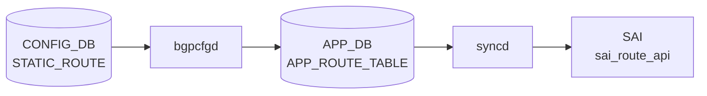

# FLOW_COUNTER_ROUTE_PATTERN (RouteOrch / FlowCounterRouteOrch)

## 概要

`orchagent` 内の `RouteOrch` は [APPL_DB](../../reference/glossary.md#term-appl_db) の `ROUTE_TABLE` を購読して [SAI](../../reference/glossary.md#term-sai) route エントリを管理するが、**[CONFIG_DB](../../reference/glossary.md#term-config_db) を直接購読しない**。

[CONFIG_DB](../../reference/glossary.md#term-config_db) を購読するのは同じ [orchagent](../../reference/glossary.md#term-orchagent) プロセス内の `FlowCounterRouteOrch` であり、[CONFIG_DB](../../reference/glossary.md#term-config_db) `FLOW_COUNTER_ROUTE_PATTERN` テーブルからルートフローカウンターのパターンを受け取る[^1]。

!!! info "関連ページ"
    - APPL_DB の `ROUTE_TABLE` フィールドと fpmsyncd 書き込み動作: [`ROUTE_TABLE (APPL_DB)`](route.md)
    - RouteSync のハンドラ分岐詳細: [`ROUTE_TABLE handler 分岐`](route-handler.md)
    - 静的経路の CONFIG_DB 設定: [`STATIC_ROUTE`](static-route.md)

<!-- cdb-mermaid -->
### データフロー (自動生成)



!!! note "凡例"
    CONFIG_DB から SAI までの典型経路を `docs/reference/config-db-orch-map.md` から機械生成したミニ図。詳細・例外は本ページ本文と対応表を参照。
<!-- /cdb-mermaid -->

## key 構造

```text
FLOW_COUNTER_ROUTE_PATTERN:<prefix>
FLOW_COUNTER_ROUTE_PATTERN:<vrf_name>|<prefix>
```

- `<prefix>` は IPv4 / IPv6 プレフィックス（例: `10.0.0.0/8`、`2001:db8::/32`）。
- `<vrf_name>` は [VRF](../../reference/glossary.md#term-vrf) 名（例: `Vrf-RED`）または [VNET](../../reference/glossary.md#term-vnet) 名。セパレータは `|`。
- デフォルト [VRF](../../reference/glossary.md#term-vrf) の場合は `<vrf_name>` を省略し `<prefix>` のみ記述する。
- `<prefix>` がデフォルトルート（`0.0.0.0/0` / `::/0`）の場合は **完全一致** パターンとして扱われる[^2]。
- 重複・包含関係にあるパターンは登録時にエラーとなる（`validateRoutePattern()`）[^1]。

## 主要フィールド

| フィールド | 型 | コード由来デフォルト | 説明 |
|-----------|----|-------|------|
| `max_match_count` | uint | `30` | このパターンに一致する経路へ付与するフローカウンターの最大数。`0` を設定すると無効値として `30` にフォールバックする |

<!-- defaults -->
## コード由来デフォルト詳細

### `max_match_count` — デフォルト `30`、0 フォールバックあり

`FlowCounterRouteOrch::doTask()` の SET ハンドラ[^1]:

```cpp
// flowcounterrouteorch.cpp
#define ROUTE_PATTERN_DEFAULT_MAX_MATCH_COUNT       30

size_t maxMatchCount = ROUTE_PATTERN_DEFAULT_MAX_MATCH_COUNT;
for (auto valuePair : data)
{
    const auto &field = fvField(valuePair);
    const auto &value = fvValue(valuePair);
    if (field == ROUTE_PATTERN_MAX_MATCH_COUNT_FIELD)
    {
        maxMatchCount = (size_t)std::stoul(value);
        if (maxMatchCount == 0)
        {
            SWSS_LOG_WARN("Max match count for route pattern cannot be 0, set it to default value 30");
            maxMatchCount = ROUTE_PATTERN_DEFAULT_MAX_MATCH_COUNT;
        }
    }
}
```

- `max_match_count` フィールドが存在しない場合: `30` が使用される。
- `max_match_count = 0` が設定された場合: 警告ログを出力して `30` にフォールバックする。
- Python 側でも `DEFAULT_MAX_MATCH = 30` として同値が定義されており、CLI 表示のデフォルト値と一致する[^3]。

`max_match_count` を更新すると `onRoutePatternMaxMatchCountChange()` が呼ばれ、既存バインド済みカウンターの増減が即時反映される[^1]:

- 新しい上限 > 旧上限: 上限まで新規バインドを追加する。
- 新しい上限 < 旧上限: 超過分のカウンターを即時アンバインドして解放する。

### FlexCounter ポーリングインターバル — 固定 `10000ms`

`FlowCounterRouteOrch` の [FlexCounter](../../reference/glossary.md#term-flexcounter) グループは `10000ms`（10 秒）ポーリング間隔でハードコードされており、CONFIG_DB から変更できない[^1]:

```cpp
// flowcounterrouteorch.cpp
#define ROUTE_FLOW_COUNTER_POLLING_INTERVAL_MS      10000
```

### プラットフォームサポート確認

`FlowCounterRouteOrch` は初期化時に `FlowCounterHandler::queryRouteFlowCounterCapability()` を呼び出してプラットフォームのサポート状況を確認する。サポートしない場合は CONFIG_DB のパターン変更を無視する[^1]:

```cpp
void FlowCounterRouteOrch::doTask(Consumer &consumer)
{
    if (!gRouteOrch || !mRouteFlowCounterSupported)
    {
        return;
    }
    ...
}
```

サポート状態は [STATE_DB](../../reference/glossary.md#term-state_db) `FLOW_COUNTER_CAPABILITY_TABLE|route` の `support` フィールドに `"true"` / `"false"` として書き込まれる。

### パターンマッチングロジック

`RoutePattern::is_match()` による一致判定[^2]:

```cpp
bool is_match(sai_object_id_t vrf, IpPrefix prefix) const
{
    if (vrf_id != vrf) return false;

    if (!exact_match)
    {
        // prefix がパターンのサブネット内にあれば一致
        return (ip_prefix.getMaskLength() <= prefix.getMaskLength()
                && ip_prefix.isAddressInSubnet(prefix.getIp()));
    }
    else
    {
        // デフォルトルートパターンは完全一致のみ
        return prefix == ip_prefix;
    }
}
```

- 通常パターン（非デフォルトルート）: パターンのプレフィックス長 ≤ 経路のプレフィックス長 かつ IP がサブネット内に収まれば一致。
- デフォルトルートパターン（`0.0.0.0/0` / `::/0`）: 完全一致のみ（`exact_match = true`）。
<!-- /defaults -->

## 制約

- 重複・包含関係にあるパターンは登録不可（`validateRoutePattern()` でエラー）。
- `max_match_count = 0` は無効値。
- ルートフローカウンターがサポートされないプラットフォームでは、パターン登録は受け付けられるが実際のバインドは行われない。
- パターン削除時は対応する [SAI](../../reference/glossary.md#term-sai) counter が即時アンバインドされ、[COUNTERS_DB](../../reference/glossary.md#term-counters_db) からも削除される。

## 購読者 / 生成者

- **生成者**: `sonic-utilities` の `config flow_counters route add/del` コマンド[^3]
- **購読者**: `orchagent` の `FlowCounterRouteOrch`（`doTask(Consumer &consumer)`）[^1]

## 関連 CONFIG_DB / YANG / CLI

- 関連 CONFIG_DB: `STATIC_ROUTE`（静的経路の設定元）、`VRF`
- 関連 [APPL_DB](../../reference/glossary.md#term-appl_db): `ROUTE_TABLE`（RouteOrch が購読する経路テーブル）
- 関連 CLI: `config flow_counters route`、`show flow_counters route`
- 関連 [YANG](../../reference/glossary.md#term-yang): 未定義（スキーマの正本は `flowcounterrouteorch.cpp` / `flow_counter_util/route.py`）

<!-- ordering -->
## 処理順序 — `FlowCounterRouteOrch` の初期化・タスク処理の順序制約

### orchagent 起動時の初期化順序

`orchdaemon.cpp` の `OrchDaemon::init()` において、`FlowCounterRouteOrch` は `RouteOrch` より**先に**生成される[^4]:

```
orchdaemon.cpp:253  gFlowCounterRouteOrch = new FlowCounterRouteOrch(...)
orchdaemon.cpp:337  gRouteOrch = new RouteOrch(...)   ← 後から生成
```

一方、`m_orchList`（Select ループで処理される順序リスト）では `gFlowCounterRouteOrch` が `gRouteOrch` より前に配置される[^4]:

```
m_orchList = { gSwitchOrch, gCrmOrch, gPortsOrch, gBufferOrch,
               gFlowCounterRouteOrch, gIntfsOrch, ..., gRouteOrch, ... }
```

コンストラクタ内では `initRouteFlowCounterCapability()` を即時呼び出し、プラットフォームサポート確認と [STATE_DB](../../reference/glossary.md#term-state_db) 書き込みを完了させる。サポートあり場合のみ `FLEX_COUNTER_UPD_TIMER`（1 秒周期）を登録する。

### CONFIG_DB 変更のキー処理順序

`doTask(Consumer &consumer)` は `m_toSync`（`std::map<string, ...>`）を **`begin()` から `end()` まで順番に**イテレートする[^1]。`std::map` は辞書順ソート済みであるため、同一 flush バッチ内の複数パターン変更は **キー文字列の辞書順** で処理される。

orchdaemon.cpp のコメント（行 494–498）は複数テーブルを持つ Orch に言及しているが、`FlowCounterRouteOrch` が購読するテーブルは `FLOW_COUNTER_ROUTE_PATTERN` の 1 テーブルのみであるため、テーブル間ソートの影響は受けない[^4]。

### RoutePattern 内部ソート

`mRoutePatternSet`（`std::set<RoutePattern>`）は `RoutePattern::operator<` によりソート済みを維持する[^2]:

```
比較キー: (vrf_name 辞書順, ip_prefix 順)
```

デフォルト [VRF](../../reference/glossary.md#term-vrf) は `vrf_name = ""` となるため、辞書順で最小（先頭）に配置される。

### バインド処理の遅延キューと再試行順序

`bindFlowCounter()` 呼び出し時に [ASIC_DB](../../reference/glossary.md#term-asic_db) `VIDTORID` への VID 登録が未完了だった場合、エントリは `mPendingAddToFlexCntr`（`RouterFlowCounterCache` 型、`std::map`）へキューイングされる。`doTask(SelectableTimer &timer)` が 1 秒ごとに全 pending エントリをスキャンし、VID 解決済みのものから順次 FlexDB へ登録する[^1]。

pending キューが空になると `mFlexCounterUpdTimer->stop()` でタイマーを停止する。

### doTask の前提ガード（処理を打ち切る条件）

| 条件 | 打ち切り範囲 |
|------|-------------|
| `gRouteOrch == nullptr` | doTask 全体を即時 return |
| `mRouteFlowCounterSupported == false` | doTask 全体を即時 return |
| `isRouteFlowCounterEnabled() == false` | counter バインドのみスキップ（パターン登録は保持） |
| `ASIC_DB:VIDTORID` に VID 未登録 | バインド保留 → pending キューへ |

<!-- /ordering -->

<!-- cross-refs -->
## 暗黙参照 — `FlowCounterRouteOrch` が依存する関連テーブル

`FLOW_COUNTER_ROUTE_PATTERN` は [YANG](../../reference/glossary.md#term-yang) 定義を持たない（[YANG](../../reference/glossary.md#term-yang) 未カバー）ため leafref による明示参照はゼロ件。
代わりに `flowcounterrouteorch.cpp` の全 997 行から抽出した **8 系統の暗黙依存** が実装レベルの cross-table 参照となる。

### 主要テーブル / Orch 参照

| 参照先 (テーブル / Orch) | フィールド / 条件 | 参照方向 | evidence |
|---|---|---|---|
| `RouteOrch` / `ROUTE_TABLE` ([APPL_DB](../../reference/glossary.md#term-appl_db)) | 常時（パターンマッチング走査） | 読み取り（シンク済みルート一覧） | `flowcounterrouteorch.cpp:634` `gRouteOrch->getSyncdRoutes()` |
| `VRFOrch` / `VRF` (CONFIG_DB) | key の `<vrf_name>` が非デフォルト VRF のとき | OID → 名前変換 | `flowcounterrouteorch.cpp:410-411` `getVRFname(vrf_id)` |
| `VNetOrch` / [VNET](../../reference/glossary.md#term-vnet) ルートキャッシュ | key の `<vrf_name>` が [VNET](../../reference/glossary.md#term-vnet) 名のとき | 読み取り（VNET ルートマップ走査） | `flowcounterrouteorch.cpp:696-743` `getRouteMap()` |
| `FlexCounterOrch` / `FLEX_COUNTER_TABLE` (CONFIG_DB) | 常時（カウンター有効化フラグ確認） | 状態読み取り | `flowcounterrouteorch.cpp:947-948` `getRouteFlowCountersState()` |
| `ASIC_DB:VIDTORID` | バインド試行時（VID 存在確認） | 読み取り（RID 解決） | `flowcounterrouteorch.cpp:116` `mVidToRidTable->hget()` |
| `COUNTERS_DB:COUNTERS_ROUTE_NAME_MAP` | バインド成功後 | 書き込み（prefix → counter OID） | `flowcounterrouteorch.cpp:33, 126, 152, 921` |
| `COUNTERS_DB:COUNTERS_ROUTE_TO_PATTERN_MAP` | バインド成功後 | 書き込み（prefix → パターン逆引き） | `flowcounterrouteorch.cpp:34, 129, 155, 920` |
| `STATE_DB:FLOW_COUNTER_CAPABILITY_TABLE\|route` | [orchagent](../../reference/glossary.md#term-orchagent) 起動時（一度のみ） | 書き込み（`support = true/false`） | `flowcounterrouteorch.cpp:174-178` |

### 初期化ガード順序

1. `gRouteOrch` が null → CONFIG_DB パターン処理全体が即時 return（`flowcounterrouteorch.cpp:57-60`）。
2. `mRouteFlowCounterSupported = false`（プラットフォーム非対応）→ 同様に全処理スキップ。
3. `isRouteFlowCounterEnabled() = false`（`FLEX_COUNTER_TABLE|FLOW_CNT_ROUTE` が無効）→ counter バインド処理のみスキップ（パターン登録は保持）。
4. `ASIC_DB:VIDTORID` に VID が未登録 → `mPendingAddToFlexCntr` にキューイング、`FLEX_COUNTER_UPD_TIMER`（1 秒周期）で再試行。

### 範囲外

- `ROUTE_TABLE (STATE_DB)` — デフォルトルート到達性の side-effect 書き込み先であり、FlowCounterRouteOrch は参照しない。
- `NEIGH_TABLE` / `INTF_TABLE` — RouteOrch が参照するが FlowCounterRouteOrch は直接参照しない。

<!-- /cross-refs -->

<!-- failure -->
## 失敗挙動

### 設計上の特徴: task_failed / task_need_retry を使わない

`FlowCounterRouteOrch::doTask()` は Orch フレームワーク標準の `task_failed` / `task_need_retry` を**一切使用しない**。
`m_toSync` のイテレート末尾で常に `consumer.m_toSync.erase(it++)` を実行し、
成功・失敗にかかわらずエントリをキューから除去する[^1]:

```cpp
// flowcounterrouteorch.cpp (doTask 末尾)
consumer.m_toSync.erase(it++);
```

失敗は `syslog`（`SWSS_LOG_ERROR` / `SWSS_LOG_WARN`）に記録されるのみ。
CONFIG_DB エントリは失敗後も残り続ける。`STATE_DB` / `ERROR_TABLE` への失敗フィードバックはない。

### 失敗パス一覧

| # | トリガー | 発生箇所 | 結果 | retry |
|---|---------|---------|------|-------|
| 1 | `gRouteOrch = null` またはプラットフォーム非対応 | `doTask()` ガード | 全エントリを無視（ログなし） | なし |
| 2 | パターン重複・包含関係 | `validateRoutePattern()` | ERROR ログ。パターン登録拒否 | なし |
| 3 | VRF/VNET 名が未解決 | `parseRouteKeyForRoutePattern()` | NOTICE ログ。`vrf_id = SAI_NULL_OBJECT_ID` で登録継続（デフォルト VRF と混同リスク） | なし |
| 4 | [SAI](../../reference/glossary.md#term-sai) generic counter 作成失敗 | `bindFlowCounter()` | ERROR ログ。当該ルートへのバインドをスキップ | なし |
| 5 | SAI `set_route_entry_attribute` 失敗（bind） | `bindFlowCounter()` | WARN ログ。作成済み counter を即クリーンアップ | なし |
| 6 | SAI `set_route_entry_attribute` 失敗（unbind） | `unbindFlowCounter()` | WARN ログ。`removeGenericCounter` は実行。SAI 側と不整合のリスク | なし |
| 7 | DEL 対象パターンが未登録 | `removeRoutePattern()` | ERROR ログ。no-op | なし |
| 8 | `max_match_count = 0` | `doTask()` SET ハンドラ | WARN ログ。`30` にフォールバックして続行 | — |

### パターン重複時の挙動詳細

`addRoutePattern()` → `validateRoutePattern()` が既存パターンとの IP 範囲重複を検出した場合[^1]:

```cpp
// flowcounterrouteorch.cpp:582-583
SWSS_LOG_ERROR("Configured route pattern %s is conflict with existing one %s", ...);
return false;
```

`mRoutePatternSet` からイテレータを削除して即 return。CONFIG_DB エントリは残存する。
recovery: 競合する既存パターンを DEL してから再登録する。

### SAI counter unbind 失敗時のリスク

`unbindFlowCounter()` では SAI が失敗しても `FlowCounterHandler::removeGenericCounter(counter_oid)` は**必ず実行**される[^1]。
SAI 側に counter が残ったまま [orchagent](../../reference/glossary.md#term-orchagent) 内部状態は解放済みとなり、SAI と orchagent の間で不整合が生じる可能性がある。

### STATE_DB / syslog 確認方法

COPP などと異なり `STATE_DB` への失敗記録はない。障害確認は syslog のみ:

```bash
journalctl -u swss | grep -i "flow counter\|route pattern"
# または
sudo tail -f /var/log/syslog | grep -i flowcounter
```

<!-- /failure -->

<!-- constants -->
## ハードコード定数

`FlowCounterRouteOrch` および `RouteOrch` には CONFIG_DB から変更できないハードコード定数が複数存在する。

### flowcounterrouteorch.cpp / .h の定数

| 定数名 | 値 | 意味 | CONFIG_DB 変更可否 |
|--------|----|------|--------------------|
| `ROUTE_PATTERN_DEFAULT_MAX_MATCH_COUNT` | `30` | パターン 1 件あたりのフローカウンター最大付与数のデフォルト。`max_match_count` フィールドで上書き可能だが、`0` 設定時のフォールバック値としても使用される | × (フォールバック値としてハードコード) |
| `ROUTE_FLOW_COUNTER_POLLING_INTERVAL_MS` | `10000`（ms） | [FlexCounter](../../reference/glossary.md#term-flexcounter) グループのポーリング間隔（10 秒）。`FlowCounterRouteOrch` コンストラクタで直接渡され、CONFIG_DB による変更手段はない | × |
| `FLEX_COUNTER_UPD_INTERVAL` | `1`（秒） | バインド保留キュー（`mPendingAddToFlexCntr`）を再試行する `SelectableTimer` の周期。VID 解決待ちエントリを 1 秒ごとにスキャンする | × |
| `ROUTE_FLOW_COUNTER_FLEX_COUNTER_GROUP` | `"ROUTE_FLOW_COUNTER"` | [FlexCounter](../../reference/glossary.md#term-flexcounter) グループ ID 文字列。FLEX_COUNTER_TABLE のキープレフィックスとして使用される | × |
| `FLOW_COUNTER_ROUTE_KEY` | `"route"` | `FLOW_COUNTER_CAPABILITY_TABLE` のエントリキー | × |
| `FLOW_COUNTER_SUPPORT_FIELD` | `"support"` | [STATE_DB](../../reference/glossary.md#term-state_db) 書き込み時のフィールド名 | × |

```cpp
// orchagent/flex_counter/flowcounterrouteorch.cpp (L21-26)
#define FLEX_COUNTER_UPD_INTERVAL                   1
#define FLOW_COUNTER_ROUTE_KEY                      "route"
#define FLOW_COUNTER_SUPPORT_FIELD                  "support"
#define ROUTE_PATTERN_MAX_MATCH_COUNT_FIELD         "max_match_count"
#define ROUTE_PATTERN_DEFAULT_MAX_MATCH_COUNT       30
#define ROUTE_FLOW_COUNTER_POLLING_INTERVAL_MS      10000

// orchagent/flex_counter/flowcounterrouteorch.h (L13)
#define ROUTE_FLOW_COUNTER_FLEX_COUNTER_GROUP "ROUTE_FLOW_COUNTER"
```

### routeorch.cpp / .h の定数

`RouteOrch` 本体（CONFIG_DB を直接購読しない）にも SAI 初期値として使われるハードコード定数がある。

| 定数名 | 値 | 意味 | 備考 |
|--------|----|------|------|
| `DEFAULT_NUMBER_OF_ECMP_GROUPS` | `128` | SAI が [ECMP](../../reference/glossary.md#term-ecmp) グループ数上限を返さなかった場合のデフォルト上限 | SAI capability で上書きされる場合あり |
| `DEFAULT_MAX_ECMP_GROUP_SIZE` | `32` | [ECMP](../../reference/glossary.md#term-ecmp) グループあたりの最大ネクストホップ数デフォルト | 同上 |
| `NHGRP_MAX_SIZE` | `128` | ネクストホップグループサイズの上限（`routeorch.h`） | × |
| `EUI64_INTF_ID_LEN` | `8` | EUI-64 インターフェース ID バイト長 | × |

```cpp
// orchagent/routeorch.cpp (L37-38)
#define DEFAULT_NUMBER_OF_ECMP_GROUPS   128
#define DEFAULT_MAX_ECMP_GROUP_SIZE     32

// orchagent/routeorch.h (L24-28)
#define NHGRP_MAX_SIZE 128
#define EUI64_INTF_ID_LEN 8
```

### まとめ

- `max_match_count` フィールド（CONFIG_DB）を省略または `0` にした場合のみ `30` が適用される。フィールドに正の整数を設定すれば `ROUTE_PATTERN_DEFAULT_MAX_MATCH_COUNT` は使われない。
- `ROUTE_FLOW_COUNTER_POLLING_INTERVAL_MS`（10 秒）と `FLEX_COUNTER_UPD_INTERVAL`（1 秒）は変更手段が存在しない。ポーリング遅延が問題になる環境ではソース修正が必要。
- `DEFAULT_NUMBER_OF_ECMP_GROUPS` / `DEFAULT_MAX_ECMP_GROUP_SIZE` は SAI `sai_switch_api->get_switch_attribute` の応答で上書きされるため、プラットフォームによっては実効値が異なる。

<!-- /constants -->

<!-- side-effects -->
## 副作用テーブル書き込み

`FlowCounterRouteOrch` が `FLOW_COUNTER_ROUTE_PATTERN` への SET / DEL を処理するとき、CONFIG_DB 以外の複数のテーブルへ副作用として書き込む。以下はその一覧である。

### 書き込み先テーブル一覧

| # | DB | テーブル / キー | トリガー | 書き込み内容 | evidence |
|---|----|----|---------|------------|---------|
| 1 | STATE_DB | `FLOW_COUNTER_CAPABILITY_TABLE\|route` | orchagent **起動時に 1 回** | `support = "true"` / `"false"` — プラットフォームの route flow counter サポート状況 | `flowcounterrouteorch.cpp:174-178` |
| 2 | [COUNTERS_DB](../../reference/glossary.md#term-counters_db) | `COUNTERS_ROUTE_NAME_MAP` | バインド成功時（`doTask(SelectableTimer)` 内） | `<vrf:prefix>` → `<counter_oid>` のマッピングをハッシュに追記 | `flowcounterrouteorch.cpp:152` |
| 3 | [COUNTERS_DB](../../reference/glossary.md#term-counters_db) | `COUNTERS_ROUTE_TO_PATTERN_MAP` | バインド成功時（`doTask(SelectableTimer)` 内） | `<vrf:prefix>` → `<pattern_prefix>` の逆引きマッピングをハッシュに追記 | `flowcounterrouteorch.cpp:157` |
| 4 | COUNTERS_DB | `COUNTERS_ROUTE_NAME_MAP` | アンバインド時（`removeRouteFlowCounterFromDB()`） | 対象プレフィックスエントリを `hdel` で削除 | `flowcounterrouteorch.cpp:921-922` |
| 5 | COUNTERS_DB | `COUNTERS_ROUTE_TO_PATTERN_MAP` | アンバインド時（同上） | 対象プレフィックスエントリを `hdel` で削除 | `flowcounterrouteorch.cpp:920` |
| 6 | [FLEX_COUNTER_DB](../../reference/glossary.md#term-flex_counter_db) | `FLEX_COUNTER_TABLE\|ROUTE_FLOW_COUNTER\|<counter_oid>` | バインド成功時（`FlexCounterManager::setCounterIdList()`） | カウンター OID に対するポーリング対象 stat ID リストを登録 | `flex_counter_manager.cpp:225` |
| 7 | [FLEX_COUNTER_DB](../../reference/glossary.md#term-flex_counter_db) | `FLEX_COUNTER_TABLE\|ROUTE_FLOW_COUNTER\|<counter_oid>` | アンバインド時（`FlexCounterManager::clearCounterIdList()`） | 対象 OID のポーリングエントリを削除 | `flex_counter_manager.cpp:235-260` |

### 書き込みタイミングの詳細

**STATE_DB 書き込み（テーブル #1）**: `initRouteFlowCounterCapability()` は `FlowCounterRouteOrch` **コンストラクタ**から呼ばれる。orchagent プロセス起動時に 1 度だけ実行される。プラットフォームが非対応の場合も `"false"` として必ず書き込まれる[^1]:

```cpp
// flowcounterrouteorch.cpp:174-178
swss::DBConnector state_db("STATE_DB", 0);
swss::Table capability_table(&state_db, STATE_FLOW_COUNTER_CAPABILITY_TABLE_NAME);
std::vector<FieldValueTuple> fvs;
fvs.emplace_back(FLOW_COUNTER_SUPPORT_FIELD, mRouteFlowCounterSupported ? "true" : "false");
capability_table.set(FLOW_COUNTER_ROUTE_KEY, fvs);
```

**COUNTERS_DB 書き込み（テーブル #2, #3）**: `doTask(SelectableTimer &timer)` の 1 秒周期タイマーコールバックで、`mPendingAddToFlexCntr` キューから VID 解決済みのエントリをバッチ処理し、`mPrefixToCounterTable->set("", prefixToCounterMap)` および `mPrefixToPatternTable->set("", prefixToPatternMap)` でまとめて書き込む[^1]。タイマーは pending キューが空になると `stop()` される。

**[FLEX_COUNTER_DB](../../reference/glossary.md#term-flex_counter_db) 書き込み（テーブル #6, #7）**: `FlexCounterManager` 経由で `FLEX_COUNTER_DB` に書き込む。`show flow_counters route` が参照する実カウンター値は [syncd](../../reference/glossary.md#term-syncd) が FLEX_COUNTER_DB の登録エントリをもとに [ASIC](../../reference/glossary.md#term-asic) から読み取り COUNTERS_DB に書き込む。

### 副作用の読み取り側

| DB | テーブル | 読み取り側 | 用途 |
|----|---------|-----------|------|
| STATE_DB | `FLOW_COUNTER_CAPABILITY_TABLE\|route` | `acl-loader`, `sonic-mgmt-common (translib)`, CLI `show flow_counters route` | プラットフォームのサポート状況確認 |
| COUNTERS_DB | `COUNTERS_ROUTE_NAME_MAP` | `show flow_counters route`（[sonic-utilities](../../reference/glossary.md#term-sonic-utilities)） | prefix → counter OID 解決 |
| COUNTERS_DB | `COUNTERS_ROUTE_TO_PATTERN_MAP` | `show flow_counters route`（[sonic-utilities](../../reference/glossary.md#term-sonic-utilities)） | counter → パターン逆引き表示 |
| FLEX_COUNTER_DB | `FLEX_COUNTER_TABLE\|ROUTE_FLOW_COUNTER\|*` | `syncd` | 実 [ASIC](../../reference/glossary.md#term-asic) カウンター値のポーリング対象登録 |

<!-- evidence:
source: sonic-net/sonic-swss/orchagent/flex_counter/flowcounterrouteorch.cpp#L31-34 (sha: 4305596156d70e9797e8a881b3d19b46de0bce0d)
excerpt: |
  mCounterDb(std::shared_ptr<DBConnector>(new DBConnector("COUNTERS_DB", 0))),
  mPrefixToCounterTable(std::unique_ptr<Table>(new Table(mCounterDb.get(), COUNTERS_ROUTE_NAME_MAP))),
  mPrefixToPatternTable(std::unique_ptr<Table>(new Table(mCounterDb.get(), COUNTERS_ROUTE_TO_PATTERN_MAP))),
reasoning: COUNTERS_DB への書き込みは mPrefixToCounterTable / mPrefixToPatternTable を通じて行われる。
-->

<!-- evidence-rendered:start -->
??? note "📋 検証エビデンス: sonic-net/sonic-swss/orchagent/flex_counter/flowcounterrouteorch.cpp#L31-34 (sha: 4305596156d70e9797e8a881b3d19b46de0bce0d)"

    **出典**:

    `sonic-net/sonic-swss/orchagent/flex_counter/flowcounterrouteorch.cpp#L31-34 (sha: 4305596156d70e9797e8a881b3d19b46de0bce0d)`

    **抜粋**:

    ```text
    mCounterDb(std::shared_ptr<DBConnector>(new DBConnector("COUNTERS_DB", 0))),
    mPrefixToCounterTable(std::unique_ptr<Table>(new Table(mCounterDb.get(), COUNTERS_ROUTE_NAME_MAP))),
    mPrefixToPatternTable(std::unique_ptr<Table>(new Table(mCounterDb.get(), COUNTERS_ROUTE_TO_PATTERN_MAP))),
    ```

    **判断根拠**: COUNTERS_DB への書き込みは mPrefixToCounterTable / mPrefixToPatternTable を通じて行われる。

<!-- evidence-rendered:end -->

<!-- evidence:
source: sonic-net/sonic-swss/orchagent/flex_counter/flowcounterrouteorch.cpp#L174-178 (sha: 4305596156d70e9797e8a881b3d19b46de0bce0d)
excerpt: |
  swss::DBConnector state_db("STATE_DB", 0);
  swss::Table capability_table(&state_db, STATE_FLOW_COUNTER_CAPABILITY_TABLE_NAME);
  fvs.emplace_back(FLOW_COUNTER_SUPPORT_FIELD, mRouteFlowCounterSupported ? "true" : "false");
  capability_table.set(FLOW_COUNTER_ROUTE_KEY, fvs);
reasoning: STATE_DB FLOW_COUNTER_CAPABILITY_TABLE|route への起動時 1 回書き込みを確認。
-->

<!-- evidence-rendered:start -->
??? note "📋 検証エビデンス: sonic-net/sonic-swss/orchagent/flex_counter/flowcounterrouteorch.cpp#L174-178 (sha: 4305596156d70e9797e8a881b3d19b46de0bce0d)"

    **出典**:

    `sonic-net/sonic-swss/orchagent/flex_counter/flowcounterrouteorch.cpp#L174-178 (sha: 4305596156d70e9797e8a881b3d19b46de0bce0d)`

    **抜粋**:

    ```text
    swss::DBConnector state_db("STATE_DB", 0);
    swss::Table capability_table(&state_db, STATE_FLOW_COUNTER_CAPABILITY_TABLE_NAME);
    fvs.emplace_back(FLOW_COUNTER_SUPPORT_FIELD, mRouteFlowCounterSupported ? "true" : "false");
    capability_table.set(FLOW_COUNTER_ROUTE_KEY, fvs);
    ```

    **判断根拠**: STATE_DB FLOW_COUNTER_CAPABILITY_TABLE|route への起動時 1 回書き込みを確認。

<!-- evidence-rendered:end -->

<!-- /side-effects -->

<!-- pubsub -->
## 通信メカニズム

### Producer/Consumer ペア

`FLOW_COUNTER_ROUTE_PATTERN` テーブルは CONFIG_DB → SAI の **直接経路**をとる。APPL_DB への中継は行わない。

| 区間 | 方式 | チャンネル / パターン |
|------|------|----------------------|
| CONFIG_DB → FlowCounterRouteOrch | `SubscriberStateTable` | `__keyspace@4__:FLOW_COUNTER_ROUTE_PATTERN\|*` |
| FlowCounterRouteOrch → SAI | SAI API 直接呼び出し | `sai_generic_counter_api` (FlowCounterHandler) |
| CONFIG_DB 書き込み側 | `sonic-utilities` CLI | `config flow_counters route add/del` |

### SubscriberStateTable の動作

`FlowCounterRouteOrch` は `Orch(db, tableNames)` 基底クラスのコンストラクタ経由で `addConsumer()` を呼び出し、CONFIG_DB の `FLOW_COUNTER_ROUTE_PATTERN` テーブルに対して `SubscriberStateTable` を生成する (`orch.cpp:1188-1190`)[^4]。

CONFIG_DB（DB ID = 4）の keyspace notification (`PSUBSCRIBE __keyspace@4__:FLOW_COUNTER_ROUTE_PATTERN|*`) でエントリ変化を検出し、`pops()` で現在値を読み出す。`doTask(Consumer &consumer)` が通知ごとに呼ばれ、SET / DEL を処理する。

### select() ループと doTask 実行順序

`orchdaemon` の主ループは `Select::select()` を `SELECT_TIMEOUT = 1000 ms` タイムアウトで実行する (`orchdaemon.cpp:23, 959`)[^4]。イベント受信時は `Consumer::drain()` → `FlowCounterRouteOrch::doTask(Consumer&)` が呼ばれる。

`doTask(Consumer&)` の冒頭では `!gRouteOrch || !mRouteFlowCounterSupported` チェックがあり、`RouteOrch` が未初期化またはプラットフォーム非対応の場合はパターン変更を**無視**する[^1]:

```cpp
// flowcounterrouteorch.cpp:58-61
if (!gRouteOrch || !mRouteFlowCounterSupported)
{
    return;
}
```

### タイマーコールバック (SelectableTimer)

バインド成功した counter OID の FlexCounter DB 登録は、`doTask(Consumer&)` から即時ではなく `mPendingAddToFlexCntr` キューに積まれ、`FLEX_COUNTER_UPD_INTERVAL = 1 秒`周期の `SelectableTimer` コールバック (`doTask(SelectableTimer&)`) でバッチ処理される[^1]:

```cpp
// flowcounterrouteorch.cpp:21, 44
#define FLEX_COUNTER_UPD_INTERVAL   1          // 秒
auto intervT = timespec { .tv_sec = FLEX_COUNTER_UPD_INTERVAL, .tv_nsec = 0 };
mFlexCounterUpdTimer = new SelectableTimer(intervT);
```

pending キューが空になるとタイマーは `stop()` され、次の追加が発生したとき再起動する。

### retry メカニズム

`FLOW_COUNTER_ROUTE_PATTERN` の SET / DEL に明示的な retry は存在しない。エントリは `m_toSync` から即時 `erase()` されるため、`addRoutePattern()` / `removeRoutePattern()` が内部で失敗してもキューに残留しない。counter 生成失敗時は `bindFlowCounter()` が `false` を返し、そのパターンの枠だけスキップされる[^1]。

### データフロー図

```
sonic-utilities[config flow_counters route add <prefix>]
  ↓ SonicDBConfig.get_table() → hset FLOW_COUNTER_ROUTE_PATTERN|<prefix>
  ↓
CONFIG_DB[FLOW_COUNTER_ROUTE_PATTERN|<prefix>]
  ↓ SubscriberStateTable (keyspace notification)
  ↓ PSUBSCRIBE __keyspace@4__:FLOW_COUNTER_ROUTE_PATTERN|*
orchdaemon select() loop (SELECT_TIMEOUT=1000ms)
  ↓ Consumer::drain() → FlowCounterRouteOrch::doTask(Consumer&)
  ↓   [gRouteOrch && mRouteFlowCounterSupported チェック]
  ↓ addRoutePattern(key, maxMatchCount)
  ↓   bindFlowCounter() → FlowCounterHandler::createGenericCounter()
  ↓     pendingUpdateFlexDb() → mPendingAddToFlexCntr キュー
  ↓
SelectableTimer (1秒周期) → doTask(SelectableTimer&)
  ↓ ASIC_DB VIDTORID 解決
  ↓ mRouteFlowCounterMgr.setCounterIdList()
    ↓ FLEX_COUNTER_DB 書き込み
      ↓ syncd が ASIC からカウンター値を読み COUNTERS_DB に書き込む

APPL_DB 書き込み: なし
NotificationConsumer: なし
```

<!-- /pubsub -->

<!-- platform -->
## プラットフォーム差

`FLOW_COUNTER_ROUTE_PATTERN` テーブルへの応答動作はプラットフォームによって大きく異なる。差の起点は `FlowCounterRouteOrch::initRouteFlowCounterCapability()` が orchagent 起動時に実行する **SAI 動的照会** の成否である。

### プラットフォームサポートの判定メカニズム

```cpp
// flow_counter_handler.cpp:51-62
bool FlowCounterHandler::queryRouteFlowCounterCapability()
{
    sai_attr_capability_t capability;
    sai_status_t status = sai_query_attribute_capability(
        gSwitchId,
        SAI_OBJECT_TYPE_ROUTE_ENTRY,
        SAI_ROUTE_ENTRY_ATTR_COUNTER_ID,
        &capability);
    if (status != SAI_STATUS_SUCCESS)
    {
        SWSS_LOG_WARN("Could not query route entry attribute SAI_ROUTE_ENTRY_ATTR_COUNTER_ID %d", status);
        return false;
    }
    return capability.set_implemented;
}
```

**aclorch.cpp とは異なり**、`platform` / `sub_platform` 環境変数の文字列比較は一切使用しない。判定は純粋に SAI の `sai_query_attribute_capability()` が `SAI_ROUTE_ENTRY_ATTR_COUNTER_ID` に対して `set_implemented = true` を返すかどうかのみで決まる。フォールバック値もなく、照会が失敗した場合は**無条件で非対応**とみなす。

### プラットフォーム別の動作差

| プラットフォーム | `SAI_ROUTE_ENTRY_ATTR_COUNTER_ID` 対応 | `mRouteFlowCounterSupported` | CONFIG_DB パターン処理 | STATE_DB 書込み値 |
|----------------|----------------------------------------|-----------------------------|-----------------------|-------------------|
| broadcom ([ASIC SDK](../../reference/glossary.md#term-asic-sdk) ≥ 6.5 相当) | `set_implemented = true` | `true` | 有効（パターン登録・counter bind）| `"true"` |
| mellanox (MLNX SAI 対応版) | `set_implemented = true` | `true` | 有効 | `"true"` |
| marvell-prestera / teralynx (対応 SDK) | SAI 実装依存 | SAI 戻り値次第 | SAI 次第 | SAI 次第 |
| vs (virtual switch) | `set_implemented = false` または status ≠ SUCCESS | `false` | **全スキップ** | `"false"` |
| 未知 platform / SAI 照会失敗 | status ≠ SUCCESS | `false` | **全スキップ** | `"false"` |

!!! note "VS 環境での注意"
    VS SAI は `SAI_ROUTE_ENTRY_ATTR_COUNTER_ID` の set capability を実装していないため、`mRouteFlowCounterSupported = false` となる。`doTask(Consumer&)` はパターン変更を即時 `return` で無視し、STATE_DB には `support = "false"` が書かれる。`show flow_counters route` の出力は空になる。

### プラットフォームサポートと STATE_DB 書込み

プラットフォームサポートの有無に関わらず、STATE_DB `FLOW_COUNTER_CAPABILITY_TABLE|route` へは**必ず 1 回**書込みが行われる (`flowcounterrouteorch.cpp:174-178`):

```cpp
// flowcounterrouteorch.cpp:174-178
swss::DBConnector state_db("STATE_DB", 0);
swss::Table capability_table(&state_db, STATE_FLOW_COUNTER_CAPABILITY_TABLE_NAME);
fvs.emplace_back(FLOW_COUNTER_SUPPORT_FIELD, mRouteFlowCounterSupported ? "true" : "false");
capability_table.set(FLOW_COUNTER_ROUTE_KEY, fvs);
```

`support = "false"` の場合、`FlowCounterRouteOrch` の全メソッド（`handleRouteAdd`, `handleRouteRemove`, `onAddVR`, `onRemoveVR` 等）が `mRouteFlowCounterSupported` のチェックで即 `return` するため、SAI への counter 操作は**一切行われない**。

### multi-asic / SmartSwitch 環境

- multi-asic 構成では namespace ごとに `FlowCounterRouteOrch` が独立して起動し、各 [ASIC](../../reference/glossary.md#term-asic) SAI の capability をそれぞれ照会する。
- 異種 ASIC が混在する [SmartSwitch](../../reference/glossary.md#term-smartswitch) 環境では namespace 間で `mRouteFlowCounterSupported` の値が異なる場合があり、一部 namespace のみルートフローカウンターが有効になることがある。
- `STATE_DB FLOW_COUNTER_CAPABILITY_TABLE|route` は namespace ごとに独立するため、参照側（CLI / monitoring）は対象 namespace を明示する必要がある。

> **裏取り**: `flow_counter_handler.cpp:51-62` (`queryRouteFlowCounterCapability`) / `flowcounterrouteorch.cpp:166-179` (`initRouteFlowCounterCapability`) / `flowcounterrouteorch.cpp:55-61` (doTask guard) / `flowcounterrouteorch.cpp:305-366` (`onAddMiscRouteEntry`/`onRemoveMiscRouteEntry` guards) / `flowcounterrouteorch.cpp:401-451` (`onAddVR`/`onRemoveVR` guards)。
<!-- /platform -->

<!-- ref-triangle:start -->

## 関連リファレンス

- APPL_DB: [`ROUTE_TABLE`](route.md)
- CONFIG_DB: [`STATIC_ROUTE`](static-route.md)

<!-- ref-triangle:end -->

## 引用元

[^1]: FlowCounterRouteOrch 実装: `orchagent/flex_counter/flowcounterrouteorch.cpp`. <https://github.com/sonic-net/sonic-swss/blob/4305596156d70e9797e8a881b3d19b46de0bce0d/orchagent/flex_counter/flowcounterrouteorch.cpp>
[^2]: RoutePattern 構造体・is_match ロジック: `orchagent/flex_counter/flowcounterrouteorch.h`. <https://github.com/sonic-net/sonic-swss/blob/4305596156d70e9797e8a881b3d19b46de0bce0d/orchagent/flex_counter/flowcounterrouteorch.h>
[^3]: テーブル名・デフォルト値定数: `flow_counter_util/route.py`. <https://github.com/sonic-net/sonic-utilities/blob/master/flow_counter_util/route.py>
[^4]: orchagent 初期化順序・m_orchList: `orchagent/orchdaemon.cpp`. <https://github.com/sonic-net/sonic-swss/blob/4305596156d70e9797e8a881b3d19b46de0bce0d/orchagent/orchdaemon.cpp>

<!-- ops-hint -->
## 運用ヒント

### 確認コマンド

```bash
# 設定済みパターン一覧
sonic-db-cli CONFIG_DB keys 'FLOW_COUNTER_ROUTE_PATTERN:*'

# 特定パターンの詳細
sonic-db-cli CONFIG_DB hgetall 'FLOW_COUNTER_ROUTE_PATTERN:10.0.0.0/8'

# フローカウンター有効化状態の確認
sonic-db-cli STATE_DB hgetall 'FLOW_COUNTER_CAPABILITY_TABLE|route'

# カウンター値の確認
show flow_counters route
```

### 典型エントリ例

```
# デフォルト VRF の /24 以上の経路に対してカウンター付与（最大 30 経路）
FLOW_COUNTER_ROUTE_PATTERN:10.0.0.0/8
  max_match_count: 30

# VRF-RED の IPv6 /64 以上の経路（最大 10 経路）
FLOW_COUNTER_ROUTE_PATTERN:Vrf-RED|2001:db8::/32
  max_match_count: 10
```

### よくある問題

- カウンターが付与されない → `show flow_counters route` の前に `STATE_DB FLOW_COUNTER_CAPABILITY_TABLE|route` の `support` が `"true"` であることを確認する。
- パターン登録でエラー → 既存パターンと IP 範囲が重複または包含関係にないか確認する（`validateRoutePattern()` チェック）。
- `max_match_count` を減らしたのに反映されない → FlexCounter タイマー（1 秒）待機後に COUNTERS_DB を再確認する。
<!-- /ops-hint -->

<!-- glossary-links-injected: de977081e0df -->
