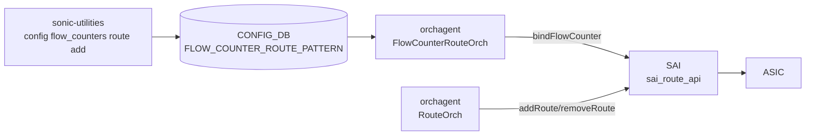

# FLOW_COUNTER_ROUTE_PATTERN (RouteOrch / FlowCounterRouteOrch)

## 概要

`orchagent` 内の `RouteOrch` は [APPL_DB](../../reference/glossary.md#term-appl_db) の `ROUTE_TABLE` を購読して SAI route エントリを管理するが、**CONFIG_DB を直接購読しない**。

CONFIG_DB を購読するのは同じ orchagent プロセス内の `FlowCounterRouteOrch` であり、CONFIG_DB `FLOW_COUNTER_ROUTE_PATTERN` テーブルからルートフローカウンターのパターンを受け取る[^1]。

!!! info "関連ページ"
    - APPL_DB の `ROUTE_TABLE` フィールドと fpmsyncd 書き込み動作: [`ROUTE_TABLE (APPL_DB)`](route.md)
    - RouteSync のハンドラ分岐詳細: [`ROUTE_TABLE handler 分岐`](route-handler.md)
    - 静的経路の CONFIG_DB 設定: [`STATIC_ROUTE`](static-route.md)

<!-- cdb-mermaid -->
### データフロー



!!! note "凡例"
    FlowCounterRouteOrch は RouteOrch が管理する SAI route エントリに flex counter を付与する。
<!-- /cdb-mermaid -->

## key 構造

```text
FLOW_COUNTER_ROUTE_PATTERN:<prefix>
FLOW_COUNTER_ROUTE_PATTERN:<vrf_name>|<prefix>
```

- `<prefix>` は IPv4 / IPv6 プレフィックス（例: `10.0.0.0/8`、`2001:db8::/32`）。
- `<vrf_name>` は VRF 名（例: `Vrf-RED`）または VNET 名。セパレータは `|`。
- デフォルト VRF の場合は `<vrf_name>` を省略し `<prefix>` のみ記述する。
- `<prefix>` がデフォルトルート（`0.0.0.0/0` / `::/0`）の場合は **完全一致** パターンとして扱われる[^2]。
- 重複・包含関係にあるパターンは登録時にエラーとなる（`validateRoutePattern()`）[^1]。

## 主要フィールド

| フィールド | 型 | コード由来デフォルト | 説明 |
|-----------|----|-------|------|
| `max_match_count` | uint | `30` | このパターンに一致する経路へ付与するフローカウンターの最大数。`0` を設定すると無効値として `30` にフォールバックする |

<!-- defaults -->
## コード由来デフォルト詳細

### `max_match_count` — デフォルト `30`、0 フォールバックあり

`FlowCounterRouteOrch::doTask()` の SET ハンドラ[^1]:

```cpp
// flowcounterrouteorch.cpp
#define ROUTE_PATTERN_DEFAULT_MAX_MATCH_COUNT       30

size_t maxMatchCount = ROUTE_PATTERN_DEFAULT_MAX_MATCH_COUNT;
for (auto valuePair : data)
{
    const auto &field = fvField(valuePair);
    const auto &value = fvValue(valuePair);
    if (field == ROUTE_PATTERN_MAX_MATCH_COUNT_FIELD)
    {
        maxMatchCount = (size_t)std::stoul(value);
        if (maxMatchCount == 0)
        {
            SWSS_LOG_WARN("Max match count for route pattern cannot be 0, set it to default value 30");
            maxMatchCount = ROUTE_PATTERN_DEFAULT_MAX_MATCH_COUNT;
        }
    }
}
```

- `max_match_count` フィールドが存在しない場合: `30` が使用される。
- `max_match_count = 0` が設定された場合: 警告ログを出力して `30` にフォールバックする。
- Python 側でも `DEFAULT_MAX_MATCH = 30` として同値が定義されており、CLI 表示のデフォルト値と一致する[^3]。

`max_match_count` を更新すると `onRoutePatternMaxMatchCountChange()` が呼ばれ、既存バインド済みカウンターの増減が即時反映される[^1]:

- 新しい上限 > 旧上限: 上限まで新規バインドを追加する。
- 新しい上限 < 旧上限: 超過分のカウンターを即時アンバインドして解放する。

### FlexCounter ポーリングインターバル — 固定 `10000ms`

`FlowCounterRouteOrch` の FlexCounter グループは `10000ms`（10 秒）ポーリング間隔でハードコードされており、CONFIG_DB から変更できない[^1]:

```cpp
// flowcounterrouteorch.cpp
#define ROUTE_FLOW_COUNTER_POLLING_INTERVAL_MS      10000
```

### プラットフォームサポート確認

`FlowCounterRouteOrch` は初期化時に `FlowCounterHandler::queryRouteFlowCounterCapability()` を呼び出してプラットフォームのサポート状況を確認する。サポートしない場合は CONFIG_DB のパターン変更を無視する[^1]:

```cpp
void FlowCounterRouteOrch::doTask(Consumer &consumer)
{
    if (!gRouteOrch || !mRouteFlowCounterSupported)
    {
        return;
    }
    ...
}
```

サポート状態は STATE_DB `FLOW_COUNTER_CAPABILITY_TABLE|route` の `support` フィールドに `"true"` / `"false"` として書き込まれる。

### パターンマッチングロジック

`RoutePattern::is_match()` による一致判定[^2]:

```cpp
bool is_match(sai_object_id_t vrf, IpPrefix prefix) const
{
    if (vrf_id != vrf) return false;

    if (!exact_match)
    {
        // prefix がパターンのサブネット内にあれば一致
        return (ip_prefix.getMaskLength() <= prefix.getMaskLength()
                && ip_prefix.isAddressInSubnet(prefix.getIp()));
    }
    else
    {
        // デフォルトルートパターンは完全一致のみ
        return prefix == ip_prefix;
    }
}
```

- 通常パターン（非デフォルトルート）: パターンのプレフィックス長 ≤ 経路のプレフィックス長 かつ IP がサブネット内に収まれば一致。
- デフォルトルートパターン（`0.0.0.0/0` / `::/0`）: 完全一致のみ（`exact_match = true`）。
<!-- /defaults -->

## 制約

- 重複・包含関係にあるパターンは登録不可（`validateRoutePattern()` でエラー）。
- `max_match_count = 0` は無効値。
- ルートフローカウンターがサポートされないプラットフォームでは、パターン登録は受け付けられるが実際のバインドは行われない。
- パターン削除時は対応する SAI counter が即時アンバインドされ、COUNTERS_DB からも削除される。

## 購読者 / 生成者

- **生成者**: `sonic-utilities` の `config flow_counters route add/del` コマンド[^3]
- **購読者**: `orchagent` の `FlowCounterRouteOrch`（`doTask(Consumer &consumer)`）[^1]

## 関連 CONFIG_DB / YANG / CLI

- 関連 CONFIG_DB: `STATIC_ROUTE`（静的経路の設定元）、`VRF`
- 関連 APPL_DB: `ROUTE_TABLE`（RouteOrch が購読する経路テーブル）
- 関連 CLI: `config flow_counters route`、`show flow_counters route`
- 関連 YANG: 未定義（スキーマの正本は `flowcounterrouteorch.cpp` / `flow_counter_util/route.py`）

<!-- ordering -->
## 処理順序 — `FlowCounterRouteOrch` の初期化・タスク処理の順序制約 (Phase B)

### orchagent 起動時の初期化順序

`orchdaemon.cpp` の `OrchDaemon::init()` において、`FlowCounterRouteOrch` は `RouteOrch` より**先に**生成される[^4]:

```
orchdaemon.cpp:253  gFlowCounterRouteOrch = new FlowCounterRouteOrch(...)
orchdaemon.cpp:337  gRouteOrch = new RouteOrch(...)   ← 後から生成
```

一方、`m_orchList`（Select ループで処理される順序リスト）では `gFlowCounterRouteOrch` が `gRouteOrch` より前に配置される[^4]:

```
m_orchList = { gSwitchOrch, gCrmOrch, gPortsOrch, gBufferOrch,
               gFlowCounterRouteOrch, gIntfsOrch, ..., gRouteOrch, ... }
```

コンストラクタ内では `initRouteFlowCounterCapability()` を即時呼び出し、プラットフォームサポート確認と STATE_DB 書き込みを完了させる。サポートあり場合のみ `FLEX_COUNTER_UPD_TIMER`（1 秒周期）を登録する。

### CONFIG_DB 変更のキー処理順序

`doTask(Consumer &consumer)` は `m_toSync`（`std::map<string, ...>`）を **`begin()` から `end()` まで順番に**イテレートする[^1]。`std::map` は辞書順ソート済みであるため、同一 flush バッチ内の複数パターン変更は **キー文字列の辞書順** で処理される。

orchdaemon.cpp のコメント（行 494–498）は複数テーブルを持つ Orch に言及しているが、`FlowCounterRouteOrch` が購読するテーブルは `FLOW_COUNTER_ROUTE_PATTERN` の 1 テーブルのみであるため、テーブル間ソートの影響は受けない[^4]。

### RoutePattern 内部ソート

`mRoutePatternSet`（`std::set<RoutePattern>`）は `RoutePattern::operator<` によりソート済みを維持する[^2]:

```
比較キー: (vrf_name 辞書順, ip_prefix 順)
```

デフォルト VRF は `vrf_name = ""` となるため、辞書順で最小（先頭）に配置される。

### バインド処理の遅延キューと再試行順序

`bindFlowCounter()` 呼び出し時に ASIC_DB `VIDTORID` への VID 登録が未完了だった場合、エントリは `mPendingAddToFlexCntr`（`RouterFlowCounterCache` 型、`std::map`）へキューイングされる。`doTask(SelectableTimer &timer)` が 1 秒ごとに全 pending エントリをスキャンし、VID 解決済みのものから順次 FlexDB へ登録する[^1]。

pending キューが空になると `mFlexCounterUpdTimer->stop()` でタイマーを停止する。

### doTask の前提ガード（処理を打ち切る条件）

| 条件 | 打ち切り範囲 |
|------|-------------|
| `gRouteOrch == nullptr` | doTask 全体を即時 return |
| `mRouteFlowCounterSupported == false` | doTask 全体を即時 return |
| `isRouteFlowCounterEnabled() == false` | counter バインドのみスキップ（パターン登録は保持） |
| `ASIC_DB:VIDTORID` に VID 未登録 | バインド保留 → pending キューへ |

詳細スキャン手順と行番号一覧は `meta/_intermediate/cdb-flow/route-orch-ordering.md` を参照。
<!-- /ordering -->

<!-- cross-refs -->
## 暗黙参照 — `FlowCounterRouteOrch` が依存する関連テーブル (Phase C)

`FLOW_COUNTER_ROUTE_PATTERN` は YANG 定義を持たない（YANG 未カバー）ため leafref による明示参照はゼロ件。
代わりに `flowcounterrouteorch.cpp` の全 997 行から抽出した **8 系統の暗黙依存** が実装レベルの cross-table 参照となる。

### 主要テーブル / Orch 参照

| 参照先 (テーブル / Orch) | フィールド / 条件 | 参照方向 | evidence |
|---|---|---|---|
| `RouteOrch` / `ROUTE_TABLE` (APPL_DB) | 常時（パターンマッチング走査） | 読み取り（シンク済みルート一覧） | `flowcounterrouteorch.cpp:634` `gRouteOrch->getSyncdRoutes()` |
| `VRFOrch` / `VRF` (CONFIG_DB) | key の `<vrf_name>` が非デフォルト VRF のとき | OID → 名前変換 | `flowcounterrouteorch.cpp:410-411` `getVRFname(vrf_id)` |
| `VNetOrch` / VNET ルートキャッシュ | key の `<vrf_name>` が VNET 名のとき | 読み取り（VNET ルートマップ走査） | `flowcounterrouteorch.cpp:696-743` `getRouteMap()` |
| `FlexCounterOrch` / `FLEX_COUNTER_TABLE` (CONFIG_DB) | 常時（カウンター有効化フラグ確認） | 状態読み取り | `flowcounterrouteorch.cpp:947-948` `getRouteFlowCountersState()` |
| `ASIC_DB:VIDTORID` | バインド試行時（VID 存在確認） | 読み取り（RID 解決） | `flowcounterrouteorch.cpp:116` `mVidToRidTable->hget()` |
| `COUNTERS_DB:COUNTERS_ROUTE_NAME_MAP` | バインド成功後 | 書き込み（prefix → counter OID） | `flowcounterrouteorch.cpp:33, 126, 152, 921` |
| `COUNTERS_DB:COUNTERS_ROUTE_TO_PATTERN_MAP` | バインド成功後 | 書き込み（prefix → パターン逆引き） | `flowcounterrouteorch.cpp:34, 129, 155, 920` |
| `STATE_DB:FLOW_COUNTER_CAPABILITY_TABLE\|route` | orchagent 起動時（一度のみ） | 書き込み（`support = true/false`） | `flowcounterrouteorch.cpp:174-178` |

### 初期化ガード順序

1. `gRouteOrch` が null → CONFIG_DB パターン処理全体が即時 return（`flowcounterrouteorch.cpp:57-60`）。
2. `mRouteFlowCounterSupported = false`（プラットフォーム非対応）→ 同様に全処理スキップ。
3. `isRouteFlowCounterEnabled() = false`（`FLEX_COUNTER_TABLE|FLOW_CNT_ROUTE` が無効）→ counter バインド処理のみスキップ（パターン登録は保持）。
4. `ASIC_DB:VIDTORID` に VID が未登録 → `mPendingAddToFlexCntr` にキューイング、`FLEX_COUNTER_UPD_TIMER`（1 秒周期）で再試行。

### 範囲外

- `ROUTE_TABLE (STATE_DB)` — デフォルトルート到達性の side-effect 書き込み先であり、FlowCounterRouteOrch は参照しない。
- `NEIGH_TABLE` / `INTF_TABLE` — RouteOrch が参照するが FlowCounterRouteOrch は直接参照しない。

詳細スキャン手順と行番号一覧は `meta/_intermediate/cdb-flow/route-orch-cross-refs.md` を参照。
<!-- /cross-refs -->

<!-- ref-triangle:start -->

## 関連リファレンス

- APPL_DB: [`ROUTE_TABLE`](route.md)
- CONFIG_DB: [`STATIC_ROUTE`](static-route.md)

<!-- ref-triangle:end -->

## 引用元

[^1]: FlowCounterRouteOrch 実装: `orchagent/flex_counter/flowcounterrouteorch.cpp`. <https://github.com/sonic-net/sonic-swss/blob/4305596156d70e9797e8a881b3d19b46de0bce0d/orchagent/flex_counter/flowcounterrouteorch.cpp>
[^2]: RoutePattern 構造体・is_match ロジック: `orchagent/flex_counter/flowcounterrouteorch.h`. <https://github.com/sonic-net/sonic-swss/blob/4305596156d70e9797e8a881b3d19b46de0bce0d/orchagent/flex_counter/flowcounterrouteorch.h>
[^3]: テーブル名・デフォルト値定数: `flow_counter_util/route.py`. <https://github.com/sonic-net/sonic-utilities/blob/master/flow_counter_util/route.py>
[^4]: orchagent 初期化順序・m_orchList: `orchagent/orchdaemon.cpp`. <https://github.com/sonic-net/sonic-swss/blob/4305596156d70e9797e8a881b3d19b46de0bce0d/orchagent/orchdaemon.cpp>

<!-- ops-hint -->
## 運用ヒント

### 確認コマンド

```bash
# 設定済みパターン一覧
sonic-db-cli CONFIG_DB keys 'FLOW_COUNTER_ROUTE_PATTERN:*'

# 特定パターンの詳細
sonic-db-cli CONFIG_DB hgetall 'FLOW_COUNTER_ROUTE_PATTERN:10.0.0.0/8'

# フローカウンター有効化状態の確認
sonic-db-cli STATE_DB hgetall 'FLOW_COUNTER_CAPABILITY_TABLE|route'

# カウンター値の確認
show flow_counters route
```

### 典型エントリ例

```
# デフォルト VRF の /24 以上の経路に対してカウンター付与（最大 30 経路）
FLOW_COUNTER_ROUTE_PATTERN:10.0.0.0/8
  max_match_count: 30

# VRF-RED の IPv6 /64 以上の経路（最大 10 経路）
FLOW_COUNTER_ROUTE_PATTERN:Vrf-RED|2001:db8::/32
  max_match_count: 10
```

### よくある問題

- カウンターが付与されない → `show flow_counters route` の前に `STATE_DB FLOW_COUNTER_CAPABILITY_TABLE|route` の `support` が `"true"` であることを確認する。
- パターン登録でエラー → 既存パターンと IP 範囲が重複または包含関係にないか確認する（`validateRoutePattern()` チェック）。
- `max_match_count` を減らしたのに反映されない → FlexCounter タイマー（1 秒）待機後に COUNTERS_DB を再確認する。
<!-- /ops-hint -->
