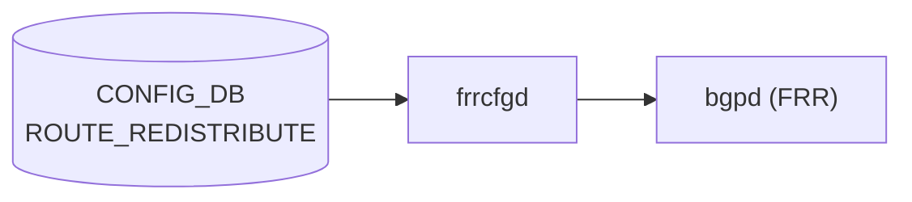

# ROUTE_REDISTRIBUTE テーブル

## 概要

`ROUTE_REDISTRIBUTE` は [BGP](../../reference/glossary.md#term-bgp) へのルート再配布設定を保持する [CONFIG_DB](../../reference/glossary.md#term-config_db) テーブル。ソースプロトコル (`src_protocol`)、宛先プロトコル (`dst_protocol`)、アドレスファミリ (`address_family`) の 3 軸で 1 エントリを構成し、[FRR](../../reference/glossary.md#term-frr) vtysh の `redistribute <src_proto>` コマンド生成をトリガーする[^1]。

`frrcfgd` が CONFIG_DB の `ROUTE_REDISTRIBUTE` テーブルを購読し、VRF ごとの BGP インスタンスに `address-family ipv4/ipv6 unicast` ブロック内で `redistribute <src>` コマンドを発行する[^2]。

<!-- cdb-mermaid -->
### データフロー (自動生成)



!!! note "凡例"
    CONFIG_DB から FRR までの典型経路。詳細・例外は本ページ本文を参照。
<!-- /cdb-mermaid -->

## key 構造

```text
ROUTE_REDISTRIBUTE|<vrf_name>|<src_protocol>|<dst_protocol>|<address_family>
```

| フィールド | 説明 |
|-----------|------|
| `<vrf_name>` | 対象 VRF 名（`default` または VRF 名） |
| `<src_protocol>` | 再配布元プロトコル enum |
| `<dst_protocol>` | 再配布先プロトコル enum（`bgp` 固定） |
| `<address_family>` | アドレスファミリ enum（`ipv4` / `ipv6`） |

## 主要フィールド

| フィールド | 型 | 説明 |
|-----------|----|------|
| `protocol` | 文字列 (src_protocol から派生) | frrcfgd 内部で key から抽出した再配布元プロトコル名 |
| `metric` | uint32 | 再配布時に付与する metric 値（省略可能） |
| `route_map` | leafref `ROUTE_MAP_SET.name` | 再配布フィルタ用 route-map（省略可能） |

## 購読者

- `frrcfgd`: CONFIG_DB `ROUTE_REDISTRIBUTE` を購読し、`bgpd` へ FRR vtysh コマンドを発行する。`dst_protocol != 'bgp'` の場合は `log_err` で拒否してスキップする[^2]。
- `bgpd` ([FRR](../../reference/glossary.md#term-frr)): `address-family <af> unicast` コンテキスト内の `redistribute <src>` を受け取り、経路選択に反映する。

## 関連 CONFIG_DB / YANG / CLI

- 関連 [CONFIG_DB](../../reference/glossary.md#term-config_db): `BGP_GLOBALS`、`BGP_GLOBALS_AF`、`STATIC_ROUTE`、`ROUTE_MAP_SET`、`VRF`
- 関連 CLI: `config bgp`
- 関連 [YANG](../../reference/glossary.md#term-yang): `sonic-bgp-global`

<!-- pubsub -->
## 通信メカニズム (Phase G)

`ROUTE_REDISTRIBUTE` テーブルの変更は **2 つの異なるデーモン** が異なる API で受信する。

### frrcfgd — ConfigDBConnector.subscribe() (keyspace 通知)

`frrcfgd` は `ExtConfigDBConnector`（`swsscommon.ConfigDBConnector` のサブクラス）の `subscribe()` メソッドで `ROUTE_REDISTRIBUTE` ハンドラを登録し、Redis keyspace 通知を使用する。`ConsumerStateTable` / `PUBLISH` 形式は使用しない。

| 項目 | 値 |
|------|-----|
| 購読 API | `ConfigDBConnector.subscribe()` (keyspace 通知 / PSUBSCRIBE) |
| keyspace パターン | `__keyspace@4__:ROUTE_REDISTRIBUTE\|*` (CONFIG_DB dbId=4) |
| ハンドラ | `bgp_table_handler_common` |
| FRR 送出方法 | `vtysh -c <cmd>` (逐次) |
| 削除時 | `no redistribute <src>` |
| 起動時スナップショット | `subscribe_all()` → `listen()` 開始時に既存データを一括処理 |

`ROUTE_REDISTRIBUTE` イベント受信後の処理フロー:

1. `key.split('|')` → `(src_proto, dst_proto, af)` を抽出
2. `af == 'ipv6' and src_proto == 'ospf3'` の場合 `src_proto = 'ospf6'` に変換
3. `dst_proto != 'bgp'` の場合 `LOG_ERR` 出力して skip
4. `cmd_prefix = ['configure terminal', 'router bgp <asn> vrf <vrf>', 'address-family <af> unicast']` を生成
5. `key_map.run_command()` → `__run_command()` → `g_run_command()` → `bgpd_client.run_vtysh_command()` で vtysh 実行

生成 vtysh コマンド例（connected を IPv4 unicast に再配布）:

```
vtysh -c "configure terminal"
      -c "router bgp 65100 vrf default"
      -c "address-family ipv4 unicast"
      -c "redistribute connected"
```

`route_redist_key_map` テンプレ (frrcfgd.py L1979-1980):

```
'{no:no-prefix}redistribute {} {:redist-metric} {:redist-route-map}'
```

### bgpcfgd — SubscriberStateTable (STATIC_ROUTE 経由)

`bgpcfgd` は `ROUTE_REDISTRIBUTE` テーブルを**直接購読しない**。`STATIC_ROUTE` テーブルを `swsscommon.SubscriberStateTable` で購読し、静的経路の追加・削除をトリガーに `redistribute static route-map STATIC_ROUTE_FILTER` を BGP に設定する。

| 項目 | 値 |
|------|-----|
| 購読 API | `swsscommon.SubscriberStateTable` (channel 通知) |
| 購読テーブル | `STATIC_ROUTE` (CONFIG_DB + APPL_DB) |
| ハンドラ | `StaticRouteMgr.handler()` |
| FRR 送出方法 | `cfg_mgr.push_list()` → `vtysh -f <tmpfile>` (バッチ) |
| 自動生成 route-map | `STATIC_ROUTE_FILTER permit 10` (固定) |

`SubscriberStateTable` は `swsscommon` の Consumer/Producer channel パターンを使用し、`swsscommon.Select` / `selector.select()` でイベントを待機する。

| 比較項目 | frrcfgd | bgpcfgd |
|---------|---------|---------|
| 購読 API | `ConfigDBConnector.subscribe()` (keyspace 通知) | `SubscriberStateTable` (channel 通知) |
| 購読テーブル | `ROUTE_REDISTRIBUTE` | `STATIC_ROUTE` |
| FRR 送出 | `vtysh -c <cmd>` (逐次) | `vtysh -f <tmpfile>` (バッチ) |

詳細スキャン結果は `meta/_intermediate/cdb-flow/route-redistribute-pubsub.md`。

<!-- evidence: sonic-net/sonic-buildimage/src/sonic-frr-mgmt-framework/frrcfgd/frrcfgd.py:2316L (table_handler_list ROUTE_REDISTRIBUTE) -->
<!-- evidence: sonic-net/sonic-buildimage/src/sonic-frr-mgmt-framework/frrcfgd/frrcfgd.py:3149-3168L (ROUTE_REDISTRIBUTE イベント処理) -->
<!-- evidence: sonic-net/sonic-buildimage/src/sonic-frr-mgmt-framework/frrcfgd/frrcfgd.py:1979-1980L (route_redist_key_map) -->
<!-- evidence: sonic-net/sonic-buildimage/src/sonic-bgpcfgd/bgpcfgd/runner.py:49-51L (SubscriberStateTable 登録) -->
<!-- evidence: sonic-net/sonic-buildimage/src/sonic-bgpcfgd/bgpcfgd/managers_static_rt.py:220-235L (enable_redistribution_command) -->
<!-- evidence: sonic-net/sonic-buildimage/src/sonic-bgpcfgd/bgpcfgd/frr.py:46-48L (vtysh -f バッチ送出) -->
<!-- /pubsub -->

<!-- ref-triangle:start -->

## 関連リファレンス

- [BGP_GLOBALS_AF](./bgp-globals-af.md)
- [STATIC_ROUTE](./static-route.md)
- [ROUTE_MAP](./route-map.md)

<!-- ref-triangle:end -->

## 引用元

[^1]: frrcfgd ROUTE_REDISTRIBUTE ハンドラ: `sonic-buildimage/src/sonic-frr-mgmt-framework/frrcfgd/frrcfgd.py` L3149-3168. <https://github.com/sonic-net/sonic-buildimage/blob/master/src/sonic-frr-mgmt-framework/frrcfgd/frrcfgd.py>
[^2]: frrcfgd route_redist_key_map: `frrcfgd.py` L1979-1980. `route_redist_key_map = [(['protocol', '++metric', '+route_map'], '{no:no-prefix}redistribute {} {:redist-metric} {:redist-route-map}', hdl_route_redist_set)]`
[^3]: bgpcfgd static redistribution: `sonic-buildimage/src/sonic-bgpcfgd/bgpcfgd/managers_static_rt.py` L221-252. <https://github.com/sonic-net/sonic-buildimage/blob/master/src/sonic-bgpcfgd/bgpcfgd/managers_static_rt.py>

<!-- constants -->
## ハードコード定数 (Phase E)

`frrcfgd` (`frrcfgd.py`) および `bgpcfgd` (`managers_static_rt.py`) から抽出した ROUTE_REDISTRIBUTE 経路に関わるハードコード定数。詳細スキャン結果は `meta/_intermediate/cdb-flow/route-redistribute-constants.md`。

### src_protocol enum 定数

`frrcfgd` が処理する `src_proto`（CONFIG_DB キーの第 3 フィールド）。

| 値 | FRR redistribute 対象 | 備考 | evidence |
|----|----------------------|------|---------|
| `connected` | 直接接続経路 | `redistribute_connected` フィールド経由でも生成される | frrcfgd.py L1833 |
| `static` | 静的経路 | STATIC_ROUTE テーブル更新時に bgpcfgd が `STATIC_ROUTE_FILTER` route-map とともに自動生成 | managers_static_rt.py L233 |
| `ospf` | OSPFv2 経路 | af=`ipv4` の場合にそのまま `redistribute ospf` として FRR へ | frrcfgd.py L3150 |
| `ospf3` | OSPFv3 経路 (CONFIG_DB 値) | af=`ipv6` のとき FRR コマンド生成前に `ospf6` へ変換 | frrcfgd.py L3151-3152 |
| `kernel` | カーネル経路 | Jinja2 テンプレートの redistribute ブロックで使用 | bgpd.conf.db.addr_family.j2 L69 |
| `bgp` | BGP 経路 | dst_protocol としても使用。src_protocol としては特殊ケース | frrcfgd.py L3156 |

### dst_protocol enum 定数

frrcfgd L3156 に明示バリデーションがあり、`bgp` のみ許容される。

| 値 | 許可 | evidence |
|----|------|---------|
| `bgp` | 許可 | frrcfgd.py L3156 |
| それ以外の文字列 | `log_err('only bgp could be used as dst protocol, but {} was given')` → continue (drop) | frrcfgd.py L3157 |

### address_family enum 定数

key の第 5 フィールド `af` は次の 2 値のみ。

| 値 | FRR address-family | ip_type | evidence |
|----|--------------------|---------|---------|
| `ipv4` | `address-family ipv4 unicast` | `unicast` (ハードコード) | frrcfgd.py L3163 |
| `ipv6` | `address-family ipv6 unicast` | `unicast` (ハードコード) | frrcfgd.py L3163 |

### ip_type ハードコード定数

`ip_type` は `'unicast'` にハードコードされており、`multicast` SAFI は ROUTE_REDISTRIBUTE では選択不可。

| 定数 | 値 | evidence |
|------|-----|---------|
| `ip_type` | `"unicast"` | frrcfgd.py L3153 |

### ospf3→ospf6 変換ルール (frrcfgd.py L3151-3152)

af=`ipv6` かつ src_protocol=`ospf3` の場合、FRR コマンド生成前に `ospf6` へ書き換える。CONFIG_DB には `ospf3` と記録するが FRR には `ospf6` として送出される。

```python
if af == 'ipv6' and src_proto == 'ospf3':
    src_proto = 'ospf6'
```

### bgpcfgd static redistribution ハードコード定数

STATIC_ROUTE テーブル変更時に `bgpcfgd` が自動生成する FRR コマンドのハードコード値。

| 定数 | 値 | evidence |
|------|-----|---------|
| route-map 名 | `"STATIC_ROUTE_FILTER"` | managers_static_rt.py L224,233,248,251 |
| route-map アクション | `permit` | managers_static_rt.py L224 |
| route-map シーケンス番号 | `10` | managers_static_rt.py L224 |
| address-family ループ対象 | `["ipv4", "ipv6"]` | managers_static_rt.py L231,246 |

<!-- /constants -->

<!-- cross-refs -->
## 暗黙参照 (Phase C)

### BGP_GLOBALS への暗黙参照

`ROUTE_REDISTRIBUTE` テーブルの処理は `BGP_GLOBALS|<vrf>|local_asn` の存在に依存する。
`frrcfgd` は VRF テーブル処理前に `__get_vrf_asn(vrf)` を呼び、`local_asn` が未設定の場合は
`ROUTE_REDISTRIBUTE` の FRR 反映をスキップして `LOG_DEBUG` を出力する
(`frrcfgd.py` L2658-2662)。

`BGP_GLOBALS|<vrf>|local_asn` が新規設定されると、`frrcfgd` は保留していた
`ROUTE_REDISTRIBUTE` エントリを `__apply_dep_vrf_table(vrf, 'ROUTE_REDISTRIBUTE')` で再適用する
(`frrcfgd.py` L2703-2704)。

FRR コマンド生成時には `local_asn` を用いて `router bgp <asn> vrf <vrf>` コンテキストを構築する
(`frrcfgd.py` L3161-3163):

```
router bgp <local_asn> vrf <vrf>
  address-family <af> unicast
    redistribute <src_proto> [metric <m>] [route-map <name>]
```

### ROUTE_MAP への暗黙参照

`route_map` フィールドは `sonic-route-common.yang` で `ROUTE_MAP_SET_LIST` への leafref として定義されており、
YANG バリデーションにより参照先の存在が保証される。

`frrcfgd` の `route_redist_key_map` はこれを `redistribute <proto> route-map <name>` コマンドに展開する
(`frrcfgd.py` L1979-1980)。SET 操作前に `no redistribute <proto>` を先行発行して冪等性を確保する
(`hdl_route_redist_set()` L1330-1340)。

| 暗黙参照元 | 参照先 | 種別 |
|-----------|--------|------|
| `ROUTE_REDISTRIBUTE` 全エントリ | `BGP_GLOBALS|<vrf>|local_asn` | 実行前提（未設定時は保留） |
| `ROUTE_REDISTRIBUTE` 全エントリ | `BGP_GLOBALS|<vrf>|local_asn` 設定イベント | 再適用トリガー |
| `ROUTE_REDISTRIBUTE|…|route_map` | `ROUTE_MAP_SET|<name>` | YANG leafref + FRR redistribute コマンド展開 |

<!-- /cross-refs -->

<!-- platform -->
## プラットフォーム差 (Phase H)

調査ソース: `frrcfgd.py`、`bgpcfgd/main.py`、`managers_static_rt.py`、`bgpd.conf.db.addr_family.j2`。詳細スキャン結果は `meta/_intermediate/cdb-flow/route-redistribute-platform.md`。

**プラットフォーム差なし。** ROUTE_REDISTRIBUTE 経路は FRR vtysh への BGP コマンド生成のみを行う。

### FRR バージョン差

`frrcfgd.py` および `managers_static_rt.py` に `frr_version` / `FRR_MAJOR` 等のバージョン条件分岐は存在しない。SONiC master は FRR バージョンをビルドシステムで統一するため実行時バージョン判定が不要。

### SmartSwitch

SmartSwitch (DPU) 構成において、frrcfgd / bgpcfgd は NPU 側ホストで通常通り動作し、ROUTE_REDISTRIBUTE 処理ロジックに変更はない。SmartSwitch 固有の BGP 設定は別テーブル（`BGP_VOQ_CHASSIS_NEIGHBOR` 等）で管理される。

### VOQ chassis

VOQ chassis の各 linecard では独立した frrcfgd / bgpcfgd が当該ホストの CONFIG_DB を購読する。ROUTE_REDISTRIBUTE はホストスコープの BGP 設定であり、chassis 集中管理の対象外。supervisor / linecard 間の TSA 同期 (`ChassisAppDbMgr`) は redistribute 設定に影響しない。

| プラットフォーム | 動作 | 備考 |
|-----------------|------|------|
| 標準 T0/T1/T2 | 変更なし | frrcfgd.py L3149–3168 |
| VOQ chassis (linecard) | 変更なし | 各 linecard host が独立に処理 |
| SmartSwitch (NPU 側) | 変更なし | DPU 固有経路は別テーブル |
| multi-asic | 変更なし | BGP は host namespace 単位 |
<!-- /platform -->

<!-- ops-hint -->
## 運用ヒント

### 典型設定例

```bash
# connected 経路を BGP IPv4 unicast へ再配布
sonic-db-cli CONFIG_DB hset 'ROUTE_REDISTRIBUTE|default|connected|bgp|ipv4' protocol connected

# static 経路を BGP IPv6 unicast へ再配布（route-map 付き）
sonic-db-cli CONFIG_DB hset 'ROUTE_REDISTRIBUTE|default|static|bgp|ipv6' route_map STATIC_FILTER
```

### 確認コマンド

```bash
# CONFIG_DB のエントリ確認
sonic-db-cli CONFIG_DB keys 'ROUTE_REDISTRIBUTE|*'

# FRR 側での再配布状態確認
vtysh -c 'show bgp ipv4 unicast summary'
vtysh -c 'show ip bgp'
```
<!-- /ops-hint -->
