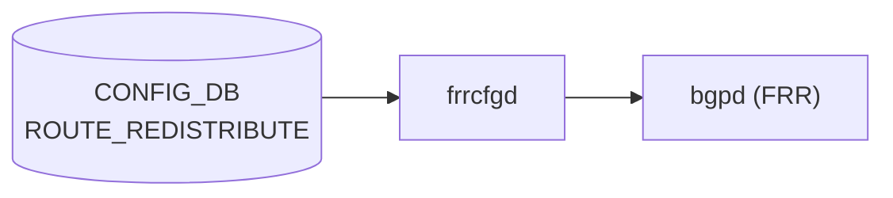

# ROUTE_REDISTRIBUTE テーブル

## 概要

`ROUTE_REDISTRIBUTE` は [BGP](../../reference/glossary.md#term-bgp) へのルート再配布設定を保持する [CONFIG_DB](../../reference/glossary.md#term-config_db) テーブル。ソースプロトコル (`src_protocol`)、宛先プロトコル (`dst_protocol`)、アドレスファミリ (`address_family`) の 3 軸で 1 エントリを構成し、[FRR](../../reference/glossary.md#term-frr) [vtysh](../../reference/glossary.md#term-vtysh) の `redistribute <src_proto>` コマンド生成をトリガーする[^1]。

`frrcfgd` が [CONFIG_DB](../../reference/glossary.md#term-config_db) の `ROUTE_REDISTRIBUTE` テーブルを購読し、[VRF](../../reference/glossary.md#term-vrf) ごとの [BGP](../../reference/glossary.md#term-bgp) インスタンスに `address-family ipv4/ipv6 unicast` ブロック内で `redistribute <src>` コマンドを発行する[^2]。

<!-- cdb-mermaid -->
### データフロー (自動生成)



!!! note "凡例"
    CONFIG_DB から FRR までの典型経路。詳細・例外は本ページ本文を参照。
<!-- /cdb-mermaid -->

## key 構造

```text
ROUTE_REDISTRIBUTE|<vrf_name>|<src_protocol>|<dst_protocol>|<address_family>
```

| フィールド | 説明 |
|-----------|------|
| `<vrf_name>` | 対象 [VRF](../../reference/glossary.md#term-vrf) 名（`default` または [VRF](../../reference/glossary.md#term-vrf) 名） |
| `<src_protocol>` | 再配布元プロトコル enum |
| `<dst_protocol>` | 再配布先プロトコル enum（`bgp` 固定） |
| `<address_family>` | アドレスファミリ enum（`ipv4` / `ipv6`） |

## 主要フィールド

| フィールド | 型 | 説明 |
|-----------|----|------|
| `protocol` | 文字列 (src_protocol から派生) | frrcfgd 内部で key から抽出した再配布元プロトコル名 |
| `metric` | uint32 | 再配布時に付与する metric 値（省略可能） |
| `route_map` | leafref `ROUTE_MAP_SET.name` | 再配布フィルタ用 route-map（省略可能） |

## 購読者

- `frrcfgd`: CONFIG_DB `ROUTE_REDISTRIBUTE` を購読し、`bgpd` へ [FRR](../../reference/glossary.md#term-frr) [vtysh](../../reference/glossary.md#term-vtysh) コマンドを発行する。`dst_protocol != 'bgp'` の場合は `log_err` で拒否してスキップする[^2]。
- `bgpd` ([FRR](../../reference/glossary.md#term-frr)): `address-family <af> unicast` コンテキスト内の `redistribute <src>` を受け取り、経路選択に反映する。

## 関連 CONFIG_DB / YANG / CLI

- 関連 [CONFIG_DB](../../reference/glossary.md#term-config_db): `BGP_GLOBALS`、`BGP_GLOBALS_AF`、`STATIC_ROUTE`、`ROUTE_MAP_SET`、`VRF`
- 関連 CLI: `config bgp`
- 関連 [YANG](../../reference/glossary.md#term-yang): `sonic-bgp-global`

<!-- ordering -->
## 書込み順依存 (Phase B)

`ROUTE_REDISTRIBUTE` テーブルへの書き込みには以下の順序制約がある。`frrcfgd` の実装（`frrcfgd.py`）を全行精読して確認した。詳細スキャン結果は `meta/_intermediate/cdb-flow/route-redistribute-ordering.md`。

### 必須制約（違反すると silent drop）

1. **`BGP_GLOBALS.<vrf>.local_asn` を先に設定する** — `ROUTE_REDISTRIBUTE` は `vrf_tables` に属するため、イベント処理の冒頭で `__get_vrf_asn(vrf)` を呼び出す。対象 VRF の `BGP_GLOBALS.local_asn` が未設定の場合（`local_asn is None`）、当該イベントは `LOG_DEBUG` のみ出力して **silent drop** される（FRR への `redistribute` コマンド未送出）。`ROUTE_REDISTRIBUTE|<vrf>|…` を書き込む前に必ず `BGP_GLOBALS|<vrf>` の `local_asn` を設定すること。

   - `__get_vrf_asn()` は `self.bgp_asn[vrf]`（`BGP_GLOBALS` イベント経由）または `self.metadata_asn`（`DEVICE_METADATA.bgp_asn`、default VRF のみ有効）を参照する。
   - evidence: `frrcfgd.py:2658-2661`, `frrcfgd.py:2442-2447`

2. **`dst_protocol` は `'bgp'` のみ** — `frrcfgd` は `dst_proto != 'bgp'` の場合に `LOG_ERR` を出力して `continue`（drop）する。`dst_protocol` フィールドが `'bgp'` 以外の CONFIG_DB エントリは FRR に一切反映されない（ランタイム制約）。

   - evidence: `frrcfgd.py:3156-3158`

### 自動リカバー挙動

3. **`BGP_GLOBALS.local_asn` SET 後に ROUTE_REDISTRIBUTE が自動再適用される** — `BGP_GLOBALS.local_asn` の SET が frrcfgd で成功した直後、`__apply_dep_vrf_table(vrf, 'ROUTE_REDISTRIBUTE')` が呼ばれ、CONFIG_DB に存在する当該 VRF の全 ROUTE_REDISTRIBUTE エントリが `bgp_message` キューへ再送され再適用される。すなわち順序が逆（BGP_GLOBALS 設定前に ROUTE_REDISTRIBUTE を書き込み）でも、その後 `BGP_GLOBALS.local_asn` を設定すれば最終的には FRR に反映される。ただし本番環境では正順（BGP_GLOBALS → ROUTE_REDISTRIBUTE）を守ることを推奨する。

   - evidence: `frrcfgd.py:2703-2704`, `frrcfgd.py:2530-2545`

### 推奨制約（違反すると FRR 側に redistribute 設定残留）

4. **削除順序: `ROUTE_REDISTRIBUTE` DEL → `BGP_GLOBALS.local_asn` DEL** — `BGP_GLOBALS.local_asn` を削除すると `bgp_asn[vrf]` が消去される。その後に `ROUTE_REDISTRIBUTE` を削除しようとしても `local_asn is None` で silent drop となり、FRR bgpd に `no redistribute <src>` が送出されない。結果として **FRR は `redistribute` 設定を保持したまま**になる。

   - 推奨削除順序: `ROUTE_REDISTRIBUTE` 全エントリを DEL → `BGP_GLOBALS.local_asn` を DEL。
   - evidence: `frrcfgd.py:2658-2661`, `frrcfgd.py:2449-2465`

### src_protocol / address_family の組み合わせ注意

5. **`ospf3` + `ipv6` は FRR では `ospf6` に変換される** — CONFIG_DB キーに `ospf3` と書いた場合、`af=ipv6` のときのみ FRR コマンド生成前に `ospf6` へ書き換えられる（`frrcfgd.py` L3151-3152）。`af=ipv4` + `src_protocol=ospf3` の組み合わせはそのまま `redistribute ospf3` として送出され、FRR bgpd が認識しないため設定エラーになる。書込み順の問題ではないが、src_protocol + address_family の組み合わせを CONFIG_DB 書き込み時点で正しく指定すること。

### 書込み順依存サマリ

| # | 依存関係 | 方向 | 影響 | 緩和策 |
|---|----------|------|------|--------|
| 1 | `BGP_GLOBALS.local_asn` 設定 → `ROUTE_REDISTRIBUTE` 書き込み | ハード先行必須 | silent drop | BGP_GLOBALS を先に設定 |
| 2 | `dst_protocol='bgp'` 以外の書き込み | ランタイム制約 | LOG_ERR + drop | `bgp` 固定で書くこと |
| 3 | BGP_GLOBALS.local_asn SET 後の自動再適用 | 自動リカバー | 逆順でも最終的に反映 | 本番では正順を推奨 |
| 4 | `ROUTE_REDISTRIBUTE` DEL → `BGP_GLOBALS` DEL | 推奨削除順序 | FRR に redistribute 残存 | ROUTE_REDISTRIBUTE を先に全削除 |
| 5 | `ospf3` + `ipv4` 組み合わせ禁止 | 書込み制約 | FRR 設定エラー | af=ipv6 のみ ospf3 を使用 |

<!-- evidence: sonic-net/sonic-buildimage/src/sonic-frr-mgmt-framework/frrcfgd/frrcfgd.py:2658-2661L (local_asn ゲート) -->
<!-- evidence: sonic-net/sonic-buildimage/src/sonic-frr-mgmt-framework/frrcfgd/frrcfgd.py:2703-2704L (BGP_GLOBALS 後の自動再適用) -->
<!-- evidence: sonic-net/sonic-buildimage/src/sonic-frr-mgmt-framework/frrcfgd/frrcfgd.py:3156-3158L (dst_protocol バリデーション) -->
<!-- evidence: sonic-net/sonic-buildimage/src/sonic-frr-mgmt-framework/frrcfgd/frrcfgd.py:2530-2545L (__apply_dep_vrf_table) -->
<!-- evidence: sonic-net/sonic-buildimage/src/sonic-frr-mgmt-framework/frrcfgd/frrcfgd.py:2449-2465L (__delete_vrf_asn) -->
<!-- /ordering -->

<!-- pubsub -->
## 通信メカニズム (Phase G)

`ROUTE_REDISTRIBUTE` テーブルの変更は **2 つの異なるデーモン** が異なる API で受信する。

### frrcfgd — ConfigDBConnector.subscribe() (keyspace 通知)

`frrcfgd` は `ExtConfigDBConnector`（`swsscommon.ConfigDBConnector` のサブクラス）の `subscribe()` メソッドで `ROUTE_REDISTRIBUTE` ハンドラを登録し、[Redis](../../reference/glossary.md#term-redis) keyspace 通知を使用する。`ConsumerStateTable` / `PUBLISH` 形式は使用しない。

| 項目 | 値 |
|------|-----|
| 購読 API | `ConfigDBConnector.subscribe()` (keyspace 通知 / PSUBSCRIBE) |
| keyspace パターン | `__keyspace@4__:ROUTE_REDISTRIBUTE\|*` (CONFIG_DB dbId=4) |
| ハンドラ | `bgp_table_handler_common` |
| FRR 送出方法 | `vtysh -c <cmd>` (逐次) |
| 削除時 | `no redistribute <src>` |
| 起動時スナップショット | `subscribe_all()` → `listen()` 開始時に既存データを一括処理 |

`ROUTE_REDISTRIBUTE` イベント受信後の処理フロー:

1. `key.split('|')` → `(src_proto, dst_proto, af)` を抽出
2. `af == 'ipv6' and src_proto == 'ospf3'` の場合 `src_proto = 'ospf6'` に変換
3. `dst_proto != 'bgp'` の場合 `LOG_ERR` 出力して skip
4. `cmd_prefix = ['configure terminal', 'router bgp <asn> vrf <vrf>', 'address-family <af> unicast']` を生成
5. `key_map.run_command()` → `__run_command()` → `g_run_command()` → `bgpd_client.run_vtysh_command()` で [vtysh](../../reference/glossary.md#term-vtysh) 実行

生成 vtysh コマンド例（connected を IPv4 unicast に再配布）:

```
vtysh -c "configure terminal"
      -c "router bgp 65100 vrf default"
      -c "address-family ipv4 unicast"
      -c "redistribute connected"
```

`route_redist_key_map` テンプレ (frrcfgd.py L1979-1980):

```
'{no:no-prefix}redistribute {} {:redist-metric} {:redist-route-map}'
```

### bgpcfgd — SubscriberStateTable (STATIC_ROUTE 経由)

`bgpcfgd` は `ROUTE_REDISTRIBUTE` テーブルを**直接購読しない**。`STATIC_ROUTE` テーブルを `swsscommon.SubscriberStateTable` で購読し、静的経路の追加・削除をトリガーに `redistribute static route-map STATIC_ROUTE_FILTER` を [BGP](../../reference/glossary.md#term-bgp) に設定する。

| 項目 | 値 |
|------|-----|
| 購読 API | `swsscommon.SubscriberStateTable` (channel 通知) |
| 購読テーブル | `STATIC_ROUTE` (CONFIG_DB + [APPL_DB](../../reference/glossary.md#term-appl_db)) |
| ハンドラ | `StaticRouteMgr.handler()` |
| FRR 送出方法 | `cfg_mgr.push_list()` → `vtysh -f <tmpfile>` (バッチ) |
| 自動生成 route-map | `STATIC_ROUTE_FILTER permit 10` (固定) |

`SubscriberStateTable` は `swsscommon` の Consumer/Producer channel パターンを使用し、`swsscommon.Select` / `selector.select()` でイベントを待機する。

| 比較項目 | frrcfgd | [bgpcfgd](../../reference/glossary.md#term-bgpcfgd) |
|---------|---------|---------|
| 購読 API | `ConfigDBConnector.subscribe()` (keyspace 通知) | `SubscriberStateTable` (channel 通知) |
| 購読テーブル | `ROUTE_REDISTRIBUTE` | `STATIC_ROUTE` |
| FRR 送出 | `vtysh -c <cmd>` (逐次) | `vtysh -f <tmpfile>` (バッチ) |

詳細スキャン結果は `meta/_intermediate/cdb-flow/route-redistribute-pubsub.md`。

<!-- evidence: sonic-net/sonic-buildimage/src/sonic-frr-mgmt-framework/frrcfgd/frrcfgd.py:2316L (table_handler_list ROUTE_REDISTRIBUTE) -->
<!-- evidence: sonic-net/sonic-buildimage/src/sonic-frr-mgmt-framework/frrcfgd/frrcfgd.py:3149-3168L (ROUTE_REDISTRIBUTE イベント処理) -->
<!-- evidence: sonic-net/sonic-buildimage/src/sonic-frr-mgmt-framework/frrcfgd/frrcfgd.py:1979-1980L (route_redist_key_map) -->
<!-- evidence: sonic-net/sonic-buildimage/src/sonic-bgpcfgd/bgpcfgd/runner.py:49-51L (SubscriberStateTable 登録) -->
<!-- evidence: sonic-net/sonic-buildimage/src/sonic-bgpcfgd/bgpcfgd/managers_static_rt.py:220-235L (enable_redistribution_command) -->
<!-- evidence: sonic-net/sonic-buildimage/src/sonic-bgpcfgd/bgpcfgd/frr.py:46-48L (vtysh -f バッチ送出) -->
<!-- /pubsub -->

<!-- ref-triangle:start -->

## 関連リファレンス

- [BGP_GLOBALS_AF](./bgp-globals-af.md)
- [STATIC_ROUTE](./static-route.md)
- [ROUTE_MAP](./route-map.md)

<!-- ref-triangle:end -->

## 引用元

[^1]: frrcfgd ROUTE_REDISTRIBUTE ハンドラ: `sonic-buildimage/src/sonic-frr-mgmt-framework/frrcfgd/frrcfgd.py` L3149-3168. <https://github.com/sonic-net/sonic-buildimage/blob/master/src/sonic-frr-mgmt-framework/frrcfgd/frrcfgd.py>
[^2]: frrcfgd route_redist_key_map: `frrcfgd.py` L1979-1980. `route_redist_key_map = [(['protocol', '++metric', '+route_map'], '{no:no-prefix}redistribute {} {:redist-metric} {:redist-route-map}', hdl_route_redist_set)]`

<!-- constants -->
## ハードコード定数 (Phase E)

`frrcfgd` (`frrcfgd.py`) および `bgpcfgd` (`managers_static_rt.py`) から抽出した ROUTE_REDISTRIBUTE 経路に関わるハードコード定数。詳細スキャン結果は `meta/_intermediate/cdb-flow/route-redistribute-constants.md`。

### src_protocol enum 定数

`frrcfgd` が処理する `src_proto`（CONFIG_DB キーの第 3 フィールド）。

| 値 | FRR redistribute 対象 | 備考 | evidence |
|----|----------------------|------|---------|
| `connected` | 直接接続経路 | `redistribute_connected` フィールド経由でも生成される | frrcfgd.py L1833 |
| `static` | 静的経路 | STATIC_ROUTE テーブル更新時に [bgpcfgd](../../reference/glossary.md#term-bgpcfgd) が `STATIC_ROUTE_FILTER` route-map とともに自動生成 | managers_static_rt.py L233 |
| `ospf` | OSPFv2 経路 | af=`ipv4` の場合にそのまま `redistribute ospf` として FRR へ | frrcfgd.py L3150 |
| `ospf3` | OSPFv3 経路 (CONFIG_DB 値) | af=`ipv6` のとき FRR コマンド生成前に `ospf6` へ変換 | frrcfgd.py L3151-3152 |
| `kernel` | カーネル経路 | Jinja2 テンプレートの redistribute ブロックで使用 | bgpd.conf.db.addr_family.j2 L69 |
| `bgp` | BGP 経路 | dst_protocol としても使用。src_protocol としては特殊ケース | frrcfgd.py L3156 |

### dst_protocol enum 定数

frrcfgd L3156 に明示バリデーションがあり、`bgp` のみ許容される。

| 値 | 許可 | evidence |
|----|------|---------|
| `bgp` | 許可 | frrcfgd.py L3156 |
| それ以外の文字列 | `log_err('only bgp could be used as dst protocol, but {} was given')` → continue (drop) | frrcfgd.py L3157 |

### address_family enum 定数

key の第 5 フィールド `af` は次の 2 値のみ。

| 値 | FRR address-family | ip_type | evidence |
|----|--------------------|---------|---------|
| `ipv4` | `address-family ipv4 unicast` | `unicast` (ハードコード) | frrcfgd.py L3163 |
| `ipv6` | `address-family ipv6 unicast` | `unicast` (ハードコード) | frrcfgd.py L3163 |

### ip_type ハードコード定数

`ip_type` は `'unicast'` にハードコードされており、`multicast` SAFI は ROUTE_REDISTRIBUTE では選択不可。

| 定数 | 値 | evidence |
|------|-----|---------|
| `ip_type` | `"unicast"` | frrcfgd.py L3153 |

### ospf3→ospf6 変換ルール (frrcfgd.py L3151-3152)

af=`ipv6` かつ src_protocol=`ospf3` の場合、FRR コマンド生成前に `ospf6` へ書き換える。CONFIG_DB には `ospf3` と記録するが FRR には `ospf6` として送出される。

```python
if af == 'ipv6' and src_proto == 'ospf3':
    src_proto = 'ospf6'
```

### bgpcfgd static redistribution ハードコード定数

STATIC_ROUTE テーブル変更時に `bgpcfgd` が自動生成する FRR コマンドのハードコード値。

| 定数 | 値 | evidence |
|------|-----|---------|
| route-map 名 | `"STATIC_ROUTE_FILTER"` | managers_static_rt.py L224,233,248,251 |
| route-map アクション | `permit` | managers_static_rt.py L224 |
| route-map シーケンス番号 | `10` | managers_static_rt.py L224 |
| address-family ループ対象 | `["ipv4", "ipv6"]` | managers_static_rt.py L231,246 |

<!-- /constants -->

<!-- side-effects -->
## 副作用・連鎖変更 (Phase F)

> **調査根拠**: `sonic-buildimage/src/sonic-frr-mgmt-framework/frrcfgd/frrcfgd.py:3149-3168,1330-1341,1979-1980`; `sonic-swss/fpmsyncd/routesync.cpp:156,1433`; `sonic-buildimage/src/sonic-bgpcfgd/bgpcfgd/managers_static_rt.py:220-248` (2026-05-18)
> 詳細証跡: `meta/_intermediate/cdb-flow/route-redistribute-side-effects.md`

`ROUTE_REDISTRIBUTE` の SET / DEL は frrcfgd → FRR bgpd → [zebra](../../reference/glossary.md#term-zebra) → [fpmsyncd](../../reference/glossary.md#term-fpmsyncd) → [APPL_DB](../../reference/glossary.md#term-appl_db) → [orchagent](../../reference/glossary.md#term-orchagent) という連鎖を引き起こす。frrcfgd 自身は CONFIG_DB 以外の DB に書き込まない。

### 連鎖変更マップ

```
CONFIG_DB:ROUTE_REDISTRIBUTE
  └─(frrcfgd:subscribe)─▶ vtysh: router bgp / address-family / redistribute <src>
       └─(bgpd 内部)─▶ BGP RIB に src_proto 経路を取り込み
            ├─(BGP UPDATE)─▶ 確立済み BGP ピアへ NLRI 広告 / WITHDRAW
            └─(zebra IPC)─▶ カーネル routing table に経路追加 / 削除
                 └─(FPM)─▶ fpmsyncd → APPL_DB:ROUTE_TABLE (ProducerStateTable)
                      └─(orchagent)─▶ SAI API → ASIC FIB エントリ追加 / 削除
```

### 1. FRR bgpd — BGP RIB へのルート取り込み

`frrcfgd` が vtysh 経由で `redistribute <src_proto>` を送出すると、bgpd は該当ソースプロトコルの経路を BGP RIB に取り込む (`frrcfgd.py:3161-3165`)。

| 副作用 | 詳細 |
|--------|------|
| BGP RIB 更新 | `src_proto` 経路が best-path 計算対象になる |
| `route-map` 適用 | フィールド指定時は attribute 書き換え / フィルタリング |
| `metric` → MED | フィールド指定時は BGP MED として付与 |
| SET 前 WITHDRAW | `hdl_route_redist_set` が `no redistribute <src>` を先行発行するため、metric / route-map 変更時も一時的な経路撤回が発生 (`frrcfgd.py:1334-1336`) |

### 2. BGP ピアへの UPDATE / WITHDRAW

bgpd が redistribution で新規経路を学習すると、確立済みの BGP ピアへ UPDATE を送出する。`no redistribute <src>` (DEL) 時は WITHDRAW が送出される。この動作は frrcfgd の管理外（FRR bgpd 内部）。

### 3. zebra → カーネル routing table

bgpd が best-path 選択した経路を [zebra](../../reference/glossary.md#term-zebra) に通知し、[zebra](../../reference/glossary.md#term-zebra) がカーネルの routing table に経路を追加 / 削除する（`ip route` / `ip -6 route`）。この動作も frrcfgd の管理外（FRR 内部）。

### 4. fpmsyncd → APPL_DB:ROUTE_TABLE

zebra は [FPM](../../reference/glossary.md#term-fpm) プロトコルで経路変化を [fpmsyncd](../../reference/glossary.md#term-fpmsyncd) に通知する。[fpmsyncd](../../reference/glossary.md#term-fpmsyncd) は `ProducerStateTable` 経由で `APPL_DB:ROUTE_TABLE` に経路を書き込む。

```
zebra (FPM) → fpmsyncd → APPL_DB:ROUTE_TABLE (ProducerStateTable)
```

evidence: `routesync.cpp:156` (`m_routeTable = createProducerStateTable(APP_ROUTE_TABLE_NAME)`)、`routesync.cpp:1433`

### 5. orchagent → SAI/ASIC FIB

[orchagent](../../reference/glossary.md#term-orchagent) は `APPL_DB:ROUTE_TABLE` を購読し、[SAI](../../reference/glossary.md#term-sai) API 経由で [ASIC](../../reference/glossary.md#term-asic) の FIB エントリを更新する。ROUTE_REDISTRIBUTE の変更は最終的にデータプレーン転送経路の追加 / 削除につながる。

### 6. bgpcfgd の STATIC_ROUTE 自動 redistribute（独立経路）

`bgpcfgd` は `ROUTE_REDISTRIBUTE` を直接購読しない。`STATIC_ROUTE` テーブルを購読し、静的経路追加時に `redistribute static route-map STATIC_ROUTE_FILTER` を自動生成する。この自動コマンドは CONFIG_DB の ROUTE_REDISTRIBUTE エントリとは独立して発行される (`managers_static_rt.py:220-248`)。

### frrcfgd が書き込まない DB

frrcfgd は処理結果を CONFIG_DB 以外のいかなる DB にも書き込まない。エラー発生時は syslog (LOG_ERR) のみで通知される。[STATE_DB](../../reference/glossary.md#term-state_db) へのステータス書き込みなし。

<!-- evidence: sonic-net/sonic-buildimage/src/sonic-frr-mgmt-framework/frrcfgd/frrcfgd.py:3149-3168L (ROUTE_REDISTRIBUTE ハンドラ) -->
<!-- evidence: sonic-net/sonic-buildimage/src/sonic-frr-mgmt-framework/frrcfgd/frrcfgd.py:1330-1341L (hdl_route_redist_set, no-prefix 先行) -->
<!-- evidence: sonic-net/sonic-swss/fpmsyncd/routesync.cpp:156L (APPL_DB ROUTE_TABLE ProducerStateTable) -->
<!-- evidence: sonic-net/sonic-buildimage/src/sonic-bgpcfgd/bgpcfgd/managers_static_rt.py:220-248L (enable/disable_redistribution_command) -->
<!-- /side-effects -->

<!-- failure -->
## 失敗挙動・エラーパス (Phase D)

> **調査根拠**: `sonic-buildimage/src/sonic-frr-mgmt-framework/frrcfgd/frrcfgd.py` 精読 (2026-05-18)
> 詳細証跡: `meta/_intermediate/cdb-flow/route-redistribute-failure.md`

`frrcfgd` は `ConfigDBConnector.subscribe()` / keyspace 通知モデルを採用する。`bgpcfgd` (Manager.set_handler の `False` リトライ) とは異なり、**エラー時は `continue` でそのイベントを廃棄する。自動リトライ機構はない。**

### SET 失敗マトリクス

| 条件 | 動作 | リトライ | ログ |
|------|------|---------|------|
| `local_asn is None` (BGP_GLOBALS 未設定) | `continue` — FRR への `redistribute` 未送出 | なし (BGP_GLOBALS SET 後に `__apply_dep_vrf_table` で再適用試行) | `LOG_DEBUG "ignore table ... because local_asn not configured"` (`frrcfgd.py:2660`) |
| `dst_proto != 'bgp'` | `continue` | なし | `LOG_ERR "only bgp could be used as dst protocol"` (`frrcfgd.py:3157`) |
| key フォーマット不正 (`split('|')` 要素数不足) | Python ValueError 例外 → スキップ | なし | スタックトレース (未捕捉) |
| `key_map.run_command()` が False (vtysh 実行失敗) | `continue` | なし | `LOG_ERR "failed running BGP route redistribute config command"` (`frrcfgd.py:3167`) |
| vtysh `returncode != 0` (bgpd 未起動 / FRR 文法エラー) | `g_run_command` が False → `run_command` が False → `continue` | なし | `LOG_ERR "command execution returned <code>"` (`frrcfgd.py:60`) |
| `bgpd_client` ソケット切断 (bgpd 再起動) | `bgpd_client.run_vtysh_command()` が False → `continue` | なし (frrcfgd 再起動が必要) | `LOG_ERR "command execution failure"` (`frrcfgd.py:53`) |
| `af` が `ipv4` / `ipv6` 以外 | vtysh が `address-family <invalid> unicast` を拒否 → returncode != 0 → `continue` | なし | 同上 |
| `src_proto` が FRR 非認識プロトコル | vtysh が `redistribute <unknown>` を拒否 → `continue` | なし | 同上 |
| `ospf3` + `ipv4` の組み合わせ | `ospf6` 変換なし → `redistribute ospf3` → bgpd 拒否 → `continue` | なし | 同上 |

### DEL 失敗マトリクス

| 条件 | 動作 | 結果 |
|------|------|------|
| `local_asn is None` | `continue` (silent drop) | FRR に `no redistribute` 未送出 → redistribute 設定が FRR に残存 |
| vtysh 実行失敗 | `continue` | 同上 — redistribute 設定が FRR に残存 |

`hdl_route_redist_set` は SET 前に必ず `no redistribute <src>` を先行発行して冪等性を確保する (`frrcfgd.py:1334-1336`)。DEL 時は `OP_DELETE` が `get_command_cmn` に渡り `no redistribute <src>` を生成するが、vtysh 失敗時は `continue` で廃棄される。

### BgpdClientMgr 接続失敗

`BgpdClientMgr.__create_frr_client` は起動時に最大 100 回 (間隔 2 秒) bgpd への Unix ドメインソケット接続を試みる (`frrcfgd.py:186-199`)。ただし runtime 中の再接続は自動では行われない。bgpd が再起動した場合は frrcfgd の再起動が必要。

### `__apply_dep_vrf_table` — BGP_GLOBALS 設定後のリカバー

`local_asn` の SET 成功後、`__apply_dep_vrf_table(vrf, 'ROUTE_REDISTRIBUTE')` が呼ばれる (`frrcfgd.py:2703-2704`)。これにより保留中の ROUTE_REDISTRIBUTE エントリが BGP キューへ再送される。ただし信頼性は保証されないため、正順 (BGP_GLOBALS → ROUTE_REDISTRIBUTE) が推奨。

### CONFIG_DB へのエラーステータス書き込み

なし。`frrcfgd` は CONFIG_DB のエントリに対して成否ステータスを書き戻さない。FRR への反映失敗は syslog (LOG_ERR) のみで通知される。

<!-- evidence: sonic-net/sonic-buildimage/src/sonic-frr-mgmt-framework/frrcfgd/frrcfgd.py:3149-3168L (ROUTE_REDISTRIBUTE ハンドラ) -->
<!-- evidence: sonic-net/sonic-buildimage/src/sonic-frr-mgmt-framework/frrcfgd/frrcfgd.py:2658-2662L (local_asn ゲート) -->
<!-- evidence: sonic-net/sonic-buildimage/src/sonic-frr-mgmt-framework/frrcfgd/frrcfgd.py:47-63L (g_run_command) -->
<!-- evidence: sonic-net/sonic-buildimage/src/sonic-frr-mgmt-framework/frrcfgd/frrcfgd.py:1330-1340L (hdl_route_redist_set, no-prefix先行) -->
<!-- evidence: sonic-net/sonic-buildimage/src/sonic-frr-mgmt-framework/frrcfgd/frrcfgd.py:186-199L (BgpdClientMgr 接続リトライ) -->
<!-- evidence: sonic-net/sonic-buildimage/src/sonic-frr-mgmt-framework/frrcfgd/frrcfgd.py:2703-2704L (__apply_dep_vrf_table) -->
<!-- /failure -->

<!-- cross-refs -->
## 暗黙参照 (Phase C)

### BGP_GLOBALS への暗黙参照

`ROUTE_REDISTRIBUTE` テーブルの処理は `BGP_GLOBALS|<vrf>|local_asn` の存在に依存する。
`frrcfgd` は VRF テーブル処理前に `__get_vrf_asn(vrf)` を呼び、`local_asn` が未設定の場合は
`ROUTE_REDISTRIBUTE` の FRR 反映をスキップして `LOG_DEBUG` を出力する
(`frrcfgd.py` L2658-2662)。

`BGP_GLOBALS|<vrf>|local_asn` が新規設定されると、`frrcfgd` は保留していた
`ROUTE_REDISTRIBUTE` エントリを `__apply_dep_vrf_table(vrf, 'ROUTE_REDISTRIBUTE')` で再適用する
(`frrcfgd.py` L2703-2704)。

FRR コマンド生成時には `local_asn` を用いて `router bgp <asn> vrf <vrf>` コンテキストを構築する
(`frrcfgd.py` L3161-3163):

```
router bgp <local_asn> vrf <vrf>
  address-family <af> unicast
    redistribute <src_proto> [metric <m>] [route-map <name>]
```

### ROUTE_MAP への暗黙参照

`route_map` フィールドは `sonic-route-common.yang` で `ROUTE_MAP_SET_LIST` への leafref として定義されており、
[YANG](../../reference/glossary.md#term-yang) バリデーションにより参照先の存在が保証される。

`frrcfgd` の `route_redist_key_map` はこれを `redistribute <proto> route-map <name>` コマンドに展開する
(`frrcfgd.py` L1979-1980)。SET 操作前に `no redistribute <proto>` を先行発行して冪等性を確保する
(`hdl_route_redist_set()` L1330-1340)。

| 暗黙参照元 | 参照先 | 種別 |
|-----------|--------|------|
| `ROUTE_REDISTRIBUTE` 全エントリ | `BGP_GLOBALS|<vrf>|local_asn` | 実行前提（未設定時は保留） |
| `ROUTE_REDISTRIBUTE` 全エントリ | `BGP_GLOBALS|<vrf>|local_asn` 設定イベント | 再適用トリガー |
| `ROUTE_REDISTRIBUTE|…|route_map` | `ROUTE_MAP_SET|<name>` | [YANG](../../reference/glossary.md#term-yang) leafref + FRR redistribute コマンド展開 |

<!-- /cross-refs -->

<!-- platform -->
## プラットフォーム差 (Phase H)

調査ソース: `frrcfgd.py`、`bgpcfgd/main.py`、`managers_static_rt.py`、`bgpd.conf.db.addr_family.j2`。詳細スキャン結果は `meta/_intermediate/cdb-flow/route-redistribute-platform.md`。

**プラットフォーム差なし。** ROUTE_REDISTRIBUTE 経路は FRR vtysh への BGP コマンド生成のみを行う。

### FRR バージョン差

`frrcfgd.py` および `managers_static_rt.py` に `frr_version` / `FRR_MAJOR` 等のバージョン条件分岐は存在しない。[SONiC](../../reference/glossary.md#term-sonic) master は FRR バージョンをビルドシステムで統一するため実行時バージョン判定が不要。

### SmartSwitch

[SmartSwitch](../../reference/glossary.md#term-smartswitch) ([DPU](../../reference/glossary.md#term-dpu)) 構成において、frrcfgd / [bgpcfgd](../../reference/glossary.md#term-bgpcfgd) は [NPU](../../reference/glossary.md#term-npu) 側ホストで通常通り動作し、ROUTE_REDISTRIBUTE 処理ロジックに変更はない。[SmartSwitch](../../reference/glossary.md#term-smartswitch) 固有の BGP 設定は別テーブル（`BGP_VOQ_CHASSIS_NEIGHBOR` 等）で管理される。

### VOQ chassis

[VOQ](../../reference/glossary.md#term-voq) chassis の各 linecard では独立した frrcfgd / bgpcfgd が当該ホストの CONFIG_DB を購読する。ROUTE_REDISTRIBUTE はホストスコープの BGP 設定であり、chassis 集中管理の対象外。supervisor / linecard 間の TSA 同期 (`ChassisAppDbMgr`) は redistribute 設定に影響しない。

| プラットフォーム | 動作 | 備考 |
|-----------------|------|------|
| 標準 T0/T1/T2 | 変更なし | frrcfgd.py L3149–3168 |
| [VOQ](../../reference/glossary.md#term-voq) chassis (linecard) | 変更なし | 各 linecard host が独立に処理 |
| [SmartSwitch](../../reference/glossary.md#term-smartswitch) ([NPU](../../reference/glossary.md#term-npu) 側) | 変更なし | [DPU](../../reference/glossary.md#term-dpu) 固有経路は別テーブル |
| multi-asic | 変更なし | BGP は host namespace 単位 |
<!-- /platform -->

<!-- ops-hint -->
## 運用ヒント

### 典型設定例

```bash
# connected 経路を BGP IPv4 unicast へ再配布
sonic-db-cli CONFIG_DB hset 'ROUTE_REDISTRIBUTE|default|connected|bgp|ipv4' protocol connected

# static 経路を BGP IPv6 unicast へ再配布（route-map 付き）
sonic-db-cli CONFIG_DB hset 'ROUTE_REDISTRIBUTE|default|static|bgp|ipv6' route_map STATIC_FILTER
```

### 確認コマンド

```bash
# CONFIG_DB のエントリ確認
sonic-db-cli CONFIG_DB keys 'ROUTE_REDISTRIBUTE|*'

# FRR 側での再配布状態確認
vtysh -c 'show bgp ipv4 unicast summary'
vtysh -c 'show ip bgp'
```
<!-- /ops-hint -->

<!-- glossary-links-injected: 565f90bf7ea2 -->
