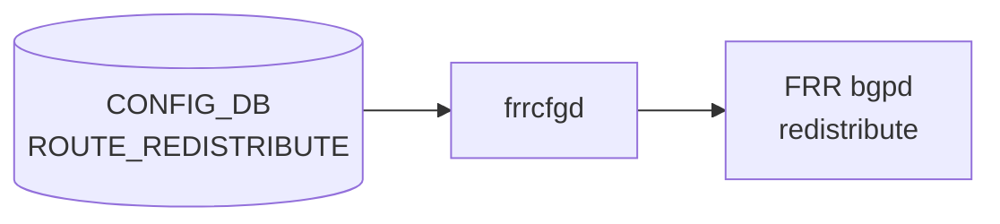

# ROUTE_REDISTRIBUTE テーブル

## 概要

`ROUTE_REDISTRIBUTE` はルートプロトコル間の再配布設定を [CONFIG_DB](../../reference/glossary.md#term-config_db) に保持するテーブル。`frrcfgd` が購読し、[FRR](../../reference/glossary.md#term-frr) `bgpd` の `redistribute <proto> [route-map <name>]` コマンドに変換する[^1]。`src_protocol` から `dst_protocol` へのルート再配布を `addr_family` 単位で制御し、オプションで `route_map` によるフィルタリングと `metric` の設定が可能。

<!-- cdb-mermaid -->
### データフロー (自動生成)



!!! note "凡例"
    CONFIG_DB から FRR までの典型経路を示すミニ図。`frrcfgd` が `ROUTE_REDISTRIBUTE` を購読し、`router bgp <asn> vrf <vrf>` コンテキスト内の `address-family` ブロックに `redistribute` コマンドを発行する。
<!-- /cdb-mermaid -->

## key 構造

```text
ROUTE_REDISTRIBUTE|<vrf_name>|<src_protocol>|<dst_protocol>|<addr_family>
```

- `<vrf_name>`: `default` または `VRF` テーブルに存在する VRF 名
- `<src_protocol>`: 再配布元プロトコル (`connected`, `static`, `ospf`, `ospf3` 等)
- `<dst_protocol>`: 再配布先プロトコル (`bgp` のみ対応)
- `<addr_family>`: アドレスファミリ (`ipv4`, `ipv6`)

## 主要フィールド

| フィールド | 型 | 既定値 | 説明 |
|-----------|----|--------|------|
| `route_map` | leaf-list (leafref to ROUTE_MAP_SET) | - | 再配布時に適用するルートマップ名。最大 1 件。`ROUTE_MAP_SET` への leafref |
| `metric` | uint32 | - | 再配布経路に付与するメトリック値 |

## 制約

- `dst_protocol` は現在 `bgp` のみ有効。それ以外は `frrcfgd` が `LOG_ERR` を出力しスキップ[^2]。
- `route_map` は `ROUTE_MAP_SET_LIST` に存在する名前への leafref であり、YANG バリデーションにより整合性が保証される[^1]。
- `src_protocol == 'ospf3'` かつ `addr_family == 'ipv6'` の場合、`frrcfgd` が FRR コマンド生成時に `ospf6` へ自動変換する[^2]。
- `ROUTE_REDISTRIBUTE` エントリの処理には `BGP_GLOBALS|<vrf>|local_asn` の設定が前提。未設定時は保留される[^2]。

## 購読者

- `frrcfgd` (`frr-mgmt-framework` コンテナ): `ROUTE_REDISTRIBUTE` を購読し、VRF ごとの `router bgp <asn>` + `address-family` コンテキストに `redistribute <proto> [metric <m>] [route-map <name>]` を発行する。

## 関連 CONFIG_DB / YANG / CLI

- 関連 [CONFIG_DB](../../reference/glossary.md#term-config_db): `BGP_GLOBALS`（local_asn 依存）、`ROUTE_MAP`（route_map 参照）、`VRF`（vrf_name leafref）
- 関連 [YANG](../../reference/glossary.md#term-yang): `sonic-route-common`

<!-- ref-triangle:start -->

## 関連リファレンス

- YANG: [`sonic-route-common`](../yang/sonic-route-common.md)
- CONFIG_DB: [`BGP_GLOBALS`](./bgp-globals.md)
- CONFIG_DB: [`ROUTE_MAP`](./route-map.md)

<!-- ref-triangle:end -->

## 引用元

[^1]: YANG 定義: `sonic-route-common.yang`. <https://github.com/sonic-net/sonic-buildimage/blob/9ea932ec2e18f35e58268ec2e4456b1d4afd65cd/src/sonic-yang-models/yang-models/sonic-route-common.yang>
[^2]: `frrcfgd` 実装: `frrcfgd.py`. <https://github.com/sonic-net/sonic-buildimage/blob/9ea932ec2e18f35e58268ec2e4456b1d4afd65cd/src/sonic-frr-mgmt-framework/frrcfgd/frrcfgd.py>

<!-- cross-refs -->
## 暗黙参照 (Phase C)

### BGP_GLOBALS への暗黙参照

`ROUTE_REDISTRIBUTE` テーブルの処理は `BGP_GLOBALS|<vrf>|local_asn` の存在に依存する。
`frrcfgd` は VRF テーブル処理前に `__get_vrf_asn(vrf)` を呼び、`local_asn` が未設定の場合は
`ROUTE_REDISTRIBUTE` の FRR 反映をスキップして `LOG_DEBUG` を出力する
(`frrcfgd.py` L2658-2662)。

`BGP_GLOBALS|<vrf>|local_asn` が新規設定されると、`frrcfgd` は保留していた
`ROUTE_REDISTRIBUTE` エントリを `__apply_dep_vrf_table(vrf, 'ROUTE_REDISTRIBUTE')` で再適用する
(`frrcfgd.py` L2703-2704)。

FRR コマンド生成時には `local_asn` を用いて `router bgp <asn> vrf <vrf>` コンテキストを構築する
(`frrcfgd.py` L3161-3163):

```
router bgp <local_asn> vrf <vrf>
  address-family <af> unicast
    redistribute <src_proto> [metric <m>] [route-map <name>]
```

### ROUTE_MAP への暗黙参照

`route_map` フィールドは `sonic-route-common.yang` で `ROUTE_MAP_SET_LIST` への leafref として定義されており、
YANG バリデーションにより参照先の存在が保証される。

`frrcfgd` の `route_redist_key_map` はこれを `redistribute <proto> route-map <name>` コマンドに展開する
(`frrcfgd.py` L1979-1980)。SET 操作前に `no redistribute <proto>` を先行発行して冪等性を確保する
(`hdl_route_redist_set()` L1330-1340)。

| 暗黙参照元 | 参照先 | 種別 |
|-----------|--------|------|
| `ROUTE_REDISTRIBUTE` 全エントリ | `BGP_GLOBALS|<vrf>|local_asn` | 実行前提（未設定時は保留） |
| `ROUTE_REDISTRIBUTE` 全エントリ | `BGP_GLOBALS|<vrf>|local_asn` 設定イベント | 再適用トリガー |
| `ROUTE_REDISTRIBUTE|…|route_map` | `ROUTE_MAP_SET|<name>` | YANG leafref + FRR redistribute コマンド展開 |

<!-- /cross-refs -->

<!-- ops-hint -->
## 運用ヒント

### 典型値

- key 形式: `ROUTE_REDISTRIBUTE|default|connected|bgp|ipv4`（デフォルト VRF で connected を BGP IPv4 に再配布）
- `src_protocol`: `connected`、`static`、`ospf`
- `dst_protocol`: `bgp`（固定）
- `addr_family`: `ipv4` または `ipv6`

### よくある誤設定

- `BGP_GLOBALS|<vrf>|local_asn` が設定されていない状態で `ROUTE_REDISTRIBUTE` を投入しても FRR に反映されない（`local_asn` 設定後に自動再適用される）。
- `route_map` に存在しないルートマップ名を指定すると YANG バリデーションエラーになる。

### 確認コマンド

```bash
sonic-db-cli CONFIG_DB keys 'ROUTE_REDISTRIBUTE|*'
vtysh -c 'show running-config bgpd' | grep redistribute
```
<!-- /ops-hint -->
