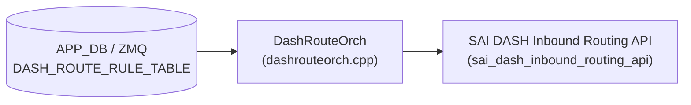
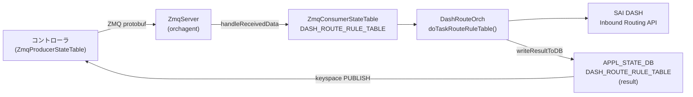

# DASH_ROUTE_RULE_TABLE テーブル

## 概要

[DASH](../../reference/glossary.md#term-dash) (Disaggregated APIs for [SONiC](../../reference/glossary.md#term-sonic) Hosts) のインバウンドルーティングエントリ (Inbound Routing Rule) を保持するテーブル[^1]。

外部から [DASH](../../reference/glossary.md#term-dash) スイッチへ流入するパケット (インバウンド方向) が [VXLAN](../../reference/glossary.md#term-vxlan) トンネルのデカプセルを受けるルールを定義する。エントリは [ENI](../../reference/glossary.md#term-eni)・VNI・SIP プレフィックス (または PREFIX TAG)・優先度の 4 要素で一意に識別され、PA 検証の要否と [VNET](../../reference/glossary.md#term-vnet) マッピングを制御する。

`DashRouteOrch::doTaskRouteRuleTable()` (`sonic-swss/orchagent/dash/dashrouteorch.cpp`) が ZMQ 経由で受信した Protobuf メッセージを解釈し、[SAI](../../reference/glossary.md#term-sai) の `sai_dash_inbound_routing_api` を通じてデータプレーンに `sai_inbound_routing_entry_t` を作成する。

<!-- cdb-mermaid -->
### データフロー (自動生成)



!!! note "凡例"
    APP_DB (ZMQ 経由) から SAI までの典型経路。詳細・例外は本ページ本文を参照。
<!-- /cdb-mermaid -->

## key 構造

```text
DASH_ROUTE_RULE_TABLE:<eni>:<vni>:<prefix>[:<priority>]
```

| セグメント | 型 | 説明 |
|-----------|----|----|
| `<eni>` | string | [ENI](../../reference/glossary.md#term-eni) の MAC アドレス文字列 (例: `F4939FEFC47E`)。`DASH_ENI_TABLE` のキーと対応 |
| `<vni>` | uint32 | [VXLAN](../../reference/glossary.md#term-vxlan) VNI。インバウンドパケットのアウターヘッダ VNI に一致するか検査する |
| `<prefix>` | string | SIP プレフィックス (CIDR 形式) または `DASH_PREFIX_TAG_TABLE` のタグ名 |
| `<priority>` | uint32 | ルール優先度 (省略可能)。省略時は `0` にフォールバック。低い値ほど高優先 |

`<priority>` フィールドは旧フォーマット互換のため省略可能。[orchagent](../../reference/glossary.md#term-orchagent) は `<prefix>` の末尾セグメントが数字のみか検査し、数字でなければ全体を `<prefix>` として扱い `priority=0` に fallback する (`dashrouteorch.cpp:605-623`)。

## フィールド

| フィールド | 型 | 必須 | デフォルト | 説明 |
|-----------|----|----|-----------|------|
| `action_type` | routing_type enum | 任意 | — | 非推奨 (deprecated)。`ROUTING_TYPE_*` を指定する旧フィールド。新規実装では key の priority フィールドを使う |
| `priority` | uint32 | 任意 | `0` | 非推奨 (deprecated)。優先度は key のセグメントに移動済み |
| `protocol` | uint32 | 任意 | `0` (any) | マッチするプロトコル番号。`0` はプロトコルを問わずすべてにマッチ |
| `vnet` | string | 任意 | 未設定 | PA 検証やマッピングに使用する [VNET](../../reference/glossary.md#term-vnet) 名 (`DASH_VNET_TABLE` の key) |
| `pa_validation` | bool | 任意 | `false` | `true` 時: [SAI](../../reference/glossary.md#term-sai) に `TUNNEL_DECAP_PA_VALIDATE` を渡し PA 検証を行う。`false` 時: `TUNNEL_DECAP` のみ |
| `metering_class_or` | uint32 | 任意 | 未設定 | メータリングクラス `or` ビット (`SAI_INBOUND_ROUTING_ENTRY_ATTR_METER_CLASS_OR`) |
| `metering_class_and` | uint32 | 任意 | 未設定 | メータリングクラス `and` ビット (`SAI_INBOUND_ROUTING_ENTRY_ATTR_METER_CLASS_AND`) |
| `region` | string | 任意 | 未設定 | 任意のリージョン ID。ベンダー最適化向け文字列。[orchagent](../../reference/glossary.md#term-orchagent) の現行コードには処理なし |

## 制約

- [ENI](../../reference/glossary.md#term-eni) (`DASH_ENI_TABLE`) が未登録の場合、`addInboundRouting` が `false` を返しリトライ
- `vnet` を指定した場合、`DASH_VNET_TABLE` に登録済みでなければリトライ (`gVnetNameToId` に未登録)
- `sip` / `sip_mask` は key の `<prefix>` を `IpPrefix` パースして得る。不正 CIDR は例外

## 購読者

- `DashRouteOrch` (`sonic-swss/orchagent/dash/dashrouteorch.cpp`): インバウンドルーティングエントリを受信し、`sai_dash_inbound_routing_api->create_inbound_routing_entry()` でデータプレーンにエントリを作成する。[CRM](../../reference/glossary.md#term-crm) リソースカウンタ (`CRM_DASH_IPV4_INBOUND_ROUTING` / `CRM_DASH_IPV6_INBOUND_ROUTING`) のインクリメントも担う

## 関連 CONFIG_DB

- [`DASH_ENI_TABLE`](dash-eni.md): ENI エントリ。`eni_id` を `sai_inbound_routing_entry_t` に渡す
- [`DASH_VNET_TABLE`](dash-vnet.md): `vnet` フィールドで参照する [VNET](../../reference/glossary.md#term-vnet) (PA 検証・マッピング)
- [`DASH_PREFIX_TAG_TABLE`](dash-acl.md): `<prefix>` にタグ名を使用する場合の参照先
- [`DASH_ROUTE_TABLE`](route.md): アウトバウンドルーティング (対となるテーブル)

<!-- cdb-exceptions -->
## 例外条件・特殊挙動

| 条件 | 挙動 |
|------|------|
| ENI が `DASH_ENI_TABLE` に未登録 | `dash_orch_->getEni()` が `nullptr` → `addInboundRouting` が `false` → リトライ |
| `vnet` 指定時に `DASH_VNET_TABLE` 未登録 | `gVnetNameToId.find()` miss → リトライ |
| protobuf メッセージが不正 | `parsePbMessage()` 失敗 → エントリを consumer から削除 (リトライなし) |
| key に `<priority>` がない (旧フォーマット) | [orchagent](../../reference/glossary.md#term-orchagent) が末尾セグメントを数字判定し、数字でなければ `priority=0` で処理を続行 |
| 同一キーのエントリが既存 | `SAI_STATUS_ITEM_ALREADY_EXISTS` → `addInboundRoutingPost` が `false` を返し bulker 再試行 |
| `pa_validation` 未設定 | proto3 bool デフォルト `false` → `SAI_INBOUND_ROUTING_ENTRY_ACTION_TUNNEL_DECAP` を設定 |
<!-- /cdb-exceptions -->

<!-- defaults -->
## フィールド暗黙デフォルト (Phase A — コード由来)

[YANG](../../reference/glossary.md#term-yang) / proto3 デフォルト以外の実装由来 fallback。`DashRouteOrch::addInboundRouting()` (`dashrouteorch.cpp:421-477`) の [SAI](../../reference/glossary.md#term-sai) 属性組み立てロジックから導出。

| フィールド | コード由来デフォルト | fallback 源 |
|-----------|-------------------|------------|
| `priority` (key) | `0` | key にセグメントがない旧フォーマット互換 — dashrouteorch.cpp:605 `priority = 0;`; 末尾が全数字でなければ prefix 全体をプレフィックスとみなし priority=0 |
| `protocol` | `0` (any) | proto3 uint32 デフォルト; [HLD](../../reference/glossary.md#term-hld):613 "0 (any)" |
| `pa_validation` | `false` → `SAI_INBOUND_ROUTING_ENTRY_ACTION_TUNNEL_DECAP` | proto3 bool デフォルト=false → 三項演算子で `TUNNEL_DECAP` が選択される — dashrouteorch.cpp:450 |
| `vnet` | SAI 未設定 (属性 push なし) | `has_vnet()` false → `SAI_INBOUND_ROUTING_ENTRY_ATTR_SRC_VNET_ID` を push しない — dashrouteorch.cpp:453-458 |
| `metering_class_or` | SAI 未設定 | `has_metering_class_or()` false → push しない — dashrouteorch.cpp:460-464 |
| `metering_class_and` | SAI 未設定 | `has_metering_class_and()` false → push しない — dashrouteorch.cpp:466-470 |
| `region` | SAI 未設定 | dashrouteorch.cpp に `region` を処理するコード未確認 ([HLD](../../reference/glossary.md#term-hld) に記載あり) |

### 補足

- **`pa_validation` の [HLD](../../reference/glossary.md#term-hld)/コード乖離**: HLD (dash-sonic-hld.md:615) は "Default is set to true" と記載しているが、proto3 の `bool` フィールドのデフォルトは `false` であり、コントローラが明示的に `pa_validation=true` を送らない限り orchagent は `TUNNEL_DECAP` (PA 検証なし) で動作する。discrepancy として記録する。

- **`priority` の二重表現**: priority はキーの最終セグメントと protobuf `RouteRule.priority` フィールドの両方に存在する。orchagent はキーセグメントを正として使用し (`ctxt.priority` に代入)、protobuf フィールドは `DashDumpPlugin` の `return_fields` 参照のみに使われる。

- **`region` フィールド**: HLD にスキーマとして定義されているが、`dashrouteorch.cpp` に `region` を読み込む `has_region()` パターンは確認できない。SAI への反映なし。HLD と実装の乖離 (discrepancy) として記録する。
<!-- /defaults -->

<!-- ordering -->
## 書込み順依存 (Phase B)

> 調査証跡: `meta/_intermediate/cdb-flow/route-rule-ordering.md`

### SET 時の先行必須テーブル

| # | 先行テーブル | 条件 | 理由 | 失敗時の挙動 |
|---|------------|------|------|------------|
| 1 | `DASH_ENI_TABLE` | 常時 | `addInboundRouting()` が `dash_orch_->getEni(ctxt.eni)` で ENI 存在を確認。`nullptr` を返すとリトライ | `return false` → ループ `it++` で自動リトライ |
| 2 | `DASH_VNET_TABLE` | `vnet` フィールドが protobuf に存在する場合のみ | `gVnetNameToId.find(ctxt.metadata.vnet())` が miss するとリトライ | `return false` → ループ `it++` で自動リトライ |

どちらも `task_need_retry` 相当（`return false` + ループ継続）の自動リトライ。
`DASH_ENI_TABLE` が登録され、かつ `vnet` 指定時は `DASH_VNET_TABLE` も登録されて初めて SAI に反映される。

### DEL 時の順序制約

`removeInboundRouting()` は依存テーブルの存在チェックを行わず SAI entry を直接削除する。
`DASH_ENI_TABLE` / `DASH_VNET_TABLE` の削除順序は問わない（逆参照エラーなし）。

### 起動時シーケンス

```
DashOrch が DASH_ENI_TABLE を処理 → ENI 登録完了
  ↓
（vnet フィールドあり時）DashVnetOrch が DASH_VNET_TABLE を処理 → gVnetNameToId に登録
  ↓
DashRouteOrch が DASH_ROUTE_RULE_TABLE エントリを処理 → SAI 反映
```

<!-- /ordering -->

<!-- cross-refs -->
## 暗黙参照テーブル (Phase C)

`DashRouteOrch` は `DASH_ROUTE_RULE_TABLE` の処理時に以下の参照テーブル・リソースを読み書きする。

### 入力参照（DashRouteOrch が読み取るテーブル）

| テーブル / リソース | DB | 参照タイミング | 条件 | evidence |
|---|---|---|---|---|
| `DASH_ENI_TABLE` | [APPL_DB](../../reference/glossary.md#term-appl_db) (ZMQ) | `addInboundRouting()` 呼び出し時 | **常時必須** — ENI 未登録なら `return false` でリトライ | `dashrouteorch.cpp:425-428` |
| `DASH_VNET_TABLE` (`gVnetNameToId`) | [APPL_DB](../../reference/glossary.md#term-appl_db) (ZMQ) | `addInboundRouting()` 呼び出し時 | `vnet` フィールドが protobuf に存在する場合のみ — 未登録なら `return false` でリトライ | `dashrouteorch.cpp:430-433` |

**`DASH_ENI_TABLE` の補足**: `dash_orch_->getEni(ctxt.eni)` は `DashOrch` が管理する ENI マップを内部参照する。`addInboundRoutingPost()` でも `eni_id` を再取得し `sai_inbound_routing_entry_t.eni_id` に代入する (`dashrouteorch.cpp:521`)。

**`DASH_VNET_TABLE` の補足**: グローバル変数 `gVnetNameToId` は `DashVnetOrch` が `DASH_VNET_TABLE` エントリを処理した時点で登録される。`vnet` フィールドを持つルールは `DASH_VNET_TABLE` の処理完了後でないと SAI に反映されない。

### 出力参照（DashRouteOrch が書き込むテーブル）

| テーブル | DB | 書き込みタイミング | フィールド | evidence |
|---|---|---|---|---|
| `DASH_ROUTE_RULE_TABLE` (result) | APPL_STATE_DB | SAI 成功/失敗後 | `result`, `err_str` | `dashrouteorch.cpp:644,705` |

`dash_route_rule_result_table_` (`app_state_db` 上の `DASH_ROUTE_RULE_TABLE`) に SAI プログラミング結果を書き戻す。コントローラ側や [DPU](../../reference/glossary.md#term-dpu) HA コンポーネントがプログラミング完了を確認するために使用する。SET 成功 → `writeResultToDB`、DEL 成功 → `removeResultFromDB` が呼ばれる (`dashrouteorch.cpp:644,656,705,712`)。

### 副作用: CRM リソースカウンタ

| カウンタ | 操作 | タイミング | evidence |
|---|---|---|---|
| `CRM_DASH_IPV4_INBOUND_ROUTING` | inc / dec | `addInboundRoutingPost()` 成功 / `removeInboundRoutingPost()` 成功 | `dashrouteorch.cpp:507,546` |
| `CRM_DASH_IPV6_INBOUND_ROUTING` | inc / dec | 同上 (`sip.isV4()` が false の場合) | `dashrouteorch.cpp:507,546` |

SIP アドレスファミリ（IPv4 / IPv6）に応じて異なる [CRM](../../reference/glossary.md#term-crm) カウンタを更新する。`CrmOrch` がリソース上限監視に使用する。

Evidence: `dashrouteorch.cpp` 全体スキャン; 詳細スキャンノートは `meta/_intermediate/cdb-flow/route-rule-cross-refs.md` を参照。
<!-- /cross-refs -->

<!-- constants -->
## ハードコード定数 (Phase E)

<!-- evidence: meta/_intermediate/cdb-flow/route-rule-constants.md -->

`DashRouteOrch` が `DASH_ROUTE_RULE_TABLE` 処理時に使用する、[CONFIG_DB](../../reference/glossary.md#term-config_db) / [YANG](../../reference/glossary.md#term-yang) で管理されないハードコード定数の一覧。出典は `orchagent/dash/dashrouteorch.cpp`・`orchagent/dash/dashorch.h`・`common/schema.h`・`orchagent/crmorch.h`。

### 結果コード定数 (`dashorch.h`)

| 定数名 | 値 | 用途 | evidence |
|--------|-----|------|---------|
| `DASH_RESULT_SUCCESS` | `0` | SET / DEL 処理ループの初期値。SAI 成功時にそのまま result テーブルへ書き込まれる | `dashorch.h:35`; `dashrouteorch.cpp:585, 678` |
| `DASH_RESULT_FAILURE` | `1` | `addInboundRoutingPost()` が SAI バルク create 失敗を検出した場合に上書きされる | `dashorch.h:36`; `dashrouteorch.cpp:702` |

### テーブル名定数 (`schema.h`)

| 定数名 | 値 | 用途 | evidence |
|--------|-----|------|---------|
| `APP_DASH_ROUTE_RULE_TABLE_NAME` | `"DASH_ROUTE_RULE_TABLE"` | `dash_route_rule_result_table_` の構築時に使用。APPL_STATE_DB への SAI プログラミング結果書き戻し先テーブル名 | `schema.h:187`; `dashrouteorch.cpp:57` |

### CRM リソースタイプ定数 (`crmorch.h`)

| 定数名 | 分岐条件 | 用途 | evidence |
|--------|----------|------|---------|
| `CRM_DASH_IPV4_INBOUND_ROUTING` | `ctxt.sip.isV4() == true` | IPv4 SIP を持つ inbound routing エントリの [CRM](../../reference/glossary.md#term-crm) リソースカウンタ (inc/dec) | `crmorch.h:41`; `dashrouteorch.cpp:507, 546` |
| `CRM_DASH_IPV6_INBOUND_ROUTING` | `ctxt.sip.isV4() == false` | IPv6 SIP を持つ inbound routing エントリの CRM リソースカウンタ (inc/dec) | `crmorch.h:42`; `dashrouteorch.cpp:507, 546` |

### SAI アクション定数

| 定数名 | 選択条件 | 用途 | evidence |
|--------|----------|------|---------|
| `SAI_INBOUND_ROUTING_ENTRY_ACTION_TUNNEL_DECAP_PA_VALIDATE` | `pa_validation == true` | PA アドレス検証付きのトンネルデカプセルを SAI に指示 | `dashrouteorch.cpp:450` |
| `SAI_INBOUND_ROUTING_ENTRY_ACTION_TUNNEL_DECAP` | `pa_validation == false` (proto3 デフォルト) | PA 検証なしのトンネルデカプセルを SAI に指示 | `dashrouteorch.cpp:450` |

三項演算子 `ctxt.metadata.pa_validation() ? SAI_INBOUND_ROUTING_ENTRY_ACTION_TUNNEL_DECAP_PA_VALIDATE : SAI_INBOUND_ROUTING_ENTRY_ACTION_TUNNEL_DECAP` で選択される (`dashrouteorch.cpp:450`)。

### SAI 属性 ID 定数（条件付き push）

| 定数名 | push 条件 | evidence |
|--------|-----------|---------|
| `SAI_INBOUND_ROUTING_ENTRY_ATTR_ACTION` | 常時 | `dashrouteorch.cpp:448` |
| `SAI_INBOUND_ROUTING_ENTRY_ATTR_SRC_VNET_ID` | `has_vnet()` が true の場合のみ | `dashrouteorch.cpp:453-458` |
| `SAI_INBOUND_ROUTING_ENTRY_ATTR_METER_CLASS_OR` | `has_metering_class_or()` が true の場合のみ | `dashrouteorch.cpp:460-464` |
| `SAI_INBOUND_ROUTING_ENTRY_ATTR_METER_CLASS_AND` | `has_metering_class_and()` が true の場合のみ | `dashrouteorch.cpp:466-470` |

protobuf の `has_*()` で各フィールドの存在を確認してから `inbound_routing_attrs` に push する。フィールド不在時は SAI 属性を送らないため SAI ハードウェアのデフォルト値が適用される。

<!-- /constants -->

<!-- failure -->
## 失敗挙動 (Phase D)

<!-- evidence: meta/_intermediate/cdb-flow/route-rule-failure.md -->

`DASH_ROUTE_RULE_TABLE` の処理は 2 フェーズ bulker パターンを採用している。`addInboundRouting()` (pre-op) で SAI エントリを bulker にエンキューし、`inbound_routing_bulker_.flush()` 後に `addInboundRoutingPost()` (post-op) で結果を評価する。

### SET 操作の失敗パス

#### 1. 依存テーブル未登録 — 自動リトライ

`addInboundRouting()` (`dashrouteorch.cpp:421-477`) で依存テーブル未登録を検出した場合は `return false` を返す。`doTaskRouteRuleTable()` のループは `it++` でイベントを `m_toSync` に残し、次の orchagent タスクループで再処理する。

| 条件 | 理由 | 挙動 |
|---|---|---|
| `DASH_ENI_TABLE` に ENI 未登録 | `dash_orch_->getEni(ctxt.eni) == nullptr` | `return false` → リトライ |
| `DASH_VNET_TABLE` に vnet 未登録 | `gVnetNameToId.find()` miss | `return false` → リトライ |

#### 2. protobuf パース失敗 — ドロップ（リトライなし）

`parsePbMessage()` が失敗した場合はエントリを `consumer.m_toSync.erase(it)` で消費して処理を終了する (`dashrouteorch.cpp:635-640`)。イベントはドロップされ、リトライは行われない。

```
SWSS_LOG_WARN("Requires protobuff at InboundRouting :%s", key.c_str());
it = consumer.m_toSync.erase(it);
```

#### 3. SAI create 失敗 — `handleSaiCreateStatus` による振り分け

`addInboundRoutingPost()` (`dashrouteorch.cpp:479-515`) で SAI バルク結果を評価する。

| SAI ステータス | 処置 |
|---|---|
| `SAI_STATUS_SUCCESS` | CRM カウンタをインクリメントして `return true`（成功） |
| `SAI_STATUS_ITEM_ALREADY_EXISTS` | `return false`（bulker 再試行） |
| その他エラー | `handleSaiCreateStatus()` → `parseHandleSaiStatusFailure()` で task_need_retry / task_failed を判定 |

`task_failed` 判定時は `parseHandleSaiStatusFailure()` がエラーログを出力し `true` を返す（erase）。`task_need_retry` の場合は `false` を返してリトライ。

### DEL 操作の失敗パス

#### 4. SAI remove 失敗

`removeInboundRoutingPost()` (`dashrouteorch.cpp:535-563`) で SAI 削除結果を評価する。

| SAI ステータス | 処置 |
|---|---|
| `SAI_STATUS_SUCCESS` | CRM カウンタをデクリメントして `return true`（成功） |
| `SAI_STATUS_NOT_EXECUTED` | `return false`（bulker 再試行） |
| その他エラー | `handleSaiRemoveStatus()` → `parseHandleSaiStatusFailure()` で判定 |

### 結果テーブルへの書き込み失敗

`writeResultToDB()` は SET 成功後に呼ばれる (`dashrouteorch.cpp:644`)。SAI 失敗時は呼ばれないため `DASH_ROUTE_RULE_TABLE` (result) には成功エントリのみ書き込まれる。DEL 成功後は `removeResultFromDB()` でエントリを削除する (`dashrouteorch.cpp:656`)。

### 失敗パスまとめ

| 失敗シナリオ | イベント消費 | result テーブル | リトライ |
|---|---|---|---|
| ENI 未登録 (pre-op) | m_toSync に残留 | 書き込みなし | 自動リトライ |
| vnet 未登録 (pre-op) | m_toSync に残留 | 書き込みなし | 自動リトライ |
| protobuf パース失敗 | erase（ドロップ） | 書き込みなし | なし |
| SAI_STATUS_ITEM_ALREADY_EXISTS | m_toSync に残留 | 書き込みなし | bulker 再試行 |
| SAI create 失敗 (task_need_retry) | m_toSync に残留 | 書き込みなし | 自動リトライ |
| SAI create 失敗 (task_failed) | erase（ドロップ） | 書き込みなし | なし |
| SAI remove 失敗 (NOT_EXECUTED) | m_toSync に残留 | 削除されない | bulker 再試行 |
<!-- /failure -->

<!-- side-effects -->
## 副次 DB 書込 (Phase F)

<!-- evidence: meta/_intermediate/cdb-flow/route-rule-side-effects.md -->

`DashRouteOrch` は `DASH_ROUTE_RULE_TABLE` の SET/DEL 処理に伴い、以下の DB へ副次的に書き込む。

### APPL_STATE_DB / `DASH_ROUTE_RULE_TABLE` (result テーブル)

`DashRouteOrch` コンストラクタが `app_state_db` に `APP_DASH_ROUTE_RULE_TABLE_NAME` (`"DASH_ROUTE_RULE_TABLE"`) をキーとして `dash_route_rule_result_table_` を初期化する (`dashrouteorch.cpp:57`)。SAI プログラミング結果をコントローラへフィードバックするために使用する。

`writeResultToDB()` (`saihelper.cpp:1125-1156`) が書き込むフィールドは `result` のみ。`version` はデフォルト `""` のため route rule 呼び出しでは書き込まれない。

| トリガ | 操作 | フィールド | 値 | evidence |
|--------|------|-----------|-----|---------|
| SET — pre-op で `addInboundRouting()` が `true` を返した場合（依存解決済み・bulker 不要ケース） | `set` | `result` | `"0"` (DASH_RESULT_SUCCESS) | `dashrouteorch.cpp:644` |
| SET — post-op で bulker flush 後、成功・失敗を問わず | `set` | `result` | `"0"` (成功) または `"1"` (失敗) | `dashrouteorch.cpp:705` |
| DEL — pre-op で `removeInboundRouting()` が `true` を返した場合 | `del` | — (エントリ削除) | — | `dashrouteorch.cpp:656` |
| DEL — post-op で `removeInboundRoutingPost()` が `true` を返した場合 | `del` | — (エントリ削除) | — | `dashrouteorch.cpp:712` |

### CRM リソースカウンタ (COUNTERS_DB への間接書込)

`addInboundRoutingPost()` / `removeInboundRoutingPost()` 成功時に `gCrmOrch->incCrmResUsedCounter()` / `decCrmResUsedCounter()` を呼び出す。カウンタは `CrmOrch` がメモリ上で保持し、定期的に [COUNTERS_DB](../../reference/glossary.md#term-counters_db) へフラッシュする（直接書込ではない）。

| 操作 | 条件 | カウンタ | evidence |
|------|------|---------|---------|
| inc | `addInboundRoutingPost()` 成功 かつ `ctxt.sip.isV4() == true` | `CRM_DASH_IPV4_INBOUND_ROUTING` | `dashrouteorch.cpp:507` |
| inc | `addInboundRoutingPost()` 成功 かつ `ctxt.sip.isV4() == false` | `CRM_DASH_IPV6_INBOUND_ROUTING` | `dashrouteorch.cpp:507` |
| dec | `removeInboundRoutingPost()` 成功 かつ `ctxt.sip.isV4() == true` | `CRM_DASH_IPV4_INBOUND_ROUTING` | `dashrouteorch.cpp:546` |
| dec | `removeInboundRoutingPost()` 成功 かつ `ctxt.sip.isV4() == false` | `CRM_DASH_IPV6_INBOUND_ROUTING` | `dashrouteorch.cpp:546` |

### 副次書込なし

- **[CONFIG_DB](../../reference/glossary.md#term-config_db)**: 書き込みなし
- **[STATE_DB](../../reference/glossary.md#term-state_db)**: 書き込みなし（[DASH](../../reference/glossary.md#term-dash) は APPL_STATE_DB を使用）
- **[FLEX_COUNTER_DB](../../reference/glossary.md#term-flex_counter_db)**: 書き込みなし（[ACL](../../reference/glossary.md#term-acl) と異なりカウンタポーリング設定なし）
- **[ASIC_DB](../../reference/glossary.md#term-asic_db)**: SAI → [syncd](../../reference/glossary.md#term-syncd) 経由（`DashRouteOrch` の直接書込なし）

<!-- /side-effects -->

<!-- pubsub -->
## 通信メカニズム (Phase G)

`DASH_ROUTE_RULE_TABLE` の受信・フィードバックは 2 系統の通信経路を使う。

### 受信側: ZMQ チャネル (コントローラ → orchagent)

`DashRouteOrch` は `ZmqOrch` を継承し、ZMQ 経由で protobuf メッセージを受け取る (`dashrouteorch.cpp:49-52`):

```
コントローラ
  ZmqProducerStateTable → ZMQ ipc/tcp (protobuf バイナリ)
    → ZmqServer (orchagent 内)
      → ZmqConsumerStateTable::handleReceivedData()
        → DashRouteOrch::doTaskRouteRuleTable()
```

`ZmqOrch::addConsumer()` が `ZmqConsumerStateTable` を生成し `ZmqServer` にテーブル名ベースのハンドラを登録する (`zmqorch.cpp:66`):

```cpp
addExecutor(new ZmqConsumer(
    new ZmqConsumerStateTable(db, tableName, *zmqServer, gBatchSize, pri, dbPersistence),
    this, tableName, orderedQueue));
```

`ZmqConsumerStateTable` コンストラクタで `ZmqServer` にハンドラ登録 (`zmqconsumerstatetable.cpp:47`):

```cpp
m_zmqServer.registerMessageHandler(m_db->getDbName(), tableName, this);
```

`ZmqServer` がメッセージを受信し、テーブル名でルーティングして `handleReceivedData()` を呼び出す。`SelectableEvent` で orchagent メインループ (`select()`) に fd 通知が来るため、タイムアウト（1000 ms）を待たず即時起動する (`orchdaemon.cpp:23`)。

#### dbPersistence フラグ

`ZmqOrch` のデフォルト `dbPersistence = true` のため `AsyncDBUpdater` が有効。ZMQ 経由で受信したメッセージは [APPL_DB](../../reference/glossary.md#term-appl_db) にも非同期で書き込まれる（[Redis](../../reference/glossary.md#term-redis) keyspace を通じた参照も可能になる）。

#### ZMQ エンドポイント

`orchdaemon.cpp:1329`: `ORCH_NORTHBOND_DASH_ZMQ_ENABLED` フィーチャーフラグが `true`（デフォルト有効）のとき DASH ZMQ が活性化される:

```cpp
if (get_feature_status(ORCH_NORTHBOND_DASH_ZMQ_ENABLED, true))
    dash_zmq_server = m_zmqServer;
```

エンドポイントアドレスは orchagent 起動時の `-q` オプションで指定する (`main.cpp:114`):

```
-q zmq_server_address: ZMQ server address (default disable ZMQ)
```

### 送信側: APPL_STATE_DB フィードバック (orchagent → コントローラ)

SAI プログラミング完了後、`DashRouteOrch` は APPL_STATE_DB の `DASH_ROUTE_RULE_TABLE` に結果を書き戻す:

| 操作 | タイミング | メソッド | evidence |
|------|-----------|---------|---------|
| SET (result = "0" 成功) | pre-op 依存解決済みケース / post-op SAI flush 後 | `writeResultToDB(dash_route_rule_result_table_, key, result)` | `dashrouteorch.cpp:644, 705` |
| SET (result = "1" 失敗) | post-op SAI 失敗確定後 | 同上 | `dashrouteorch.cpp:705` |
| DEL (エントリ削除) | DEL 操作成功後 | `removeResultFromDB(dash_route_rule_result_table_, key)` | `dashrouteorch.cpp:656, 712` |

`Table::set()` は APPL_STATE_DB (DB index 14) に HSET を行うとともに keyspace notification を PUBLISH する。コントローラは `__keyspace@14__:DASH_ROUTE_RULE_TABLE|<key>` チャネルへの PSUBSCRIBE でプログラミング完了を検知できる。

### 通信フロー全体図



> 中間調査詳細: `meta/_intermediate/cdb-flow/route-rule-pubsub.md`
<!-- /pubsub -->

<!-- platform -->
## プラットフォーム差 (Phase H)

調査ソース: `orchagent/dash/dashrouteorch.cpp`、`orchagent/orchdaemon.cpp`、`orchagent/main.cpp`。

### DPU ノード専用テーブル

`DASH_ROUTE_RULE_TABLE` は **`gMySwitchType == "dpu"` のノードでのみ有効** である。`DashRouteOrch` は `DpuOrchDaemon::init()` 内でのみインスタンス化されるため、通常の T0/T1/T2 スイッチや [VOQ](../../reference/glossary.md#term-voq) chassis では Consumer が存在せず、テーブルへの書き込みは無視される (`orchagent/main.cpp:990-994`; `orchagent/orchdaemon.cpp:1322-1370`)。

```
// main.cpp:990-994
if (gMySwitchType == "dpu")
{
    orchDaemon = make_shared<DpuOrchDaemon>(...);
}
```

### dashrouteorch.cpp 内のプラットフォーム分岐

`dashrouteorch.cpp` 内に `getenv("platform")`、`gMySwitchType`、ベンダー固有の条件分岐は存在しない。SAI 呼び出し (`sai_dash_inbound_routing_api->create_inbound_routing_entry()`) はすべてのプラットフォームで同一コードパスを通る。プラットフォーム差はすべて SAI 実装層 ([ASIC](../../reference/glossary.md#term-asic) ドライバ) が吸収する。

### プラットフォーム差サマリ

| プラットフォーム | `DashRouteOrch` の有無 | 処理 |
|---|---|---|
| [DPU](../../reference/glossary.md#term-dpu) ノード (`switch_type=dpu`) | あり | `sai_dash_inbound_routing_api` 経由で SAI に反映 |
| 標準 T0/T1/T2 (`switch_type=switch`) | なし | テーブルを購読しない (Consumer 未生成) |
| [VOQ](../../reference/glossary.md#term-voq) chassis (`switch_type=voq`) | なし | 同上 |
| [SmartSwitch](../../reference/glossary.md#term-smartswitch) [NPU](../../reference/glossary.md#term-npu) 側 | なし ([DPU](../../reference/glossary.md#term-dpu) 側のみ) | [NPU](../../reference/glossary.md#term-npu) 側 orchagent は `DpuOrchDaemon` を使わない |
| multi-asic | 各 DPU namespace | DPU namespace ごとに独立した `DpuOrchDaemon` が動作 |

<!-- evidence: sonic-net/sonic-swss/orchagent/main.cpp:990-994 (gMySwitchType == "dpu" → DpuOrchDaemon) -->
<!-- evidence: sonic-net/sonic-swss/orchagent/orchdaemon.cpp:1322-1370 (DpuOrchDaemon::init() で DashRouteOrch をインスタンス化) -->
<!-- evidence: sonic-net/sonic-swss/orchagent/dash/dashrouteorch.cpp:421-477 (プラットフォーム分岐なし) -->
<!-- /platform -->

[^1]: sonic-net/[SONiC](../../reference/glossary.md#term-sonic) `doc/dash/dash-sonic-hld.md` §3.2.10 "ROUTE RULE TABLE - INBOUND" (ref: 49bab5b5ff0e924f1ea52b3d9db0dfa4191a7c06)

<!-- glossary-links-injected: 7fcd30b4fb74 -->
