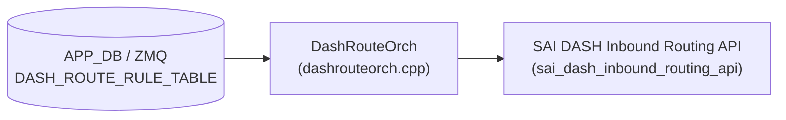

# DASH_ROUTE_RULE_TABLE テーブル

## 概要

DASH (Disaggregated APIs for SONiC Hosts) のインバウンドルーティングエントリ (Inbound Routing Rule) を保持するテーブル[^1]。

外部から DASH スイッチへ流入するパケット (インバウンド方向) が VXLAN トンネルのデカプセルを受けるルールを定義する。エントリは ENI・VNI・SIP プレフィックス (または PREFIX TAG)・優先度の 4 要素で一意に識別され、PA 検証の要否と VNET マッピングを制御する。

`DashRouteOrch::doTaskRouteRuleTable()` (`sonic-swss/orchagent/dash/dashrouteorch.cpp`) が ZMQ 経由で受信した Protobuf メッセージを解釈し、SAI の `sai_dash_inbound_routing_api` を通じてデータプレーンに `sai_inbound_routing_entry_t` を作成する。

<!-- cdb-mermaid -->
### データフロー (自動生成)



!!! note "凡例"
    APP_DB (ZMQ 経由) から SAI までの典型経路。詳細・例外は本ページ本文を参照。
<!-- /cdb-mermaid -->

## key 構造

```text
DASH_ROUTE_RULE_TABLE:<eni>:<vni>:<prefix>[:<priority>]
```

| セグメント | 型 | 説明 |
|-----------|----|----|
| `<eni>` | string | ENI の MAC アドレス文字列 (例: `F4939FEFC47E`)。`DASH_ENI_TABLE` のキーと対応 |
| `<vni>` | uint32 | VXLAN VNI。インバウンドパケットのアウターヘッダ VNI に一致するか検査する |
| `<prefix>` | string | SIP プレフィックス (CIDR 形式) または `DASH_PREFIX_TAG_TABLE` のタグ名 |
| `<priority>` | uint32 | ルール優先度 (省略可能)。省略時は `0` にフォールバック。低い値ほど高優先 |

`<priority>` フィールドは旧フォーマット互換のため省略可能。orchagent は `<prefix>` の末尾セグメントが数字のみか検査し、数字でなければ全体を `<prefix>` として扱い `priority=0` に fallback する (`dashrouteorch.cpp:605-623`)。

## フィールド

| フィールド | 型 | 必須 | デフォルト | 説明 |
|-----------|----|----|-----------|------|
| `action_type` | routing_type enum | 任意 | — | 非推奨 (deprecated)。`ROUTING_TYPE_*` を指定する旧フィールド。新規実装では key の priority フィールドを使う |
| `priority` | uint32 | 任意 | `0` | 非推奨 (deprecated)。優先度は key のセグメントに移動済み |
| `protocol` | uint32 | 任意 | `0` (any) | マッチするプロトコル番号。`0` はプロトコルを問わずすべてにマッチ |
| `vnet` | string | 任意 | 未設定 | PA 検証やマッピングに使用する VNET 名 (`DASH_VNET_TABLE` の key) |
| `pa_validation` | bool | 任意 | `false` | `true` 時: SAI に `TUNNEL_DECAP_PA_VALIDATE` を渡し PA 検証を行う。`false` 時: `TUNNEL_DECAP` のみ |
| `metering_class_or` | uint32 | 任意 | 未設定 | メータリングクラス `or` ビット (`SAI_INBOUND_ROUTING_ENTRY_ATTR_METER_CLASS_OR`) |
| `metering_class_and` | uint32 | 任意 | 未設定 | メータリングクラス `and` ビット (`SAI_INBOUND_ROUTING_ENTRY_ATTR_METER_CLASS_AND`) |
| `region` | string | 任意 | 未設定 | 任意のリージョン ID。ベンダー最適化向け文字列。orchagent の現行コードには処理なし |

## 制約

- ENI (`DASH_ENI_TABLE`) が未登録の場合、`addInboundRouting` が `false` を返しリトライ
- `vnet` を指定した場合、`DASH_VNET_TABLE` に登録済みでなければリトライ (`gVnetNameToId` に未登録)
- `sip` / `sip_mask` は key の `<prefix>` を `IpPrefix` パースして得る。不正 CIDR は例外

## 購読者

- `DashRouteOrch` (`sonic-swss/orchagent/dash/dashrouteorch.cpp`): インバウンドルーティングエントリを受信し、`sai_dash_inbound_routing_api->create_inbound_routing_entry()` でデータプレーンにエントリを作成する。CRM リソースカウンタ (`CRM_DASH_IPV4_INBOUND_ROUTING` / `CRM_DASH_IPV6_INBOUND_ROUTING`) のインクリメントも担う

## 関連 CONFIG_DB

- [`DASH_ENI_TABLE`](dash-eni.md): ENI エントリ。`eni_id` を `sai_inbound_routing_entry_t` に渡す
- [`DASH_VNET_TABLE`](dash-vnet.md): `vnet` フィールドで参照する VNET (PA 検証・マッピング)
- [`DASH_PREFIX_TAG_TABLE`](dash-acl.md): `<prefix>` にタグ名を使用する場合の参照先
- [`DASH_ROUTE_TABLE`](route.md): アウトバウンドルーティング (対となるテーブル)

<!-- cdb-exceptions -->
## 例外条件・特殊挙動

| 条件 | 挙動 |
|------|------|
| ENI が `DASH_ENI_TABLE` に未登録 | `dash_orch_->getEni()` が `nullptr` → `addInboundRouting` が `false` → リトライ |
| `vnet` 指定時に `DASH_VNET_TABLE` 未登録 | `gVnetNameToId.find()` miss → リトライ |
| protobuf メッセージが不正 | `parsePbMessage()` 失敗 → エントリを consumer から削除 (リトライなし) |
| key に `<priority>` がない (旧フォーマット) | orchagent が末尾セグメントを数字判定し、数字でなければ `priority=0` で処理を続行 |
| 同一キーのエントリが既存 | `SAI_STATUS_ITEM_ALREADY_EXISTS` → `addInboundRoutingPost` が `false` を返し bulker 再試行 |
| `pa_validation` 未設定 | proto3 bool デフォルト `false` → `SAI_INBOUND_ROUTING_ENTRY_ACTION_TUNNEL_DECAP` を設定 |
<!-- /cdb-exceptions -->

<!-- defaults -->
## フィールド暗黙デフォルト (Phase A — コード由来)

YANG / proto3 デフォルト以外の実装由来 fallback。`DashRouteOrch::addInboundRouting()` (`dashrouteorch.cpp:421-477`) の SAI 属性組み立てロジックから導出。

| フィールド | コード由来デフォルト | fallback 源 |
|-----------|-------------------|------------|
| `priority` (key) | `0` | key にセグメントがない旧フォーマット互換 — dashrouteorch.cpp:605 `priority = 0;`; 末尾が全数字でなければ prefix 全体をプレフィックスとみなし priority=0 |
| `protocol` | `0` (any) | proto3 uint32 デフォルト; HLD:613 "0 (any)" |
| `pa_validation` | `false` → `SAI_INBOUND_ROUTING_ENTRY_ACTION_TUNNEL_DECAP` | proto3 bool デフォルト=false → 三項演算子で `TUNNEL_DECAP` が選択される — dashrouteorch.cpp:450 |
| `vnet` | SAI 未設定 (属性 push なし) | `has_vnet()` false → `SAI_INBOUND_ROUTING_ENTRY_ATTR_SRC_VNET_ID` を push しない — dashrouteorch.cpp:453-458 |
| `metering_class_or` | SAI 未設定 | `has_metering_class_or()` false → push しない — dashrouteorch.cpp:460-464 |
| `metering_class_and` | SAI 未設定 | `has_metering_class_and()` false → push しない — dashrouteorch.cpp:466-470 |
| `region` | SAI 未設定 | dashrouteorch.cpp に `region` を処理するコード未確認 (HLD に記載あり) |

### 補足

- **`pa_validation` の HLD/コード乖離**: HLD (dash-sonic-hld.md:615) は "Default is set to true" と記載しているが、proto3 の `bool` フィールドのデフォルトは `false` であり、コントローラが明示的に `pa_validation=true` を送らない限り orchagent は `TUNNEL_DECAP` (PA 検証なし) で動作する。discrepancy として記録する。

- **`priority` の二重表現**: priority はキーの最終セグメントと protobuf `RouteRule.priority` フィールドの両方に存在する。orchagent はキーセグメントを正として使用し (`ctxt.priority` に代入)、protobuf フィールドは `DashDumpPlugin` の `return_fields` 参照のみに使われる。

- **`region` フィールド**: HLD にスキーマとして定義されているが、`dashrouteorch.cpp` に `region` を読み込む `has_region()` パターンは確認できない。SAI への反映なし。HLD と実装の乖離 (discrepancy) として記録する。
<!-- /defaults -->

[^1]: sonic-net/SONiC `doc/dash/dash-sonic-hld.md` §3.2.10 "ROUTE RULE TABLE - INBOUND" (ref: 49bab5b5ff0e924f1ea52b3d9db0dfa4191a7c06)
