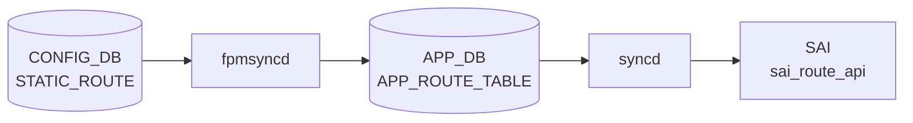

# ROUTE_TABLE (STATE_DB / APPL_STATE_DB)

## 概要

[SONiC](../../reference/glossary.md#term-sonic) には `ROUTE_TABLE` という名称のテーブルが **3 つの DB** に存在する。このページでは `orchagent` (`RouteOrch`) が書き込む **[STATE_DB](../../reference/glossary.md#term-state_db)** と **APPL_STATE_DB** の 2 テーブルを扱う。

| DB | 用途 | 書込み主体 |
|----|------|-----------|
| `APPL_DB` | [fpmsyncd](../../reference/glossary.md#term-fpmsyncd) が [FRR](../../reference/glossary.md#term-frr) 経路を書き込む（[ROUTE_TABLE (APPL_DB)](route.md) 参照） | `fpmsyncd` |
| **`STATE_DB`** | デフォルト経路 (0.0.0.0/0 / ::0/0) の存在状態のみを書き込む | `RouteOrch` |
| **`APPL_STATE_DB`** | [SAI](../../reference/glossary.md#term-sai) への経路プログラミング結果（`protocol` + `err_str`）を書き込む | `RouteOrch` via `ResponsePublisher` |

!!! warning "設定 DB ではない"
    STATE_DB / APPL_STATE_DB の `ROUTE_TABLE` はどちらも **読み取り専用の状態情報**。経路の追加・削除は APPL_DB の `ROUTE_TABLE` または CONFIG_DB の `STATIC_ROUTE` で行う。

<!-- cdb-mermaid -->
### データフロー (自動生成)



!!! note "凡例"
    CONFIG_DB から SAI までの典型経路を `docs/reference/config-db-orch-map.md` から機械生成したミニ図。詳細・例外は本ページ本文と対応表を参照。
<!-- /cdb-mermaid -->

---

## STATE_DB ROUTE_TABLE

### key 構造

```text
ROUTE_TABLE|<prefix>
```

`<prefix>` は IPv4 デフォルト経路（`0.0.0.0/0`）または IPv6 デフォルト経路（`::0/0` / `::/0`）のみ。  
一般のユニキャスト経路は [STATE_DB](../../reference/glossary.md#term-state_db) の [ROUTE_TABLE](../../reference/glossary.md#term-route_table) には書き込まれない。

### フィールド一覧

| フィールド | 型 | 取り得る値 | 説明 |
|-----------|----|-----------|----|
| `state` | string | `"ok"` / `"na"` | デフォルト経路が存在する場合 `"ok"`、削除された場合 `"na"` |

### 書き込みトリガー

`RouteOrch::updateDefRouteState(string ip, bool add)` が呼ばれたとき:

- `add=true` → `state = "ok"`（デフォルト経路をプログラム完了）
- `add=false` → `state = "na"`（デフォルト経路を削除）

<!-- defaults -->
## コード由来デフォルト詳細 (Phase A)

<!-- evidence: meta/_intermediate/cdb-flow/route-state-defaults.md -->

### STATE_DB `state` フィールド

ソース: `orchagent/routeorch.cpp` lines 287–295[^1]

```cpp
void RouteOrch::updateDefRouteState(string ip, bool add)
{
    vector<FieldValueTuple> tuples;
    string state = add?"ok":"na";
    FieldValueTuple tuple("state", state);
    tuples.push_back(tuple);

    m_stateDefaultRouteTb->set(ip, tuples);
}
```

| 条件 | `state` の値 |
|------|-------------|
| デフォルト経路を [SAI](../../reference/glossary.md#term-sai) に追加成功後 | `"ok"` |
| デフォルト経路を [SAI](../../reference/glossary.md#term-sai) から削除後 | `"na"` |
| 一般ユニキャスト経路 | **エントリ自体が存在しない** |

`"na"` は「フィールド不在」ではなく「デフォルト経路なし」という**明示的状態**である点に注意。フィールドが存在しない状態はデフォルト経路が一度もプログラムされていない初期状態のみ。

### APPL_STATE_DB `protocol` フィールド

ソース: `orchagent/routeorch.cpp` lines 3185–3202[^1]

```cpp
void RouteOrch::publishRouteState(const RouteBulkContext& ctx, const ReturnCode& status)
{
    std::vector<FieldValueTuple> fvs;

    if (ctx.is_set)
    {
        fvs.emplace_back("protocol", ctx.protocol);
    }

    m_publisher.publish(APP_ROUTE_TABLE_NAME, ctx.key, fvs, status, replace);
}
```

- SET 操作時: `protocol` フィールドを `ctx.protocol` の値で書き込む
- DEL 操作時: `fvs` が空 → `ResponsePublisher` がエントリ全体を APPL_STATE_DB から削除
- `ctx.protocol` の初期値は `""` で、[APPL_DB](../../reference/glossary.md#term-appl_db) の `protocol` フィールドが存在する場合のみ上書きされる

| [APPL_DB](../../reference/glossary.md#term-appl_db) の `protocol` フィールド | APPL_STATE_DB の `protocol` 値 |
|---------------------------------|-------------------------------|
| `"bgp"` 等が存在する | `"bgp"` 等（そのままコピー） |
| フィールド不在 | `""` （空文字列） |

### APPL_STATE_DB `err_str` フィールド

`ResponsePublisher::publish()` が自動付与するフィールド[^2]:

```cpp
swss::FieldValueTuple err_str("err_str", PrependedComponent(status) + status.message());
intent_attrs_copy.insert(intent_attrs_copy.begin(), err_str);
```

| SAI 結果 | `err_str` の値 |
|---------|----------------|
| 成功 | `"SWSS_RC_SUCCESS"` |
| SAI エラー | `"[SAI] <エラーメッセージ>"` |
| その他失敗 | `"<エラーメッセージ>"` |

成功時は APPL_STATE_DB に `protocol` と `err_str` の 2 フィールドが書き込まれる。失敗時は通知チャンネルに送出されるが APPL_STATE_DB への書き込みはスキップされる。

<!-- /defaults -->

<!-- ordering -->
## 書込み順依存 (Phase B)

> 証跡: `meta/_intermediate/cdb-flow/route-state-ordering.md`

[STATE_DB](../../reference/glossary.md#term-state_db) / APPL_STATE_DB への `ROUTE_TABLE` 書き込みは `RouteOrch` が SAI 操作を完了させた後に行われる。以下に強制先行条件と推奨順序を示す。

### 強制先行条件

| 順序 | 先行リソース | 後続 | 違反時の挙動 | evidence |
|------|-------------|------|-------------|---------|
| 1 | `PORT` 初期化完了（`allPortsReady()`） | STATE_DB / APPL_STATE_DB への動的書き込み | `RouteOrch::doTask()` が即 `return`。[APPL_DB](../../reference/glossary.md#term-appl_db) の [ROUTE_TABLE](../../reference/glossary.md#term-route_table) イベントを処理しないため書き込みも発生しない | `routeorch.cpp:609-611` |
| 2 | SAI `create_route_entry()` 成功 | `STATE_DB ROUTE_TABLE` への `state=ok` 書き込み | SAI 失敗時は `updateDefRouteState()` が呼ばれず STATE_DB が未更新のまま。デフォルト経路のみが対象 | `routeorch.cpp:2700-2703` |

### 推奨先行条件

| 順序 | 先行リソース | 後続 | 理由 | evidence |
|------|-------------|------|------|---------|
| 3 | SAI バルク操作完了 | `APPL_STATE_DB ROUTE_TABLE` への `err_str`/`protocol` 書き込み | `publishRouteState()` はバルク応答処理後に呼ばれる。SAI 失敗時も `err_str` が書き込まれる点が STATE_DB と異なる | `routeorch.cpp:920-923, 2729, 2970` |

### 特殊シーケンス

| 操作 | タイミング | 根拠 |
|------|---------|------|
| `STATE_DB ROUTE_TABLE\|0.0.0.0/0 state=na` の初期書き込み | `RouteOrch` コンストラクタ実行時（`allPortsReady()` 不要） | orchagent 起動直後から `state=na` が存在する。ポート初期化前でも確認可能 | <!-- evidence: routeorch.cpp:126-130, 155-156 --> |
| `STATE_DB state=na` 書き込み（DEL パス） | SAI `set_route_entry` で packet_action を DROP に変更成功後 | DEL 失敗時は `state=na` にならず `state=ok` のまま残る | <!-- evidence: routeorch.cpp:2856 --> |

<!-- /ordering -->

<!-- cross-refs -->
## 他コンポーネントとの参照関係 (Phase C)

<!-- evidence: meta/_intermediate/cdb-flow/route-state-cross-refs.md -->

STATE_DB / APPL_STATE_DB の `ROUTE_TABLE` は **書き込み専用**（`RouteOrch` のみが書き込む）。読み取り側は以下の通り。

### STATE_DB `ROUTE_TABLE` の読み取り主体

#### sonic-linkmgrd (DbInterface)

`sonic-linkmgrd/src/DbInterface.cpp:1835` にて `SubscriberStateTable` でデフォルト経路の有無を購読する[^cr1]:

```cpp
swss::SubscriberStateTable stateDbRouteTable(stateDbPtr.get(), STATE_ROUTE_TABLE_NAME);
```

`processDefaultRouteStateNotification()` が `0.0.0.0/0` / `::/0` の `state` フィールドを取り出し、`MuxManager::addOrUpdateDefaultRouteState()` へ渡す。

| `state` 値 | リンクプローバーへの影響 |
|-----------|----------------------|
| `"ok"` | リンクプローバーを再起動 |
| `"na"` | リンクプローバーを停止 |

デュアルTOR ([MUX](../../reference/glossary.md#term-mux)) 環境でのみ意味を持つ。非 [MUX](../../reference/glossary.md#term-mux) 環境では subscriberは存在するが実際の状態遷移は発生しない[^cr1]。

### APPL_STATE_DB `ROUTE_TABLE` の読み取り主体

#### fpmsyncd (RouteSync::onRouteResponse)

`fpmsyncd.cpp:78` で `APPL_DB_ROUTE_TABLE_RESPONSE_CHANNEL` を `NotificationConsumer` で購読し、`RouteSync::onRouteResponse()` を呼び出す[^cr2]:

```cpp
const auto routeResponseChannelName = std::string("APPL_DB_") + APP_ROUTE_TABLE_NAME + "_RESPONSE_CHANNEL";
routeResponseChannel = std::make_unique<NotificationConsumer>(&applStateDb, routeResponseChannelName);
```

受信した通知の `err_str=SWSS_RC_SUCCESS` かつ `protocol` フィールドあり（SET 操作）の場合、[FRR](../../reference/glossary.md#term-frr) [zebra](../../reference/glossary.md#term-zebra) へ netlink `RTM_F_OFFLOAD` フラグを送信する[^cr2]。この動作は **[BGP](../../reference/glossary.md#term-bgp) suppress feature** (`isSuppressionEnabled()`) が有効な場合のみ実際の経路制御に影響する。

#### route_check.py (自動修復)

`route_check.py:767-773` が APPL_STATE_DB 未反映経路を検出した際、`NotificationProducer` で同チャンネルへ `SWSS_RC_SUCCESS` 応答を強制注入する[^cr3]。これにより [orchagent](../../reference/glossary.md#term-orchagent) が応答を送れなかった場合でも [FRR](../../reference/glossary.md#term-frr) [zebra](../../reference/glossary.md#term-zebra) へ offload フラグが届く自動修復が行われる。

### 参照関係サマリ

| DB / テーブル | 書込み主体 | 読み取り主体 | 用途 |
|-------------|----------|------------|------|
| STATE_DB `ROUTE_TABLE` | `RouteOrch` | `sonic-linkmgrd` | デュアルTOR リンクプローバー制御 |
| APPL_STATE_DB `ROUTE_TABLE` (RESPONSE_CHANNEL) | `RouteOrch` (via `ResponsePublisher`) | `fpmsyncd` | FRR へ RTM_F_OFFLOAD 通知 |
| APPL_STATE_DB `ROUTE_TABLE` (RESPONSE_CHANNEL) | `route_check.py` (注入) | `fpmsyncd` | 自動修復時の offload 強制送信 |

[^cr1]: sonic-[linkmgrd](../../reference/glossary.md#term-linkmgrd) DbInterface: `src/DbInterface.cpp`. <https://github.com/sonic-net/sonic-linkmgrd/blob/master/src/DbInterface.cpp#L1835>
[^cr2]: [fpmsyncd](../../reference/glossary.md#term-fpmsyncd) RouteSync: `fpmsyncd/fpmsyncd.cpp`, `fpmsyncd/routesync.cpp`. <https://github.com/sonic-net/sonic-swss/blob/4305596156d70e9797e8a881b3d19b46de0bce0d/fpmsyncd/fpmsyncd.cpp#L78>
[^cr3]: route_check.py 自動修復: `scripts/route_check.py`. <https://github.com/sonic-net/sonic-utilities/blob/master/scripts/route_check.py#L767>

<!-- /cross-refs -->

<!-- failure -->
## 失敗時の挙動 (Phase D)

<!-- evidence: meta/_intermediate/cdb-flow/route-state-failure.md -->

`RouteOrch` が SAI 操作に失敗した場合、STATE_DB と APPL_STATE_DB への書き込みは異なる挙動を示す。

### STATE_DB `ROUTE_TABLE` — 失敗時は未更新

SAI `create_route_entry()` 失敗（ADD パス）:

```cpp
// routeorch.cpp:2472-2526
if (status != SAI_STATUS_SUCCESS)
{
    task_process_status handle_status = handleSaiCreateStatus(SAI_API_ROUTE, status);
    if (handle_status != task_success)
    {
        return parseHandleSaiStatusFailure(handle_status);
    }
}
// updateDefRouteState() は成功パスにのみ存在する (routeorch.cpp:2700-2703)
```

SAI `set_route_entry` 失敗（DEL パス、デフォルト経路のみ）:

```cpp
// routeorch.cpp:2833-2856
if (status != SAI_STATUS_SUCCESS)
{
    return parseHandleSaiStatusFailure(handle_status);
}
// ...成功後にのみ:
updateDefRouteState(ipPrefix.to_string());  // state=na
```

| 失敗シナリオ | STATE_DB の結果 |
|------------|----------------|
| SAI create 失敗 → リトライ | `state` 未更新（古い値残留） |
| SAI create 失敗 → 恒久エラー | `state` 未更新のまま破棄 |
| SAI set(DEL) 失敗 | `state=ok` のまま残留 |

### APPL_STATE_DB `ROUTE_TABLE` — SAI 成功時のみ書き込む（通常パス）

通常パスでは `publishRouteState()` は SAI バルク操作完了後にのみ呼ばれる。SAI 失敗時に `return false`（リトライ）が返された場合は `publishRouteState()` は呼ばれず、APPL_STATE_DB への書き込みは発生しない:

| シナリオ | APPL_STATE_DB の結果 |
|---------|---------------------|
| SAI 成功 | `protocol` + `err_str=SWSS_RC_SUCCESS` を書き込む |
| SAI 失敗 → `return false` (リトライ) | 書き込まれない（前回エントリが残留） |
| SAI 失敗 → `task_failed` (恒久エラー) | 書き込まれない（エントリ破棄） |
| 特殊パス (loopback / duplicate SET) | SAI 呼ばず直接 `publishRouteState()` を呼ぶ[^d1] |

### リトライ機構

```
parseHandleSaiStatusFailure(task_need_retry) → return false
  → エントリが m_toSync に残る
  → 次の doTask() サイクルで再処理

parseHandleSaiStatusFailure(task_failed) → return true
  → エントリを m_toSync から破棄
  → STATE_DB / APPL_STATE_DB は古い状態のまま
```

[^d1]: loopback インタフェース向け経路・重複 SET・fullmask subnet 経路: `orchagent/routeorch.cpp:923, 1050, 1090`.

<!-- /failure -->

<!-- constants -->
## ハードコード定数 (Phase E)

<!-- evidence: meta/_intermediate/cdb-flow/route-state-constants.md -->

STATE_DB / APPL_STATE_DB への `ROUTE_TABLE` 書き込みで使用される定数はすべてソースコードにハードコードされており、設定ファイル・環境変数・`DEVICE_METADATA` 等での上書き手段は提供されていない。

### テーブル名定数

| 定数名 | 値 | 定義箇所 |
|--------|----|---------| 
| `STATE_ROUTE_TABLE_NAME` | `"ROUTE_TABLE"` | `common/schema.h:494`[^3] |
| `APP_ROUTE_TABLE_NAME` | `"ROUTE_TABLE"` | `common/schema.h:47`[^3] |

STATE_DB と APPL_STATE_DB のテーブル名はいずれも `"ROUTE_TABLE"` で固定。

### `state` フィールド値リテラル

ソース: `orchagent/routeorch.cpp:290-291`[^1]

```cpp
string state = add ? "ok" : "na";
FieldValueTuple tuple("state", state);
```

| 値 | 意味 |
|----|------|
| `"ok"` | デフォルト経路が SAI に登録済み |
| `"na"` | デフォルト経路が SAI から削除済み（または未プログラム） |

`"ok"` / `"na"` はソースコード直書きリテラルで、外部から変更不可。

### `err_str` フィールドのプレフィックス定数

ソース: `orchagent/response_publisher.cpp:18-19`[^2]

```cpp
constexpr char *kOrchagentComponent = "[OrchAgent] ";
constexpr char *kSaiComponent = "[SAI] ";
```

| 状況 | `err_str` の形式 |
|------|----------------|
| SAI 操作成功 | `"SWSS_RC_SUCCESS"` (プレフィックスなし) |
| SAI エラー | `"[SAI] "` + SAI エラーメッセージ |
| OrchAgent 内部エラー | `"[OrchAgent] "` + エラーメッセージ |

`"[SAI] "` / `"[OrchAgent] "` はいずれも `constexpr` で固定。バイナリの再ビルドなしに変更できない。

<!-- /constants -->

<!-- side-effects -->
## 副作用 (Phase F)

<!-- evidence: meta/_intermediate/cdb-flow/route-state-side.md -->

STATE_DB / APPL_STATE_DB への `ROUTE_TABLE` 書き込みは、以下のコンポーネントに連鎖的な副作用をもたらす。

### APPL_STATE_DB 書き込み → FIB suppression フィードバック（fpmsyncd）

`publishRouteState()` が APPL_STATE_DB `ROUTE_TABLE` に書き込む際、`ResponsePublisher` が同時に `APPL_DB_ROUTE_TABLE_RESPONSE_CHANNEL` へ通知を送出する。`fpmsyncd` は `suppress-fib-pending=enabled` 設定時にこのチャンネルを購読し、SAI プログラミング結果を FRR の [BGP](../../reference/glossary.md#term-bgp) FIB suppression 機能へフィードバックする[^4]。

```
APPL_STATE_DB ROUTE_TABLE 書込み (err_str=SWSS_RC_SUCCESS)
  → APPL_DB_ROUTE_TABLE_RESPONSE_CHANNEL 通知
    → fpmsyncd: FRR への suppress 解除
```

- SAI 成功時: `err_str=SWSS_RC_SUCCESS` → FRR が経路を [BGP](../../reference/glossary.md#term-bgp) ピアにアドバタイズ可能になる
- SAI 失敗時: `err_str=[SAI] <エラー>` → FRR は経路を suppress 状態のまま保持し続ける

この動作は `CONFIG_DB DEVICE_METADATA|localhost suppress-fib-pending=enabled` が設定されている場合のみ有効。

### APPL_STATE_DB 書き込みスキップ → route_check.py アラート

[orchagent](../../reference/glossary.md#term-orchagent) が SAI 操作失敗等で APPL_STATE_DB への書き込みをスキップした場合、`route_check.py` が APPL_DB と APPL_STATE_DB の不整合を `missed_ROUTE_TABLE_routes` としてアラートを記録する[^4]。

### STATE_DB `state` 書き込みのタイミングと NextHop Observer 通知

デフォルト経路の SAI 登録/削除成功後、`notifyNextHopChangeObservers()` が呼ばれた直後に `updateDefRouteState()` が STATE_DB を更新する（`routeorch.cpp:2703, 2726`）。このため MirrorOrch / NatOrch 等の Observer はデフォルト経路変更を STATE_DB 書き込みより前に受け取る。

### レスポンス通知のバッチ遅延

RouteOrch は 1 回の `doTask()` イテレーションで複数 [ROUTE_TABLE](../../reference/glossary.md#term-route_table) エントリをバルク処理し、全 SAI 操作完了後に `m_publisher.flush()` する（`routeorch.cpp:1227` コメント参照）。APPL_STATE_DB への書き込みとレスポンスチャンネル通知はイテレーション単位で遅延するため、短時間に大量の経路を書き込んだ場合は通知が数百ミリ秒単位で遅れることがある。

| 副作用 | トリガー | 有効条件 |
|--------|----------|---------|
| RESPONSE_CHANNEL 通知 → [fpmsyncd](../../reference/glossary.md#term-fpmsyncd) FIB suppression アンロック | APPL_STATE_DB SET | `suppress-fib-pending=enabled` 時のみ |
| route_check.py `missed_ROUTE_TABLE_routes` アラート | APPL_STATE_DB 書き込みスキップ | 常時（route_check.py 実行時） |
| NextHop Observer 通知（MirrorOrch / NatOrch 等） | updateDefRouteState() 直前 | デフォルト経路変更時のみ |
| APPL_STATE_DB 通知のバッチ遅延 | doTask バルク flush | 常時 |

<!-- /side-effects -->

<!-- pubsub -->
## Redis 通知メカニズム (Phase G)

<!-- evidence: meta/_intermediate/cdb-flow/route-state-pubsub.md -->

STATE_DB / APPL_STATE_DB の `ROUTE_TABLE` への書き込みには、それぞれ異なる通知経路が用いられる。

### APPL_STATE_DB — ResponsePublisher と RESPONSE_CHANNEL

`publishRouteState()` → `ResponsePublisher::publish()` は APPL_STATE_DB への書き込みと同時に通知チャンネルへ送出する[^2]:

```cpp
// response_publisher.cpp:104, 118-120
std::string response_channel = "APPL_DB_" + table + "_RESPONSE_CHANNEL";
swss::NotificationProducer notificationProducer{
    m_ntf_pipe.get(), response_channel, m_buffered};
notificationProducer.send(status.codeStr(), key, intent_attrs_copy);
```

| 項目 | 値 |
|------|-----|
| チャンネル名 | `APPL_DB_ROUTE_TABLE_RESPONSE_CHANNEL` |
| DB | APPL_STATE_DB |
| ペイロード (SET) | `{err_str, protocol}` |
| ペイロード (DEL) | `{err_str}` のみ |
| バッファリング | `m_publisher.setBuffered(true)` (`routeorch.cpp:57`) で有効化。`doTask()` 末尾の `m_publisher.flush()` (`routeorch.cpp:1231`) で一括送出 |

> バッファなし送出では OrchDaemon 周期フラッシュ（最大 1 秒）まで通知が遅延するため、明示的な `flush()` が必要（`routeorch.cpp:1228` コメント参照）。

### STATE_DB — Table::set() + keyspace notification

STATE_DB の `ROUTE_TABLE` は `ResponsePublisher` を経由せず `swss::Table::set()` で直接書き込む (`routeorch.cpp:294`)。アプリケーションレベルの通知チャンネルは存在せず、[Redis](../../reference/glossary.md#term-redis) の keyspace notification 機能（`__keyspace@6__:ROUTE_TABLE|<ip>`）を利用した `SubscriberStateTable` で購読される。

### fpmsyncd による RESPONSE_CHANNEL 購読

`fpmsyncd` は `suppress-fib-pending=enabled` の場合のみ `NotificationConsumer` でチャンネルを購読し、主ループで受信する[^p1]:

```cpp
// fpmsyncd.cpp:78, 116, 307-317
const auto routeResponseChannelName = std::string("APPL_DB_") + APP_ROUTE_TABLE_NAME + "_RESPONSE_CHANNEL";
routeResponseChannel = std::make_unique<NotificationConsumer>(&applStateDb, routeResponseChannelName);
// ...受信後:
routeResponseChannel->pops(notifications);
sync.onRouteResponse(key, fieldValues);
```

`RouteSync::onRouteResponse()` (`routesync.cpp:3165`) の処理条件:

| 条件 | 動作 |
|------|------|
| `err_str == "SWSS_RC_SUCCESS"` かつ `protocol` フィールドあり (SET) | `sendOffloadReply()` → FRR [zebra](../../reference/glossary.md#term-zebra) へ `RTM_F_OFFLOAD` 付き netlink 送信 |
| DEL 操作 (`protocol` フィールドなし) | 無視（suppress 継続には影響しない） |
| SAI 失敗 (`err_str != "SWSS_RC_SUCCESS"`) | 無視（経路は suppress 状態を維持） |
| `protocol` が空文字列 | 無視（FRR 管轄外の経路） |

### suppress-fib-pending の動的切り替え

`CONFIG_DB DEVICE_METADATA|localhost suppress-fib-pending` が実行時に変更された場合、`fpmsyncd` は `SubscriberStateTable` でこれを検知し即時対応する (`fpmsyncd.cpp:285-302`):

- `enabled` に変更 → `NotificationConsumer` を生成し `s.addSelectable()` で登録
- 無効化 → 既存 suppress 経路を一括 offloaded にマーク後、`routeResponseChannel.reset()` で購読解除

### 購読方式サマリ

| チャンネル / テーブル | 購読方式 | 購読主体 | 有効条件 |
|---------------------|---------|---------|---------|
| `APPL_DB_ROUTE_TABLE_RESPONSE_CHANNEL` | `NotificationConsumer` | `fpmsyncd` | `suppress-fib-pending=enabled` 時のみ |
| `STATE_DB ROUTE_TABLE` (keyspace) | `SubscriberStateTable` | `sonic-linkmgrd` | 常時（[MUX](../../reference/glossary.md#term-mux) 環境） |

[^p1]: fpmsyncd RESPONSE_CHANNEL 購読: `fpmsyncd/fpmsyncd.cpp`. <https://github.com/sonic-net/sonic-swss/blob/4305596156d70e9797e8a881b3d19b46de0bce0d/fpmsyncd/fpmsyncd.cpp#L78>

<!-- /pubsub -->

<!-- platform -->
## プラットフォーム差分 (Phase H)

<!-- evidence: meta/_intermediate/cdb-flow/route-state-platform.md -->

STATE_DB / APPL_STATE_DB への `ROUTE_TABLE` 書き込みロジック自体はプラットフォーム非依存だが、RouteOrch の初期化時とフロウカウンタ機能でプラットフォーム固有の挙動が存在する。

### Mellanox — ECMP グループ最大数の補正

`RouteOrch` コンストラクタ (`routeorch.cpp:78-87`) で Mellanox プラットフォームのみ `m_maxNextHopGroupCount` を補正する[^1]:

```cpp
char *platform = getenv("platform");
if (platform && strstr(platform, MLNX_PLATFORM_SUBSTRING))  // "mellanox"
{
    m_maxNextHopGroupCount /= DEFAULT_MAX_ECMP_GROUP_SIZE;   // ÷ 32
}
```

SAI が `SAI_SWITCH_ATTR_NUMBER_OF_ECMP_GROUPS` として返す値は「[ECMP](../../reference/glossary.md#term-ecmp) サイズ 1 のときの最大値」であるため、実際の最大 [ECMP](../../reference/glossary.md#term-ecmp) グループ数（サイズ 32 前提）に補正している。STATE_DB / APPL_STATE_DB への書き込みパスに直接影響はないが、[ECMP](../../reference/glossary.md#term-ecmp) 収容上限の低下により大規模環境での経路プログラミング失敗率が変化しうる。

### VoQ Chassis — ECMP メンバー上限 128 固定

`routeorch.cpp:108-118` で `gMySwitchType == "voq"` のとき SAI の ECMP メンバー上限を 128 に制限する[^1]。VoQ 分散スイッチでの ECMP 不均衡を防ぐための対策で、STATE_DB / APPL_STATE_DB 書き込みロジックには差分なし。

### Route Flow Counter — SAI 能力のプラットフォーム依存

`FlowCounterRouteOrch::initRouteFlowCounterCapability()` (`flowcounterrouteorch.cpp:166-180`) が [orchagent](../../reference/glossary.md#term-orchagent) 起動時に SAI へ `sai_object_type_get_availability(SAI_OBJECT_TYPE_COUNTER, ...)` を問い合わせ、結果を STATE_DB に書き込む:

| SAI 応答 | `STATE_DB FLOW_COUNTER_CAPABILITY_TABLE\|route` | 副次書き込みへの影響 |
|---------|-----------------------------------------------|---------------------|
| サポートあり | `support=true` | `COUNTERS_ROUTE_NAME_MAP` 等への書き込み **発生** |
| サポートなし | `support=false` | 書き込み **発生しない** |

`support=false` のプラットフォーム（ソフトウェア [ASIC](../../reference/glossary.md#term-asic)、一部ハードウェア [ASIC](../../reference/glossary.md#term-asic)）では、route-state.md の副作用セクションで述べた `COUNTERS_ROUTE_NAME_MAP` / `COUNTERS_ROUTE_TO_PATTERN_MAP` への副次書き込みが完全にスキップされる。

### SmartSwitch DPU / その他

`updateDefRouteState()` および `publishRouteState()` は `gMySwitchType` を参照しない。[DPU](../../reference/glossary.md#term-dpu) / T2 / 標準 [NPU](../../reference/glossary.md#term-npu) のいずれも同一コードパスで STATE_DB / APPL_STATE_DB を更新する。

### プラットフォーム差分サマリ

| プラットフォーム | 差分内容 | STATE_DB / APPL_STATE_DB への直接影響 |
|-----------------|---------|--------------------------------------|
| Mellanox | ECMP グループ最大数を 1/32 に補正 | なし（間接的に SAI 失敗率に影響する可能性） |
| VoQ Chassis | ECMP メンバー上限 128 固定 | なし（同上） |
| Flow Counter 非対応 [ASIC](../../reference/glossary.md#term-asic) | `FLOW_COUNTER_CAPABILITY_TABLE\|route support=false` | `COUNTERS_ROUTE_*_MAP` への副次書き込みが発生しない |
| [SmartSwitch](../../reference/glossary.md#term-smartswitch) [DPU](../../reference/glossary.md#term-dpu) / 標準 [NPU](../../reference/glossary.md#term-npu) | 差分なし | なし |

<!-- /platform -->

---

## APPL_STATE_DB ROUTE_TABLE

### key 構造

```text
ROUTE_TABLE:<prefix>
ROUTE_TABLE:<vrf_name>:<prefix>
```

APPL_DB の `ROUTE_TABLE` と同一キー空間。orchagent が SAI プログラミングに成功した後にのみ書き込まれる。

### フィールド一覧

| フィールド | 型 | 書込み条件 | 説明 |
|-----------|----|-----------|----|
| `protocol` | string | SET 操作かつ SAI 成功時 | APPL_DB から引き継いだ経路プロトコル名（`bgp`、`static`、`kernel` 等、または `""`） |
| `err_str` | string | SET / DEL 操作時 | SAI 操作結果メッセージ。成功時 `"SWSS_RC_SUCCESS"` |

---

## 購読者 (consumer)

| プロセス | 参照 DB / テーブル | 用途 |
|---------|-----------------|------|
| `fpmsyncd` | APPL_STATE_DB `ROUTE_TABLE` | SAI プログラミング結果を RESPONSE_CHANNEL 経由で受け取り、FRR へフィードバック |
| `route_check.py` | APPL_STATE_DB `ROUTE_TABLE` | route_check が APPL_DB と APPL_STATE_DB の整合を確認 |
| BGP suppress / error-handling | STATE_DB `ROUTE_TABLE` | デフォルト経路の有無に基づく advertise 制御 |

## 関連リファレンス

- APPL_DB: [`ROUTE_TABLE (APPL_DB)`](route.md) — fpmsyncd が書き込む経路テーブル
- [CONFIG_DB](../../reference/glossary.md#term-config_db): [`STATIC_ROUTE`](static-route.md) — 静的経路の設定元

## 引用元

[^1]: RouteOrch STATE/APPL_STATE 書込み実装: `orchagent/routeorch.cpp`. <https://github.com/sonic-net/sonic-swss/blob/4305596156d70e9797e8a881b3d19b46de0bce0d/orchagent/routeorch.cpp#L287>
[^2]: ResponsePublisher err_str 付与: `orchagent/response_publisher.cpp`. <https://github.com/sonic-net/sonic-swss/blob/4305596156d70e9797e8a881b3d19b46de0bce0d/orchagent/response_publisher.cpp#L102>
[^3]: STATE_ROUTE_TABLE_NAME 定数: `common/schema.h`. <https://github.com/sonic-net/sonic-swss-common/blob/158de8d3463ff4b841653f6d57190bb142b80d9c/common/schema.h#L494>
[^4]: fpmsyncd FIB suppression / route_check.py: `fpmsyncd/fpmsyncd.cpp`. <https://github.com/sonic-net/sonic-swss/blob/4305596156d70e9797e8a881b3d19b46de0bce0d/fpmsyncd/fpmsyncd.cpp#L78>

<!-- ops-hint -->
## 運用ヒント

### 確認コマンド

```bash
# STATE_DB のデフォルト経路状態を確認
sonic-db-cli STATE_DB hgetall 'ROUTE_TABLE|0.0.0.0/0'
sonic-db-cli STATE_DB hgetall 'ROUTE_TABLE|::/0'

# APPL_STATE_DB の経路プログラミング結果を確認
sonic-db-cli APPL_STATE_DB hgetall 'ROUTE_TABLE:10.0.0.0/24'

# route_check.py でテーブル整合確認
sudo route_check.py
```

### 典型エントリ例

```
# STATE_DB: デフォルト経路あり
STATE_DB ROUTE_TABLE|0.0.0.0/0
  state: ok

# STATE_DB: デフォルト経路なし（削除後）
STATE_DB ROUTE_TABLE|0.0.0.0/0
  state: na

# APPL_STATE_DB: BGP 経路のプログラミング成功
APPL_STATE_DB ROUTE_TABLE:10.1.0.0/24
  err_str: SWSS_RC_SUCCESS
  protocol: bgp
```

### よくある問題

- STATE_DB の `state=na` が残る → デフォルト経路が FRR から削除されたが APPL_DB からも消えているか確認（`sonic-db-cli APPL_DB hgetall 'ROUTE_TABLE:0.0.0.0/0'`）
- APPL_STATE_DB にエントリがない → SAI プログラミングに失敗している可能性。`/var/log/syslog` の orchagent ログで `err_str` を確認
<!-- /ops-hint -->

<!-- glossary-links-injected: 275148f26051 -->
