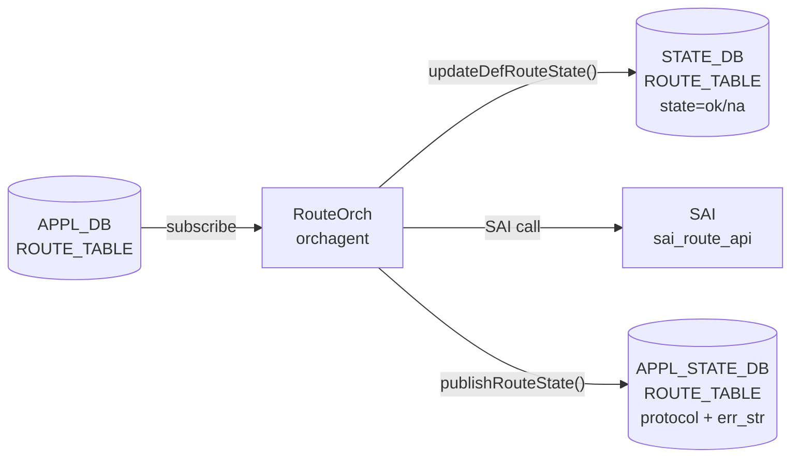

# ROUTE_TABLE (STATE_DB / APPL_STATE_DB)

## 概要

SONiC には `ROUTE_TABLE` という名称のテーブルが **3 つの DB** に存在する。このページでは `orchagent` (`RouteOrch`) が書き込む **STATE_DB** と **APPL_STATE_DB** の 2 テーブルを扱う。

| DB | 用途 | 書込み主体 |
|----|------|-----------|
| `APPL_DB` | fpmsyncd が FRR 経路を書き込む（[ROUTE_TABLE (APPL_DB)](route.md) 参照） | `fpmsyncd` |
| **`STATE_DB`** | デフォルト経路 (0.0.0.0/0 / ::0/0) の存在状態のみを書き込む | `RouteOrch` |
| **`APPL_STATE_DB`** | SAI への経路プログラミング結果（`protocol` + `err_str`）を書き込む | `RouteOrch` via `ResponsePublisher` |

!!! warning "設定 DB ではない"
    STATE_DB / APPL_STATE_DB の `ROUTE_TABLE` はどちらも **読み取り専用の状態情報**。経路の追加・削除は APPL_DB の `ROUTE_TABLE` または CONFIG_DB の `STATIC_ROUTE` で行う。

<!-- cdb-mermaid -->
### データフロー



<!-- /cdb-mermaid -->

---

## STATE_DB ROUTE_TABLE

### key 構造

```text
ROUTE_TABLE|<prefix>
```

`<prefix>` は IPv4 デフォルト経路（`0.0.0.0/0`）または IPv6 デフォルト経路（`::0/0` / `::/0`）のみ。  
一般のユニキャスト経路は STATE_DB の ROUTE_TABLE には書き込まれない。

### フィールド一覧

| フィールド | 型 | 取り得る値 | 説明 |
|-----------|----|-----------|----|
| `state` | string | `"ok"` / `"na"` | デフォルト経路が存在する場合 `"ok"`、削除された場合 `"na"` |

### 書き込みトリガー

`RouteOrch::updateDefRouteState(string ip, bool add)` が呼ばれたとき:

- `add=true` → `state = "ok"`（デフォルト経路をプログラム完了）
- `add=false` → `state = "na"`（デフォルト経路を削除）

<!-- defaults -->
## コード由来デフォルト詳細 (Phase A)

<!-- evidence: meta/_intermediate/cdb-flow/route-state-defaults.md -->

### STATE_DB `state` フィールド

ソース: `orchagent/routeorch.cpp` lines 287–295[^1]

```cpp
void RouteOrch::updateDefRouteState(string ip, bool add)
{
    vector<FieldValueTuple> tuples;
    string state = add?"ok":"na";
    FieldValueTuple tuple("state", state);
    tuples.push_back(tuple);

    m_stateDefaultRouteTb->set(ip, tuples);
}
```

| 条件 | `state` の値 |
|------|-------------|
| デフォルト経路を SAI に追加成功後 | `"ok"` |
| デフォルト経路を SAI から削除後 | `"na"` |
| 一般ユニキャスト経路 | **エントリ自体が存在しない** |

`"na"` は「フィールド不在」ではなく「デフォルト経路なし」という**明示的状態**である点に注意。フィールドが存在しない状態はデフォルト経路が一度もプログラムされていない初期状態のみ。

### APPL_STATE_DB `protocol` フィールド

ソース: `orchagent/routeorch.cpp` lines 3185–3202[^1]

```cpp
void RouteOrch::publishRouteState(const RouteBulkContext& ctx, const ReturnCode& status)
{
    std::vector<FieldValueTuple> fvs;

    if (ctx.is_set)
    {
        fvs.emplace_back("protocol", ctx.protocol);
    }

    m_publisher.publish(APP_ROUTE_TABLE_NAME, ctx.key, fvs, status, replace);
}
```

- SET 操作時: `protocol` フィールドを `ctx.protocol` の値で書き込む
- DEL 操作時: `fvs` が空 → `ResponsePublisher` がエントリ全体を APPL_STATE_DB から削除
- `ctx.protocol` の初期値は `""` で、APPL_DB の `protocol` フィールドが存在する場合のみ上書きされる

| APPL_DB の `protocol` フィールド | APPL_STATE_DB の `protocol` 値 |
|---------------------------------|-------------------------------|
| `"bgp"` 等が存在する | `"bgp"` 等（そのままコピー） |
| フィールド不在 | `""` （空文字列） |

### APPL_STATE_DB `err_str` フィールド

`ResponsePublisher::publish()` が自動付与するフィールド[^2]:

```cpp
swss::FieldValueTuple err_str("err_str", PrependedComponent(status) + status.message());
intent_attrs_copy.insert(intent_attrs_copy.begin(), err_str);
```

| SAI 結果 | `err_str` の値 |
|---------|----------------|
| 成功 | `"SWSS_RC_SUCCESS"` |
| SAI エラー | `"[SAI] <エラーメッセージ>"` |
| その他失敗 | `"<エラーメッセージ>"` |

成功時は APPL_STATE_DB に `protocol` と `err_str` の 2 フィールドが書き込まれる。失敗時は通知チャンネルに送出されるが APPL_STATE_DB への書き込みはスキップされる。

<!-- /defaults -->

<!-- ordering -->
## 書込み順依存 (Phase B)

> 証跡: `meta/_intermediate/cdb-flow/route-state-ordering.md`

STATE_DB / APPL_STATE_DB への `ROUTE_TABLE` 書き込みは `RouteOrch` が SAI 操作を完了させた後に行われる。以下に強制先行条件と推奨順序を示す。

### 強制先行条件

| 順序 | 先行リソース | 後続 | 違反時の挙動 | evidence |
|------|-------------|------|-------------|---------|
| 1 | `PORT` 初期化完了（`allPortsReady()`） | STATE_DB / APPL_STATE_DB への動的書き込み | `RouteOrch::doTask()` が即 `return`。APPL_DB の ROUTE_TABLE イベントを処理しないため書き込みも発生しない | `routeorch.cpp:609-611` |
| 2 | SAI `create_route_entry()` 成功 | `STATE_DB ROUTE_TABLE` への `state=ok` 書き込み | SAI 失敗時は `updateDefRouteState()` が呼ばれず STATE_DB が未更新のまま。デフォルト経路のみが対象 | `routeorch.cpp:2700-2703` |

### 推奨先行条件

| 順序 | 先行リソース | 後続 | 理由 | evidence |
|------|-------------|------|------|---------|
| 3 | SAI バルク操作完了 | `APPL_STATE_DB ROUTE_TABLE` への `err_str`/`protocol` 書き込み | `publishRouteState()` はバルク応答処理後に呼ばれる。SAI 失敗時も `err_str` が書き込まれる点が STATE_DB と異なる | `routeorch.cpp:920-923, 2729, 2970` |

### 特殊シーケンス

| 操作 | タイミング | 根拠 |
|------|---------|------|
| `STATE_DB ROUTE_TABLE\|0.0.0.0/0 state=na` の初期書き込み | `RouteOrch` コンストラクタ実行時（`allPortsReady()` 不要） | orchagent 起動直後から `state=na` が存在する。ポート初期化前でも確認可能 | <!-- evidence: routeorch.cpp:126-130, 155-156 --> |
| `STATE_DB state=na` 書き込み（DEL パス） | SAI `set_route_entry` で packet_action を DROP に変更成功後 | DEL 失敗時は `state=na` にならず `state=ok` のまま残る | <!-- evidence: routeorch.cpp:2856 --> |

<!-- /ordering -->

<!-- cross-refs -->
## 他コンポーネントとの参照関係 (Phase C)

<!-- evidence: meta/_intermediate/cdb-flow/route-state-cross-refs.md -->

STATE_DB / APPL_STATE_DB の `ROUTE_TABLE` は **書き込み専用**（`RouteOrch` のみが書き込む）。読み取り側は以下の通り。

### STATE_DB `ROUTE_TABLE` の読み取り主体

#### sonic-linkmgrd (DbInterface)

`sonic-linkmgrd/src/DbInterface.cpp:1835` にて `SubscriberStateTable` でデフォルト経路の有無を購読する[^cr1]:

```cpp
swss::SubscriberStateTable stateDbRouteTable(stateDbPtr.get(), STATE_ROUTE_TABLE_NAME);
```

`processDefaultRouteStateNotification()` が `0.0.0.0/0` / `::/0` の `state` フィールドを取り出し、`MuxManager::addOrUpdateDefaultRouteState()` へ渡す。

| `state` 値 | リンクプローバーへの影響 |
|-----------|----------------------|
| `"ok"` | リンクプローバーを再起動 |
| `"na"` | リンクプローバーを停止 |

デュアルTOR (MUX) 環境でのみ意味を持つ。非 MUX 環境では subscriberは存在するが実際の状態遷移は発生しない[^cr1]。

### APPL_STATE_DB `ROUTE_TABLE` の読み取り主体

#### fpmsyncd (RouteSync::onRouteResponse)

`fpmsyncd.cpp:78` で `APPL_DB_ROUTE_TABLE_RESPONSE_CHANNEL` を `NotificationConsumer` で購読し、`RouteSync::onRouteResponse()` を呼び出す[^cr2]:

```cpp
const auto routeResponseChannelName = std::string("APPL_DB_") + APP_ROUTE_TABLE_NAME + "_RESPONSE_CHANNEL";
routeResponseChannel = std::make_unique<NotificationConsumer>(&applStateDb, routeResponseChannelName);
```

受信した通知の `err_str=SWSS_RC_SUCCESS` かつ `protocol` フィールドあり（SET 操作）の場合、FRR zebra へ netlink `RTM_F_OFFLOAD` フラグを送信する[^cr2]。この動作は **BGP suppress feature** (`isSuppressionEnabled()`) が有効な場合のみ実際の経路制御に影響する。

#### route_check.py (自動修復)

`route_check.py:767-773` が APPL_STATE_DB 未反映経路を検出した際、`NotificationProducer` で同チャンネルへ `SWSS_RC_SUCCESS` 応答を強制注入する[^cr3]。これにより orchagent が応答を送れなかった場合でも FRR zebra へ offload フラグが届く自動修復が行われる。

### 参照関係サマリ

| DB / テーブル | 書込み主体 | 読み取り主体 | 用途 |
|-------------|----------|------------|------|
| STATE_DB `ROUTE_TABLE` | `RouteOrch` | `sonic-linkmgrd` | デュアルTOR リンクプローバー制御 |
| APPL_STATE_DB `ROUTE_TABLE` (RESPONSE_CHANNEL) | `RouteOrch` (via `ResponsePublisher`) | `fpmsyncd` | FRR へ RTM_F_OFFLOAD 通知 |
| APPL_STATE_DB `ROUTE_TABLE` (RESPONSE_CHANNEL) | `route_check.py` (注入) | `fpmsyncd` | 自動修復時の offload 強制送信 |

[^cr1]: sonic-linkmgrd DbInterface: `src/DbInterface.cpp`. <https://github.com/sonic-net/sonic-linkmgrd/blob/master/src/DbInterface.cpp#L1835>
[^cr2]: fpmsyncd RouteSync: `fpmsyncd/fpmsyncd.cpp`, `fpmsyncd/routesync.cpp`. <https://github.com/sonic-net/sonic-swss/blob/4305596156d70e9797e8a881b3d19b46de0bce0d/fpmsyncd/fpmsyncd.cpp#L78>
[^cr3]: route_check.py 自動修復: `scripts/route_check.py`. <https://github.com/sonic-net/sonic-utilities/blob/master/scripts/route_check.py#L767>

<!-- /cross-refs -->

<!-- failure -->
## 失敗時の挙動 (Phase D)

<!-- evidence: meta/_intermediate/cdb-flow/route-state-failure.md -->

`RouteOrch` が SAI 操作に失敗した場合、STATE_DB と APPL_STATE_DB への書き込みは異なる挙動を示す。

### STATE_DB `ROUTE_TABLE` — 失敗時は未更新

SAI `create_route_entry()` 失敗（ADD パス）:

```cpp
// routeorch.cpp:2472-2526
if (status != SAI_STATUS_SUCCESS)
{
    task_process_status handle_status = handleSaiCreateStatus(SAI_API_ROUTE, status);
    if (handle_status != task_success)
    {
        return parseHandleSaiStatusFailure(handle_status);
    }
}
// updateDefRouteState() は成功パスにのみ存在する (routeorch.cpp:2700-2703)
```

SAI `set_route_entry` 失敗（DEL パス、デフォルト経路のみ）:

```cpp
// routeorch.cpp:2833-2856
if (status != SAI_STATUS_SUCCESS)
{
    return parseHandleSaiStatusFailure(handle_status);
}
// ...成功後にのみ:
updateDefRouteState(ipPrefix.to_string());  // state=na
```

| 失敗シナリオ | STATE_DB の結果 |
|------------|----------------|
| SAI create 失敗 → リトライ | `state` 未更新（古い値残留） |
| SAI create 失敗 → 恒久エラー | `state` 未更新のまま破棄 |
| SAI set(DEL) 失敗 | `state=ok` のまま残留 |

### APPL_STATE_DB `ROUTE_TABLE` — SAI 成功時のみ書き込む（通常パス）

通常パスでは `publishRouteState()` は SAI バルク操作完了後にのみ呼ばれる。SAI 失敗時に `return false`（リトライ）が返された場合は `publishRouteState()` は呼ばれず、APPL_STATE_DB への書き込みは発生しない:

| シナリオ | APPL_STATE_DB の結果 |
|---------|---------------------|
| SAI 成功 | `protocol` + `err_str=SWSS_RC_SUCCESS` を書き込む |
| SAI 失敗 → `return false` (リトライ) | 書き込まれない（前回エントリが残留） |
| SAI 失敗 → `task_failed` (恒久エラー) | 書き込まれない（エントリ破棄） |
| 特殊パス (loopback / duplicate SET) | SAI 呼ばず直接 `publishRouteState()` を呼ぶ[^d1] |

### リトライ機構

```
parseHandleSaiStatusFailure(task_need_retry) → return false
  → エントリが m_toSync に残る
  → 次の doTask() サイクルで再処理

parseHandleSaiStatusFailure(task_failed) → return true
  → エントリを m_toSync から破棄
  → STATE_DB / APPL_STATE_DB は古い状態のまま
```

[^d1]: loopback インタフェース向け経路・重複 SET・fullmask subnet 経路: `orchagent/routeorch.cpp:923, 1050, 1090`.

<!-- /failure -->

---

## APPL_STATE_DB ROUTE_TABLE

### key 構造

```text
ROUTE_TABLE:<prefix>
ROUTE_TABLE:<vrf_name>:<prefix>
```

APPL_DB の `ROUTE_TABLE` と同一キー空間。orchagent が SAI プログラミングに成功した後にのみ書き込まれる。

### フィールド一覧

| フィールド | 型 | 書込み条件 | 説明 |
|-----------|----|-----------|----|
| `protocol` | string | SET 操作かつ SAI 成功時 | APPL_DB から引き継いだ経路プロトコル名（`bgp`、`static`、`kernel` 等、または `""`） |
| `err_str` | string | SET / DEL 操作時 | SAI 操作結果メッセージ。成功時 `"SWSS_RC_SUCCESS"` |

---

## 購読者 (consumer)

| プロセス | 参照 DB / テーブル | 用途 |
|---------|-----------------|------|
| `fpmsyncd` | APPL_STATE_DB `ROUTE_TABLE` | SAI プログラミング結果を RESPONSE_CHANNEL 経由で受け取り、FRR へフィードバック |
| `route_check.py` | APPL_STATE_DB `ROUTE_TABLE` | route_check が APPL_DB と APPL_STATE_DB の整合を確認 |
| BGP suppress / error-handling | STATE_DB `ROUTE_TABLE` | デフォルト経路の有無に基づく advertise 制御 |

## 関連リファレンス

- APPL_DB: [`ROUTE_TABLE (APPL_DB)`](route.md) — fpmsyncd が書き込む経路テーブル
- CONFIG_DB: [`STATIC_ROUTE`](static-route.md) — 静的経路の設定元

## 引用元

[^1]: RouteOrch STATE/APPL_STATE 書込み実装: `orchagent/routeorch.cpp`. <https://github.com/sonic-net/sonic-swss/blob/4305596156d70e9797e8a881b3d19b46de0bce0d/orchagent/routeorch.cpp#L287>
[^2]: ResponsePublisher err_str 付与: `orchagent/response_publisher.cpp`. <https://github.com/sonic-net/sonic-swss/blob/4305596156d70e9797e8a881b3d19b46de0bce0d/orchagent/response_publisher.cpp#L102>
[^3]: STATE_ROUTE_TABLE_NAME 定数: `common/schema.h`. <https://github.com/sonic-net/sonic-swss-common/blob/158de8d3463ff4b841653f6d57190bb142b80d9c/common/schema.h#L494>

<!-- ops-hint -->
## 運用ヒント

### 確認コマンド

```bash
# STATE_DB のデフォルト経路状態を確認
sonic-db-cli STATE_DB hgetall 'ROUTE_TABLE|0.0.0.0/0'
sonic-db-cli STATE_DB hgetall 'ROUTE_TABLE|::/0'

# APPL_STATE_DB の経路プログラミング結果を確認
sonic-db-cli APPL_STATE_DB hgetall 'ROUTE_TABLE:10.0.0.0/24'

# route_check.py でテーブル整合確認
sudo route_check.py
```

### 典型エントリ例

```
# STATE_DB: デフォルト経路あり
STATE_DB ROUTE_TABLE|0.0.0.0/0
  state: ok

# STATE_DB: デフォルト経路なし（削除後）
STATE_DB ROUTE_TABLE|0.0.0.0/0
  state: na

# APPL_STATE_DB: BGP 経路のプログラミング成功
APPL_STATE_DB ROUTE_TABLE:10.1.0.0/24
  err_str: SWSS_RC_SUCCESS
  protocol: bgp
```

### よくある問題

- STATE_DB の `state=na` が残る → デフォルト経路が FRR から削除されたが APPL_DB からも消えているか確認（`sonic-db-cli APPL_DB hgetall 'ROUTE_TABLE:0.0.0.0/0'`）
- APPL_STATE_DB にエントリがない → SAI プログラミングに失敗している可能性。`/var/log/syslog` の orchagent ログで `err_str` を確認
<!-- /ops-hint -->
