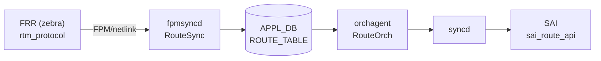

# ROUTE_TABLE (APPL_DB)

## 概要

`ROUTE_TABLE` は [FRR](../../reference/glossary.md#term-frr) (zebra) から [FPM](../../reference/glossary.md#term-fpm) プロトコル経由で受け取った経路情報を [APPL_DB](../../reference/glossary.md#term-appl_db) に保持するテーブル[^1]。`fpmsyncd` が netlink メッセージを受信して書き込み、`orchagent` の `RouteOrch` が読み取って [SAI](../../reference/glossary.md#term-sai) route エントリとして実装する。

!!! warning "APPL_DB テーブル"
    `ROUTE_TABLE` は **APPL_DB** テーブルであり、**CONFIG_DB には存在しない**。静的経路は `CONFIG_DB` の `STATIC_ROUTE` テーブルで管理し、`bgpcfgd` / `staticd` を経由して最終的にこのテーブルに反映される。

<!-- cdb-mermaid -->
### データフロー



!!! note "凡例"
    FRR から SAI までの典型転送経路。詳細は本ページ本文と引用コードを参照。
<!-- /cdb-mermaid -->

## key 構造

```text
ROUTE_TABLE:<prefix>
ROUTE_TABLE:<vrf_name>:<prefix>
```

- `<prefix>` は IPv4 / IPv6 プレフィックス（例: `192.168.1.0/24`、`2001:db8::/32`）。
- `<vrf_name>` は `Vrf` プレフィックスで始まる VRF デバイス名（例: `Vrf-RED`）。
- 管理 VRF (`mgmt`) 向け経路は fpmsyncd がスキップするため、このテーブルには存在しない[^2]。

## 主要フィールド

| フィールド | 型 | 暗黙デフォルト | 説明 |
|-----------|----|----------------|------|
| `protocol` | string | `""` (フィールド不在) | 経路プロトコル名（`bgp`、`static`、`kernel` 等）。rtm_protocol 番号を iproute2 ライブラリで解決 |
| `blackhole` | string | `"false"` (フィールド不在) | blackhole 経路の場合のみ `"true"` が書き込まれる |
| `nexthop` | string | `""` (フィールド不在) | カンマ区切り nexthop IP リスト。interface route では `"0.0.0.0"` / `"::"` |
| `ifname` | string | `""` (フィールド不在) | カンマ区切り出力インターフェース名リスト |
| `nexthop_group` | string | `""` (フィールド不在) | kernel nexthop group ID 文字列。`nexthop` / `ifname` と相互排他 |
| `mpls_nh` | string | `""` (フィールド不在) | MPLS nexthop ラベルスタック。MPLS 経路のみ設定 |
| `weight` | string | `"1"` per nexthop | カンマ区切り ECMP 重みリスト。netlink weight=0 は 1 にフォールバック |
| `vni_label` | string | `""` (フィールド不在) | EVPN VNI のカンマ区切りリスト。EVPN 経路のみ |
| `router_mac` | string | `""` (フィールド不在) | EVPN 宛先 VTEP MAC アドレスのカンマ区切りリスト |
| `segment` | string | `""` (フィールド不在) | SRv6 SID リストキー。SRv6 steer route のみ |
| `seg_src` | string | `""` (フィールド不在) | SRv6 encapsulation source IPv6 アドレス。SRv6 route のみ |

<!-- defaults -->
## コード由来デフォルト詳細

### `blackhole` — 宣言デフォルト `"false"`

`RouteTableFieldValueTupleWrapper` の C++ メンバー宣言[^1]:

```cpp
string blackhole = string("false");
```

**non-ZMQ path** では `blackhole != "false"` の場合のみ APPL_DB に書き込む。つまり通常経路（`RTN_UNICAST`）ではフィールド自体が存在しない。`RTN_BLACKHOLE` type の netlink メッセージを受け取った場合のみ `"true"` が書き込まれる[^1]:

```cpp
case RTN_BLACKHOLE:
    fvw.blackhole = "true";
```

orchagent 側では `blackhole = fvValue(i) == "true"` と評価し、フィールド不在は `false` として処理する[^3]。

### `protocol` — iproute2 ライブラリ解決

`rtnl_route_get_protocol()` で取得した rtm_protocol 番号を `rtnl_route_proto2str()` で文字列変換[^1]:

```cpp
auto proto_num = rtnl_route_get_protocol(route_obj);
auto proto_str = getProtocolString(proto_num);
```

解決に失敗した場合は数値文字列（例: `"186"`）を返す。`/etc/iproute2/rt_protos` が存在する場合はオーバーライド可能。

### `weight` — netlink weight=0 → 1 フォールバック

`getNextHopWt()` 内でハードコード[^1]:

```cpp
uint8_t weight = rtnl_route_nh_get_weight(nexthop);
if (weight == 0)
{
    weight = 1; // default weight is 1
}
```

FRR が weight を指定しない場合（weight=0）は **1** として APPL_DB に書き込まれる。ECMP の各 nexthop に最低 `"1"` が保証される。

### `nexthop_group` と `nexthop`/`ifname` の相互排他

kernel の nexthop group ID が存在する場合は `nexthop_group` フィールドのみ設定し、`nexthop` / `ifname` は設定しない。orchagent は両方が存在する場合はエラーとして経路を棄却する[^3]:

```cpp
if (!nhg_index.empty() && (!ips.empty() || !aliases.empty()))
{
    SWSS_LOG_ERROR("Route %s has both nexthop_group and ips/aliases", key.c_str());
    // erases the entry
}
```

### ZMQ path の差異

`ORCH_NORTHBOND_ROUTE_ZMQ_ENABLED` が有効な場合、全フィールド（空文字列のものを含む）を常に送信する。フィールド不在が発生しないため orchagent 側の「フィールド不在=デフォルト」ロジックは使われない。
<!-- /defaults -->

<!-- platform -->
## プラットフォーム差異 (Phase H)

<!-- evidence: meta/_intermediate/cdb-flow/route-platform.md -->

### ASIC 別 ECMP グループ数上限

RouteOrch コンストラクタ起動時に `SAI_SWITCH_ATTR_NUMBER_OF_ECMP_GROUPS` を問い合わせ ECMP グループ上限 (`m_maxNextHopGroupCount`) を決定する[^3]:

```cpp
// routeorch.cpp:61-91 (抜粋)
attr.id = SAI_SWITCH_ATTR_NUMBER_OF_ECMP_GROUPS;
status = sai_switch_api->get_switch_attribute(gSwitchId, 1, &attr);
if (status != SAI_STATUS_SUCCESS)
    m_maxNextHopGroupCount = DEFAULT_NUMBER_OF_ECMP_GROUPS;  // 128
else
{
    m_maxNextHopGroupCount = attr.value.s32;
    char *platform = getenv("platform");
    if (platform && strstr(platform, MLNX_PLATFORM_SUBSTRING))  // "mellanox"
        m_maxNextHopGroupCount /= DEFAULT_MAX_ECMP_GROUP_SIZE;  // ÷ 32
}
```

| プラットフォーム | SAI 返値の解釈 | 有効上限 |
|-----------------|---------------|---------|
| Mellanox (`"mellanox"`) | ECMP size=1 前提の最大数を返すため ÷32 補正 | `SAI 返値 / 32` |
| その他 ASIC | SAI 返値をそのまま使用 | `SAI 返値` |
| SAI 問い合わせ失敗 | フォールバック | 128 |

この上限は `SwitchOrch::set_switch_capability()` で `MAX_NEXTHOP_GROUP_COUNT` として STATE_DB に公開される。

### VOQ chassis — ECMP メンバー数上限キャップ

`gMySwitchType == "voq"` のとき orchagent が ECMP メンバー数を最大 128 に固定して SAI に書き戻す[^3]:

```cpp
// routeorch.cpp:109-117 (抜粋)
if (gMySwitchType == "voq" && maxEcmpGroupSize >= 128)
{
    maxEcmpGroupSize = 128;
    attr.id = SAI_SWITCH_ATTR_ECMP_MEMBER_COUNT;
    attr.value.s32 = maxEcmpGroupSize;
    sai_switch_api->set_switch_attribute(gSwitchId, &attr);
}
```

VOQ chassis では複数 line card 間でフォワーディングテーブルを同期するため ECMP メンバー数を抑えて同期負荷を制限する。通常の box スイッチや fabric スイッチでは ASIC 能力値をそのまま使う。

| `gMySwitchType` | ECMP メンバー上限の扱い |
|-----------------|----------------------|
| `"voq"` | min(ASIC 能力, 128) を SAI に設定 |
| `"switch"` / `"fabric"` 等 | ASIC 能力値のまま（orchagent から変更しない） |

### SAI Bulk API 対応差

RouteOrch は 3 種の Bulker を使用し、デフォルト `gMaxBulkSize = 1000` エントリ単位でまとめて SAI に渡す[^3]:

| Bulker | 対象 SAI API |
|--------|-------------|
| `gRouteBulker` | `sai_route_api` (sai_route_entry_t) |
| `gLabelRouteBulker` | `sai_mpls_api` (label route entry) |
| `gNextHopGroupMemberBulker` | `sai_next_hop_group_api` (NHG member) |

SAI 実装がバルク操作 (`sai_bulk_create_route_entry` 等) を実装していない場合、Bulker 内部でシングルエントリ呼び出しにフォールバックする。ECMP グループ数が上限に達した状態で pending DEL がある場合、通常の flush タイミング（doTask ループ末尾）より早期に `gRouteBulker.flush()` が呼ばれる (routeorch.cpp:1094-1097)。

<!-- /platform -->

<!-- ordering -->
## 書込み順依存 (Phase B)

<!-- evidence: meta/_intermediate/cdb-flow/route-ordering.md -->

### ADD 時: VRF 経路は VRF エントリが先行必須

`Vrf` プレフィックスで始まる key（例: `Vrf-RED:192.168.1.0/24`）を持つ経路を書き込む前に、対応する VRF エントリが VRFOrch に登録されていなければならない。`m_vrfOrch->isVRFexists(vrf_name)` が false の場合、orchagent は経路を後回し（`it++; continue`）にして SAI プログラミングを行わない[^3]。

```
CONFIG_DB|VRF|<name>  →  VRFOrch が SAI に VRF 登録  →  APPL_DB|ROUTE_TABLE|<vrf_name>:<prefix>
```

### ADD 時: `nexthop_group` 指定経路は NhgOrch 登録が先行必須

`nexthop_group` フィールドに NhgOrch 管理の NHG インデックスを指定する場合、`gNhgOrch->hasNhg()` / `gCbfNhgOrch->hasNhg()` がいずれも false なら `addRoutePre` が `return false` して後回しになる[^3]。

```
NEXTHOP_GROUP_TABLE エントリ登録  →  ROUTE_TABLE|<prefix> (nexthop_group: <index>)
```

### ADD 時: 通常 IP nexthop は NeighOrch 登録が先行必須

nexthop が IP アドレスでインタフェース直結でない場合（非 `isIntfNextHop()`）、`m_neighOrch->hasNextHop()` が false なら `return false` で後回し。fpmsyncd 経由の通常フローでは zebra がネイバー解決後に ROUTE_TABLE に書くため問題は生じないが、APPL_DB を直接操作する場合は ARP/NDP 解決を先に確認すること[^3]。

### ADD 時: EVPN overlay 経路は L3 VNI 登録が先行必須

`vni_label` フィールドを持つ経路では、各 VNI に対して `m_vrfOrch->isL3VniVlan(vni)` を検査し、L3 VNI として登録されていなければ `it++; continue` で後回し[^3]。VXLAN_TUNNEL_MAP / VRF の L3 VNI 設定を先に完了してから EVPN Type-5 経路を書き込む。

### ADD 時: インタフェース直結経路は RIF 登録が先行必須

nexthop が `isIntfNextHop()` の場合、`m_intfsOrch->getRouterIntfsId(alias)` が `SAI_NULL_OBJECT_ID` ならば `return false` で後回し。`INTERFACE` / `PORTCHANNEL_INTERFACE` テーブルへの IP アドレス設定 → IntfsOrch が RIF を SAI 登録 → ROUTE_TABLE 書き込み、の順を守る[^3]。

### DEL 時: 経路 DEL → 参照先オブジェクト DEL の順が必須

NHG・VRF を先に DEL しようとするとリファレンスカウントが詰まり DEL が遅延する。推奨順序:

```
ROUTE_TABLE|<prefix> DEL
  → NEXTHOP_GROUP_TABLE DEL（リファレンスカウント 0 後）
  → VRF DEL
```

### SAI bulk batch — `gRouteBulker` による一括 SAI 発行

`RouteOrch` は SAI route API 呼び出しを 1 エントリごとに発行せず、`EntityBulker<sai_route_api_t> gRouteBulker(sai_route_api, gMaxBulkSize)` にキューイングしてバッチで SAI へ送る[^3]。

**処理シーケンス（`doTask` 1 回の中）**:

1. `m_toSync` の全エントリをループし、`addRoute(ctx)` / `removeRoute(ctx)` がそれぞれ `gRouteBulker.create_entry()` / `gRouteBulker.remove_entry()` / `gRouteBulker.set_entry_attribute()` を呼ぶ（この時点では SAI 未発行）。
2. ループ終了後に `gRouteBulker.flush()` を呼び、バッチで SAI に発行する（`routeorch.cpp:1117`）。
3. `flush()` 後に `addRoutePost()` / `removeRoutePost()` が SAI の返却ステータスを確認し、成功したエントリは `m_syncdRoutes` に反映、失敗は `m_toSync` に残す。

```
[ループ] addRoute/removeRoute → gRouteBulker.create_entry / remove_entry / set_entry_attribute
         （SAI は未発行）
[ループ後] gRouteBulker.flush() → sai_route_bulk_create / sai_route_bulk_remove 一括発行
           → addRoutePost / removeRoutePost でステータス確認
```

**NHG 枯渇時の中間 flush**: nexthop group 数が上限 (`m_maxNextHopGroupCount`) に達し、かつ bulker に削除待ちエントリが存在する場合、ループを抜けて中間 `flush()` を行い、解放された NHG を回収してから処理を継続する（`routeorch.cpp:1094-1100`）。

**MPLS ラベル経路は別 bulker**: `gLabelRouteBulker(sai_mpls_api, gMaxBulkSize)` が独立して存在し、MPLS フォワーディングエントリは別バッチで SAI に発行される[^3]。

<!-- /ordering -->

<!-- cross-refs -->
## 暗黙参照テーブル (Phase C)

<!-- evidence: meta/_intermediate/cdb-flow/route-cross-refs.md -->

`RouteOrch` (`orchagent/routeorch.cpp`) が ROUTE_TABLE エントリを処理する際に参照・更新する他テーブル/Orch の一覧。フィールドに明示されていない暗黙依存関係を示す。

### NEIGHBOR (APPL_DB) — NeighOrch 経由

nexthop IP アドレスが存在する場合、RouteOrch は `m_neighOrch->hasNextHop()` で隣接解決済みかを確認し、`getNextHopId()` で SAI nexthop OID を取得する[^cr1]。

```cpp
if (m_neighOrch->hasNextHop(it))
    next_hop_id = m_neighOrch->getNextHopId(it);
else
{
    m_neighOrch->addNextHop(ctx);
    next_hop_id = m_neighOrch->getNextHopId(it);
}
```

`isNeighborResolved()` も確認し、未解決の場合は `return false` で経路プログラミングを後回しにする[^cr1]。参照カウント (`increaseNextHopRefCount` / `decreaseNextHopRefCount`) により NEIGH_TABLE エントリの生存期間が RouteOrch によって保護される。

### NEXTHOP_GROUP (APPL_DB) — NhgOrch / CbfNhgOrch 経由

`nexthop_group` フィールドに NHG インデックスが設定されている場合、`gNhgOrch->hasNhg()` / `gCbfNhgOrch->hasNhg()` でいずれかが所有していなければ `return false` となり後回しになる[^cr1]。

```cpp
if (!gNhgOrch->hasNhg(ctx.nhg_index) && !gCbfNhgOrch->hasNhg(ctx.nhg_index))
{
    SWSS_LOG_INFO("Failed to get next hop group with index %s", ctx.nhg_index.c_str());
    return false;
}
```

`getNhg(nhg_index)` が `out_of_range` 例外を投げた場合も `++it; continue` で後回し。**NEXTHOP_GROUP_TABLE エントリが NhgOrch に登録される前に `nexthop_group` フィールドを持つ経路を書いても SAI プログラミングは行われない**。

### VRF (CONFIG_DB) — VRFOrch 経由

`Vrf` プレフィックスを持つキー（例: `Vrf-RED:10.0.0.0/24`）の経路は `m_vrfOrch->isVRFexists(vrf_name)` を確認し、false であれば `it++; continue` で後回し[^cr1]。SAI 経路登録後は `m_vrfOrch->increaseVrfRefCount(vrf_id)` で参照カウントを保護する。

EVPN L3 VNI を持つ経路では `m_vrfOrch->isL3VniVlan(vni)` も確認する。未登録の場合はやはり後回し。

### MUX_CABLE (CONFIG_DB) — MuxOrch 経由

Dual-ToR 環境では RouteOrch が `gDirectory.get<MuxOrch*>()` で MuxOrch を取得し、mux tunnel nexthop を NHG から除外するロジックを適用する[^cr1]。

```cpp
MuxOrch* mux_orch = gDirectory.get<MuxOrch*>();
sai_object_id_t mux_tunnel_nh_id = mux_orch->getTunnelNextHopId();
```

複数 nexthop で mux nexthop が含まれる場合は SAI への書き込みを省略し、`mux_orch->updateRoute(ipPrefix)` に委譲する:

```cpp
if (mux_orch->isMuxNexthops(nextHops))
    mux_orch->updateRoute(ipPrefix);
```

MuxOrch が初期化されていない場合 (`gDirectory.get<MuxOrch*>()` が失敗) は orchagent が異常終了する可能性がある。

### 暗黙参照サマリ

| 参照先 | DB | テーブル / Orch | 参照方法 | 方向 |
|--------|-----|----------------|---------|------|
| NEIGHBOR | APPL_DB | `NEIGH_TABLE` / NeighOrch | `hasNextHop()` / `getNextHopId()` | READ (依存・後回し) |
| NEXTHOP_GROUP | APPL_DB | `NEXTHOP_GROUP_TABLE` / NhgOrch | `gNhgOrch->hasNhg()` / `gCbfNhgOrch->hasNhg()` | READ (依存・後回し) |
| VRF | CONFIG_DB | `VRF` / VRFOrch | `isVRFexists()` / `getVRFid()` | READ (依存・後回し) |
| MUX_CABLE | CONFIG_DB | `MUX_CABLE` / MuxOrch | `isMuxNexthops()` / `updateRoute()` | WRITE (通知・委譲) |

[^cr1]: `orchagent/routeorch.cpp` <https://github.com/sonic-net/sonic-swss/blob/4305596156d70e9797e8a881b3d19b46de0bce0d/orchagent/routeorch.cpp>
<!-- /cross-refs -->

<!-- failure -->
## 失敗挙動・エラーハンドリング (Phase D)

<!-- evidence: meta/_intermediate/cdb-flow/route-failure.md -->

`ROUTE_TABLE` 処理の失敗は **フィールド検証エラー（即時破棄）** と **依存オブジェクト未解決による後回し** と **SAI Bulk 操作失敗** の 3 種類に分類される。

### フィールド検証エラー（即時破棄・再試行なし）

以下の場合はエントリを `m_toSync` から erase し、SAI 操作を行わず再試行もしない[^fa1]:

| 条件 | ログ |
|------|------|
| `nexthop_group` と `nexthop`/`ifname` を同時指定 | `SWSS_LOG_ERROR("Route %s has both nexthop_group and ips/aliases")` |
| EVPN `router_mac` / `vni_label` フィールド不正フォーマット | `SWSS_LOG_ERROR("Skip route %s, it has an invalid router mac field %s")` |
| SRv6 エンドポイント数と VPN SID 数が不一致 | `SWSS_LOG_ERROR("inconsistent number of endpoints and srv6 vpn sids.")` |
| SRv6 `segment` 数と `seg_src` 数が不一致 | `SWSS_LOG_ERROR("inconsistent number of srv6_segv and srv6_srcs.")` |

これらのエラーは `publishRouteState` が呼ばれないため APPL_STATE_DB への失敗通知も行われない。

### 依存オブジェクト未解決による後回し（自動回復あり）

依存するオブジェクトが未登録の場合は `it++` または `return false` で後回しにし、次の doTask() 呼び出しで再試行する[^fa1]:

| 条件 | コード箇所 | 自動回復タイミング |
|------|-----------|------------------|
| VRF 名 (`Vrf-*`) が VRFOrch に未登録 | `doTask()` `isVRFexists()` 確認 (L711) | VRF エントリ登録後 |
| `nexthop_group` が NhgOrch / CbfNhgOrch に未登録 | `addRoutePre()` `hasNhg()` 確認 (L2411) | NEXTHOP_GROUP_TABLE エントリ登録後 |
| nexthop IP の ARP/NDP が未解決 | `addNextHopGroup()` `isNeighborResolved()` 確認 (L1963) | neighbor 解決後 |
| インタフェース直結 nexthop の RIF が未登録 | `addRoute()` `getRouterIntfsId()` 確認 (L2083) | INTERFACE IP 設定後 |
| EVPN `vni_label` の L3 VNI が VRFOrch に未登録 | `doTask()` `isL3VniVlan()` 確認 (L872) | VNI / VRF 設定後 |

### SAI Bulk 操作失敗

`gRouteBulker` / `gLabelRouteBulker` の bulk flush 後に `addRoutePost()` / `removeRoutePost()` が SAI ステータスを確認する。失敗時は `handleSaiCreateStatus` / `handleSaiSetStatus` / `handleSaiRemoveStatus` → `parseHandleSaiStatusFailure` で振り分け[^fa1]:

| SAI ステータス | `handleSai*Status` 結果 | 最終動作 |
|--------------|----------------------|---------|
| `SAI_STATUS_TABLE_FULL` 等 | `task_need_retry` | 後回し（自動回復待ち） |
| `SAI_STATUS_SUCCESS` | `task_success` | 正常完了 |
| その他致命的エラー | `task_failed` | エントリ erase |

**特例: `SAI_STATUS_ITEM_NOT_FOUND`（set 操作）**: Dual-ToR でトンネル経路と学習経路が競合した際に発生する。内部キャッシュ (`m_syncdRoutes`) から当該エントリを削除して次回 doTask() で create として再試行する[^fa1]:

```cpp
if (status == SAI_STATUS_ITEM_NOT_FOUND)
{
    m_syncdRoutes.at(vrf_id).erase(ipPrefix);
    return false;
}
```

`publishRouteState()` は `addRoute` / `removeRoute` の完了後に必ず呼ばれ、成否を APPL_STATE_DB の `ROUTE_TABLE` に書き込む (`protocol` フィールドのみ SET、DEL はエントリ削除)。

### fpmsyncd — APPL_DB 書き込み前の破棄

netlink メッセージ処理時に VRF ifindex からデバイス名を解決できない場合、fpmsyncd は当該 RTM_NEWROUTE を破棄し APPL_DB への書き込みを行わない。再試行なし[^fa2]:

```cpp
if (!getIfName(vrf_index, destipprefix, IFNAMSIZ))
{
    SWSS_LOG_ERROR("Fail to get the VRF name (ifindex %u)", vrf_index);
    return;
}
```

### 診断コマンド

```bash
# orchagent エラーログ（SAI 失敗・フィールド検証エラー）
journalctl -u swss | grep -E "has both nexthop_group|invalid router mac|invalid vni label|Failed to create route|Failed to set route|Failed to remove route"

# fpmsyncd 経路破棄ログ
journalctl -u swss | grep -E "Fail to get the VRF name|Invalid VRF name"

# APPL_STATE_DB で処理ステータス確認
sonic-db-cli APPL_STATE_DB hgetall 'ROUTE_TABLE:10.0.0.0/24'
```

[^fa1]: `orchagent/routeorch.cpp` <https://github.com/sonic-net/sonic-swss/blob/4305596156d70e9797e8a881b3d19b46de0bce0d/orchagent/routeorch.cpp>
[^fa2]: `fpmsyncd/routesync.cpp` <https://github.com/sonic-net/sonic-swss/blob/4305596156d70e9797e8a881b3d19b46de0bce0d/fpmsyncd/routesync.cpp>
<!-- /failure -->

## 制約

- `nexthop_group` と `nexthop`/`ifname` は同時に存在できない（orchagent がエラー棄却）。
- 管理 VRF (`mgmt`) 向け経路は fpmsyncd がスキップ → テーブルに存在しない。
- eth0 / docker0 / eth1-midplane 向け経路は fpmsyncd が DEL 送信に変換（静的フィルタ）。
- EVPN Multipath SRv6 経路は未対応でサイレントスキップ。

## 購読者

- `orchagent` (`RouteOrch`): APPL_DB の `ROUTE_TABLE` を購読し、SAI `sai_route_entry_t` を作成・削除・更新する。

<!-- pubsub -->
## 通信メカニズム (Redis PUBSUB / ZMQ)

<!-- evidence: meta/_intermediate/cdb-flow/route-pubsub.md -->

`ROUTE_TABLE` は **APPL_DB** テーブルであり、CONFIG_DB からの keyspace notification は使用しない。FRR (zebra) が FPM (Forwarding Plane Manager) プロトコル経由で送る netlink メッセージを `fpmsyncd` が受信し、直接 APPL_DB に書き込む構成。

### fpmsyncd → APPL_DB (ProducerStateTable / ZmqProducerStateTable)

`RouteSync` コンストラクタ (`routesync.cpp:154-158`) で `m_routeTable` を初期化する:

```cpp
m_zmqClient(create_local_zmq_client(ORCH_NORTHBOND_ROUTE_ZMQ_ENABLED, false)),
m_routeTable(createProducerStateTable(pipeline, APP_ROUTE_TABLE_NAME, true, m_zmqClient)),
```

`ORCH_NORTHBOND_ROUTE_ZMQ_ENABLED` (`DEVICE_METADATA|localhost` の `orch_northbond_route_zmq_enabled` フィールド) の値で 2 パスが切り替わる:

| パス | `m_routeTable` 型 | Transport | デフォルト |
|------|-----------------|-----------|-----------|
| 通常 Redis | `ProducerStateTable` | Redis EVALSHA: `SADD KEY_SET + HSET + PUBLISH ROUTE_TABLE_CHANNEL@0 G` | ◎ |
| ZMQ | `ZmqProducerStateTable` | ZMQ PUSH → `tcp://localhost:8100` + APPL_DB 永続化 | — |

### APPL_DB → orchagent RouteOrch (ConsumerStateTable / ZmqConsumerStateTable)

`RouteOrch` は `ZmqOrch` を継承する。orchagent 初期化 (`orchdaemon.cpp:334-337`) で ZMQ フラグを確認し、対応する Consumer を登録する:

```cpp
auto enable_route_zmq = get_feature_status(ORCH_NORTHBOND_ROUTE_ZMQ_ENABLED, false);
auto route_zmq_server = enable_route_zmq ? m_zmqServer : nullptr;
gRouteOrch = new RouteOrch(m_applDb, route_tables, ..., route_zmq_server);
```

`ZmqOrch::addConsumer()` (`zmqorch.cpp:59-68`) が ZMQ 有無で Consumer を選択:

```
[ZMQ 無効] ConsumerStateTable → SUBSCRIBE ROUTE_TABLE_CHANNEL@0 → pops.lua
[ZMQ 有効] ZmqConsumerStateTable → ZMQ PULL ← tcp://localhost:8100
→ RouteOrch::doTask(ConsumerBase&)
```

### ZMQ フィールド送信の差異

- **通常 Redis パス**: 空値フィールドは APPL_DB に書き込まない（フィールド不在 = デフォルト値、orchagent 側でフォールバック）
- **ZMQ パス**: 全フィールドを常に送信（フィールド不在が発生しないため orchagent の「フィールド不在=デフォルト」ロジックは使われない）

### STATE_DB 書き込み

RouteOrch は `STATE_DB:ROUTE_TABLE` に**デフォルト経路の有無**のみ書き込む (`routeorch.cpp:294`)。個別経路エントリのステータスは STATE_DB に書き込まれない。TTL は使用しない。

### 経路フィルタ（fpmsyncd がスキップする経路）

| 条件 | 動作 |
|------|------|
| 管理 VRF (`mgmt` プレフィックス) | スキップ（APPL_DB に書き込まない） |
| nexthop が eth0 / docker0 / eth1-midplane | DEL メッセージに変換して送信（FRR 7.2→7.5 の挙動変化対策） |
| EVPN Multipath SRv6 | サイレントスキップ |

### 通信フロー全体図

```
FRR (zebra) --[FPM/netlink]--> fpmsyncd (RouteSync)
  ↓ [通常] ProducerStateTable (EVALSHA: SADD KEY_SET + HSET + PUBLISH CHANNEL@0)
  ↓ [ZMQ]  ZmqProducerStateTable (ZMQ PUSH tcp://localhost:8100 + APPL_DB 永続化)
APPL_DB[ROUTE_TABLE|<prefix>]
  ↓ [通常] ConsumerStateTable (SUBSCRIBE ROUTE_TABLE_CHANNEL@0 → pops.lua)
  ↓ [ZMQ]  ZmqConsumerStateTable (ZMQ PULL tcp://localhost:8100)
RouteOrch::doTask(ConsumerBase&) → SAI sai_route_api → ASIC

STATE_DB[ROUTE_TABLE|<default-route>]
  ← RouteOrch::set() (デフォルト経路の有無のみ、TTL なし)
```

<!-- /pubsub -->

<!-- side-effects -->
## SET/DEL 副次 DB 書込み

<!-- evidence: meta/_intermediate/cdb-flow/route-side-effects.md -->
<!-- evidence-alt: meta/_intermediate/cdb-flow/route-side.md -->

`ROUTE_TABLE` エントリの SET / DEL が引き起こす他 DB への書込み一覧。`ROUTE_TABLE` は APPL_DB テーブルであるため、CONFIG_DB 直接の副作用はなく、すべて `orchagent (RouteOrch)` 経由で発生する。

### STATE_DB `ROUTE_TABLE` — デフォルト経路の有無 (routeorch.cpp:287-294)

`RouteOrch::updateDefRouteState()` がデフォルト経路 (`0.0.0.0/0` / `::/0`) の追加・削除時のみ書き込む[^se1]:

```cpp
string state = add ? "ok" : "na";
m_stateDefaultRouteTb->set(ip, {{"state", state}});
```

| 操作 | 対象 DB / テーブル | キー | フィールド | 条件 |
|------|-----------------|------|-----------|------|
| SET | STATE_DB / `ROUTE_TABLE` | `0.0.0.0/0` または `::/0` | `state=ok` | デフォルト経路のみ |
| DEL | STATE_DB / `ROUTE_TABLE` | `0.0.0.0/0` または `::/0` | `state=na` | デフォルト経路のみ |

個別経路エントリのステータスは STATE_DB に書き込まれない。

### APPL_STATE_DB `ROUTE_TABLE` — 経路処理ステータス (routeorch.cpp:3185-3201)

`RouteOrch::publishRouteState()` が SAI 操作の成否に関わらず全経路に対して書き込む[^se1]:

```cpp
// ResponsePublisher m_publisher{"APPL_STATE_DB"};  (orch.h:382)
if (ctx.is_set) {
    fvs.emplace_back("protocol", ctx.protocol);
}
m_publisher.publish(APP_ROUTE_TABLE_NAME, ctx.key, fvs, status, replace);
```

| 操作 | 対象 DB / テーブル | キー | フィールド | 条件 |
|------|-----------------|------|-----------|------|
| SET | APPL_STATE_DB / `ROUTE_TABLE` | `<prefix>` / `<vrf>:<prefix>` | `protocol=<proto>` | SAI 操作後 常時[^se1] |
| DEL | APPL_STATE_DB / `ROUTE_TABLE` | `<prefix>` / `<vrf>:<prefix>` | (エントリ削除) | SAI 操作後 常時[^se1] |

### COUNTERS_DB — CRM リソースカウンタ (crmorch.cpp)

`CrmOrch` の定期タイマー (`CRM_COUNTERS_POLL`) が `updateCrmCountersTable()` を呼び出し、経路 SET/DEL 毎に `incCrmResUsedCounter` / `decCrmResUsedCounter` で更新されたメモリ内カウンタを COUNTERS_DB に反映する[^se2]:

| 操作 | 対象 DB / テーブル | キー | フィールド |
|------|-----------------|------|-----------|
| SET (IPv4) | COUNTERS_DB / `CRM` | `STATS` | `crm_stats_ipv4_route_used` 増加 |
| SET (IPv6) | COUNTERS_DB / `CRM` | `STATS` | `crm_stats_ipv6_route_used` 増加 |
| DEL (IPv4) | COUNTERS_DB / `CRM` | `STATS` | `crm_stats_ipv4_route_used` 減少 |
| DEL (IPv6) | COUNTERS_DB / `CRM` | `STATS` | `crm_stats_ipv6_route_used` 減少 |

`crm_stats_ipv{4,6}_route_available` は SAI ポーリング (`sai_object_type_get_availability`) で別途更新される。

### COUNTERS_DB — Flow Counter マッピング (flowcounterrouteorch.cpp)

ルートフロウカウンタが有効 (`FLEX_COUNTER_TABLE` でパターン設定済み) の場合のみ書き込む[^se3]:

| 操作 | 対象 DB / テーブル | キー | 条件 |
|------|-----------------|------|------|
| SET | COUNTERS_DB / `COUNTERS_ROUTE_NAME_MAP` | `""` フィールド: `<vrf>:<prefix>` = `<counter_oid>` | フロウカウンタ有効時のみ |
| SET | COUNTERS_DB / `COUNTERS_ROUTE_TO_PATTERN_MAP` | `""` フィールド: `<vrf>:<prefix>` = `<pattern>` | フロウカウンタ有効時のみ |
| DEL | COUNTERS_DB / `COUNTERS_ROUTE_NAME_MAP` | `""` (該当フィールド削除) | フロウカウンタ有効時のみ |
| DEL | COUNTERS_DB / `COUNTERS_ROUTE_TO_PATTERN_MAP` | `""` (該当フィールド削除) | フロウカウンタ有効時のみ |

### STATE_DB `FLOW_COUNTER_CAPABILITY_TABLE` — 起動時 1 回のみ (flowcounterrouteorch.cpp:174-178)

| 操作 | 対象 DB / テーブル | キー | フィールド | タイミング |
|------|-----------------|------|-----------|-----------|
| SET | STATE_DB / `FLOW_COUNTER_CAPABILITY_TABLE` | `route` | `support=true/false` | orchagent 起動時 1 回のみ[^se3] |

### 副作用サマリ

| DB | テーブル | キー形式 | SET | DEL |
|----|---------|---------|-----|-----|
| STATE_DB | `ROUTE_TABLE` | `0.0.0.0/0` / `::/0` | `state=ok` | `state=na` |
| APPL_STATE_DB | `ROUTE_TABLE` | `<prefix>` / `<vrf>:<prefix>` | `protocol=<proto>` 書込 | エントリ削除 |
| COUNTERS_DB | `CRM` | `STATS` | `crm_stats_ipv{4,6}_route_used` 増加 | 減少 |
| COUNTERS_DB | `COUNTERS_ROUTE_NAME_MAP` | `""` | マップ追加 (条件付) | マップ削除 (条件付) |
| COUNTERS_DB | `COUNTERS_ROUTE_TO_PATTERN_MAP` | `""` | マップ追加 (条件付) | マップ削除 (条件付) |
| STATE_DB | `FLOW_COUNTER_CAPABILITY_TABLE` | `route` | `support=true/false` (起動時のみ) | — |

[^se1]: `orchagent/routeorch.cpp` <https://github.com/sonic-net/sonic-swss/blob/4305596156d70e9797e8a881b3d19b46de0bce0d/orchagent/routeorch.cpp>
[^se2]: `orchagent/crmorch.cpp` <https://github.com/sonic-net/sonic-swss/blob/4305596156d70e9797e8a881b3d19b46de0bce0d/orchagent/crmorch.cpp>
[^se3]: `orchagent/flex_counter/flowcounterrouteorch.cpp` <https://github.com/sonic-net/sonic-swss/blob/4305596156d70e9797e8a881b3d19b46de0bce0d/orchagent/flex_counter/flowcounterrouteorch.cpp>
<!-- /side-effects -->

<!-- constants -->
## ハードコード定数 (Phase E)

<!-- evidence: meta/_intermediate/cdb-flow/route-constants.md -->

### SAI route_entry 属性定数

`RouteOrch` が SAI `sai_route_entry_t` をプログラムする際に使用する属性 ID と packet action 値。

| 定数名 | 種別 | 用途 |
|--------|------|------|
| `SAI_ROUTE_ENTRY_ATTR_PACKET_ACTION` | SAI 属性 ID | packet action（DROP / FORWARD）を指定 |
| `SAI_ROUTE_ENTRY_ATTR_NEXT_HOP_ID` | SAI 属性 ID | nexthop OID を指定 |
| `SAI_ROUTE_ENTRY_ATTR_PREFIX_AGG_ID` | SAI 属性 ID | prefix aggregation ID を指定 |
| `SAI_PACKET_ACTION_DROP` | SAI enum | blackhole 経路・初期デフォルト経路の packet action |
| `SAI_PACKET_ACTION_FORWARD` | SAI enum | 通常 unicast 経路の packet action |

orchagent 起動時に `0.0.0.0/0` と `::/0` のデフォルト経路を `SAI_PACKET_ACTION_DROP` でプログラムし (`routeorch.cpp:138-139`)、FRR から有効な nexthop を受信したタイミングで `SAI_PACKET_ACTION_FORWARD` に切り替える (`routeorch.cpp:2315`)。blackhole 経路は常に `SAI_PACKET_ACTION_DROP` を維持する (`routeorch.cpp:2282`)。

### デフォルト VRF OID (`gVirtualRouterId`)

```cpp
extern sai_object_id_t gVirtualRouterId;  // routeorch.cpp:17
```

- orchagent 初期化時に SAI から取得・設定されるグローバル VRF OID。
- `ROUTE_TABLE:<prefix>`（VRF prefix なし）のキーは自動的に `gVirtualRouterId` に対してプログラムされる (`routeorch.cpp:721`)。
- `0.0.0.0/0` / `::/0` のデフォルト経路も `gVirtualRouterId` に紐付く (`routeorch.cpp:133, 151, 171`)。

### Bulk batch size (`DEFAULT_MAX_BULK_SIZE`)

```cpp
#define DEFAULT_MAX_BULK_SIZE 1000   // orchdaemon.cpp:81
size_t gMaxBulkSize = DEFAULT_MAX_BULK_SIZE;  // orchdaemon.cpp:82
```

`gRouteBulker`、`gLabelRouteBulker`、`gNextHopGroupMemberBulker` はすべて `gMaxBulkSize` を上限として構築される (`routeorch.cpp:41-43`)。orchagent 起動オプション `--bulk-size` で上書き可能。デフォルトは **1000 エントリ/フラッシュ**。

### ECMP グループ数デフォルト

```cpp
#define DEFAULT_NUMBER_OF_ECMP_GROUPS   128  // routeorch.cpp:37
#define DEFAULT_MAX_ECMP_GROUP_SIZE     32   // routeorch.cpp:38
```

| 定数名 | 値 | 適用条件 |
|--------|----|---------|
| `DEFAULT_NUMBER_OF_ECMP_GROUPS` | `128` | SAI クエリ失敗時のフォールバック ECMP グループ上限 |
| `DEFAULT_MAX_ECMP_GROUP_SIZE` | `32` | Mellanox プラットフォームの補正係数（`m_maxNextHopGroupCount /= 32`） |

### VRF prefix 文字列 (`VRF_PREFIX`)

```cpp
#define VRF_PREFIX "Vrf"  // orchagent/nexthopkey.h:20
```

VRF 名の必須プレフィックス。`Vrf` で始まるキー (`routeorch.cpp:706`) は VRF ルックアップを実施して対応する VRF OID を取得する。一致しないキーはデフォルト VRF (`gVirtualRouterId`) として扱われる。

### link-local prefix 定数

```cpp
IpPrefix default_link_local_prefix("fe80::/10");  // routeorch.cpp:187
```

orchagent 起動時に `gVirtualRouterId` 配下に `SAI_PACKET_ACTION_FORWARD` + CPU ポート nexthop でプログラムされる。全 link-local パケットを CPU に転送するためのサブネット route。

<!-- /constants -->

## 関連 CONFIG_DB / YANG / CLI

- 関連 CONFIG_DB: `STATIC_ROUTE`（静的経路の設定元）、`VRF`
- 関連 CLI: `show ip route`、`show ipv6 route`、`show bgp ipv4 unicast`
- 関連 YANG: 未定義（スキーマの正本は `routesync.h` / `routeorch.cpp`）

<!-- ref-triangle:start -->

## 関連リファレンス

- CONFIG_DB: [`STATIC_ROUTE`](static-route.md)

<!-- ref-triangle:end -->

## 引用元

[^1]: RouteTableFieldValueTupleWrapper 宣言・実装: `fpmsyncd/routesync.h` / `routesync.cpp`. <https://github.com/sonic-net/sonic-swss/blob/4305596156d70e9797e8a881b3d19b46de0bce0d/fpmsyncd/routesync.h>
[^2]: 管理 VRF スキップ・テーブル名定数: `fpmsyncd/routesync.cpp`, `common/schema.h`. <https://github.com/sonic-net/sonic-swss-common/blob/158de8d3463ff4b841653f6d57190bb142b80d9c/common/schema.h>
[^3]: orchagent フィールド消費: `orchagent/routeorch.cpp`. <https://github.com/sonic-net/sonic-swss/blob/4305596156d70e9797e8a881b3d19b46de0bce0d/orchagent/routeorch.cpp>

<!-- ops-hint -->
## 運用ヒント

### 確認コマンド

```bash
# APPL_DB の ROUTE_TABLE エントリを確認
sonic-db-cli APPL_DB keys 'ROUTE_TABLE:*' | head -20

# 特定プレフィックスのエントリ詳細
sonic-db-cli APPL_DB hgetall 'ROUTE_TABLE:10.0.0.0/24'

# FRR の経路テーブルとの比較
vtysh -c 'show ip route'
show ip route
```

### 典型エントリ例

```
# BGP 学習経路（ECMP あり）
ROUTE_TABLE:10.1.0.0/24
  protocol: bgp
  nexthop: 192.168.0.1,192.168.0.2
  ifname: Ethernet0,Ethernet4
  weight: 1,1

# blackhole 経路
ROUTE_TABLE:192.0.2.0/24
  protocol: bgp
  blackhole: true

# EVPN Type-5 経路
ROUTE_TABLE:10.2.0.0/24
  protocol: bgp
  nexthop: 172.16.0.1
  vni_label: 10000
  router_mac: aa:bb:cc:dd:ee:ff
  ifname: Brvxlan1000
```

### よくある問題

- `show ip route` に表示されるが ASIC に反映されない → `sonic-db-cli APPL_DB hgetall 'ROUTE_TABLE:<prefix>'` でフィールドを確認。`nexthop_group` と `nexthop` が両方存在すると orchagent がエラー棄却する。
- デフォルト経路が eth0 に向いてしまう → fpmsyncd の eth0/docker0 フィルタが機能しているか確認（FRR の `show ip route 0.0.0.0/0`）。
<!-- /ops-hint -->
