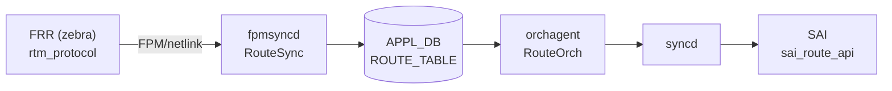

# ROUTE_TABLE (APPL_DB)

## 概要

`ROUTE_TABLE` は [FRR](../../reference/glossary.md#term-frr) (zebra) から [FPM](../../reference/glossary.md#term-fpm) プロトコル経由で受け取った経路情報を [APPL_DB](../../reference/glossary.md#term-appl_db) に保持するテーブル[^1]。`fpmsyncd` が netlink メッセージを受信して書き込み、`orchagent` の `RouteOrch` が読み取って [SAI](../../reference/glossary.md#term-sai) route エントリとして実装する。

!!! warning "APPL_DB テーブル"
    `ROUTE_TABLE` は **APPL_DB** テーブルであり、**CONFIG_DB には存在しない**。静的経路は `CONFIG_DB` の `STATIC_ROUTE` テーブルで管理し、`bgpcfgd` / `staticd` を経由して最終的にこのテーブルに反映される。

<!-- cdb-mermaid -->
### データフロー



!!! note "凡例"
    FRR から SAI までの典型転送経路。詳細は本ページ本文と引用コードを参照。
<!-- /cdb-mermaid -->

## key 構造

```text
ROUTE_TABLE:<prefix>
ROUTE_TABLE:<vrf_name>:<prefix>
```

- `<prefix>` は IPv4 / IPv6 プレフィックス（例: `192.168.1.0/24`、`2001:db8::/32`）。
- `<vrf_name>` は `Vrf` プレフィックスで始まる VRF デバイス名（例: `Vrf-RED`）。
- 管理 VRF (`mgmt`) 向け経路は fpmsyncd がスキップするため、このテーブルには存在しない[^2]。

## 主要フィールド

| フィールド | 型 | 暗黙デフォルト | 説明 |
|-----------|----|----------------|------|
| `protocol` | string | `""` (フィールド不在) | 経路プロトコル名（`bgp`、`static`、`kernel` 等）。rtm_protocol 番号を iproute2 ライブラリで解決 |
| `blackhole` | string | `"false"` (フィールド不在) | blackhole 経路の場合のみ `"true"` が書き込まれる |
| `nexthop` | string | `""` (フィールド不在) | カンマ区切り nexthop IP リスト。interface route では `"0.0.0.0"` / `"::"` |
| `ifname` | string | `""` (フィールド不在) | カンマ区切り出力インターフェース名リスト |
| `nexthop_group` | string | `""` (フィールド不在) | kernel nexthop group ID 文字列。`nexthop` / `ifname` と相互排他 |
| `mpls_nh` | string | `""` (フィールド不在) | MPLS nexthop ラベルスタック。MPLS 経路のみ設定 |
| `weight` | string | `"1"` per nexthop | カンマ区切り ECMP 重みリスト。netlink weight=0 は 1 にフォールバック |
| `vni_label` | string | `""` (フィールド不在) | EVPN VNI のカンマ区切りリスト。EVPN 経路のみ |
| `router_mac` | string | `""` (フィールド不在) | EVPN 宛先 VTEP MAC アドレスのカンマ区切りリスト |
| `segment` | string | `""` (フィールド不在) | SRv6 SID リストキー。SRv6 steer route のみ |
| `seg_src` | string | `""` (フィールド不在) | SRv6 encapsulation source IPv6 アドレス。SRv6 route のみ |

<!-- defaults -->
## コード由来デフォルト詳細

### `blackhole` — 宣言デフォルト `"false"`

`RouteTableFieldValueTupleWrapper` の C++ メンバー宣言[^1]:

```cpp
string blackhole = string("false");
```

**non-ZMQ path** では `blackhole != "false"` の場合のみ APPL_DB に書き込む。つまり通常経路（`RTN_UNICAST`）ではフィールド自体が存在しない。`RTN_BLACKHOLE` type の netlink メッセージを受け取った場合のみ `"true"` が書き込まれる[^1]:

```cpp
case RTN_BLACKHOLE:
    fvw.blackhole = "true";
```

orchagent 側では `blackhole = fvValue(i) == "true"` と評価し、フィールド不在は `false` として処理する[^3]。

### `protocol` — iproute2 ライブラリ解決

`rtnl_route_get_protocol()` で取得した rtm_protocol 番号を `rtnl_route_proto2str()` で文字列変換[^1]:

```cpp
auto proto_num = rtnl_route_get_protocol(route_obj);
auto proto_str = getProtocolString(proto_num);
```

解決に失敗した場合は数値文字列（例: `"186"`）を返す。`/etc/iproute2/rt_protos` が存在する場合はオーバーライド可能。

### `weight` — netlink weight=0 → 1 フォールバック

`getNextHopWt()` 内でハードコード[^1]:

```cpp
uint8_t weight = rtnl_route_nh_get_weight(nexthop);
if (weight == 0)
{
    weight = 1; // default weight is 1
}
```

FRR が weight を指定しない場合（weight=0）は **1** として APPL_DB に書き込まれる。ECMP の各 nexthop に最低 `"1"` が保証される。

### `nexthop_group` と `nexthop`/`ifname` の相互排他

kernel の nexthop group ID が存在する場合は `nexthop_group` フィールドのみ設定し、`nexthop` / `ifname` は設定しない。orchagent は両方が存在する場合はエラーとして経路を棄却する[^3]:

```cpp
if (!nhg_index.empty() && (!ips.empty() || !aliases.empty()))
{
    SWSS_LOG_ERROR("Route %s has both nexthop_group and ips/aliases", key.c_str());
    // erases the entry
}
```

### ZMQ path の差異

`ORCH_NORTHBOND_ROUTE_ZMQ_ENABLED` が有効な場合、全フィールド（空文字列のものを含む）を常に送信する。フィールド不在が発生しないため orchagent 側の「フィールド不在=デフォルト」ロジックは使われない。
<!-- /defaults -->

## 制約

- `nexthop_group` と `nexthop`/`ifname` は同時に存在できない（orchagent がエラー棄却）。
- 管理 VRF (`mgmt`) 向け経路は fpmsyncd がスキップ → テーブルに存在しない。
- eth0 / docker0 / eth1-midplane 向け経路は fpmsyncd が DEL 送信に変換（静的フィルタ）。
- EVPN Multipath SRv6 経路は未対応でサイレントスキップ。

## 購読者

- `orchagent` (`RouteOrch`): APPL_DB の `ROUTE_TABLE` を購読し、SAI `sai_route_entry_t` を作成・削除・更新する。

## 関連 CONFIG_DB / YANG / CLI

- 関連 CONFIG_DB: `STATIC_ROUTE`（静的経路の設定元）、`VRF`
- 関連 CLI: `show ip route`、`show ipv6 route`、`show bgp ipv4 unicast`
- 関連 YANG: 未定義（スキーマの正本は `routesync.h` / `routeorch.cpp`）

<!-- ref-triangle:start -->

## 関連リファレンス

- CONFIG_DB: [`STATIC_ROUTE`](static-route.md)

<!-- ref-triangle:end -->

## 引用元

[^1]: RouteTableFieldValueTupleWrapper 宣言・実装: `fpmsyncd/routesync.h` / `routesync.cpp`. <https://github.com/sonic-net/sonic-swss/blob/4305596156d70e9797e8a881b3d19b46de0bce0d/fpmsyncd/routesync.h>
[^2]: 管理 VRF スキップ・テーブル名定数: `fpmsyncd/routesync.cpp`, `common/schema.h`. <https://github.com/sonic-net/sonic-swss-common/blob/158de8d3463ff4b841653f6d57190bb142b80d9c/common/schema.h>
[^3]: orchagent フィールド消費: `orchagent/routeorch.cpp`. <https://github.com/sonic-net/sonic-swss/blob/4305596156d70e9797e8a881b3d19b46de0bce0d/orchagent/routeorch.cpp>

<!-- ops-hint -->
## 運用ヒント

### 確認コマンド

```bash
# APPL_DB の ROUTE_TABLE エントリを確認
sonic-db-cli APPL_DB keys 'ROUTE_TABLE:*' | head -20

# 特定プレフィックスのエントリ詳細
sonic-db-cli APPL_DB hgetall 'ROUTE_TABLE:10.0.0.0/24'

# FRR の経路テーブルとの比較
vtysh -c 'show ip route'
show ip route
```

### 典型エントリ例

```
# BGP 学習経路（ECMP あり）
ROUTE_TABLE:10.1.0.0/24
  protocol: bgp
  nexthop: 192.168.0.1,192.168.0.2
  ifname: Ethernet0,Ethernet4
  weight: 1,1

# blackhole 経路
ROUTE_TABLE:192.0.2.0/24
  protocol: bgp
  blackhole: true

# EVPN Type-5 経路
ROUTE_TABLE:10.2.0.0/24
  protocol: bgp
  nexthop: 172.16.0.1
  vni_label: 10000
  router_mac: aa:bb:cc:dd:ee:ff
  ifname: Brvxlan1000
```

### よくある問題

- `show ip route` に表示されるが ASIC に反映されない → `sonic-db-cli APPL_DB hgetall 'ROUTE_TABLE:<prefix>'` でフィールドを確認。`nexthop_group` と `nexthop` が両方存在すると orchagent がエラー棄却する。
- デフォルト経路が eth0 に向いてしまう → fpmsyncd の eth0/docker0 フィルタが機能しているか確認（FRR の `show ip route 0.0.0.0/0`）。
<!-- /ops-hint -->
