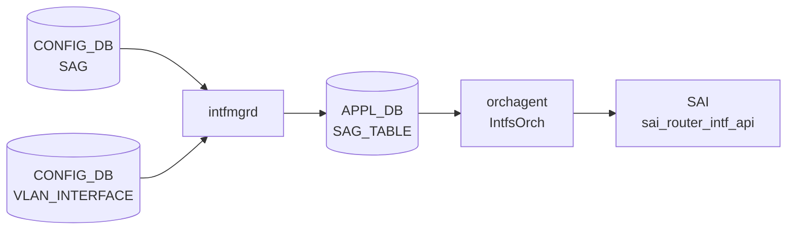

!!! warning "裏取りステータス: HLD-only"
    このページは公式 HLD (`SONiC/doc/sag/sag-HLD.md`) と `sonic-swss-common/common/schema.h` の定数定義のみを根拠に書かれています。現行 sonic-swss ソースツリーに `sagmgr.cpp` / `sagorch.cpp` 等の独立した実装ファイルが確認できなかったため、コードレベルの裏取りは未済です。

# SAG テーブル

## 概要

Static Anycast Gateway (SAG) のグローバル仮想 MAC アドレスを保持する [CONFIG_DB](../../reference/glossary.md#term-config_db) テーブル[^1]。EVPN/VXLAN ファブリックにおける anycast gateway 機能で使用し、全 leaf スイッチが同一の仮想 MAC を共有することでホスト移動時の ARP 再解決を不要にする。`intfmgrd` / `intfsorch` が購読し、対応 VLAN インターフェースの RIF の `SAI_ROUTER_INTERFACE_ATTR_SRC_MAC_ADDRESS` を仮想 MAC に差し替える[^1]。

<!-- cdb-mermaid -->
### データフロー (概要)



!!! note "凡例"
    HLD 記載のデータフローを図示。`SAG|GLOBAL.gateway_mac` が `VLAN_INTERFACE.static_anycast_gateway=true` の VLAN インターフェースに適用される。
<!-- /cdb-mermaid -->

## key 構造

```text
SAG|GLOBAL
```

シングルトン (`GLOBAL` の 1 行のみ)[^1]。

## フィールド

| フィールド | 型 | 既定 | 説明 |
|-----------|----|------|------|
| `gateway_mac` | MAC アドレス | なし (必須) | 全 VLAN インターフェースで共有するグローバル仮想 MAC アドレス |

### VLAN_INTERFACE への拡張フィールド

SAG 機能は `VLAN_INTERFACE` テーブルに `static_anycast_gateway` フィールドを追加する。

| テーブル | フィールド | 型 | 既定 | 説明 |
|---------|-----------|-----|------|------|
| `VLAN_INTERFACE` | `static_anycast_gateway` | boolean | `false` | この VLAN インターフェースで SAG 仮想 MAC を使用するか |

## 購読者

- `intfmgrd` / `IntfMgr`: `SAG|GLOBAL.gateway_mac` と `VLAN_INTERFACE.<n>.static_anycast_gateway` を読み出し、APPL_DB `SAG_TABLE` へ転送する[^1]
- `orchagent` / `IntfsOrch`: APPL_DB `SAG_TABLE` を消費し、VLAN インターフェースの SAI RIF の `SAI_ROUTER_INTERFACE_ATTR_SRC_MAC_ADDRESS` を仮想 MAC に更新する[^1]

## 関連 CONFIG_DB / YANG / CLI

- 関連 CONFIG_DB: `VLAN_INTERFACE`
- 関連 CLI: `config static-anycast-gateway mac_address add/del <mac>`, `config vlan static-anycast-gateway enable/disable <vlan_id>`
- YANG モデル: 現行 master には YANG モデルが存在しない（HLD 記載のみ）

<!-- cdb-exceptions -->
## 例外条件・特殊挙動

| 条件 | 挙動 |
|------|------|
| `SAG\|GLOBAL` が未設定の状態で `VLAN_INTERFACE.static_anycast_gateway=true` を設定 | CPU (システム) MAC が使われる。SAG GLOBAL 追加後に runtime 再評価で収束 |
| SAG MAC 変更 (`del` なしで `add`) | CLI が reject。既存 MAC を `del` してから `add` の 2 ステップが必須 |
| `static_anycast_gateway=true` の VLAN インターフェースが存在する状態での SAG MAC 変更 | IPv6 link-local to-me route が一時的に削除・再追加される (RouteOrch 経由) |

<!-- /cdb-exceptions -->

<!-- ordering -->
## 書込み順序依存 (Phase B)

> **調査根拠**: `SONiC/doc/sag/sag-HLD.md` (sha=49bab5b) の Architecture / DB section 精読 + `sonic-swss-common/common/schema.h:127,393` 定数確認 (2026-05-16)
> 詳細証跡: `meta/_intermediate/cdb-flow/sag-ordering.md`

### 検出された順序依存

| # | 依存関係 | 方向 | 緩和策 |
|---|----------|------|--------|
| 1 | `SAG\|GLOBAL.gateway_mac` 設定 → 各 `VLAN_INTERFACE\|Vlan<n>.static_anycast_gateway=true` | **推奨先行** | 逆順でも runtime 再評価で最終収束するが、間欠的に CPU MAC が使用される期間が生じる |
| 2 | SAG MAC 変更: `del` → `add` の 2 ステップ | **強制順序** (CLI enforce) | 同時変更不可。既存 MAC の削除が先に必要 |
| 3 | SAG disable (`VLAN_INTERFACE.static_anycast_gateway=false`) → `SAG\|GLOBAL` del | **推奨先行** | RIF MAC が CPU MAC に復旧してから GLOBAL エントリを削除するのが安全 |
| 4 | SAG MAC 変更時の IPv6 link-local route: 旧 route del → 新 route add | **固定順序** (orchagent 内部) | RouteOrch API 呼び出しで保証。ユーザーが意識する必要なし |

### 主要な制約詳細

**SAG GLOBAL 先行必須 (依存 #1)**: VLAN インターフェースが `static_anycast_gateway=true` に設定された時点で `SAG|GLOBAL.gateway_mac` が CONFIG_DB に存在しない場合、`intfmgrd` / `intfsorch` は SAG MAC を取得できず、システム CPU MAC がそのまま使用される。`SAG|GLOBAL` が後から追加されたタイミングで runtime 再評価が走り最終的には収束する。HLD 記載のシーケンス図では SAG GLOBAL 設定を先行させることが前提となっている[^1]。

**MAC 変更の 2 ステップ強制 (依存 #2)**: CLI `config static-anycast-gateway mac_address add <mac>` は既存の `gateway_mac` が存在する場合に reject する設計。MAC の更新は `del <old_mac>` → `add <new_mac>` の 2 回の CLI 操作が必要。この間、VLAN インターフェースは CPU MAC に一時回帰する可能性がある[^1]。

**IPv6 link-local route の 2 段更新 (依存 #4)**: HLD に記載のとおり、MAC 変更時は旧 MAC 由来の IPv6 link-local to-me route をまず削除し、新 MAC 由来の route を追加する。この操作は `intfsorch` が `RouteOrch` の API を通じて実行し、ユーザーが意識する必要はない。ただし切替期間中は IPv6 通信が一時的に断となるリスクがある[^1]。

詳細は `meta/_intermediate/cdb-flow/sag-ordering.md` を参照。

<!-- /ordering -->

<!-- cross-refs -->
## 暗黙参照テーブル (Phase C)

> **調査根拠**: `SONiC/doc/sag/sag-HLD.md` (sha=49bab5b) + `sonic-swss-common/common/schema.h` (sha=158de8d)  
> 詳細証跡: `meta/_intermediate/cdb-flow/sag-cross-refs.md`

`SAG|GLOBAL` エントリを処理する `intfmgrd` / `IntfsOrch` は、以下のテーブルを明示的な設定フィールドとしてではなく実行時のトリガー条件・参照先として暗黙的に参照する。

| 参照先テーブル / リソース | 参照種別 | 条件 | 詳細 |
|--------------------------|---------|------|------|
| `VLAN_INTERFACE\|<n>.static_anycast_gateway` (CONFIG_DB) | 読み取り（トリガー） | 常時。`static_anycast_gateway=true` のインターフェースすべてに `gateway_mac` を適用 | `intfmgrd` が `VLAN_INTERFACE` テーブルの SET イベントで `static_anycast_gateway` フィールドを読み取り、SAG 適用対象として登録する[^1] |
| `SAG_TABLE\|GLOBAL` (APPL_DB) | 書込み先 | `SAG\|GLOBAL` の SET/DEL 時 | `intfmgrd` が CONFIG_DB の `SAG|GLOBAL.gateway_mac` を `APPL_DB:SAG_TABLE|GLOBAL.gateway_mac` へ転送する。キー構造はシングルトン（`GLOBAL` 1 エントリ固定）[^1] |
| `SAI_ROUTER_INTERFACE_ATTR_SRC_MAC_ADDRESS` (SAI RIF 属性) | 書込み先（SAI 経由） | `static_anycast_gateway=true` の VLAN インターフェースが存在する場合 | `IntfsOrch` が APPL_DB の `SAG_TABLE|GLOBAL` を消費し、対象 VLAN インターフェースの RIF の MAC アドレスを `gateway_mac` に差し替える。既存の SAI 属性を流用（SAI API 変更なし）[^1] |
| `VLAN_INTERFACE\|<n>.vrf_name` (CONFIG_DB) | 読み取り（コンテキスト） | VRF が設定されている場合 | VRF が存在する場合、`gateway_mac` は該当 VRF の RIF コンテキストで適用される[^1] |

### 依存関係サマリ

```
CONFIG_DB: SAG|GLOBAL.gateway_mac (SET)
  └─ intfmgrd が VLAN_INTERFACE.static_anycast_gateway=true のインターフェースを検索
       └─ APPL_DB: SAG_TABLE|GLOBAL.gateway_mac に転送

APPL_DB: SAG_TABLE|GLOBAL (SET)
  └─ IntfsOrch が対象 VLAN RIF の SAI_ROUTER_INTERFACE_ATTR_SRC_MAC_ADDRESS を更新
       └─ RouteOrch: MAC 変更時に IPv6 link-local to-me route を del → add で再追加（副次処理）
```

!!! note "SAI API 変更なし"
    HLD §SAI API: "There are no changes to SAI headers/implementation to support this feature."  
    `SAI_ROUTER_INTERFACE_ATTR_SRC_MAC_ADDRESS` は既存 SAI 属性を流用。新規 SAI 属性の追加は不要。

!!! warning "コード未確認"
    現行 sonic-swss master に `sagmgr.cpp` / `sagorch.cpp` 等の独立 SAG 実装が確認できないため、上記は HLD 記載の設計に基づく。実装の有無は `verification: hld-only` のまま。

<!-- /cross-refs -->

<!-- failure -->
## 失敗挙動 (Phase D)

> **調査根拠**: `SONiC/doc/sag/sag-HLD.md` (sha=49bab5b) アーキテクチャ記述 + `sonic-swss-common/common/schema.h:127,393` 定数確認 (2026-05-18)。sonic-swss master に SAG 専用実装ファイル (`sagmgr.cpp` / `sagorch.cpp`) は存在しないため、本節は HLD 記載設計 + intfmgrd / IntfsOrch の SONiC 共通失敗挙動モデルに基づく推定。  
> 詳細証跡: `meta/_intermediate/cdb-flow/sag-failure.md`

!!! warning "HLD-only 推定"
    現行 sonic-swss master への SAG 実装コードが確認できないため、以下はアーキテクチャ設計に基づく推定。SAI 失敗時の retry/恒久スキップ分岐などコードレベルの詳細は未確認。

### A. CLI 段階バリデーション失敗

| 失敗条件 | 挙動 | 証跡 |
|---|---|---|
| `gateway_mac` に不正 MAC 形式を指定 | YANG `type yang:mac-address` 制約でバリデーションエラー → CONFIG_DB に書かれない | HLD §YANG model, `sonic-static-anycast-gateway.yang` |
| `gateway_mac` が既設定の状態で `mac_address add` を実行 | CLI が即時 reject ("MAC address already configured, delete first") → CONFIG_DB 変更なし | HLD §CLI: "It doesn't allow to change SAG MAC via this command" |

### B. intfmgrd → APPL_DB 転送段階

| 失敗条件 | 挙動 | 証跡 |
|---|---|---|
| `SAG\|GLOBAL.gateway_mac` 未設定時に `VLAN_INTERFACE.static_anycast_gateway=true` を受信 | `gateway_mac` を取得できないため、APPL_DB への転送を省略またはシステム MAC を使用。`SAG\|GLOBAL` 追加後に runtime 再評価で最終収束 | HLD §Architecture |
| Redis (CONFIG_DB / APPL_DB) 切断中に SubscriberStateTable / ProducerStateTable の IO が失敗 | Redis 例外が `intfmgrd` プロセスへ伝播 → プロセス abort → swss コンテナが `critical_processes` 登録に従って再起動。再起動後 CONFIG_DB 再投入で再収束 | SONiC cfgmgr 共通パターン |

### C. IntfsOrch → SAI 設定段階

| 失敗条件 | 挙動 | 証跡 |
|---|---|---|
| `SAI_ROUTER_INTERFACE_ATTR_SRC_MAC_ADDRESS` set_attribute 失敗 | `SWSS_LOG_ERROR` ログ出力。retry 有無および恒久スキップ分岐はコード未確認。APPL_DB のエントリは残存するため、orchagent 再起動後に再試行が走る | HLD §sonic-swss (推定) |
| 対象 VLAN インターフェースの RIF が未作成状態で `SAG_TABLE\|GLOBAL` を受信 | RIF が存在しないため SAI 設定不可。`VLAN_INTERFACE` が作成・RIF が確立された後に再評価 | HLD §Architecture (ordering dependency) |

### D. MAC 変更 (del → add) 中の過渡状態

| フェーズ | 挙動 |
|---|---|
| `SAG\|GLOBAL` DEL 直後 | IntfsOrch が RIF の MAC をシステム CPU MAC に差し戻す。この間、SAG を使用する全 VLAN インターフェースで MAC が変化 |
| 新 MAC で `SAG\|GLOBAL` SET 前 | VLAN インターフェースはシステム MAC で動作。ホストが旧 MAC へ向けたトラフィックは drop される可能性 |
| `SAG\|GLOBAL` SET 後 | IntfsOrch が全対象 VLAN RIF に新 MAC を再設定。IPv6 link-local route も RouteOrch 経由で del → add が実行され、切替期間中は IPv6 link-local 通信断が生じうる |

### 自己回復まとめ

- **CLI バリデーション失敗**: DB への到達なし。ユーザーが修正して再実行。
- **GLOBAL 欠如での partial 設定**: runtime 再評価により最終収束。サービス断なし (システム MAC を使用)。
- **Redis 例外**: swss コンテナ再起動 → CONFIG_DB 再投入 → 再収束。再起動中は SAG 設定が一時停止。
- **SAI 失敗**: orchagent 再起動後に再試行。失敗中は対象 VLAN RIF に SAG MAC が未反映のまま。

<!-- /failure -->

<!-- constants -->
## ハードコード定数 (Phase E)

> **調査根拠**: `sonic-swss-common/common/schema.h:127,393` 定数確認 + `SONiC/doc/sag/sag-HLD.md` §DB / §YANG 精読 (2026-05-18)  
> 詳細証跡: `meta/_intermediate/cdb-flow/sag-constants.md`

!!! warning "HLD-only 推定"
    sonic-swss master に SAG 専用実装ファイル (`sagmgr.cpp` / `sagorch.cpp`) が確認できないため、コードレベルの定数は `schema.h` の 2 定数のみ確認済み。以下の一部は HLD 記載設計に基づく。

### スキーマキー定数 (`schema.h`)

| 定数名 | 値 | 定義箇所 |
|--------|----|---------|
| `CFG_SAG_TABLE_NAME` | `"SAG"` | `sonic-swss-common/common/schema.h:393` |
| `APP_SAG_TABLE_NAME` | `"SAG_TABLE"` | `sonic-swss-common/common/schema.h:127` |

### シングルトンキー

| 項目 | 値 | 備考 |
|-----|-----|------|
| CONFIG_DB キー | `SAG\|GLOBAL` | `CFG_SAG_TABLE_NAME + "|GLOBAL"` の組み合わせ。`"GLOBAL"` は HLD §DB に直接文字列リテラルとして記載 |
| APPL_DB キー | `SAG_TABLE\|GLOBAL` | `APP_SAG_TABLE_NAME + "|GLOBAL"` |

### YANG デフォルト値

| フィールド | テーブル | YANG デフォルト | ソース |
|-----------|---------|---------------|--------|
| `gateway_mac` | `SAG` | なし（必須） | `sonic-static-anycast-gateway.yang`: `type yang:mac-address;`（default 節なし） |
| `static_anycast_gateway` | `VLAN_INTERFACE` | `false` | `sonic-vlan.yang` VLAN_INTERFACE_LIST: `default false;` |

### SAI 属性（既存流用・新規追加なし）

| 属性名 | 備考 |
|-------|------|
| `SAI_ROUTER_INTERFACE_ATTR_SRC_MAC_ADDRESS` | 既存 SAI RIF 属性を流用。HLD §SAI API: "There are no changes to SAI headers/implementation to support this feature." |

<!-- /constants -->

## 引用元

[^1]: SAG HLD: `SONiC/doc/sag/sag-HLD.md`. <https://github.com/sonic-net/SONiC/blob/49bab5b5ff0e924f1ea52b3d9db0dfa4191a7c06/doc/sag/sag-HLD.md>

## 関連ページ
- [CONFIG_DB index](index.md)
- [VLAN_INTERFACE テーブル](vlan-interface.md)

<!-- ops-hint -->
## 運用ヒント

### 典型値

- key 形式: `SAG|GLOBAL`
- `gateway_mac`: `00:11:22:33:44:0f` (全 leaf で統一)

### 設定手順

```bash
# SAG グローバル MAC 設定
sudo config static-anycast-gateway mac_address add 00:11:22:33:44:0f

# VLAN インターフェースで SAG 有効化
sudo config vlan static-anycast-gateway enable 201

# 確認
sonic-db-cli CONFIG_DB hgetall 'SAG|GLOBAL'
sonic-db-cli CONFIG_DB hgetall 'VLAN_INTERFACE|Vlan201'
```

### よくある誤設定

- SAG MAC を変更する際に `del` を忘れて `add` を実行すると CLI が reject する。必ず `del <old_mac>` → `add <new_mac>` の順で操作する。

<!-- /ops-hint -->
