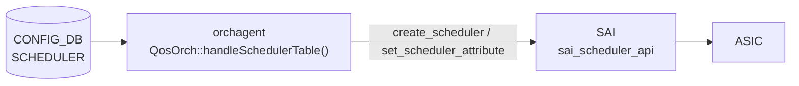

# SCHEDULER — QosOrch SchedulerOrch コード由来デフォルト詳解

## 概要

`orchagent` の `QosOrch::handleSchedulerTable()` が CONFIG_DB `SCHEDULER` テーブルを処理する。各フィールドは**存在する場合のみ** SAI 属性リストに追加され、省略時は SAI 実装のベンダーデフォルトに委ねられる。YANG で宣言された `default` 値は qosorch が参照しない点が重要である[^1]。

本ページは [`SCHEDULER テーブル`](scheduler.md) の orchagent 処理詳解ページである。テーブル全体の概要・key 構造・フィールド一覧は [`SCHEDULER テーブル`](scheduler.md) を参照。

<!-- cdb-mermaid -->
### データフロー



!!! note "凡例"
    各フィールドは存在する場合のみ SAI 属性として送信される。省略フィールドは SAI ベンダーデフォルトになる。
<!-- /cdb-mermaid -->

<!-- defaults -->
## コード由来のデフォルト・暗黙挙動 (Phase A)

> **調査根拠**: `sonic-swss/orchagent/qosorch.cpp` `handleSchedulerTable()` L1347–1509 全行精読 + `qosorch.h` L22, 44–53 定数定義確認 + `sonic-scheduler.yang` 照合 (2026-05-15)

| フィールド | YANG default | qosorch 実装の実効デフォルト | 備考 |
|-----------|-------------|--------------------------|------|
| `type` | `WRR` | **SAI ベンダー依存**（省略時 SAI 属性送信なし） | YANG default は qosorch 未参照 |
| `weight` | `1` | **SAI ベンダー依存**（省略時 SAI 属性送信なし） | `(uint8_t)stoi()` キャスト、YANG `range "1..100"` 未検証 |
| `priority` | なし | **dead field — エントリ全破棄** | 処理分岐が存在しない。SET すると `Unknown field:priority` → `task_invalid_entry` で**全フィールドが SAI 未反映** |
| `meter_type` | `bytes` | **SAI ベンダー依存**（省略時）; 不正値で **orchagent クラッシュ** | `scheduler_meter_map.at()` が `std::out_of_range` 未キャッチ |
| `cir` / `cbs` / `pir` / `pbs` | なし | 省略時 SAI デフォルト相当（0 = 無制限） | 存在時のみ設定。YANG `must` 制約はコード未検証 |

### `type` フィールドの詳細

```cpp
// qosorch.cpp L1378–1397
if (fvField(*i) == scheduler_algo_type_field_name)   // "type"
{
    attr.id = SAI_SCHEDULER_ATTR_SCHEDULING_TYPE;
    if      (fvValue(*i) == scheduler_algo_DWRR)   attr.value.s32 = SAI_SCHEDULING_TYPE_DWRR;
    else if (fvValue(*i) == scheduler_algo_WRR)    attr.value.s32 = SAI_SCHEDULING_TYPE_WRR;
    else if (fvValue(*i) == scheduler_algo_STRICT) attr.value.s32 = SAI_SCHEDULING_TYPE_STRICT;
    else {
        SWSS_LOG_ERROR("Unknown scheduler type value:%s", fvField(*i).c_str());
        return task_process_status::task_invalid_entry;  // エントリ全体が破棄される
    }
    sai_attr_list.push_back(attr);
}
```

- **省略時**: `SAI_SCHEDULER_ATTR_SCHEDULING_TYPE` は SAI attr リストに追加されない → SAI ベンダーデフォルト（保証なし）
- **未知の値**: `task_invalid_entry` を返し、`sai_attr_list` に積まれた他フィールドの属性も **SAI に反映されない**

### dead field 詳細: `priority`

`sonic-scheduler.yang` に `leaf priority { type uint8 { range "0..9"; } }` が定義されているが、`qosorch.h` には対応する定数が存在しない[^2]:

```
// qosorch.h L44–53 に scheduler_priority_field_name 定数なし
const string scheduler_algo_type_field_name     = "type";
const string scheduler_algo_DWRR                = "DWRR";
const string scheduler_algo_WRR                 = "WRR";
const string scheduler_algo_STRICT              = "STRICT";
const string scheduler_weight_field_name        = "weight";
const string scheduler_meter_type_field_name    = "meter_type";
const string scheduler_min_bandwidth_rate_field_name       = "cir";
const string scheduler_min_bandwidth_burst_rate_field_name = "cbs";
const string scheduler_max_bandwidth_rate_field_name       = "pir";
const string scheduler_max_bandwidth_burst_rate_field_name = "pbs";
// ← priority が存在しない
```

`handleSchedulerTable` の if-else チェーン (L1378–1438) に `priority` の処理分岐がなく、最後の `else` ブランチ (L1436–1439) にフォールスルーする:

```cpp
// qosorch.cpp L1436–1439
else {
    SWSS_LOG_ERROR("Unknown field:%s", fvField(*i).c_str());
    return task_process_status::task_invalid_entry;
}
```

> **重要**: `priority` フィールドを含む SCHEDULER エントリを CONFIG_DB に SET すると `Unknown field:priority` エラーで `task_invalid_entry` が返り、そのエントリの `type` / `weight` / `meter_type` 等を含む**全フィールドが SAI に反映されない**。回避策は CONFIG_DB から `priority` フィールドを除外すること。

### `meter_type` クラッシュリスク

```cpp
// qosorch.cpp L1407
sai_meter_type_t meter_value = scheduler_meter_map.at(fvValue(*i));
```

`scheduler_meter_map` は `{"packets": SAI_METER_TYPE_PACKETS, "bytes": SAI_METER_TYPE_BYTES}` のみ。`"packets"` / `"bytes"` 以外の値を渡すと `std::map::at()` が `std::out_of_range` 例外をスロー。**例外はキャッチされておらず orchagent プロセスがクラッシュする**。

`type` フィールドが graceful エラー処理 (`task_invalid_entry` を返す) をしているのと対照的な危険な挙動。YANG enum で 2 値のみが許可されているため通常経路では発生しないが、`sonic-db-cli` 等で直接 CONFIG_DB に書き込む際は要注意。

### 新規作成 vs 更新の挙動差異

| 状況 | SAI 呼び出し | 省略フィールドの扱い |
|------|------------|-------------------|
| 新規作成（SAI オブジェクトなし） | `create_scheduler()` に全属性まとめて渡す | SAI 作成時のベンダーデフォルトが適用 |
| 既存更新（SAI オブジェクトあり） | `set_scheduler_attribute()` を属性ごとに個別呼び出し | 省略フィールドは現在の SAI 属性値を保持（変更なし） |

!!! warning "更新時の注意"
    既存オブジェクトを更新する場合、省略したフィールドは変更されない。`type` を `WRR` → `STRICT` に変更するだけであれば `type` フィールドのみ SET すれば足りるが、`meter_type` を意図せず変更したくない場合は省略で安全。

### 削除保護ロジック

```cpp
// qosorch.cpp L1483–1488
if (gQosOrch->isObjectBeingReferenced(QosOrch::getTypeMap(), qos_map_type_name, qos_object_name))
{
    SWSS_LOG_NOTICE("Can't remove object %s due to being referenced (%s)", ...);
    (*(m_qos_maps[qos_map_type_name]))[qos_object_name].m_pendingRemove = true;
    return task_process_status::task_need_retry;
}
```

QUEUE 等から参照中の SCHEDULER を削除しようとすると `task_need_retry` を返し `m_pendingRemove = true` にセット。参照が解除されると次回 retry 時に自動削除される。

<!-- /defaults -->

<!-- ordering -->
## 書込み順依存 (Phase B)

### ADD 時: SCHEDULER → QUEUE の順が必須

`QUEUE` エントリの `scheduler` フィールドを書き込む前に、参照先の `SCHEDULER|<name>` エントリが CONFIG_DB に存在していなければならない。`handleQueueTable()`（`qosorch.cpp`）は `resolveFieldRefValue()` で参照先オブジェクトを解決し、SCHEDULER が未登録の場合は `task_need_retry` を返す。SCHEDULER SAI オブジェクトが生成されるまで QUEUE の SAI バインドは保留される[^3]。

```
SCHEDULER|<name>  ──SET──>  QUEUE|<port>|<idx>  (scheduler: <name>)
```

### DEL 時: QUEUE 参照解除 → SCHEDULER 削除の順が必須

`handleSchedulerTable()` の DEL ハンドラは、削除前に `isObjectBeingReferenced()` でその SCHEDULER を参照している QUEUE が存在しないかを確認する。参照が残っている場合は `m_pendingRemove = true` をセットして `task_need_retry` を返す。SAI scheduler profile は参照が解除されるまで削除されない[^3]。

```
QUEUE|<port>|<idx> の scheduler 参照を解除  ──DEL──>  SCHEDULER|<name>
```

### 再設定時: pending 状態に注意

DEL が `m_pendingRemove` 状態のまま同一名の SET を発行すると、SET も `task_need_retry` で保留される。QUEUE 参照の解除 → DEL の完了（SAI destroy 成功）を待ってから SET を発行すること[^3]。

### `config qos reload` では自動担保

`config qos reload` が使用する `qos_config.j2` テンプレートは SCHEDULER ブロック（`scheduler` セクション）を QUEUE ブロック（`queue` セクション）より先に展開するため、CLI 経由の一括適用では順序問題は発生しない。個別エントリを `sonic-db-cli` 等で直接投入する場合のみ上記の順序制約を意識する必要がある[^3]。

[^3]: QosOrch 実装 `handleSchedulerTable()` / `handleQueueTable()` / `isObjectBeingReferenced()`: `sonic-swss/orchagent/qosorch.cpp`. <https://github.com/sonic-net/sonic-swss/blob/4305596156d70e9797e8a881b3d19b46de0bce0d/orchagent/qosorch.cpp>

<!-- /ordering -->

<!-- cross-refs -->
## 暗黙参照テーブル (Phase C)

`SCHEDULER` エントリが処理される際に `QosOrch` が暗黙的に関与する他テーブルの依存関係を示す。

| 依存方向 | 参照元フィールド / 参照元 | 参照先テーブル | 参照先キー形式 | 依存内容 | 証跡 |
|---------|------------------------|--------------|--------------|---------|------|
| 逆参照（被参照） | `QUEUE.<port>\|<idx>.scheduler` | `SCHEDULER`（本テーブル） | `SCHEDULER\|<name>` | `handleQueueTable()` が `resolveFieldRefValue()` で SCHEDULER SAI オブジェクトを解決。SCHEDULER 未登録の場合は `task_need_retry` を返し QUEUE の SAI バインドを保留。YANG `sonic-queue.yang` でも `leafref path "...SCHEDULER_LIST/name"` として宣言 | `qosorch.cpp:1822-1852`, `sonic-queue.yang:84-87`, `sonic-queue.yang:132-135` |
| 逆参照（削除ガード） | `QUEUE.*` が参照中 | `SCHEDULER`（本テーブル） | `SCHEDULER\|<name>` | SCHEDULER DEL 時に `isObjectBeingReferenced()` で確認。QUEUE から参照中の場合は `m_pendingRemove = true` をセットして `task_need_retry`。参照解除後に自動 DEL が実行される | `qosorch.cpp:1483-1491` |
| 起動ガード | `PortsOrch::allPortsReady()` | PORT テーブル（PortsOrch 管理） | `PORT\|<port_name>` | `QosOrch::doTask(Consumer&)` 冒頭で `gPortsOrch->allPortsReady()` が偽の間は全 QoS タスク（SCHEDULER 含む）が処理されない。PortsOrch による全ポート初期化完了まで SAI オブジェクトは生成されない | `qosorch.cpp:2258-2261` |
| 実行時依存（QUEUE 経由） | `handleQueueTable()` → `applySchedulerToQueueSchedulerGroup()` | SCHEDULER_GROUP（SAI 管理） | SAI OID（DB なし） | QUEUE に SCHEDULER が紐付く際、`getSchedulerGroup()` でキュー→スケジューラグループ ID を検索し `SAI_SCHEDULER_GROUP_ATTR_SCHEDULER_PROFILE_ID` をセット。SAI 内部のスケジューラグループツリーに依存（DB テーブルなし） | `qosorch.cpp:1630-1710` |

### 解決タイミング

- **QUEUE → SCHEDULER 参照**: `handleQueueTable()` の SET 処理時に `resolveFieldRefValue()` で即座に確認。未解決（`not_resolved`）は `task_need_retry` で `m_toSync` に残留し、SCHEDULER の SAI 登録後の次回 `doTask()` で再評価される（`qosorch.cpp:1828-1833`）。
- **SCHEDULER DEL ガード**: DEL 処理時に `isObjectBeingReferenced()` でリアルタイム確認。参照カウンタがゼロになった次の `task_need_retry` サイクルで自動 DEL が実行される（`qosorch.cpp:1483-1491`）。
- **PortsOrch ガード**: PortsOrch の `allPortsReady()` フラグが立つまで全 QoS 処理は doorbell 待ち。この間は SCHEDULER エントリが CONFIG_DB に存在しても SAI には送信されない（`qosorch.cpp:2258-2261`）。

!!! note "SCHEDULER は「被参照専用」テーブル"
    SCHEDULER エントリ自体は他の CONFIG_DB テーブルを参照しない（leafref なし）。依存の方向は常に外部テーブル → SCHEDULER であり、SCHEDULER を先に投入してから参照側テーブルを投入するのが正しい順序である。

<!-- /cross-refs -->

## YANG-実装 Discrepancy まとめ

| フィールド | YANG 定義 | qosorch 実装 | 分類 |
|-----------|---------|-------------|------|
| `type` | `default WRR` | 省略時 SAI ベンダー依存 | YANG default 不適用 |
| `weight` | `default 1; range "1..100"` | 省略時 SAI ベンダー依存; range 未検証 | YANG default 不適用 + バリデーション欠如 |
| `priority` | `uint8 { range "0..9"; }` | **dead field**（Unknown field → task_invalid_entry） | YANG 定義あり、実装なし — 重大乖離 |
| `meter_type` | `default bytes` | 省略時 SAI ベンダー依存; 不正値でクラッシュ | YANG default 不適用 + クラッシュリスク |
| `cir/cbs/pir/pbs` | `must` 制約あり | 存在時のみ設定; `must` 制約未検証 | YANG 制約不適用（CONFIG_DB バリデーション層のみ） |

## 購読者

- `QosOrch`: `CFG_SCHEDULER_TABLE_NAME` を `SubscriberStateTable` で購読し `handleSchedulerTable()` でハンドリング[^1]

## 関連 CONFIG_DB / YANG / CLI

- 関連 [CONFIG_DB](../../reference/glossary.md#term-config_db): `QUEUE`（`scheduler` leafref）、`PORT_QOS_MAP`
- 関連 CLI: なし（`config qos reload` 経由のバルク投入のみ）
- 関連 [YANG](../../reference/glossary.md#term-yang): `sonic-scheduler`

<!-- ref-triangle:start -->

## 関連リファレンス

- [CONFIG_DB](../../reference/glossary.md#term-config_db): [`SCHEDULER テーブル`](scheduler.md)
- [YANG](../../reference/glossary.md#term-yang): [`sonic-scheduler`](../yang/sonic-scheduler.md)

<!-- ref-triangle:end -->

## 引用元

[^1]: QosOrch 実装 `handleSchedulerTable()`: `sonic-swss/orchagent/qosorch.cpp`. <https://github.com/sonic-net/sonic-swss/blob/4305596156d70e9797e8a881b3d19b46de0bce0d/orchagent/qosorch.cpp>
[^2]: フィールド名定数定義 `qosorch.h`: `sonic-swss/orchagent/qosorch.h`. <https://github.com/sonic-net/sonic-swss/blob/4305596156d70e9797e8a881b3d19b46de0bce0d/orchagent/qosorch.h>

<!-- ops-hint -->
## 運用ヒント

### priority フィールドに関する注意

YANG スキーマに `priority` リーフが定義されているため、設定ツールが自動生成するエントリに `priority` が含まれる場合がある。この場合 QosOrch は `Unknown field:priority` エラーでエントリ全体を破棄する。`sonic-db-cli CONFIG_DB hgetall 'SCHEDULER|<name>'` で既存エントリを確認し、`priority` フィールドが存在する場合は `hdel` で削除した後に再設定する。

### 確認コマンド

```bash
# SCHEDULER エントリ一覧
sonic-db-cli CONFIG_DB keys 'SCHEDULER|*'

# 特定エントリの確認（priority フィールドの有無を確認）
sonic-db-cli CONFIG_DB hgetall 'SCHEDULER|scheduler.0'

# orchagent のエラーログ確認
sudo grep -i "Unknown field\|scheduler" /var/log/swss/orchagent.log | tail -20
```
<!-- /ops-hint -->
